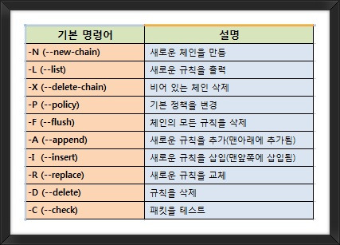
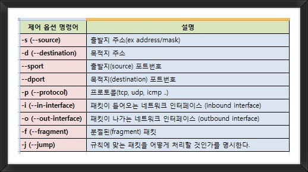

## 리눅스 서버의 방화벽 확인 및 관리

리눅스에서는 호스트 방화벽 기능을 위해 보통 iptables 을 많이 사용합니다. CentOS7 이상은 기본적으로 iptables 이 아닌 firewalld 를 사용하도록 되어 있으며 Ubuntu 에서는 UFW(Ubuntu Firewall)를 사용해 방화벽 서비스를 제공합니다.

하지만 iptables에 익숙한 사용자들이 많아 firewalld 대신 iptables 을 이용하는 경우가 여전히 많고 UFW는 iptables의 프론트엔드 역할을 수행하므로 iptables 에 대한 기본적인 이해가 필요합니다.

```
참조 : iptables , firewalld 와 netfilter 의 관계

실제 iptables 는 방화벽의 역할처럼 패킷을 차단, 허용하는 등의 필터링 기능을 직접 수행하는 것은 아니며
리눅스 커널에 내장된 netfilter 라는 리눅스 커널 모듈을 통해 실제로 필터링이 이루어집니다.

iptables 는 netfilter 를 이용할 수 있도록 해주는 사용자 공간 응용 프로그램(User space Application) 입니다.

iptables 나 firewalld (CentOS) , UFW(Ubuntu) 모두 결국 netfilter에 대한 프론드엔드 역할이라고 생각하면 쉽습니다.
```

### 1. iptables 이해하기

시스템 관리자는 iptables 을 통해 서버에서 허용하거나 차단할 IP 나 서비스 포트에 대한 정책 (Rule) 을 수립합니다. 이렇게 수립된 정책은 정책 그룹으로 관리합니다. 정책 그룹은 서버 기준의 트래픽 구간별로 만드는데 여기서 말하는 트래픽 구간은 서버로 유입되는 구간 (INPUT) , 서버에서 나가는 구간(OUTPUT), 서버를 통과하는 구간 (FORWARD) 등을 말합니다.

그리고 이렇게 만들어진 방향성과 관련된 정책 그룹은 각 정책의 역할에 따라 다시 상위 역할 그룹에 속하게 됩니다.

정리하면 적책은 방향성에 따라 방향성과 관련된 정책 그룹을 분류하고 이렇게 분류된 그룹들은 역할과 관련된 정책 그룹으로 다시 묶이게 됩니다.

iptables 에서 개별 정책의 방향성에 따라 구분한 그룹ㅇ르 체인(Chain) 이라고 하며 체인을 역할별로 구분한 그룹을 테이블(Table) 이라고 합니다. 즉, 개별 정책의 그룹이 체인되고 체인 그룹이 테이블입니다.


iptables 에는 필터 (Filter) 테이블 , NAT 테이블 , 맹글(Mangle) 테이블 , 로(Raw) 테이블 , 시큐리티 (Security) 테이블 이렇게 5가지 테이블이 있습니다.


패킷을 허용하거나 차단하는 데 사용하는 테이블이 필터 테이블입니다. 여기서 다룰 리눅스의 호스트 방화벽은 이 필터 테이블을 통해 트래픽을 제어하는 것을 의미합니다.

테이블에는 방향성과 관련된 그룹이 있다고 했는데 이 그룹이 체인(Chain)입니다. 필터 테이블에는 서버로 들어오는 트래픽 , 나가는 트래픽 , 통과하는 트래픽에 따라 INPUT 체인 , OUTPUT 체인, FORWARD 체인이 있습니다. 각 체인에는 해당 체인에 적용될 방화벽 정책을 정의합니다. 각 정책에는 정책을 적용하려는 패킷과 상태 또는 정보 값과의 일치 여부 조건인 매치 (Match)와 조건이 일치하는 패킷의 허용 (Accept) 이나 폐기 (Drop) 에 대한 패킷 처리 방식을 결정하는 타깃(Target) 으로 구성됩니다.

리눅스에서 방화벽의 역할을 위해 사용되는 것을 정리하면 다음과 같습니다.

#### Filter 테이블

iptables 에서 패킷을 허용하거나 차단하는 역할을 선언하는 영역

#### INPUT , OUTPUT , FORWARD 체인

호스트 기준으로 호스트로 들어오거나 (INPUT) , 호스트에서 나가거나 (OUTPUT) , 호스트를 통과할 (FORWARD) 때 사용되는 정책들의 그룹, 패킷의 방향성에 따라 각 체인에 정의된 정책이 적용됨

#### Match

제어하려는 패킷의 상태 또는 정보 값의 정의 , 정책에 대한 조건

#### Target

Match (조건)와 일치하는 패킷을 허용할 지, 차단할지에 대한 패킷 처리 방식

### 2. 리눅스 방화벽 활성화/비활성화

iptables 을 구성하고 설정하는 방법에 대해 알아보겠습니다. CentOS 7 을 기준으로 진행하면 모든 예제는 IPv4 기준입니다.

CentOS 7 을 이후 버전부턴느 iptables 이 기본적으로 포함되지 않고 firewalld 가 활성화되어 있어 firewalld 서비스를 비활성화하고 iptables 를 설치해야 iptables 를 사용할 수 있습니다.

```
firewalld 비활성화 및 서비스 중단

# systemctl disable firewalld
# systemctl stop firewalld

iptables 설치
# dnf install iptables-services
```

service 명령어나 systemctl 명령어로 iptables 서비스를 활성화 합니다.

```
iptables 서비스 활성화 및 시작하기

# systemctl start iptables.service
```

### 3. 리눅스 방화벽 정책 확인

iptables 정책을 어떤 식으로 설정되는 iptables 의 기본 설정 값을 통해 알아보겠습니다. iptables 의 설정값을 확인하는 명령은 -L (--list) 옵션을 사용합니다.

```
iptables 정책 확인

# iptables -L

Chain INPUT (policy ACCEPT)
target     prot opt source               destination
ACCEPT     all  --  anywhere             anywhere             state RELATED,ESTABLISHED
ACCEPT icmp -- anywhere anywhere
ACCEPT all -- anywhere anywhere
ACCEPT tcp -- anywhere anywhere state NEW tcp dtp::ssh
REJECT all -- anywhere anywhere reject-with icmp-host-prohibited

Chain FORWARD (policy ACCEPT)
target     prot opt source               destination
REJECT all -- anywhere anywhere reject-with icmp-host-prohibited

Chain OUTPUT (policy ACCEPT)
target     prot opt source               destination
```

앞에서 알아보았던 INPUT , FORWARD , OUTPUT 체인별로 구분된 정책을 확인할 수 있습니다. 체인별로 기본값이 적용된 정책을 살펴볼 수 있는데 여기서는 외부에서 서버로 접근할 때 사용되는 체인 INPUT에 대해서만 살펴보겠습니다.

```
INPUT 체인 1번 정책

ACCEPT all -- anywhere anywhere state RELATED ESTABLISHED
```

첫 번째 허용 정책을 보면 RELATED , ESTABLISHED 상태인 모든 출발지에 대해 허용하도록 콜이 설정되어 있습니다. 이미 세션이 맺어져 있거나 (ESTABLISHED) 연계된 세션이 있을 때 어떤 출발지나 목적지인 패킷이더라도 허용하는 정책입니다.

FTP는 원시적인 프로토콜이어서 컨트롤 프로토콜과 데이터 프로토콜이 별도로 동작합니다. 처음 연결된 이후 로그온, 항목 리스트 등의 실제 파일을 다운로드하기 전까지는 컨트롤 프로토콜을 사용하고 실제로 데이터 다운로드 명령이 내려지면 별도로 세션을 만들어 다운로드를 시작합니다. 두 개의 연결이 별도로 이루어지다보니 방화벽 입장에서는 이 두 개의 연결을 연계시키지 못하면 제대로 통신을 할 수 없습니다.

RELATE state 를 이용해 이 두 가지의 연결을 하나로 간주하게 됩니다.

```
INPUT 체인 2번 정책

ACCEPT icmp-- anywhere anywhere
```

두 번째 허용 정책은 ICMP에 대한 허용 정책입니다. 이 정책을 통해 ping 과 같은 서비스를 사용할 수 있습니다.

```
INPUT 체인 4번 정책

ACCEPT tcp -- anywhere anywhere state NEW tcp dtp::ssh
```

네 번째 정책은 신규 세션인 NEW state 중 목적지 서비스 포트가 SSH 인 경우만 허용합니다. 간단히 표현하면 외부에서 서버로 SSH(22) 접속을 허용하는 정책입니다.

```
INPUT 체인 5번 정책

REJECT all -- anywhere anywhere reject-with icmp-host-prohibited
```

다섯번째 정책은 위의 첫번째부터 네번째 정책에 미치되지 않은 패킷들을 차단하는 정책입니다. INPUT 체인 자체는 기본 정책이 ACCEPT로 선언되어 있지만 이 정책 때문에 화이트리스트 기반 방화벽처럼 동작하게 됩니다.

REJECT는 곧바로 폐기하는 DROP 과 달리 ICMP 프로토콜을 이용해 패킷 차단 이유를 출발지에 전달합니다. 이때 icmp-port-unreachable이 전달되는데 --reject-with 옵션으로 ICMP 에러 유형을 지정할 수 있습니다.

iptables의 기본 룰에서는 icmp-host-prohibited 메시지를 이용해 해당 패킷이 차단되었음을 알려줍니다.

```
INPUT 체인 5번 정책

ACCEPT all -- anywhere anywhere
```

마지막으로 세 번째 정책입니다. 세번째 정책을 맨 마지막에 정리한 것은 다른 정책과 조금 다르기 때문입니다. iptables -L 의 내용으로 보면 모든 출발지의 모든 트래픽에 대해 허용하므로 마치 Any Open 정책처럼 보입니다.

하지만 실제로 외부에서 들어오는 패킷은 해당 정책을 거치지 않고 최하단의 DROP 정책에서 대부분 걸러집니다. 그 이유를 확인하기 위해 iptables 을 -L 옵션이 아닌 -S (또는 --list-rules) 옵션을 사용해 정책을 다시 확인합니다.

```
iptables 설정 확인

# iptables -S

-P INPUT ACCEPT
-P FORWARD ACCEPT
-P OUTPUT ACCEPT
-A INPUT -m state --state RELATED,ESTABLISHED -j ACCEPT
-A INPUT -p icmp -j ACCEPT
-A INPUT -i lo -j ACCEPT    (세번째 정책의 실제 내용)
-A INPUT -p tcp -m state --state NEW -m tcp --dport ssh -j ACCEPT
-A INPUT -j REJECT --reject-with icmp-host-prohibited
-A INPUT -p tcp -m tcp --dport 80 -j ACCEPT
-A FORWARD -j REJECT --reject-with icmp-host-prohibited
```

위의 내용이 세번째 정책의 실제 내용입니다. iptables 을 정의한 파일에서도 확인할 수 있으며 -S 옵션으로도 확인할 수 있습니다. 모든 정책에 대해 허용하는 것으로 되어 있지만 실제로 해당 정책이 적용되는 인터페이스가 루프백 인터페이스 (lo)임을 알 수 있습니다.

즉, 루프백 인터페이스에 대한 정책을 모두 허용하는 것이므로 일반 서비스 인터페이스의 패킷에는 적용되지 않습니다.

iptables 의 정책을 선언할 때 특정 인터페이스에 대해 적용하는 경우가 아니라면 -L 만으로도 현재의 정책을 확인할 수 있지만 실제 정책이 어떻게 정의되어 있는지 확인하려면 -S 이나 iptables의 파일을 직접 확인해야 합니다.

### 4. 리눅스 방화벽 정책 관리

지금부터는 iptables 정책을 추가하거나 삭제하는 예제를 통해 iptables 정책 관리 방법을 알아보겠습니다. 여기서 다루는 예제는 iptables 이 제공하는 모든 옵션과 기능을 다루지는 않지만 이 예제 내용을 기반으로 iptables 이 어떻게 동작하는지 이해한다면 iptables로 기본적인 방화벽 동작을 서버에 적용할 수 있습니다.

첫번째 예제는 iptables 에 웹 서비스가 가능하도록 http 서비스 포트를 열어주는 정책을 추가해보겠습니다. 첫번째 예제는 조금 자세히 설명하겠습니다.

```
iptables http 허용 정책 추가

# iptables -A INPUT -p tcp --dport 80 -j ACCEPT

-A INPUT : INPUT 체인에 정책 추가
-p tcp : TCP 프로토콜 사용
--dport 80 : 목적지 서비스 포트 지정 (80)
-j ACCEPT : 타깃 지정 (패킷 허용)
```

iptables 에 정책을 추가하려면 -A 나 -append 옵션을 사용합니다. 옵션 뒤에는 어떤 체인에 적용할 것인지를 지정합니다. 체인명 뒤에는 넣을 정책을 정의 (Rule Specification)합니다.

추가하는 정책이 어떤 프로토콜의 어떤 서비스 포트에 적용할 것인지, 또는 어떤 IP 주소나 인터페이스일지에 대해 전반적으로 정의합니다.

이 예제에서는 웹 서비스 포트를 오픈하려면 TCP 80 포트를 열어야 합니다. 먼저 프로토콜을 지정하기 위해 -p (또는 --protocol) 옵션을 사용합니다. 프로토콜을 지정할 때는 프로토콜 이름이나 프로토콜 번호 모두 사용할 수 있습니다. 여기서는 -p tcp 로 프로토콜을 지정했습니다. 추가로 목적지 포트를 제어하기 위해 --dport 옵션을 사용합니다. 출발지 포트는 --sport 옵션을 사용합니다. 예제는 웹 서비스를 위한 80포트이므로 '--dport 80' 으로 했습니다.

이 예제에서는 사용하지 않았지만 출발지나 목적지의 IP 주소를 제어하기 위해 -s (또는 --source) , -d (또는 --destination) 옵션을 사용할 수 있습니다. IP 주소에 대한 옵션은 특정 IP 주소로 한정하거나 주소 뒤에 서브넷 마스크를 적용해 네트워크로 적용할 수도 있습니다. IP 주소 설정을 별도로 하지 않으면 anywhere로 적용됩니다.

마지막으로 정책에 일치하는 패킷을 어떻게 처리할것인지를 정하는 타깃 지정은 -j 옵션을 사용합니다. 웹 서비스 80을 허용하기 위한 예제이므로 타깃을 ACCEPT 로 지정합니다.






이제 앞의 명령어를 통해 iptables 에 정책을 적용하고 해당 정책이 서버에 잘 반영되었는지 확인해보겠습니다. 서버에 웹 서비스를 활성화하고 웹 서비스 포트가 잘 열리는지 테스트해보면 외부에서 웹 서비스가 열리지 않는 것을 확인할 수 있습니다. 웹 서비스를 허용하는 정책을 iptables 에 추가하고 웹 서비스도 활성화되었는데 외부에서 웹 서비스에 정상적으로 왜 접근할 수 없을까요?

```
# iptables -L

Chain INPUT (policy ACCEPT)
target     prot opt source               destination
ACCEPT     all  --  anywhere             anywhere             state RELATED,ESTABLISHED
ACCEPT     icmp --  anywhere             anywhere
ACCEPT     all  --  anywhere             anywhere
ACCEPT     tcp  --  anywhere             anywhere             state NEW tcp dpt:ssh
REJECT     all  --  anywhere             anywhere             reject-with icmp-host-prohibited
ACCEPT     tcp  --  anywhere             anywhere             tcp dpt:http

Chain FORWARD (policy ACCEPT)
target     prot opt source               destination
REJECT     all  --  anywhere             anywhere             reject-with icmp-host-prohibited

Chain OUTPUT (policy ACCEPT)
target     prot opt source               destination
```

iptables 의 INPUT 체인을 보면 방금 추가한 정책이 맨 아래에 있는 것을 확인할 수 있습니다. 앞에서 알아보았듯이 새로 입력한 정책 바로 위에 웹 서비스를 포함한 모든 서비스를 차단하도록 설정되어있습니다. iptables 뿐만 아니라 모든 방화벽 정책과 네트워크 장비의 access-list 는 상단의 정책부터 순서대로 확인해 일치하는 정책이 있으면 해당 정책이 바로 적용되므로 iptables에 정책을 추가할 때는 반드시 적절한 위치를 확인해야 합니다.

```
참고

iptables은 세부적인 정책이 먼저 적용되는 방식이 아니라 상단의 정책이 하단의 정책보다 먼저되는 탑다운(Top Down)방식으로 적용됩니다.
iptables 을 구성할 때 정책을 어떻게 설정하는지도 중요하지만 어느 위치에 설정할 것인지도 매우 중요합니다.
```

웹 서비스가 차단되는 현재 상태에서 웹 서비스를 허용하도록 변경하기 위해 방금 설정한 정책을 삭제하고 정책을 다시 추가해보겠습니다. iptables 의 정책 삭제는 -A 대신 -D 나 --delete옵션을 사용합니다.

```
iptables 정책 삭제

# iptables -D INPUT -p tcp --dport 21 -j ACCEPT
```

삭제한 이후에는 -L 옵션을 사용해 정책이 삭제되었는지 확인하는 것이 좋습니다. 정책이 너무 많을때는 -L 옵션으로 일치하는 정책이 있는지 확인하기 어려우므로 -C 나 --check 옵션을 사용해 해당 정책이 있는지 확인할 수도 있습니다. -L 옵션처럼 전체 정책을 모두 확인하는 것이 아니라 일치하는 정책이 있는지 확인하는 옵션입니다. -C 옵션에서 일치하는 정책이 없으면 다음과 같은 오류 메시지가 뜹니다.

```
iptables -C 옵션 오류 메시지

# iptables -C INPUT -p tcp --dport 21 -j ACCEPT
iptables: Bad rule (does a matching rule exist in that chain?).
```

이제 웹 서비스 포트를 오픈하기 위한 정책을 다시 만들어보겠습니다. 현재 REJECT에 대한 정책을 삭제하고 등록할 수도 있지만 보안상 맨 마지막 룰은 항상 있어야 하므로 REJECT 정책 위에 HTTP 서비스를 허용하는 정책을 만들겠습니다. 특정 위치에 정책을 추가하려면 정책의 줄 번호 (Line Number)를 지정해야 합니다. 기본 정책 확인 명령어로는 방화벽 정책의 줄 번호를 확인할 수 없으므로 -L 옵션뒤에 --line-number 옵션을 추가해 현재 정책의 줄 번호를 확인합니다.

```
iptables --line-number 옵션

# iptables -L --line-number
Chain INPUT (policy ACCEPT)
num  target     prot opt source               destination
1    ACCEPT     all  --  anywhere             anywhere             state RELATED,ESTABLISHED
2    ACCEPT     icmp --  anywhere             anywhere
3    ACCEPT     all  --  anywhere             anywhere
4    ACCEPT     tcp  --  anywhere             anywhere             state NEW tcp dpt:ssh
5    REJECT     all  --  anywhere             anywhere             reject-with icmp-host-prohibited

Chain FORWARD (policy ACCEPT)
num  target     prot opt source               destination
1    REJECT     all  --  anywhere             anywhere             reject-with icmp-host-prohibited

Chain OUTPUT (policy ACCEPT)
num  target     prot opt source               destination
```

정책을 순서 없이 기존 iptables 에 추가할 때는 -A 옵션을 사용했지만 특정 위치에 정책을 추가하기 위해서는 -I나 --insert 옵션을 사용합니다. -I 옵션을 사용하면 해당 정책 줄 번호 위치에 정책이 삽입되고 그 번호에 해당하는 정책부터 뒤의 모든 정책은 정책 줄 번호가 하나씩 뒤로 밀립니다. 여기서는 5번째 안에 정책을 추가하면 되므로 5번째에 정책을 다시 추가해보겠습니다.

```
iptables -I 또는 --insert 옵션

# iptables -I INPUT 5 -p tcp --dport 80 -j ACCEPT
```

-A로 정책을 추가할 때는 맨 마지막에 정책이 자동으로 추가되므로 줄 번호를 입력할 필요가 없지만 -I는 줄 번호가 필요하므로 정책이 추가될 체인 뒤에 정책 줄 번호를 입력합니다. 정책이 추가된 후 정책 상탤르 다시 확인합니다.

```
# iptables -L --line-numbers
Chain INPUT (policy ACCEPT)
num  target     prot opt source               destination
1    ACCEPT     all  --  anywhere             anywhere             state RELATED,ESTABLISHED
2    ACCEPT     icmp --  anywhere             anywhere
3    ACCEPT     all  --  anywhere             anywhere
4    ACCEPT     tcp  --  anywhere             anywhere             state NEW tcp dpt:ssh
5    ACCEPT     tcp  --  anywhere             anywhere             tcp dpt:http
6    REJECT     all  --  anywhere             anywhere             reject-with icmp-host-prohibited

... 후략
```

정상적으로 5번째 항목에 웹 서비스를 열어주는 정책이 추가된것을 확인할 수 있습니다. 기존에 5번째에 위치하던 차단 정책은 6번째로 뒤로 밀린것도 확인할 수 있습니다. 이제 웹 서비스에 다시 접속해보면 웹 서비스가 정상적으로 열리는 것을 확인할 수 있습니다.

```
특정 서비스 포트에 대해 특정 IP만 허용  1

# iptables -A INPUT -i eth0 -p tcp -s 172.16.10.10/32 --dport 22 -j ACCEPT
# iptables -A INPUT -i eth0 -tcp --dport 22 -j DROP
```

서버 보안을 강화하기 위해 서버 접근 통제와 같은 솔루션에서만 서버로 SSH 접속을 가능하게 하고 나머지에 대해서는 SSH 접속을 차단할 수 있습니다. 앞의 예제는 172.16.10.10이 서버 접근 통제 솔루션이라고 가정하고 해당 출발지에서만 본 서버로 SSH(TCP 22번 포트) 접근이 가능하도록 설정하고 나머지 모든 출발지에 대해서는 SSH 접속을 차단한 예제입니다.

```
특정 서비스 포트 (1521)에 대해 특정 IP 만 허용

# iptables -A INPUT -i eth0 -p tcp -s 172.16.10.11/32 --dport 1521 -j ACCEPT
# iptables -A INPUT -i eth0 -tcp --dport 1521 -j DROP
```

SSH 접속뿐만 아니라 오라클 데이터베이스 디폴트 리스너 (TCP 1521포트)에 대한 접근 통제 솔루션에서도 iptables을 동일한 방식으로 적용할 수 있습니다.

```
IP 주소를 범위로 지정1

# iptables -A INPUT -p all -m iprange --src-range 192.168.0.0-192.168.255.255 -j DROP
```

iptables 에서 IP주로를 서브넷과 함께 지정할 수도 있지만 범위 형태로 출발지나 목적지의 IP 주소를 지정할 수 있습니다. 서브넷으로 지정하는 경우, 서브넷으로 표한 가능한 IP 주소만 가능하지만 범위로 지정할 때는 원하는 범위를 직접 지정하면 되므로 다음과 같이 범위를 적용할 수도 있습니다.

다음 명령어는 192.168.1.11 ~ 192.168.2.15 범위 IP 를 접근하는 것을 차단합니다.

```
IP 주소를 범위로 지정 2

# iptables -A INPUT -p all -m iprange --dst-range 192.168.1.11 ~ 192.168.2.15 -j DROP
```

주소를 범위로 지정하는 방법은 다음과 같습니다.

```
iptable 에서 주소를 범위로 지정하는 방법

# ... -m iprange --src-range 시작IP주소-끝IP주소
# ... -m iprange --dst-range 시작IP주소-끝IP주소
```

IP 주소를 범위로 지정하듯이 서비스 포트도 범위로 지정할 수 있습니다. 다음 명령어는 목적지 포트 3001번부터 3010번까지 범위의 포트 접근을 차단합니다

```
서비스 포트를 범위로 지정 1

# iptables -A INPUT -p tcp -m multiport --dports 3001:3010 -j DROP
```

범위뿐만 아니라 ','를 사용해 필요한 개별 포트를 나열해 iptables 에 적용할 수 있습니다. 다음은 4001 , 4003, 4005 출발지 포트 주소를 가지는 패킷을 차단합니다

```
서비스 포트를 범위로 지정 2

# iptables -A INPUT -p tcp -m multiport --sports 4001 , 4003 , 4005 -j DROP
```

예제처럼 대부분 출발지 포트를 기반으로 룰을 설정하는 경우는 매우 드뭅니다. 출발지 포트는 지정되지 않고 클라이언트 상황에 따라 변경되기 때문입니다. 출발지 포트를 강제로 지정하는 경우를 제외하고 대부분의 방화벽 룰은 도착지 포트를 기반으로 지정됩니다.

-F 옵션을 사용하면 iptables에 적용된 정책을 한께번에 삭제할 수 있습니다.

```
iptables 정책 전체 삭제

# iptables -F
또는
# iptables --flush
```

-P 옵션은 각 체인의 기본 정책을 변경합니다.

```
체인의 기본 정책 변경

# iptables -P INPUT DROP
# iptables -P FORWARD DROP
# iptables -P OUTPUT DROP
```

하지만 이렇게 iptables 에 정책을 설정하면 서버를 재부팅하거나 iptables 서비스를 재시작하면 iptables 정책이 초기화됩니다. 마치 리눅스에서 라우팅 테이블을 관리하는 것과 동일하게 영구적으로 적용하려면 정책을 iptables 파일에 직접 설정해야 합니다. iptables 정책 파일은 다음의 위치에 있습니다.

```
iptable 기본 설정 파일

[위치] /etc/sysconfig/iptables

# cat /etc/sysconfig/iptables
# Generated by iptables-save v1.8.4 on Fri May 16 12:00:00 2025
*filter
:INPUT ACCEPT [0:0]
:FORWARD ACCEPT [0:0]
:OUTPUT ACCEPT [0:0]

# 기본 정책 및 허용 규칙
-A INPUT -m state --state RELATED,ESTABLISHED -j ACCEPT
-A INPUT -p icmp -j ACCEPT
-A INPUT -i lo -j ACCEPT
-A INPUT -p tcp -m state --state NEW -m tcp --dport 22 -j ACCEPT
-A INPUT -p tcp -m tcp --dport 80 -j ACCEPT
-A INPUT -j REJECT --reject-with icmp-host-prohibited

-A FORWARD -j REJECT --reject-with icmp-host-prohibited

COMMIT
# Completed on Fri May 16 12:00:00 2025
```

영구적인 iptables 정책 관리를 위해서는 이 파일을 이용해 정책을 추가하거나 삭제하면 됩니다.

### 5. 리눅스 방화벽 로그 확인

iptables 도 일반 방화벽과 마찬가지로 로그를 통해 iptables 정책에 의해 차단되거나 허용된 내용을 확인할 수 있습니다. iptables 의 로그는 /var/log/messages 에 남으므로 메시지 파일을 보면 다음과 같은 로그 내용을 확인할 수 있습니다.

```
# tail -f /var/log/messages
```

하지만 메시지 파일에는 iptables 로그 외에 다른 로그들도 포함되어 있습니다. iptables 로그만 보려면 다음과 같은 설정이 필요합니다.

먼저 rsyslog.conf 설정 파일에 다음과 같이 추가합니다. rsyslog 는 리눅스에서 사용하는 로그 수집 서버입니다.

```
# nvim /etc/rsyslog.conf

... 후략
kern.* /var/log/iptables.log (추가)
```

rsyslog 서비스를 재시작합니다.

```
# systemctl restart rsyslog.service
```

iptables 에 로그를 남길 수 있도록 설정합니다. 여기서는 warning 수준의 로그를 남기기 위해 log-level 을 4로 했고 로그를 구분하는 식별자로 '## ZIGI-Log ##' 를 설정했습니다.

```
# iptables -I INPUT -j LOG --log-level 4 --log-preifx '## ZIGI-Log ##'
```

특정 정책에 대한 로그만 남기고 싶다면 iptables 에 정책을 추가할 때처럼 프로토콜이나 서비스포트와 같은 옵션을 사용하면 됩니다. 그리고 --log-prefix 옵션을 사용하지 않아도 로그를 남길 수 있지만 저렇게 prefix 를 정해두면 로그를 구분할 수 있어 편리합니다.

이제 iptables.log 파일을 확인해보면 정상적을 iptables에 대한 로그를 확인할 수 있습니다.

```
# tail -f /var/log/iptables.log
```

iptables 정책을 확인하는 -L 옵션 뒤에 -V 옵션을 사용하면 다음과 같이 통과하는 패킷과 바이트 수를 확인할 수 있습니다.

```
iptables 통과하는 패킷과 바이트 수를 확인
# iptables -L -v
Chain INPUT (policy ACCEPT 123 packets, 9876 bytes)
 pkts bytes target     prot opt in     out     source               destination
  456 34567 ACCEPT     all  --  *      *       0.0.0.0/0            0.0.0.0/0           state RELATED,ESTABLISHED
   23  1840 ACCEPT     icmp --  *      *       0.0.0.0/0            0.0.0.0/0
   12   960 ACCEPT     all  --  lo     *       0.0.0.0/0            0.0.0.0/0
   45  3780 ACCEPT     tcp  --  *      *       0.0.0.0/0            0.0.0.0/0           state NEW tcp dpt:ssh
   30  2400 ACCEPT     tcp  --  *      *       0.0.0.0/0            0.0.0.0/0           tcp dpt:http
    0     0 REJECT     all  --  *      *       0.0.0.0/0            0.0.0.0/0           reject-with icmp-host-prohibited

Chain FORWARD (policy ACCEPT 0 packets, 0 bytes)
 pkts bytes target     prot opt in     out     source               destination
    0     0 REJECT     all  --  *      *       0.0.0.0/0            0.0.0.0/0           reject-with icmp-host-prohibited

Chain OUTPUT (policy ACCEPT 234 packets, 19024 bytes)
 pkts bytes target     prot opt in     out     source               destination
```

이번 장에서는 리눅스 서버의 방화벽 설정을 위한 iptables 에 대해 간단히 알아보았습니다. iptables 은 여기서 다룬 간단한 방화벽 기능뿐만 아니라 IP 주소와 서비스 포트 외에도 다양한 인자 값을 이용해 복잡한 정책을 수립할 수 있습니다. 하지만 운영 망에서는 서버의 앞단에 방화벽이나 IPS , IDS 와 같은 보안 장비가 운용되고 있어 호스트 방화벽 자체를 내리는 경우도 많습니다.

하지만 내부망에서 악성 코드가 전파되는 것을 방지하고 내부 보안 강화를 위해 단말에서도 복잡하지 않은 기본 방화벽 룰을 운영하는 것이 최근 추세입니다.

iptables 관련 내용은 보안 강화를 위해 서비스 장애 때 장애 해결을 위해 꼭 알아두어야 할 항목입니다. 한단계 나아가 iptables 의 동작 방법에 대한 이해는 보안 장비 동작 방식을 이해하는 데 큰 도움이 될 것입니다.

##### iptables 더 알아보기

iptables 은 테이블 (Table) , 체인 (Chain) , 타깃 (Target) 3가지로 구성되어 있습니다.

1. 테이블 <br/>
   iptables 에는 filter , nat , mangle , raw , security 테이블 (Table) 이 있습니다. 각 테이블에 대해 살펴보면

   1. filter 테이블 <br/>
      filter 테이블은 앞에서 알아보았듯이 방화벽의 기본 기능인 패킷을 차단하거나 허용할 목적으로 사용됩니다. filter 테이블에서는 서버로 들어오거나 나가는 트래픽을 제어할 수 있도록 INPUT , OUTPUT 체인을 사용합니다. 리눅스를 보안 장비로 사용하는 단말을 통과하는 트래픽을 제어할 수 있는 FORWARD 체인도 사용할 수 있습니다.

   2. nat 테이블 <br/>
      nat 테이블은 출발지와 목적지의 IP를 변환하는 NAT 기능을 위한 테이블입니다. NAT 기능에는 출발지 주소를 변경하는 Source NAT와 목적지 주소를 변경하는 Destination NAT이 있습니다. Source NAT을 할때는 POSTROUTING 체인을 사용하고 Destination NAT을 할 때는 PREROUTING 체인을 사용합니다. PREROUTING , POSTROUTING 체인은 말 그대로 라우팅 이전과 이후에 존재하는 체인입니다. 라우팅 작업에서는 도착지 주소만 확인하므로 목적지 주소를 변경하는 Destination NAT는 라우팅 작업 이전에 수해오디어 라우팅 작업을 거친 후 목적지로 전송됩니다.

   3. mangle 테이블 <br/>
      mangle 테이블은 주로 패킷 헤더의 TOS , TTL 값을 변경하는 역할을 하는데 네트워크 보안 장비로 사용될 때를 제외하면 자주 사용되지는 않습니다.

   4. raw 테이블 <br/>
      raw 테이블은 연결 추적 시스템 (Connection Tracking System)에서 처리하면 안되는 패킷을 표시하는 용도로 사용됩니다. raw 테이블은 PREROUTING , OUTPUT 체인이 있지만 RAW 테이블도 mangle 테이블처럼 자주 사용되지는 않습니다.

   5. security 테이블 <br/>
      security 테이블은 필수 접근 제어 (Mandatory Access Control , MAC) 네트워크 규칙에 사용됩니다. 필수 접근 제어는 SELinux 와 같은 리눅스 보안 모듈에 의해 구현됩니다. security 테이블은 filter 테이블 이후에 호출되며 filter 테이블과 마찬가지로 INPUT 체인 , OUTPUT 체인 , FORWARD 체인을 제공합니다.

2. 체인 <br/>
   CHAIN 은 특정 패킷에 대해 적용할 정책을 정의한 것이라고 볼 수 있습니다. 예를 들어 패킷의 허용 (Accept) , 차단 (Reject) , 폐기 (Drop) 를 결정하는 정책의 집합 (A Set of Rules)이라고 할 수 있습니다.
   <br/>
   iptables 에는 input chain , forward chain , output chain , prerouting chain , postrouting chain 과 같은 다양한 chain 이 있습니다.
   <br/>
   input 체인은 외부로 부터 iptable 이 동작하는 호스트로 패킷이 통과하는 체인이며 반대로 호스트에서 나가는 패킷이 통과하는 체인이 output 체인입니다.
   <br/>
   목적지가 호스트가 아니라 패킷이 호스트를 통과할 때는 사용하는 체인을 forward 체인이라고 합니다. 일반적인 서비스 목적의 호스트라면 forward 체인을 통과하지 않겠지만 라우터, 방화벽과 같이 네트워크에서 패킷을 포워딩하는 기능을 제공하는 호스트라면 forward 체인의 역할을 지정할 수 있습니다.
   <br/>
   prerouting 체인과 postrouting 체인은 이름처럼 라우팅 처리 전후에 동작하는 체인입니다. 실제 input 체인의 경우, 호스트로 들어와 라우팅 처리된 후 해당 체인이 동작합니다. 라우팅 처리 전후로 패킷을 수정해야 할 대는 prerouting/postrouting 체인에 선언해야 합니다.

3. 타깃
   타깃은 패킷이 iptables 에 정의한 정책과 같을 때 취하는 행동입니다. 기본적으로 타깃은 ACCEPT , REJECT , DROP이 많이 사용되며 특정 로그를 남기기위한 LOG , NAT를 위한 SNAT , DNAT 등 다양한 타깃을 설정할 수 있습니다.

   방화벽역할에 사용되는 주요 타깃은 다음과 같습니다.

   1. ACCEPT <br/>
      패킷을 정상적으로 처리
   2. REJECT <br/>
      패킷을 폐기하면서 패킷이 차단되었다는 응답메시지를 전송
   3. DROP <br/>
      패킷을 그대로 폐기
   4. LOG <br/>
      패킷을 syslog에 기록

4. iptables 실행 옵션
   이번 장에서는 많이 사용되는 -A , -D , -C , -I , -L 옵션에 대해서만 알아보았지만 그 외에도 더 많은 옵션을 사용할 수 있습니다.


5. 정책 옵션
   패킷을 제어하기 위해 정책을 만들 때, 매치되는 조건을 설정하는 데 이번절의 예제에서는 IP 와 서비스 포트 , 상태 정보 , 타깃 처리 방법에 대해서만 간단히 알아보았습니다. 패킷을 더 세밀히 제어할 때는 다므의 옵션을 사용할 수 있습니다. IP 주소 , 서비스 포트 , 인터페이스 , 상태 등은 별로 옵션값을 주지 않으면 Any 로 인식합니다.

|         옵션         |                         설명                         |
| :------------------: | :--------------------------------------------------: |
|    -s (--source)     |           출발지 ip 주소나 네트워크와 매치           |
|  -d (--destination)  |           목적지 ip 주소나 네트워크와 매치           |
|   -p (--protocol)    |                 특정 프로토콜과 매치                 |
| -i (--in-interface)  |                   입력 인터페이스                    |
| -o (--out-interface) |                   출력 인터페이스                    |
|       --state        |                   연결 상태와 매치                   |
|       --string       |     애플리케이션 계층 데이터 바이트 순서와 매치      |
|      --comment       | 커널 메모리 내의 규칙과 연계되는 최대 256바이트 주석 |
|      -y (--syn)      |                    SYN 패킷 불허                     |
|   -f (--fragment)    |            두 번째 이후의 조각 규칙 명시             |
|     -t (--table)     |                    처리될 테이블                     |
|     -j (--jump)      |           규칙에 맞는 패킷 처리 방법 명시            |
|     -m (--match)     |                  특정 모듈과의 매치                  |

## 위녿 서버의 방화벽 확인 및 관리

### 1. 윈도 방화벽 활성화/비활성화

제어판 > 시스템 및 보안 > Windows Defender 방화벽 (인바운드 , 아웃바운드 설정)
[생략...]
