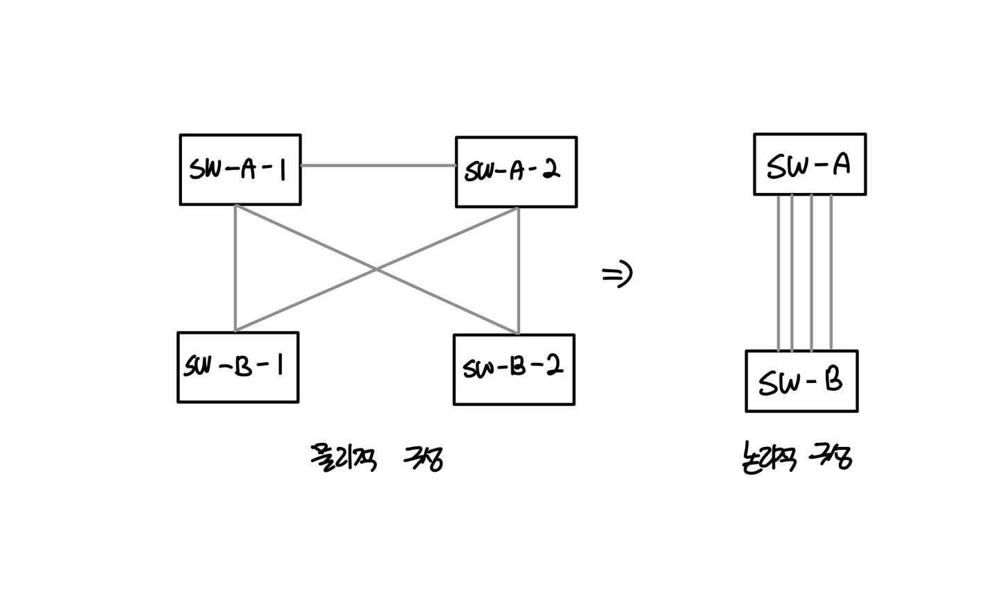
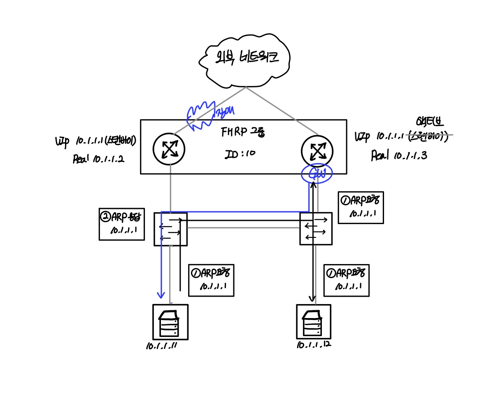

# 이중화 기술

## 이중화 기술 개요

이중화를 하지 않았을 때 발생하는 SPoF(Single Point of Failure) 문제점과 이중화의 목적부터 차례대로 살펴보겠습니다.

### 1. SPoF

단일 장애점(單一障礙點, 영어: single point of failure, SPOF)은 시스템 구성 요소 중에서, 동작하지 않으면 전체 시스템이 중단되는[1] 요소를 말한다. 예를 들어 이더넷 케이블과 전원, 이더넷 허브(HUB), 접속 단말들의 NIC(Network Interface Card) 등으로 이루어진 간단한 이더넷(Ethernet) 네트워크 시스템에 있어서 네트워크 허브(HUB) 장치의 전원은 SPOF이다. 허브의 전원이 차단됨과 동시에 나머지 모든 요소들은 네트워크를 사용할 수 없다. 높은 가용성을 추구하는 네트워크, 소프트웨어 애플리케이션, 상용 시스템에 단일 장애점이 있는 것은 바람직하지 않다. 단일 고장점, 단일 실패점이라고도 한다.

> 출처 : 위키백과 -SPoF

서비스를 제공하기 위한 인프라의 주요 목표 중 하나는 적시에 서비스를 출시하기 위해 인프라를 신속히 제공하는 것입니다. 소위 , 타임 투 마켓 (Time-To-Market)을 위한 인프라의 민첩성입니다.

하지만 인프라의 더 본질적인 목표는 더 가용성 높은 서비스에 필요한 인프라를 안정적으로 제공하는 것입니다. 인프라를 설계할 때 가용성 , 연속성 , 안정성 등의 항목을 보는 것도 인프라를 안정적으로 제공하는 데 필요한 주요 지표이기 때문입니다.

따라서 인프라를 설계할 때, 단일 접점의 장애가 전체 서비스에 영향을 미치지 않도록 SPoF(단일 장애점)을 만들지 않아야 합니다.

다음 그림과 같이 인프라가 설계되어 있다면 다수의 SPoF 때문에 하나의 장애가 전체 서비스 장애로 연결됩니다.


이처럼 SPoF 는 전체 서비스의 가용성, 연속성 , 안정성을 떨어뜨리는 매우 위험한 요소이므로 인프라를 안정적으로 운용하려면 인프라를 설계할 때, SPoF 를 최소화하는 것이 아니라 아예 만들어지지 않도록 설계해야 합니다.

### 2. 이중화의 목적

인정적인 서비스 제공을 위해 네트워크를 포함한 모든 인프라에서 반드시 갖추어야 할 요소 중 하나는 이중화입니다. 인프라를 구성하는 각 요소가 복수 개 이상으로 인프라를 구성해 특정 인프라에 문제가 발생하더라도 이중화된 다른 이프라를 통해 서비스가 지속되도록 해줍니다.

서비스에 필요한 출발 지점부터 끈 지점까지 (End to End) 속하는 모든 인프라에 이중화 구성을 고려해야 합니다. 서비슬르 위한 물리적 또는 가상 머신 서버, 서버와 네트워크 장비를 구성해주는 인터페이스 , 서버에 연결된 스위치 , 다수 서버의 부하 분산을 윟나 L4/L7 스위치 , 방화벽 , 인터넷 게이트웨이 , 인터넷 회선 등 인프라의 모든 요소가 이중화 구성이 필요한 항목들입니다. 심지어 이 모든 요소가 속한 데이터 센터 자체도 이중화가 필요해 DR 센터 (Disaster Recovery Center , 재해복구센터)나 액티브-액티브 데이터 센터를 구축합니다.


이런 이중화 구성은 각 구성 요소가 동시에 운영 중인 상태로 동작할 것인지, 하나의 구성 요소는 운영 상태이고 다른 하나는 대기 상태로 있다가 운영 상태인 인프라에 장애가 발생하면 대기 상태인 인프라가 운영 상태로 전환될 것인지에 따라 액티브-액티브 또는 액티브-스탠바이 형태로 구성합니다.

4절 STP 절에서 설명한 스위치의 스패닝 트리 프로토콜은 가용한 링크를 루프 방지를 위해 동시에 사용하지 않고 단일 경로를 통해 트래픽이 통과하고 정상 구간의 장애가 발생한 경우에만 차단되었던 경로를 다시 활성화해 사용하므로 Active Standby 형태로 구성된 이중화 기술이라고 볼 수 있습니다.

물론 인프라를 굳이 이중화하지 않더라도 장애가 발생하지 않는다면 평소 서비스 제공에는 아무 문제가 없으나 복수의 비용을 투자하면서 인프라를 이중화해야 하는 이유는 무엇일까요?

인프라가 이중화되어있다면 특정 지점에 문제가 발생하더라도 이중화된 인프라를 이용해 서비스할 수 있습니다. 특정 인프라의 장애 상황에서도 서비스는 가능하므로 서비스의 연속성이 보장되고 이것을 폴트 톨러런스 (Fault Tolerance (FT) : 장애 허용 , 결함 감내) 가 보장된다고 말하기도 합니다.

액티브-스탠바이가 아닌 액티브-액티브로 구성할 때는 이중화된 인프라에서 서비스 요청을 동시 처리할 수 있으므로 처리 가능한 전체 용량이 증가합니다. 이중화된 인프라는 장비 간 네트워크 연결이나 회선의 대역폭이 증가합니다.

다만, 이렇게증가된 인프라 용량을 기준으로 서비스를 수용하면 특정 지점에 장애가 발생했을 때, 인프라 용량이 절반으로 떨어지므로 정상적인 서비스가 불가능합니다.

예를 들어 서버에서 12G 트래픽을 처리해야 하는 경우 , 스위치와 서버 간 연결이 10G 두 개의 네트워크 카드를 이용해 액티브-액티브로 이중화되어 잇다면 이때 평소에는 부하 분산을 통해 네트워크 카드별로 약 6G씩 나누어 처리되므로 문제가 없지만 두 개 중 하나의 네트워크 카드에서 장애가 밣생하면 12G 의 트래픽을 하나의 10G 네트워크 카드로 모두 수용할 수 없게 됩니다. 즉, 인프라 이중화를 구성할 대, 이중화된 인프라 중 하나에서 장애가 발생하면 서비스에 필요한 용량이 인프라에서 제공할 수 있는 용량을 초과하므로 결국 서비스에 문제가 발생합니다.

이것은 앞에서 말했던 서비스의 가용성이나 연속성을 보장하지 못하는 구성이 되는것입니다.

이어서 이중화 구현을 위한 다양한 기술에 대해 알아보겠습니다.

## LACP

1990년대 중반까지는 각 벤더별로 장비 간 대역폭을 늘리기 위해 독자적인 방법으로 구현했지만 벤더 독자적인 방법으로는 다른 장비끼리 연결할 때 호환성 문제가 발생해 1997년 11월, IEEE 802.3 그룹이 이 문제를 해결하기 위해 상호호환 가능 연결 계층 (Link Layer) 표준화를 시작했습니다.

이 표준화가 바로 LACP (Link Aggregation Control Protocol) 입니다. 2000년에 802.3ad 로 초기 출시되었고 2008년에 IEEE 802.1AX--2008로 옮겨 졌습니다.

Link Aggregation 의 목적은 대역폭 확장을 통한 다음의 두가지를 제공하는 것이라고 IEEE802.1AX-2008에 명시되어 있습니다.

1. 링크 사용률 향상 (improved Utilization of Available Link)
2. 향상된 장애 회복 (improved Resilience)

LACP를 사용하면 두 개 이상의 물리 인터페이스로 구성된 논리 인터페이스를 이용해 모든 물리 인터페이스를 액티브 상태로 사용합니다. 이것을 통해 스위치와 스위치 또는 스위치와 서버 간 네트워크 대역폭이 물리 인터페이스 수량만큼 확장됩니다.

또한, 논리 인터페이스를 구성하는 물리 인터펭시ㅡ 중 일부에서 문제가 발생하더라도 나머지 물리 인터페이스로 서비스를 유지해주빈다.

액티브-스탠바이가 아닌 액티브-액티브 상태이므로 인터페이스 절체로 인한 지연 없이 서비스를 제공합니다.

LACP를 구성할 때 유의 사항이 있습니다. LACP는 액티브-액티브 구조이므로 LACP로 구성하는 논리 인터페이스의 대역폭을 서비스에 필요한 전체 트래픽 기준으로 서비스 트래픽을 산전하면 안됩니다.

예를 들어 1.5G를 수용해야 할 때 액티브-스탠바이 구조로 1.5G를 수용하려면 액티브-스탠바이 각각 2G 이상 대역폭을 확보해 구성해야 합니다. LACP를 사용해 액티브-액티브로 구성하면 모든 인터페이스를 동시에 사용할 수 있어 1G 두개를 묶어 2G로 구성할 수 있지만 하나의 물리 인터페이스의 문제로 장애가 발생하면 대역폭이 1G만 남으므로 정상적인 서비스를 제공하지 못하게 됩니다. 따라서 LACP를 구성해 액티브-액티브 구조로 만들더라도 이런 부분을 고려해 대역폭을 산정해야 합니다.

LACP를 구성할 때 또 다른 유의 사항은 LACP로 구성하는 물리 인터페이스드르이 속도가 동일해야한다는 것입니다. 즉, 1G 인터페이스는 1G 인터페이스 가넹만 LACP가 구성되고 1G 와 10G처럼 서로 다른 인터페이스로 LACP 를 구성할 수 없습니다.

### 1. LACP 동작 방식

LACP를 통해 장비 간 논리 인터페이스를 구성하기 위해 LACPDU(LACP Data Unit)라는 프레임을 사용합니다.

LACPDU에는 LACP를 구성하기 위한 출발지 주소, 목적지 주소, 타입 , 서브 타입, 버전 정보 등을 포함해 매초마다 주고받습니다.

LACPDU는 멀티캐스트를 이용하고 LACPDU의 목적지 주소는 "01:80:c2:00:00:02"부터 "01:80:c2:00:00:10"까지 사용합니다.

LACP가 연결되려면 LACPDU를 주고받는 장비가 한 장비여야 합니다. 즉, LACP를구성하는 두 개 이상의 물리 인터페이스가 서로 다른 장비에 연결되어 있으면 LACP를 통한 링크 이중화 구성을 할 수 없습니다. (서로 다른 장비를 이용해 LACP를 구성하는데 사용하는 기술인 MC-LAG는 11절.4에서 다룹니다.)


> LACP 구성은 장비간 1:1 구성에서만 가능하다.

LACP는 두 장비 간 LACPDU 패킷을 주고받으면서 구성되는데 한쪽 장비에서만 LACP를 설정하면 어떻게 될가요? LACP 논리 인터페이스를 구성하려면 LACPDU 패킷을 주고받아야하는데 이때 LACP 설정이 있는 장비에서만 LACPDU를 상대방 장비로 보낼 수 있습니다.

반대편 장비에서 LACPDU를 수신하지만 LACP 설정이 없어 LACPDU를 보내지 않고 수신한 LACPDU에 대한 응답도 보내지 않습니다. 결국 이런 경우 정상적인 LACPDU가 오가지 않았으므로 LACP구성이 되지 않습니다.


> LACP 는 두 장비 모두 LACP 설정을 해 LACPDU를 주고받아야 가능하다

LACP를 설정할 때는 다음 두 개 모드가 있습니다.

|  모드  |                               동작                                |
| :----: | :---------------------------------------------------------------: |
| 액티브 | LACPDU를 먼저 송신하고 상대방이 LACP로 구성된 경우 , LACP 를 구성 |
| 패스브 |  LACPDU를 송신하지 않지만 LACPDU를 수신받으면 응답해 LACP를 구성  |

보통 액티브 옵션을 사용하므로 LACPDU를 상대방 장비에 보내거나 받습니다. 패시브 옵션인 경우에는 LACPDU를 먼저 보내지 않지만 상대방이 보내온 LACPDU에 대한 응답을 통해 LACP가 구성됩니다.

즉, LACP를 구성한 모든 장비에서 LACPDU를 보내는 것은 아니지만 LACPDU를 받기를 기다리고 있고 단방향이라도 LACPDU를 받아 정상적인 LACPDU를 교환하면 LACP가 구성됩니다. 다만 양 단 장비 모두 패시브로 설정하면 LACPDU를 아무도 먼저 보내지 않으므로 정상적으로 LACP연결이 되지 않습니다.


LACP로 구성될 수 있는 인터펭시ㅡ 수는 장비에 따라 조금씩 다르지만 일반적으로 1~8개로 구성됩니다. 물론 장비에 따라 16개 이상을 하나의 논리 인터페이스로 묶는 기능이 지원되기도 합니다. 그리고 LACP논리 인터페이스를 구성하는 물리 인터페이스들은 반드시 동일한 속도의 인터페이스로 구성해야 합니다.

즉, 1G 두개의 인터페이스를 묶어 2G로, 10G 인터페이스 네개를 묶어 40G로 구성할 수 있지만 1G 한 개와 10G 한 개를 묶어 11G와 같은 논리 인터페이스는 만들 수 없습니다.

### 2. LACP 와 PXE

두 네트워크 장비 간 LACPDU를 통한 협상을 통해 LACP가 동작합니다. 서버와 액티브-액티브 형태로 인터페이스 이중화를 구성할 때도 LACPDU를 사용합니다. 이번 장 마지막에서도 다루지만 서버의 인터페이스를 하나의 논리 포트로 묶는 본딩 (Bonding) / 티밍 (Teaming) 기술은 서버 운영체제에서 설정하게 됩니다.

하지만 PXE(Pre-boot eXecution Environment)를 이용할 때는 서버가 운영체제를 설치하기 전 단계이므로 본딩과 티밍과 같은 논리 인터페이스를 설정할 수 없습니다. 뒤에서 다루겠지만 LACP설정은 본딩과 티밍에서 액티브-액티브로 사용하기 위한 옵션 설정이므로 운영체제 설치 전에는 LACP를 사용할 수 없습니다.

이 경우, 네트워크 장비에서는 서버로부터 LACPDU를 수신할 수 없으므로 해당 인터페이스는 정상적으로 활성화되지 않습니다. 따라서 LACP로 구성하려는 서버를 PXE로 운영체제를 설치할 때는 LACP인터페이스가 아닌 일반 인터페이스로 구성해 운영체제를 설치하고 운영체제에서 LACP설정을 다시 한 후 스위치 포트 설정을 다시 변경해야 합니다.

이것을 해결하기 위해 네트워크 장비에서 LACP를 설정할 때, 일정 시간동안 LACPDU를 수신하지 못하면 한 개의 인터페이스만 활성화하고 LACPDU가 다시 수신되기 시작하면 두 개 인터페이스를 모두 활성화할 수 있는 옵션을 제공합니다.

밑의 그림들은 운영체제가 설치되지 않은 서버와 스위치 간의 LACP 구성 상황에서 PXE Boot 를 지원하도록 스위치가 설정된 상황에서 어떻게 LACP가 동작하는 지 보여줍니다.

[그림 435쪽]

```
        ---> LACPDU
스위치                  서버
        <--- LACPDU (X)
```

> 초기 운영체제 구성 전에는 서버에서 LACPDU를 보낼 수 없다.

스위치에서는 LACP로 구성되어 있지만 서버는 운영체제가 설치되기 전입니다. 따라서 LACP가 구성되지 않았으므로 LACPDU를 송신하지 못합니다.

[그림 436쪽]

```
      <-- PXE 패킷 -->
스위치                  서버
```

> 스위치에서 LACPDU를 수신하지 못했을 때, 인터페이스 한 개만 활성화해 PXE Boot를 실행한다.

스위치는 LACPDU를 수신하지 못했으므로 인터페이스 한 개만 정상적으로 활성화해 통신을 시작하고 이것을 통해 서버는 PXE로 운영체제를 설치하고 설정합니다.

[그림 436쪽]

```
        ---> LACPDU
스위치                  서버
        <--- LACPDU
```

> PXE로 운영체제를 설치하고 LACPDU를 주고받으면 LACP로 구성이 변경된다.

운영체제가 서버에 정상적으로 설치된 후 LACP 구성을 마칩니다. 이제 서버는 LACPDU를 보내게 되고 스위치와 서버는 LACP로 구성됩니다.

벤더마다 이 기술을 부르는 명칭은 조금씩 다르지만 유사한 역할을 수행할 수 있습니다. 다음은 이 기술을 부르는 벤더별 명칭입니다.

|        벤더         |         기술명          |
| :-----------------: | :---------------------: |
|        Cisco        | lacp suspend-individual |
|       Arista        |      lacp fallback      |
|       Extreme       |      lacp fallback      |
| Extreme(구 Brocade) |        force-up         |
|       Juniper       |        force-up         |
|         HP          |     lacp edge-port      |

## 서버의 네트워크 이중화 설정 (Windows, Linux)

이번 장에서는 서버의 네트워크 이중화 설정 모드에 따른 동작 방식을 알아보고 운영체제별로 서버 네트워크 이중화를 구성하는 방법을 살펴보겠습니다.

네트워크의 LACP 설정 부분에서 인터페이스 이중화에 사용되는 기술 명칭은 벤더별로 다른 것을 살펴보았는데 마찬가지로 서버에서도 인터페이스 이중화에 사용되는 기술 명칭은 윈도와 리눅스에 따라 다음과 같이 다르게 부릅니다.

1. 윈도우 : 팀/team/티밍/teaming
2. 리눅스 : 본드/bond/본딩/bonding

서버 인터페이스를 이중화하면 네트워크 장비와 마찬가지로 논리 인터페이스가 생성됩니다. 이때 생성되는 논리 인터페이스의 이름이 각 운영체제의 네트워크 이중화의 기술명입니다. 예를 들어 윈도는 팀이라는 논리 인터페이스가 만들어지며 이 기술을 티밍이라고 하고 리눅스는 본드라는 논리 인터페이스가 만들어지고 이 기술을 본딩이라고 합니다.

```
참고 : 리눅스 티밍?

레드햇 리눅스7부터는 네트워크 이중화를 위한 본딩 이외에 티밍이라는 기술도 추가되었지만
아직은 본딩을 주로 사용하며 티밍이 본딩을 대체하는 것은 아니므로 본서에서는 본딩으로만 다룹니다.
```

서버의 인터페이스 이중화 구성은 네트워크 인터페이스 이중화와 다릅니다. 네트워크 장비에서 네트워크 이중화를 위해 두 개 이상의 물리 인터페이스를 하나의 논리 인터페이스로 구성하면 각 인터페이스가 모두 활성화되는 액티브-액티브 상태가 욉니다. 하지만 서버는 하나의 논리 인터페이스를 만드는 것이 액티브-액티브의 사용을 의미하는 것은 아닙니다.

네트워크 장비에서처럼 서버에서도 LACP를 사용한 액티브-액티브 구성이 가능하지만 서버의 네트워크 이중화 구성에서 선택할 수 있는 동작 모드 중 하나일 뿐입니다.

다음은 윈도와 리눅스 서버의 네트워크 이중화에 대해 간단히 줄인 내용입니다.

|     구분     |                        윈도                        |                                                리눅스                                                 |
| :----------: | :------------------------------------------------: | :---------------------------------------------------------------------------------------------------: |
|    기술명    |                        티밍                        |                                                 본딩                                                  |
| 인터페이스명 |                    team #1 , #2                    |                                            bond 0 , bond 1                                            |
|   동작모드   | Switch Independent <br/> LACP <br/> Static Teaming | 0 : 라운드 로빈 <br/> 1 : 액티브-스탠바이 <br/> 2 : balance-xor <br/> 3 : 브로드캐스트 <br/> 4 : LACP |

운영체제에 따라 지원되는 동작모드는 다르지만 이중화된 인터페이스를 액티브-액티브로 사용할 것인지, 액티브-스탠바이로 사용할 것인지만 대략적으로 고려해도 됩니다.

### 1. 리눅스 본딩 모드

리눅스 본딩 모드는 모드 0~4까지 있습니다. 여러 본딩 모드가 있지만 실무에서는 이중화를 구성할 때, 액티브-스탠바이로는 모드 1 을 사용하고 액티브-액티브로는 모드 4를 사용하며 나머지 모드는 보통 잘 사용하지 않습니다. 여기서는 모드 1과 모드 4에 대해서만 알아봅니다.

#### 모드 1 : 액티브-스탠바이

인터페이스를 액티브-스탠바이로 구성할 때는 모드 1을 사용합니다. 평소 액티브 인터페이스로만 패킷이 전달되지만 액티브가 죽으면 스탠바이 인터페이스가 자동으로 활성화되어 패킷을 전송합니다. 원래의 액티브 인터페이스가 다시 살아나면 설정에 따라 액티브 인터페이스가 자동으로 다시 활성화(Auto Fail Back)되거나 수동으로 넘기기 전까지 스탠바이 인터펭시ㅡ가 활성화 상태를 유지합니다.

#### 모드 4 : LACP

표준 프로토콜인 LACP를 이용해서 인터페이스를 액티브-액티브 방식으로 사용하고 싶은 때는 모드 4로 설정합니다.


> 리눅스 본딩 : 모드 4

그 밖에 다른 모드가 있지만 일반적으로 사용되지 않습니다.

### 2. 윈도 티밍 모드

윈도 티밍 모드는 7가지가 있지만 여기서는 현업에서 주로 쓰이는 두가지만 설명합니다.

#### 스위치 독립(Switch Independent) 구성

팀을 구성하는 맴버 인터페이스가 스위치의 구성에 독립적인 경우입니다. 즉, 스위치에서는 팀의 이중화에 관여하지 않는 구성이며 액티브-스탠바이 구성이라고 보면 됩니다.

#### LACP

리눅스 서버의 모드 4와 동일한 LACP 구성입니다. 표준 프로토콜인 LACP를 이용해 팀을 액티브-액티브로 구성할 때 사용합니다.

> 서버에서 인터페이스 이중화를 위해 본드, 팀을 구성할 때 액티브-스탠바이 모드인 경우에는 네트워크 장비에서 이중화 관련 인터페이스 설정을 별도로 하지 않습니다.

### 3. 리눅스 본드 설정 및 확인

리눅스는 운영체제 계열별로 설정방법이 다르므로 많이 사용되는 Fedora 계열의 CentOS와 Debian 계열의 우분투 설정법에 대해 알아보겠습니다. 먼저 CentOS에서 본드를 설정하는 방법을 설명하겠습니다.

#### CentOS에서 본드 설정 및 확인

CentOS의 본드 설정은 네트워크 설정 파일이 있는 디렉터리에 bond 인터페이스 파일을 생성하고 bond로 묶일 인터페이스에 추가 속성을 설정하는 방식입니다.

```
네트워크 설정 파일이 있는 디렉터리로 이동

# cd /etc/sysconfig/network-scripts
```

네트워크 설정 파일이 있는 디렉터리에서 bond 인터페이스 파일 ifcfg-bond0를 생성해 다음과 같이 설정합니다.

```
본드 인터페이스 생성 및 설정 (ifcfg-bond0)

DEVIECE=bond0
BOOTPROTO=none
onBOOT=yes
BOOTPROTO=static
IPADDR=10.10.0.11
NETMASK=255.255.255.0
GATEWAY=10.10.0.1
```

bond 인터페이스 파일을 설정했으면 물리 인터페이스 파일, ifcfg-eth0 , ifcfg-eth1 에도 bond 인터페이스 사용을 위한 추가 속성을 설정합니다. 여기서는 ifcfg-eth0의 설정만 있지만 ifcfg-eth1에 대해서도 동일하게 설정해주면 됩니다.

```
물리 인터페이스 설정 (ifcfg-eth0 , ifcfg-eth1)

DEVICE=eth0
BOOTPROTO=none
onBoot=yes
MASTER=bond0
SLAVE=yes
```

본드 인터페이스 설정을 마친후에는 bonding 설정 파일 위치로 이동해 속성을 변경합니다.

```
# cd /etc/modprobe.d/
```

다음은 bonding 설정 파일의 내용입니다.

```
# vi /etc/modprobe.d/bonding.conf

alias bond0 bonding
options bond0 mode-4 miimon=100
```

옵션에서 mode 는 앞에서 설명한 본드 구성에 대한 모드 번호이며 miimon 은 해당 밀리초마다 bond로 묶인 링크를 확인하는 옵션입니다. bond 모드의 기본값을 0(라운드 로빈)이며 miimon 값은 0(또는 1)입니다.

miimon이 0이면 인터페이스 상태를 체크하지 않아 페일오버(Fail-over)가 동작하지 않으므로 반드시 확인해 0이 아닌 값으로 변경해주어야 합니다. 그리고 위의 본드 모듈 설정 대신 ifcfg-bond0설정에 다음과 같이 본드 옵션을 추가해도 동일하게 동작합니다.

```
# vi /etc/sysconfig/network-scripts/bond0

... 중략
BONDING_OPTS="mode=4 miimon=100"
```

모드 1을 사용해 액티브-스탠바이 구성으로 본드를 구성할 때는 위의 옵션 값 외에 어떤 인터페이스를 액티브(primary 속성)로 사용할지에 대한 옵션을 추가 설정해야 합니다.

설정 대신 ifcfg-bond0 설정에 다음과 같이 bond 옵션을 추가해도 동일하게 동작합니다.

```
# vi /etc/sysconfig/network-scripts/bond0

... 중략
BONDING_OPTS="mode=4 miimon=100 primary=eth0"
```

리눅스 커널에 본드 모듈을 적재합니다.

```
# modprobe bonding
```

본드 인터페이스를 게이트웨이로 설정하고 싶다면 다음 설정을 추가합니다.

```
# vi /etc/sysconfig/network

GATEDEV=eth0
```

bond 인터페이스를 설정하거나 수정한 후에는 네트워크를 다시 시작해야 합니다.

```
# systemctl restart network
또는
# systemctl restart NetworkManager
```

본드 설정 및 네트워크 재시작후에는 본드가 정상적으로 잘 구성되었는지 확인합니다.

```
# cat /proc/net/bonding/bond0
```

#### 우분투에서 본드 설정 및 확인

우분투에서 본드를 설정하려면 먼저 ifenslave 패키지를 설치해야 합니다.

```
# apt-get install ifenslave
```

그리고 커널 모듈에 bonding 이라는 값이 있어야 합니다. 이 값은 부팅 시점에 적재되므로 만약 없다면 /etc/moduels 파일에 bondig 이라는 값을 추가하고 재부팅해야 합니다.

```
/etc/moduels

bonding
```

이제 본딩 설정을 위해 인터페이스 파일은 /etc/network/interfaces 에 인터페이스 eth0과 eth1을 bond0 인터페이스로 만들기 위한 설정을 다음과 같이 합니다.

```
/etc/network/interfaces

auto eth0
iface eth0 inet manual
    bond-master bond0

auto eth1
iface eth0 inet manual
    bond-master bond0

auto bond0
iface bond0 inet static
    address 192.168.1.10
    gateway 192.168.1.1
    netmask 255.255.255.0
    bond-mode 4
    bond-miimon 100
    bond-slaves none
```

## MC-LAG

LACP를 이용해 다수의 물리 인터페이스를 하나의 논리 인터페이스로 구성하는 방법을 알아보았습니다. LACP 동작 방식에서 알아보았지만 LACP를 구성할 때는 LACPDU를 주고 받는 장비 사옿 간 구성이 1:1이어야 합니다. 더 명확히 말하면 LACPㄹ르 구성할 때 MAC 주소가 1:1이어야 합니다.

그래서 서버에서 본딩이나 티밍과 같은 이중화 구성을 할 때, 각 네트워크 카드별로 물리 MAC 주소를 따로 사용하지 않고 두 개의 물리 MAC 주소 중 하나를 Primary MAC 주소로 사용합니다. 즉, 여러개의 물리 인터페이스를 쓰더라도 하나의 MAC 주소를 사용해 이 조건을 만족합니다.

서버에서 인터페이스를 두 개 이상 구성하더라도 상단 스위치가 한 대로 구성된 경우에는 상단 스위치에 장애가 발생하면 서버는 통신이 불가능해집니다. 이번 장 처음에 다룬 SPoF 구성이기 때문입니다. SPoF 구성을 피하려고 서버의 인터페이스를 서로 다른 스위치로 연결합니다. 서로 다른 스위치로 이중화 구성을 하면 두 스위치 간 MAC 주소가 달라 LACP를 사용할 수 없습니다. 따라서 서버에서도 본딩이나 티밍 모드를 액티브-스탠바이로 구성해 사용합니다.

밑의 그림은 SPoF 구성의 단일 스위치로 구성한 LACP입니다. 왼쪽은 정상 구성이고 가운데는 한 개의 링크에 장애가 발생한 경우이고 오른쪽은 스위치 장애로 서비스 장애가 발생한 경우입니다.


> SPoF 구성의 단일 스위치로 구성한 LACP

그렇다면 스위치에서도 서버 이중화 구성처럼 서로 다른 스위치 간의 단일 MAC 주소를 사용해 액티브-액티브 형태의 이중화 구성을 할 수 있을까요?

물론 가능합니다.

바로 MC-LAG(Multi Chassis Link Aggregation Group) 기술로 서로 다른 스위치 간의 실제 MAC 주소 대신 가상 MAC 주소를 만들어 논리 인터페이스로 LACP를 구성할 수 있습니다.


> MC-LAG 기술 이용 시 인터페이스의 물리적인 구성과 논리적인 구성

MC-LAG를 사용하면 단일 스위치로 LACP를 구성해 대역폭을 확장할 것인지, 서로 다른 스위치로 구성해 장비 이중화로 가용성을 확보할 것인지를 선택할 수 있게 됩니다.

MC-LAG은 실제 네트워크 벤더에 따라 기술명이 조금씩 다릅니다.

### 1. MC-LAG 동작방식

이번 절에서는 MC-LAG의 동작방식에 대해 알아봅니다. MC-LAG이 동작하는 방식은 MC-LAG을 구현하는 벤더마다 조금씩 다를 수 있어 여기서 다루는 MC-LAG 동작 방식은 모든 벤더 기술에 적용되지 않을 수 있습니다. 다만 벤더마다 세부적인 동작방식이 다르더라도 여기서 다루는 동작 방식 개념을 이해한다면 다른 동작 방식으로 구현된 벤더의 기술을 이해하는 데도 도움이 될 것입니다.

먼저 MC-LAG의 몇가지 구성 요소를 살펴보겠습니다.

1. 피어 (Peer) 장비
   MC-LAG 를 구성하는 장비를 피어(Peer) 장비라고 합니다.
2. MC-LAG 도메인 (Domain)
   두 Peer 장비를 하나의 논리 장비로 구성하기 위한 영역 ID 입니다. Peer 장비는 이 영역 ID를 통해 상대방 장비가 Peer를 맺으려는 장비인지 판단합니다.
3. 피어 링크 (Peer-Link)
   MC-LAG을 구성하는 두 Peer 장비 간의 데이터 트래픽을 전송하는 인터링크입니다.

밑의 그림은 MC-LAG의 구성요소를 나타낸 것입니다. 피어(Peer) 장비 1과 2는 피어 링크(Peer-Link)를 통해 연결되어 있고 각 피어 장비는 하나의 MC-LAG 도메인으로 묶입니다.


```
참고 : 벤더에 따라 다른 MC-LAG 구성

벤더에 따라 MC-LAG와 같은 기능을 위해 피어 링크처럼 데이터 트래픽을 전송하는 링크와
MC-LAG을 구성하기 위한 제어용 패킷을 전송하는 인터페이스를 별도로 구성하기도 합니다.
```

그럼 MC-LAG의 동작방식을 알아보기 위해 먼저 MC-LAG을 구성하는 방법을 개념적으로 알아보겠습니다.

MC-LAG을 구성하려면 피어들을 하나의 도메인으로 구성해야 합니다. 각 피어에는 동일한 도메인 ID 값을 설정합니다. 피어는 피어 간 데이터 트래픽을 전송하기 위한 피어 링크를 구성합니다. 피어 링크는 다양한 네트워크가 통신할 수 있는 경로이므로 보통 트렁크 (Trunk)로 구성합니다.

MC-LAG을 구성하려면 피어 장비 간의 MC-LAG 관련 제어 패킷을 주고받아야하는데 이 제어 패킷의 경로를 일반 데이터 트래픽 경로용의 인터링크인 피어 링크를 사용할 것인지, 별도의 제어 패킷을 위한 경로를 구성할 것인지에 따라 다음 두 가지 경우로 구성할 수 있습니다.

> 피어 링크를 이용한 제어 패킷 전송


피어 링크를 이용할 경우 위 그림 1번 처럼 각 피어의 VLAN 인터페이스 IP를 설정하고 이 IP 를 이용해 통신할 수 있습니다. 별도의 데이터 트래픽을 위한 인터페이스를 사용한다면 2번 그림처럼 해당 인터페이스를 L3 인터페이스로 구성해 이 인터페이스의 IP를 이용해 통신할 수도 있습니다.

여기까지 기본 MC-LAG에 대한 설정입니다. 정리하면 다음과 같습니다.

1. 피어에 동일한 도메인 ID 설정
2. 피어 간의 데이터 트래픽 전송을 위한 피어 링크 설정
3. 피어 간의 제어 패킷 전송을 위해 피어끼리 통신 가능한 IP 설정

MG-LAG 설정을 마치면 MC-LAG을 구성한느 두 피어 장비는 MC-LAG를 맺기 위한 제어 패킷을 주고 받습니다.


MC-LAG 제어 패킷을 통해 MC-LAG을 구성하기 위한 협상이 정상적으로 완료되면 두 대의 장비는 하나의 MC-LAG 도메인으로 묶이고 인터페이스 이중화 구성에 사용할 가상 MAC 주소를 피어 장비 간에 동일하게 생성합니다.


이렇게 두 피어 간 MC-LAG 구성을 마치면 MC-LAG 피어 장비들은 다른 장비 (서버나 스위치)와 LACP를 구성할 수 있습니다.

다음은 MC-LAG이 설정된 스위치가 LACP를 통한 이중화 구성을 어떻게 하는지에 대한 동작 방식을 알아보겠습니다.

> MC-LAG로 구성된 스위치가 LACP 구성을 위한 가상맥 CC로 LACPDU를 전송한다.


두 장비간에 LACP를 구성할 때는 각 장비의 MAC 주소가 출발지의 MAC 주소가 됩니다. 하지만 MC-LAG을 이용해 LACP를 구성할 때는 각 장비의 개별 MAC 주소가 아닌 MC-LAG을 구성할 때 생성된 가상 MAC 주소를 사용해 LACPDU를 전송합니다. 이렇게 장비의 개별 MAC 주소가 아닌 가상의 MAC 주소를 사용하므로 MC-LAG과 연결된 장비는 MC-LAG 피어들이 동일한 MAC 주소로 보이게 되고 서로 다른 장비로도 LACP를 통한 이중화 구성을 할 수 있습니다.

### 2. MC-LAG을 이용한 디자인

MC-LAG을 이용하면 LACP를 구성할 때, 서로 다른 장비를 하나의 장비처럼 인식시킬 수 있어 서로 다른 스위치로 서버를 액티브-액티브로 구성하여 루프나 STP(스패닝 트리 프로토콜)에 의한 차단 (BLOCK)이 없는 네트워크 구조를 만들 수 있습니다. 이번 절에서는 MC-LAG을 이용한 디자인 중 가장 많이 사용하는 3가지를 살펴보겠습니다.

1. MC-LAG을 이용해 서버를 연결하면 스위치를 물리적으로 이중화하면서 액티브-액티브 구성으로 연결할 수 있습니다.
   

2. 스위치 간의 MC-LAG를 이용하면 루프 구조가 사라지므로 STP에 의한 차단 포트 없이 모든 포트를 사용할 수 있습니다.
   

3. 스위치 간의 MC-LAG을 구성하는 또 다른 경우로, 상하단을 모두 MC-LAG으로 구성하는 디자인도 만들 수 있습니다.
   > MC-LAG를 양쪽에 모두 적용해 스위치 4대를 1:1 구조로 구성할 수 있다.



## 게이트웨이 이중화

### 1. 게이트웨이 이중화란?

특정 호스트가 동일한 서브넷에 있는 내부 네트워크와 통신할 때는 ARP(Address Resolution Protocol)를 직접 브로드캐스트해 출발지와 목적지가 직접 통신합니다. 이때 3계층 장비인 라우터의 도움 없이 직접 통신하므로 실무에서는 이것을 L2 통신이라고 부르기도 합니다.

목적지가 출발지 호스트의 서브넷에 포함되지 않은 외부 네트워크인 경우, 목적지와 통신하기 위해 게이트웨이를 통해야하는데 이런 통신을 L3 통신이라고 합니다.

따라서 호스트에 게이트웨이 설정이 되어 있지 않거나 잘못 설정된 경우에는 내부 네트워크 간에만 통신이 되고 외부 네트워크와는 통신이 되지 않습니다.

그럼 게이트웨이 장비에 장애가 발생하면 어떻게 될까요? 장애가 발생한 게이트웨이를 바라보는 하단의 호스트들은 게이트웨이와 통신할 수 없으므로 외부 네트워크와 통신할 수 없게 됩니다. 다음 경우가 그런 예입니다.


10.1.1.0/24 네트워크의 게이트웨이가 10.1.1.1이라고 할 때, 게이트웨이의 하단 호스트들은 10.1.1.1 장비를 통해 외부 네트워크와 통신합니다. 이때 10.1.1.1 의 IP 주소를 가진 게이트웨이 장비에 장애가 발생할 경우, 하단 호스트는 게이트웨이와 통신할 수 없으므로 외부 네트워크와 통신할 수 없습니다. 게이트웨이 장비 자체의 장애가 아닌 인터페이스, SFP와 같은 광 모듈이나 케이블에 문제가 발생하더라도 게이트웨이와의 통신이 끊기므로 외부 네트워크와 통신할 수 없습니다. 마찬가지로 게이트웨이와 연결된 하단 스위치의 장애와 같이 게이트웨이 장비로 가는 경로상 문제가 발생하면 다른 사례와 마찬가지로 외부 네트워크와 통신할 수 없습니다.

하지만 앞에서 언급한 3가지 장애 상황 모두 10.1.1.1 IP를 가진 장비와 동일하게 게이트웨이 역할을 수행할 수 있도록 외부 네트워크와 연결된 10.1.1.2 장비가 있음에도 불구하고 하단 호스트는 하나의 게이트웨이만 바라보므로 외부 네트워크 통신이 두절됩니다.

즉, 실제로 물리적으로는 외부 네트워크와 통신할 수 있는 또 다른 경로가 이중화되어 있지만 그 경로를 사용할 수 없어 통신이 두절되는 것입니다.

그럼 게이트웨이 역할을 하는 두 대의 장비가 하나의 IP 주소를 가지면 어떻게 될까요? 앞에서 배운 LACP 구성과 유사하게 하나의 IP 주소와 하나의 MAC 주소를 갖고 하단 호스트들이 그 가상 IP와 MAC 주소를 알 수 있다면 위의 3가지 예제와 같은 장애가 발생하더라도 통신할 수 있지 않을까요?

이런경우에 사용하는 프로토콜이 바로 FHRP(First Hop Redundancy Protocol)라는 게이트웨이 이중화 프로토콜입니다.


게이트웨이 이중화 프로토콜을 사용하면 두 라우터는 실제 IP 외에 추가로 가상 IP 주소와 가상 IP에 대한 MAC 주소를 동일하게 갖습니다. 게이트웨이 이중화 프로토콜의 가상 IP 는 그룹 내에서 우선순위가 높은 장비가 Active 상태로 유지하고 ARP 요청에 응답합니다.

하단 호스트들이 사용할 게이트웨이 IP 주소가 이 가상 IP 주소입니다. 게이트웨이 이중화 프로토콜 그룹 장비 중 가상 IP 에 대한 Active 상태를 가진 장비에 문제가 발생하면 Standby 상태인 장비가 Standby 에서 Active 상태로 변경됩니다.

호스트 입장에서는 게이트웨이 IP 주소를 가진 장비가 한 대 이상으로 구성되어 있어 Active 상태의 게이트웨이 장비에 장애가 발생하더라도 게이트웨이와의 통신이 끊기지 않으므로 외부 네트워크와 지속적인 통신을 할 수 있습니다.

```
참고 : 프록시 ARP

호스트에 게이트웨이 설정이 안되어 있거나 잘못 설정된 경우에도 장비에 프록시 (Proxy ARP)가 설정되어 있으면
호스트의 다른 네트워크와 통신할 수 있습니다.

하지만 이런 구성은 FHRP 프로토콜이 만들어지기 전에 사용하던 오래된 구성이고 여러가지 보안 문제가 발생할 가능성 때문에
프록시 ARP를 비활성화하는 것을 권고하고 있습니다.
```

### 2. FHRP

FHRP는 외부 네트워크와 통신하기 위해 사용되는 게이트웨이 장비를 두 대 상의 장비로 구성할 수 있는 프로토콜입니다.

FHRP를 이용해 FHRP 그룹 내의 장비가 동일한 가상 IP를 갖도록 설정하고 FHRP를 설정할 때는 우선순위 값을 이용해 어떤 장비가 가상 IP 주소에 대한 액티브 역할을 할 것인지 결정합니다.

FHRP 그룹의 장비는 물리적으로 다른 장비이지만 가상 IP와 가상 IP MAC 주소도 동일합니다. 우선 동작방식을 간단히 알아보겠습니다.

FHRP를 구성한 게이트웨이 장비는 각 장비가 동일한 그룹으로 인식하기 위해 같은 그룹 ID를 갖도록 설정합니다. 또한, 게이트웨이 주소로 사용할 동일한 가상 IP도 각 장비에 설정합니다. 그룹 ID 값은 이 가상 IP에 대한 MAC 주소를 생성하는 데 사용되므로 FHRP 장비는 동일한 가상 IP 와 가상 MAC 주소를 갖게 됩니다. 하단 호스트가 게이트웨이 주소(가상 IP 주소)로 ARP 요청을 보내면 이것은 브로드캐스트 통신으로 동일한 네트워크의 모든 장비로 전달되며 FHRP 그룹 장비 중 액티브 장비가 ARP 요청에 응답합니다.

하단 서버는 FHRP 그룹 장비 중 액티브 상태의 장비를 게이트웨이 장비로 인식하고 액티브 장비를 통해 다른 네트워크와 통신할 수 있습니다.

> 게이트웨이 이중화 시에 대한 ARP 요청과 응답


FHRP 그룹의 액티브 장비에 장애가 발생하면 스탠바이 장비는 액티브 장비가 비정상임을 확인한 수 가상 IP 주소에 대한 액티브 역할을 가져옵니다. 또한, 가상 IP 주소의 MAC 주소에 대한 MAC 주소 테이블을 갱싱해 하단 호스트들은 아무 설정 변경 없이 절체가 이루어집니다.

이 절체는 운영자의 개입 없이 자동으로 이루어지므로 하단 서버들은 외부와의 통신을 위한 게이트웨이에 대한 정보 변경이나 별도의 작업 없이 게이트웨이 장비의 페일오버를 수행해 서비스 연속성을 확보할 수 있습니다. 그리고 이 절체는 장비 자체의 장애뿐만 아니라 게이트웨이의 외부 인터페이스의 상태를 감지해 외부로 나가는 경로가 다운된 경우에도 게이트웨이의 액티브 역할을 스탠바이 장비에 넘겨줄 수 있습니다.

> 장비에 장애 발생시 액티브 역할은 스탠바이로 자동 전환된다.


> 장비의 외부 인터페이스 구간 장애인 경우에도 액티브로 전환할 수 있다.



FHRP 기술에 대한 표준 프로토콜은 VRRP(Virtual Router Redundancy Protocol)입니다.

VRRP는 표준 프로토콜이므로 게이트웨이 이중화 기술로서 거의 모든 벤더 장비가 VRRP 기능을 지원합니다. 네트워크나 보안 장비뿐만 아니라 일반 x86리눅스에서도 특정 패키지를 설치해 VRRP를 사용할 수 있습니다.

VRRP 외에도 각 벤더에서 자체 게이트웨이 이중화 기술을 구현하기도 합니다. 가장 많이 알려진 벤더 자체 개발 게이트웨이 이중화 기술은 시스코 시스템즈사의 HSRP(Hot Standby Router Protocol)입니다. 또는 자체 클러스터링 기술을 이용해 장비 IP 없이 가상 IP 한 개만 구성해 게이트웨이 이중화를 구현하는 경우도 있습니다.

```
리눅스 VRRP를 지원하는 Keepalived 패키지

https://www.keepalived.org/
```

이번장에서는 게이트웨이 이중화를 구현한 표준 프로토콜인 VRRP의 동작 방식과 설정 예제를 통해 게이트웨이 이중화의 동작 방식을 더 자세히 알아보겠습니다.

다음은 스위치 A와 스위치 B를 이용해 VRRP 설정이 된 장비 구성도입니다. VRRP그룹을 만들기 위해서는 VRID 값을 사용하는데 동일한 VRID를 설정한 장비가 하나의 VRRP 그룹으로 구성됩ㄴ디ㅏ.

다음예에서 스위치 A와 스위치 B는 동일한 VBRID 10을 설정해 두 개의 장비를 하나의 VRRP 그룹으로 묶었습니다. 스위치 A는 VRRP 그룹 10에 대한 우선순위 값이 110으로 설정하고 스위치 B는 우선순위 값을 별도로 설정하지 않았습니다. (별도로 설정하지 않으면 우선순위의 기본값은 100 입니다.)

> VRRP가 설정된 초기상태


VRRP 설정이 끝나면 VRRP의 마스터를 선출하기 위해 VRRP를 설정한 장비 간에 Hello 패킷을 주고받습니다. Hello 패킷은 기본 1초마다 전달하고 Hello 패킷에 있는 우선순위를 비교해 액티브가 될 마스터 장비를 선정합니다. Hello 패킷을 3회 이상 수신하지 못하면 상대방은 비정상으로 간주해 자신이 마스터 장비가 됩니다. Hello 패킷은 멀티캐스트 주소인 224.0.0.18을 사용합니다.

> VRRP로 마스터를 선출하기 위한 Hello 패킷 교환


스위치 A의 우선순위는 110으로 스위치 B보다 높으므로 스위치 A가 VRRP의 마스터(액티브) 장비로 선출되고 마스터로 선출된 스위치 A는 VRRP 에서 선언한 가상 IP와 가상 MAC 주소를 갖고 됩니다.

ARP 테이블과 MAC 테이블을 확인해보면 해당 가상 IP와 가상 MAC이 스위치 A에서 광고되는 것을 확인할 수 있습니다. 하단 장비는 가상 IP를 게이트웨이로 설정하고 스위치 A 장비가 게이트웨이가 됩니다.

> VRRP를 이용해 마스터가 게이트웨이 VIP와 VMAC을 갖게 된다.


스위치 A의 인터페이스가 죽거나 스위치 A 장비 자체에 장애가 발생하면 스위치 B가 마스터 역할을 가져가고 이제 가상 IP 와 가상 MAC 주소를 스위치 B에 광고해 MAC테이블에 갱신됩니다.

이제 가상 IP와 가상 MAC 주소가 변경된 것은 아니므로 ARP 테이블은 변하지 않습니다. 이처럼 VRRP를 이용해 가상 IP와 가상 MAC을 생성해 게이트웨이로 사용함으로써 게이트웨이 장비에 문제가 발생하더라도 하단 장비들이 서비스에 문제가 없도록 게이트웨이 이중화를 구현할 수 있습니다.

> 마스터 장비에 장애가 발생하면 백업이 마스터로 재선출된다.


VRRP의 설정 예제를 통해 VRRP에 대해 더 알아보겠습니다. 다른 벤더나 같은 벤더에서도 운영체제에 따라 세부적인 설정방법은 다르지만 개념적으로는 VRRP 설정 옵션은 크게 다르지않습니다.

다음 VRRP 예제 설정을 통해 VRRP 설정을 이해한다면 VRRP를 사용하는 어떤 장비를 설정하더라도 어려움은 없을 것입니다.

여기서 다루는 VRRP의 예제는 앞에서 다룬 VRRP 구성도에 대한 시스코 NX-OS의 VRRP 설정입니다.

```
VRRP 마스터

interface Vlan10
  ip address 1.1.1.2/24                                 (1)
  vrrp 10                                               (2)
ip 1.1.1.1                                              (3)
    priority 110                                        (4)
track 1 decrement 20                                    (5)
preempt delay minimum 60                                (6)

track 1 interface ethernet 1/1 line-protocol            (5)
```

```
VRRP 백업

interface Vlan10
  ip address 1.1.1.3/24
vrrp 10
ip 1.1.1.1
    preempt delay minimum 60
```

1. 먼저 VRRP 설정을 위해 해당 장비 실제(Real) IP 주소를 설정합니다.<br/>
2. VRRP 그룹을 지정하기 위해 VRID(VRRP ID) 값을 설정합니다.<br/>
   (vrrp 10) VRID 는 1 ~ 255 까지 설정할 수 있습니다. VRID로 하나의 네트워크에서 vrrp 그룹을 구분하므로 중분된 VRID 값을 사용하면 충돌이 발생합니다. 따라서 VRRP를 설정할 때 VRID가 중복되지 않도록 유일한 값으로 설정합니다. 다른 네트워크 간에는 VRID가 중복되어도 무방합니다.
3. VRRP를 사용해 구성하는 가상 IP 주소입니다.<br/>
   VRRP 그룹 장비의 하단 호스트는 이 IP 주소를 게이트웨이 주소로 설정합니다. 가상 IP를 설정할 때는 별도의 서브넷 설정을 하지 않습니다.
4. VRRP의 액티브/스탠바이 선출을 위한 우선순위 값을 설정합니다.
   VRRP 우선순위 값은 1 ~ 254까지 설정할 수 있으며 기본값을 100입니다. 값이 클수록 우선순위가 높습니다.<br/>
5. 이 설정은 특정 조건에 만족하지 않을 때, 우선순위를 조절하기 위해 사용되는 설정입니다.<br/>
   track이라는 명령을 이용해 헬스 체크를 수행하고 헬스 체크가 실패하면 정해진 크기만큼 우선순위를 내립니다. <br/>앞 예제에서는 track 1 에 대한 조건이 실패할 경우, 우선순위를 20만큼 낮추어 설정된 110에서 90으로 변경되고 스탠바이 장비의 기본 우선순위 값인 100보다 낮아지므로 액티브가 됩니다. track을 사용한 우선수누이 조정은 외부와 연결된 이터페이스가 다운되어 스탠바이 장비를 통해 트래픽이 나가야 할 때, 액티브 장비를 굳이 거칠 필요가 사라지므로 외부 인터페이스에 조건을 설정해 해당 인터페이스가 다운된 경우에 사용할 수 있습니다.
6. preempt 는 스탠바이 상태의 장비가 액티브 상태의 장비보다 우선순위가 높아지는 경우, 액티브 상태를 자동을 다시 가져오는 기능입니다.<br/>
   preempt를 설정하지 않으면 스탠바이 상태에서 액티브 상태로의 전환이 자동으로 이루어지지 않고 강제로 상태를 넘겨주어야 합니다. <br/>
   preemp를 사용하는데 액티브 장비에 문제가 발생한다면 VRRP의 owner가 계속 변경되면서 서비스가 정상적으로 되지 않을 수 있습니다. <br/> 이렇게 VRRP owner가 계속 변경되는 상태를 flapping 이라고 하며 flapping 상태에서는 게이트웨이가 계속 바뀌므로 서비스에 영향을 미칠 수 있습니다. <br/>
   이것을 예방하기 위해 preempt 옵션을 사용할 때, 우선순위가 변경되더라도 owner를 즉시 가져오지 않고 일정 시간 동안 기다렸다가 owner를 가져오게 할 수 있습니다. <br/>
   preempt 의 기본 설정은 disable 입니다.

이렇게 VRRP를 구성하고 나면 VRRP를 설정한 장비는 멀티캐스트로 Hello 패킷을 보내 해당 VRID에 대한 액티브 스탠바이를 선출합니다.

Hello 패킷은 VRRP를 설정한 장비 간에 유니캐스트가 아닌 멀티캐스트 주소로 (224.0.0.18) 전달되므로 앞에서 말했듯이 같은 네트워크 대역 내에서의 VRID 값이 중복되지 않도록 디자인해야 합니다.

그럼 한 네트워크 내에서 VRID가 중복되면 안되는 이유는 무엇일까요? VRID가 네트워크 통신을 위해 사용하는 MAC 주소와 관련있기 때문입니다. VRRP는 가상 IP 주솔르 만들어 사용하는데 이때 만들어진 가상 IP도 MAC 주소가 필요합니다. 이때 사용되는 MAC주소는 VIP를위한 가상 MAC 주소이며 이 가상 MAC 주소를 만들 때 VRID가 사용됩니다.

```
Virtual Router MAC 주소

00-00-5E-00-01-XX
```

여기서 XX로 표기된 부분이 VRID 값입니다. VRRP 설정에 사용한 VRID의 10진수 값을 16진수로 변환한 갑싱 MAC 주소에 사용됩니다. 즉, VRID 별로 MAC 주소를 구분합니다. 예를 들어 VRID가 10이면 AMC 주소로 00-00-05E-00-10-0A를 사용합니다. VRID를 동일하게 설정하면 서로 다른 VIP가 동일한 MAC 주소를 갖게 되는데 VRID는 동일한 네트워크 내에서 중복되면 안됩니다.

물론 MAC 주소는 네트워크가 달라지면 중복되어도 상관없으므로 서로 다른 네트워크에서의 VRID는 중복되어도 무방합니다.

```
VRID와 Priority

VRID가 255까지 설정할 수 있지만 Priority는 254까지만 설정할 수 있습니다.
VRRP에서 Priority 255는 VRRP의 액티브 Owner를 의미하는 예약된 (Reserved)값이므로
Priority 255는 사용할 수 없습니다.
```

### 3. 올 액티브 게이트웨이 이중화

앞에서 살펴본 게이트웨이 이중화에서 게이트웨이로 사용되는 가상 IP 주소는 이중화된 장비에서 액티브-스탠바이로 동작합니다. 사용자가 가상 IP 주소(게이트웨이 주소)에 대해 ARP요청을 하면 액티브 장비에서 응답하고 스탠바이 장비에서는 가상 IP에 대한 MAC 주소의 테이블을 액티브 장비와 연결된 인터페이스로 학습합니다. 이때 다음과 같이 게이트웨이 외부로 가기 위한 경로가 스탠바이더라도 액티브 장비를 통해서만 외부로 나갈 수 있습니다.

> STP 구조에서 게이트웨이를 통한 외부 통신 흐름


전통적인 기존 네트워크 구조가 아닌 MC-LAG을 이용해 다음과 같이 일반적인 게이트웨이 이중화를 구성할 때도 액티브 장비를 통해야 하므로 트래픽이 우회해 통신하기도 합니다.

> MC-LAG 구성에서의 게이트웨이를 통한 외부 통신 흐름


물론 요건에 따라 외부로 나가는 경로에 대한 이중화를 액티브-스탠바이로 사용할 때는 문제가 없지만 그런 요건이 없다면 피어 장비 모두 게이트웨이 역할을 할 수 있음에도 불구하고 트래픽이 불필요하게 우회하므로 비효율적입니다.

그래서 MC-LAG 기술을 사용할 때는 게이트웨이 이중화 가상 IP 의 MAC 주소를 액티브 장비와 스탠바이 장비에서 모두 사용할 수 있도록 해 게이트웨이를 액티브-액티브 형태로 구성하는 기능을 제공하고 있습니다.

게이트웨이를 액티브-액티브로 구성하면 액티브 장비로 들어오는 트래픽은 물론 스탠바이 장비로 들어오는 트래픽도 스탠바이 장비에서 직접 처리해 트래픽 흐름을 최적화 할 수 있습니다.


### 4. 애니캐스트 게이트웨이

위에서 살펴보았던 액티브-액티브 게이트웨이는 네트워크가 한 위치에 존재할 때 게이트웨를 이중화하는 방식입니다. 오버레이 기반의 SDN 네트워크를 구현하면 같은 네트워크가 여러 위치에 존재하게 네트워크를 디자인할 수 있는데 게이트웨이가 한 곳에 위치하게 되면 모든 트래픽이 하나의 게이트웨이를 거쳐 통신하게 되므로 통신이 비효율적으로 이뤄지게 됩니다. 이런 경우, 애니캐스트 게이트웨이 기술을 적용하면 각 위치에 같은 주소를 가지는 게이트웨이가 여러 개 동작할 수 있습니다. 애니캐스트 게이트웨이는 애니캐스트를 사용합니다. 여러 개의 같은 IP 를 가지는 게이트웨이가 존재하지만 가장 가까운 위치에 있는 게이트웨이에서 서비스를 제공합니다.

게이트웨이가 여러 곳에 위치하므로 하나의 게이트웨이에 문제가 발생해도 랙 하나에서만 장애가 발생하고 다른 위치에서는 외부로 통신하는 데 문제가 없습니다.

보다 안정적인 네트워크 구현하기 위해 앞에서 살펴보았던 액티브-액티브 게이트웨이와 애니캐스트 게이트웨이를 함께 사용하기도 합니다.
