# 로드 밸런서

## 부하 분산이란?

서비스 규모가 커지면 물리나 가상 서버 한 대로는 모든 서비스를 수용할 수 없게 됩니다. 서버 한대로 서비스를 제공할 수 있는 용량이 충분하더라도 서비스를 단일 서버로 구성하면 해당 서버의 애플리케이션, 운영체제, 하드웨어에 장애가 발생했을 때, 정상적인 서비스를 제공할 수 없습니다.

서비스 가용성을 높이기 위해 하나의 서비스는 보통 두 대 이상의 서버로 구성하는데 각 서버 IP 주소가 다르므로 사용자가 서비스를 호출할 때는 어떤 IP 로 서비스를 요청할 지 결정해야 합니다. 사용자에 따라 호출하는 서버의 IP 가 다르면 특정 서버에 장애가 발생했을 때, 전체 사용자에게 영향을 미치지 않아 장애 범위는 줄어들겠지만 여전히 부분적으로 서비스 장애가 발생합니다.

밑은 이런 서비스 장애의 예시입니다.

> 단일 서버를 구성하거나 서버를 이중화해 서비스 호출을 분리한 후, 서버 장애에 따라 서비스 장애가 발생한다.

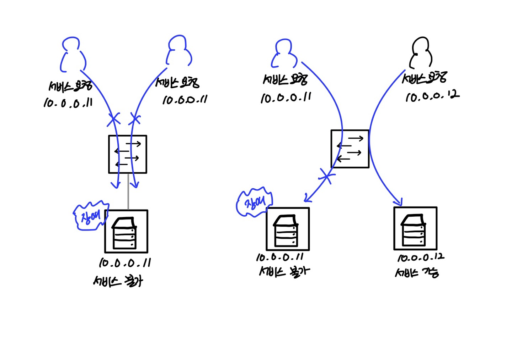

이런 문제점을 해결하기 위해 L4나 L7 스위치라는 로드 밸런서 (Load Balancer)를 사용합니다. 로드 밸런서에는 동일한 서비스를 하는 다수의 서버가 등록되고 사용자로부터 서비스 요청이 오면 로드 밸런서가 받아 사용자별로 다수의 서버에 서비스 요청을 분산시켜 부하를 분산합니다. 대규모 서비스 제공을 위해 이런 로드 밸런서는 필수 서비스입니다.

로드 밸런서에서는 서비스를 위한 가상 IP (VIP)를 하나 제공하고 사용자는 각 서버의 개별 IP 주소가 아닌 동일한 가상 IP를 통해 각 서버로 접근합니다.

이 외에도 로드 밸런서는 각 서버의 서비스 상태를 체크해 서비스가 가능한 서버로만 사용자의 요청을 분산하므로 서버에서 장애가 발생하더라도 기존 요청을 분산하여 다른 서버에 서비스를 제공할 수 있습니다.

> 로드 밸런서를 통한 부하 분산 및 서비스 가용성 확보

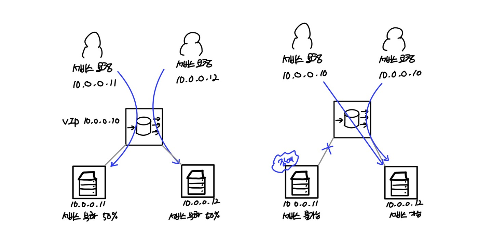

```
참조 : FWLB

서버에 대한 부하 분산뿐만 아니라 방화벽을 액티브-액티브로 구성하기 위해 로드 밸런서를 사용하기도 합니다.
서버 부하 분산을 SLB(Server Load Balancing) , 방화벽 부하분산을 FWLB (FireWall Load Balancing) 라고 합니다.

방화벽은 자신을 통과한 패킷에 대해 세션을 관리하는 테이블을 갖고 있습니다. 즉, 방화벽을 통과하는 패킷에
대해서는 방화벽 정책을 확인해 허용되는 정책이면 방화벽을 통과시키면서 그 정보를 세션 테이블에 기록합니다.

응답 패킷은 방화벽 정책을 확인하는 것이 아니라 세션 테이블에서 해당 패킷을 먼저 조회합니다.
세션 테이블에 있는 응답 패킷이라면 이미 정책에서 허용된 패킷이므로 방화벽을 바로 통과할 수 있습니다.

하지만 세션 테이블에 응답 패킷이 없다면 요청한 적이 없는 패킷에 대한 응답으로 간주하고 공격성으로 판단해
해당 패킷을 폐기 (Drop) 됩니다. 이런 경우는 출발지와 목적지 간 경로가 두 개 이상이 있어 비대칭 경로가
만들어질 대도 발생할 수 있습니다.

방화벽 장비를 이중화할 경우, 이런 비대칭 동작으로 인해 방화벽이 정상적으로 동작하지 않을 수 있습니다.
이런 문제를 해결하고 동시에 이중화된 방화벽을 모두 사용하기 위해 FWLB가 사용됩니다.

FWLB가 세션을 인식하고 일정한 규칙을 이용하여 방화벽 세션을 분산하는데 한번 방화벽을 지나갔던 세션이
다시 같은 방화벽을 거치도록 트래픽을 분산합니다.

FWLB를 사용하더라도 방화벽에 장애가 발생하는 경우를 대비하기 위해 방화벽에서 설정이 필요합니다. 방화벽끼리
세션 테이블을 동기화하거나 방화벽에서 첫 번재 패킷이 SYN이 아니어도 허용하는 기능을 사용해 방화벽의 장애로
인해 기존 세션 테이블에 없던 트래픽이 들어오더라도 처리할 수 있도록 설정해야 합니다.
```

## 부하 분산 방법

로드 밸런서는 부하를 다수의 장비로 어떻게 분산시킬까요? 앞에서 다룬 LACP는 두 개 이상의 인터페이스를 하나의 논리 인터페이스로 묶어 회선의 부하를 분산시켰습니다. LACP는 다수의 물리 인터페이스를 하나의 논리 인터페이스로 구성하기 위해 LACP를 위한 가상의 MAC 주소를 만들게 됩니다 .

로드 밸런서도 이와 유사하게 부하를 다수의 장비에 분산시키기 위해 가상 IP 주소를 갖게 됩니다. 로드 밸런서도 이와 유사하게 부하를 다수의 장비에 분산시키기 위해 가상 IP 주소를 갖게 됩니다. 이 IP 주소는 가상 IP 주소이므로 VIP(Virtual IP)라고도 하고 서비스를 위해 사용되는 IP 주소이므로 서비스 IP 주소라고도 합니다.

가상 IP 주소가 있다면 실제 IP도 있을 것입니다. 각 서버의 실제 IP 를 리얼 (Real)IP 라고 하고 로드밸런서의 가상 IP에 실제 서버들이 바인딩(Binding) 됩니다. 실무에서는 가상 IP는 VIP라고도 부르고 로드 밸런서에 바인딩 되어 있는 서버 IP는 리얼 IP 또는 RIP 라고 합니다.

정리하면 로드 밸런서에는 서비스를 제공하는 서버의 IP인 리얼 IP 와 로드 밸런서에서 서비스를 대표하는 VIP가 있습니다. VIP에는 리얼 IP가 바인딩되어 ㅣㅇㅆ고 사용자가 VIP로 서비스를 요청하면 해당 VIP에 연결된 리얼 IP로 해당 요청을 전달합니다.

> 부하 분산 예

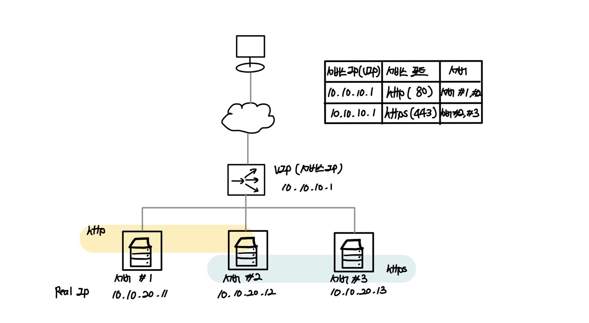

현재 서버 세 대가 있습니다. 서버의 각 IP 주소는 10.10.20.11 , 10.10.20.12 , 10.10.20.13 입니다.

서버 1번은 http , 3번은 https 서비스 데몬이 동작하고 서버 2번만 http 와 https 서비스 데몬 모두 동작합니다. 사용자가 http와 https 서비스로 접근하기 위한 VIP 주소인 10.10.10.1이 로드밸런서에 설정되어 있습니다.

VIP에는 사용자의 서비스 요청이 들어올 때 어느 서버로 요청을 전달할 것인지 부하 분산 그룹을 설정합니다. 여기서 HTTP 서비스는 서버 1번과 2번으로 HTTPS 서비스는 서버 2번과 3번으로 부하 분산 그룹이 있습니다.

로드 밸런서에서 부하 분산을 위한 그룹을 만들 때는 앞의 예제처럼 OSI 3계층 정보인 IP 주소뿐만 아니라 4계층 정보인 서비스 포트까지 지정해 만듭니다. 그래서 로드 밸런서를 L4 스위치라고 합니다.

7계층 정보까지 확인해 처리하는 기능이 포함되어 있는 경우도 있어 L7스위치라고도 하지만 보통 로드 밸런서를 L4 스위치라고 부릅니다.

앞의예제에서는 HTTP 와 HTTPS 서비스와 대해 각 동일한 VIP를 사용했지만 서로 다른 VIP로도 구성할 수 있습니다. 또한, 로드 밸런서의 VIP에 설정된 서비스 포트와 실제 서버의 서비스 포트는 반드시 같을 필요가 없습니다. 즉, 실제 서버에서는 서비스 포트 8080으로 웹 서비스를 수행하면서 VIP에서는 일반 HTTP 서비스 포트인 80으로 설정할 수 있습니다.

이렇게 되면 사용자는 VIP의 80 서비스 포트로 접근하고 로드 밸런서에서는 해당 서비스 요청을 실제 서버의 8080서비스 포트로 포트 변경까지 함께 수행하게 됩니다.

> 동일한 Real IP에서 서비스 포트마다 VIP를 다르게 설정할 수 있고 Real IP 의 서비스 포트와 VIP 포트도 서로 다르게 설정할 수 있다.

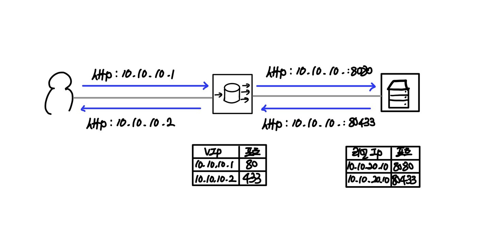

## 헬스 체크

로드 밸런서에서는 부하 분산을 하는 각 서버의 서비스를 주기적으로 헬스 체크 (Health Check)해 정상적인 서비스 쪽으만 부하를 분산하고 비정상적인 서버는 서비스 그룹에서 제외해 트래픽을 보내지 않습니다. 서비스 그룹에서 제외된 후에도 헬스 체크를 계속 수행해 다시 정상으로 확인되면 서비스 그룹에 해당 장비를 다시 넣어 트래픽이 서버 쪽으로 보내지도록 해줍니다.

### 1. 헬스 체크 방식

로드 밸런서는 다양한 헬스 체크 방식으로 서버의 서비스 정상 여부를 판단할 수 있습니다.

#### ICMP

VIP에 연결된 리얼 서버에 대해 ICMP(ping)로 헬스 체크를 수행하는 방법입니다. 단순히 서버가 살아있는지 여부만 체크하는 방법이므로 잘 사용하지 않습니다.

#### TCP 서비스 포트

가장 기본적인 헬스 체크 방법은 로드 밸런서에 설정된 서버의 서비스 포트를 확인하는 것입니다. 즉, 로드 밸런서에서 서버의 서비스 포트 2000번을 등록했다면 로드 밸런서에서는 리얼 IP 의 2000번 포트로 SYN을 보내고 해당 리얼 IP를 가진 서버로부터 SYN , ACK 를 받으면 서버에서 다시 ACK로 응답하고 FIN을 보내 헬스 체크를 종료합니다. 서비스 포트를 이용해 헬스 체크를 할 때는 실제 서비스 포트가 아닌 다른 서비스 포트로도 가능합니다.

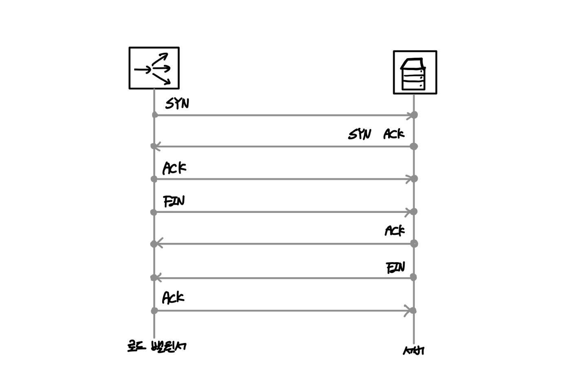

#### TCP 서비스 포트 : Half Open

일반 TCP 서비스 포트를 확인할 때는 SYN/SYN , ACK/ACK까지 정상적인 3방향 핸드셰이크를 거치게 됩니다. 헬스 체크로 인한 부하를 줄이거나 정상적인 종료 방식보다는 빨리 헬스 체크 세션을 끊기 위해 정상적인 3방향 핸드셰이크와 4방향 핸드셰이크가 아닌 TCP Half Oepn (절반 개방) 방식을 사용하기도 합니다.

TCP Half Oepn 방식은 초기의 3방향 핸드셰이크와 동일하게 SYN을 보내고 SYN , ACK를 받지만 이후 ACK 대신 RST를 보내 세션을 끊습니다.

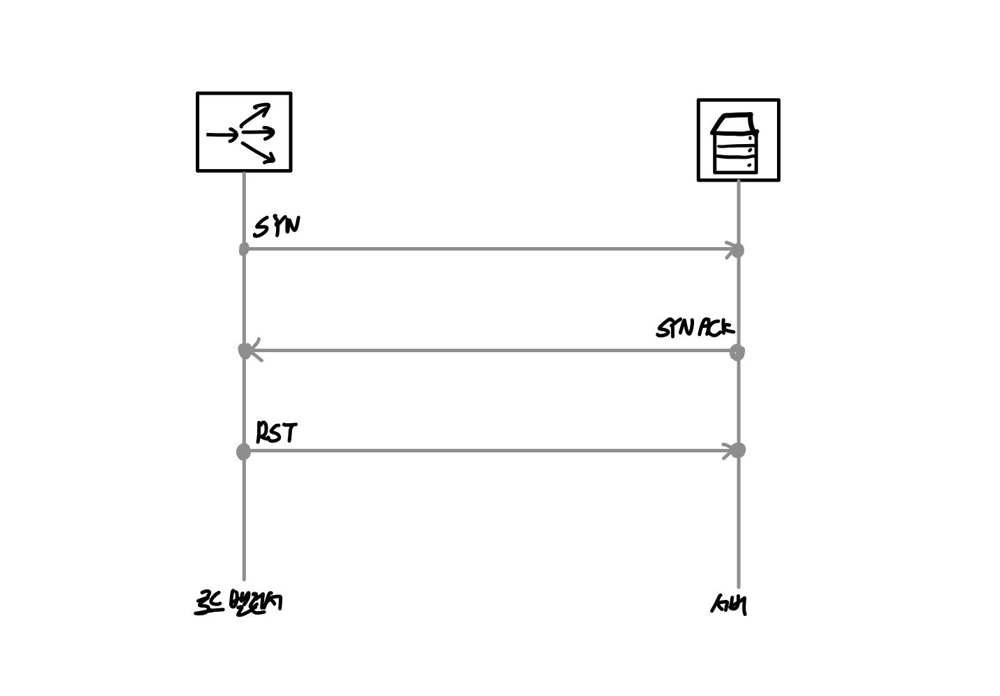

#### HTTP 상태 코드

웹서비스를 할 때, 서비스 포트까지는 TCP로 정상적으로 열리지만 웹 서비스에 대한 응답을 정상적으로 해주지는 못하는 경우가 있습니다.

이때 로드밸런서의 헬스 체크 방식 중 HTTP 상태 코드를 확인하는 방식으로 로드 밸런서가 서버로 3방향 핸드셰이크를 거치고 나서 HTTP를 요청해 정상적인 상태 코드 (200 OK)를 응답하는지 여부를 체크해 헬스 체크를 수행할 수 있습니다.

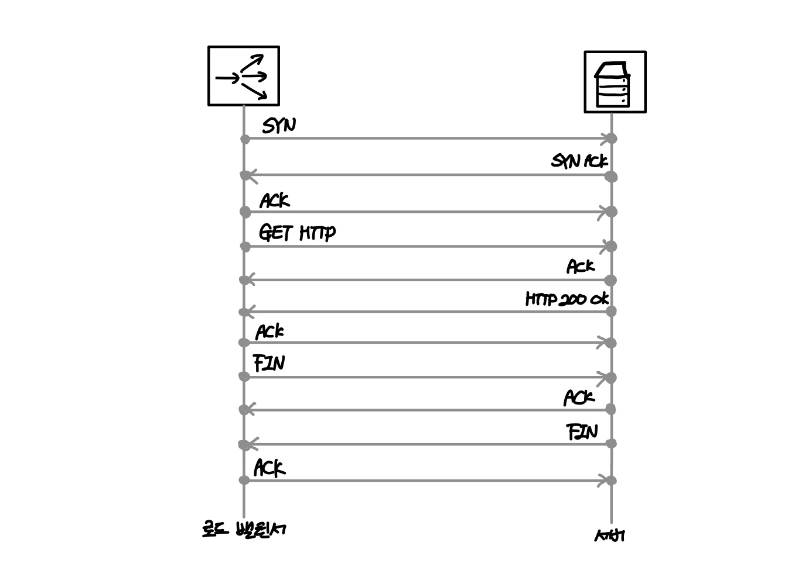

#### 콘텐츠 확인 (문자열 확인)

로드 밸런서에서 서버로 콘텐츠를 요청하고 응답받은 내용을 확인하여 지정된 콘텐츠가 정상적으로 응답했는지 여부를 확인하는 헬스 체크 방법도 있습니다. 보통 특정 웹페이지를 호출해 사전해 지정한 문자열이 해당 웹페이지 내에 포함 되어 잇는지를 체크하는 기능입니다.

이 헬스 체크 방식을 사용하면 로드 밸런서에서 직접 관리하는 서버의 상태뿐만아니라 해당 서버의 백엔드의 상태를 해당 웹 페이지로 체크할 수 있습니다.

다만 한 가지 유의 사항은 단순히 서버에서 응답받은 문자열만 체크하면 정상적인 요청 결과값이 아닌 문자열만 체크하므로 비정상적인 에러 코드에 대한 응답인 경우라도 해당 응답 내용에 헬스 체크를 하려고 했던 문자열이 포함되어 있으면 헬스 체크를 정상으로 판단할 수 있습니다.

따라서 문자열을 이용한 헬스 체크를 수행할 때는 정상 코드 값도 중복으로 확인하거나 문자열 자체를 일반적이 아닌 특정 문자열로 지정해 결과가 정상일때만 헬스 체크가 성공할 수 있도록 해야 합니다.

```
참고 : 다양한 헬스 체크 방법

여기서 다루지 않은 다양한 헬스 체크 방법이 있습니다.
대부분의 로드 밸런서가 사전에 정의된 다양한 헬스 체크 방식을 지원하므로 서비스에 적합한
헬스 체크 방식을 선택하면 됩니다.

1. F5 LTM을 통한 헬스 체크
2. Citrix NetScaler 를 통한 헬스 체크 등
```

### 2. 헬스 체크 주기와 타이머

헬스 체크 방법 외에 헬스 체크의 주요 고려사항인 헬스 체크 주기에 대해 알아보자. 헬스 체크 주기를 볼 때는 응답 시간, 시도 횟수, 타임아웃 등 다양한 타이머를 함께 고려해야 한다.

- 주기(Intervel) <br/>
  로드 밸런서에서 서버로 헬스 체크 패킷을 보내는 주기<br/>
- 응답 시간(Response)<br/>
  로드 밸런서에서 서버로 헬스 체크 패킷을 보내고 응답을 기다리는 시간<br/>
  해당 시간까지 응답이 오지 않으면 실패로 간주<br/>
- 시도 횟수(Retries)<br/>
  로드 밸런서에서 헬스 체크 실패 시 최대 시도 횟수<br/>
  최대 시도 횟수 이전에 성공 시 시도 횟수는 초기화 됨<br/>
- 타임아웃(Timeout)<br/>
  로드 밸런서에서 헬스 체크 실패 시 최대 대기 시간<br/>
  헬스 체크 패킷을 서버로 전송한 후 이 시간 내에 성공하지 못하면 해당 서버는 다운<br/>
- 서비스 다운 시의 주기(Dead Interval)<br/>
  서비스의 기본적인 헬스 체크 주가기 아닌, 서비스 다운 시의 헬스 체크 주기<br/>
  서비스가 죽은 상태에서 헬스 체크 주기를 별도로 더 늘릴 때 사용<br/>
  다음 그림은 헬스 체크를 수행하는 주기와 타이머를 시각화한 것이다.<br/>

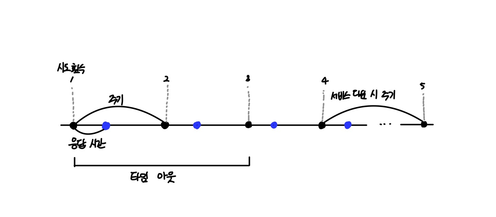

검은색 원 모양은 로드 밸런서에서 서버로 헬스 체크 패킷을 보내는 시점을 나태낸다. 헬스 체크 주기 시간마다 로드 밸런서는 서버로 헬스 체크 패킷을 전송한다. 주기가 3초로 설정되었다면 3초마다 헬스 체크 패킷을 서버로 전송한다. 이때 원 모양 사이의 시간이 3초가 된다.

파란색 원 모양은 로드 밸런서가 보낸 헬스 체크 패킷에 대한 서버의 응답을 최대로 기다리는 시간이다. 응답 시간으로 설정된 시간 내에 서버에서 응답이 오지 않으면 로드 밸런서는 해당 헬스 체크 시도를 실패로 처리한다. 응답 시간을 1초로 주었다면 검은색 원 모양의 헬스 체크 패킷 전송 이후 1초 내에 서버에서 응답을 수신해야 한다. 이때 유의사항은 헬스 체크 패킷을 보내는 주기를 응답 시간보다 크게 설정해야하는 점이다.

## 부하 분산 알고리즘

로드 밸런서가 리얼 서버로 부하를 분산할때, 로드 밸런서에서는 사전에 설정한 분산 알고리즘을 통해 부하 분산이 이루어 집니다.

|                   부하 분산 알고리즘                   |                                                                                                                                                              |
| :----------------------------------------------------: | :----------------------------------------------------------------------------------------------------------------------------------------------------------: |
|               라운드 로빈 (Round Robin)                |                         현재 구성된 장비에 부하를 순차적으로 분산함. 총 누적 세션 수는 동일하지만 활성화된 세션 수는 달라질 수 있음                          |
|           최소 접속 방식 (Least Connection)            |                                             현재 구성된 장비 중 가장 활성화된 세션 수가 적은 장비로 부하를 분산                                              |
|     가중치 기반 라운드 로빈 (Weighted Round Robin)     | 라운드 로빈 방식과 동일하지만 각 장비에 가중치를 두어 가중치가 높은 장비에 부하를 더 많이 분산함. 처리 용량이 다른 서버에 부하를 분산하기 위한 분산 알고리즘 |
| 가중치 기반 최소 접속 방식 (Weighted Least Connection) | 최소 접속 방식과 동일하지만 각 장비에 가중치를 부여해 가중치가 높은 장비에 부하를 더 많이 분산함. 처리 용량이 다른 서버에 부하를 부산하기 위한 분산 알고리즘 |
|                      해시 (Hash)                       |                                                               해시 알고리즘을 이용한 부하 분산                                                               |

### 1. 라운드 로빈

라운드 로빈 방식은 특별한 규칙 없이 현재 구성된 장비에 순차적으로 돌아가면서 트래픽을 분산합니다. 즉, 서버 세 대가 있을때 첫번째 요청은 1번 서버, 두번째 요청은 2번 서버 , 세 번째 요청은 3번 서버, 네번째 요청은 다시 1번 서버로 할당 합니다. 순차적으로 모든 장비에 분산하므로 모든 장비의 총 누적 세션 수는 같아집니다.

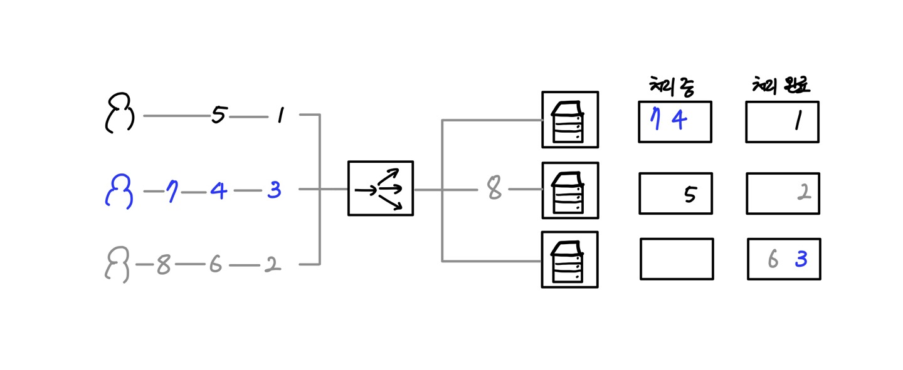

### 2. 최소 접속 방식

최소 접속 방식(Least Connection)은 서버가 가진 세션 부하를 확인해 그것에 맞게 부하를 분산하는 방식입니다. 로드 밸런서에서는 서비스 요청을 각 장비로 보내줄 때마다 세션 테이블이 생성되므로 각 장비에 여결된 현재 세션 수를 알 수 있습니다.

최소 접속 방식은 각 장비의 세션 수를 확인해 현재 세션이 가장 적게 연결된 장비로 서비스 요청을 보내는 방식입니다. 서비스별로 세션 수를 관리하면서 분산해주므로 각 장비에서 처리되는 활성화 세션 수가 비슷하게 분산되면서 부하를 분산하게 됩니다.

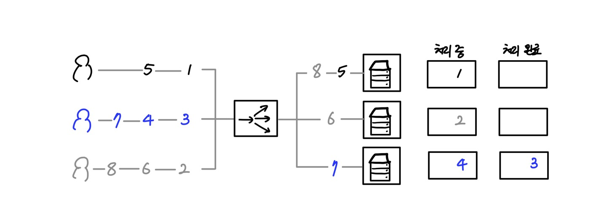

### 3. 해시

해시 방식은 서버의 부하를 고려하지 않고 클라이언트가 같은 서버에 지속적으로 접속하도록 하기 위해 사용하는 부하 분산 방식입니다.

서버 상태를 고려한는 것이 아닌 해시 알고리즘을 이용해 얻은 결과값으로 어떤 장비로 부하를 분산할지를 결정합니다. 알고리즘에 의한 계산 값에 의해 부하를 분산하므로 같은 알고리즘을 사용하면 항상 동일한 결과값을 가지고 서비스를 분산할 수있습니다.

이때 알고리즘 계산에 사용되는 값들을 지정할 수 있는데 주로 출발지 IP 주소 , 목적지 IP 주소 , 출발지 서비스 포트 , 목적지 서비스 포트를 사용합니다.
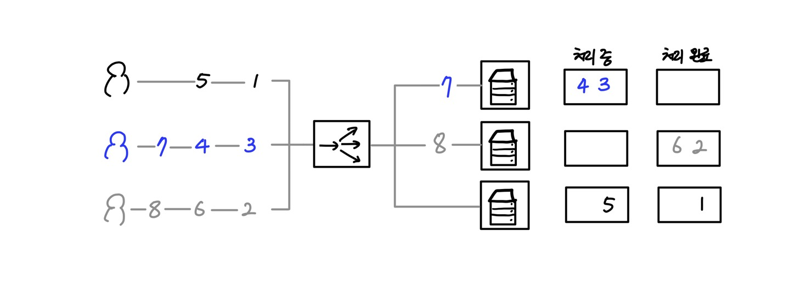

라운드 로빈이나 최소 접속 방식은 부하를 비교적 비슷한 비율로 분산시킬 수 있다는 장점이 있지만 동일한 출발지에서 로드 밸런서를 거친 서비스 요청이 처음에 분산된 서버와 그 다음 요청이 분산된 서버가 달라질 수 있어 각 서버에서 세션을 유지해야 하는 서비스는 정상적으로 서비스되지 않습니다.

그와 반대로 해시 방식은 알고리즘으로 계산한 값으로 서비스를 분산하므로 항상 동일한 장비로 서비스가 분산됩니다. 즉, 세션을 유지해야 하는 서비스에 적합한 분산 방식입니다.

하지만 알고리즘의 결과값이 특정한 값으로 치우치면 부하 분산 비율이 한쪽으로 치우칠 수도 있습니다. 최근에는 이런 경우가 별로 없지만 서버 애플리케이션 개발에 여러 대의 서버가 사용될 것을 고려하지 않고 개발한 경우, 이 방식을 사용해야 합니다.

흔히 이런 문제를 장바구니 문제라고 하는 데 A 서버에서 접속해 장바구니에 상품을 넣어두었는데 두 번째 접속할 때 B 서버로 접속되면 장바구니에 넣은 상품이 보이지 않을 때가 있습니다.

해시를 사용해야 하는 이유와 최소 접속 방식의 장점을 묶어 부하를 분산하는 방법도 있습니다. 라운드 로빈 방식이나 최소 접속 방식을 사용하면서 스티키(Sticky) 옵션을 주어 한번 접속한 커넥션을 지속적으로 유지하는 기법입니다.

처음 들어온 서비스 요청을 세션 테이블에 두고 같은 요청이 들어오면 같은 장비로 분산해 세션을 유지하는 방법입니다. 하지만 이렇게 하더라도 해당 세션 테이블에는 타임아웃이 있어 타임아웃 이후에는 분산되는 장비가 달라질 수 있다는 것을 고려해야 합니다. 스티키 옵션을 사용할 때는 애플리케이션 세션 유지 시간이나 일반 사용자들의 애플리케이션 행동 패턴을 충분히 감안해야 합니다.

따라서 부하 분산을 위한 알고리즘을 선택할 때는 제공되는 서비스의 특성을 잘 고려해 사용할 알고리즘을 결정해야 합니다. 그리고 각 알고리즘에 필요한 속성값도 함께 잘 고려해야만 적절한 부하 분산을 할 수 있습니다.

## 로드 밸런서 구성 방식

로드 밸런서의 구성 방식은 로드 밸런서의 구성 ㅜ이치에 따라 2가지로 나눌수 있습니다.

- 원암(One-Arm) 구성
- 인라인(inline) 구성

> 로드 밸런서의 2가지 구성 방식

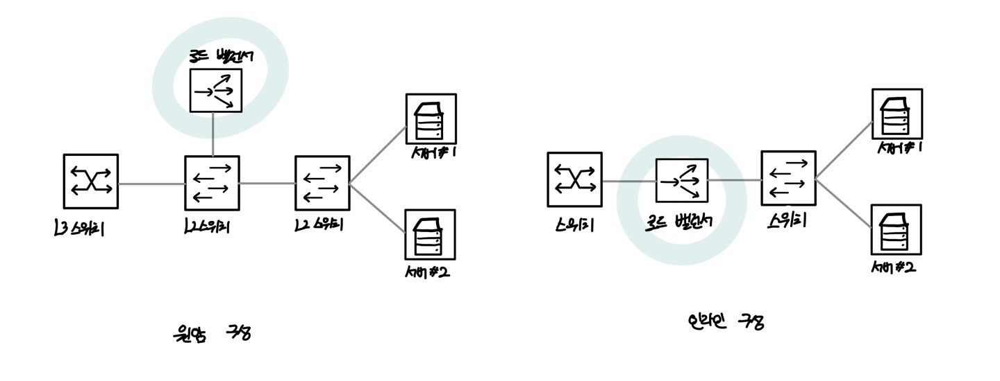

원암 구성은 로드 밸런서가 중간 스위치 옆에 연결되는 구성이고 인라인 구성은 서버로 가는 경로상에 로드 밸런서가 연결되는 구성입니다.

여기서 주의할 점은 원암이라고 해서 단순히 로드 밸러서와 스위치 간에 연결되 인터페이스가 한 개라는 뜻은 아니라는 것입니다.

실질적으로 원암과 인라인의 구분은 서버로 가는 트래픽이 모두 로드 밸런서를 경유하는 지, 경유하지 않아도 되는지에 대한 트래픽 흐름으로 구분합니다.

원암 구성은 부하 분산을 수행하는 트래픽에 대해서만 로드밸런서를 경유하고 부하 부산을 수행하지 않는 트래픽은 로드 밸런서를 경유하지 않고 통신할 수 있습니다. <br/>
반면, 인라인 구성은 부하 분산을 포함한 모든 트래픽이 로드 밸런서를 경유하는 구성이 됩니다.

이런 구성 방식에 따라 앞에서 말한 트래픽이 흐르는 경로 , NAT 설정 , 이어서 다룰 로드밸런서의 동작 모드가 달라질 수 있습니다. 따라서 로드 밸런서의 구성 방식을 알아두는 것은로드밸런서를 이해하는데 매우 중요합니다.

### 1. 원암 구성

로드 밸런서의 원암(One Arm) 구성은 로드 밸런서가 스위치 옆에 있는 형태를 말합니다.

로드 밸런서가 스위치와 인터페이스 하나로 연결되어 있지만 원암 구성이 단순히 물리 인터페이스가 하나라는 뜻은 아닙니다. LACP 와 같은 다수의 인터페이스로 스위치와 연결된 경우에도 스위치 옆에 있는 구성이라면 동일하게 원암 구성이라고 합니다.

또한, 로드밸런서와 스위치 간 두 개 이상의 인터페이스를 LACP가 아닌 서로 다른 네트워크로 로드 밸런서와 구성한 경우에도 원암 구성이 될 수 있습니다. (이런 경우 투암이라고도 합니다.)

> 로드 밸런서와 스위치 간 인터페이스 수가 여러 개인 원암 구성의 예

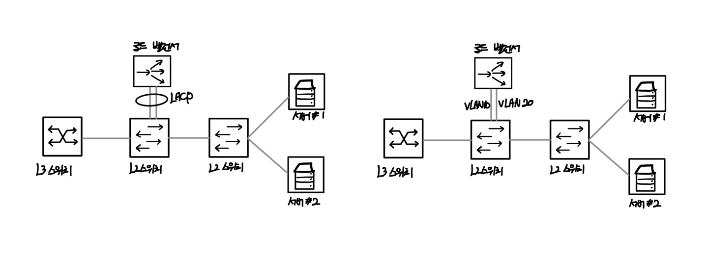

이런 원암 구성에서는 서버로 들어가거나 나오는 트래픽이 로드 밸런서를 경유하거나 경유하지 않을 수 있습니다. 트래픽이 로드 밸런서를 경유하는지 여부는 부하 분산을 이용한 트래픽인지 여부로 구분할 수 있습니다.

먼저 원암 구조에서 부하 분산을 이용하는 트래픽 흐름에 대한 그림입니다.

> 부하 분산을 이용할 때는 로드 밸런서를 경유한다.

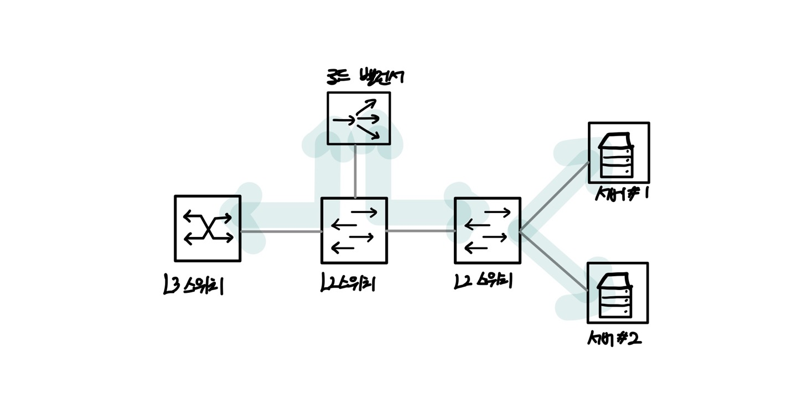

부하 분산을 이용하는 트래픽의 경우 부하 분산에 사용되는 서비스 IP 정보를 로드 밸런서가 가지고 있어 서버로 유입되는 트래픽은 먼저 로드 밸런서를 거칩니다.

로드 밸런서에서는 각 실제 서버로 트래픽을 분산하고 서버의 응답 트래픽은 다시 로드 밸런서를 거쳐 사용자에게 응답하게 됩니다. 원암 구조에서 서버의 응답 트래픽이 로드 밸런서를 다시 거치려면 로드 밸런서를 거칠 때, 서비스 IP 에 대해 실제 서버로 Destination NAT뿐만 아니라 서비스를 호출한 사용자 IP가 아니라 로드 밸런서가 가진 IP 로 Source NAT도 함께 이루어져야 합니다.

도는 Source NAT를 하지 않으려면 다음 장에서 알아 볼 로드 밸런서 동작 모드 중 DSR(Direct Server Return)을 사용하면 됩니다.

다음은 원암 구조에서 부하 분산을 이용하지 않는 트래픽 흐름의 그림입니다.

> 부하 분산을 이용하지 않을 때는 로드 밸런서를 경유하지 않는다.

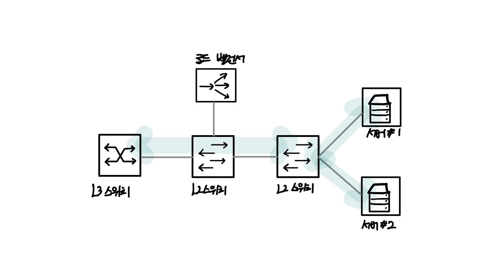

로드 밸런서의 부하 분산을 이용하지 않는 트래픽은 원암 구성에서 굳이 로드 밸런서를 거치지 않아도 서버와 통신할 수 있습니다.

따라서 원암 구성에서는 로드 밸런서를 이용하는 서비스에 대해서만 로드 밸런서를 경유하므로 불필요한 트래픽이 로드 밸런서에 유입되지 않아 로드 밸런서의 부하를 줄일 수 있습니다.

스위치와 로드 밸런서 간의 대역폭을 최소화할 수 있고 대역폭이 부족할 때는 이 구간만 대역폭을 증설하면 되므로 다음의 인라인 방식보다 상대적으로 확장에 유리합니다.

원암 구성은 로드 밸런서 부하 감소는 물론 장애 영향도를 줄이기 위해서 사용됩니다. 로드 밸런서 장비에 장애가 발생하더라도 로드 밸런서를 거치지 않는 일반적인 서비스의 트래픽 흐름에는 문제가 없으므로 원암 구성은 로드 밸런서를 통과해야 하는 트래픽과 통과하지 않아도 되는 트래픽이 섞인 경우에 많이 사용됩니다.

### 2. 인라인 구성

로드 밸런서의 인라인 구성은 용어 그대로 밑의 그림처럼 로드 밸런서가 스위치에서 서버까지 가는 일직선상 경로에 있는 형태를 말합니다.

인라인 구성은 트래픽이 흐르는 경로에 로드 밸런서가 있어서 서버로 향하는 트래픽이 모두 로드 밸런서를 통과합니다.

서버 #1 , 서버 #2 가 있을 때 서버 #1 만 로드 밸런서를 통해 부하 분산을 받더라도 인라인 구조에서는 외부에서 서버까지의 경로가 로드 밸런서를 경유하도록 되어 있습니다.

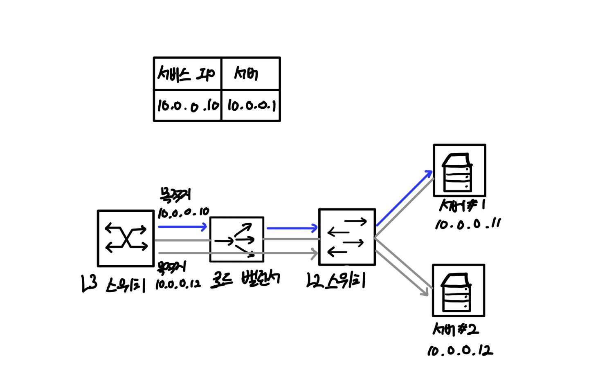

모든 트래픽이 로드 밸런서를 경유하므로 로드 밸런서의 부하가 높아집니다. 특히 일반 L3 역할을 하는 스위치에 비해 로드 밸런서는 4계층 이상의 데이터를 처리하므로 처리 가능한 용량이 L3 장비보다 적으며 처리 용량이 커지면서 가격도 많이 상승하므로 로드 밸런서 부하에 따른 성능을 반드시 고려해야 합니다.

로드 밸런서에서 처리하지 않는 트래픽이 로드 밸런서를 거치더라도 그 부하는 크지 않습니다. 인라인으로 로드 밸런서를 선정할 때 로드 밸런싱 성능과 패킷 스루풋 성능을 구별해 디자인해야 합니다.

그 밖에 인라인 구성에서도 원암 구성과 동일하게 응답 트래픽이 로드 밸런서를 거치지 못하는 경우가 발생할 수 있습니다.

```
참고 : 물리적 원암 , 논리적 인라인

로드 밸런서의 원암과 인라인을 구분할 때 물리적으로는 원암 구성을 띠더라도 실제로는 인라인 구성인 경우도
있습니다.

로드 밸런서와 연결된 스위치상에서 VRF와 같은 가상화를 사용해 논리적으로 장비를 분리하는 경우가 예입니다.
VRF를 이용한 가상화까지 굳이 가지 않더라도 VLAN만으로도 인라인처럼 구성할 수 있습니다.

실제로 이런 경우는 물리적 구성이 아닌 장비의 논리적 구성도로 이해하면 일반적인 인라인 구성이 됩니다.
따라서 물리적 구성만 보고 원암과 인라인 구성을 구분하면 안됩니다.
```

## 로드 밸런서 동작 모드

로드 밸런서 구성 방식에 이어서 로드 밸런서 동작 모드에 대해 알아보겠습니다

- 트랜스패런트 (Transparent : TP) 또는 브릿지 (Bridge)
- 라우티드 (Routed)
- DSR (Direct Server Return)

### 1. 트랜스패런트 모드

트랜스패런트 (Transparent : 투명) 구성은 로드 밸런서 OSI 2계층 스위치 처럼 동작하는 구성입니다.

즉, 로드 밸런서에서 서비스하기 위해 사용하는 VIP 주소와 실제 서버가 동일한 네트워크를 사용하는 구성입니다. 트랜스패런트 구성은 기존에 사용하던 네트워크 대역을 그대로 사용하므로 로드 밸런서 도입으로 인한 IP 네트워크 재설계를 고려하지 않아도 되고 네트워크에 L2 스위치를 추가하는 것과 동일하게 기존 망의 트래픽 흐름에 미치는 영향 없이 로드 밸런서를 손쉽게 구성할 수 있습니다.

트랜스패런트 구성에서는 트래픽이 로드 밸런서를 지나더라도 부하 분산 서비스를 받는 트래픽인 경우에만 4계층 이상의 기능을 수행하며 부하 분산 서비스가 아닌 경우네느 기존 L2 스위치와 동일한 스위칭 기능만 수행합니다. 그래서 이 구성을 L2 구조라고 부르기도 합니다.

트랜스패런트 모드는 밑의 그림처럼 로드 밸런서 동작 모드 원암 과 인라인 구성에서 모두 사용할 수 있는 동작 모드입니다.

다만, 원암 구성에서는 응답 트래픽 경로 부분이 문제가 될 수 있어 Source NAT가 필요합니다. 여기서는 인라인 구성으로 트랜스패런트 모드를 살펴보겠습니다.

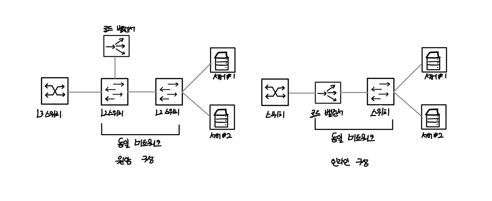

이제 트랜스패런트 모드에서 부하 분산 트래픽이 어떻게 흐르는지 알아보겠습니다.

> 트랜스패런드 모드에서 서비스 요청 시의 패킷 흐름

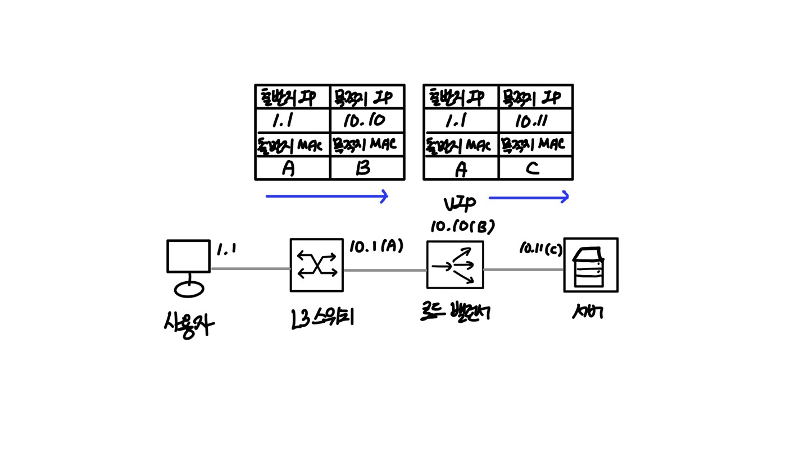

먼저 사용자는 서비스 IP인 로드 밸런서의 VIP 주소 10.10으로 서비스를 요청합니다. 로드 밸런서로 들어온 패킷은 목적지 IP 주소를 VIP에 바인딩되어 있는 실제 서버 IP 주소로 변경 (Rewrite) 하므로 목적지 IP 주소는 10.10 에서 10.11로 변경됩니다. 마찬가지로 목적지 MAC 주소도 실제 서버의 MAC 주소인 C가 됩니다.

로드 밸런서와 목적지 서버가 동일한 네트워크 대역이므로 L3 장비를 지날때 처럼 출발지 MAC 주소는 변경되지 않습니다. 서비스 요청 패킷의 목적지 정보가 변경되면 실제 서버로 패킷이 전달됩니다. 로드 밸런서에서 서비스를 위한 VIP 주소가 실제 서버의 IP 주소로 변경해 전송하므로 목적지 (Destination) NAT가 되었다고 합니다.

> 트랜스패런트 모드에서 서비스 응답시의 패킷 흐름

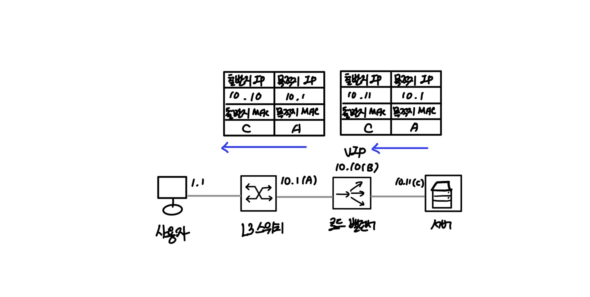

서버에서 사용자엑 응답할 때는 로드 밸런서를 지나면서 요청할 때와 반대로 출발지의 IP 주소가 실제 서버의 IP에서 VIP 주소로 변경되지만 목적지 MAC 주소는 변경되지 않습니다.

서버에서 응답할 때, 목적지 MAC 주소가 이미 게이트웨이의 MAC 주소를 갖고 있어 변경할 필요가 없기 때문입니다.

인라인 구성에서 로드 밸런서가 트랜스패런트 모드에서 동작할때, 게이트웨이 외부 사용자로부터 받은 서비스 요청을 처리하는 데는 문제가 없지만 동일 네트워크에서 서비스를 호출할 때는 서비스 응답이 로드 밸런서를 거치지 않을 수 있습니다.

로드 밸런서가 원암 구성인 경우에도 서비스 응답이 로드 밸런서를 거치지 않을 수 있고 이때 서비스에 문제가 발생할 수 있습니다. 응답 패킷이 로드 밸런서를 다시 거쳐 역변환되어야 정상적인 부하 분산이 가능하기 때문입니다.

### 2. 라우티드 모드

라우티드 구성은 이름에서도 알 수 있듯이 로드 밸런서가 라우팅 역할을 수행하는 모드입니다.

즉, 로드 밸런서를 기준으로 사용자 방향(Client Side)과 서버 방향 (Server Side)이 서로 다른 네트워크로 분리된 구성입니다. 로드 밸런서는 사용자 방향과 서버 방향의 네트워크를 라우팅으로 연결합니다. 라우티드 모드는 원암 구성과 인라인 구성에서 모두 구성할 수 있습니다.

> 원암과 인라인 구성에서도 모두 라우티드 모드 구성이 가능하다.

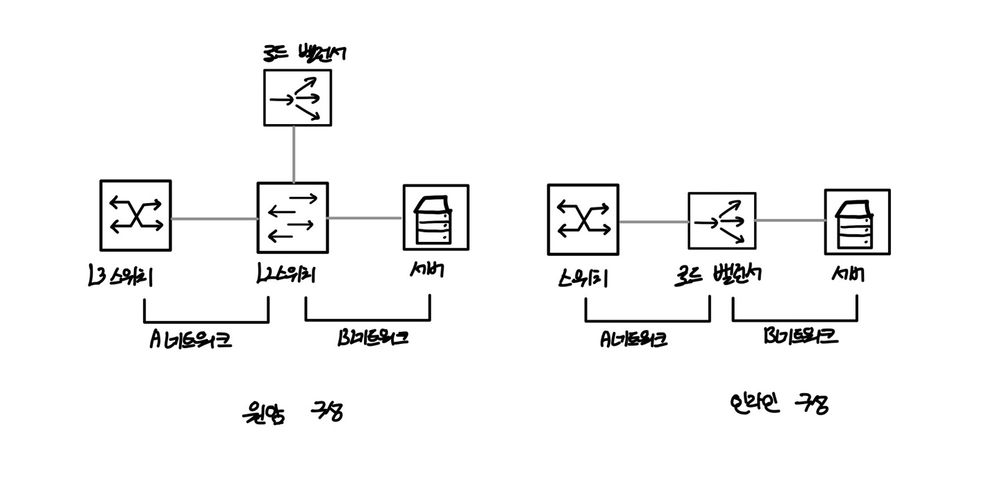

라우티드 모드는 보안 강화 목적으로 서버쪽 네트워크를 사설로 구성해 서버에 직접 접속하는 것을 막는 용도로 사용되기도 합니다.

그럼 라우티드 구성에서 로드 밸런서를 통한 트래픽이 어떻게 흐르는지 살펴보겠습니다.

> 라우티드 모드에서 서비스 요청 시의 패킷 흐름

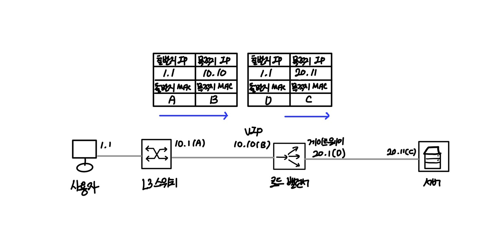

사용자는 서비스 IP인 VIP 주소 10.10으로 서비스를 요청합니다. 로드 밸런서로 들어온 패킷은 목적지 IP 주소를 VIP 에 바인딩 된 실제 서버 IP 주소인 20.11로 변경합니다. 라우팅을 수행하면서 로드 밸런서를 통과하므로 일반 라우팅과 동일하게 출발지와 목적지 MAC 주소도 각각 A->D , B->C 로 변경됩니다.

목적지 IP 와 출발지/목적지 MAC이 변경된 패킷은 라우팅 테이블을 확인해 실제 서버로 전송됩니다. 이 과정에서 로드 밸런서는 서비스를 위한 VIP 에서 시제 서버의 IP 주소로 변경해 전송하므로 Destination NAT가 되었다고 합니다.

> 라우티드 모드에서 서비스 응답 시의 패킷 흐름

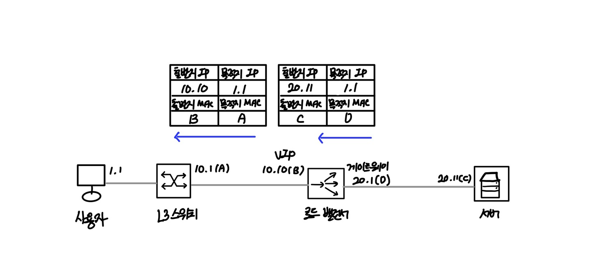

이번에는 서버에서 사용자로 전달되는 응답 패킷의 흐름을 살펴보겠습니다.

서버에서 사용자에게 응답하기 위해 패킷을 전송할 때는 출발지가 실제 서버의 IP 주소가 되고 목적지 IP는 원래 사용자의 IP 주소가 됩니다. 다만 목적지 IP 가 외부 네트워크이므로 목적지 MAC은 외부로 나가는 관문인 로드밸런서의 MAC 주소가 됩니다.

로드 밸런서로 들어온 패킷은 출발지 IP 주소를 실제 서버의 IP 인 20.11에서 사용자가 서비스를 위해 요청했던 VIP 인 10.10으로 변환합니다.

그리고 요청 트래픽과 마찬가지로 출발지와 목적지의 MAC주소를 변경한 후 사용자에게 응답 패킷을 전송합니다.

### 3. DSR 모드

DSR(Direct Server Return)은 명칭 그대로 사용자의 요청이 로드 밸런서를 통해 서버로 유입된 후에 다시 로드 밸런서를 통하기 않고 서버가 사용자에게 직접 응답하는 모드입니다.

로드 밸런서에는 응답 트래픽이 유입되지 않으므로 사용자가 요청하는 패킷에 대해서만 관여합니다. DSR 모드는 응답할 때, 로드 밸런서를 경유하지 않으므로 원암으로 구성합니다.

DSR모드는 L2 DSR과 L3 DSR로 구분되는데 L2 DSR은 실제 서버의 네트워크를 로드 밸런서가 가진 경우이며 L3 DSR 은 실제 서버의 네트워크 대역을 로드 밸런서가 가지지 않은 경우입니다. 즉, 로드 밸런서에서는 실제 서버까지의 통신이 L2 통신인지 , L3 통신인지에 따라 L2 DSR 과 L3 DSR로 나뉩니다.

DSR 모드에서는 요청 트래픽만 로드 밸런서를 통해 흐르므로 로드 밸런서 전체 트래픽이 감소해 로드 밸런서 부하가 감소합니다. 특히 일반겆인 서비스 트래픽인경우, 서비스 요청 패킷보다 서비스 응답 패킷의 크기가 더 크기 때문에 로드 밸런서의 트래픽 부하 감소에 효과적입니다.

응답 패킷의 크기가 클수록 이러한 부하 감소율은 더 커지게 되는데 예를 들어 사용자 요청에 의한 스트리밍 서비스와 같이 응답 패킷의 트래픽이 서비스에 필요한 대역폭의 대부분을 차지하는 경우에는 DSR 모드를 통해서 로드 밸런서를 경유하지 않고 응답 패킷의 트래픽을 전달하여 로드 밸런서 부하 감소 효과를 극대화할 수 있습니다.

반면, 이러한 효과가 있는 반면에 DSR 모드의 서비스 응답이 로드 밸런서를 경유하지 않으므로 문제가 발생했을때, 문제 확인이 어렵습니다. 다른 동작모드는 로드 밸런서 설정만 필요하지만 L2 DSR 과 L3 DSR 은 로드 밸런서 설정 외에 서버에서도 추가 설정이 필요합니다.

L3 DSR은 윈도 서버에서 지원하지 않으므로 서버팜에서 윈도 서버가 있는 경우 L3 DSR을 사용할 수 없습니다.

여기서는 L2 DSR 기준으로 다룹니다.

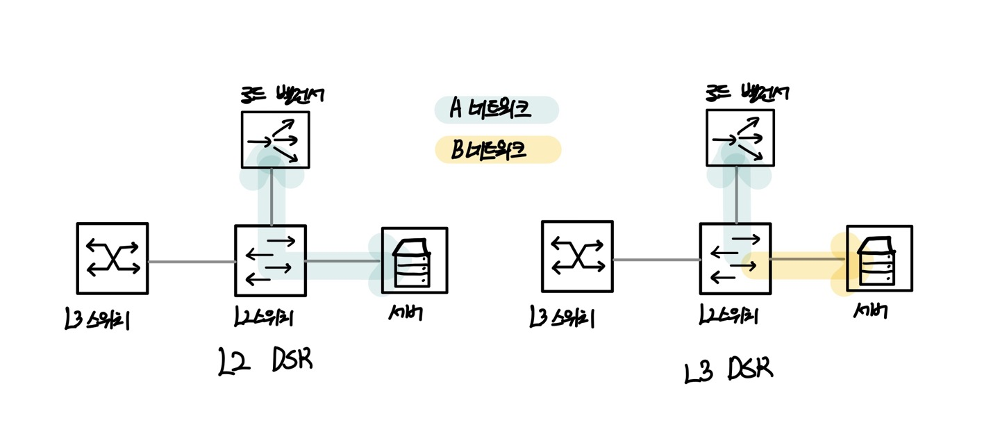

> 로드 밸런서가 서버 대역을 가지고 있으면 L2 DSR 이고 없으면 L3 DSR 이다.

DSR 모드는 다른 모드와 달리 서버에서도 추가 설정이 왜 필요한지 DSR 모드의 트래픽 흐름을 통해 알아보겠습니다.

사용자는 서비스 IP 인 VIP로 서비스를 요청합니다. 로드 밸런서로 들어온 서비스 요청 패킷은 앞에서 알아본 트랜스패런트나 라우티드 방식의 경우, 목적지 IP 주소가 로드 밸런서를 거치면서 실제 서버의 IP로 Destination NAT가 되고 응답할 때는 다시 VIP로 Source NAT을 수행합니다.

하지만 DSR모드에서는 밑의 그림처럼 서버에서 로드 밸런서를 거치지 않고 응답해야 하므로 응답할 때, 로드 밸런서를 통한 출발지 IP를 변경하는 Source NAT을 수행할 수 없습니다.

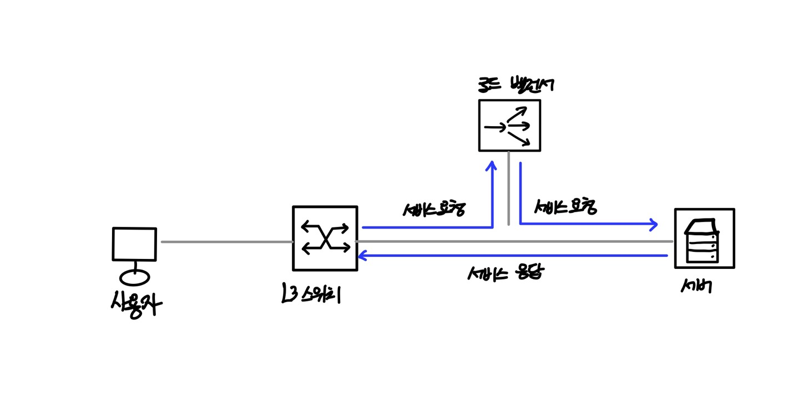

> DSR 모드에서는 서비스 응답 시 로드 밸런서를 경유하지 않으므로 응답 패킷에 대한 NAT 수행이 불가능하다.

Source NAT가 수행되지 않았기 때문에 사용자 입장에서는 서비스를 요청했던 IP 주소인 로드 밸런서의 서비스 VIP가 아닌 실제 서버 IP로 응답을 받습니다. 요청했던 IP주소와 응답을 해주는 IP 주소가 다르기 때문에 사용자는 비정상적인 응답으로 간주하고 패킷을 처리하지 않습니다.

그래서 DSR 모드인 경우, 로드 밸런서는 서비스를 요청할 때 목적지 IP는 실제 서버 IP로 변경하지 않고 VIP 그대로 유지하고 목적지 MAC 주소만 실제 서버의 MAC 주소로 변경해 서버로 전송합니다.

서버에서는 해당 패킷을 수신할 때 목적지 IP 주소가 서버의 주소와 맞지 않으면 폐기되므로 루프백 인터페이스를 생성해 VIP 주소를 할당합니다. 그리고 서비스 요청 트래픽이 들어오는 인터페이스에 설정한 IP 가 아니므로 해당 인터페이스에 설정된 IP가 아닌 루프백에 설정된 IP 주소더라도 패킷을 수신할 수 있도록 설정합니다. 마지마그으로 이 VIP는 로드 밸런서와 동일한 IP 가 중복 설정된 상태이므로 ARP에 의해 중복된 IP에 대한 MAC이 갱신되지 않도록 서버에 설정된 VIP에 대해서는 ARP 광고가 되지 않도록 합니다.

그럼 DSR 모드의 실제 패킷 흐름을 살펴보겠습니다.

사용자는 서비스 IP인 VIP 주소 10.10으로 서비스를 요청합니다. 로드 밸런서는 목적지 IP를 VIP 주소로 두고 목적지 서버의 MAC 주소만 변경해 실제 서버로 전송합니다. 실제 서버에서는 루프백 인터페이스에 VIP 와 동일한 IP 주소가 설정되어 있고 목적지 IP 가 이 루프백 IP 와 동일한 경우에도 패킷을 수신합니다.

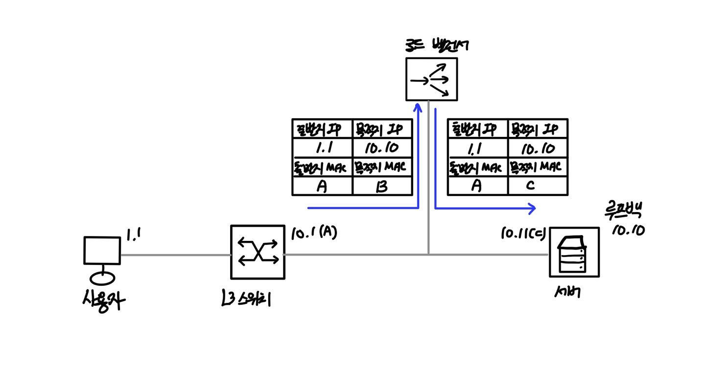

> DSR 모드에서 서비스 요청 시의 패킷 흐름

DSR 모드의 응답은 로드 밸런서가 개입하지 않으므로 로드 밸런서를 사용하지 않는 일반 패킷과 유사하게 전달됩니다. 다만 출발지 IP가 서버의 인터페이스 IP 주소가 아닌 루프백 인터페이스의 IP 주소, 즉 사용자가 요청했던 VIP 주소로 설정해 패킷을 전송합니다.

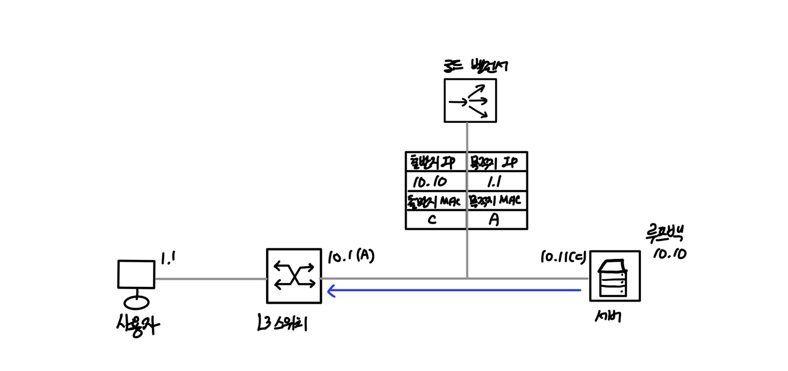

앞에서 설명했듯이 DSR 모드를 사용하려면 서버에서도 다음과 가틍ㄴ 추가 설정이 필요합니다.

- 루프백 인터페이스 설정
- 리눅스 커널 파라미터 수정 (리눅스) / 네트워크 설정 변경 (윈도)

운영체제별로 DSR 모드 구성을 위한 자세한 설정 방법을 알아보겠습니다.

#### 리눅스 서버에서 루프백 인터페이스 설정

로드밸런서의 서비스용 가상 IP 주소 (VIP)를 서버의 루프백 인터페이스에 설정해 DSR 모드를 구성합니다. 사용자가 요청한 서비스 IP주소를 서버에서도 동일하게 갖고 있으므로 서비스 IP 주소를 목적지로 한 요청을 수신받고 응답도 서버의 실제 서버 IP가 아닌 요청받았던 서비스 IP 주소(루프백에 설정된)를 출발지 IP 주소로 설정해 사용자에게 응답할 수 있습니다.

사용자는 응답받은 패킷이 자신이 요청한 목적지로부터 온 것으로 판단해 해당 패킷을 수신하게 됩니다. 루프백 인터페이스를 설정하는 방법은 다음과 같습니다.

```
루프백 인터페이스 설정 : RHEL (CentOS) 계열

DEVICE=lo:0
IPADDR=서비스용 가상 IP(VIP)
NETMASK=255.255.255.255
ONBOOT=yes
NAME=lo0
```

```
루프백 인터페이스 설정 : 데비안 (우분투) 계열

auto lo lo:0
iface lo inet loopback
iface lo:0 inet static
        address 서비스 가상 ip (VIP)
        netmask 255.255.255.255
```

루프백 인터페이스 설정한 후에는 해당 IP가 로드 밸런스에 설정된 IP 와 동일하므로 ARP를 통한 테이블이 갱신되지 않도록 해당 서버의 리눅스 커널 파라미터를 수행해야 합니다. 즉, 해당 인터페이스가 GARP(Gratuitous ARP)를 보내거나 ARP응답을 하지 않도록 설정합니다.

```
리눅스 커널 파라미터 추가 (/etc/sysctl.conf)

net.ipv4.conf.lo.arp_ignore=1
net.ipv4.conf.lo.arp_announce=2
net.ipv4.conf.all.arp_ignore=1
net.ipv4.conf.all.arp_announce=2
```

```
네트워크 재시작

# systemctl network restart  # RHEL
# service networking restart # 데비안
```

#### 윈도 서버에서 루프백 인터페이스 설정

[책 505쪽 ~ 508쪽 참조]

## 로드 밸런서 유의사항

### 1. 원암 구성의 동일 네트워크 사용시

다음 그림은 원암 구성에서 서비스 IP와 서버의 네트워크 대역이 동일 네트워크를 사용하는 경우를 나타낸것입니다.
원암 구성은 로드밸런서를 이용하는 서비스에 대해서만 로드 밸런서를 경유하므로 불필요한 트래픽이 로드밸런서에 유입되지 않아 로드 밸런서의 부하와 장애 범위를 줄일 수 있는 구성이라고 앞에서 설명했습니다.

여기서는 원암 구성에서 서비스 네트워크와 서버 네트워크가 동일한 네트워크로 구성된 상황에서 발생할 수 있는 문제를 살펴보겠습니다.

> 원암 구성에서 서비스 IP와 서버가 동일 네트워크를 사용할 때의 문제

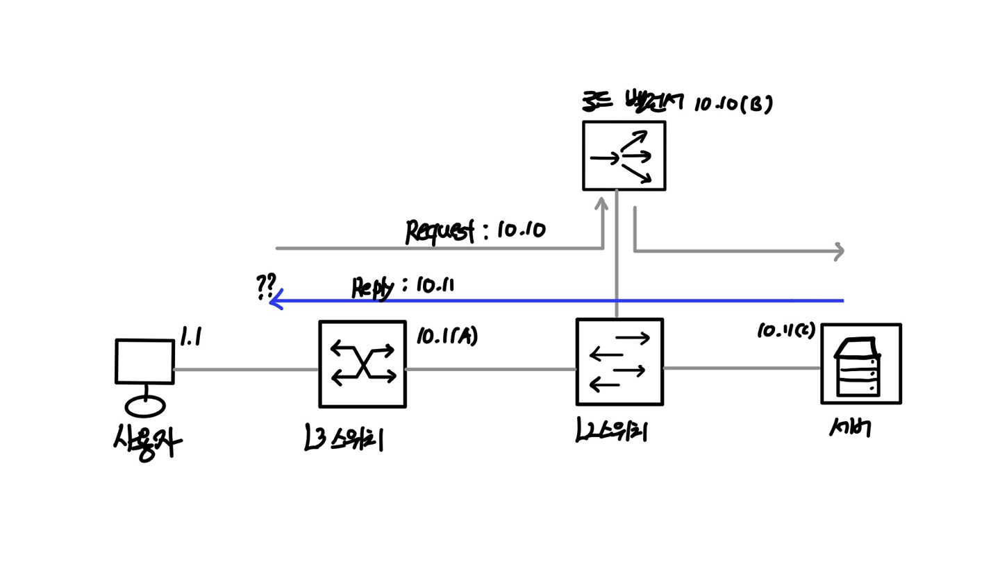

사용자가 서비스 IP (로드 밸런서의 VIP)로 요청하면 로드 밸런서에서는 실제 서버의 IP 주소로 Destination NAT 한 후 서버로 전달합니다. 서버는 다시 사용자에게 응답할 때 게이트웨이 장비인 l3 스위치를 통해 응답하는데 인라인 구성에서는 로드 밸런서를 통과하지만 원암 구성에서는 로드 밸런서를 거치지 않고 사용자에게 바로 응답합니다.

사용자는 10.10이라는 서비스 ip로 요청했지만 응답은 서버의 실제 ip 인 10.11로 받게 되고 서비스를 호출한 사용자 입장에서는 요청하지 않은 IP에서 응답 패킷을 받았으므로 해당 패킷은 정상적으로 처리되지 않고 폐기됩니다.

이 문제는 로드 밸런서를 거치면서 변경된 IP가 재응답할 때, 로드 밸런서를 경유하면서 원래의 IP로 바꾸어 응답해야 하지만 원암 구조에서는 응답 트래픽이 로드 밸런서를 경유하지 않아서 발생합니다.

#### 게이트웨이를 로드밸런서로 설정

서버에서 동일 네트워크가 아닌 목적지로 가려면 게이트웨이를 통과해야 합니다. 따라서 로드 밸런서를 통해 부하 분산이 이루어지는 실제 서버에 대해서는 게이트웨이를 로드 밸런서로 설정하면 로컬 네트워크가 아닌 외부 사용자의 호출에 대한 응답이 항상 로드 밸런서를 통하므로 정상적으로 사용자에게 응답할 수 있게 됩니다.

다만 이 경우, 물리적으로 원암 구조이지만 실제 트래픽 플로가 로드 밸런서를 게이트웨이로 사용하므로 원암 구조에서 가질 수 있는 로드 밸런서의 부하 감소효과가 줄어듭니다. 물론 부하 분산을 사용하지 않는 서버는 기존과 동일하게 게이트웨이를 L3 스위치로 설정하면 로드 밸런서를 경유하지 않으므로 여전히 로드 밸런서의 부하 감소효과를 가져올 수 있습니다.

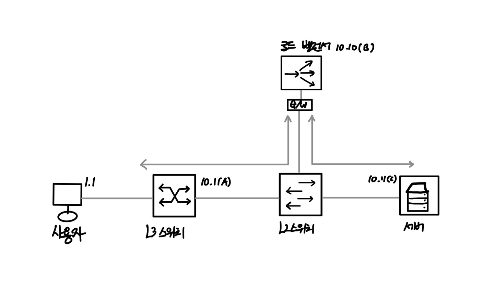

#### Source NAT 사용

원암 구성의 동일 네트워크 문제를 해결하는 두번째 방법은 Source NAT를 적용하는 것입니다. 사용자의 서비스 요청에 대해 로드 밸런서가 실제 서버로 가기 위해 수행하는 Destination NAT뿐만 아니라 출발지 IP 주소를 로드 밸런서가 가진 IP로 함께 변경합니다.

그럼 서버에서는 사용자의 요청이 아니라 로드 밸런서가 서비스요청을 한 것으로 보이기 때문에 응답을 로드밸런서로 보내게 됩니다. 로드 밸런서는 응답 패킷의 출발지를 실제 서버에서 로드 밸런서에 있는 서비스 IP(VIP)로 바꾸고 목적지 IP 주소를 로드 밸런서의 IP에서 원래의 사용자 IP로 변경해 사용자에게 응답하게 됩니다. 이 경우, 서비스를 호출할 때와 응답할 때 모두 Source/Destination NAT을 함께 수행하게 됩니다.

다만 이 경우, 서버 애플리케이션 입장에서 보면 서비스를 호출한 IP가 하나의 동일한 IP로 보이기 때문에 사용자 구분이 어렵다는 문제가 있습니다. 웹 서비스는 이런 문제를 해결하기 위해 HTTP 헤더의 X-Forwarded-For(XFF)를 사용해 실제 사용자 IP를 확인하는 방법을 사용하기도 합니다.

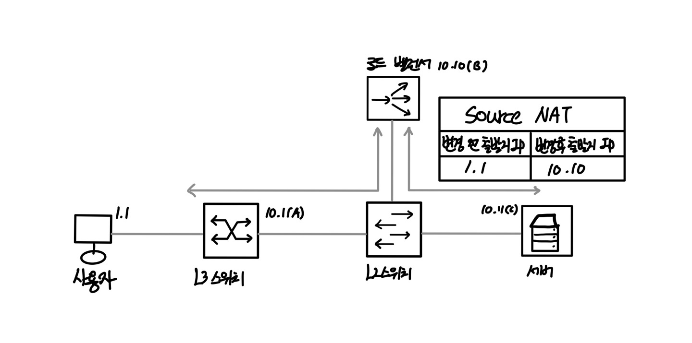

> 로드밸런서에서의 Source NAT 설정

#### DSR 모드

원암 구조의 동일 네트워크에서 DSR 모드를 사용할 수 있습니다. 로드 밸런서 동작 모드에서 알아보았듯이 DSR 모드는 사용자의 서비스 요청 트래픽에 대해 별도의 Destination NAT를 수행하지 않고 실제 서버로 서비스 요청 패킷을 전송합니다. 각 서버에는 서비스 IP 정보가 루프백 인터페이스에 설정되어 있으며 서비스에 응답할 때, 루프백에 설정된 서비스 IP 주소를 출발지로 응답합니다.

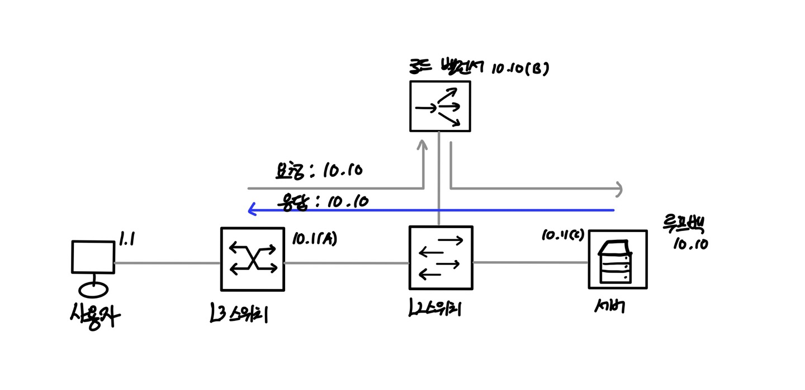

### 2. 동일 네트워크 내에서 서비스 IP (VIP) 호출

로드 밸런서 구성상 두 번째 유의사항으로 다룰 내용은 동일 네트워크 내에서 서비스 IP(VIP)를 호출하는 경우입니다.

서버 #1은 로드 밸런서의 서비스 IP를 통해 부하 분산이 이루어지고 있는 서버입니다.

1. 이때, 서버 #2에서 서버 #1의 서비스 IP 호출을 위해 로드밸런서로 서비스 요청을 합니다.
2. 로드밸런서에서는 목적지 IP인 서비스 IP주소를 서버 #1의 IP 주소로 변환해 서버 #1로 전달합니다
3. 서비스 요청을 받은 서버 #1은 서비스를 호출한 출발지 IP를 확인해 응답하는데 이때 서비스를 호출한 출발지가 자신과 동일한 네트워크임을 확인합니다. <br/>
   동일한 네트워크이므로 목적지에 대해 로드 밸런서를 거치지 않고 바로 응답합니다.
4. 서버 #2에서는 서비스를 요청한 IP 주소가 아닌 다른 IP 주소로 응답이 오므로 해당 패킷은 폐기되면서 정상적인 서비스가 이루어지지 않게 됩니다.

이런 문제는 원암 구성이든 인라인 구성이든 어느 경우든지 발생할 수 있는 문제입니다.

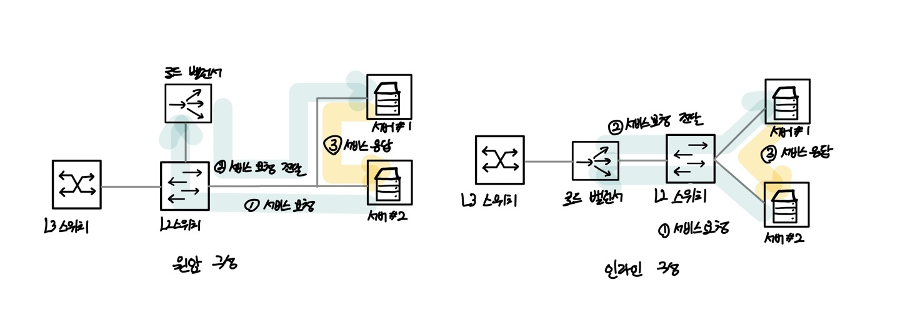

> 인라인과 원암 구성은 동일한 네트워크 내에서 서비스 호출 시 로드 밸런서를 거치지 않고 응답하면 문제가 발생할 수 있다.

이 문제의 해결 방법도 앞에서 알아본 문제의 해결 방법과 거의 같습니다. 서비스 요청이 로드 밸런서를 거칠 때, 출발지 IP 주소를 로드밸런서의 IP로 변경하는 Source NAT 방법을 사용하거나 DSR모드를 사용해 실제 서버에서 로드 밸런서를 거치지 않고 직접 응답하면 됩니다.

그 밖에 동일한 네트워크에서의 서비스 IP 호출을 해결하는 또 다른 방법은 부하 분산 서비스를 받는 서버를 로드 밸런서에 직접 연결해 어떤 서비스 요청에 대한 응답이든 물리적으로 로드 밸런서를 거치게 하는 것입니다.

하지만 이 방법은 로드 밸런서의 포트 수가 제한되어 있어 서버 확장에 제한적입니다. 또한, 로드 밸런서 장비는 포트 수가 많아지면 가격이 매우 비싸지므로 이 방법을 권장하지 않습니다.

여기서 다룬 로드 밸런서 구성 문제 외에 다양한 문제가 발생할 수 있고 여기서 제시한 문제 해결방법이 완벽하지 않을 수도 있습니다. Source NAT 방법을 사용한다면 서비스 요청이 매우 많을 때, Source NAT를 할 수 있는 서비스 포트 범위가 제한적이므로 Source NAT 되는 IP 주소를 하나의 IP가 아닌 범위로 지정해야 할 수도 있습니다.

서비스 흐름과 서비스 요건에 따라 최적화된 로드 밸런서의 구성이나 동작모드가 달라집니다. 서비스 흐름에 대한 이해가 가장 중요하지만 이런 서비스 흐름을 로드 밸런서 구성에 적용하려면 각 구성과 모드부터 이해해야 합니다.

또한, 각 구성과 모드에서 발생할 수 있는 문제의 처리 방법도 그 이해가 바탕이 됩니다. 따라서 구성과 모드별로 트래픽이 어떻게 흐르고 변경되는지 잘 알아두어야 합니다.

## HAProxy 를 이용한 로드 밸런서 설정

```
HAProxy : https://www.haproxy.org/
```

HAProxy는 기존 하드웨어 로드 밸런서의 역할을 일반 서버에서 직접 수행하게 해주는 오픈소스 기반의 소프트웨어 로드 밸런서입니다.

하드웨어 로드 밸런서에서 제공되는 기능을 소프트웨어로 제공하므로 일종의 NFV(Network Function Virtualization)라고 볼 수 있습니다.

HAProxy는 간단한 설정만으로 바로 사용할 수 있어 하드웨어 로드밸런서를 구축해야 하는 환경과 달리 로드밸런서 서비스를 신속히 제공할 수 있습니다. 소프트웨어 형태이므로 가상화나 클라우드 환경에서 로드 밸런서로 사용하기에 매우 적합한 솔루션입니다. 또한, 쿠버네티스의 인그레스 컨트롤러(Ingress Controller)역할도 할 수 있습니다.

HAProxy는 초기에 오픈 소스의 일반 커뮤니티(Community)버전만 있었지만 현재는 추가 서비스 모듈, 도구, 지원 서비스를 포함한 엔터프라이즈 (Enterprise)버전도 함께 제공하고 있습니다. 또한, HAProxy를 적용한 하드웨어 어플라이언스(Hardware Appliance) 형태의 모델인 ALOHA 로드밸런서도 제공하고 있습니다.

원고를 쓰는 현재 시점에서 HAProxy 커뮤니티 안정화(stable)버전은 2.0.7 이 최신 버전이고 개발(dev)버전은 2.1-dev1이 최신 버전입니다.

원고 현재 버전에서 로드 밸런서 역할을 수행하기 위한 대부분의 기능을 제공하고 있고 버전이 올라가면서 새로운 기능이 지속적으로 추가되고 있습ㅈ니다.

### 1. HAProxy 설치

```
HAProxy 설치

# dnf install haproxy
```

패키지 저장소(Repository)에서는 최신 버전이 없을 수도 있습니다.

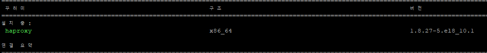

```
버전 확인

# dnf info haproxy
```

최신 버전의 HAProxy를 사용하려면 yum 말고 최신 소스를 직접받아 컴파일해야 합니다. 이 경우, 직접 컴파일을 설치하기 위한 필수 패키지가 사전에 설치되어 있어야 합니다.

```
# dnf install gcc
# wget http://www.haproxy.org/download/2.1/src/haproxy-2.1.4.tar.gz
# tar xzvf haproxy-2.1.4.tar.gz
# cd haproxy-2.1.4/
# make TARGET=linux-glibc
# make install
# haproxy -v
```

TARGET은 설치하려는 운영체제에 따라 다르지만 HAProxy 2.0으로 올라가면서 기존에 사용하던 옵션이 정리되고 보통 linux-glibc를 사용합니다.

TARGET 외에도 다양한 옵션이 있지만 여기서는 TARGET만 지정하고 컴파일합니다. 컴파일하는 데 시간이 걸리니 컴파일이 정상적으로 완료될때까지 잠시 기다립니다.

이어서 /usr/sbin 디렉터리에 haproxy 심볼릭 링크를 설정합니다.

```
# ln -s /usr/local/sbin/haproxy /usr/sbin/haproxy
```

haproxy 서비스로 등록하기 위해 haproxy 설치 디렉터리에 있는 example 디렉터리의 haproxy , init 파일을 init.d 디렉터리에 복사하고 권한 (Permission)을 변경한 후 데몬을 재시작합니다.

```
# cp ~/haproxy-2.1.4/examples/haproxy.init /etc/init.d/haproxy
# chmod 755 /etc/init.d/haproxy
# systemctl daemon-reload
```

HAProxy의 환경 설정 및 통계 값을 위한 디렉토리 및 파일을 생성합니다.

```
# mkdir -p /etc/haproxy
# mkdir -p /var/lib/haproxy
# touch /var/lib/haproxy/stats
```

이제 HAProxy를 사용하기 위한 기본 설치 작업이 모두 완료되었습니다. 하지만 HAProxy 서비스를 시작하면 HAProxy 설정 파일이 없기 때문에 서비스가 정상적으로 시작되지 않습니다. 12.8.2 HAProxy 설정 절에서 HAProxy 설정파일에 대해 알아보고 이 설정 파일로 12.8.3 HAProxy 동작 및 모니터링 절에서 HAProxy 가 동작하는것을 확인해보겠습니다.

### 2. HAProxy 설정

HAProxy 는 haproxy.cfg 파일에 기본 속성과 부하 분산 설정을 하고 HAProxy 서비스를 실행하면 이 설정 값을 불러와 구동됩니다. 기본 설정 파일 경로는 다음과 같습니다.

```
HAProxy 기본 설정 파일 경로

/etc/haproxy/haproxy.cfg
```

```
참고

기본 설정 파일을 사용할 수도 있지만 별도의 설정 파일을 만들고 haproxy 를 실행할 때,
-f 옵션으로 설정 파일을 별도로 적용할 수도 있습니다.
```

HAProxy 설정 파일은 몇 개 섹션으로 구분되는데 프로세스 전반에 적용되는 값을 설정하는 global 섹션과 실제 로드밸런서 수행을 위한 defaults, listen , frontend , backend 섹션으로 나눌수 있습니다. 이제 각 세션에 대한 간단한 설명과 예제를 통해 HAProxy로 어떻게 로드 밸런서 역할을 수행할 수 있는지 살펴보겠습니다.

> HAProxy 설정 파일의 섹션

|   섹션   |                             설명                              |
| :------: | :-----------------------------------------------------------: |
|  global  |           HAProxy 프로세스 전반에 적용되는 설정 값            |
| defaults |               부하 분산에 적용되는 기본 설정 값               |
| frontend |           실제 서비스에 사용될 가상 IP 관련 설정값            |
| backend  | 가상 IP에 전달되어 실제 서비스에 사용되는 리얼 IP에 대한 설정 |
|  listen  |     frontend 와 backend 섹션을 동시에 설정할 수 있는 섹션     |

haproxy.cfg 의 각 섹션과 코드 부분은 다음과 같습니다.

1. global 섹션 <br/>

   - HAProxy 프로세스 전반에 적용되는 설정값
   - log , daemon , maxconn 등

2. defaults 섹션 <br/>

   - listen 섹션이나 backend 섹션에 설정이 별도로 없을 때 사용한느 설정 값
   - mode , timeout , maxconn 등에 대한 값을 지정할 수 있음

3. frontend 섹션

   - 실제 서비스에 사용될 가상 IP 관련 설정
   - bind : 가상 IP에서 사용될 서비스 IP

4. backend 섹션

   - 가상 IP 에서 전달되어 실제 서비스에 사용되는 Real IP에 대한 설정

5. listen 섹션
   - frontend 와 backend의 동시 설정이 가능한 섹션
   - frontend 와 backend를 나누어 설정할 필요가 없을 때는 listen 섹션으로만 설정 가능
   - 상태 및 통계 정보를 보기 위해서도 사용

지금끼지 알아본 각 섹션의 내용으로 최종 HAProxy 설정을 다음과 같이 정리할 수 있습니다.

```
/etc/haproxy/haproxy.cfg

global
daemon

defaults
  mode            http
  timeout connect 10s
  timeout client  1m
  timeout server  1m

frontend http-in
  bind              *:8010
  default_backend   zigiApp

backend zigiApp
  balance roundrobin
  server App1 10.10.10.11:80 check
  server App2 10.10.10.12:80 check
```

또는 frontend 와 backend 섹션 대신 listen 섹션을 사용해 다음과 같이 설정할 수도 있습니다.

```
/etc/haproxy/haproxy.cfg

global
daemon

defaults
  mode            http
  timeout connect 10s
  timeout client  1m
  timeout server  1m

listen http-in
  bind              *:8010
  balance roundrobin
  server App1 10.10.10.11:80 check
  server App2 10.10.10.12:80 check
```

### 3. HAProxy 동작 및 모니터링

HAProxy 설치 및 설정 파일을 모두 마치면 이제 HAProxy를 이용해 부하 분산을 할 수 있습니다. 서비스 또는 명령 줄에서 HAProxy 를 다음과 같이 직접 실행합니다.

```
서비스로 실행하는 경우

# systemctl start haproxy
```

```
명령 줄에서 직접 실행하는 경우

# haproxy -f /etc/haproxy/haproxy.cfg
```

HAProxy를 실행한 후에는 현재 netstat 으로 리스닝 중인 서비스 포트를 확인해 보면 HAProxy로 실행한 8010포트가 정상적인 리스팅 상태임을 확인할 수 있습니다.

```
# netstat -an | grep 8010
```

이제 HAProxy로 설정한 frontend 에 설정된 서비스 IP와 포트로 접속하면 backend 로 정상적으로 설정된 리얼 서버로 연결되는 것을 확인할 수 있습니다.

물론 실제 서버 두 대 중에 서비스가 다운된 서버가 있다면 HAProxy에서 그것을 감지해 해당 서버로는 부하 분산을 하지 않습니다.

HAProxy는 현재 HAProxy에 설정된 frontend , backend , listen 섹션에 설정된 서비스 상태와 통계 내용을 모여주는 웹 UI도 제공합니다. 상태 및 통계 웹 UI를 사용하려면 HAProxy 설정 파일에 상태 및 통계 제공 웹을 위한 설정을 추가합니다.

```
/etc/haproxy/haproxy.cfg

listen monitor
  mode http
  bind        *:8020
  stats enable
  stats auth zigi:zigi
  stats refresh 10s
  stats uri /monitor
```

실제 통계를 볼 수 있는 웹에 접근할 수 있도록 서비스 포트(8020)를 추가로 열고 auth 로 해당 웹에 접근하기 위한 꼐정을 지정합니다. 여기서는 계정과 비밀번호 모두 zigi로 설정했습니다.

여기서 지정한 계정으로 웹에 접근할 때는 로그인하게 되고 계정을 별도로 지정하지 않으면 로그인과정 없이 바로 접속됩니다. 상태 페이지가 갱신되는 시간은 refresh에서 설정하며 여기서는 10초로 설정했습니다.

접속하기 위한 주소는 uri에서 /monitor로 설정했습니다.

HAProxy를 통계 웹 UI를 볼 수 있는 내용을 추가했다면 이제 HAProxy 서비스를 다시 시작하고 /monitor로 접속합니다. 접속하면 다음과 같은 통계 웹 UI를 확인할 수 있습니다.

여기서는 HAProxy로 부하분산하는 설정만 간단히 알아보았지만 앞에서 말했듯이 HAProxy에는 기존 하드웨어 로드밸런서에서 제공하는 다양한 기능이 있습니다. HAProxy를 설치할 때 포함된 예제 설정 파일 내용을 참고하거나 홈페이지의 가이드 문서 내용을 이용하면 하드웨어 로드밸런서가 없는 환경에서도 HAProxy 로 로드 밸런싱 환경을 손쉽게 구축할 수 있을 것입니다.

전용 로드밸런서 장비와 비교하면 물론 안정성이나 성능은 떨어질 수 잇고 기능면에서도 모두 원하는 기능을 제공하지 않을 수 있으므로 실제 서비스 환경에서 도입할 때는 다양한 검토가 필요합니다.

대신 실제 서비스가 아닌 개발 환경에서는 별도의 로드밸런서 장비 없이 부하 분산 및 이중화 테스트에 매우 쉽고 유용하게 사용될 수 있습니다.
