# 네트워크 디자인

## 2계층/3계층 네트워크

### 1. 2계층 네트워크

2계층 네트워크는 이름 그대로 호스트 간 통신이 직접 2계층 통신만으로 이루어지는 네트워크 디자인 입니다. 2계층 통신을 하려면 통신할 호스트가 동일한 네트워크이여야 합니다. 동일한 네트워크 간의 통신이므로 게이트웨이를 거치지 않고 직접 호스트 간 통신이 가능한 구조입니다.

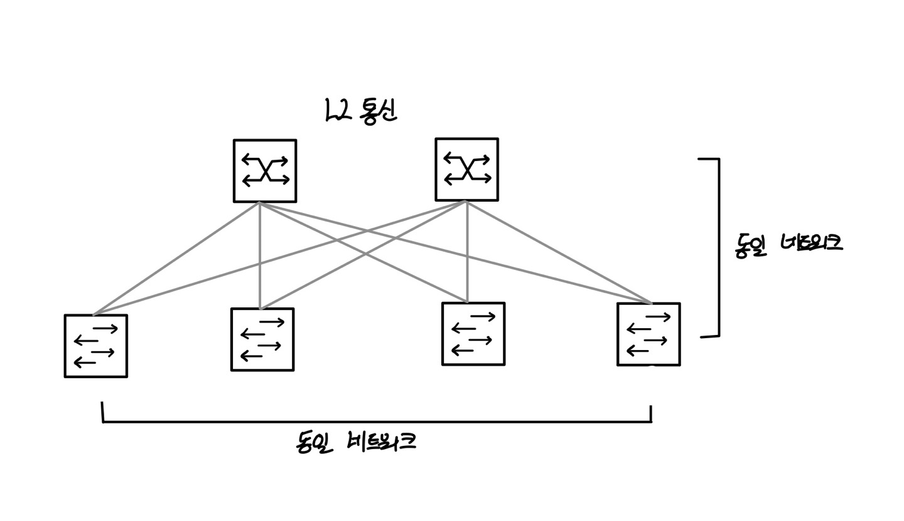

2계층 네트워크는 앞에서 배웠듯이 하나의 브로드캐스트 도메인이 되고 루프(Loop) 구조가 생기면 문제가 발생하므로 스패닝 트리 프로토콜 (STP)을 사용해 문제를 해결합니다. 스패닝 트리 프로토콜을 사용으로 블록 포인트가 생기면서 전체 인프라의 대역폭을 사용하지 못하는 문제가 있습니다.

이 문제를 해결하려면 논블로킹 (Non-Blocking)구조를 만들어야 합니다. MC-LAG와 같은 기술을 이용해 루프를 제거하고 논블로킹 구조를 구현할 수 있습니다.

> 2계층 네트워크의 루프/루프 프리 구성


### 2. 3계층 네트워크

3계층 네트워크는 이름 그대로 호스트 간 통신이 IP 라우팅과 같은 3계층 통신으로 이루어지는 네트워크 디자인입니다. 라우팅으로 구성된 네트워크 구조이므로 루프 문제가 발생하지 않습니다.

전체 네트워크 인프라의 대역폭을 ECMP(Equal Cost Multi Path) 라우팅 기술을 이용해 모두 사용할 수 있습니다. 다만, 3계층 네트워크로 디자인된 구성은 네트워크 장비 연결마다 다른 네트워크를 가지고 네트워크에 연결되어 있는 단말도 다른 네트워크 장비에 연결되어 있다면 다른 네트워크를 갖게 됩니다. 브로드캐스트로 상태방 호스트를 직접 찾을 수 없어 이런 형태의 통신이 필요하다면 3계층 기반 디자인을 사용할 수 없습니다.

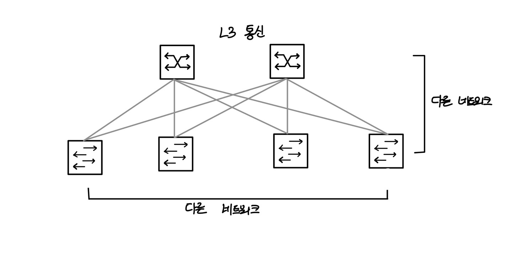

하지만 VxLAN 과 같은 오버레이 (Overlay) 네트워크 기술을 사용해 하단 호스트 간에 동일한 네트워크를 사용하면서도 네트워크 장비 간에 3계층 통신을 하도록 구성할 수 있습니다. 이런 구성은 2계층 네트워크를 확장하면서도 3계층의 장점인 루프 없이 전체 네트워크 대역폭을 모두 사용할 수 있게 만들어줍니다.

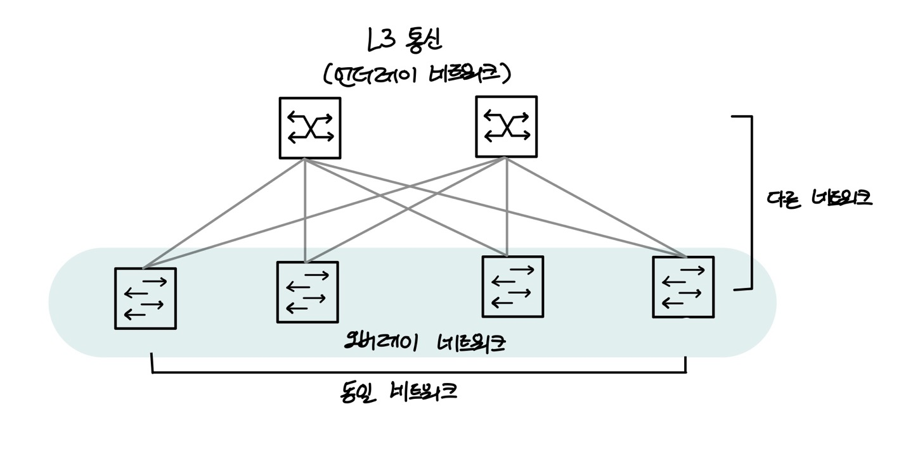

이런 오버레이 기술은 VxLAN이나 GRE와 같은 터널링 프로토콜을 기반으로 합니다.

## 3-Tier 아키텍처

코어(Core) - 에그리게이션(Aggregation) - 엑세스 (Access) 3계층으로 이루어진 네트워크 아키텍처는 네트워크 디자인에서 빠질 수 없는 전통적인 네트워크 디자인 기법입니다.

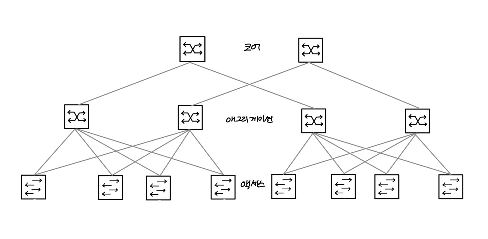

호스트가 직접 연결된 엑세스 계층에 스위치가 있고 엑세스 스위치를 중간에서 집선하는 애그리게이션 스위치가 그 상단에 있습니다. 코어 계층 스위치는 에그리게이션 스위치를 다시 모아 서로 통신할 수 있게 연결해줍니다.

전통적인 데이터 센터와 일반적인 캠퍼스 네트워크 디자인 기법이었으며 지금도 많이 사용되고 있습니다.

상위 레이어로 올라갈수록 장비들이 집선되므로 높은 대역폭(Bandwidth)이 필요합니다. 집선 구간의 대역폭을 확보하지 못하면 병목현상이 발생할 수 있으므로 각 레이어 상단과의 연결 구성인 업링크(Uplink)에서는 오버서브스크립션 비율(Oversubscription Ratio)을 잘 산정해 구성해야 합니다.

데이터 센터의 경우, 3-Tier 네ㅡ투어크 디자인은 서버 간 통신보다 사용자로부터 서비스를 요청받고 서버에서 사용자의 요청에 응답하는 North-South 트래픽이 대부분인 경우에 적합한 구조입니다.

## 2-Tier 아키텍처

### 1. 스파인-리프 구조

몇년 전부터 스파인-리프(Spine-Leaf) 2-Tier 디자인 기법이 데이터 센터 디자인으로 많이 적용되고 있습니다. 하단 호스트가 연결되는 리프 스위치는 상단 스파인 스위치와 연결됩니다.

리프 스위치와 스파인 스위치 간에는 전통적인 2계층 스패닝 트리가 동작하지 않고 모든 링크를 사용해 트래픽을 전송합니다.

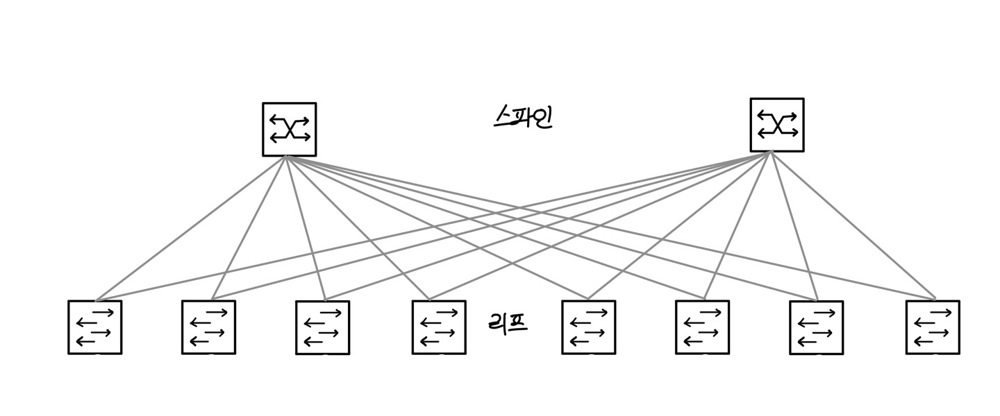

North-South 라고 부르는 외부 사용자의 트래픽이 주였던 과거와 달리 대용량 분산 처리 기술이 많이 사용되는 최근에는 데이터 센터 내부의 서버 간 통신량이 급증했습니다. 데이터 센터 내 계층이 복잡할수록 East-West 트래픽(서버 간 통신)이 많은 현대 네트워크에서는 네트워크 부하가 커지고 성능 지연이 발생할 수 있습니다.

이런 문제를 보안하기 위해 전통적인 3계층 아키텍처에서 스파인-리프 아키텍처로 네트워크 디자인 기법이 변하고 있습니다.

스파인-리프 네트워크 디자인에서는 동일 리프 스위치에 호스트가 연결된 경우를 제외하면 모든 호스트 간 통신 홉이 동일합니다. 출발지 리프 스위치를 지나 스파일 스위치를 거쳐 목적지 리프 스위치로 트래픽이 흘러 네트워크 흐름에 대한 홉 수가 짧아지고 트래픽 흐름이 일정해진다는 장점이 있습니다.

앞에서 잠시 말했지만 이것은 스파인-리프 스위치 사이의 모든 링크를 사용할 수 있습니다. 스파인-리프 스위치 사이는 2계층 네트워크나 3계층 네트워크로 구성할 수 있습니다.

> 참고 East-West 트래픽

데이터 센터의 트래픽 트렌드가 North-South 트래픽에서 East-West 트래픽으로 변한 데는 몇가지 이유가 있습니다. 다음은 그 변화의 몇가지 예입니다.


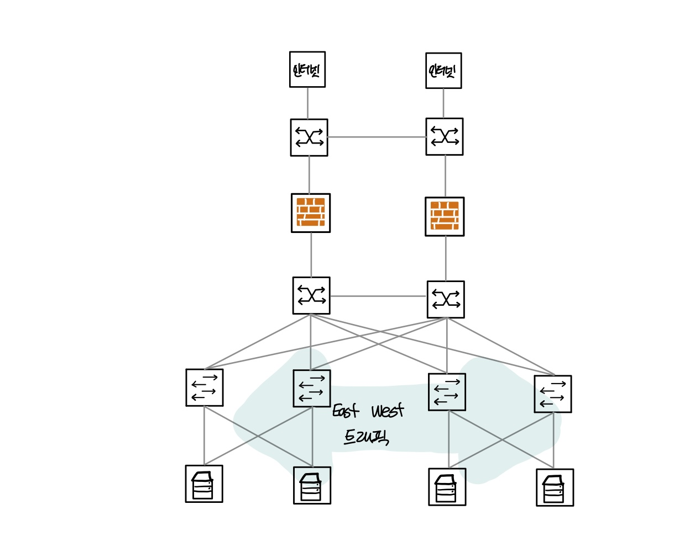

1. 서버 가상화<br/>
   서버 가상화로 인해 서버 호스트 하나에 다수의 가상 머신(VM)이 운영됩니다. 서버 가상화를 사용하면서 동일한 네트워크에 속한 서버들이 하나의 리프 스위치에 연결되지 않고 다양한 스위치에 연결됩니다. <br/>
   이때 동일한 서비스를 위한 서버들의 통신이 바로 옆에서 연결되지 못하고 스파인을 거쳐 통신이 되어야 합니다. 또한, 가상 머신은 하나의 호스트 내에 지속적으로 있는 것이 아니라 가상 머신 마이그레이션 기술을 이용해 이동하므로 이 작업이 수행되면 대량의 트래픽이 데이터 센터 내에서 발생합니다.

2. 빅데이터 대중화<br/>
   빅데이터(Big Data)를 다루는 기술이 오픈 소스화되고 분산 처리로 저렴한 가격에 대량의 데이터를 분석할 수 있게 되면서 빅데이터 기술이 대중화되었습니다.<br/>
   이런 빅데이터 기술들은 기본적으로 분산 처리를 하므로 컨트롤 노드와 데이터 저장 노드로 분리되어 있고 이런 기능의 분리는 서버 간 통신이 많다는 특징이 있습니다. 또한, 빅데이터에서 널리 쓰이는 하둡(Hadoop)은 동일한 데이터를 기본적으로 3 카피(Copy)해 데이터 노드에 저장하므로 대량의 트래픽이 데이터 센터에서 흐르게 됩니다.

3. 애플리케이션 아키텍처와 개발 방법의 변화 <br/>
   마이크로 서비스 아키텍처(Micro Service Architecture , MSA)와 같은 애플리케이션 아키텍처의 변화 방향은 클라이언트와 서버 간 통신뿐만 아니라 서버 간 통신도 증가시킬 수 있습니다. 기존 서버 한 대에서 다양한 서비스를 제공하던 것이 다수의 단독 서비스로 분리되면서 서비스 간 내부 통신이 많아집니다. 또한, 이런 아키텍처는 빈번한 배포가 가능한 VM, 컨테이너와 같은 유영ㄴ한 인프라 기반으로 이루어지므로 데이터 센터 내 트래픽 증가를 가속화할 수 있습니다.

### 2. L2 패브릭

스파인-리프 구조에서 스파인-리프 사이를 2계층 네트워크로 구성하는 방법입니다. 이런 L2 패브릭을 구성하기 위해 TRILL(TRansparent Interconnection of Lots of Links)이나 SPB(Shortest Path Bridging)와 같은 프로토콜을 사용할 수 있습니다. 일반적인 2계층 구조에서는 루프에 대한 제약 때문에 모든 링크를 활성화할 수 없지만 TRILL 이나 SPB와 같은 프로토콜은 이런 문제를 해결하도록 구현되어 있습니다.

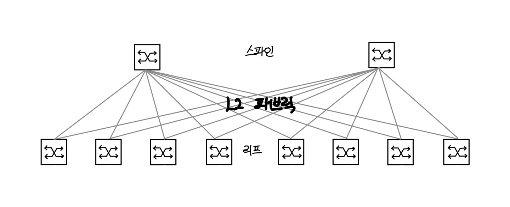

시스코의 Fabric Path 나 익스트림의 VSC Fabric 과 같은 기술도 이 프로토콜을 기반으로 L2 패브릭을 만들 수 있게 한 벤더의 기술 명칭입니다.

### 3. L3 패브릭

스파인-리프 구조에서 스파인과 리프 사이를 3계층 네트워크로 구성하는 방법입니다.

스파인과 리프가 연결된 링크는 각각 라우팅이 활성화되어 있고 일반적인 라우팅 프로토콜을 이용해 경로 정보를 교환합니다. 라우팅으로 구성되어 있어 별도의 특별한 기술 없이도 루프를 제거하고 ECMP를 통해 모든 링크를 사용할 수 있습니다.

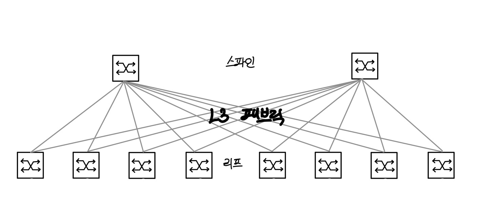

스파인-리프 구조를 L3 패브릭으로 구성하는 경우, 하단 호스트의 네트워크가 리프 간에 서로 다른 네트워크를 갖게 됩니다. 동일한 네트워크 구성이 필요할 때는 VxLAN과 같은 오버레이 네트워크 기술을 이용해 상단에 L3 패브릭으로 구성된 스파인-리프 구조에서도 리프 하단의 L2 네트워크를 확장해 동일한 네트워크를 가질 수 있습니다. 이런 환경은 가상화 서버의 라이브 마이그레이션과 같은 서비스를 위해 사용됩니다.

이런 오버레이 기술을 사용하면 IP 이동이 보장되는 네트워크를 구성할 수 있습니다.

## 데이터 센터 Zone / PoD 내부망 / DMZ망 / 인터넷망

데이터 센터를 설계할 때는 데이터 센터의 다양한 구성 요소와 역할을 고려해야 합니다. 하나의 큰 망 안에서 다양한 역할을 모두 수행할 수도 있지만 보안이나 관리상 이유로 용도별로 데이터 센터망을 분리해 설계합니다.

분리된 망은 용도별로 나누어져있어 망 간 보안을 고려해 방화벽과 같은 보안 장비와 연동하도록 구성해야 합니다.

> 데이터 센터 구성(개념도)

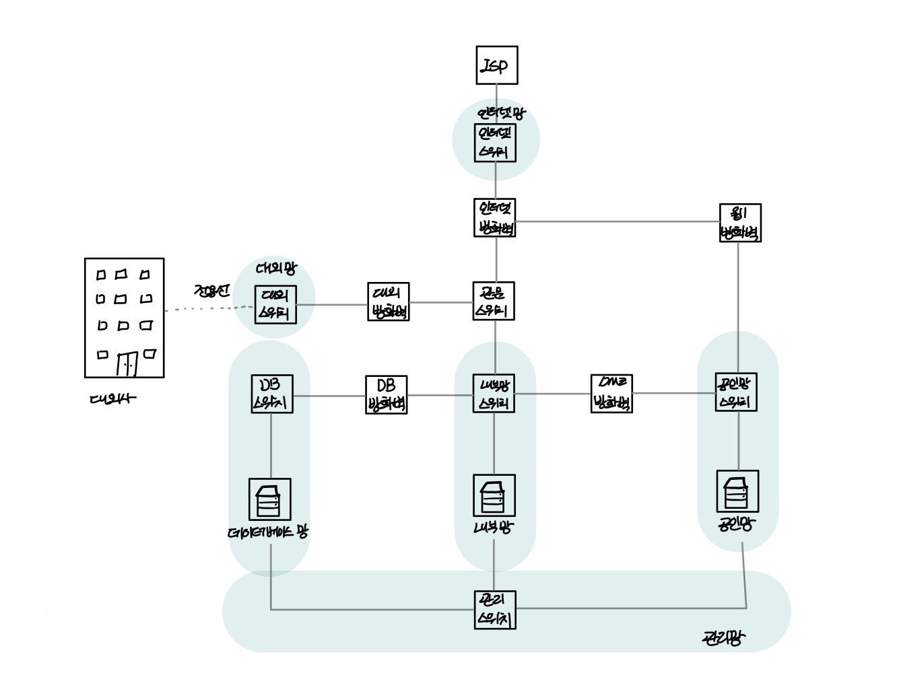

### 1. 인터넷 망

데이터 센터에서 제공하는 서비스는 인터넷을 통해 다양한 사용자가 접근하도록 구성되어 있습니다. 그 중 외부 인터넷에서 사용자가 데이터 센터에 접근할 수 있도록 구성된 영역을 인터넷망이라고 합니다.

인터넷망은 KT, LGU+ , SKB와 같은 ISP(Internet Service Provider)에서 인터넷 회선을 받아 연동되어 있습니다. 소규모 데이터 센터는 ISP에서 IP를 할당받아 인터넷에 쉽게 연결할 수 있지만 어느 정도 규모가 큰 데이터센터는 ISP와 연동할 때, BGP 프로토콜을 이용하고 별도 AS(Autonomous System)번호를 갖고 있습니다.

단일 회선을 가지고 있더라도 자신이 소유한 IP를 사용하려면 AS번호를 할당받고 BGP 프로토콜을 이용해 ISP에 연결해야 합니다. 단일 회선으로 구성할 수도 있지만 규모가 더 크다면 서비스 안정성을 위해 ISP 연결을 이중화하거나 삼중화 해야합니다.

### 2. 공인망(DMZ)

데이터 센터에서 외부 사용자에게 직접 노출되는 웹 서비스 드으이 서버들이 모인 망입니다. 데이터 센터 외부 접근을 위해 공인 IP가 사용되어 공인망이라고 부르거나 서비스를 외부로 제공하므로 서비스망이라고도 부릅니다.

그리고 언트러스트(Untrust)네트워크인 데이터 센터 외부의 인터넷 구간과 트러스트(Trust) 네트워크인 데이터 센터 내부망의 연결 지점 역할을 하므로 군사분계선을 뜻하는 DMZ(DeMilitarized Zone)라고도 부릅니다.

### 내부망 (사내망/사설망)

공인망이나 DMZ망과 달리 데이터 센터 내부나 사내에서만 접근할 수 있는 네트워크를 내부망이라고 부릅니다. 내부망은 일반적으로 사설 대역의 IP로 구성하므로 인터넷을 통한 외부망에서는 직접 접근할 수 없습니다.

내부망 중 데이터 센터 관리나 내부 직원용 서버팜인 경우, 보안상 외부망과의 연결을 단절하거나 최소화해야 합니다. 외부망과 통신할 때는 사설 IP로 통신할 수 없으므로 외부망으로 나가려면 중간에 공인 IP 로 변환해주는 NAT이 필요합니다. 원격지에 있는 내부망 간 연결은 VPN이나 전용선으로 연결할 수 있습니다.

### 데이터베이스망

데이터베이스는 개인정보를 취급하는 경우가 많아 보안을 강화하기 위해 내부망에 데이터베이스망을 별도로 두기도 합니다. 공인망으로부터 내부망을 보호하기 위해 방화벽을 두듯이 데이터베이스망도 내부망에서 접근할 때, 추가로 방화벽을 두고 별도 망을 구성할 수 있습니다. 서버 간 통신이 아니면 보안을 더 강화하기 위한 접근 통제 시스템을 운영하고 데이터베이스에 접속할 때는 접근 통제 시스템을 통해야만 가능하도록 구성합니다.

### 대외망

회사 대 회사로 서비스 연동이 필요한 경우 인터넷망을 통해 연동할 수도 있지만 별도 전용선이나 VPN을 이용해 서비스를 연동할 수 있습니다. 금융서비스와 같이 보안이 더 필요한 경우, 전용회선과 VPN을 동시에 사용하기도 합니다. 이렇게 다른 대외사와의 연동을 위해 별도 망으로 분리하기도 합니다. 이것은 대외사와 연동된 지점에서 사내로 접근할 때 서비스에 필요한 최소한의 접근만 허용하기 위해서입니다.

### 관리망/OoB(Out of Band)

데이터 센터 내 서버나 네트워크 장비는 서비스를 위한 인터페이스도 있지만 장비 자체를 관리하기 위한 관리용 인터페이스를 별도로 제공하기도 합니다.

네트워크 관리망과 서버 관리망은 목적이나 운영 방법에서 조금 다릅니다. 보통 네트워크 관리망은 장비 운용을 위한 CLI나 웹 접속을 위해 사용됩니다. 일반 서비스망으로도 장비에 접근할 수 있어 관리망과 별도 서비스망 접근에는 큰 차이가 없습니다.

다만 서비스망과의 분리가 필요한 이유는 서비스망에 문제가 발생하더라도 서비스망과 별도로 분리된 관리망을 통해 장비에 접근해야 하기 때문입니ㅏㄷ.

서버 관리망은 일반적인 서비스망과 다릅니다. 서버 관리망을 하드웨어 자체를 관리하기위한 별도의 환경입니다. 물론 해당 관리망을 통해 콘손 접근이 가능하지만 기본적으로 하드웨어 자체를 관리하기 위한 환경이라고 생각하면 이해하기 쉽습니다.

```
참고 : 서버의 관리용 포트

네트워크 장비에서는 관리용 포트를 보통 mgnt 인터페이스라고 부르지만 서버에서는 관리용 포트를 부르는 명칭이 벤터마다 다릅니다.

1. HP:ILO
2. DELL EMC : iDRAC
3. IBM : IMM
4. CISCO : CIMC
5. Fujitsu : IRMC
6. Supermicor : iKVM
```

## 케이블링과 네트워크

데이터 센터 내에는 네트워크 장비는 물론 서버, 스토리지와 같은 장비를 수용할 수 있는 렉(Rack)이 많이 있습니다. ToR 와 EoR은 데이터 센터내에서의 스위치와 서버 간 케이블링 구성 방식에 따라 구분됩니다. ToR 와 EoR 은 스위치의 물리적 위치에 따른 구성으로 이해하면 더 쉬울 수 있습니다.

### 1. ToR

ToR은 Top of Rack의 약자로 이름 그대로 랙 상단에 개별적으로 설치되는 스위치 구성을 말합니다. 일반적으로 각 랙 최상단에 ToR 스위치를 구성하고 해당 랙에 있는 서버들을 연결합니다.랙 내에서의 서버 집적도, 물리적 네트워크 분리, 이중화 요건에 따라 랙 내 스위치는 두 대 이상이 될 수 있고 반대로 랙 두 개를 묶어 하나의 스위치로 관리할 수도 있습니다. 세부 구성과 상관없이 ToR 스위치는 랙 안에 설치된 서버들을 직접 연결하고 상단 네트워크 장비는 별도의 네트워크 랙에 구성되어 서로 연결됩니다. 결국 각 랙에 구성된 서버들은 해당 랙에 있는 ToR 스위치에 연결되고 ToR 스위치는 상단 네트워크 장비에 모두 연결되는 구성을 말합니다.


ToR 구성은 서버가 스위치와 동일한 랙(또는 인접한 랙)에 있으므로 케이블링의 길이나 복잡성이 줄어듭니다. 하지만 ToR 구성은 EoR 구성보다 스위치가 더 많이 필요하므로 네트워크 장비에 대한 관리사항이 늘어납니다.

늘어난 스위치 수량 때문에 전력이나 냉각비용도 따라 늘면서 전체적인 운영비용이 증가할 수 있습니다. 랙 별로 사전에 스위치를 구성해야 하므로 미사용중인 포트가 늘어 포트의 집적도가 떨어질 수 있습니다.

### 2. EoR

EoR 은 End of Row의 약자로 이름 그대로 랙이 있는 행 끝에 네트워크 장비를 두고 각 랙에 있는 서버는 네트워크 장비가 있는 랙까지 케이블로 연결됩니다. 즉, 서버가 있는 랙과 네트워크 장비가 있는 랙을 분리한 구성이 됩니다.

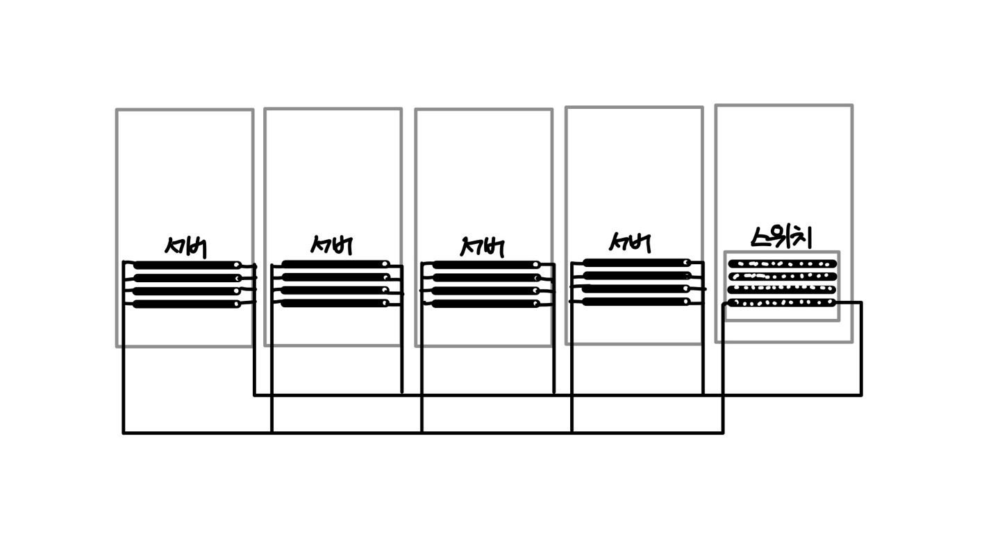

ToR과 달리 EoR 은 네트워크 장비 랙에서 케이블이 서버로 직접 구성되므로 각 랙마다 별도의 개별 스위치를 증성하는 것이 아니라 대형 새시(Chassis)스위치에서 라인 카드를 추가하는 방식으로 포트 수를 증가시킬 수 있어 ToR보다 필요한 스위치 장비 수가 줄어듭니다. 따라서 관리하는 장비 수와 통과하는 스위치 수가 줄어 대기시간이나 지연에 유리합니다.

하지만 서버와의 케이블 구성이 더 멀어지므로 복잡도가 높아지고 케이블이 길어집니다. 따라서 케이블 구축비용이 증가하고 다음에 서버와 스위치 간 인터페이스를 업그레이드 하는 경우, 케이블 교체 비용이 증가할 수 있습니다.

### MoR

MoR(Middle of Row)는 EoR 과 마찬가지로 서버에 연결될 네트워크 장비 랙을 별도로 구성하는 점은 같지만 네트워크 장비의 랙을 행 끝(End)이 아닌 중간 (Middle)에 두는 경우입니다. 전체적인 내용을 EoR과 같지만 네트워크 장비가 중간에 있어 케이블 기이가 전반적으로 감소하는 장점이 있는 구성방식입니다.

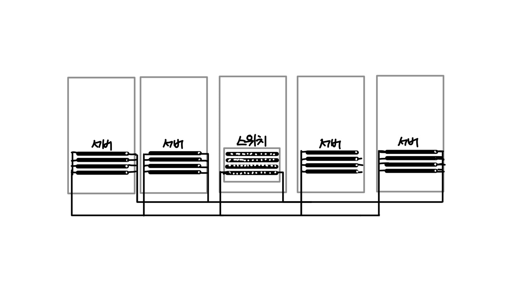
