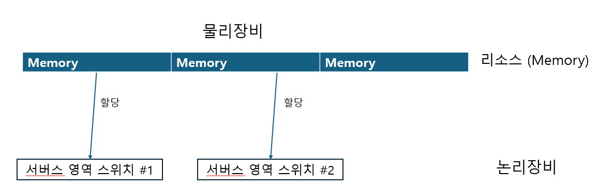
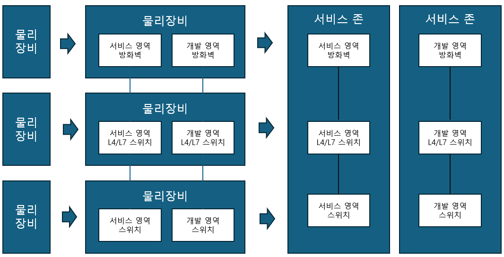
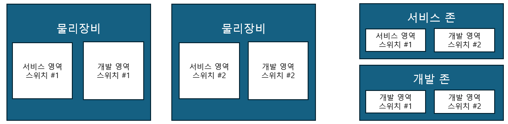
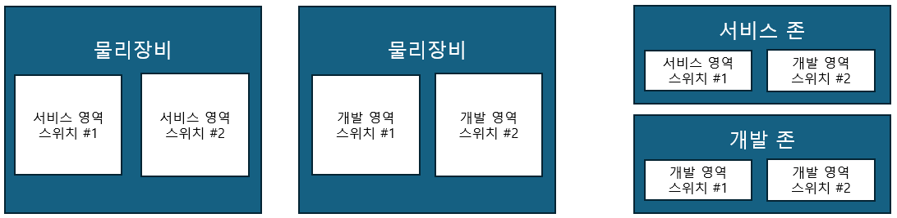

# 가상화 기술

이번 장에서는 네트워크에서 사용되는 가상화 기술 중 장비 가상화에 대해 알아보겠습니다.

## 장비 가상화 기술이란?

가상화는 리소스의 추상화를 말합니다. 물론 가상화하는 리소스와 그 방법에 따라 매우 다양하게 분류할 수 있지만 위키백과에서 언급한 것처럼 장비 가상화 기술은 다음 두 가지로 크게 분류할 수 있습니다.

- 여러 개의 물리 장비를 하나의 논리 장비로 하치는 기술
- 하나의 물리 장비를 여러개의 논리 장비로 나누는 기술

이번 장에서는 이런 분류에 따라 각 장비 가상화 기술에 대해 알아보겠습니다.

먼저 여러 대의 물리 장비를 하나의 논리 장비로 합치는 기술입니다.

여러 대의 물리 장비를 하나의 논리 장비로 구성하는 가상화 기술을 사용하면 여러개의 물리 박스 스위치를 묶어 한 대의 논리적 스위치로 만들 수 있습니다.하나로 가상화된 논리 스위치는 큰 새시형 장비처럼 볼 수 있습니다.

이 기술은 두 가지 장점이 있습니다.<br/>
첫째, 다수의 장비를 하나의 장비처럼 관리할 수 있어 운영자의 관리부하를 줄여줍니다. <br/>
둘째, 이중화 경로를 효율적으로 사용하고 루프 문제를 제거할 수 있습니다. 2계층의 이중화 경로는 루프 (Loop) 발생 위험성 때문에 스패닝 트리 프로토콜 (STP)을 이용해 루프 구조를 제거한 단일 경로만 사용합니다. 전체적인 안정성은 보장되지만 인프라를 효율적으로 사용할 수 없고 장애 발생 시의 페일오버(Fail-Over)시간도 다른 프로토콜보다 긴 편입니다.

여러 대의 물리 장비를 하나의 논리 장비로 구성한 스위치는 2계층의 이중화 경로에서 루프 구조를 제거하면서 전체 경로를 모두 사용할 수 있어 물리적 경로를 모두 활용할 수 있습니다. 예를 들어 스위치 네 대를 사각형으로 연결한 것은 루프 구조여서 하나의 인터페이스가 블록(Block)됩니다.

이때 장비 두 대를 각각 하나의 논리장비로 구성하고 이 논리장비를 연결해 1:1 구조로 만들 수 있습니다.

[그림 546쪽 1]

또한 아예 전체 물리 장비를 하나의 가상 스위치로 구성할 수도 있습니다.

[그림 546쪽 2]

이런 구성으로 2계층의 문제점인 루프 구조에서 벗어날 수 있어 물리적으로 구성된 모든 경로를 이용해 통신할 수 있습니다. 또한, 이중화된 경로에 장애가 발생하더라도 별도의 긴 페일오버 시간이 필요없습니다.

```
참고 : 인터페이스 가상화 기술 LACP와 MC-LAG

앞에서 알아보았던 서버와 스위치의 물리 인터페이스를 하나의 논리 인터페이스로 구성해주는
LACP와 MC-LAG가 바로 이 가상화 기술 범주에 포함될 수 있습니다.
```

여러 대의 물리장비를 하나의 논리장비로 다루는 기술이 있다면 반대로 큰 장비를 나누어 사용할 수도 있습니다. 즉, 하나의 물리장비를 여러개의 논리장비로 나누는 기술입니다.

스위치에선 설명한 VLAN 기술도 이 범주에 속하지만 이런 분류의 대표적 가상화 기술은 VMware 의 ESXi 와 같이 하나의 물리 서버에 여러 개의 가상 서버를 구성하는 서버 가상화 기술입니다. 네트워크 장비에서도 서버 가상화와 같이 하나의 물리 장비를 여러개의 논리장비로 나눌수 있습니다.

가상화 서버처럼 하이퍼바이저를 이용한 가상화 형태로 나누거나 벤더 자체 솔루션을 통해 논리 장비로 나눕니다. 이렇게 가상화를 통해 나뉜 장비는 하나의 물리적 리소스를 공용으로 사용하는 경우도 있지만 각 논리 장비마다 리소스를 독립적으로 할당해 서로 다른 논리 장비 간에는 리소스 사용을 침범하지 않게 해 논리 장비 간에 영향을 미치지 않도록 구성합니다.



이렇게 여러 대로 가상화 된 장비는 데이터 센터 내 장비를 영역별로 나눌 때 사용할 수 있습니다. 데이터 센터 내에는 다양한 목적에 따라 영역(Zone)을 구분해 네트워크를 구성하는데 각 네트워크 영역을 구성하기 위해 공통적으로 필요한 장비들이 있습니다. 데이터 센터 내의 영역별로 물리장비를 각각 구성할 수도 있지만 하나의 물리장비를 논리적으로 가상화해 영역별로 배치해 사용할 수도 있습니다.



하나의 물리 장비를 여러 개의 논리장비로 나누어 사용하면 다음과 같은 효과가 있습니다.

1. 운용시 관리 포인트 감소

   - 각 서비스 영역에 대해서는 개별적으로 동작하더라도 운영 면에서는 하나의 장비로 관리할 수 있어 관리 부하를 줄일 수 있습니다.

2. 자원활용률 증가

   - 서버 가상화처럼 기존 유휴자원을 다른 영역에서 나누어 사용하게 함으로써 네트워크 장비의 자원을 효율적으로 사용할 수 있게 됩니다.

3. 도입비용과 운영비용 절감(Capex & Opex)
   - 물리 장비 대신 논리 장비로 구성하면서 전체 장비 물량이 줄어 도입비용과 운용비용이 절감됩니다.

장비 가상화를 이용해 이중화 구성을 하더라도 물리장비 하나에서 동일한 역할을 논리적으로 나누어 사용하지 않습니다. 논리적으로 구성된 장비가 물리 리소스를 독립적으로 할당해 사용하더라도 물리장비에 장애가 발생하면 논리 장비 모두 서비스의 영향을 받으므로 동일한 역할을 하는 장비의 이중화 구성을 하나의 물리 장비에서 구성하면 안됩니다.

> 네트워크 가상화를 사용한 일반적인 구성



> 네트워크 가상화를 사용한일반적이지 않은 구성



물리 장비를 여러 대의 논리 장비로 가상화할때, 몇가지 유의사항이 있습니다.

여러 영역에 들어갈 장비를 하나의 물리 장비에서 논리적으로 나누려면 각 영역이 요구하는 성능을 무리 장비에서 제공할 수 있어야 합니다. 특히 물리 장비에서 제공하는 성능을 가상화로 나누면 '전체용량/가상화 수'에 정확히 맞추어 성능이 나누어지는 것이 아니라 성능이 저하되는 부분이 있으므로 용량산정에 더 신경써야 합니다.

또한, 방화벽이나 L4/L7 스위치와 같이 하나의 물리 장비에서 제공되는 인터페이스가 많지 않은경우에는 인터페이스 수도 고려해야 합니다.

기능면에서도 물리 장비에서 제공되는 기능이 논리적으로 가상화한 경우에도 정상적으로 제공되는지 확인해야 합니다.

물리 장비를 논리 장비로 나누는 가상화를 도입할 때, 용량과 필요한 기능 제공에 별 문제가 없으면 앞에서 가상화 장비의 장점에서 알아보았듯이 CAPEX와 OPEX 모두 효과적으로 줄일 수 있습니다. 하지만 비용을 줄이려고 장비의 가상화를 무작정 시도하면 문제가 발생했을 때, 손실비용이 더 커질 수 있으므로 더 면밀한 검토가 필요합니다.

```
참고 : CAPEX , OPEX

CAPEX : 장비 도입비용
OPEX  : 운영비용
```

## 벤더별 장비 가상화 기술 : 하나의 논리장비로 만드는 가상화

### 1. 시스코 시스템즈의 가상화 기술

#### VSS

VSS(Virtual Switching System)는 VSL(Virtual Switching Link)로 장비를 연결해 하나의 가상 스위치를 만듭니다. VSS 기술은 Cisco Catalyst 6500/6800 과 Cisco Catalyst 4500 제품군에서 지원되며 VSS를 통해 최대 두 대의 물리 장비를 한 대의 가상 스위치로 구성할 수 있습니다.

VSS는 시스템에서 운영할 수 있는 대역폭을 확장하고 가용성을 증대시킵니다.

#### StackWise/FlexStack

또 다른 가상화 기술로 StackWise가 있습니다. StackWise는 Cisco Catalyst 3750-X/3850 제품군에서 지원되는 가상화 기술입니다. StackWise 와 동일하게 Cisco Catalyst 2960-X/2960-XR 에서 지원되는 FlexStack 이라는 가상화 기술도 있습니다.

모델 라인업에 따라 명칭은 다르지만 기본적 가상황 기술은 유사합니다.

VSS는 최대 두 대의 장비를 하나의 가상 스위치로 구성할 수 있지만 지원되는 StackWise 나 FlexStack 은 최대 8~9대의 스위치를 하나의 가상 스위치로 구성할 수 있습니다.

StackWise 나 FlexStack 과 같은 스택 쉉은 일반 포트를 사용하지 않고 스위치 후면에 있는 별도 스택 구성용 모듈이나 케이블을 사용해 데이지 체인(Daisy Chain) 형태로 구성합니다. 장비 간 통신을 위한 데이터 케이블뿐만 아니라 경우에 따라 전원도 동일한 방식으로 구성합니다.

#### FEX

VSS 나 Stack과 같은 기술이 동일한 장비를 하나의 가상 장비로 구성한다면 하나의 스위치를 다른 장비의 모듈 형태로 구성하는 FEX(Fabric Extender)기술이 있습니다. FEX는 하나의 스위치가 다른 스위치의 모듈 형태로 구성되는 구조이며 FEX 장비에는 별도의 운영체제가 없고 상단 스위치의 운영체제 그대로 사용합니다. FEX 장비를 상단 스위치에 구성하고 확인해보면 기존 새시 장비에서 슬롯을 추가한 것과 같아 보입니다. FEX는 ToR와 같은 용도로 사용하면 각 랙 서버들은 상단 FEX와 연결되지만 관리는 상단 스위치에서만 하면됩니다.

### 2. 주니퍼

주니퍼(Juniper)에서도 여러 개의 물리 장비를 하나의 논리적 장비로 만드는 몇 가지 기술을 제공합니다.

#### 가상 셰시

가상 섀기 (Virtual Chassis)는 EX와 QFX 시리즈 스위치에서 지원되는 가상화 기술입니다. 여러 개의 스위치를 링(Ring) 형태로의 토폴로지로 연결해 하나의 장비처럼 관리할 수 있습니다. 장비 모델에 따라 다르지만 최대 10대의 장비를 스택으로 구성할 수 있습니다.

가상 섀시는 장비 간 연결을 위해 VCP(Virtual Chassis Port) 전용 포트를 사용하는 모델도 있지만 전용 VCP 포트가 없으면 일반 업링크(Uplink)포트를 사용해 장비를 연결할 수도 있습니다.

#### VCF

가상 섀시와 마찬가지로 EX와 QFX 시리즈 스위치에서 지원되는 가상화 기술입니다.

#### 주노스 퓨전

주노스 퓨전(Junos Fusion)은 VSF보다 대규모에 적용될 수 있습니다. 주노스 퓨전은 유형에 따라 다음 3가지 아키텍처로 나뉘며 각 기술에 따라 지원되는 장비 모델이 다릅니다.

### 3. 익스트림(Extreme)

익스트림 (구 브로케이드)에는 여러개의 스위치를 하나의 클러스터 형태의 가상 스위치로 구성하는 VCS(Virtual Cluster Switching)이라는 가상화 기술이 있습니다.

하나의 클러스터로 구성되는 VCS 로지컬 섀시(Logical Chassis)는 최대 48개의 브로케이드 VCS 패브릭을 한 대의 가상 스위치로 만들어 관리할 수 있습니다.

VCS 클러스터로 구성된 스위치 장비는 별다른 설정없이 단순히 스위치 간 ISL(Inter Switch Link)을 구성하는 것만으로 VCS 클러스터에 자동으로 묶이므로 네트워크 스위치의 손쉬운 스케일 아웃(Scale out)을 지원합니다.

### 4. HP 엔터프라이즈(HP Networking)

중략..

## 벤더별 장비 가상화 기술 : 여러 개의 논리 장비로 만드는 가상화

### 1. 시스코 시스템즈

중략

### 2. 시트릭스

중략

### 3. F5

중략

### 포티넷

중략
