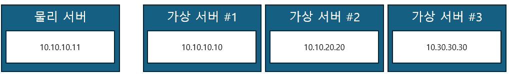
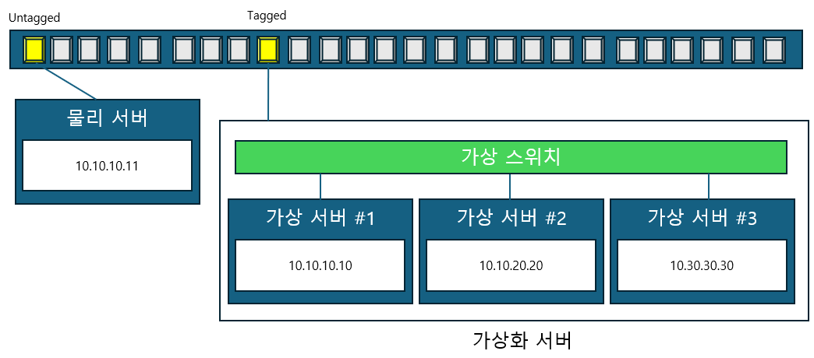
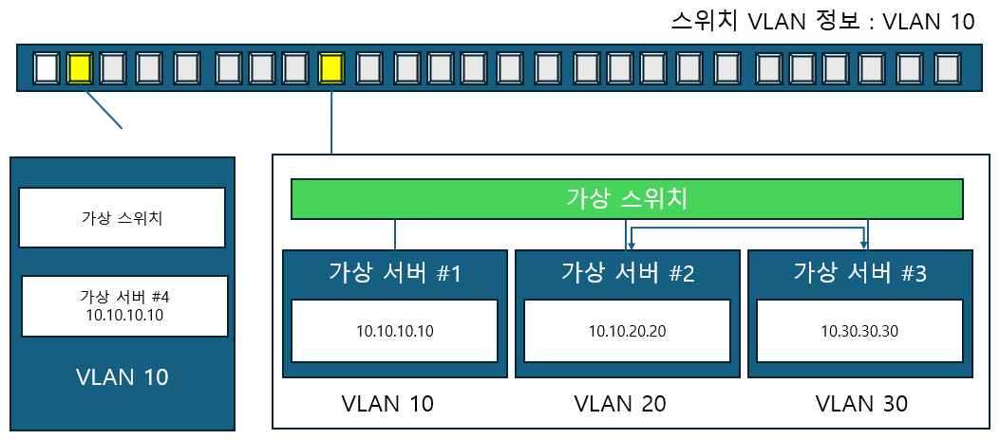

# 가상화 서버를 위한 네트워크

이번 장에서는 가상화 서버가 네트워크에 연결될 때 필요한 네트워크 구성과 가상화 스위치를 이용해 가상화 서버 내에 구성해야 하는 네트워크에 대해 알아보겠습니다.

## 가상화 서버 구성 시의 네트워크 설정

VMware 의 ESXi나 마이크로소프트의 Hyper-V와 같은 하이퍼바이저를 사용하면 하나의 물리 호스트 안에서 여러 개의 가상 서버가 구동됩니다. 하나의 물ㄹ 호스트 내부에 있는 가상 서버가 모두 동일한 네트워크 안에서 동작할 수도 있지만 다양한 네트워크와 서비스를 가상화 서버에 수용하기 위해 두 개 이상의 네트워크를 연결합니다.

> 가상화 서버 안에서 여러 개의 네트워크를 포함하고 있다

VLAN 절에서 설명했듯이 하나의 스위치에 여러 개의 VLAN 이 있을 때, 스위치 간에 모든 VLAN을 연결하려면 VLAN 개수만큼 물리적 케이블과 스위치 포트가 필요합니다. 이런 낭비를 막기 위해 Tagged 포트 기능이 나왔고 이후 스위치 간 연결에는 Tagged 설정을 통해 스위치에 설정된 VLAN 정보가 모두 통신하도록 설정합니다.

앞에서 말했듯이 가상화 서버는 한 개 이상의 네트워크를 갖고 있어 일반 물리 서버를 연결할 때 처럼 Untagged 설정 대신 Tagged 설정을 합니다. 실제 가상화 서버 내에는 가상 스위치가 내장되어 있고 가상 스위치가 스위치 역할을 해 VLAN을 Tag 합니다.

> 가상화 서버에는 여러 개의 네트워크가 있으므로 Tagged 연결을 사용한다

가상화 스위치 내에서 네트워크를 분리하기 위해 VLAN을 생성하고 호스트 외부에서도 해당 VLAN이 통과해야 할 때는 해당 VLAN 정보를 상위 물리 스위치에서도 동일하게 설정합니다.

> 가상화 호스트 내의 VLAN이 가상화 호스트 외부를 통과해야 할 때, 스위치에 해당하는 VLAN 설정이 필요하다.

## VMware vSphere

VMware 제품인 vSphere 는 가상 호스트인 VMware ESXi 와 ESXi를 중앙에서 관리하기 위한 vCenter Server , vCenter Server Appliance 제품군을 통칭하는 가상화/클라우드 플랫폼입니다.

vSphere에는 서버 가상화, 네트워크 가상화, 스토리지 가상화등 다양한 가상화를 지원하고 잇습니다.

### 1. VMWare 가상 스위치

[VMware 의 엔터프라이즈용 하이퍼바이저인 ESXi 중략...]
