## 네트워크 구성도 살펴보기

네트워크는 크게 서비스를 받는 입장과 서비스를 제공하는 입장으로 나뉩니다. 서비스를 받는 입장은 인터넷에 접속할 때 회사에서 인터넷에 접속해 업무할 때를 생각할 수 있습니다.

### 1. 홈 네트워크

홈 네트워크 구성은 어떤 인터넷 회선(FTTH , 케이블 인터넷 , VDSL)을 연결하더라도 같습니다. 최근 모바일 단말기의 증가와 노트북 사용이 보편화되면서 대부분의 가정에서 공유기를 사용하고 있습니다. 공유기에는 인터넷 접속에 필요한 다양한 기술이 사용되지만 전문가가 아닌 일반 사용자도 손쉽게 홈 네트워크를 구성할 수 있습니다. 홈 네트워크를 구성하는 데는 모뎀, 공유기, 단말 간에 물리적 연결이 필요합니다. 무선 연결은 무선 랜 카드와 무선 신호를 보낼 수 있는 매체(공기)가 필요하고 유선 연결은 유선 랜 카드 (이더넷 랜 카드 : 일반적으로 보드에 내장됨), 랜 케이블(랜선)이 필요합니다.

### 2. 데이터 센터 네트워크

데이터 센터 네트워크는 안정적이고 빠른 대용량 서비스 제공을 목표로 구성합니다. 안정적인 서비스 제공을 위해 다양한 이중화 기술을 사용해야 하고 많은 서버와 서비스가 한 네트워크에 연결되어 있으므로 높은 통신량을 수용할 수 있어야 합니다. 이런 조건을 만족하기 위해 10G , 25G , 40G , 100G , 400G 와 같은 고속 이더넷 기술이 사용됩니다.

이러한 데이터 센터 구성은 기존에는 3계층 구성이 일반적이었지만, 가상화 기술과 높은 대역폭을 요구하는 스케ㅅ일 아웃(Scale out)기반의 애플리케이션과 서비스가 등장하면서 2계층 구성인 스파인 리프(Spine Leaf) 구조로 데이터 센터 네트워크가 변화되었습니다.

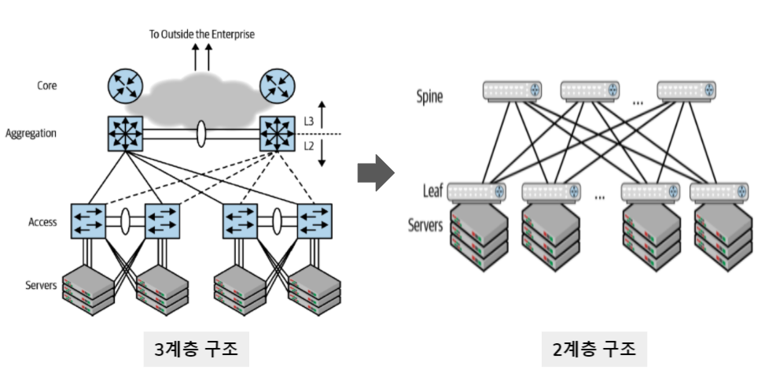

스파인 리프 구조는 서버 간 통신이 늘어나는 최근 트래픽 경향을 지원하기 위해 제안되었습니다. 최근에는 일반 서버에 10G Base-T 이더넷 포트가 기본적으로 제공되어 TOR(Top of Rack)스위치와 연결되고 리프(Leaf) 스위치인 TOR스위치는 스파인 (Spine)스위치와 40G , 100G로 연결되는 추세입니다. 더 높은 대역폭을 제공하기 위해 400G 네트워크도 표준화 되어 더 높은 대역폭을 사용하는 데이터 센터에 사용되고 있습니다.

## 2. 프로토콜

규정이나 규약과 관련된 내용을 언급할 때 프로토콜이라는 용어를 사용합니다. 네트워크에서도 통신할때의 규약을 프로토콜이라는 용어를 사용합니다. 프로토콜은 어떤 표준협회나 워킹그룹을 만들었는지 또는 어떤 회사에서 사용하느냐에 따라 특징이 많이 달라지고 다양한 프로토콜이 존재해왔습니다.

하지만 최근에는 복잡하고 산재되어 있던 여러가지 프로토콜 기술이 이더넷-TCP/IP기반 프로토콜들로 변경되고 있습니다.

1. 물리적 측면 : 데이터 전송매체, 신호규약, 회선 규격 등. 이더넷에 널리 쓰인다.
2. 논리적 측면 : 장치들끼리 통신하기 위한 프로토콜 규격, TCP/IP가 널리 쓰인다.

프로토콜이라는 것이 자연어로 불리는 일반 언어와 유사하게 사용되면 이해하기 쉬울 텐데 한정된 자원으로 통신을 수행해야 하다 보니 최대한 적은 데이터를 이용해 효율적인 프로토콜을 정의하고 사용해야 했습니다. 네트워크 서비스들이 처음 개발되었던 1900년대의 네트워크와 컴퓨팅 환경은 지금은 상상할 수조차 없을 만큼 열악해 자연어를 처리할 수 없었습니다. 적은 컴퓨팅 자원과 매우 느린 네트워크 속도를 이용해 최대한 효율적으로 통신하는 것이 목표이다 보니 대부분의 프로토콜이 문자 기반이 아닌 2진수 비트(bit)기반으로 만들어졌습니다.

최소한의 비트로 내용을 전송하기 위해서는 매우 치밀하게 서로 간의 약속을 정의해야 했습니다. 몇번째 전기 신호는 보내는 사람 주소, 몇번째 전기 신호는 받는 사람 주소, 등과 같이 미리 까다롭게 약속하고 그 약속을 철저히 지켜야 통신을 수행할 수 있었습니다. 물론 애플리케이션 레벨의 프로토콜은 비트 기반이 아닌 문자 기반 프로토콜들이 많이 사용되고 있습니다. HTTP 와 SMTP와 같은 프로토콜이 대표적입니다.

비트로 메시지를 전달하지 않고 문자 자체를 이용해 헤더와 헤더 값, 데이터를 표현하고 전송합니다.

실제 텍스트 파일과 같은 데이터가 전달되기 때문에 효율성은 비트 기반 프로토콜보다 떨어지지만 다양한 확장이 가능합니다. 일반적으로 TCP/IP는 프로토콜이라고 부르지 않고 프로토콜 스택이라고 부릅니다. TCP와 IP는 별도 계층에서 동작하는 프로토콜이지만 함께 사용하고 있는데 이런 프로토콜 묶음을 프로토콜 스택이라고 부릅니다. 실제로 TCP/IP 프로토콜 스택에는 TCP와 IP 뿐만아니라 UDP , ICMP , ARP , HTTP , SMTP , FTP와 같은 매우 다양한 애플리케이션 레이어 프로토콜들이 있습니다.

TCP/IP 프로토콜 스택은 총 4개 부분으로 나뉩니다. 물리부분인 이더넷 외에 데이터가 목적지를 찾아가주도록 하는 네트워크 계층, 잘린 패킷을 데이터 형태로 잘 조합하도록 도와주는 전송 계층과 애플리케이션 계층으로 구성됩니다. 여러가지 프로토콜이 사용되지만 TCP/IP프로토콜 스택이라고 불리는 이유는 1.3.2 TCP/IP 프로토콜 스택 절에서 자세히 다룹니다.

## OSI 7계층과 TCP/IP

### 1. OSI 7 계층

과거에는 통신용 규약이 표준화되지 않았고 각 벤더에서 별도로 개발했기 때문에 호환되지 않는 시스템이나 애플리케이션이 많았고 통신이 불가능했습니다. 이를 하나의 규약으로 통합하려는 노력이 현재의 OSI 7 계층으로 남아 있습니다. OSI 7 계층이 네트워크 동작을 나누어 이해하고 개발하는데 많은 도움이 되므로 네트워크의 주요 레퍼런스 모델로 활요되고 있지만 현재는 대부분의 프로토콜이 TCP/IP프로토콜 스택 기반으로 되어 있습니다.

복잡한 데이터 전송과정은 OSI 7 계층으로 나뉘어 보면 이해하기 쉽습니다. 또한 계층별로 표준화된 프로토콜 템플릿을 통해 네트워크 프로토콜을 전부 개발하는 대신 계층별로 프로토콜을 개발해 네트워크 구성 요소들을 모듈화 할 수 있습니다. 모듈화된 요소는 기존에 개발된 프로토콜과 연동해 사용할 수 있습니다.

OSI 7 계층은 다시 두 가지 계층으로 나눌 수 있습니다.

```
1 ~ 4계층 : 데이터 플로 계층 (Data Flow Layer) / 하위 계층 (Lower Layer)
5 ~ 7계층 : 애플리케이션 계층(Application Layer) / 상위 계층 (Upper Layer)
```

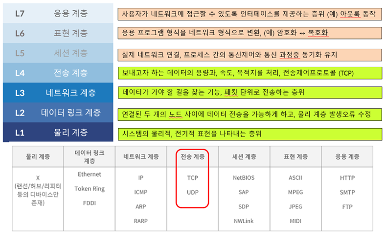

1~4 계층을 데이터 플로 계층(Data Flow Layer) 또는 하위 계층(Lower Layer) 라고 부르고 5 ~ 7계층을 애플리케이션 계층(Application Layer) 또는 상위 계층 (Upper Layer)이라고 부릅니다. 이러한 계층 분류는 계층의 역할과 목표에 따른 것입니다. 데이터 플로 계층은 용어에서 의미하는 대로 데이터를 상대방에게 잘 전달하는 역할을 가지고 있습니다. 애플리케이션 개발자는 애플리케이션 계층 프로토콜을 개발할 때 하위 데이터 플로 계층을 고려하지 않고 데이터를 표현하는데 초점을 맞춥니다. 반대로 애플리케이션 계층은 애플리케이션 개발자들이 고려해야 할 영역이므로 네트워크 엔지니어는 이 부눈에 대해서는 일반적으로 심각하게 고려하지 않습니다. 이러한 이유로 애플리케이션 개발자는 하향식(Top-Down)형식으로 네트워크를 바라보고 네트워크 엔지니어는 상향식 (Bottom-Up)형식으로 네트워크를 인식합니다.

### 2. TCP/IP 프로토콜 스택

앞서 말한것처럼 현대 네트워크는 대부분 TCP/IP와 이더넷으로 이루어져 있습니다. 물론 일부 특수한 환경에서는 다른 프로토콜이 사용되기도 하지만 다양한 기술과 프로토콜 중 어느것을 선택해야 할지 고민하던 과거와는 상황이 매우 다릅니다. TCP/IP와 이더넷이 개발된 것은 매우 오래전입니다. 몇 번의 큰 기술 발전을 거쳐 현재는 값싸고 성능이 우수한 TCP/IP와 이더넷이 되었습니다. 기술과 표준을 만들 때 만들어진 역사적 배경이나 만든 조직, 프로토콜이 만들어진 목표에 따라 성향이 많이 반영되는데 TCP/IP는 이론보다 실용성에 중점을 둔 프로토콜 입니다.

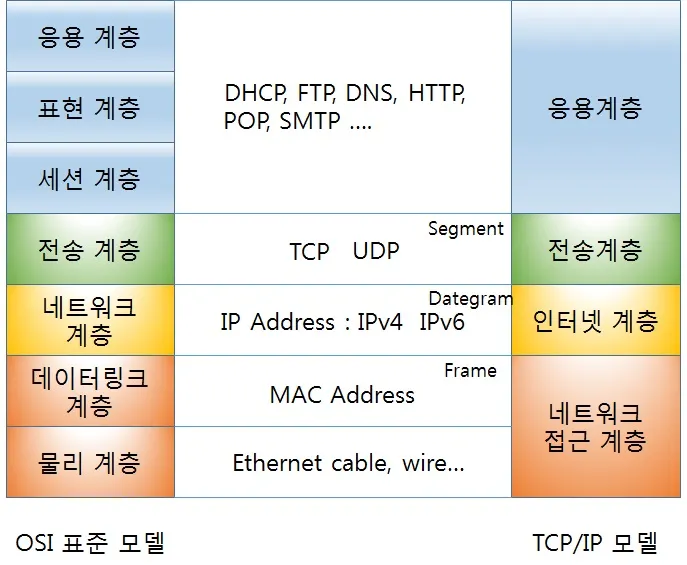

OSI 레퍼런스 모델은 7계층으로 이루어진 반면, TCP/IP 모델은 4계층으로 구분합니다. OSI 7계층은 데이터 플로 계층과 애플리케이션 계층으로 구분할 수 있습니다. 이 두 계층의 구분은 데이털르 만드는 애플리케이션 부분과 이 데이터를 잘 전달하는 데 집중하는 하부 계층으로 구분하는 것이 목적이었습니다. 그러다 보니 자연스럽게 애플리케이션 개발자가 고려해야 할 부분과 서버 엔지니어나 네트워크 엔지니어가 고려해야 할 부분이 구분되었는데 TCP/IP 모델은 그 구분이 더 확연히 드러납니다. 상위 3개 계층을 하나의 애플리케이션 계층으로 묶고 1,2 계층 즉 물리계층과 데이터 링크 계층을 하나의 네트워크 계층으로 구분합니다. 현실에 쉽게 반영하도록 간단히 구분하는 TCP/IP 프로토콜 스택의 성향이 이곳에서도 드러납니다.

## OSI 7계층별 이해하기

### 1. 1계층 (피지컬 계층)

1계층은 물리 계층으로 물리적 연결과 관련된 정보를 정의합니다. 주로 전기 신호를 전달하는 데 초점이 맞추어져 있습니다. 1계층의 주요 장비로는 허브(Hub), 리피터 (Repeater) , 케이블(Cable), 커넥터 (Connector), 트랩시버(Tranceiver), 탭(TAP) 등이 있습니다.

허브, 리피터는 네트워크 통신을 중재하는 네트워크 장비입니다. 케이블과 커넥터는 케이블 본체를 구성하는 요소이고 트랜시버는 컴퓨터의 랜카드와 케이블을 연결하는 장비입니다. 탭은 네트워크 모니터링과 패킷 분석을 위해 전기 신호를 다른 장비로 복제해 줍니다.

1계층에서 들어온 전기 신호를 그대로 잘 전달하는 것이 목적이므로 전기 신호가 1계층 장비에 들어오면 이 전기 신호를 재생성하여 내보냅니다. 1계층 장비는 주소의 개념이 없으므로 전기 신호가 들어온 포트를 제외하고 모든 포트에 같은 전기 신호를 전송합니다.

### 2. 2계층 (데이터 링크 계층)

2계층은 데이터 링크 계층으로 전기 신호를 모아 우리가 알아볼 수 있는 데이터 형태로 처리합니다. 1계층과는 다르게 전기 신호를 정확히 전달하기보다는 주소 정보를 정의하고 정확한 주소로 통신이 되도록 하는데 초점이 맞추어져 있습니다. 1계층에서는 전기 신호를 잘 보내는 것이 목적이므로 출발지와 목적지를 구분할 수 없지만 2계층에서는 출발지와 도착지 주소를 확인하고 내게 보낸 것이 맞는지, 또는 내가 처리해야 하는지에 대해 검사한 후 데이터 처리를 수행합니다.

2계층에서는 주소 체계가 생기면서 여러 통신이 한꺼번에 이루어지는 것을 구분학디 위한 기능이 주로 정의됩니다. 전기 신호를 모아 데이터 형태로 처리하므로 데이터에 대한 에러를 탐지하거나 고치는 역할을 수행할 수 있습니다. 신뢰할 수 있는 현대의 물리 계층과 달리 과거에는 신뢰할 수 없는 미디어를 이용해 통신하는 경우도 많아 2계층에서 에러를 탐지하고 고치거나 재전송했지만 이더넷 기반 네트워크의 2계층에서는 에러를 탐지하는 역할만 수행합니다. 주소 체계가 생긴다는 의미는 한 명과 통신하는 것이 아니라 동시에 여러 명과 통신할 수 있다는 것이므로 무작정 데이터를 던지는 것이 아니라 받는 사람이 현재 데이터를 받을 수 있는지 확인하는 작업부터 해야 합니다. 이 역할을 프로 컨트롤(Flow Control)이라고 부릅니다.

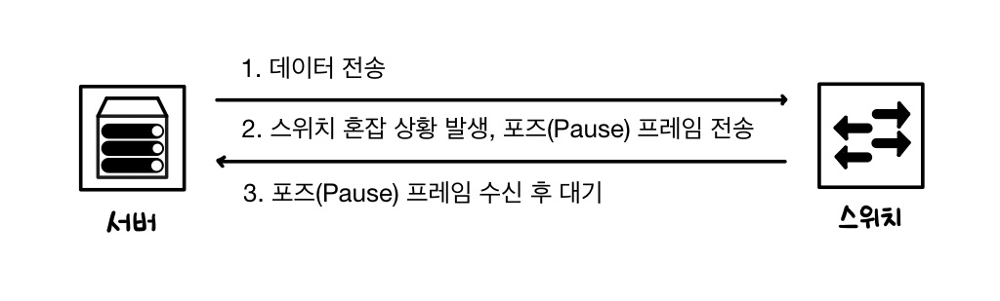

2계층에서 동작하는 네트워크 구성요소는 네트워크 인터페이스 카드와 스위치(Switch)입니다. 2계층에서 가장 중요한 특징은 MAC 주소라는 주소 체계가 있다는 것입니다. 2계층에서 동작하는 네트워크 인터페이스 카드와 스위치 모두 MAC 주소를 이해할 수 있고 스위치는 MAC 주소를 이해할 수 있고 스위치는 MAC 주소를 보고 통신해야 할 포트를 지정해 내보내는 능력이 있습니다.

```
참조
> 네트워크 인터페이스 카드를 부르는 방법
네트워크 인터페이스 카드(Network Inteface Card)를 부르는 용어는 매우 많습니다. 각 용어가 생긴 이유는 다양하지만 결국 PC나 서버에서 네트워크를 연결해주는 카드나 인터페이스를 지칭하는데 다음은 네트워크 인터페이스 카드를 지칭하는 다양한 예입니다.

1. 네트워크 인터페이스 카드 또는 네트워크 인터페이스 컨트롤러(Network Inteface Controller)를 줄여서 "NIC"라고 부릅니다.
2. 네트워크 카드(Network Card)라고 부릅니다.
3. 랜 카드(Lan Card)라고 부릅니다. 과거에 이더넷은 LAN(Local Area Network)에서만 사용되다 보니 네트워크 인터페이스 카드를 랜 카드라고 부르게 되었습니다.
4. 물리 네트워크 인터페이스(Physical Network Interface)라고 부릅니다. 물리적으로 컴퓨터의 내부와 외부를 연결해주는 중간 지점이라는 의미가 강합니다. 보통 이 용어를 사용할 경우, 네트워크 인터페이스 카드를 1계층 구성요소로 오해할 수 있습니다. 앞에서 설명한 것 처럼 네트워크 인터페이스 카드는 2계층 구성요소 입니다.
5. 이더넷 카드(Ethernet Card)라고 부릅니다. 대부분의 네트워크가 이더넷으로 이루어져 있어 일반적인 네트워크 연결 시 이더넷을 연결하는 네트워크 인터페이스 카드가 사용되었고 이더넷 카드라는 명칭을 사용하기도 합니다.
6. 네트워크 어댑터(Network Adapter)라고 부르기도 합니다.
```

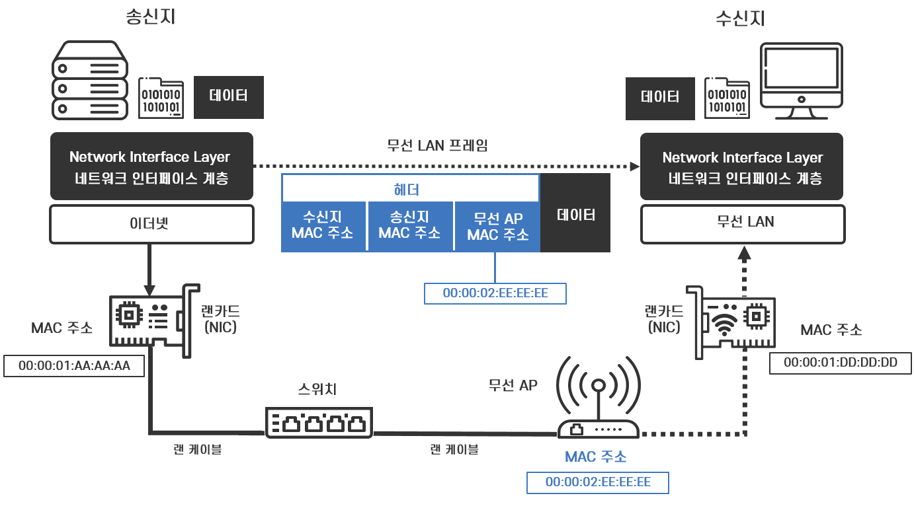

```
1. 전기 신호를 데이터 형태로 만든다.
2. 목적지 MAC 조소와 출발지 MAC 주소를 확인한다.
3. 네트워크 인터페이스 카드의 MAC 주소를 확인한다.
4. 목적지 MAC 주소와 네트워크 인터페이스 카드가 갖고 있는 MAC 주소가 맞으면 데이터를 처리하고 다르면 데이터를 폐기한다.
```

네트워크 인터페이스 카드에는 고유 MAC 주소가 있습니다. 입력되는 전기 신호를 데이터 형태로 만들고 데이터에서 도착지 MAC 주소를 확인한 후 자신에게 들어오는 전기 신호가 맞는지 확인합니다. 자신에게 들어오는 전기 신호가 아니면 버리고 자신에게 들어오는 전기 신호가 맞으면 이 데이터를 상위 계층에서 처리할 수 있도록 메모리에 적재합니다.

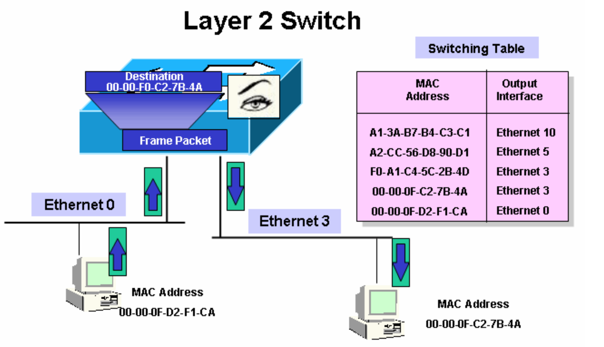

스위치는 단말(Terminal)이 어떤 MAC 주소인지, 연결된 포트는 어느 것인지 주소 습득(Address Learning)과정에서 알 수 있습니다. 이 데이터를 기반으로 단말들이 통신할 때 포트를 적절히 필터링하고 정확한 포트로 포워딩해줍니다. 반면, 1계층에서 동작하는 허브는 한 포트에서 전기 신호가 들어오면 전체 포트로 전기신호를 전달하다 보니 전체 네트워크에서 동시에 오직 하나의 장비만 데이터를 보낼 수 있습니다. 스위치의 적절한 필터링과 포워딩 기능으로 통신이 필요한 포트만 사용하고 네트워크 전체에 불필요한 처리가 감소하면서 이더넷 네트워크 효율성이 크게 향상되었고 이더넷 기반 네트워크가 급증하는 계기가 되었습니다.

### 3. 3계층 (네트워크 계층)

3계층에서는 IP주소와 같은 논리적인 주소가 정의됩니다. 데이털 통신을 할 때는 두 가지 주소가 사용되는데 2계츠으이 물리적인 MAC 주소와 3계층의 논리적인 IP 주소입니다. MAC 주소와 달리 IP 주소는 사용자가 환경에 맞게 변경해 사용할 수 있고 네트워크 주소 부분과 호스트 주소 부분으로 나뉩니다. 3계층을 이해할 수 있는 장비나 단말은 네트워크 주소 정보를 이용해 자신이 속한 네트워크와 원격지 네트워크를 구분할 수 있고 원격지 네트워크를 가려면 어디로 가야하는지 경로를 지정하는 능력이 있습니다.

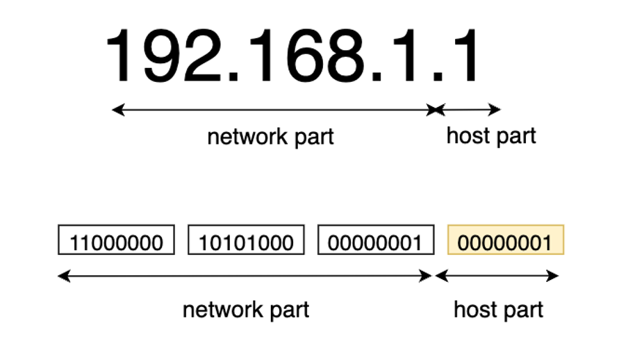

IP 주소는 주소를 나누는 구분점이 3개 이므로 어디가 네트워크 주소이고 어디가 호스트 주소인지 구분하기 어렵습니다. 이에 대한 상세한 내용은 IP 주소 절에서 다룰 예정입니다.

3계층에서 동작하는 장비는 라우터입니다. 라우터는 3ㅖ층에서 정의한 IP 주소를 이해할 수 있습니ㅏㄷ. 라우터는 IP 주소를 사용해 최적의 경로를 찾아주고 해당 경로로 패킷을 전송하는 역할을 합니다.

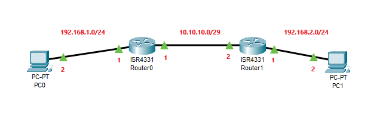

```
IP 주소 체계를 이해하고 최적의 경로를 찾아 패킷을 포워딩한다.
```

### 4. 4계층 (트랜스포트[전송] 계층)

4계층은 앞에서 보았던 1,2,3 계층과 좀 다른 역할을 합니다. 앞에서 OSI 7계층을 다룰 때 OSI 7 계층을 데이터 플로 계층과 상위 계층 두가지로 나눈 이유를 설명했습니다. 하위 4개 계층은 데이터를 잘 쪼개 보내고 받는 역할을 중점적으로 고려하고 네트워크 애플리케이션에서 하위 4계층의 역할을 별도로 고민하지 않도록 도와줍니다. 애플리케이션에서는 데이터를 하위 4개 계층으로 내려보내기만 하면 이 데이터를 쪼개 정보를 붙여 목적지까지 잘 전달합니다.

하위 1,2,3 계층은 신호와 데이터를 올바른 위치로 보내고 실제 신호를 잘 만드렁 보내는데 집중합니다.

하지만 4계층은 실제로 해당 데이터들이 정상적으로 잘 보내지도록 확인하는 역할을 합니다. 패킷 네트워크는 데이터를 분할해 패킷에 실어보내다 보니 중간에 패킷이 유실되거나 순서가 바뀌는 경우가 생길 수 있습니다. 이 문제를 해결하기 위해 패킷이 유실되거나 순서가 바뀌었을 때 바로잡아 주는 역할을 4계층에서 담당합니다. 4계층에서 패킷을 분할할 때 패킷 헤더에 보내는 순서와 받는 순서를 적어 통신하므로 패킷이 유실되면 재전송을 요청할 수 있고 순서가 뒤바뀌더라도 바로 잡을 수 있습니다. 패킷에 보내는 순서를 명시한 것이 시퀀스 번호(Sequence Number) 이고 받는 순서를 나타낸 것이 ACK 번호(Ackowledgement Number)입니다.

이뿐만이 아니라 장치 내의 많은 애플리켕시ㅕㄴ을 구분할 수 있도록 포트 번호(Port Number)을 사용해 상위 애플리케이션을 구분합니다.

4계층에서 동작하는 장비로는 로드 밸런서와 방화벽이 있습니다. 이 장비들은 4계층에서 볼 수 있는 애플리케이션 구분자(포트 번호)와 시퀀스, ACK번호 정보를 이용해 부하를 분산하거나 보안 정책을 수립해 패킷을 통과, 차단하는 기능을 수행합니다.

```
참고
> 시퀀스 번호와 ACK 번호
4계층에서 패킷의 순서와 응답 번호를 지칭하는 용어는 시퀀스 번호와 ACK 번호입니다. 이 용어를 줄여서 실무에서는 seq , ack number 로 표기하거나 한글화해 순서 번호 , 응답 번호로 사용하기도 합니다.
```

### 5. 5계층 (세션 계층)

5계층인 세션 계층(Session Layer)은 양 끝단의 응용 프로세스가 연결을 성립하도록 도와주고 연결이 안정적으로 유지되도록 관리하고 작업 완료 후에는 이 연결을 끊는 역할을 합니다. 흔히 우리가 부르는 "세션"을 관리하는 것이 주요 역할인 세션 계층은 TCP/IP 세션을 만들고 없애는 책임을 집니다. 또한, 에러로 중단된 통신에 대한 에러 복구와 재전송도 수행합니다.

### 6. 6계층 (프레젠테이션 계층)

6계층인 프레젠테이션 계층(Presentation Layer)은 표현 방식이 다른 애플리케이션이나 시스템간의 통신을 돕기 위해 하나의 통일된 구문 형식으로 변환시키는 기능을 수행합니다. 일종의 번역기나 변환기 역할을 수행하는 계층이고 이런 기능은 사용자 시스템의 응용 계층에서 데이터의 형식상 차이를 다루는 부담을 덜어줍니다. MIME 인코딩이나 암호화, 압축, 코드 변환과 같은 동작이 이 계층에서 이루어 집니다.

### 7. 7계층 (애플리케이션 계층)

OSI 7 계층의 최상위 7계층인 애플리케이션 계층(Application Layer)은 애플리케이션 프로세스를 정의하고 애플리케이션 서비스를 수행합니다. 네트워크 소프트웨어의 UI 부분이나 사용자 입출력 부분을 정의하는 것이 애플리케이션 계층의 역할입니다. 애플리케이션 계층의 프로토콜은 엄청나게 많은 종류가 있지만 대표적인 프로토콜로는 FTP , SMTP , HTTP , TELNET 등이 있습니다.

|           계층           |                               정의                                |              장비               |
| :----------------------: | :---------------------------------------------------------------: | :-----------------------------: |
|  Application Layer (L7)  |             HTTP , SMP , SMTP , STUN , TFTP , TELNET              |        ADC , NGFW , WAF         |
| Presendtation Layer (L6) |                          TLS , AFP , SSH                          |
|    Session Layer (L5)    |             L2TP , PPTP, NFS , RPC , RTCP , SIP , SSH             |
|   Transfort Layer (L4)   |       TCP , UDP , DCCP , SCTP , DCC P , AH , AEP ,IL , RUDP       |       로드밸런서 , 방화벽       |
|    Network Layer (L3)    | ARP , IP(IPv4 , IPv6) , NAT , IPSec , VRRP , Routing Protocol ... |       라우터 , L3 스위치        |
|   Data Link Layer (L2)   |                         IEEE 802.2 , FDDI                         | 스위치 , 브릿지 , 네트워크 카드 |
|   Physical Layer (L1)    |               RS-232 , RS449 , V.35 , S 등의 케이블               |     케이블 , 허브 , 탭(TAB)     |

## 인캡슐레이션과 디캡슐레이션

상위계층에서 하위 계층으로 데이터를 보내면 물리 계층에서 전기 신호 형태로 네트워크를 통해 신호를 보냅니다. 받는 쪽에서는 다시 하위 계층에서 상위 계층으로 데이터를 보냅니다. 이렇게데이터를 보내는 과정을 인캡슐레이션(Encapsulation) , 받는 과정을 디캡슐레이션(Decapsulation)이라고 부릅니다.

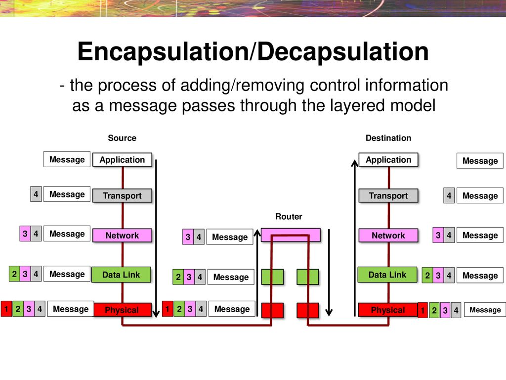
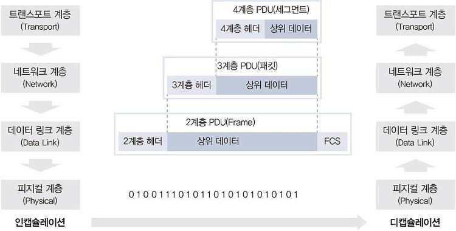

```
왼쪽이 인캡슈렐이션, 오른쪽이 디캡슐레이션이다.
```

현대 네트워크는 대부분 패킷 기반 네트워크입니다. 패킷 네트워크는 데이터를 패킷이라는 작은 단위로 쪼개 보내는 데 이런 기번으로 하나의 통신이 회선 전체를 점유하지 않고 동시에 여러 단말이 통신하도록 해줍니다. 데이터를 패킷으로 쪼개고 네트워크를 이용해 목적지로 보내고 받는 쪽에서는 패킷을 다시 큰 데이터 형태로 결합해 사용합니다.

애플리케이션에서 데이터를 데이터 플로 계층 (1~4계층)으로 내려보내며서 패킷에 데이터를 넣을 수 있도록 분할하는데 이 과정을 인캡슐레이션이라고 부릅니다. 네트워크 상황을 고려해 적절한 크기로 데이터를 쪼개고 위 그림과 같이 4계층부터 네트워크 전송을 위한 정보를 헤더에 붙여 넣습니다. 헤더 정보는 4계층 , 3계층 , 2계층에서 각각 자신이 필요한 정보를 추가하는데 이 정보는 이리가 알아볼 수 있는 문자가 아닌 미리 정의된 비트 단위(0 또는 1)을 사용합니다. 4계층에서 헤더를 추가하고 3계층으로 내려보내면 다시 3계층에서 필요한 헤더 정보를 추가하고 2계층으로 내려보내집니다. 다시 2계층에서도 필요한 헤더 정보를 추가한 후 전기 신호로 변환해 수신자에게 전송합니다. 데이터 한개를 전송하는 작업은 생각보다 복잡해 데이터 플로 계층에서만 3개의 헤더 정보가 추가됩니다.

반대로 받는 쪽에서는 디캡슐레이션 과정을 수행합니다. 받은 전기 신호를 데이터 형태로 만들어 2계층으로 올려보냅니다. 2계층에서는 송신자가 작성한 2계층 헤더에 포함된 정보를 확인합니다. 만약 2계층에 적힌 정보 중 목적지가 자신이 아니라면 자신에게 온 패킷이 아니므로 버립니다. 앞의 OSI 7계층의 2계층에서 다루었던 랜 카드(Network Interface Card)가 이 역할을 담당합니다.

다시 3계층으로 올라가면서 2계층의 헤더 정보는 더 이상 필요없으므로 버리고 올립니다. 이 데이터를 받은 3계층에서는 2계층이 동작했던 것처럼 상대방이 적은 3계층의 헤더 정보를 확인해 자신에게 온 것이 맞는지 확인하고 맞으면 3계층 헤더 정보를 제거하고 4계층으로 보냅니다. 이를 받은 4계층도 3계층과 같은 과정을 거쳐 데이터를 애플리케이션에 올립니다.

위 과정을 2가지 정보 흐름으로 설명될 수 있습니다.

1. 인캡슐레이션, 디캡슐레이션 과정을 통해 데이터가 전송되는 과정
2. 각 계층 헤더를 이용해 송신자 계층과 수신자 계층 간의 논리적 통신 과정

실제로 데이터는 사우이 계층(Upper Layer) 에서 데이터 플로 계층올, 즉 상위 계층에서 패킷 형태로 하나씩 인캡슐레이션되면서 내려오고 랜 카드에서 전기 형태로 변환되어 목적지로 전달됩니다. 이 전기 신호를 받은 목적지에서는 데이터 형태로 변환해 상위 계층으로 올려주고 이 패킷들을 조합해 데이터 형태로 만들게 됩니다. 결국 주고받는 데이터 흐름을 간단히 표현하면 상위 계층에서 하위 계층으로 다시 하위계층에서 상위 계층으로 전달되는 형태입니다.

각 계층에서 인캡슐레이션 과정에서 수행했던 것 처럼 현재 계층에서 추가하는 헤더 정보는 받는 상대방이 확인해야 하는 정보입니다. 만약 4계층에서 헤더를 추가했다면 그 정보를 받는 쪽의 4계층에서 확인합니다. 중간에 적힌 헤더 정보는 받는 계층에서 참고하고 버립니다.

정리하면 실제 데이터는 상위 계층 -> 하위 계층, 하위계층 -> 상위 계층으로 전달되고 헤더 정보는 각 계층끼리 전달됩니다.

### 1. 헤더 정보

| 계층  |                                                                                              헤더 정보                                                                                              |
| :---: | :-------------------------------------------------------------------------------------------------------------------------------------------------------------------------------------------------: |
| 2계층 |                                                                              Destination MAC , Source MAC , Ether Type                                                                              |
| 3계층 | Version , IHL , DSCP , ECN , Total Length , Identification , Flags , Fragment Offset , Time to Live , Protocol , Header Checksum , Source IP Address , Destination IP Address , Options(if IHL > 5) |
| 4계층 |              Source Port , Destination Port , Sequence Number , Ackowledgement Number , Data Offset , res , Flags , Window Size , Header and Data Checksum , Urgent Pointer , Options               |

이런 복잡한 정보들에도 규칙이 있으며 헤더에 두 가지 정보는 반드시 포함되어야 합니다.

1. 현재 계층에서 정의하는 정보
2. 상위 프로토콜 지시자

현재 계층에서 정의하는 정보는 앞에서 다루었던 OSI 7 계층의 각 계층에서 목적에 맞는 정보들이 포함됩니다. 4계층의 목적은 큰 데이터를 잘 분할하고 받는 쪽에서 잘 조립하는 것입니다.
그러다 보니 잘 분할하고 잘 조립하도록 데이터에 순서를 정하고 받는 패킷의 순서가 맞는지, 빠진 패킷은 없는지 점검하는 역할이 중요하며 이 정보를 헤더에 적게됩니다.

```
1. TCP/IP 의 4계층 프로토콜인 TCP 에서는 시퀀스 (Sequence) , 에크(Ackowledgement) 번호 필드로 이 데이터를 표현합니다.
2. 3계층헤더에는 3계층에서 정의하는 논리적인 주소인 출발지, 도착지 IP 주소를 헤더에 적습니다.
3. 2계층은 MAC 주소를 정의하는데 3계층처럼 2계층도 출발지 , 도착지 MAC 주소 정보를 헤더에 넣습니다.
```

### 2. 그렇다면 2번 상위 프로토콜 지시자는 왜 필요할까?

프로토콜 스택은 상위 계층으로 올라갈수록 종류가 많아집니다. 3계층 프로토콜이 IP 는 4계층에서는 다시 TCP와 UDP 로 나뉘고 그보다 더 상위 계층에서는 FTP , HTTP , SMTP , POP3 등 더 다양한 프로토콜로 다시 나뉩니다.

|                                     계층                                      |           TCP/IP 모델           |    TCP/IP 프로토콜    |  TCP/IP 프로토콜  |
| :---------------------------------------------------------------------------: | :-----------------------------: | :-------------------: | :---------------: |
| Application Layer (L7) <br/>Presendtation Layer (L6) <br/> Session Layer (L5) | 애플리케이션 계층(Application)  |   HTTP , SSH , FTP    | DNS , SMTP , SNTP |
|                             Transfort Layer (L4)                              |   트랜스포트 계층(Transport)    |          TCP          |        UDP        |
|                              Network Layer (L3)                               |        인터넷(Internet)         |          IP           |    ARP , ICMP     |
|                Data Link Layer (L2) <br/> Physical Layer (L1)                 | 네트워크 엑세스(Network Access) | Ethernet , Token Ring | Frame Relay , ATM |

인캡슐레이션 과정에서는 상위 프로토콜이 많아도 문제가 없지만 디캡슐레이션하는 목적지 쪽에서는 헤더에 아무 정보가 없으면 어떤 상위 프로토콜로 올려보내 주어야 할지 결정할 수 없습니다. 예를 들어 3계층에서 목적지 IP 주소를 확인하고 4계층으로 데이터를 올려보낼 때 헤더에 상위 프로토콜 정보가 없다면 TCP로 보내야 할지, UDP 로 보내야 할지 구분할 수 없습니다. 4계층에서 애플리케이션 계층으로 올려보낼 때도 똑같은 문제가 발생합니다. 이런 문제가 발생하지 않도록 인캡슐레이션하는 쪽에서는 헤더에 상위 프로토콜 지시자 정보를 포합해야합니다.

|     포트 번호     |                 프로토콜                 |
| :---------------: | :--------------------------------------: |
|    TCP 20 , 21    |       FTP(File Transfer Protocol)        |
|      TCP 22       |                   SSH                    |
|      TCP 23       |                  TELNET                  |
|      TCP 25       |                   SMTP                   |
|      UDP 49       |                  TACACS                  |
|  TCP 53 / UDP 53  |         DNS(Domain Name Service)         |
|     UDP 67,68     |        BOOTP(Bootstrap Protocol)         |
|  TCP 80 / UDP 80  |    HTTP(Hyper Text Transfer Protocol)    |
|      UDP 123      |        NTP(Network Time Protocol)        |
|    UDP 161,162    | SNMP(Simple Network Management Protocol) |
|      TCP 443      |                  HTTPS                   |
| TCP 445 / UDP 445 |               Microsoft-DS               |

| 프로토콜 번호 |            프로토콜             |
| :-----------: | :-----------------------------: |
|       1       | ICMP(Internet Control Message)  |
|       2       | IGMP(Internet Froup Management) |
|       6       |    TCP(Transmission Control)    |
|      17       |       UDP(User Datagram)        |
|      50       |   ESP(Encap Security Payload)   |
|      51       |    AH(Authentication Header)    |
|      58       |           IPv6용 ICMP           |
|      133      |        FC(Fibre Channel)        |

|      이더 타입(Ether Type)      |              프로토콜               |
| :-----------------------------: | :---------------------------------: |
|             0x0800              |  IPv4(Internet Protocol version 4)  |
|              0x086              |  ARP(Address Resolution Protocol)   |
|             0x22F3              |         IETF TRILL Protocol         |
|             0X8035              |          RARP(Revers ARP)           |
|             0x8100              |      VLAN-tagged frame(802.1Q)      |
| Shortest Path Bridging(802.1aq) |      AH(Authentication Header)      |
|             0x86DD              |  IPv6(Internet Protocol version 6)  |
|             0x88CC              | LLDP(Link Layer Discovery Protocol) |
|             0x8906              |  FCoE(Fibre Channel over Ehternet)  |
|             0x8915              | RoCE(RDMA over Converged Ethernet)  |

각 계층마다 이 상위 프로토콜 지시자를 가지고 있지만 이름이 달라 4계층은 포트 번호(Port Number) , 3계층은 프로토콜 번호(Protocol Number), 2계층은 이더 타입(Ether Type)이라고 부릅니다.

이 정보들에 대해 착각하기 쉬운것은 포트 번호는 4계층 헤더에 적힌 정보이지만 애플리케이션 계층에서 프로토콜 종류를 나타내주는 정보라는 것입니다. 디캡슐레이션할 때 상위 프로토콜 지시자 정보를 이용해 어느 상위 계층 프로토콜로 보내야 할지 구분해야 하므로 동작하는 계층보다 한 계층 위의 정보가 적혀 있게 됩니다.

```
참고
> MSS & MTU(데이터 크기 조절)

애플리케이션에서 데이터를 만들어 보낼 때 데이터 플로 계층에서 네트워크 상황에 맞게 데이터를 잘 쪼개 상대방에게 전달합니다.

네트워크에서 수용할 수 있는 크기를 역상정해 데이터가 4계층으로 내려올 때 적절한 크기로 쪼개질 수 있도록 유도하는데
이 값을 MSS(Maximum Segment Size) 라고 부르며 일반적인 이더넷에서 수용할 수 있는 크기는 1,500 바이트 입니다.(Jumbo Frame 제외)

MTU와 MSS 모두 데이터 크기를 지칭하는 것이므로 MTU 값은 2계층의 데이터 값 , MSS는 4계층에서 가질 수 있는 최대 데이터 값입니다.
2계층에서는 2계층 헤더들의 크기를 제외한 데이터 크기를 MTU 크기라고 부릅니다.
IP 헤더와 TCP 헤더의 표준 헤더 크기는 일반적으로 각각 20바이트(추가되는 옵션 헤더 제외) 이므로 일반 이더넷인 경우 , MSS 값을 1,460 바이트로 사용합니다.
```

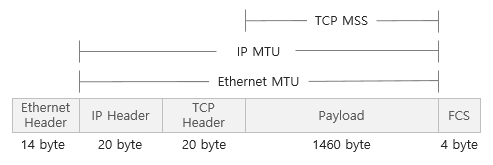

```
IP Header : 3계층 헤더 (IP 20 byte)
TCP Header : 4계층 헤더 (TCP 20 byte)
Payload : 상위 데이터
```
