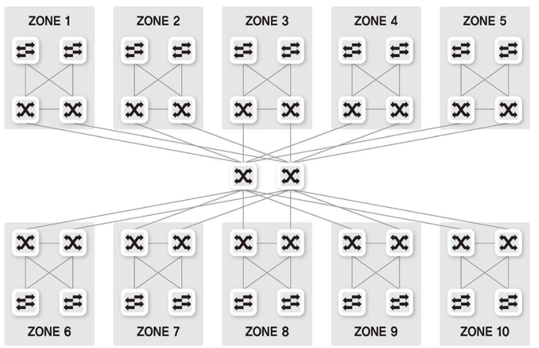
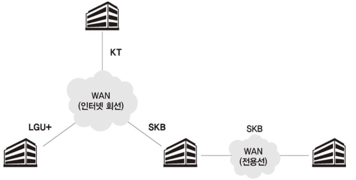
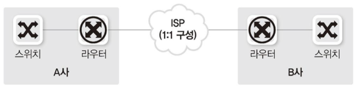
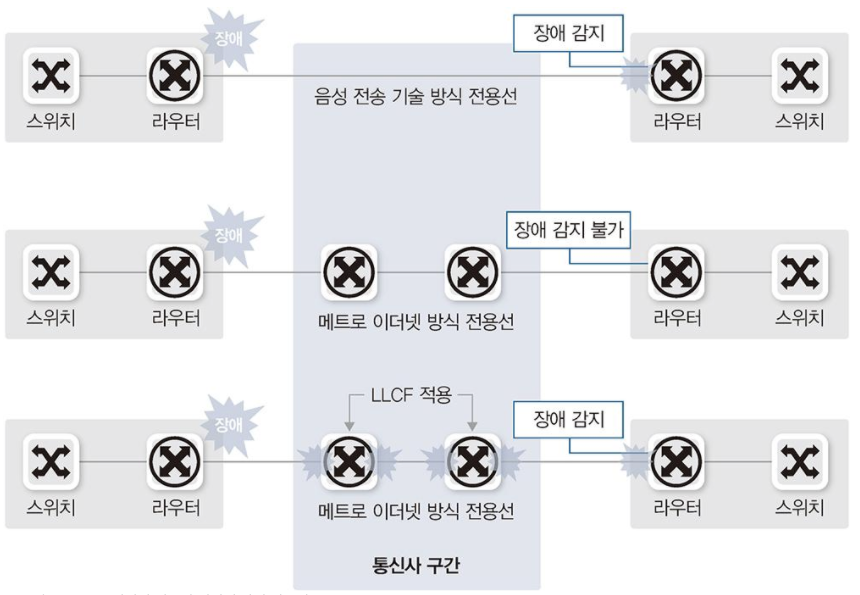
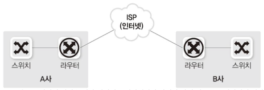
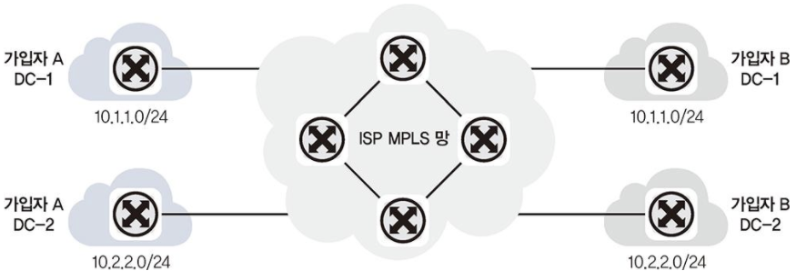
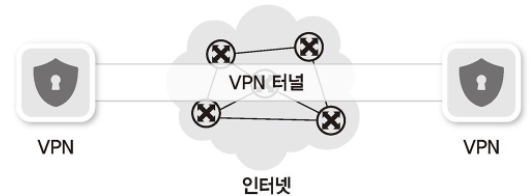
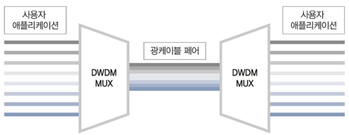
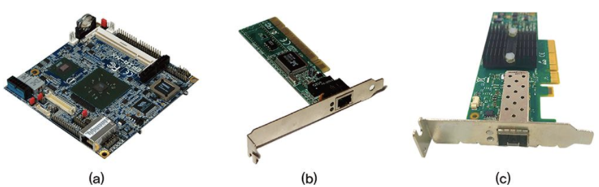

## 네트워크 연결 구분

네트워크는 규모와 관리 범위에 따라 LAN , MAN , WAN 3가지로 구분됩니다.

1. LAN (Local Area Network) : 사용자 내부 네트워크
2. MAN (Metro Area Network) : 한 도시 정보를 연결하고 관리하는 네트워크
3. WAN (Wide Area Network) : 멀리 떨어진 LAN을 연결해주는 네트워크

예전에는 LAN , MAN , WAN 에서 사용하는 기술이 모두 달라 사용하는 프로토콜이나 전송 기술에 따라 쉽게 구분할 수 있었습니다. 현재는 대부분의 기술이 이더넷으로 통합되면서 사용자가 전송 기술을 구분하는 것은
무의미해져 관리 범위 기준으로 LAN , MAN , WAN을 구분합니다.

### 1. LAN

LAN 은 Local Area Network 의 약자로 홈 네트워크용과 사무실용 네트워크 처럼 비교적 소규모의 네트워크를 말합니다. 먼 거리를 통신할 필요가 없어 스위치와 같이 비교적 간단한 장비로 연결된 네트워크를 LAN이라고 불러왔습니다.
소모 비용, 신뢰도 , 구축 및 관리를 위해 다른 다양한 기술이 사용되지만 현재는 대부분 이더넷 기반 전송 기술을 사용합니다.

전송 기술에 대한 구분 외에 관리 범위엥서의 LAN은 자신이 소유한 건물이나 대지에 직접 구축한 선로로 동작시키는 네트워크로 정의할 수 있습니다. 과거에는 대규모 공장이나 대학과 같은 광범위한 네트워크를 별도로 구분했지만 최근에는 이런 구분도 무의미해졌습니다.



```
복잡하거나 대규모인 네트워크라도 직접 구축한 네트워크 범위라면 LAN이라고 부른다.
```

### 2. WAN

WAN은 Wide Area Network의 약자로 먼 거리에 있는 네트워크를 연결하기 위해 사용합니다. 멀리 떨어진 LAN을 서로 연결하거나 인터넷에 접속하기 위한 네트워크가 WAN에 해당합니다.

WAN은 특별한 경우가 아니면 직접 구축할 수 없는 범위의 네트워크이므로 대부분 통신사업자 (KT, LGU+, SKB)로부터 회선을 임대해 사용합니다. 자신이 소유한 땅이나 건물이 아닌 곳을 지나 원격지로 통신해야 할 때 사용하며 사용계약에 의해 비용이 부과됩니다.


## 네트워크 회선

원격지 네트워크에 연결하기 위해서는 WAN 을 사용해야 합니다. WAN에서 통신사업자와 사용자를 연결해주는 다양한 종류의 네트워크 회선과 기술이 사용되어 왔지만 현재는 LAN과 동일하게 이더넷이 주로 사용됩니다. 일반적인 이더넷 외에 특별한 용도로 음성 회선 기반의 저속 회선 기술이나 통신사업자 간의 고속 통신 또는 가입자를 구분하고 식별할 용도로 다양한 기술이 사용됩니다.

### 1. 인터넷 회선

인터넷 접속을 위해 통신사업자와 연결하는 회선을 인터넷 회선이라고 부릅니다. 통신사업자와 케이블만 연결한다고 인터넷이 가능한 것이 아니라 통신사업자가 판매하는 인터넷과 연결된 회선을 사용해야만 인터넷 접속이 가능합니다. 일반적으로 동일한 회선 속도와 전송 기술을 사용했을때 인터넷이 연결되지 않은 회선보다 인ㅌ처넷을 연결한 회선의 비용이 비쌉니다.

일반가정에서 인터넷에 연결하기 위해 사용하는 기술은 뒤에서 다룰 인터넷 전용 회선과는 전송 기술이 약간 다릅니다. 가입자와 통신사업자 간에 직접 연결되는 구조가 아니라 전송 선로 공유기술을 사용합니다. 예를 들어 아파트 광랜은 내부 선로가 직접 연결되는 구조여서 인터넷 전용 회선처럼 보이지만 아파트에서 통신사업자까지 연결한 회선을 아파트 가입자가 공유하는 구조입니다.

전송선로를 공유하므로 일반 인터넷 회선의 속도는 전송 가능한 최대 속도이고 다음에 다룰 전용 회선과 달리 그 속도를 보장하지 않습니다.(주변 사용량에 따라 속도가 느려질 수 있음)

일반 인터넷 회선의 종류는 다음과 같습니다.

1. 광랜 (이더넷) : 기가 ~ 100Mbps
2. FTTH : 기가 ~ 100Mbps
3. 동축 케이블 인터넷 : 수백 ~ 수십 Mbps
4. xDSL(ADSL , VDSL 등) : 수십 ~ 수 Mbps

위의 인터넷 접속 기술은 기존 전화선을 사용하거나 특정 구간부터 다른 사용자와 공유됩니다. 항상 모든 사람이 최대 속도로 인터넷을 접속하는 것은 아니므로 공유 구간은 사용자 최대 속도를 보장하지 않도록 구축하는 것이 일반적입니다.

### 2. 전용 회선

가입자와 통신사업자 간에 대역폭을 보장해주는 서비스를 대부분 전용 회선이라고 부릅니다. 대역폭을 보장해주는 기술에는 여러 가지가 있지만 가입자와 통신사업자 간에는 전용 케이블로 연결되어 있고 통신사업자 내부에서 TDM(시분할 다중화 : Time Division Multipexing)와 같은 기술로 마치 직접 연결한 것처럼 통신 품질을 보장해줍니다. 인터넷 전용 회선이 아닌 일반 전용 회선은 본사-지사 연결에 주로 사용됩니다.



전용 회선을 가입자와 접속하는 전송 기술을 기반으로 구분한다면 다음과 같이 음성 전송 기술 기반의 저속 회선과 매트로 이더넷이라는 고속 회선으로 분류할 수 있습니다.

#### 저속 : 음성 전송 기술 기반

저속 음성 전송 기술은 64kbps 단위로 구분되어 사용됩니다. 작은 기본 단위를 묶어 회선에 접속 속도를 높이는 방법으로 발전되어 온 기술로 오랫동안 사용되어 왔습니다. 보통 높은 속도가 필요하지 않을 때나 높은 신뢰성이 필요할 때 사용되어 왔지만 현재 이더넷 기반의 광 전송 기술이 신뢰할 정도의 수준으로 발전해 점점 사용 빈도가 줄고 있습니다. 하지만 아직도 결재 승인과 같은 전문(Clear Text) 전송을 위한 VAN(Value Added Network) 사나 대외 연결에는 저속 회선을 사용하는 경우가 많습니다. 이 기술을 사용하려면 원격지 전송 기술로 변환할 수 있는 라우터가 필요합니다.

#### 고속 : 메트로 이더넷

고속 연결은 대부분 광케이블 기반의 이더넷을 사용합니다. 가입자와 통신 사업자 간의 접속 기술은 이더넷을 사용하고 통신사업자 내부에서는 이런 개별 가입자를 묶어 통신할 수 있는 다른 고속 통신 기술을 사용합니다. 가입자와 통신사업자 내부에서의 통신 기법이 다른것은 통신사업자는 여러 가입자를 구분하고 가입자 트래픽을 고속으로 전송하는 것이 중요하기 때문입니다. 또한 다양한 가입자 접속 기술을 하나의 기술로 통합하기 위한 (저속 통신 회선이나 이더넷, 음성을 하나의 회선에 실을 수 있도록)기술이 사용됩니다.

```
참고 : LLC(Link Loss Carry Forward)

LLCF는 한쪽 링크가 다운되면 이를 감지해 반대쪽 링크도 다운시키는 기능입니다. 전용 회선을 이더넷으로 구성할 때 회선사에서 LLCF를 설정하지 않으면 전용 회선이 한 사이트에서 다운되더라도 반대쪽 사이트에서는 회선이 그대로 살아있는 것처럼 보이므로 반드시 회선 개통 후 회선사에서 LLCF 설정이 되어 있는지 확인해야 합니다.

저속 회선은 2계층 프로토콜 통신 상태를 확인하는 기능이 있으므로 라우터에서 상대방 링크가 끊길 경우, 감지할 수 있어 LLCF 설정이 별도로 필요없습니다.
```



### 3. 인터넷 전용 회선

인터넷 연결 회선에 대한 통신 대역폭을 보장해주는 상품을 인터넷 전용 회선이라고 합니다. 가입자가 통신사업자와 연결되고 이 연결이 다시 인터넷과 연결되는 구조입니다. 인터넷 전용 회선은 가입자가 일반가정에서 사용하는 접속기술과 달리 다른 가입자와 경쟁하지 않고 통신사업자와 가입자 간의 연결 품질을 보장해 줍니다.



```
인터넷 연결을 위한 회선이 통신사업자와 가입자 간에 전용으로 연결되어 있다.
```

기존에는 인터넷 전용 회선과 일반가정 가입자들이 사용하는 네트워크 기술에 확연한 차이가 있었지만 최근 대부분 광 전송 기술을 사용하므로 구분하는 것이 쉽지 않다. 최근 인터넷 전용 회선 기술은 이더넷이 가장 많이 쓰입니다. 메트로 이더넷이라는 이 기술을 수~수십 km까지 전송할 수 있는 최근의 이더넷 기술을 바탕으로 하고 있습니다.

### 4. VPN

#### 통신사업자 VPN

전용선은 연결 거리가 늘어날수록 비용이 증가합니다. 도시 내의 전용선 연결은 비싸지 않지만 타 도시나 해외 연결 전용선 비용은 매우 비쌉니다. 전용선은 사용 가능한 대역폭을 보장해주지만 가입자가 계약된 대역폭을 항상 100% 사용하는 것이 아니어서 낭비되는 비용이 클 수 있습니다. 이런 비용 낭비를 줄이고 먼 거리와 연결하더라도 비용을 줄이기 위해서 통신사업자가 직접 가입자를 구분할 수 있는 VPN기술을 사용해 비용을 낮추고 있습니다. 가장 대표적인 기술이 MPLS VPN 입니다.



```
MPLS VPN. 여러 가입자가 하나의 MPLS 망에 접속되지만 가입자를 구분할 수 있는 기술을 적용해 전용선처럼 사용할 수 있다.
```

이 기술을 이용하면 여러 가입자가 하나의 망에 접속해 통신하므로 공용 회선을 함께 이용하게 되어 비용이 낮아집니다. 전용 회선 비용은 거리와 속도의 영향을 받지만 MPLS VPN 회선은 거리보다 속도의 영향을 받으므로 거리가 멀어질수록 MPLS와 같은 공용망 기술 사용이 비용을 낮추는 데 도움이 됩니다.

도시 내부의 통신 외에 본사-지사 또는 지사-지사 간의 연결은 대부분 MPLS VPN 기술을 사용해 연결합니다. MPLS VPN 기술은 가입자 입장에서는 기술적으로 특별히 고려할 것이 없으므로 일반 전용선 연결과 동일한 접속 기술을 사용하게 됩니다.

#### 가입자 VPN

일반 사용자가 VPN 을 사용한다면 대부분 가입자 VPN 기술입니다. 일반 인터넷망을 이용해 사용자가 직접 가상 전용 네트워크를 구성할 수 있습니다. 지방이나 해외를 전용선으로 연결하면 비용이 매우 비싸고 앞에서 알아본 MPLS VPN 기술을 이용한 회선도 일반 인터넷 연결 비용보다 비쌉니다. 그래서 비용을 더 낮추기 위해 일반 인터넷 연결을 이용한 VPN을 사용합니다. 가입자 VPN 기술 관련 내용은 9.6 VPN 절에서 다룹니다.


#### DWDM

DWDM(Dense Wavelength Division Multiplex : 파장 분할 다중화) 전송 기술은 먼 거리를 통신할 때 케이블 포설 비용이 매우 많이 들고 관리가 어려운 문제를 극복하기 위해 개발되었습니다. WDM 기술이 나오기 전에는 하나의 광케이블에 하나의 통신만 가능했습니다. 통신사업자는 많은 가입자를 구분하고 높은 대역폭의 통신을 제공해야 하므로 여러 개의 케이블을 포설해야 했고 이러한 물리적인 케이블을 포설하는 데 어려움이 있었습니다. WDM과 DWDM 기술은 하나의 광케이블에 다른 파장의 빛을 통해 여러 채널을 만드는 동시에 많은 데이터를 전송할 수 있습니다.



DWDM 전송 기술은 기존 WDM 보다 더 많은 채널을 이용하는 기술입니다. 이 기술은 통신사업자 내부에서 먼 거리를 통신할 때 주로 사용되지만 최근 일반가정에서 사용하는 기가 인터넷에서도 사용되고 있습니다. 기가 인터넷은 FTTH(Fibre To The Home)가 사용되고 구축 방식에 따라 PTP , AON , PON 형태로 구분됩니다.

PTP(Point to Point) 방식은 가입자와 통신사업자 간에 케이블을 직접 포설합니다. <br/>
AON(Active Optical Network)은 광신호 분리 장비에 전기가 필요한 스위치와 같은 장비가 사용되고 PON 기술은 전기 인입 없이 광신호를 분리해 가입자와 통신사업자 간의 케이블을 줄일 수 있습니다. 이 경우, 가입자들이 하나의 회선을 공유하므로 인터넷 속도가 느려질 수 있어 DWDM 기술을 접목합니다. 인터넷 사용자가 광회선을 공유하더라도 가입자마다 별도 채널을 이용해 구분하므로 인터넷 접속 속도를 유지할 수 있습니다.

## 네트워크 구성요소

### 1. 네트워크 인터페이스 카드(NIC)

흔히 랜 카드라고 부르는 부품의 정식 명칭은 네트워크 인터페이스 카드 (Network Interface Card , NIC) 입니다. 이 외에도 네트워크 카드(Network Card) , 네트워크 인터페이스 컨트롤러(Network Interface Controller , NIC)라고도 부릅니다.

```
네트워크 인터페이스 카드는 컴퓨터를 네트워크에 연결하기 위한 하드웨어 장치입니다.
```

노트북과 데스크톱 PC에서는 네트워크 인터페이스 카드가 온보드 형태로 기본 장착되므로 별도의 네트워크 인터페이스 카드를 추가할 필요가 거의 없습니다. 서버도 옩보드 형태로 네트워크 인터페이스 카드가 장착되지만 여러 네트워크에 동시에 연결되어야 하거나 더 높은 대역폭이 필요한 경우 네트워크 인터페이스 카드를 추가로 장착합니다. 하지만 최근 서버 보드에 10GT 네트워크 인터페이스 카드가 기본 장착되는 추세이므로 서버에도 별도의 네트워크 카드를 장착하는 빈도가 점점 줄 것으로 예상됩니다.



```
(a) : PC 내장형 네트워크 인터페이스 카드
(b) : 네트워크 인터페이스 카드
(c) : 서버용 네트워크 인터페이스 카드(10G)
```

네트워크 인터페이스 카드의 주요 역할은 다음과 같다

#### 직렬화 (Serialization)

네트워크 인터페이스 카드는 전기적 신호를 데이터 신호 형태로 또는 데이터 신호 형태를 전기적 신호 형태로 변환해줍니다. 네트워크 카드 외부 케이블에서는 전기 신호 형태로 데이터가 전송되는 데 이런 상호 변환작업을 직렬화라고 합니다.

#### MAC 주소

네트워크 인터페이스 카드는 MAC 주소를 가지고 있습니다. 받은 패킷의 도착지 주소가 자신의 MAC 주소가 아니면 폐기하고 자신의 주소가 맞으면 시스템 내부에서 처리할 수 있도록 전달합니다.

#### 흐름 제어(Flow Control)

패킷 기반 네트워크에서는 다양한 통신이 하나의 채널을 이용하므로 이미 통신중인 데이터 처리 때문에 새로운 데이터를 받지 못할 수 있습니다. 이런 현상으로 인한 데이터 유실 방지를 위해 데이터를 받지 못할 때는 상대방에게 통신 중지 요청을 할 수 있습니다. 이 작업을 흐름 제어라고 합니다.

### 2. 케이블과 커넥터
