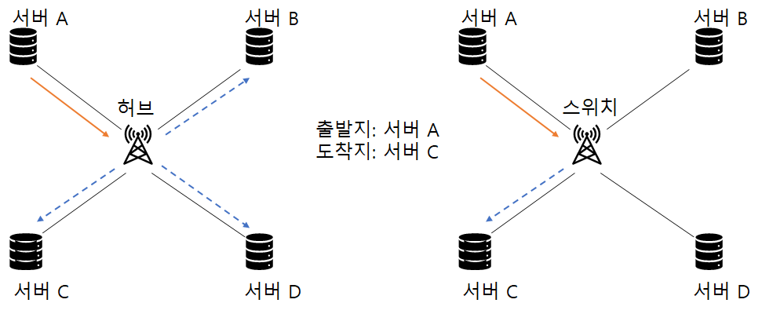

## 네트워크 연결 구분

네트워크는 규모와 관리 범위에 따라 LAN , MAN , WAN 3가지로 구분됩니다.

1. LAN (Local Area Network) : 사용자 내부 네트워크
2. MAN (Metro Area Network) : 한 도시 정보를 연결하고 관리하는 네트워크
3. WAN (Wide Area Network) : 멀리 떨어진 LAN을 연결해주는 네트워크

예전에는 LAN , MAN , WAN 에서 사용하는 기술이 모두 달라 사용하는 프로토콜이나 전송 기술에 따라 쉽게 구분할 수 있었습니다. 현재는 대부분의 기술이 이더넷으로 통합되면서 사용자가 전송 기술을 구분하는 것은
무의미해져 관리 범위 기준으로 LAN , MAN , WAN을 구분합니다.

### 1. LAN

LAN 은 Local Area Network 의 약자로 홈 네트워크용과 사무실용 네트워크 처럼 비교적 소규모의 네트워크를 말합니다. 먼 거리를 통신할 필요가 없어 스위치와 같이 비교적 간단한 장비로 연결된 네트워크를 LAN이라고 불러왔습니다.
소모 비용, 신뢰도 , 구축 및 관리를 위해 다른 다양한 기술이 사용되지만 현재는 대부분 이더넷 기반 전송 기술을 사용합니다.

전송 기술에 대한 구분 외에 관리 범위엥서의 LAN은 자신이 소유한 건물이나 대지에 직접 구축한 선로로 동작시키는 네트워크로 정의할 수 있습니다. 과거에는 대규모 공장이나 대학과 같은 광범위한 네트워크를 별도로 구분했지만 최근에는 이런 구분도 무의미해졌습니다.


```
복잡하거나 대규모인 네트워크라도 직접 구축한 네트워크 범위라면 LAN이라고 부른다.
```

### 2. WAN

WAN은 Wide Area Network의 약자로 먼 거리에 있는 네트워크를 연결하기 위해 사용합니다. 멀리 떨어진 LAN을 서로 연결하거나 인터넷에 접속하기 위한 네트워크가 WAN에 해당합니다.

WAN은 특별한 경우가 아니면 직접 구축할 수 없는 범위의 네트워크이므로 대부분 통신사업자 (KT, LGU+, SKB)로부터 회선을 임대해 사용합니다. 자신이 소유한 땅이나 건물이 아닌 곳을 지나 원격지로 통신해야 할 때 사용하며 사용계약에 의해 비용이 부과됩니다.


## 네트워크 회선

원격지 네트워크에 연결하기 위해서는 WAN 을 사용해야 합니다. WAN에서 통신사업자와 사용자를 연결해주는 다양한 종류의 네트워크 회선과 기술이 사용되어 왔지만 현재는 LAN과 동일하게 이더넷이 주로 사용됩니다. 일반적인 이더넷 외에 특별한 용도로 음성 회선 기반의 저속 회선 기술이나 통신사업자 간의 고속 통신 또는 가입자를 구분하고 식별할 용도로 다양한 기술이 사용됩니다.

### 1. 인터넷 회선

인터넷 접속을 위해 통신사업자와 연결하는 회선을 인터넷 회선이라고 부릅니다. 통신사업자와 케이블만 연결한다고 인터넷이 가능한 것이 아니라 통신사업자가 판매하는 인터넷과 연결된 회선을 사용해야만 인터넷 접속이 가능합니다. 일반적으로 동일한 회선 속도와 전송 기술을 사용했을때 인터넷이 연결되지 않은 회선보다 인ㅌ처넷을 연결한 회선의 비용이 비쌉니다.

일반가정에서 인터넷에 연결하기 위해 사용하는 기술은 뒤에서 다룰 인터넷 전용 회선과는 전송 기술이 약간 다릅니다. 가입자와 통신사업자 간에 직접 연결되는 구조가 아니라 전송 선로 공유기술을 사용합니다. 예를 들어 아파트 광랜은 내부 선로가 직접 연결되는 구조여서 인터넷 전용 회선처럼 보이지만 아파트에서 통신사업자까지 연결한 회선을 아파트 가입자가 공유하는 구조입니다.

전송선로를 공유하므로 일반 인터넷 회선의 속도는 전송 가능한 최대 속도이고 다음에 다룰 전용 회선과 달리 그 속도를 보장하지 않습니다.(주변 사용량에 따라 속도가 느려질 수 있음)

일반 인터넷 회선의 종류는 다음과 같습니다.

1. 광랜 (이더넷) : 기가 ~ 100Mbps
2. FTTH : 기가 ~ 100Mbps
3. 동축 케이블 인터넷 : 수백 ~ 수십 Mbps
4. xDSL(ADSL , VDSL 등) : 수십 ~ 수 Mbps

위의 인터넷 접속 기술은 기존 전화선을 사용하거나 특정 구간부터 다른 사용자와 공유됩니다. 항상 모든 사람이 최대 속도로 인터넷을 접속하는 것은 아니므로 공유 구간은 사용자 최대 속도를 보장하지 않도록 구축하는 것이 일반적입니다.

### 2. 전용 회선

가입자와 통신사업자 간에 대역폭을 보장해주는 서비스를 대부분 전용 회선이라고 부릅니다. 대역폭을 보장해주는 기술에는 여러 가지가 있지만 가입자와 통신사업자 간에는 전용 케이블로 연결되어 있고 통신사업자 내부에서 TDM(시분할 다중화 : Time Division Multipexing)와 같은 기술로 마치 직접 연결한 것처럼 통신 품질을 보장해줍니다. 인터넷 전용 회선이 아닌 일반 전용 회선은 본사-지사 연결에 주로 사용됩니다.


전용 회선을 가입자와 접속하는 전송 기술을 기반으로 구분한다면 다음과 같이 음성 전송 기술 기반의 저속 회선과 매트로 이더넷이라는 고속 회선으로 분류할 수 있습니다.

#### 저속 : 음성 전송 기술 기반

저속 음성 전송 기술은 64kbps 단위로 구분되어 사용됩니다. 작은 기본 단위를 묶어 회선에 접속 속도를 높이는 방법으로 발전되어 온 기술로 오랫동안 사용되어 왔습니다. 보통 높은 속도가 필요하지 않을 때나 높은 신뢰성이 필요할 때 사용되어 왔지만 현재 이더넷 기반의 광 전송 기술이 신뢰할 정도의 수준으로 발전해 점점 사용 빈도가 줄고 있습니다. 하지만 아직도 결재 승인과 같은 전문(Clear Text) 전송을 위한 VAN(Value Added Network) 사나 대외 연결에는 저속 회선을 사용하는 경우가 많습니다. 이 기술을 사용하려면 원격지 전송 기술로 변환할 수 있는 라우터가 필요합니다.

#### 고속 : 메트로 이더넷

고속 연결은 대부분 광케이블 기반의 이더넷을 사용합니다. 가입자와 통신 사업자 간의 접속 기술은 이더넷을 사용하고 통신사업자 내부에서는 이런 개별 가입자를 묶어 통신할 수 있는 다른 고속 통신 기술을 사용합니다. 가입자와 통신사업자 내부에서의 통신 기법이 다른것은 통신사업자는 여러 가입자를 구분하고 가입자 트래픽을 고속으로 전송하는 것이 중요하기 때문입니다. 또한 다양한 가입자 접속 기술을 하나의 기술로 통합하기 위한 (저속 통신 회선이나 이더넷, 음성을 하나의 회선에 실을 수 있도록)기술이 사용됩니다.

```
참고 : LLC(Link Loss Carry Forward)

LLCF는 한쪽 링크가 다운되면 이를 감지해 반대쪽 링크도 다운시키는 기능입니다. 전용 회선을 이더넷으로 구성할 때 회선사에서 LLCF를 설정하지 않으면 전용 회선이 한 사이트에서 다운되더라도 반대쪽 사이트에서는 회선이 그대로 살아있는 것처럼 보이므로 반드시 회선 개통 후 회선사에서 LLCF 설정이 되어 있는지 확인해야 합니다.

저속 회선은 2계층 프로토콜 통신 상태를 확인하는 기능이 있으므로 라우터에서 상대방 링크가 끊길 경우, 감지할 수 있어 LLCF 설정이 별도로 필요없습니다.
```


### 3. 인터넷 전용 회선

인터넷 연결 회선에 대한 통신 대역폭을 보장해주는 상품을 인터넷 전용 회선이라고 합니다. 가입자가 통신사업자와 연결되고 이 연결이 다시 인터넷과 연결되는 구조입니다. 인터넷 전용 회선은 가입자가 일반가정에서 사용하는 접속기술과 달리 다른 가입자와 경쟁하지 않고 통신사업자와 가입자 간의 연결 품질을 보장해 줍니다.


```
인터넷 연결을 위한 회선이 통신사업자와 가입자 간에 전용으로 연결되어 있다.
```

기존에는 인터넷 전용 회선과 일반가정 가입자들이 사용하는 네트워크 기술에 확연한 차이가 있었지만 최근 대부분 광 전송 기술을 사용하므로 구분하는 것이 쉽지 않다. 최근 인터넷 전용 회선 기술은 이더넷이 가장 많이 쓰입니다. 메트로 이더넷이라는 이 기술을 수~수십 km까지 전송할 수 있는 최근의 이더넷 기술을 바탕으로 하고 있습니다.

### 4. VPN

#### 통신사업자 VPN

전용선은 연결 거리가 늘어날수록 비용이 증가합니다. 도시 내의 전용선 연결은 비싸지 않지만 타 도시나 해외 연결 전용선 비용은 매우 비쌉니다. 전용선은 사용 가능한 대역폭을 보장해주지만 가입자가 계약된 대역폭을 항상 100% 사용하는 것이 아니어서 낭비되는 비용이 클 수 있습니다. 이런 비용 낭비를 줄이고 먼 거리와 연결하더라도 비용을 줄이기 위해서 통신사업자가 직접 가입자를 구분할 수 있는 VPN기술을 사용해 비용을 낮추고 있습니다. 가장 대표적인 기술이 MPLS VPN 입니다.


```
MPLS VPN. 여러 가입자가 하나의 MPLS 망에 접속되지만 가입자를 구분할 수 있는 기술을 적용해 전용선처럼 사용할 수 있다.
```

이 기술을 이용하면 여러 가입자가 하나의 망에 접속해 통신하므로 공용 회선을 함께 이용하게 되어 비용이 낮아집니다. 전용 회선 비용은 거리와 속도의 영향을 받지만 MPLS VPN 회선은 거리보다 속도의 영향을 받으므로 거리가 멀어질수록 MPLS와 같은 공용망 기술 사용이 비용을 낮추는 데 도움이 됩니다.

도시 내부의 통신 외에 본사-지사 또는 지사-지사 간의 연결은 대부분 MPLS VPN 기술을 사용해 연결합니다. MPLS VPN 기술은 가입자 입장에서는 기술적으로 특별히 고려할 것이 없으므로 일반 전용선 연결과 동일한 접속 기술을 사용하게 됩니다.

#### 가입자 VPN

일반 사용자가 VPN 을 사용한다면 대부분 가입자 VPN 기술입니다. 일반 인터넷망을 이용해 사용자가 직접 가상 전용 네트워크를 구성할 수 있습니다. 지방이나 해외를 전용선으로 연결하면 비용이 매우 비싸고 앞에서 알아본 MPLS VPN 기술을 이용한 회선도 일반 인터넷 연결 비용보다 비쌉니다. 그래서 비용을 더 낮추기 위해 일반 인터넷 연결을 이용한 VPN을 사용합니다. 가입자 VPN 기술 관련 내용은 9.6 VPN 절에서 다룹니다.


#### DWDM

DWDM(Dense Wavelength Division Multiplex : 파장 분할 다중화) 전송 기술은 먼 거리를 통신할 때 케이블 포설 비용이 매우 많이 들고 관리가 어려운 문제를 극복하기 위해 개발되었습니다. WDM 기술이 나오기 전에는 하나의 광케이블에 하나의 통신만 가능했습니다. 통신사업자는 많은 가입자를 구분하고 높은 대역폭의 통신을 제공해야 하므로 여러 개의 케이블을 포설해야 했고 이러한 물리적인 케이블을 포설하는 데 어려움이 있었습니다. WDM과 DWDM 기술은 하나의 광케이블에 다른 파장의 빛을 통해 여러 채널을 만드는 동시에 많은 데이터를 전송할 수 있습니다.


DWDM 전송 기술은 기존 WDM 보다 더 많은 채널을 이용하는 기술입니다. 이 기술은 통신사업자 내부에서 먼 거리를 통신할 때 주로 사용되지만 최근 일반가정에서 사용하는 기가 인터넷에서도 사용되고 있습니다. 기가 인터넷은 FTTH(Fibre To The Home)가 사용되고 구축 방식에 따라 PTP , AON , PON 형태로 구분됩니다.

PTP(Point to Point) 방식은 가입자와 통신사업자 간에 케이블을 직접 포설합니다. <br/>
AON(Active Optical Network)은 광신호 분리 장비에 전기가 필요한 스위치와 같은 장비가 사용되고 PON 기술은 전기 인입 없이 광신호를 분리해 가입자와 통신사업자 간의 케이블을 줄일 수 있습니다. 이 경우, 가입자들이 하나의 회선을 공유하므로 인터넷 속도가 느려질 수 있어 DWDM 기술을 접목합니다. 인터넷 사용자가 광회선을 공유하더라도 가입자마다 별도 채널을 이용해 구분하므로 인터넷 접속 속도를 유지할 수 있습니다.

## 네트워크 구성요소

### 1. 네트워크 인터페이스 카드(NIC)

흔히 랜 카드라고 부르는 부품의 정식 명칭은 네트워크 인터페이스 카드 (Network Interface Card , NIC) 입니다. 이 외에도 네트워크 카드(Network Card) , 네트워크 인터페이스 컨트롤러(Network Interface Controller , NIC)라고도 부릅니다.

```
네트워크 인터페이스 카드는 컴퓨터를 네트워크에 연결하기 위한 하드웨어 장치입니다.
```

노트북과 데스크톱 PC에서는 네트워크 인터페이스 카드가 온보드 형태로 기본 장착되므로 별도의 네트워크 인터페이스 카드를 추가할 필요가 거의 없습니다. 서버도 옩보드 형태로 네트워크 인터페이스 카드가 장착되지만 여러 네트워크에 동시에 연결되어야 하거나 더 높은 대역폭이 필요한 경우 네트워크 인터페이스 카드를 추가로 장착합니다. 하지만 최근 서버 보드에 10GT 네트워크 인터페이스 카드가 기본 장착되는 추세이므로 서버에도 별도의 네트워크 카드를 장착하는 빈도가 점점 줄 것으로 예상됩니다.


```
(a) : PC 내장형 네트워크 인터페이스 카드
(b) : 네트워크 인터페이스 카드
(c) : 서버용 네트워크 인터페이스 카드(10G)
```

네트워크 인터페이스 카드의 주요 역할은 다음과 같다

#### 직렬화 (Serialization)

네트워크 인터페이스 카드는 전기적 신호를 데이터 신호 형태로 또는 데이터 신호 형태를 전기적 신호 형태로 변환해줍니다. 네트워크 카드 외부 케이블에서는 전기 신호 형태로 데이터가 전송되는 데 이런 상호 변환작업을 직렬화라고 합니다.

#### MAC 주소

네트워크 인터페이스 카드는 MAC 주소를 가지고 있습니다. 받은 패킷의 도착지 주소가 자신의 MAC 주소가 아니면 폐기하고 자신의 주소가 맞으면 시스템 내부에서 처리할 수 있도록 전달합니다.

#### 흐름 제어(Flow Control)

패킷 기반 네트워크에서는 다양한 통신이 하나의 채널을 이용하므로 이미 통신중인 데이터 처리 때문에 새로운 데이터를 받지 못할 수 있습니다. 이런 현상으로 인한 데이터 유실 방지를 위해 데이터를 받지 못할 때는 상대방에게 통신 중지 요청을 할 수 있습니다. 이 작업을 흐름 제어라고 합니다.

### 2. 케이블과 커넥터

노트북이나 스마트폰, 태블릿에서 인터넷 연결을 위한 무선 사용 빈도가 점점 높아지고 있지만 회사 네트워크에 접속하거나 서버를 네트워크와 연결하는 거소가 같이 신뢰도 높은 통신이 필요한 경우에는ㄴ 아직도 유선이 사용되고 있습니다. 이런 연결을 위해 맨 먼저 고려할 네트워크 연결점은 케이블입니다.


케이블은 트위스티드 페어 케이블, 동축 케이블, 광케이블 3가지가 있습니다.

3가지 케이블 모두 케이블을 연결해야 하는 거리나 속도에 따라 다양한 케이블이 있고 용도에 맞게 사용됩니다. 이런 다양한 케이블을 모두 알 수는 없으므로 원하는 환경에 맞는 케이블을 올바로 선택하려면 케이블을 구성하는 기본 요소와 표준을 알아야 합니다.

#### 이더넷 네트워크 표준

현재 가장 많이 사용되는 네트워크 기술은 이더넷 방식 입니다. 따라서 이더넷 네트워크를 사용하기 위한 케이블과 커넥터를 중심으로 알아보겠습니다. 현재 대중화되어 있는 이더넷 표준은 기가비트 이더넷과 10기가비트 이더넷입니다. 일반 PC와 같은 종단은 기가비트 이더넷을, 데이터 센터의 서버와 같은 종단은 기가비트나 10기가비트 이더넷을 주로 사용하고 있습니다. 서버와 스위치 간 연결을 10기가비트 이더넷으로 구성할 경우, 스위치에서는 상위 스위치와의 연결을 위한 업링크 대역폭을 확보하기 위해 40기가비트나 100기가비트 이더넷을 사용합니다.


이더넷에서도 케이블의 종류, 인코더의 종류 등으로 세분화해 여러 가지 표준으로 나뉘지만 대중적으로 많이 사용되는 표준은 다음 3가지입니다.

|     명칭      |  표준   | 속도 |      타입       |    거리     |  비고  |
| :-----------: | :-----: | :--: | :-------------: | :---------: | :----: |
| 1,000 BASE-T  | 802.3ad |  1G  | 트위스티드 페어 |    100 m    |        |
| 1,000 BASE-SX | 802.3z  |  1G  |       광        | 220 ~ 550 m |        |
| 1,000 BASE-LX | 802.3z  |  1G  |       광        |   ~ 5 km    |        |
| 1,000 BASE-EX |    -    |  1G  |       광        |   ~ 40 km   | 비표준 |
| 1,000 BASE-ZX |    -    |  1G  |       광        |   ~ 70 km   | 비표준 |
|  10 GBASE-T   | 802.3an | 10G  | 트위스티드 페어 | 55 ~ 100 m  |        |
|  10 GBASE-SR  | 802.3ae | 10G  |       광        | 26 ~ 400 m  |        |
|  10 GBASE-LR  | 802.3ae | 10G  |       광        |   ~ 10 km   |        |
|  10 GBASE-ER  | 802.3ae | 10G  |       광        |   ~ 40 km   |        |
|  10 GBASE-ZR  |    -    | 10G  |       광        |   ~ 80 km   | 비표준 |

```
• 1,000BASE-T/10GBASE-T
⇒ 트위스티드 페어 케이블을 이용하는 기가 이더넷 표준

• 1,000BASE-SX/10GBASE-SR
⇒ 멀티모드 광 케이블을 사용하고 비교적 짧은 거리를 보낼 수 있는 이더넷 표준

• 1,000BASE-LX/10GBASE-LR
⇒ 싱글모드 광 케이블을 사용하고 비교적 긴 거리를 보낼 수 있는 이더넷 표준
```

멀티모드와 싱글모드의 차이점은 나중에 케이블 - 광케이블 절에서 자세히 설명하겠다. 기가비트 이더넷 표준중의 하나인 1,000BASE-T로 각 명칭의 의미를 설명하겠습니다. 1,000BASE-T에서 앞 숫자 1,000은 속도를 나타냅니다. 앞 숫자가 1,000이면 1,000Mbps 속도로 통신할 수 있는 네트워크 입니다. 중간 문자는 채널의 종류에 대한 것으로 Base 는 단인채널 통신을 나타내고 Broad는 다채널 통신을 나타냅니다. 마지막 문자는 케이블 타입을 나타내는 것으로 T 문자는 트위스티드 페어(Twisted Pair) 케이블을 나타냅니다. 마지막 문제에 의해 케이블과 그에 맞춘 광신호, 트랜시버의 종류가 달라집니다.


```
1,000 : 속도를 의미하며 1,000Mbps 속도로 통신할 수 있다는 의미이다.
BASE : 채널의 종류를 의미하며 BASE는 단일 통신, Broad는 다채널 통신을 나타낸다.
T : 케이블 타입을 나타내며 T는 트위스트페어 케이블을 나타낸다.
```

앞에서 다룬 기가 이더넷 뿐만 아니라 높은 성능을 제공하는 다양한 이더넷 표준이 많이 있습니다.

|    표준     |   전송속도    | 방향당 채널 수 | 스펙트럼 대역폭 | 케이블(100m) | 케이블 스펙 |
| :---------: | :-----------: | :------------: | :-------------: | :----------: | :---------: |
|  10BASE-T   |   10 Mbit/s   |       1        |     10 MHz      |    Cat 3     |   16 MHz    |
| 1,000BASE-T | 1,000 Mbit/s  |       4        |    62.5 MHz     |    Cat 5e    |     100     |
| 2.5GBASE-T  | 2,500 Mbit/s  |       4        |     100 MHz     |    Cat 5e    |     100     |
|  5GBASE-T   | 5,000 Mbit/s  |       4        |     200 MHz     |    Cat 6     |     250     |
|  10GBASE-T  | 10,000 Mbit/s |       4        |     400 MHz     |    Cat 3     |     500     |
|  25GBASE-T  | 25,000 Mbit/s |       4        |    1,000 MHz    | Cat 8(300m)  | 1,600/2,000 |
|  40GBASE-T  | 40,000 Mbit/s |       4        |    1,600 MHz    | Cat 8(300m)  | 1,600/2,000 |

2.5G , 5G, 25G, 40G,50G, 100G를 지원하는 이더넷 표준들이 범용적으로 사용되고 있고 트위스티드 페어 케이블을 사용하는 경우, 40G까지 사용할 수 있는 표준이 나와 있습니다. 최근 더 높은 대역폭을 위해 100G를 넘어선 200G, 400G까지 표준화가 완료되어 대형 데이터 센터 위주로 사용되고 있으며 현재 800G 표준화 작업이 진행되고 있습니다.

#### 케이블, 커넥터 구조

케이블은 물리적으로 케이블 본체, 커넥터,트랜시버와 같은 여러 요소로 나뉩니다. 케이블 본체는 트위스티드 페어, 동축 , 광케이블로 나뉘고 케이블 본체의 종류에 따라 커넥터와 트랜시버의 종류도 함께 달라집니다.


트랜시버, 커넥터, 케이블 본체 3개 부분이 모두 분리되어 있거나 하나로 합쳐진 케이블 형태도 있습니다. 드위스티드 페어 케이블의 경우, 커넥터와 케이블 본체가 하나로 구성되어 ㅣㅇㅆ고 별도의 트랜시버가 없는 경우가 많습니다. 반면, 광케이블은 다양한 속도와 거리를 지원해야 하므로 트랜시버, 커넥터와 케이블을 분리하는 경우가 많습니다.

#### 케이블 - 트위스티드 페어 케이블

가장 흔히 사용하는 케이블은 트위스티드 페어(Twisted Pair : TP) 케이블 입니다. 트위스티드 페어 케이블은 쉴드를 장착한 STP/FTP 케이블과 종류와 쉴드가 없는 UTP 케이블이 있습니다. 트위스티드 페어 케이블은 RJ-45 커넥터를 이용하고 케이블 본체와 함께 연결되어 분리할 수 없습니다. 이 케이블은 컴퓨터나 서버에 있는 랜포트에 끼우면 네트워크에 연결됩니다.


트위스티드 페어 케이블도 요구되는 속도와 통신 거리에 따라 다양한 스펙이 있고 환경에 따라 적절히 선택해야 합니다. 트위스티드 페어 케이블은 카테고리(Category) 단위로 케이블 등급을 나눕니다. 가장 많이 사용하는 케이블은 카테고리 5E 케이블 입니다. 1G 속도를 지원하는 대중적인 케이블로 데스크톱, 노트북과 같은 일반 단말을 연결하는 데는 적합하지만 데이터 센터와 같은 높은 대역폭을 지원해야 할 때는 사용하기 어렵습니다. 이런 이유로 10G부터는 광케이블을 이용하는 경우가 많았는데 가상화가 대중화되고 IP 기반 스토리지들이 많이 사용되어 더 높은 대역폭을 요구하는 사례가 늘면서 일반 서버에도 10G가 기본적으로 쓰이기 시작했습니다. 10GBASE-T 를 기본 탑재해 생산되는 서버들이 늘면서 10G네트워크에도 트위스티드 페어 케이블이 사용되기 시작했습니다.

10BASE-T는 카테고리 6 , 6A , 7(비표준) 케이블이 사용되고 이 케이블들은 외부와 내부 간선을 줄이기 위한 다양한 기술이 추가되었습니다.

|          |    CAT5    |    CAT5E    |    CAT6     |   CAT6A   | CAT7(비표준) |     CAT8     |
| :------: | :--------: | :---------: | :---------: | :-------: | :----------: | :----------: |
| 전송속도 |  100 Mbps  |   1 Gbps    |   1 Gbps    |  10 Gbps  |   10 Gbps    |  25/40 Gbps  |
|  대역폭  |  100 MHz   |   100MHz    |   250MHz    |  500 MHz  |   600 MHz    |  1.6/2 GHz   |
|   규격   | 100BASE-TX | 1,000BASE-T | 1,000BASE-T | 10GBASE-T |  10GBASE-T   | 25/40GBASE-T |
|   쉴드   |    UTP     |     UTP     |   STP/UTP   |  FTP/UTP  |     STP      |     SFTP     |
|  플러그  |  UTP/STP   |   UTP/STP   |   UTP/STP   |  UTP/STP  |     STP      |    RJ-45     |
|          |   RJ-45    |    RJ-45    |    RJ-45    |   RJ-45   |  non RJ-45   |              |

트위스티드 페어 케이블은 그물 혀앹의 쉴드가 있는 STP(Shielded Twisted Pair)와 포일 형태의 쉴드가 있는 FTP(Foiled Twisted Pair), 쉴드가 없는 UTP(Unshielded Twisted Pair)로 구분됩니다. 또한, 쉴드가 트위스트된 페어마다 있는 경우와 전체 케이블을 보호하기 위한 쉴드가 있는 경우에 따라 S/FTP와 같은 케이블이 사용되기도 합니다. S/FTP 의 각 페어에는 포일로 쉽드되어 있고 전체 케이블을 보호하는 쉴드가 함께 있는 케이블 입니다. 이것은 내부 간섭과 외부 간섭 모두 잘 막아줄 수 있습니다.

```
• 가장 흔히 사용되는 케이블이다.
• 쉴드를 장착한 STP/FTP, 쉴드가 없는 UTP 케이블이 있다.
• RJ-45 커넥터를 이용하며 케이블 본체와 함께 연결되어 분리할 수 없다.
• 카테고리(Category)단위로 케이블 등급을 나눈다.
• 5E 케이블이 현재 가장 많이 쓰인다.
: 1G 속도를 지원하는 대중적인 케이블로 일반 단말(데스크톱, 노트북)을 연결하는데 적합하다.
: 가상화가 대중화되고 IP기반 스토리지들이 많이 사용되어 대역폭 요구사항이 높아지면서 일반서버에도 10G 가 쓰이기 시작했고, 10GBASE-T 를 기본 탑재해 생산되는 서버들이 늘어나면서 10G 네트워크에도 트위스티드 페어 케이블이 사용되기 시작했다.
```

• 다음과 같은 형태로 구분된다.


```
⇒ STP(Shielded Twisted Pair): 그물 형태의 쉴드가 있는 구조
⇒ (a) - UTP(Unshielded Twisted Pair): 쉴드가 없는 구조
⇒ (b) - FTP(Foiled Twisted Pair): 포일 형태의 쉴드가 있는 구조
⇒ (c) - S/FTP: 각 페어는 포일로 쉴드되어 있고 전체 케이블을 보호하는 쉴드가 함께 있다.
```

#### 케이블 - 동축 케이블

동축 케이블은 케이블 TV와 연결할 때 사용하는 두꺼운 검정 케이블과 같은 종류입니다. 과거에는 LAN구간에도 사용되었지만 다루기 힘들고 고가이므로 잘 사용되지 않고 케이블 TV나 인터넷 연결을 위해서만 사용되어 왔습니다. 하지만 최근 10G 이상의 고속 연결을 위해 트랜시버를 통합한 DAC(Direct Attach Copper Cable) 케이블을 많이 사용하는 데 이 케이블은 동축 케이블 종류 중 하나 입니다.


#### 케이블 - 광 케이블

광케이블은 일반적으로 다른 구리선(UTP, 동축)보다 신뢰도가 높고 더 먼 거리까지 통신할 수 있어 높은 대역폭을 요구하거나 먼 거리를 통신해야 하는 네트워크 장비 간의 통신에 주로 사용됩니다. 케이블은 저항 때문에 생기는 감쇄와 주위 자기장의 간섭으로부터 보호받아야 하는데 광신호를 기반으로 하는 광케이블은 이런 감쇄와 간섭으로부터 비교적 자유롭습니다.

광케이블은 싱글모드, 멀티모드 2가지로 나뉩니다. 싱글모드는 먼 거리 통신을 지원하기 위해 케이블 굵기가 매우 가늘고 신호를 보내는 광원으로 레이저를 사용합니다. 레이저는 다른 빛에 비해 먼 거리를 퍼지지 않고 직진하는 성질이 있습니다. 멀티모드는 싱글모드에 비해 비교적 굵은 케이블을 사용하며 광원으로 LED를 사용합니다. LED 광원은 레이저보다 쉽게 구현할 수 있어 멀티 모드 케이블과 트랜시버 모두 가격이 싱글모드보다 저렴합니다.

|                |    멑티모드     |  싱글모드   |
| :------------: | :-------------: | :---------: |
|    코어직경    | 50 um , 62.5 um |  8 ~ 10 um  |
|  클래딩 직경   |      125um      |    125um    |
| 광 전송로 모드 |      복수       |    하나     |
|   전송 손실    |  많다(비교적)   |    적다     |
|   전송 거리    |      550m       | 10 ~ 100 km |
|  케이블 취급   |  쉽다(비교적)   |   어렵다    |
|      비용      |  저가(비교적)   |    고가     |

넓은 광 전송로에 여러가지 광원이 전송되므로 멀티모드라 하고 하나의 레이저 신호로 가느다란 전송로를 통과하므로 싱글모드라고 부릅니다. 반사 각도가 작은 싱글모드가 훨씬 먼 거리로 전송할 수 있습니다.

싱글모드 케이블은 노란색 , 멀티모드 케이블은 주황색(1G)과 하늘색(10G)을 띄므로 쉽게 구분할 수 있습니다.

#### 커넥터

커넥터는 케이블의 끝부분으로 네트워크 장비나 네트워크 카드에 연결되는 부분입니다. 트위스티드 페어 케이블에서는 RJ-45 커넥터를 사용하지만 광케이블은 다양한 커넥터가 있습니다.


```
(a) RJ-45 커넥터
(b) SFP 커넥터
```

광 케이블은 주로 LC 커넥터가 사용되고 SC 커넥터가 일부 사용합니다. 서버에 광 케이블을 사용하는 경우, 네트워크 연결 요청 시 커넥터 타입을 네트워크 담당자에게 알려주어야 적합한 케이블을 사용할 수 있습니다.


#### 트랜시버

트랜시버는 다양한 외부 신호를 컴퓨터 내부의 전기 신호로 바꾸어 줍니다. 트랜시버가 별도로 구분되지 않던 과거에는 다양한 이더넷 표준과 케이블을 만족하기 위해 네트워크 장비나 NIC 를 별도로 구매햐야 했습니다. 케이블이 변겨오디면 네트워크 장비와 네트워크 카드도 함께 변경해야 하는 문제를 해결하고 서로 다른 다양한 네트워크 표준을 혼용해 사용할 수 있도록 트랜시버를 사용합니다.

트랜시버 중 하나인 GBIC(지빅)은 초기 개발된 모듈 이름이고, 이후 SPF나 SPF+ 같은 상위 표준이 나왔지만 일반적으로 트랜시버 전체는 GBIC 으로 통칭해 부르기도 합니다. 더 정확히 구분해 설명하자면 GBIC 은 GigaBit Interface Converter의 약자로 SC 타입의 커넥터를 연결할 수 있는 인터페이스이며 SFP,는 Small Form-Factor Pluggable 의 약자로 LC 타입의 커넥터를 연결할 수 있습니다.

트랜시버는 광케이블뿐만 아니라 트위스티드 페어 케이블도 수용할 수 있으며, 이런 트랜시버를 GLC-TE라고 부릅니다.


트랜시버는 지원 속도와 크기에 따라 다양한 종류가 있습니다.

| 광 타입 |    표준     | 데이터 전송 속도 | 파장 길이 | 광 타입 | 최대거리 |     커넥터     |
| :-----: | :---------: | :--------------: | :-------: | :-----: | :------: | :------------: |
|   SFP   |   SFP MSA   |     155 Mbps     |  850 nm   |   OM1   |  160 km  | LC, SC , RJ-45 |
|         |             |     622 Mbps     | 1,310 nm  |   OM2   |          |                |
|         |             |    1.25 Gbps     | 1,550 nm  |   OS1   |          |                |
|         |             |    2.125 Gbps    |   CWDM    |   OS2   |          |                |
|         |             |     2.5 Gbps     |   DWDM    |         |          |                |
|         |             |      3 Gbps      |   BIDI    |         |          |                |
|         |             |    4.25 Gbps     |           |         |          |                |
|         |             |                  |           |         |          |                |
|  GBIC   |  GBIC MSA   |     155 Mbps     |   850nm   |   OM1   |  120 km  |   SC, RJ-45    |
|         |             |     622 Mbps     | 1,310 nm  |   OM2   |          |                |
|         |             |    1.25 Gbps     | 1,550 nm  |   OS1   |          |                |
|         |             |                  |   CWDM    |   OS2   |          |                |
|         |             |                  |   DWDM    |         |          |                |
|         |             |                  |   BIDI    |         |          |                |
|         |             |                  |           |         |          |                |
|  SFP+   | IEEE802.3ae |      6 Gbps      |   850nm   |   OM1   |  120 km  |       LC       |
|         |  SFF-8431   |     8.5 Gbps     | 1,310 nm  |   OM2   |          |                |
|         |  SFF-8432   |     10 Gbps      | 1,550 nm  |   OS1   |          |                |
|         |             |                  |   CWDM    |   OS2   |          |                |
|         |             |                  |   DWDM    |         |          |                |
|         |             |                  |   BIDI    |         |          |                |
|         |             |                  |  Tunable  |         |          |                |
|         |             |                  |  Copper   |         |          |                |
|         |             |                  |           |         |          |                |
|   XFP   | IEEE802.3ae |      6 Gbps      |   850nm   |   OM1   |  120 km  |       LC       |
|         |   XFP MSA   |     8.5 Gbps     | 1,310 nm  |   OM2   |          |                |
|         |             |     10 Gbps      | 1,550 nm  |   OS1   |          |                |
|         |             |                  |   CWDM    |   OS2   |          |                |
|         |             |                  |   DWDM    |         |          |                |
|         |             |                  |   BIDI    |         |          |                |
|         |             |                  |  Tunable  |         |          |                |
|         |             |                  |  Copper   |         |          |                |

트랜시버 없이 전용 인터페이스를 사용하면 길이나 속도마다 다른 네트워크 장비나 네트워크 인터페이스 카드를 별도로 구비해야 하지만 간단히 트랜시버만 변경하면 통신 길이와 속도를 조절 할 수 있어 최근 생산되는 대부분의 네트워크 장비와 네트워크 인터페이스 카드는 트랜시버를 지원하고 있습니다.

### 3. 허브

허브는 케이블과 동일한 1계층에서 동작하는 장비입니다. 허브는 거리가 멀어질수록 줄어드는 전기 신호를 재생성해주고 HUB라는 용어 그래도 여러 대의 장비를 연결할 목적으로 사용됩니다.

허브는 단순히 들어온 신호를 모든 포트로 내보내 네트워크에 접속된 모든 단말이 경쟁하게 되므로 전체 네트워크 성능이 줄어드는 문제가 있고 패킷이 무한 순환해 네트워크 전체를 마비시키는 루프와 같은 다양한 장애의 원인이 되어 허브는 현재 거의 사용되지 않고 있습니다.


### 4. 스위치


스위치(Switch)는 허브와 동일하게 여러 장비를 연결하고 통신을 중재하는 2계층 장비입니다. 허브와 스위치는 내부 동작 방식은 다르지만 여러 장비를 연결하고 케이블을 한곳으로 모아주는 역할은 같으므로 '허브'라는 용어를 공통적으로 사용합니다. 스위치는 허브의 역할과 통신을 중재하는 2가지 역할을 모두 포함하므로 스위칭 허브로도 불립니다.

허브는 단순히 전기 신호를 재생성해 출발지를 제외한 모든 포트에 전기 신호를 내보내지만 스위치는 허브와 달리 MAC 주소를 이해할 수 있어 목적지 MAC 주소의 위치를 파악하고 목적지가 연결된 포트로만 전기 신호를 보냅니다.


예를 들어 A에서 C로 통신해야할 상황에서 허브는 A가 전기 신호를 보내면 출발지 포트를 제외한 HUB에 있는 모든 포트에 전기 신호를 흘리지만 스위치는 A에서 C로 통신을 시도할 경우, C로만 전기 신호를 보냅니다. B와 D는 이번 통신의 영향을 전혀 받지 않아 그 사이 다른 통신을 동시에 수행할 수 있게 됩니다. 허브는 무전지처럼 송수신을 동시에 할 수 없고 한쪽 방향으로만 동작하지만 스위치는 전화기처럼 송수신이 동시에 할 수 있습니다.

스위치의 발명과 대중화는 효율이 낮고 네트워크 응답 성능을 보장할 수 없었던 이더넷 네트워크가 성능 보장이 가능한 효율 높은 네트워크 기술로 발전할 수 있었던 계기가 되었습니다.

### 5. 라우터


네트워크 크기가 점점 커지고 먼 지역에 위치한 네트워크와 통신해야 하는 요구사항이 늘어나면서 라우터가 필요해졌습니다. 라우터는 OSI 7계층 중 3계층에서 동작하면서 먼 거리로 통신할 수 있는 프로토콜로 변환합니다.

라우터는 원격지로 쓸데없는 패킷이 전송되지 않도록 브로드캐스트와 멀티캐스트를 컨트롤하고 불분명한 주소로 통신을 시도할 경우, 이를 버립니다. 정확한 방향으로 패킷이 전송되도록 경로를 지정하고 최적의 경로로 패킷을 포워딩 합니다.


최근 일반 사용자가 라우터 장비를 접하기는 어렵지만 라우터와 유사한 역할을 하는 L3 스위치와 공유기는 쉽게 찾아볼 수 있습니다.

### 6. 로드 밸런서

일반적으로 로드 밸런서는 OSI 7계층 중 4계층에서 동작합니다. 애플리케이션 계층에서 애플리케이션 프로토콜의 특징을 이해하고 동작하는 7계층 로드 밸런서를 별도로 ADC(Application Delivery Controller) 라고 부릅니다.

L4 스위치라고 부르는 네트워크 장비도 로드 밸런서의 한 종류로 스위치처럼 여러 포트를 가지고 있으면서 로드 밸런서 역할을 하는 장비를 지칭합니다.

로드 밸런서는 4계층 포트 주소를 확인하는 동시에 IP 주소를 변경할 수 있습니다. 로드 밸런서가 가장 많이 사요오디는 서비스는 웹입니다. 웹 서버를 증설하고 싶은 때 로드 밸런서를 웹 서버 앞에 두고 웹 서버를 여러 대로 늘려줍니다. 대표 IP는 로드 밸런서가 갖고 로드 밸런서가 각 웹 서버로 패킷의 목적지 IP 주소를 변경해 보내줍니다.
이런 원리를 이용해 여러 대의 웹 서버가 동시에 동작해 서비스 성능을 높여주는 동시에 일부 웹 서버에 문제가 발생하더라도 빠른 시간 안에 서비스가 복구되도록 도와줍니다.

이런 기능을 위해 로드 밸런서는 IP 변환 외에도 서비스 헬스 체크 기능이나 대용량 세션 처리 기능이 있습니다.

### 7. 보안 장비(방화벽 / IPS)

대부분 네트워크 장비는 정확한 정보 전달에 초점이 맞추어져 있지만 보안 장비는 네트워크 장비와 달리 정보를 잘 제어하고 공격을 방어하는데 초점이 맞추어져 있습니다. 방어 목적과 보안 장비가 설치되는 위치에 맞추어 다양한 보안 장비가 사용됩니다. 일반적으로 가장 유명한 보안 장비는 방화벽 입니다. 방화벽은 OSI 7 계층 중 4계층에서 동작해 방화벽을 통과하는 패킷의 3,4 계층 정보를 확인하고 패킷을 정채고가 비교해 버리거나 포워딩합니다.

### 8. 기타 (모뎀/공유기 등)

거의 모든 가정이나 작은 회사에서 사용하는 공유기는 2계층 스위치, 3계층 라우터, 4계ㅖ층 NAT 와 간단한 방화벽 기능을 한곳에 모아놓은 장비입니다. 공유기 내부는 스위치 부분, 무선 부분과 라우터 부분 회로로 나뉩니다. 겉으로 하나의 간단한 장비처럼 보이지만 내부적으로는 크게 스위치와 무선 AP, 라우터 부분으로 구분되는 복잡한 장비입니다.

모뎀은 짧은 거리를 통신하는 기술과 먼 거리를 통신할 수 있는 기술이 달라 이 기술들을 변환해주는 장비입니다.

공유기의 LAN 포트와 WAN 포트는 모두 일반 이더넷이어서 100m 이상 먼 거리로 데이터를 보내지 못하므로 먼 거리 통신이 가능한 기술로 변환해주는 모뎀이 별도로 피룡합니다. 통신사업자 네트워크 종류와 쓰이는 기술에 따라 여러 종류의 모뎀이 사용됩니다. 기가 인터넷의 경우 대부분 FTTH 모뎀을 사용하고 동축 케이블 인터넷은 케이블 모뎀, 전화선을 사용할 경우, ADSL, VDSL 모뎀을 사요합니다.
