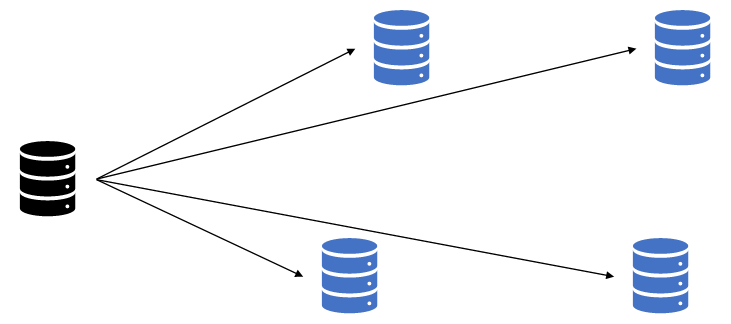

## 유니캐스트, 멀티캐스트, 브로드캐스트, 애니캐스트

네트워크에서 출발지에서 목적지로 데이터를 전송할 때 사용하는 통신방식에는 유니캐스트(Unicast) , 브로드캐스트(Broadcast) , 멀티캐스트(Multicast) , 애니캐스트(Anycast)가 있습니다.

각 통신 방식은 다음과 같습니다.

### 1. 유니캐스트

유니캐스트는 출발지와 목적지가 명확히 하나로 정해져 있는 1:1 통신 방식이며 사용하는 대부분의 통신이 유니캐스트 방식입니다.


```
유니캐스트

1. 1:1 통신
2. 출발지와 목적지가 1:1로 통신
3. 대부분의 통신은 유니캐스트 방식을 사용한다.
```

### 2. 브로드 캐스트

브로드 캐스트는 목적지 주소가 모든으로 표기되어 있는 통신방식입니다. 유니캐스트로 통신하기 전, 주로 상대방의 정확한 위치를 알기 위해 사용됩니다. 주소 체계에 따라 브로드 캐스트를 다양하게 분류할 수 있지만 기본 동작은 로컬 네트워크 내에서 모든 호스트에 패킷을 전달해야 할 때 사용됩니다.



```
브로드 캐스트

1. 1:N 통신
⇒ 동일 네트워크에 존재하는 모든 호스트가 목적지
⇒ 유니캐스트로 통신하기 전, 주로 상대방의 정확한 위치를 알기 위해 사용된다.
⇒ 기본 동작은 로컬 네트워크 내에서 모든 호스트에 패킷을 전달해야 할 떄 사용된다.
```

### 3. 멀티캐스트

멀티캐스트는 멀티캐스트 그룹 주소를 이용해 해당 그룹에 속한 다수의 호스트로 패킷을 전송하기 위한 통신 방식입니다. IPTV 와 같은 실시간 방송을 볼 때 이 멀티캐스트 통신 방식을 사용합니다. 사내 방송이나 증권 시세 전송과 같이 단방햐응로 다수에게 동시에 같은 내용을 전달 할 때 사용됩니다.


```
멀티캐스트

1. 1:그룹(멀티캐스트 구독 호스트) 통신
2. 하나의 출발지에서 다수의 특정 목적지로 데이터 전송
3. IPTV와 같은 실시간 방송을 볼 때 이 멀티캐스트 통신 방식을 사용한다.
4. 사내방송, 증권 시세 전송과 같이 단방향으로 다수에게 동시에 같은 내용을 전달해야 할 때 사용된다.
```

### 4. 애니캐스트

애니캐스트는 애니캐스트 주소가 같은 호스트들 중에서 가장 가깝거나 가장 효율적으로 서비스할 수 있는 호스트와 통신하는 방식입니다. 이런 애니캐스트 게이트웨이의 성질을 이용해서 가장 가까운 DNS 서버를 찾을 때 사용하거나 가장 가까운 게이트웨이를 차즌ㄴ 애니캐스트 게이트웨이 기능에 사용하기도 합니다.


```
애니캐스트

1. 1:1 통신 (목적지는 동일 그룹 내의 1개 호스트)
2. 다수의 동일 그룹 중 가장 가까운 호스트에서 응답
3. IPv4 에서는 일부 기능 구현, IPv6은 모두 구현 가능
4. 애니캐스트 게이트웨이의 성질을 이용해 가장 가까운 DNS서버를 찾을 떄 사용한다.
5. 가장 가까운 게이트웨이를 찾는 애니캐스트 게이트웨이 기능에 사용한다.
6. 최종 통신은 1:1로 유니캐스트와 동일하지만 통신 대상 후보자는 서로 다르다.
⇒ 유니캐스트는 출발지와 목적지가 모두 한 대씩이다.
⇒ 애니캐스트는 같은 목적지 주소를 가진 서버가 여러대여서 통신 가능한 다수의 후보군이 있다.
```

최종 통신은 1:1 로 유니캐스트와 애니캐스트가 동일하지만 후보자는 서로 다릅니다. 유니 캐스트는 출발지와 목적지가 모두 한 대씩 이지만 애니캐스트는 같은 목적지 주소를 가진 서버가 여러 대여서 통신 가능한 다수의 후보군이 있습니다.

현재 주로 사용되는 네트워크 주소 체계는 IPv4 기반입니다. 일부 모바일 네트워크와 대규모 데이터 센터 위주로 새로운 IPv6 기반 주소 체계가 사용되고 있습니다. IPv6 에서는 브로드캐스트가 존재하지 않고 링크 로컬 멀티캐스트로 대체되어 사용됩니다.

다음 4가지를 정리하면 다음과 같습니다.

|     타입     | 통신대상 |         범위          | IPv4 | IPv6 |     예제     |
| :----------: | :------: | :-------------------: | :--: | :--: | :----------: |
|  유니캐스트  |   1:1    |     전체 네트워크     |  O   |  O   |     HTTP     |
| 브로드캐스트 |  1:모든  | 서브넷(로컬 네트워크) |  O   |  X   |     ARP      |
|  멀티캐스트  |  1:그룹  |      정의된 구간      |  O   |  O   |     방송     |
|  애니캐스트  |   1:1    |     전체 네트워크     |  △   |  O   | 6 to 4 , DNS |

```
참고: BUM트래픽

B(Broadcast), U(Unknown Unicast), M(Multicast)를 지칭하는 단어로 서로 다른 종류의 트래픽이지만 네트워크에서 동작은 비슷하다.  BUM 트래픽에 대한 이해가 중요한 이유는 유니캐스트지만 실제 겉으로 보이는 동작 방식은 브로드캐스트에 가깝기 때문이다.
(유니캐스트이기에 전달받는 모든 단말 NIC에서는 도착지 주소 확인 후 자신이 목적지가 아닐경우 패킷을 버린다.)

Unknown Unicast
: 목적지 주소는 명시되어 있지만 네트워크에서의 동작은 브로드캐스트와 같을 때를 가리킨다.
유니캐스트이기에 목적지는 명시되어있지만, 스위치가 목적지에 대한 주소를 학습하지 못한 상황(이런 상황을 스위치 입장에선 Unknown이라 한다.) 이기에 패킷을 모든 포트로 플러딩(전송)하는데
이런 유니캐스트를 Unknown Unicast라 한다.
네트워크 입장에서 네트워크 자원이 불필요하게 사용되기에 불필요한 BUM 트래픽이 많아질수록 네트워크 성능은 저하될 수 있다.
이더넷 환경에서는 ARP브로드캐스트를 먼저 보낸 뒤 통신을 시작하기에 BUM 트래픽이 많이 발생하지 않는다.
```

## MAC 주소

MAC 주소는 Media Access Control의 줄임말로 2계층(데이터 링크 계층)에서 통신을 위해 네트워크 인터페이스에 할당된 고유 식별자이빈다. MAC 주소는 이더넷과 와이파이를 포함한 대부분의 IEEE 802 네트워크 기술에서 2계층 주소로 사용됩니다. 네트워크에 접속하는 모든 장비는 MAC 주소라는 물리적인 주소가 있어야하고 이 주소를 이용해 서로 통신하게 됩니다.

### 1. MAC 주소 체계

MAC 주소는 변경할 수 없도록 하드웨어에 고정되어 출하되므로 네트워크 구성 요소마다 다른 주소를 가지고 있습니다. 모든 네트워크 장비 제조업체에서 장비가 추랗될 때마다 MAC 주소를 할당하게 되는데 매번 이 주소의 할당 여부를 확인할 수 없으므로 한 제조업체에 하나 이상의 주소풀을 주고 그 풀 안에서 각 제조업체가 자체적으로 MAC 주소를 할당합니다. 이렇게 네트워크 장비 제조업체에 주소 풀을 할당하는 것을 제조사 코드(Vendor Code)라고 부르며 이 주소는 국제 기구는 IEEE 가 관리합니다.

MAC 주소는 48비트의 16진수 12자리로 표현됩니다. 48비트의 MAC 주소는 다시 다음과 같이 앞의 24비트와 뒤의 24비트로 나누어 구분하는데 앞에서 업근한 '제조사 코드' 가 MAC 주소 앞의 24비트인 'OUT' 값입니다. 뒤의 24비트의 값인 'UAA'는 각 제조사에서 자체적으로 할당하여 네트워크에서 각 장비를 구분할 수 있게 해줍니다.


```
OUI : IEEE 가 각 제조사에 할당하는 부분 (24비트)
UAA : 각 제조사에서 네트워크 구성요소에 할당하는 부분 (24비트)
```

이렇게 MAC 주소는 각 네트워크 장비 제조업체 코드와 제조업체가 자체적으로 할당한 값이 구성됩니다. 네트워크 카드나 장비를 생상할 때 하드웨어적으로 정해져 나오므로 MAC 주소를 BIA(Burned In Address) 라고도 부릅니다.

```
참고 - 유일하지 않은 MAC주소

언제나 예외는 있듯이 MAC주소도 유일하지 않을수도 있다.
제조업체 측에서 뒤의 24비트의 UAA값을 실수(혹은 의도적으로) MAC주소가 중복될 수 있다.
이러한 MAC주소도 어짜피 동일 네트워크에서만 중복되지 않으면 동작하는데는 문제가 없다.
만약 다른 네트워크와 통신을 해야해서 라우터의 도움을 받아야 한다면 출발지와 목적지의 MAC주소가 변경되기에 네트워크를 넘어가면 기존 출발지와 도착지의 MAC주소를 유지하지 않는다.
```

### 2. MAC 주소 동작

NIC은 자신의 MAC 주소를 가지고 있고 전기 신호가 들어오면 2계층에서 데이터 형태(패킷)로 변환하여 내용을 구분한 후 도착지 MAC 주소를 확인합니다. 만약 도착지 MAC 주소가 자신이 갖고 있는 MAC 주소와 다르면 그 패킷을 폐기합니다. 패킷의 목적지 주소가 자기 자신이거나 브로드 캐스트, 밀터 캐스트와 같은 그룹 주소이면 처리해야 할 주소로 인지해 패킷 정보를 사우이 계층으로 넘겨줍니다.


도착지 주소가 일치하지 않아 NIC에서 자체적으로 패킷을 폐기하는 경우와 달리 본인의 주소, 브로드캐스트 주소는 NIC 자체적으로 패킷을 처리하는 것이 아니라 OS나 애플리케이션에서 처리해야 하므로 시스템에 부하가 작용합니다. 브로드캐스트 스톰의 경우, 브래드캐스트가 회선을 모두 채우게 되는데 네트워크에 연결된 모든 단말이 브로드캐스트를 처리하느라 CPU 사용량이 증가합니다.
(브로드캐스트 스톰은 4장 의 3.1 루프란?에서 나오는 내용)

```
참고: 무차별 모드(Promiscuous Mode)

NIC는 불필요한 패킷(자신의 MAC주소와 일치하지 않는 도착지 주소를 가진 패킷)을 폐기하기 때문에 디버그및 분석 용도나 모니터용도로 전체 패킷을 수집해야 할 경우 NIC가 정상동작을 하면  다른 목적지를 가진 패킷을 분석할 수 없다.
만일 다른 목적지를 가진 패킷도 분석및 수집이 필요하다면 무차별 모드로 NIC를 구성하면 된다.
무차별 모드는 자신의 MAC 주소와 상관없는 패킷이 들어와도 이를 분석할 수 있도록 메모리에 올려 처리할 수 있도록 한다.
이런 무차별 모드를 사용하는 가장 대표적인 사례로는 와이어샤크(Wireshark)가 있다.
```

```
참조 : MAC 주소를 여러 개 갖는 경우

MAC 주소는 단말에 종속되지 않고 NIC에 종속됩니다. 단말은 NIC를 여러개 가질 수 있으므로 MAC 주소도 여러 개 가질 수 있습니다.
멀티레이어 스위치, 라우터와 같은 복잡한 네트워크 장비는 NIC가 여러개이고 MAC 주소도 여러 개가 할당됩니다.
```

```
참고 : MAC 주소로 제조업체 찾기

MAC 주소는 48비트 주소이고 24비트씩 나누어 제조업체 코드 OUI와 제조업체에서 할당한 UAA 주소로 나뉜다고 했는데 MAC 주소에 제조업체를 나타내는 OUI 값이 있으므로 MAC 주소를 알면 해당 장비를 생산한 업체를 확인할 수 있다. IEEE 홈페이지를 참조하자

URL : https://www.ieee.org/
```

## IP 주소

OSI 7계층에서 주소를 갖는 계층은 2계층과 3계층입니다. 2계층은 물리 주소인 MAC 주소를 사용하고 3계층은 논리 주소인 IP 주소를 사용합니다. 대부분의 네트워크가 TCP/IP로 동작하므로 IP 주소 체계를 이해하는 것이 네트워크 이해에 매우 중요합니다. 이번 장에서는 3계층 주소인 IP 주소에 대해 알아보겠습니다.

IP 주소를 포함한 다른 프로토콜 스택의 3계층 주소는 다음과 같은 특징이 있습니다.

```
1. 사용자가 변경 가능한 논리 주소입니다.
2. 주소에 레벨이 있습니다. 그룹을 의미하는 네트워크 주소와 호스트 주소로 나뉩니다.
```

### 1. IP 주소 체계

우리가 흔히 사용하는 IP 주소는 32비트인 IPv4 주소입니다. IP는 v4 , v6 두 체계가 사용되며 IPv6 주소는 128비트입니다. IPv4 주소를 표기할 때는 4개의 옥텟 (Octet)이라고 부르는 8비트 단위로 나누고 각 옷텟은 '.' 으로 구분합니다. 2계층의 MAC 주소가 16진수로 표기된 것과 달리 IP 주소는 10진수로 표기하므로 8비트 옥텟은 0 ~ 255 의 값을 쓸 수 있습니다.


2계층 주소인 MAC 주소가 제조업체 코드인 OUI와 제조업체별 일련 번호인 UAA 의 두 부분으로 나뉘는 것과 목적이 다르지만 3계층 주소인 IP 주소도 네트워크 주소와 호스트 주소 두 부분으로 나뉩니다.

#### 네트워크 주소

호스트들을 모은 네트워크를 지칭하는 주소. 네트워크 주소가 동일한 네트워크를 로컬 네트워크라 함

#### 호스트 주소

하나의 네트워크 내에 존재하는 호스트를 구분하기 위한 주소

MAC 주소는 24비트씩 절반으로 나뉘지만 IP 주소의 네트워크 주소와 호스트 주소는 이 둘을 구분하는 경계점이 고정되어 있지 않습니다. 이것이 다른 주소 체계와 IP 주소 체계를 구분하는 가장 큰 특징입니다. IP 주소 체계는 필요한 호스트 IP 개수에 따라 네트워크의 크기를 다르게 할당할 수 있는 클래스 (Class) 개념을 도입했습니다.

A 클래스는 가장 큰 주소를 갖는데 약 1,600만개의 IP 주소를 가질 수 있습니다. <br/>
B 클래스는 약 6만 5천개<br/>
C 클래스는 약 250개의 IP의 주소를 가질 수 있습니다.<br/>

A 클래스는 첫번째 옥텟에 네트워크 주소와 호스트 주소를 나누는 구분자가 있고 B 클래스는 두번째 옥텟, C클래스는 세번째 옥텟에 구분자가 있습니다. 이 구분자를 서브넷 마스크라 하며 뒤에서 설명됩니다.


네트워크 주소와 호스트 주소를 나누는 구분자가 고정되어 있다면 네트워크가 가질 수 있는 호스트 IP 숫자가 같기 때문에 모두 같은 크기의 네트워크가 되지만 구분자가 이동할 수 있어 네트워크의 크기가 달라질 수 있습니다. IP 주소가 도입한 클래스의 개념은 다른 고정된 네트워크 주소 체계에 비해 주소를 절약할 수 있다는 장점이 있습니다. 네트워크의 크기가 모두 같은 경우 큰 네트워크를 필요로 하는 조직은 네트워크를 여러개 확보해야 하는 어려움이 있고 연속된 네트워크를 할당받기 어렵습니다. 작은 네트워크가 필요한 조직의 입장에서는 너무 많은 IP를 가져가므로 IP가 낭비됩니다.

```
A 클래스는 네트워크 주소를 표현하는 부분이 1개의 옥텟, 호스트 주소를 나타낼 수 있는 부분이 3개의 옥텟이기 때문에 256개의 네트워크와 한 네트워크 당 16,777,216개의 호스트 주소를 갖게 됩니다.
B 클래스는 네트워크 주소 부분이 2개의 옥텟, 호스트 주소가 2개의 옥텟이기 때문에 65,536개의 네트워크와 1개의 네트워크 당 65,536개의 IP를 가질 수 있습니다.
C 클래스는 세번째 '.'에 네트워크 주소와 호스트 주소를 나누는 구분자가 있고 16,777,216개의 네트워크와 1개의 네트워크 당 256개의 호스트를 가질 수 있습니다.
```

#### Class A

```
1. 하나의 네트워크가 가질 수 잇는 호스트 수가 가장 많은 클래스
2. P주소를 바이너리로 표시할 때 맨 앞자리수가 항상 0인 경우
3. 0xxx xxxx. xxxx xxxx. xxxx xxxx. xxxx xxxx
4. 0.0.0.0 ~ 127.255.255.255 까지 를 A클래스라 한다.
5. 네트워크 주소는 1.0.0.0과 126.0.0.0까지로 규정되어 있다.
호스트 갯수는 2^24 - 2
```

#### Class B

```
1. IP주소를 바이너리로 표시할 때 맨 앞자리수가 항상 10인 경우
2. 10xx xxxx. xxxx xxxx. xxxx xxxx. xxxx xxxx
3. 128.0.0.0 ~ 191.255.255.255까지를 B클래스라 한다.
4. 네트워크 범위는 10xx xxxx. xxxx xxxx 에서 x가 가질 수 있는 경우의 수이다(2 ^ 14)개
5. 호스트 범위는 뒤의 xxxx xxxx. xxxx xxxx 에서 x가 가질 수 있는 경우의 수이다.(2 ^ 16) -2개
⇒ 네트워크및 브로드캐스트 주소사용으로 2개를 호스트 주소에서 제외해야 한다.
```

#### Class C

```
1. IP주소를 바이너리로 표시할 때 맨 앞자리 수가 항상 110으로시작한다.
2. 110x xxxx. xxxx xxxx. xxxx xxxx. xxxx xxxx
3. 192.0.0.0 ~ 223.255.255.255 까지를 C클래스라 한다.
4. 네트워크 범위는 110x xxxx.xxxx xxxx.xxxx xxxx 에서 x가 가질 수 있는 경우의 수이다(2 ^ 21)개
5. 호스트 범위는 뒤의 xxxx xxxx 에서 x가 가질 수 있는 경우의 수이다.(2 ^ 8) -2개
⇒ 네트워크및 브로드캐스트 주소사용으로 2개를 호스트 주소에서 제외해야 한다.
```

### 2. 클래스풀과 클래스리스

IP 주소 체계에서 설명한 클래스 (Class) 기반의 IP 주소 체계를 클래스풀(Classful)이라고 부릅니다. IP 주소 체계를 처음 만들었을 때는 클래스 개념을 도입한 것이 확장성 있고 주소 낭비가 적은 최적의 조건을 만들 수 있었던 좋은 선택이었습니다. 이 주소 체계에서 네트워크 주소와 호스트 주소를 구분짓는 구분자(서브넷 마스크)가 필요 없었습니다.

맨 앞자리 숫자만 보면 자연스럽게 이 주소가 어느 클래스에 속해 있는지 구분할 수 있고 주소 구분자를 적용할 수 있었습니다.

#### 클래스리스 네트워크의 등장

인터넷이 상용화 되면서 인터넷에 연결되는 호스트 숫자가 폭발적으로 증가했습니다. 기존 클래스 풀 기반의 주소 체계는 확장성과 효율성을 모두 잡은 좋은 주소 체계였지만 기하급수적으로 늘어나는 IP 주소 요구를 감당하기에는 너무 부족했습니다. 이론적으로 사용할 수 있는 IP 개수는 43억여개이지만 실제로 사용할 수 있는 IP 숫자는 이보다 훨씬 적습니다.

현재 전 세계 인구가 하나의 IP만 갖더라도 IP 할당이 불가능한 크기이고, 이 외에도 네트워크 주소를 계층화하고 분할하기 위해서 낭비되는 IP가 매우 많았습니다. 하나의 네트워크에서 IP 가 사용되지 않더라도 그 IP를 다른 네트워크에서 사용하지 못했습니다. IP 주소 부족과 낭비 문제를 해결하기 위해 3가지 보존, 전환 전략을 만들어냈는데 그 중 첫번째 단기 대책은 클래스리스, CIDR(Calssless Inter Domain Routing)기반의 주소 체계였습니다.
두번째 중기 대책은 NAT 와 사설 IP 주소, 세번째 장기 대책은 차세대 IP 인 IPv6 입니다.

IPv4의 가장 큰 문제는 주소 자체의 부족도 있지만 상위 클래스(A Class)를 할당받은 조직에서 이 주소들을 제대로 사용하지 못하면서 낭비하는 것이었습니다. 인터넷 초창기에 여러 회사에서 미래를 위해 IP를 많이 확보할 수 있는 A클래스는 할당받았지만 실제로는 수천, 수만개만 사용하는 것이 대부분이었고 나머지 수천만개의 IP는 사용되지 못했습니다.
클래스풀에서는한 개의 클래스 네트워크가 한 조직에 할당되면 아무리 비어있는 주소라도 IP를 분할해 다른 기관이 사용하도록 할 수 없습니다. 이 문제를 해결하기 위해 클래스 개념 자체를 버리는데 이를 클래스리스라고 부릅니다. 현재 우리가 사용하는 주소 체계는 클래스 개념을 적용하지 않은 클래스리스 기반 주소 체계입니다.

예전에는 전화번호의 국번만으로도 사업자나 지역을 확인할 수 있었지만 번호이동제도 이후 국번만으로는 지역이나 네트워크 공급자를 알기 어렵습니다. IP 체계도 번호이동 이전의 전화주소 체계처럼 앞 숫자를 보고 클래스를 확인한 후 어디까지가 네트워크 주소이고 어디까지가 호스트 주소인지 구분할 수 있었습니다. 클래스리스 네트워크에서는 별도로 네트워크와 호스트 주소를 나누는 구분자를 사용해야 하는데 이 구분자를 서브넷 마스크(Subnet Mask) 라고 부릅니다.

서브넷 마스크는 IP 주소와 네트워크 주소를 구분할 때 사용하는데 2진수 숫자 1 은 네트워크 주소, 0은 호스트 주소로 표시합니다. 보통 우리가 편하게 받아들일 수 있는 10진수를 사용해 255.0.0.0 등과 같이 표현합니다.
2진수 11111111을 10진수로 표현하면 255가 되어 255는 네트워크 주소 부분, 0은 호스트 주소 부분으로 구분됩니다.

만약 103.9.32.146 주소에 255.255.255.0 서브넷 마스크를 사용하는 IP는 네트워크 주소가 103.9.32.0 이고 호스트 주소는 0.0.0.146이 됩니다. 서브넷 마스크가 2진수 1인 부분(10진수 255인 부분)은 IP 숫자가 그대로 연산 결과가 되고 서브넷 마스크가 0인 부분은 모두 0으로 변경됩니다.


클래스리스 기반의 IP 네트워크에서는 네트워크를 표현하는 데 반드시 서브넷 마스크가 필요하고 서버나 PC에 IP 주소를 부여할 때도 사용되어야 합니다.


### 3. 서브네팅

원래 부여된 클래스의 기준을 무시하고 새로운 네트워크 - 호스트 구분 기준을 사용자가 정해 원래 클래스풀 단위의 네트워크보다 더 쪼개 사용하는 것을 서브네팅(Subnetting)이라고 합니다. 부여된 주소를 다시 잘라 사용해 서브네팅이라고 부르는데 현대 클래스리스 네트워크의 가장 큰 특징입니다. 옥텟 단위로 구분되는 서브네팅을 이해와 운영이 쉽지만 실제로는 옥텟 단위보다 더 잘게 네트워크를 쪼개 2진수의 1비트 다누이로 네트워크를 분할하므로 서브네팅을 이해하기 어렵습니다.

특히 IP 네트워크를 처음 접하는 사람들은 네트워크 체계를 이해하는데 가장 큰 장애물로 서브네팅을 꼽습니다.


실무에서 서브네팅에 대해 고민해야 하는 경우는 두 가지입니다. 네트워크 디자인 단계에서 네트워크 설계자가 네트워크를 효율적으로 어떻게 분할할 것인지 계획하는 경우와 이미 분할된 네트워크에서 사용자가 자신의 네트워크와 원격지 네트워크를 구분해야 하는 경우입니다. 상황에 따라 고려해야 할 요소와 범위가 달라집니다.

#### 네트워크 사용자 입장

네트워크에서 사용할 수 있는 IP 범위 파악<br/>
기본 게이트웨이와 서브넷 마스크 설정이 제대로 되어있는지 확인 <br/>

#### 네트워크 설계자 입장

⇒ 네트워크 설계 시 네트워크 내에 필요한 단말을 고려한 네트워크 범위 설계 <br/>
⇒ 사용자와 반대로 서브넷 마스크가 지정되어 주어지는 것이 아닌 네트워크의 크기를 고민해 서브넷 마스크를 결정하고 설계에 반영해야 한다. <br/>
⇒ 설계자가 IP설계시 고려해야 할 부분은 다음과 같다. <br/>
→ 서브넷된 하나의 네트워크에 IP를 몇 개나 할당해야 하는가?(or PC는 몇 대나 있는가)<br/>
→ 서브넷된 네트워크가 몇 개나 필요한가?<br/>

#### 네트워크 사용자의 서브네팅

네트워크 사용자는 이미 설계되어 있는 네트워크에서 사용할 수 있는 IP 주소 범위를 파악해야 합니다. 주어진 네트워크 범위 밖의 IP 를 할당하거나 서브넷 마스크를 잘못 입력하면 로컬 네트워크의 특정 범위에 속해있는 단말과 통신에 문제가 생기거나 외부 네트워크 전체에 통신하지 못하는 상황이 발생합니다. 기존 클래스 단위처럼 옥텟 단위의 네트워크를 사용할 경우, 모든 수가 10진수 단위로 표현되므로 관리자나 사용자가 이해하기 쉽지만 대부분의 서브네팅은 비트 단위로 분할되므로 이런 환경에 속해 있을 경우 어떤 IP 범위가 내가 속한 네트워크이고 어떤 IP 범위가 원격지 네트워크 인지 판단하기 어렵습니다.

IP 주소 체계는 컴퓨터가 처리하므로 2진수로 되어 있습니다. 2진수에 익숙하거나 서브네팅이 옥텟 단위로 되어 있는 경우 암산으로 내가 속한 네트워크 크기와 IP 범위를 쉽게 알아낼 수 있지만 1비트 단위로 서브네팅 된 경우, 유효한 네트워크 범위를 알아내기 어렵습니다. 일반적으로 자신이 속한 네트워크의 유효 범위를 파악하는 방법은 다음과 같습니다.

```
1. 내 IP를 2진수로 표현한다.
2. 서브넷 마스크를 2진수로 표현한다.
3. 2진수 AND 연산으로 서브네팅된 네트워크 주소를 알아낸다.
4. 유효 IP 범위를 파악한다. 서브네팅된 네트워크 주소 + 1 은 유효 IP 중 가장 작은 IP 이다.
5. 호스트 주소 부분을 2진수 1로 모두 변경해 브로드 캐스트 주소를 알아낸다.
6. 브로드캐스트 주소 - 1은 유효 IP 중 가장 큰 IP 이다.
7. 2진수로 연산되어 있는 결괏값을 10진수로 변환한다.
```

항상 진수 표현을 다르게 계산해가면서 많은 과정을 거쳐 로컬 네트워크 범위를 알아내기는 어렵습니다. 좀 더 쉽게 서브네팅하고 자신이 속한 네트워크 범위를 파악하는 방법을 알아보겠습니다.

서브네팅에서는 기준이 되는 서브넷 마스크가 핵심입니다. 서브넷 마스크는 네트워크와 호스트 주소를 나누는 구분자이므로 항상 이 구분자를 중심으로 계산이 이루어져야 합니다.

```
IP 주소 : 103.9.32.146
서브넷 : 255.255.255.192 -> 11111111 11111111 11111111 11000000
네트워크 주소 : 103.9.32.128 -> 2^6 -> 64
브로드캐스트 주소 : 103.9.32.191
첫번째 주소 : 103.9.32.129
마지막 주소 : 103.9.32.190
```

```
0. previous
IP 주소: 103.9.32.146
서브넷 : 255.255.255.192

1. 서브넷 마스크를 2진수로 변환한다.
	=> 11111111.11111111.11111111.11000000

2. 현재 서브넷이 가질 수 있는 최대 IP 개수를 파악한다.
	=> 끝이 11000000 이기에 6비트를 가질 수 있고 2^6 = 64개를 가질 수 있다.

3. 64의 배수로 나열해 기준이 되는 네트워크 주소를 파악한다.
	=> 0 ~ 63, 64 ~ 127, 128 ~ 191, 192 ~ 255
	=> 각 네트워크의 마지막 주소는 브로드캐스트 주소가 된다.

4. 103.9.32.146에서 호스트 주소 146이 속한 네트워크를 선택한다.
	=> 128 ~ 191

5. 필요한 주소를 정리한다.
	=> 네트워크 주소: 103.9.32.128 (첫 번째 숫자)
	=> 브로드캐스트 주소: 103.9.32.191 (마지막 숫자)
	=> 유효 IP범위 : 103.9.32.129 ~ 103.9.32.190 (네트워크 주소와 브로드캐스트 주소 사이)
```

위 같은 서브네팅 방법을 이용하면 뒤에서 다룰 실전 서브네팅 예제를 더 쉽게 계산할 수 있다. 중요한 것은 서브넷 마스크를 중심으로 네트워크 크기를 파악해 서브넷된 네트워크의 크기를 알아내는 것이다. 그 이후는 해당 네트워크의 호스트 주소 숫자를 배수로 나열하고 현재 자신이 속한 IP 범위를 찾아내면 현재의 네트워크 주소, 브로드 캐스트 주소, 유효 IP 범위를 쉽게 파악할 수 있다.

#### 네트워크 설계자 입장

두번째는 네트워크 설계자의 입장에서 서브넷 마스크에 대해 고려해야할 내용을 다루어 보겠습니다. 네트워크를 새로 구축하는 경우, 네트워크 사용자와 반대로 설계자는 서브넷 마스크가 지정되어 주어지는 것이 아니라 네트워크의 크기를 고민해 서브넷 마스크를 결정하고 설계에 반영해야 합니다. 네트워크 설계자가 IP를 설계할 때 고민해야 할 부분은 다음과 같습니다.

```
1. 서브넷된 하나의 네트워크에 IP 를 몇 개나 할당해야 하는가? (또는 PC는 몇 대나 있는가?)
2. 그리고 서브넷된 네트워크가 몇 개나 필요한가?
```

회사 네트워크 설계를 예로 서브넷 마스크를 어떻게 사용하는지 살펴보겠습니다. 회사에 총 12곳의 지사가 있습니다. 이 지사들에는 최대 12대의 IP가 필요한 PC와 IP 카메라가 운영될 예정입니다. 현재 가진 네트워크는 103.9.32.0/24 네트워크 입니다.

```
0. previous
	=> 12곳의 지사가 있다.
	=> 지사는 최대 12대의 IP가 필요한 PC와 복합기, IP 카메라가 운영될 것이다.
	=> 현재 가진 네트워크는 103.9.32.0/24 네트워크이다.

1. 서브넷된 하나의 네트워크에 12개 IP를 할당해야 한다.

2. 네트워크는 2진수의 배로 커지기에(4, 8, 16, 32, 64, 128, 256)
	 2진수 단위로 네트워크 할당이 가능하다.
	=> 12개의 IP를 수용할 수 있는 최소한의 네트워크는 16개이다.
	=> 네트워크 &브로드캐스트 주소(2개)를 제외해야하기에 실제 사용가능한 IP는 14개

3. 16개짜리 네트워크 12개를 확보한다.
	네트워크주소 / 브로드캐스트 주소/ 유효 IP범위     / 할당
	103.9.32.0  / 103.9.32.15     / 103.9.32.1~14   / 네트워크 장비 주소
	103.9.32.16 / 103.9.32.31     / 103.9.32.17~30  / 시리얼 구간(라우터 중간 네트워크 할당용)
	103.9.32.32 / 103.9.32.47     / 103.9.32.33~46  / 1번 지사
	...
	...
	103.9.32.208/ 103.9.32.223    / 103.9.32.225~238/ 12번 지사
	...
	103.9.32.240/ 103.9.32.254    / 103.9.32.241~253/ 추후 할당
```

네트워크를 설계할 때 가능하면 서설 IP 대역을 사용해 충분한 IP 대역을 사용하는 것이 좋습니다. 공인 IP는 인터넷에서 유일하게 사용되므로 사용할 수 있는 IP 수가 제한되어 있고 할당받은 IP를 사용하지 않는 경우, IP 할당기관이 회수합니다. 하지만 사설 IP 는 회사 내부에서만 사용하므로 제한 없이 큰 네트워크를 사용할 수 있습니다.

공인 IP 를 사용해 여유없이 네트워크를 할당하면 크기가 다른 네트워크가 많아집니다. 그럼 네트워크 관리자 입장에서도 관리가 힘들어지고 일반 사용자도 IP를 쉽게 구분하거나 알아볼 수 없게 되므로 최대한 같은 크기의 네트워크를 할당하고 10진수로 표현해도 쉽게 이해할 수 있는 C 클래스 단위인 24비트로 쪼개 할당하는 것이 바람직합니다.

네트워크를 단계적으로 잘 설계하면 관리하기 쉽고 네트워크 장비 성능도 항샹된다.

### 4. 공인 IP와 사설 IP

```
공인아이피: 전 세계에서 유일해야 하는 식별자.
사설아이피: 개인적으로 구성되어 IP주소를 할당받지 않고 구축되어 사용되는 식별자
```

인터넷에 접속하려면 IP 주소가 있어야 하고 이 IP 는 전 세계에서 유일해야 하는 식별자입니다. 이런 IP 주소를 공인 IP 라고 합니다.

하지만 인터넷에 연결하지 않고 개인적으로 네트워크를 구성한다면 공인 IP 주소를 할당받지 않고 네트워크를 구축할 수 있는데 이때 사용하는 IP 주소를 사설 IP 주소라고 합니다.
인터넷에 접속하려면 통신사업자로부터 IP 주소를 할당받거나 IP 할당기관(한국의 경우 , KISA)에서 인터넷 독립기관 주소(Autonomous System Number , ASN) 를 할당받은 후 독립 IP 를 할당받아야 하므로 절차가 복잡합니다.

인터넷에 접속하지 않거나 NAT(Network Address Translation , 네트워크 주소 변환) 기술을 사용할 경우 (공유기나 회사 방화벽을 사용하는 경우)에는 사설 IP 주소를 사용할 수 있습니다. 이 주소들은 인터넷 표준 문서인 RFC에 명시되어 있습니다.사설 IP를 사용하면 인터넷에 직접 접속하지 못하지만 IP를 변환해주는 NAT 장비에서 공인 ip로 변경한 후에는 인터넷 접속이 가능합니다. 가정에서 많이 사용하는 공유기는 nat 장비의 역할을 하는 대표적인 예입니다.

사설 네트워크 구축시 주의점이 있는데 NAT 을 사용하여 인터넷에 연결하더라도 다른 사용자에게 할당된 ip를 사설 네트워크 주소로 사용하면 안됩니다. 다른 인터넷 연결에는 문제가 없지만 내부 네트워크에 할당된 ip 를 공식으로 사용하는 네트워크로 접속할 수 없으므로 인터넷 어느 구간에서도 사용되지 않은 RFC에 명시된 사설 IP 대역을 사용할 것을 추천합니다.

아래 그림의 C 회사처럼 20.0.0.0/24 네트워크로 회사 내부의 사설 IP를 할당한 경우 NAT 을 거쳐 공인 IP 로 아무리 변환되더라도 실제 인터넷 구간에 존재하는 A 회사의 20.0.0.0/24 네트워크로는 통신이 불가능합니다. C 회사의 20.0.0.10 서버에서 인터넷에서 서비스하는 A회사의 20.0.0.20 서버로 접근을 시도할 경우, C 회사의 서버는 A 회사의 서버가 같은 네트워크에 존재하는 것으로 인식하고 A 회사 서버인 20.0.0.20 과 통신하기 위해 브로드캐스트 합니다. 실제로 A 회사와 C 회사는 인터넷 구간을 거쳐 통신해야 하므로 원격지와 통신 시도를 서로 인식해야만 정상적인 통신이 가능하지만 현재 네트워크 구조에서는 같은 네트워크로 인식하므로 정상적인 통신이 불가능 합니다.


사설 IP 는 A 클래스 1개, B 클래스 16개 , C클래스 256개를 사용할 수 있습니다. 규모가 큰 엔터프라이즈 네트워크에서는 대부분 A 클래스 크기인 10.0.0.0/8 네트워크를 사용하고 규모가 작은 네트워크를 위해서는 C 클래스 192.168.x.0/24 을 사용합니다. 공유기에서 가장 많이 사용되는 기본 IP 가 192.168.0.1 인 이유입니다.

이외에도 아이폰, 갤럭시와 같은 모바일 디바이스에서는 가장 많이 사용되는 10점대 A 클래스와 192.168.x.0/24 번대 C 클래스와 겹치지 않도록 B 클래스인 172.x.x.x 네트워크를 이용해 테더링 기능을 제공하고 있습니다.

```
참조 - Bogon IP

IP주소 할당 최상위 기구(IANA)가 여러 목적으로 예약해서 공인 IP로 할당하지 않는 주소를 Bogon IP라 한다.

0.0.0.0/8           : "This" 네트워크
127.0.0.0/8         : 루프백(Loopback)주소
127.0.53.53         : 네임 콜리전 발생
169.254.0.0/16      : 링크 로컬(Link Local)
172.16.0.0/12       : 사설 네트워크
192.0.0.0/24        : IETF 프로토콜 할당
192.0.2.0/24        : 테스트용
10.0.0.0/8          : 사설 네트워크
198.51.100.0/24     : 테스트용
203.0.113.0/24      : 테스트용
224.0.0.0/4         : 멀티캐스트용
240.0.0.0/4         : 예약
255.255.255.255/32  : 브로드캐스트
192.168.0.0/16      : 사설 네트워크
100.64.0.0/10       : 캐리어 그레이드 NAT(통신사업자에게 사설 IP주소를 할당하기위해 사용)
198.18.0.0/15       : 네트워크 인터커넥트 디바이스 벤치마크 테스팅
```

```
참조 - IP 주소 발신자 확인 방법

IP 주소를 보고 발신자의 신원이나 소속된 조직 이름을 알 수 있습니다. 후이즈(Whois)나 IP 검색 서비스를 제공하는 사이트가 많은데 한국에서는 한국인터넷진흥원(KISA)에서 이 서비스를 제공하고 있습니다.
사이트에서 IP 를 조회하면 해당 IP가 어떤 회선 사업자를 사용하는 지 알 수 있거나 어떤 조직 소유의 IP 인지 확인할 수 있습니다.

WHOIS : https://xn--c79as89aj0e29b77z.xn--3e0b707e/
```

## TCP 와 UDP

### 1. 4계층 프로토콜 (TCP, UDP)과 서비스 포트

1.5 인캡슐레이션과 디캡슐레이션에서 다루었던 것처럼 데이터를 보내고 받는 인캡슐레이션, 디캡슐레이션 과정에 각 계층에서 정의하는 헤더가 추가되고 여러 가지 정보가 들어갑니다. 다양한 정보 중 가장 중요한 두 가지 정보는

```
1. 각 계층에서 정의하는 정보
2. 상위 프로토콜 지시자 정보
```

입니다.


```
각 계층에서 정의하는 정보와 프로토콜 지시자
```

각 계층을 정의하는 정보는 수신 측의 동일 계층에서 사용하기 위한 정보입니다. 예를 들어 송수신 측에서 추가한 2계층 헤더의 MAC 주소 정보는 수신 츠그이 2계층에서 확인하고 사용됩니다. 마찬가지로 송신 측에서 추가한 3계층 IP 주소는 수신 측 3계층에서 사용합니다. 4계층에서는 이런 정보로 시퀀스 번호, ACK 번호가 있습니다.

상위 프로토콜 지시자는 디캡슐레이션 과정에서 상위 계층의 프로토콜이나 프로세스를 정확히 찾아가기 위한 목적으로 사용됩니다. 2계층은 이더 타입, 3계층은 프로토콜 번호, 4계층은 포트 번호가 상위 프로토콜 지시자 입니다.

```
2계층: 이더 타입(ex: 0x0800(IP))
3계층: 프로토콜 번호(ex: 6(TCP))
4계층: 포트 번호(ex: 80(HTTP), 443(HTTPS), 13959, ... )
```

TCP/IP 프로토콜 스택에서 4계층은 TCP 와 UDP 가 담당합니다. 4계층의 목적은 목적지를 찾아가는 주소가 아니라 애플리케이션에서 사용하는 프로세스를 정확히 찾아가고 데이터를 분할한 패킷을 잘 쪼개 보내고 잘 조립하는 것입니다.

패킷을 분할하고 조합하기 위해 TCP 프로토콜에서는 시퀀스 번호와 ACK 번호를 사용합니다.


TCP/IP 프로토콜 스택에서 4계층의 상위 프로토콜 지시자는 포트 번호입니다. 일반적으로 TCP/IP 에서는 클라이언트-서버 방식으로 서비스를 제공하고 클라이언트용 프로그램과 서버용 프로그램을 구분해 개발합니다.
3계층의 프로토콜 번호나 2계층의 이더 타입과 같은 상위 프로토콜 지시자는 출발지와 도착지를 구분해 사용하지 않고 한 개만 사용하지만 4계층 프로토콜 지시자인 포트 번호는 출발지와 목적지를 구분해 처리해야 합니다.

#### 주요 포트 번호 확인

상위 프로토콜 지시자인 포트와 프로토콜 주소 정보 중에서 주요 주소 번호를 운영 체재 내부 파일에서 찾아 볼 수 있습니다.

```
폴더 경로 : C:\Windows\System32\drivers\etc
파일명 protocols

** 내용 **
# Copyright (c) 1993-2006 Microsoft Corp.
#
# This file contains the Internet protocols as defined by various
# RFCs.  See http://www.iana.org/assignments/protocol-numbers
#
# Format:
#
# <protocol name>  <assigned number>  [aliases...]   [#<comment>]

ip         0     IP           # Internet protocol
icmp       1     ICMP         # Internet control message protocol
ggp        3     GGP          # Gateway-gateway protocol
tcp        6     TCP          # Transmission control protocol
egp        8     EGP          # Exterior gateway protocol
pup        12    PUP          # PARC universal packet protocol
udp        17    UDP          # User datagram protocol
hmp        20    HMP          # Host monitoring protocol
xns-idp    22    XNS-IDP      # Xerox NS IDP
rdp        27    RDP          # "reliable datagram" protocol
ipv6       41    IPv6         # Internet protocol IPv6
ipv6-route 43    IPv6-Route   # Routing header for IPv6
ipv6-frag  44    IPv6-Frag    # Fragment header for IPv6
esp        50    ESP          # Encapsulating security payload
ah         51    AH           # Authentication header
ipv6-icmp  58    IPv6-ICMP    # ICMP for IPv6
ipv6-nonxt 59    IPv6-NoNxt   # No next header for IPv6
ipv6-opts  60    IPv6-Opts    # Destination options for IPv6
rvd        66    RVD          # MIT remote virtual disk
```

```
폴더 경로 : C:\Windows\System32\drivers\etc
파일명 services

** 내용 **
# Copyright (c) 1993-2004 Microsoft Corp.
#
# This file contains port numbers for well-known services defined by IANA
#
# Format:
#
# <service name>  <port number>/<protocol>  [aliases...]   [#<comment>]
#

echo                7/tcp
echo                7/udp
discard             9/tcp    sink null
discard             9/udp    sink null
systat             11/tcp    users                  #Active users
systat             11/udp    users                  #Active users
daytime            13/tcp
... 후략 ...
```

### 2. TCP

TCP 는 4계층 프로토콜 (TCP , UDP)과 서비스 포트 절에서 간단히 다루었던 4계층의 특징을 대부분 포함하고 있습니다.
TCP 프로토콜은 시뢰할 수 없는 공용망에서도 정보유실 없는 통신을 보장하기 위해 세션을 안전하게 연결하고 데이터를 분할하고 분할된 패킷이 잘 전송되었는지 확인하는 기능이 있습니다.
패킷에 번호(Sequence Number)를 부여하고 잘 전송되었는지에 대해 응답(Acknowledge Number)합니다.
또한 한꺼번에 얼마나 보내야 수신자가 잘 받아 처리할 수 있는지 전송 크기(Window Size)까지 고려해 통신합니다.
TCP의 여러 역할 덕분에 네트워크 상태를 심각하게 고려하지 않고 특별한 개발 없이고 쉽게 안전하게 네트워크를 사용할 수 있습니다.

#### 패킷 순서 응답번호

TCP 에서는 분할된 패킷을 잘 분할하고 수신 측이 잘 조합하도록 패킷에 순서를 주고 응답번호를 부여합니다. 패킷에 순서를 부여하는 것을 시퀀스 번호, 응답 번호를 부여하는 것을 ACK 번호라고 부릅니다.
두 번호가 상호작용해 순서가 바뀌거나 중간에 패킷이 손실된 것을 파악할 수 있습니다.


보내는 쪽에서 패킷에 번호를 부여하고 받는 쪽은 이 번호의 순서가 맞는지 확인합니다. 받은 패킷 번호가 맞으면 응답을 주는데 이때 다음 번호의 패킷을 요청합니다. 이 숫자를 ACK 번호라고 부릅니다. 송신 측이 1번 패킷을 보냈는데 수신 측이 이 패킷을 잘 받는다면 1번을 잘 받았으니 다음에는 2번을 달라는 표시로 ACK 번호 2를 줍니다.


위 그림을 설명하면 다음과 같습니다.

```
1. 출발지에서 시퀀스 번호를 0으로 보냈니다.(SEQ = 0)
2. 수신측에서는 0번 패킷을 잘 받았다는 표시로 응답번호 (ACK)에 1을 적어 응답합니다. 이때 수신 측에서는 자신이 처음 보내는 패킷이므로 자신의 패킷에 시퀀스 번호 0을 부여합니다.
3. 이 패킷을 받은 송신 측은 시퀀스 번호를 1로 (수신 측이 ACK 번호로 1번 패킷을 달라고 요청했으므로), ACK 번호는 상대방의 0번 시퀀스를 잘 받았다는 의미로 시퀀스 번호를 1로 부여해 다시 송신합니다.
```

#### 윈도 사이즈와 슬라이딩 윈도

```
윈도 사이즈: 한 번에 받을 수 있는 데이터의 크기
슬라이딩 윈도: 네트워크 상황에 따라 윈도 사이즈를 조절하는 것
```

TCP는 일방적으로 패킷을 보내는 것이 아니라 상대방이 얼마나 잘 받았는지 확인하기 위해 ACK 번호를 확인하고 다음 패킷을 전송합니다. 패킷이 잘 전송되었는지 확인하기 위해 별도 패킷을 받는 것 자체가 통신 시간을 늘리지만 송신자와 수신자가 먼 거리에 떨어져있으면 왕복 지연시간 (Round Trip Time, RTT)이 늘어나므로 응답을 기다리는 시간이 더 길어집니다. 작은 패킷을 하나 보내고 응답을 받아야만 하나를 더 보낼 수 있다면 모든 데이터를 전송하는데 긴 시간이 걸릴 것입니다. 그래서 데이터를 보낼 때 패킷을 하나만 보내는 것이 아니라 많은 패킷을 한꺼번에 보내고 응답을 하나만 받습니다. 가능하면 최대한 많은 패킷을 한꺼번에 보내는 것이 효율적이지만 네트워크 상태가 안 좋으면 패킷 유실 가능성이 커지므로 적절한 송신량을 결정해야 하는데 한 번에 데이터를 받을 수 있는 데이터 크기를 윈도 사이즈라고 하고 네트워크 상황에 따라 이 윈도 사이즈를 조절하는 것을 슬라이딩 윈도라고 합니다.


TCP 헤더에서 윈도 사이즈로 표현할 수 있는 최대의 크기는 2^16입니다. 실제로 64K 만큼 윈도사이즈를 가질 수 있지만, 이 사이즈는 회선의 안정성이 높아지고 고속화되는 현대 네트워크에서는 너무 작은 숫자입니다. 점점 고속화, 안정화 되는 환경에 적응하기 위해 윈도 사이즈를 64K 보다 대폭 늘려 통신하는데 TCP 헤더는 변경이 불가능하므로 헤더 사이즈를 늘리지 않고 뒤의 숫자를 무시하는 방법으로 윈도 사이즈를 증가시켜 통신합니다. 이런 방법을 사용하면 기존 숫자에 10배, 100배로 윈도 사이즈가 커집니다.

TCP는 데이터에 유실이 발생하면 윈도 사이즈를 절반으로 떨어뜨리고 정상적인 통신이 되는 경우, 서서히 하나씩 늘립니다. 네트워크에 경합이 발생해 패킷 드롭이 생기면 작아진 윈도 사이즈로 인해 데이터 통신속도가 느려져 회선을 제대로 사용하지 못하는 상황이 발생할 수 있습니다. 이런 경우, 경합을 피하기 위해 회선 속도를 증가시키거나 경합을 임시로 피하게 할 수 있는, 버퍼가 큰 네트워크 장비를 사용하거나 TCP 최적화 솔루션을 사용해 이런 문제들을 해결할 수 있습니다.

#### 3방향 핸드셰이크

TCP 에서는 유실없는 안전한 통신을 위해 통신 시작전, 사전 연결작업을 진행합니다. 목적지가 데이터를 받을 준비가 안 된 상황에서 데이터를 일방적으로 전송하면 목적지에서는 데이터를 정상적으로 처리할 수 없어 데이터가 버려집니다. TCP 프로토콜은 이런 상황을 만들지 않기 위해 통신 전, 데이터를 안전하게 보내고 받을 수 있는지 미리 확인하는 작업을 거칩니다. 패킷 네트워크에서는 동시에 만흥ㄴ 상대방과 통신하므로 정확한 통신을 위해서는 통신 전, 각 통신에 필요한 리소스를 미리 확보하는 작업이 중요합니다. TCP 에서는 3번의 패킷을 주고받으면서 통신을 서로 준비하므로 3방향 핸드셰이크로 불립니다.

TCP는 이런 3방향 핸드쉐이크 진행상황에 따라 상태(State) 정보를 부르는 이름이 다릅니다. 서버에서는 서비스를 제공하기 위해 클라이언트의 접속을 받아들일수 있는 LISTEN 상태로 대기합니다. 클라이언트에서 통신을 시도할 때 Syn 패킷을 보내는 데 클라이언트에서는 이 상태를 SYN-SENT 라고 부릅니다.

클라이언트의 Syn 을 받을 서버는 SYN-RECEIVE 상태로 변경되고 Syn , Ack 로 응답합니다. 이 응답을 받은 클라이언트는 ESTABLISHED 상태로 변경하고 그에 대한 응답을 서버로 다시 보냅니다. 서버에서도 클라이언트의 이 응답을 받고 ESTABLISHED 상태로 변경됩니다. ESTABLISHED 상태는 서버와 클라이언트 간의 연결이 성공적으로 연료되었음을 나타냅니다.


3방향 핸드셰이크 과정이 생기다보니 기존 통신과 새로운 통신을 구분해야 합니다. 어떤 패킷이 새로운 연결 시도이고 기존 통신에 대한 응답인지 구분하기위해 헤더에 플래그(Flag) 라는 값을 넣어 통신합니다.


TCP 플래그는 총 6가지가 있고 통신의 성질을 나타냅니다. 초기 연결, 응답, 정상종료 , 비정상 종료 등의 용도로 사용됩니다.

##### SYN

연결 시작 용도로 사용합니다. 연결이 시작될 때 SYN 플래그에 1로 표시해 보냅니다.

##### ACK

ACK 번호가 유효할 경우, 1로 표시해 보냅니다.

초기 SYN 이 아닌 모든 패킷은 기존 메시지에 대한 응답이므로 ACK 플래그가 1로 표기됩니다.

##### FIN

연결 종료 시 1로 표시됩니다. 데이터 전송을 마친 후 정상적으로 양방향 종료시 사용됩니다.

##### RST

연결 종료 시 1로 표시됩니다. 연결 강제 종료를 위해 연결을 일방ㅈ거으로 끊을 때 사용됩니다.

##### URG

긴급 데이터인 경우, 1로 표시해 보냅니다.

##### PSH

서버 측에서 전송할 데이터가 없거나 데이터를 버퍼링 없이 응용 프로그램으로 즉시 전달할 것을 지시할 때 사용됩니다.

통신을 처음 시도할 때 송신자는 플래그에 있는 SYN 필드를 1로 표기해 패킷을 보냅니다. 이때 자신이 사용할 첫 seq no(시퀀스 번호)를 적어 보냅니다. 이 SYN 패킷을 받은 수신자는 SYN 과 ACK 비트를 플래그에 1로 표기해 응답합ㄴ디ㅏ. 자신이 보내는 펏 패킷이므로 SYN을 1로 표기하고 기존 송신자가 보냈던 패킷의 응답이기도 하므로 ACK 비트도 함께 1로 표기합니다.

이 패킷은 송신자의 연결 시도를 허락하는 의미로 사용됩니다. 이때 자신이 사용할 시퀀스 번호를 적고 ACK 번호는 송신자가 보낸 시퀀스 번호에 1을 추가한 값을 넣어 응답합니다. ACK 번호는 10번가지 잘 받았으니 다음에는 10+1 번을 달라는 의미입니다. 수신자의 응답을 받은 송신자는 연결을 확립하기 위해서 다시 한번 응답 메시지를 보냅니다. 이때부터 기존 메시지의 응답이므로 ACK 필드만 1로 표기됩니다.

수신자가 ACK 번호를 11로 표기해 보냈으므로 시퀀스 번호를 11로 표기해 응답합니다. 동시에 수신자의 시퀀스 번호 20에 대한 응답이므로 ACK 번호를 21로 보냅니다. (20번을 잘 받았으니 다음 시퀀스 번호를 보내달라)


### 3. UDP

TCP 절에서 설명한 TCP 와 달라 UDP는 4계층 프로토콜이 가져야 할 특징이 거의 없습니다. 4계층에서는 신뢰성 있는 통신을 위해 연결을 미리 확립(3방향 핸드셰이크)했고 데이터를 잘 분할하고 조립하기 위해 패킷 번홀르 부여하고 수신된 데이터에 응답하는 작업을 수행했습니다. 데이터를 특정 단위(윈도 사이즈)로 보내고 메모리에 유지하다가 ACK 번호를 받은 후 통신이 잘 된 상황을 파악하고 나서야 메모리에서 이 데이터들을 제거 했습니다.

중간에 유실이 있으면 시퀀스 번호와 ACK 번호를 비교해가며 이를 파악하고 메모리에 유지해놓은 데이터를 이용해 재 전송한느 기능이 있었습니다. 이 기능을 이용해 데이터 유실이 발생하거나 순서가 바뀌더라도 바로 받을 수 있습니다. 이런 특징들은 TCP만 해당됩니다. UDP에는 이런 기능이 전혀 없습니다.


```
UDP 헤더, 4계층의 특징인 신뢰 통신을 위한 내용(시퀀스 번호, ACK 번호, 프랠그 , 윈도 사이즈)이 없다.
```

데이터 통신은 데이터 전송의 신뢰성이 핵심입니다. 애플리케이션에서 걱정하지 않고 데이터를 만들고 사용하게 하는 것이 데이터 통신의 목적이지만 UDP 는 데이터 전송을 보장하지 않는 프로토콜이므로 제한된 용도로만 사용됩니다.

UDP 는 음성 데이터나 실시간 스트리밍과 같이 시간에 민감한 프로토콜이나 애플리케이션을 사용하는 경우나 사내 방송이나 증권 시세 데이터 전송에 사용되는 멀티캐스트처럼 단방향으로 다수의 단말과 통신해 응답을 받기 어려운 환경에서 주로 사용됩니다. 이것은 대부분 음성이나 동영상과 같이 사람이 청각, 시각적으로 응답 시간에 민감한 경우입니다.

음성, 동영상은 디지털 환경에서는 연속된 데이터가 아닌 매우 짧은 시간 단위로 잘게 분할한 데이터가 전송되는 형태입니다.

동영상은 1초동한 30~60회의 정지 영상이 빠르게 바뀌면서 우리 눈엔는 마치 움직이는 영상처럼 보이는 원리를 이용합니다.

반대로 실세계 데이터를 디지털화할 때는 시간을 잘게 쪼개 데이터를 샘플링하는데 이런 데이터들은 다른 일반 데이터처럼 취급하면 시간 지연에 따른 어려움이 있습니다. 중간에 데이터가 몇개쯤 유실되는 것보다 재전송하기위해 잠시 동영상이나 음성이 멈추는 것을 더 이상하게 느낄 수 있습니다.

이렇게 데이터를 전송하는데 신뢰성보다 일부 데이터가 유실되더라도 시간에 맞추어 계속 전송하는 것이 중요한 화상회의 시스템과 같은 서비스인 경우, UDP를 사용하게 됩니다. UDP 는 중간에 데이터가 일부 유실되더라도 그냥 유실된 상태로 데이터를 처리해버립니다. 30프레임짜리 동여상에서는 1프레임이 잘린 29프레임만으로도 사람들의 눈에는 이질감이 별로 없지만 실시간 동영상을 전송하는 경우, 잘린 1개 프레임을 재전송하기 위해 일시적으로 화면이 멈추면 음성과 영상이 뒤늦게 전될되어 사용자는 네트워크 품질이 떨어진다고 생각하게 됩니다.

UDP는 TCP와 달리 통신 시작 전, 3방향 핸드셰이크와 같이 사전에 연결을 확립하는 절차가 없습니다. 그 대신 UDP 에서는 첫 데이터는 리소스 확보를 위해 인터럽트(Interrupt)를 거는 용도로 사용되고 유실됩니다. 그래서 UDP 프로토콜을 사용하는 애플리케이션이 대부분 이런 상황을 인지하고 동작하거나 연결 확립은 TCP 프로토콜을 사용하고 애플리케이션끼리 모든 준비를 마친 후 실제 데이터만 UDP 를 이용하는 경우가 대 부분입니다.

|              TCP               |                 UDP                  |
| :----------------------------: | :----------------------------------: |
| 연결 지향(Connection Oriented) |       비연결형(Connectionless)       |
|         오류 제어 수행         |         오류 제어 수행 안 함         |
|         흐름 제어 수행         |         흐름 제어 수행 안 함         |
|           유니캐스트           | 유니캐스트, 멀티캐스트, 브로드캐스트 |
|      전이중(Full Duplex)       |         반이중(Half Duplex)          |
|          데이터 전송           |          실시간 트래픽 전송          |

### 5. ARP

OSI 7계층 중 2,3 계층이 주소를 가지고 있고 통신할때 목적지를 찾아갈 수 있도록 하지만 사실 2계층 MAC 주소와 3계층 IP 주소 간에는 아무 관계도 없습니다. MAC 주소는 하드웨서 생산업체가 임의적으로 할당한 주소이고 NIC에 종속된 주소입니다. 3계층 IP 우리가 직접할당하거나 DHCP를 이용해 자동으로 할당받습니다. 실제로 통신은 IP 주소 기반으로 일어나고 MAC 주소는 상대방의 주소를 자동적으로 알아내 통신하게 됩니다. 이때 상대방의 MAC 주소를 알아내기 위해 사용되는 프로토콜이 ARP(Address Resolution Protocol) 입니다.

#### ARP 란?

데이터 통신을 위해 2계층 물리적 주소인 MAC 주소와 3계층 논리적 IP 주소 두 개가 사용됩니다. IP 주소 체계는 물리적 MAC 주소와 전혀 연관성이 없으므로 두 개의 주소를 연계시켜 주기 위한 매커니즘이 필요합니다. 이때 사용되는 프로토콜이 ARP 입니다.


ARP 프로토콜은 TCP/IP 프로토콜 스택을 위해서만 동작하는 것은 아닙니다. TCP-이더넷 프로토콜과 같이 3계층 논리적 주소와 2계층 물리적 주소 사이에 관계가 없는 프로토콜에서 ARP 프로토콜과 같은 매커니즘을 사용해 물리적 주소와 논리적 주소를 연결합니다. 호스트에서 아무 통신이 없다가 처음 통신을 시도하면 패킷을 바로 캡슐화(Encapsulation) 할 수 없습니다. 통신을 시도할 때 출발지와 목적지 IP 주소는 미리 알고 있어 캡슐화하는데 문제가 없지만 상대방의 MAC 주소를 알 수 없어 2계층 캡슐화를 수행할 수 없습니다. 상대방의 MAC 주소를 알아내려면 ARP 브로드캐스트를 이용해 네트워크 전체에 상대방의 MAC 주소를 질의해야 합니다.

ARP 브로드캐스트를 받은 목적지는 ARP 프로토콜을 이용해 자신의 MAC 주소를 응답합니다. 이 작업이 완료되면 출발지 , 목적지 둘 다 상대방에 대한 MAC 주소를 학습하고 이후 패킷이 정상적으로 인캡슐레이션되어 상대방에게 전달될 수 있습니다.

윈도 명령 프롬프트에서 arp -a 명령을 입력하면 PC 의 ARP 테이블 정보를 확인할 수 있습니다. ARP 프로토콜을 이용해 IP 주소와 MAC 주소를 매핑하면 "유형" 필드에 "동적"으로 표기됩니다.


패킷 네트워크에서는 큰 데이터를 잘라 전송하므로 여러 개의 패킷을 전송해야 합니다. 패킷을 보낼 때마다 ARP 브로드캐스트를 수행하면 네트워크 통신의 효율성이 크게 저하되므로 메모리에 이 정보를 저장해두고 재사용합니다. 성능 유지를 위해서는 ARP 테이블을 오래 유지하는 것이 좋지만 논리 주소는 언제든지 바뀔 수 있으므로 일정 시간 동안 통신이 없으면 이 테이블은 삭제됩니다.

네트워크 장비에서의 ARP 작업은 하드웨어 가속으로 처리되지 않고 CPU 에서 직접 수행하므로 짧은 시간에 많은 ARP 요청이 들어오면 네트워크 장비에서는 큰 부하로 작용합니다. 그동안 해커들이 네트워크 장비를 무력화하는데 다량의 ARP 를 이용한 공격을 많이 수행해왔습니다. 이런 공격에 대응하기 위해 네트워크 장비는 ARP 테이블 저장 기간을 일반 PC 보다 길게 설정하고 많은 ARP 요청이 들어오면 이를 필터링하거나 천천히 처리하는 방식으로 네트워크 장비를 보호합니다.

이외에도 일부 장비는 ARP 테이블을 수동으로만 갱신하도록 설정해 운영하기도 합니다. (특히 회선 사업자가 임대하는 네트워크 장비는 MAC 테이블이나 ARP 테이블을 정적으로 유지하기 때문에 외부 회선에 연결된 네트워크 장비가 변경된 경우, 이 정보를 회선 사업자에게 알려주어야 합니다.)

ARP 의 매핑 정보는 PC에서 쉽게 파악할 수 있습니다.

```
참고

패킷으로 데이터를 전송하는 네트워크에서는 데이터를 보내기 위해 여러 개의 패킷을 사용해야 하므로 반복작업을 줄이기 위해 참조할 수 있는 여러가지 테이블을 사용합니다. 이번 장에서 다루는 ARP 테이블 외에도 DNS 캐시나 라우팅 캐시와 같이 다양한 계층에서 네트워크의 성능을 높이기 위한 캐시 테이블을 가지고 있습니다.
```

#### ARP 동작

ARP 패킷은 여러 가지 필드 중 ARP 데이터에 사용되는 송신자 하드웨어 MAC 주소, 송신자 IP 프로토콜 주소, 대상자 MAC 주소, 대상자 IP 프로토콜 주소 4개의 필드가 중요하게 사용됩니다.


```
위 그림은 ARP 패킷이다.

1. 송신자 하드웨어 MAC 주소
2. 송신자 IP 프로토콜 주소
3. 대상자 MAC 주소
4. 대상자 IP 프로토콜 주소
```

ARP가 이 4개 필드를 이용해 어떻게 동작하는 지 예제를 통해 알아보겠습니다.

##### 1. 서버 A -> 서버 B로 최초 통신 시도

 <br/>


```
⇒ 목적지 MAC 주소를 모르기에 패킷을 완성할 수 없다.
⇒ 서버 A는 서버 B의 MAC 주소(1.1.1.2 IP의 MAC 주소)를 알아내기 위해 ARP 요청을 브로드캐스트 해야 한다.
```

서버 A에서 서버 B로 ping 을 보내려고 할 때, 서버 A 에서는 3계층의 IP 주소까지 캡슐화 할 수 있지만 목적지 MAC 주소를 모리기 때문에 정상적으로 패킷을 만들 수 없습니다.

서버 A는 목적지 서버 B의 MAC 주소(1.1.1.2 IP의 MAC 주소)를 알아내기 위해 ARP 요청을 네트워크에 브로드 캐스트합니다. ARP 패킷을 네트워크에 브로드 캐스트할 때 2계층 MAC 주소는 출발지를 자신의 MAC 주소로, 도착지는 브로드캐스트(FF-FF-FF-FF-FF-FF) 로 채우고 ARP 프로토콜 필드의 전송자 MAC 과 IP 주소에는 자신의 주소로, 대상자 IP 주소는 10.1.1.2를 대상자 MAC 주소는 00-00-00-00-00-00 으로 채워 네트워크에 뿌립니다.

##### 2. 서버 A → 서버 B로 ARP 브로드 캐스트


```
⇒ 2계층 MAC 주소는 출발지를 자신의 MAC으로, 도착지는 브로드캐스트(FF-FF-FF-FF-FF-FF)
⇒ ARP 프로토콜 필드의 전송자 MAC과 IP 주소에는 자신의 주소로 채운다.
⇒ 대상자 IP 주소는 1.1.1.2로 대상자 MAC 주소는 00-00-00-00-00-00으로 채워 보낸다.
```

```
참조 - 출발지, 도착지 MAC 주소와 송신자, 대상자 MAC 주소의 차이점

2계층 헤더에서 사용하는 출발지, 목적지 MAC 필드 외에 ARP 프로토콜에서는 송신자, 대상자 MAC, IP 주소를 나타내는 필드가 있습니다. ARP에서는 송신자(Sender) , 대상자(Target) 와 같은 다른 용어를 사용해
일반 패킷의 2,3계층에서 사용하는 출발지 도착지 기존 MAC , IP 주소와 구분해 표현합니다.

위 그림 (서버 A -> 서버 B로 최초 통신 시도)에서 패킷 필드는 일반 IP 패킷이고 다음 그림 (서버 A → 서버 B로 ARP 브로드 캐스트) 에서 사용하는 패킷은 ARP 프로토콜로 송신자, 대상자 MAC , IP 주소가 사용됩니다.
```

##### 3. 브로드캐스트를 받은 서버에서는 IP 비교후 자신의 MAC 주소 반환


2계층 목적지 주소가 브로드캐스트이므로 이 ARP 패킷은 같은 네트워크 안에 있는 모든 단말에 보내지고 모든 단말은 ARP 프로토콜 내용을 확인하는데 ARP 프로토콜 필드의 대상자 IP 가 주소가 자신의 IP 이므로 ARP 요청을 처리하고 그에 대한 응답을 보냅니다. 이때는 송신자와 대상자의 위치가 바뀝니다. ARP 요청을 보낸 서버 A의 IP 주소와 MAC 주소를 알고 있어 모든 ARP 필드를 채워 응답할 수 있습니다. ARP 요청에서 받은 서버 A의 정보를 이용해 다상자 MAC , IP 주소를 채우고 자신의 MAC, IP 주소를 송신자 MAC , IP 주소로 채워 응답합니다.

ARP 요청을 처음 보낼 때는 브로드캐스트인 반면 (2계층 목적지 MAC 주소가 브로드캐스트이므로) , ARP 응답을 보낼 때는 출발지와 도착지 MAC 주소가 명시되어 있는 유니캐스트(Unicast)입니다.

서버 A는 서버 B로부터 ARP 응답을 받아 자신의 ARP 캐시 테이블을 갱신합니다. 이 ARP 캐시 테이블은 정해진 시간동안 서버 B와의 통신이 없을 때까지 유지됩니다. 해당 시간안에 통신이 다시 이루어지면 그 시간은 다시 초기화 됩니다.

##### 4. ARP 캐시 테이블 갱신 및 서버 A → 서버 B 패킷 송신


ARP 캐시 테이블이 갱신된 후에는 상대방의 MAC 주소를 알고 있으므로 도착지 MAC 주소 필드를 완성해 PING 패킷을 보낼 수 있습니다.

### 3. GARP (Gratuitous ARP)

일반적인 ARP 외에도 ARP 프로토콜 필드를 그대로 사용하지만 내용을 변경해 원래 ARP 프로토콜의 목적과 다른 용도로 사용하는 GARP, RARP와 같은 프로토콜이 있습니다. GARP 와 RARP 가 대표적인 예로 Gratuitous ARP 의 약자인 GARP는 대상자 IP 필드에 자신의 IP 주소를 채워 ARP 요청을 보냅니다

ARP가 상대방의 MAC 주소를 알아내기 위해 사용되는 반면, GARP는 자신의 IP 와 MAC 주소를 알릴 목적으로 사용됩니다. GARP는 로컬 네트워크에 자신의 IP와 MAC 주소를 알릴 목적으로 사용되므로 GARP의 목적지 MAC 주소(2계층 Destination MAC)는 브로드캐스트 MAC 주소를 사용합니다.

GARP의 패킷을 살펴보면 송신자 MAC(Sender MAC) 은 자신의 MAC 주소, 송신자 IP(Sender IP)주소는 자신의 IP 주소, 대상자 MAC(Target MAC) 주소는 모두 0으로 표기해 00:00:00:00:00:00, 대상자 IP (Traget IP)주소도 자신의 IP 주소로 넣어 네트워크에 브로드캐스트 합니다.

GARP 를 실제로 잡아 ARP 헤더와 데이터 내용을 확인해 192.168.0.11 IP 에서 내보낸 GARP 내용을 확인할 수 있다.

위 설명과 같이 2계층 출발지 MAC주소, 자신의 MAC 주소(78:bc:30:60:c8:74), 도착지 MAC 주소는 브로드캐스트입니다. ARP 필드의 송신자 MAC 주소는 자신의 MAC 주소(78:bc:30:60:c8:74), 송신자 IP는 자신의 IP인 192.168.0.11, 대상자 MAC 주소를 모두 (00:00:00:00:00:00)으로 채우고 대상자 IP를 자신의 IP(192.168.0.11)로 다시 채웁니다.

GARP 를 사용해 동일 네트워크에 자신의 IP 주소와 MAC 주소를 알려주는 이유는 다음 3가지입니다.

```
1. IP 주소 충돌 감지
2. 상대방(동일 서브넷 상의 다른)의 ARP 테이블 갱신
3. HA(고가용성) 용도의 클러스터링, VRRP , HSRP
```

#### IP 주소 충돌 감지

IP 주소는 유일하게 할당되어야 하는 값이지만 여러 가지 이유로 내가 할당받은 IP가 다른사람이 사용하고 있을 수 있습니다.

IP 출동때문에 통신이 안되는것을 예방하기 위해 자신에게 할당된 IP가 네트워크에서 이미 사용되고 있는지를 GARP 를 통해 확인합니다. 단말이 네트워크에 연결되면 GARP 를 통해 현재 설정된 IP 주소를 네트워크에서 사용하고 잇는지 확인할 수있습니다. 만약 GARP 에 대한 응답이 오면 네트워크상에서 해당 IP를 이미 사용 중인 단말이 있다는 것을 말할 수 있습니다. 윈도의 경우, 이런 응답을 받으면 "IP 주소 충돌"과 관련된 에러 메시지를 사용자에게 알려줍니다.

#### 상대방(동일 서브넷에 있는)의 ARP 테이블 갱신

GARP 의 두번째 사용목적은 동일 네트워크 상 단말들의 ARP테이블 갱신입니다. 가상 MAC 주소를 사용하지 않는 데이터베이스 HA(High Availabilty : 고가용성) 솔루션에서 주로 사용합니다.

데이터베이스 HA 는 주로 두 데이터베이스 서버가 하나의 가상 IP 주소로 서비스합니다. 두 대의 데이터베이스 중 한 대만 동작하고 나머지 한 대는 대기하는 액티브-스탠바이(Active-Standby)로 동작합니다.

액티브 상태인 서버가 가상 IP 주소 요청에 응답해 서비스하지만 MAC 주소는 가상 주소가 아닌 실제 MAC 주소를 사용합니다.


왼쪽 그림처럼 두 대의 데이터베이스가 각각 1.2 1.3 IP 주소를 가지고 있고 가상 IP 인 1.1로 서비스하고 있습니다. 하단의 단말에서 서비스 IP 인 1.1과 통신하기 위해 브로드캐스트로 1.1에 대한 ARP 요청을 보냅니다. DB-A(AA:AA:AA)와 DB-B(BB:BB:BB) 장비 모두 1.1에 대한 ARP 요청을 수신하고 액티브 역할을 하는 DB-A 장비가 1.1에 대한 ARP 요청에 응답합니다. 단말은 1.1 IP 주소가 DB-A 의 AA:AA:AA MAC 주소를 가진 것으로 학습한 후 통신합니다.

오른쪽 그림처럼 마스터 장비가 동작하지 않을 경우, DB-B 장비가 액티브로 동작해 1.1 IP 주소에 대한 ARP 요청에 응답합니다. 액티브로 새로 변경된 DB-B 장비와 처음 통신하는 단말은 변경된 액티브의 MAC 주소인 BB:BB:BB 로 학습해 통신이 가능하지만 기존 DB-A 를 액티브 장비로 인식하고 있던 단말은 새로 변경된 액티브인 DB-B 의 MAC 주소가 아닌 기존 DB-A의 MAC 주소가 ARP 캐시 테이블에 남아있어 단말은 계속 AA-AA-AA 로 패킷을 보냅니다.
기존 정보가 남아 있는 단말이 보낸 패킷은 정상적으로 동작하지 않아 네트워크에서 응답이 불가능 하거나 스탠바이 상태인 DB-A 쪽으로 패킷이 보내지므로 정상적인 서비스를 받을 수 없게 됩니다.

이런 현상을 예방하기 위해 스탠바이 장비가 액티브 상태가 되면 GARP 패킷을 네트워크에 보내 액티브 장비가 변경되었음을 알려줍니다. 이후 로컬 네트워크 단말들의 ARP 테이블에는 1.1번이 BB:BB:BB MAC주소로 갱신되어 통신됩니다.

#### HA(고가용성) 용도의 클러스터링, FHRP(VRRP , HSRP)

```
주로 네트워크에 있는 스위치 장비의 MAC 테이블 갱신이 목적이다.
```

앞에서 다룬 HA 솔루션의 경우 장비 이중화를 위해 사용되지만 실제 MAC 주소를 사용하지 않고 가상 MAC을 사용하는 클러스터링, VRRP, HSRP 와 같은 FHRP(First Hop Redundancy Protocol)에서도 GARP 가 사용됩니다.

데이터베이스 고가용성 솔루션에서 GARP 사용이 단말 ARP 테이블을 갱신하는 것이 목적이었던 반면, 클러스터링이나 FHRP의 GARP 사용은 네트워크에 있는 스위치 장비의 MAC 테이블 갱신이 목적입니다.

```
참고 - VRRP (Virtual Router Redundancy Protocol), HSRP(Hot Standby Router Protocol)

VRRP , HSRP는 FHRP의 일종입니다. 이 프로토콜들은 디폴트 게이트웨이에 장애가 발생할 경우, 해당 네트워크에 속한 단말이 외부 네트워크로 통신할 수 없는 문제를 해결하기 위해 개발되었습니다.

단독으로 경로 지정을 할 수 없는 PC는 디폴트 게이트웨이의 상태를 알 수 없으므로 두 대의 디폴트 게이트웨이 라우터가 한대처럼 동작해
한대에 문제가 생기더라도 다른 한대에서 서비스를 지속할 수 있는 FHRP를 사용해야 합니다.
```

클러스터링에서 가상 MAC 주소를 사용하는 경우, 단말은 ARP 정보를 가상 MAC 주소로 학습해야 하므로 단말의 ARP 테이블을 갱신할 필요가 없습니다. 하지만 클러스터링 중간에 잇는 스위치의 MAC 테이블은 마스터가 변경되었을때 가상 MAC 주소의 위치를 적절히 찾아가도록 업데이트해야 하므로 마스터가 변경되는 시점에 MAC 테이블의 갱신이 필요합니다. 따라서 슬레이브가 마스터로 역할이 변경되면 GARP 를 전송하고 스위치에서는 이 GARP 를 통해 MAC 주소에 대한 포트정보를 새로 변경해 MAC 테이블을 갱신합니다.


### 4.RARP (Reverse ARP) - 현재 사용되지 않음

RARP 는 Reverse ARP의 줄임말입니다. 말 그대로 반대로 동작하는 ARP 인데 GARP처럼 ARP프로토콜 구조는 같지만 필드에 들어가는 내용이 다르고 원래 목적과 반대로 사용됩니다.

RARP 는 IP 주소가 정해져 있지 않은 단말이 IP 할당을 요청할 때 사용합니다.

ARP는 내가 통신해야 할 상대방의 MAC 주소를 모를 때 상대방의 IP 주소로 MAC 주소를 물어볼 목적으로 만들어진 프로토콜입니다. RARP는 반대로 나 잔신의 MAC 주소는 알지만 IP 가 아직 할당되지 않아 IP를 할당해주는 서버에 어떤 IP 주소를 써야 하는지 물어볼 때 사용됩니다.

RARP는 과거에 네트워크 호스트의 주소 할당에 사용되었지만 제한된 기능으로 인해 BBTP와 DHCP로 대체되어 사용되지 않습니다.

```
1. 말 그대로 반대로 동작하는 ARP이다.
2. 필드에 들어가는 내용이 다르고 원래 목적과 반대로 사용한다.
3. IP주소가 정해져 있지 않은 단말이 IP할당을 요청할 때 사용한다.
4. 현재 제한된 기능으로 인해 BOOTP와 DHCP로 대체되어 사용되지 않는다.
```

## 서브넷과 게이트웨이

이번 장에서는 동일 네트워크와 원격지 네트워크간 통신 동작 방법과 그 차이에 대해 알아보겠습니다.

### 1. 서브넷과 게이트웨이의 용도

로컬 네트워크에서는 ARP 브로드캐스트를 이용해 도착지 MAC 주소를 학습할 수 있고 이 MAC 주소를 이용해 직접 통신할 수 있지만 원격 네트워크 통신은 네트워크를 넘어 전달되지 못하는 브로드캐스트의 성질 때문에 네트워크 장비의 도움이 필요합니다. 이 장비를 '게이트웨이(Gateway)' 라고 하고 게이트웨이에 대한 정보를 PC나 네트워크 장비에 설정하는 항목이 '기본 게이트웨이(Default Gateway)' 입니다.


기본 게이트웨이는 3계층 장비가 수행하고 여러 네트워크와 연결되면서 적절한 경로를 지정해주는 역할을 합니다. 5장 라우터/L3 스위치:3계층 장비에서 더 자세한 내용을 다룹니다.

```
1. 기본 게이트웨이는 3계층 장비가 수행하며 여러 네트워크와 연결되어 적절한 경로를 지정해주는 역할을 한다.

2. 출발지와 목적지 네트워크가 동일한 LAN 내에서 통신하는 것인지 다른 네트워크 간의 통신인지에 따라 통신 방식이 달라지기에 먼저 목적지의 범위를 서브넷 마스크를 이용해  확인해야 한다.
⇒ 서브넷 마스크와 자신의 IP를 주소를 AND 연산해 나오는 값이 네트워크 주소를 확인할 수 있다.

3. 원격지 통신은 ARP 가 라우터를 넘어가지 못하는 브로드캐스트이기에 게이트웨이라는 장비를 사용해야 한다.
```

앞에서 간단히 설명했듯이 출발지와 목적지 네트워크가 동일한 LAN 내에서 통신하는 것인지, 서로 다른 네트워크 간의 통신인지에 따라 통신 방식이 달라지므로 출발지에서는 먼저 먹적지가 자신이 속한 네트워크의 범위인지 확인하는 작업이 필요합니다.

이때 사용되는 것이 서브넷 마스크입니다. 자신이 네트워크를 구하는 방법은 서브네팅절에서 다루었듯이 자신의 IP 주소와 서브넷 마스크를 and 연산해 나오는 값입니다. 이 연산된 결과값인 로컬 네트워크 주소에 목적지가 속해 있으면 로컬 통신이고 이니면 원격지 통신입니다.

정리하면 동일 네트워크 간의 통신과 서로 다른 네트워크 간의 통신을 구분하기 위해 사용되는 것이 서브넷 마스크입니다. 로컬 통신은 단순한 ARP 요청으로 목적지를 찾아 통신할 수 있지만 원격지 통신은 ARP 가 라우터를 넘어가지 못하는 브로드캐스트이므로 외부 통신이 가능한 장비의 도움이 필요합니다.

이어서 로컬 통신과 원격지 통신의 차이점과 세부적인 동작방식을 알아보겠습니다.

```
참고 - 프록시 ARP

프록시 ARP(Proxy ARP)는 말 그래도 ARP를 대행해주는 기능입니다. 앞에서 설명했듯이 원격지 통신은 기본 게이트웨이를 찾아 ARP 요청을 보내고 패킷을 기본 게이트웨이 쪽으로 보내야만 통신할 수 있습니다.
하지만 기본 게이트웨이에 프록시 ARP 가 활성화 된 경우, 원격지 통신이더라도 로컬에 ARP 브로드캐스트를 보내 통신할 수 있습니다.
프록시 ARP 가 활성화된 기본 게이트웨이(라우터)는 ARP 브로드캐스트가 들어오면 자신이 대행해 ARP 응답을 해줍니다.
이 경우 패킷이 기본 게이트웨이 쪽으로 보내지므로 원격지 경로로 전달 될 수 있습니다.

프록시 ARP 기능은 라우터에 기본으로 활성화되어 있어 사용자 몰래 동작하는 경우가 많습니다.
프록시 ARP는 사용자 설정 없이 자동으로 동작해 편리한 것처럼 느껴지지만 네트워크에 설정 오류가 있거나 꼭 입력해야 할 설정이 되어 있지 않아도 동작하는 경우가 많아
장애가 발생했을 때 쉽게 해결할 수 없게 만드는 장애 요소가 되기도 합니다.

예를 들어 원결지 통신인 경우, 프록시 ARP가 활성화된 라우터가 운영되고 있다면 엉뚱한 ARP 요청도 받아 처리해주므로 PC에서 기본 게이트웨이가 잘못 입력되어 있어도 통신이 되는 경우가 발생할 수 있습니다.
평소에는 프록시 ARP 기능으로 문제 없이 통신되다가 라우터를 교체하거나 라우터의 구성을 변경할 때 장애가 발생합니다.

이 문제의 근본 원인은 PC에서 기본 게이트웨이를 잘못 설정한 것인데도 불구하고 라우터의 문제로 인식되어 근본적인 문제 해결에 방해가 됩니다.
```

### 2. 2계층 통신 vs 3계층 통신

2계층 통신, 3계층 통신(또는 레이어 2 통신, 레이어 3 통신)은 원래 정확한 표현을 아니지만 실무에서 많이 쓰는 표현입니다. 정확한 표현은 로컬 네트워크 통신, 원격지 네트워크 통신 입니다. 단말 간의 통신은 애플리케이션 계층부터 시작해 캡슐화, 디캡슐화를 거쳐 통신하는데 로컬 네트워크에서 직접 통신할 경우(출발지와 목적지가 같은 네트워크에 존재할 경우), 라우터와 같은 3계층 네트워크 장비의 도움 없이 통신이 가능합니다.

즉, 단말 간을 연결해주는 네트워크 장비에서 2계층까지만 정보를 확인해 통신하고 ARP 요청을 보낼 때 직접 브로드캐스트를 이용하므로 이를 L2 통신이라고 부릅니다. 반면, 원격지 네트워크와 통신해야 할 경우(출발지와 목적지가 다른 네트워크에 존재할 경우), 라우터와 같은 3계층 장비의 도움이 없으면 통신할 수 없습니다. 해당 패킷을 전송하는 네트워크 장비에서 3계층 정보까지 확인해야 하며 이것을 L3 통신이라고 합니다.


```
(왼쪽 그림)
3계층 통신: 원격지 네트워크 통신

원격지 네트워크와 통신해야 할 경우 라우터와 같은 3계층 장비의 도움이 필요하기 때문에 해당 패킷을 전송하는 네트워크 장비에서 3계층 정보까지 확인해야 하며 이를 L3 통신이라 부른다.
도착지 MAC주소와 IP주소가 다르다. 도착지 IP주소는 실제 도착지이고 도착지 MAC 주소는 디폴트 게이트웨이의 MAC 주소가 사용된다.
```

```
(오른쪽 그림)
2계층 통신: 로컬 네트워크 통신

로컬 네트워크에서 직접 통신할 경우 라우터와 같은 3계층 장비없이도 통신이 가능하다. 그래서 2계층까지만 정보를 확인 후 ARP 요청을 보낼 때 직접 브로드캐스트를 이용하기에 이를 L2 통신이라 부른다.
```

통신하는 출발지와 도착지의 네트워크가 "같다" 와 "다르다"라는 조건에 따라 통신방식이 달라지는데 이런 차이는 로컬과 리모트 통신을 위한 ARP 동작 방식이 다른 것으로 인해 발생합니다.

같은 네트워크에 있는 단말 간 통신은 직접적으로 이루어집니다. 상대방의 MAC 주소를 알아내기 위해 ARP 브로드캐스트를 이용하고 상대방의 MAC 주소를 알아내자마자 패킷이 캡슈로하되어 통신이 시작됩니다.

외부 네트워크와 통신이 필요할 때는 단말이 자신이 직접 보낼 수 없는 위치에 목적지가 있다고 판단하고 ARP 요청을 기본 게이트웨이의 IP 주소로 요청합니다.

게이트웨이에서 ARP 응답을 받은 단말은 도착지 MAC 주소에 응답받은 기본 게이트웨잉의 MAC 주소를 적어넣고 통신을 시작합니다. 로컬 통신(L2 통신)은 도착지 MAC 주소와 도착지 IP 주소가 같은 반면, 원격지 통신은 도착지 MAC 주소와 도착지 ip 주소가 다릅니다. 도착지 ip 주소는 통신의 실제 도착지이고 도착지 MAC 주소는 디폴트 게이트웨이의 MAC 주소가 사용됩니다.
