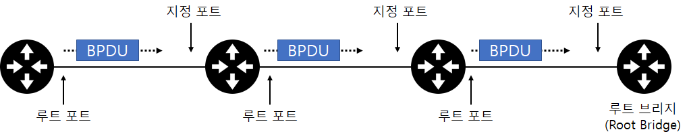

# 4강 스위치 : 2계층장비

이전 간단히 설명한 것처럼 네트워크의 가장 핵심장비인 스위치는 2계층 주소인 MAC 주소를 기반으로 동작합니다. 스위치가 MAC 주소를 기반으로 동작하는 기본적인 내용에서 보다 깊게 들어가 스위치가 MAC 주소를 어떻게 이해하고 활용하는 지 알아보자


스위치는 네트워크 중간에서 패킷을 받아 필요한 곳에만 보내주는 네트워크 중재자 역할을 합니다. 스위치는 아무 설정 없이 네트워크에 연결해도 MAC 주소를 기반으로 패킷을 전달하는 기본 동작을 수행할 수 있습니다.

스위치는 MAC 주소를 인식하고 패킷을 전달하는 스위치의 기본 동작외에도 한 대의 장비에서 논리적으로 네트워크를 분리할 수 있는 VLAN 기능과 네트워크의 루프를 방지하는 스패닝 트리프로토콜(STP)과 같은 기능을 기본적으로 가지고 있습니다.

그밖에 다양한 보안 기능과 모니터링에 필요한 여러 기능이 있지만 이 책에서는 패킷 처리를 위한 스위치의 필수 기능에 대해서만 다룹니다.

```
특징

1. 스위치는 네트워크 중간에서 패킷을 받아 필요한 곳에만 보내주는 네트워크의 중재자 역할을 한다.
2. 아무 설정 없이 네트워크에 연결해도 MAC 주소를 기반으로 패킷을 전달하는 기본 동작 수행이 가능하다.
3. 논리적으로 네트워크를 분리할 수 있는 VLAN기능을 제공한다.
4. 네트워크의 루프를 방지하는 스패닝 트리 프로토콜(STP)과 같은 기능을 가지고 있다.
```

```
참고 - 패킷은 무엇이고 프레임은 무엇인가

각 계층에서 헤더와 데이터를 합친 부분을 PDU(Protocol Data Unit)라고 부릅니다. 각 꼐층마다 이 PDU를 부르는 이름이 달라서 1계층 DPU는 비트(Bits) , 2계층 PDU는 프레임(Frame) , 3계층은 패킷(Packet) , 4계층은 세그먼트(Segment)라고 부르고 애플리케이션에 해당하는 3개 계층(애플리케이션 , 프레젠테이션 , 세션)은 데이터(Data)라고 부릅니다.

1계층: 비트(Bits)
3계층: 패킷(Packet)
2계층: 프레임(Frame)
4계층: 세그먼트(Segment)
그밖에 애플리케이션에 속하는 3개 계층(5,6,7)은 데이터(Data)라 부른다.
```

## 스위치 장비 동작

스위치는 네트워크에서 통신을 중재하는 장비입니다. 스위치가 없던 오래된 이더넷 네트워크에서는 패킷을 전송할 때 서로 경합해 그로 인한 네트워크 성능 저하가 컸습니다.

이런 경쟁을 없애고 패킷을 동시에 여러 장비가 서로 간섭없이 통신하도록 도와주는 장비가 스위치입니다. 스위치를 사용하면 여러 단말이 한꺼번에 통신할 수 있어 통신하기 위해 기다리거나 충돌때문에 대기하는 문제가 해결되고 네트워크 전체의 통신 효율성이 향상됩니다.

스위치의 핵심 역할은 누가 어느 위치에 있는지 파악하고 실제 통신이 시작되면 자신이 알고 있는 위치로 패킷을 정확히 전송하는 것입니다. 이런 동작은 스위치가 2계층 주소를 이해하고 단말의 주소인 MAC 주소와 단말이 위치하는 인터페이스 정보를 매핑한 MAC 주소 테이블을 갖고 있어서 가능합니다.


```
MAC 주소와 스위치의 인터페이스 정보가 매핑된 MAC 주소 테이블
```

스위치는 전송하려는 패킷의 헤더 안에 있는 2계층 목적지 주소를 확인하고 MAC 주소 테이블에서 해당 주소가 어느 포트에 있는지 확인해 해당 패킷을 그 포트로만 전송합니다.

이런 역할을 수행하기 위해 스위치는 MAC 주소와 포트가 매핑된 MAC 주소 테이블이 필요합니다. 만약 테이블에 없는 도착지 주소를 가진 패킷이 스위치로 들어오면 스위치는 전체 포트로 패킷을 전송합니다. 패킷의 도착지 주소가 테이블에 있으면 해당 주소가 매핑된 포트로만 패킷을 전송하고 다른 포트로는 전송하지 않습니다. 스위치의 이런 동작 방식을 다음 3가지로 정리할 수 있습니다.

```
1. 플러딩 (Floading)
2. 어드레스 러닝 (Address Learning)
3. 포워딩/필터링 (Forwading / Filtering)
```

이 3가지 스위치 동작 방식을 좀 더 알아보겠습니다.

### 1. 플러딩 (Floading)

```
스위치가 허브와 같이 모든 포트로 패킷을 흘리는 동작 방식을 플러딩이라고 합니다.
```

스위치는 부팅하면 네트워크 관련 정보가 아무것도 없습니다. 이때 스위치는 네트워크 통신을 중재하는 자신의 역할을 하지 못하고 허브처럼 동작합니다. 허브는 패킷이 들어온 포트를 제외하고 모든 포트로 패킷을 전달합니다. 스위치가 허브와 같이 모든 포트로 패킷을 흘리는 동작 방식을 플러딩이라고 합니다.


```
부팅 후 스위치, MAC 주소 관련 정보가 아무 것도 없다.
```

스위치는 패킷이 들어오면 도착지 MAC 주소를 확인하고 자신이 갖고 있는 MAC 주소 테이블에서 해당 MAC 주소가 있는지 확인합니다. MAC 주소 테이블에 매칭되는 목적지 MAC 주소 정보가 없으면 모든 포트에 같은 내용의 패킷을 전송합니다. 스위치는 LAN 에서 동작하므로 자신이 정보를 갖고 있지 않더라도 어딘가에 장비가 있을 수 있다고 가정하고 이와 같은 작업을 수행합니다.


```
MAC 주소 테이블에 아무 정보도 없는 경우, 패킷을 모든 포트로 보낸다(Floading)
```

이런 플러딩 동작은 스위치의 정상적인 동작이지만 이런 동작이 많아지면 스위치가 제 역할을 못하게 됩니다. 패킷이 스위치에 들어오면 해당 패킷 정보의 MAC 주소를 보고 이를 학습해 MAC 주소 테이블을 만든 후 이를 통해 패킷을 전송합니다.

### 2. 어드레스 러닝 (Address Learning)

```
MAC 주소 테이블을 만들고 유지하는 과정을 어드레스 러닝이라 한다.
```

스위치가 패킷의 도착지 MAC 주소를 확인하여 원하는 포트로 포워딩하는 스위치의 동작을 정상적으로 수행하려면 MAC 주소 테이블을 만들고 유지해야 합니다. MAC 주소 테이블은 어느 위치(포트)에 어떤 장비(MAC 주소)가 연결되었는지에 대한 정보가 저장되어 있는 임시 테이블입니다.
이런 MAC 주소 테이블을 만들고 유지하는 과정은 어드레스 러닝 이라고 합니다.

어드레스 러닝은 패킷의 출발지 MAC 주소 정보를 이용합니다. 패킷이 특정 포트에 들어오면 스위치에는 해당 패킷의 출발지 MAC 주소와 포트 번호를 MAC 주소 테이블에 기록합니다. 1번 포트에서 들어온 패킷의 출발지 MAC 주소가 AAAA 라면 1번 포트에 AAAA MAC 주소를 가진 장비가 연결되어 있다고 추론할 수 있어 이런 방법으로 주소 정보를 습득합니다.

어드레스 러닝은 출발지의 MAC 주소 정보를 사용하므로 브로드캐스트나 멀티캐스트에 대한 MAC 주소를 학습할 수 없습니다. 두 가지 모두 목적지 MAC 주소 필드에서만 사용하기 때문입니다.


```
어드레스 러닝 작업, 출발지 MAC 주소와 들어온 포트 정보를 MAC 주소 테이블에 저장한다.
```

```
참고 - 사전 정의된 MAC 주소 테이블

스위치는 MAC 어드레스 러닝 작업으로 주변 장비의 MAC 주소를 학습하는 것 외에도 사전 미리 정의된 MAC 주소 정보를 가지고 있습니다.
이런 사전 정의된 주소는 패킷을 처리하기 위한 주소가 아니라 대부분 스위치 간 통신을 위해 사용되는 주소입니다.
이런 종류의 주소도 MAC 주소 테이블에서 정보를 확인할 수 있는데 스위치에서 자체 처리되는 주소는 특정 포트로 내보내는 것이 아니라
스위치에서 자체 처리하므로 인접 포트 정보가 없거나 CPU 혹은 관리 모듈을 지칭하는 용어로 표기됩니다.

스위치에서 MAC 주소 테이블을 보기 위해 show mac address-table 명령어를 사용합니다.
```

### 3. 포워딩/필터링(Forwarding , Filtering)

```
포워딩(Forwarding): 패킷이 스위치에 들어왔을 때 도착지 MAC 주소를 확인 후 MAC 테이블과 비교해 맞는 정보가 있으면 해당 포트로 패킷을 넘겨주는 것.
필터링(Filtering): 포워딩 도중 다른 포트로는 해당 패킷을 보내지 않는 것.
```

스위치의 동작은 매우 간단합니다. 패킷이 스위치에 들어온 경우 도착지 MAC 주소를 확인하고 자신이 가진 MAC 테이블과 비교해 맞는 정보가 있으면 매치되는 해당 포트로 패킷을 포워딩 합니다. 이때 다른 포트로는 해당 패킷을 보내지 않으므로 이 동작을 필터링이라고 합니다. 스위치는 이런 포워딩과 필터링을 통해 목적지로만 패킷이 전달되도록 동작합니다. 스위치에서는 포워딩과 필터링 작업이 여러 포트에서 동시에 수행될 수 있습니다. 통신이 다른 포트에 영향을 미치지 않으므로 다른 포트에서 기존 통신작업으로부터 독립적으로 동작할 수 있습니다.


스위치는 일반적인 유니캐스트에 대해서만 포워딩과 필터링 작업을 수행합니다. BUM 트래픽이라고 부르는 브로드캐스트와 언노운 유니캐스트, 멀티캐스트는 조금 다르게 동작합니다. 어드레스 러닝 과정에 대해 앞에서 알아보았듯이 출발지 MAC 주소로 브로드캐스트나 멀티캐스트 모두 출발지가 사용되지 않으므로 이런 트래픽은 전달이나 필터링 작업을 하지않고 모두 플러딩합니다.

언노운 유니캐스트도 MAC 주소 테이블에 없는 주소이므로 브로드캐스트와 동일하게 플러딩 동작합니다.

```
참고 - LAN에서의 ARP - 스위치 동작

이더넷 - TCP/IP 네트워크에서는 스위치가 유니캐스트를 플러딩하는 경우는 거의 없습니다.
패킷을 만들기 전에 통신해야 하는 단말의 MAC 주소를 알아내기 위해 ARP 브로드캐스트가 먼저 수행되어야 하므로 유니캐스트보다 ARP 브로드캐스트가 먼저 네트워크에 전달됩니다.
이 ARP를 이용한 MAC 주소 습득 과정에서 이미 스위치는 통신하는 출발지와 목적지의 MAC 주소를 습득할 수 있고, 실제 유니캐스트 통신이 시작되면 이미 만들어진 MAC 주소 테이블로
패킷을 포워딩, 필터링 합니다.

ARP 와 MAC 테이블은 일정시간동안 지워지지 않는데 이 시간을 에이징 타임(Aging Time)이라고 합니다.
일반적으로 MAC 테이블의 에이징 타임의 단말의 ARP 에이징 타임보다 길어 이더넷 네트워크를 플러딩벗이 효율적으로 운영할 수 있습니다.
```

## VLAN

서버, 스토리지 할 것없이 지난 20년 간 가상화는 많은 비중을 차지했다. 네트워크에서도 다양한 가상화 기술이 쓰이는데 스위치에서는 오래 전부터 VLAN 이라는 가상화 기술을 사용해왔습니다. 하나의 물리 스위치에서 여러 개의 네트워크를 나누어 사용할 수 있는 VLAN(Virtual Local Area Network)에 어떤 종류가 있고 특징이 무엇인지, 실제로 어떻게 동작하는 지 알아보겠습니다.

### 1. VLAN 이란?

VLAN 은 물리적 배치와 상관없이 LAN 을 논리적으로 분할, 구성하는 기술입니다. 기업과 같이 여러 부서가 함께 근무하면서 각 부서별로 네트워크를 분할할 때는 네트워크를 여러개 운영해야 합니다.

최근에는 전화기, 복합기 , 스마트폰과 같이 PC 외에도 다수의 단말이 네트워크에 연결되므로 네트워크 분할이 더 중요합니다.
과도한 브로드캐스트로 인한 단말들의 성능 저하, 보안 향상을 위한 차단 용도, 서비스 성격에 따른 정책 적용과 같은 이유로 네트워크가 분리되어야 합니다.


```
한 대의 스위치를 여러 개의 VLAN 으로 분할 할 수 있다. 별도의 스위치 처럼 동작한다.
```

VLAN을 나누면 하나의 장비를 서로 다른 네트워크를 갖도록 논리적으로 분할한 것이므로 유니캐스트 뿐만아니라 브로드 캐스트도 VLAN 간에 통신을 할 수 없습니다. VLAN 간의 통신이 필요하다면 서로 다른 네트워크 간의 통신이므로 앞에서 배운 것 처럼 3계층 장비가 필요합니다.


```
서로 다른 VLAN 간의 통신이 필요한 경우 L3 장비의 도움이 필요하다.
```

VLAN 을 사용하면 물리적 구성과 상관없이 네트워크를 분리할 수 있고 물리적으로 다른 층에 있는 단말이 하나의 VLAN을 사용해 동일한 네트워크로 묶을 수 있습니다. 같은 층에서 부서별로 네트워크를 분리하거나 일반 PC, IP 전화기, 무선 단말과 같이 서비스나 단말의 성격에 따라 네트워크를 분리할 수 있습니다. 그리고 이렇게 분리된 단말 간에는 3계층 장비를 통해 통신하게 됩니다.


### 2. VLAN 의 종류와 특징

#### 포트 기반

```
현재 대부분의 VLAN이 이 포트 기반 VLAN을 말하며 어떤 단말이 접속하던 스위치의 특정 포트에 VLAN을 할당하면 할당된 VLAN에 속하게 된다.
```

VLAN 할당 방식에는 포트 기반의 VLAN 과 MAC 주소 기반의 VLAN 이 있습니다. VLAN 개념이 처음 도입되었을때는 스위치가 고가였고 여러 허브를 묶는 역할을 스위치가 담당했으므로 스위치를 분할해 여러 네트워크에 사용하는 것이 VLAN 기능을 적용하는 목적이었습니다.

이렇게 스위치를 논리적으로 분할해 사용하는 것이 목적인 VLAN 을 포트 기반 VLAN(Port Based VLAN)이 라고 부르고 우리가 일반적으로 언급하는 대부분의 VLAN 은 포트 기반 VLAN 입니다. 어떤 단말이 접속하든지 스위치의 특정 포트에 VLAN 을 할당하면 할당된 VLAN에 속하게 됩니다.

#### MAC 주소 기반

```
스위치의 고정 포트에 VLAN을 할당하는게 아니라 스위치에 연결되는 단말의 MAC주소를 기반으로 VLAN을 할당한다.
단말에 따라 VLAN정보가 바뀔수 있기에 다이나믹 VLAN(Dynamic VLAN)이라고도 한다.
```

사용자들의 자리 이동이 많아지면서 MAC 기반 VLAN(Mac Based VLAN)이 개발되었습니다. 스위치의 고정 포트에 VLAN 을 할당하는 것이 아니라 스위치에 연결되는 단말의 MAC 주소를 기반으로 VLAN을 할당하는 기술입니다. 단말이 연결되면 단말의 MAC 주솔르 인식한 스위치가 해당 포트를 지정된 VLAN 으로 변경합니다. 단말에 따라 VLAN 정보가 바뀔 수 있어 다이나믹 VLAN(Dynamic VLAN)이라고도 부릅니다.


포트 기반 VLAN 으로 설정된 스위치에서 VLAN 선정 기준은 스위치의 포트입니다. AA PC가 1번 포트에 연결하면 VLAN 10에 속하고 4번 포트에 연결하면 VLAN 20에 속합니다.

반면, MAC 기반 VLAN 에서는 VLAN을 할당하는 기준이 PC의 MAC 주소입니다. AA PC는 어떤 스위치의 어떤 포트에 접속하더라도 동일한 VLAN 10이 할당됩니다.

```
MAC 기반 VLAN을 사용하면 유선 사용자가 이동하더라도 같은 VLAN에 할당된다.
```

```
참고 - 추세

데이터 센터에서 스위치 VLAN은 포트 기반 VLAN으로 구성하는게 일반적이지만, 최근 사용자의 이동성을 요구하는 최근 스마트 오피스들의 요구로 MAC 기반 VLAN 구성이 점차 증가하는 추세다.
하지만, 아직은 포트기반 VLAN으로 내용을 다루겠다.
```

### 3. VLAN 모드(Trunk / Access) 동작 방식

포트 기반 VLAN 에서는 스위치의 각 포트에 각각 사용할 VLAN을 설정하는 데 한 대의 스위치에 연결되더라도 서로 다른 VLAN이 설정된 포트 간에는 통신할 수 없습니다. VLAN 이 다르면 별도의 분리된 스위치에 연결된 것과 같으므로 VLAN간 통신이 불가능 합니다. 서로 다른 VLAN 간 통신을 위해서는 3계층 장비를 사용해야 합니다.

VLAN으로 구분된 네트워크에서는 브로드캐스트인 ARP 리퀘스트가 다른 VLAN으로 전달될 수 없으므로 3계층 장비를 이용해 통신해야 합니다.


```
한 대의 스위치에서도 서로 다른 VLAN 간에는 통신할 수 없다.
```

스위치 포트에 VLAN 을 설정하여 네트워크를 분리하면 물리적으로도 스위치를 분리할 때보다 효율적으로 장비를 사용할 수 있습니다.

여러 개의 VLAN 이 존재하는 상황에서 스위치를 서로 연결해야 하는 경우에는 각 VLAN 끼리 통신하려면 VLAN 개수만큼 포트를 연결해야 합니다. VLAN으로 분할된 스위치는 물리적인 별도의 스위치처럼 취급됩니다.


```
태그 기능이 없는 VLAN 네트워크(Trunk)

네모 칸처럼 스위치 간에 통신을 위한 포트가 필요하다.
```

예를 들어 위 그림같이 스위치 3개의 VLAN이 구성되어 있는 경우, 각 VLAN이 스위치 간에 통신하려면 3개의 포트가 필요합니다. VLAN을 더 많이 사용하는 중 대형 네트워크에서는 이렇게 VLAN 별로 포트를 연결하면 장비간의 연결만으로도 많은 포트가 낭비됩니다.


```
Tagged Port : 스위치 간 통신을 위한 포트
태그 포트(Tagged Port)를 이용한 스위치 간 연결, 한 개의 포트로 여러 VLAN 통신이 가능하다
```

#### VLAN 태그 기능

위 문제를 해결하기 위한 것이 VLAN 태그 기능입니다. 태그 기능은 하나의 포트에 여러 개의 VLAN을 함께 전송할 수 있게 해줍니다. 이 포트를 태그(Tagged) 포트 또는 트렁크(Trunk) 포트라고 합니다.

여러 개의 VLAN을 동시에 전송해야 하는 태그 포트는 통신할 때 이더넷 프레임 중간에 VLAN ID 필드를 끼워 넣어 이 정보를 이용합니다. 태그 포트로 패킷을 보낼 때는 VLAN IP 를 붙이고 수신 츠겡서는 이 VLAN ID 를 제거하면서 VLAN ID의 VLAN으로 패킷을 보낼 수 있게 됩니다.

```
참고

스위치 간 VLAN 정보를 보낼 수 있는 포트의 일반적인 용어는 '태그 포트'입니다.
트렁크 포트는 시스코에서 사용하는 명칭으로, 트렁크라는 용어를 다른 네트워크 장비 제조사에서는 다른 의미로 사용하므로 문맥으로 이것을 잘 파악해야 합니다.
타 제조사에서는 트렁크 포트를 여러 개의 포트를 묶어 사용하기 위한 링크 에그리게이션의 의미로 사용합니다.
```


```
일반 이더넷 프레임과 태그 프레임의 차이 비교
```

태그 포트를 사용하면 VLAN 마다 통신하기 위해 필요했던 여러 개의 포트를 하나로 묶어 사용할 수 있으므로 포트 낭비 없이 네트워크를 더 유연하게 디자인할 수 있습니다. 이런 태그 포트 기능이 스위치에 생기면서 스위치의 패킷 전송에 사용하는 MAC 주소 테이블에도 변화가 생깁니다.

다른 VLAN 끼리 통신하지 못하도록 MAC 테이블에 VLAN을 지정하는 필드가 추가된 것입니다.

즉, 하나의 스위치에서 VLAN을 이용해 네트워크를 분리하면 VLAN 별로 MAC 주소 테이블이 존재하는 것처럼 동작합니다.

#### VLAN 이 있는 상태에서 스위치의 MAC 테이블

```
Switch# show mac address-table
```

일반적인 포트를 언태그(Untagged) 포트 또는 액세스(Access) 포트라고 하고 VLAN 정보를 넘겨 여러 VLAN이 한꺼번에 통신하도록 해주는 포트를 태그 포트 또는 트렁크 포트라고 부릅니다.
태그 포트는 여러 개의 VLAN, 즉 여러 네트워크를 하나의 물리적인 포트로 전달하는 데 사용되고 언태그 포트는 하나의 VLAN에 속한 경우에만 사용됩니다.

그래서 일반적으로 태그 포트는 여러 네트워크가 동시에 설정된 스위치 간의 연결에서 사용되며 하나의 네트워크에 속한 서버의 경우에는 언태그로 설정합니다.

```
태그 포트: 여러 네트워크를 하나의 물리적인 포트로 전달하는데 사용
언태그 포트: 하나의 VLAN에 속한 경우에만 사용
```

언태그 포트로 패킷이 들어올 경우 같은 VLAN으로만 패킷을 전송합니다. <br/>
태그 포트로 패킷이 들어올 경우 태그를 벗겨내면서 태그된 VLAN 쪽으로 패킷을 전송합니다.

스위치 간의 연결이 아닌 서버와 연결된 포트도 VMware 의 ESXi와 같은 가상화 서버가 연결될 때는 여러 VLAN과 통신해야 할 수도 있습니다. 이 경우, 서버와 연결된 스위치의 포트더라도 언태그 포드가 아닌 태그로 설정합니다.

물론 태그된(Tagged) 상태이므로 가상화 서버쪽 인터페이스에서도 태그된(Tagged) 상태로 설정해야 합니다. 가상화 서버 내부에 가상 스위치가 존재하므로 스위치 간 연결로 보면 이해하기 더 쉽습니다.


```
참고 - VLAN 간 통신

VLAN은 스위치 통신을 분할하는 기능 때문에 유니캐스트,멀티캐스트, 브로드캐스트 모두 VLAN을 넘어가지 못합니다.
일반적으로 VLAN 이 다르다는 것은 별도의 네트워크로 분할한 것이므로 네트워크가 다르고 IP 주소 할당도 다른 네트워크로 할당되는 것이 일반적입니다.

다른 네트워크끼리 통신이 필요하다면 라우터와 같은 L3 장비의 도움이 필요합니다.
```

```
정리
지금까지 말한 내용들을 정리해보면 다음과 같다.

1. VLAN은 물리적으로 상관없이 논리적으로 네트워크를 분리하는 기술이다.
2. VLAN간의 통신은 별도의 스위치로 취급하기에 L3 라우터 장비가 있어야 한다.
3. VLAN을 이용해 다른 층에 있는 장비들을 하나의 VLAN으로 묶을 수 있다(유사 AOP)
4. VLAN 의 종류는 포트 기반, MAC 주소 기반 두가지이며 포트 기반이 많이 쓰인다.
5. VLAN 태그 기능을 이용해 하나의 태그 포트(Tagged Port)로 여러 VLAN으로 전송이 가능하다.
6. VLAN 태그 기능을 사용하기 위해 일반 이더넷 프레임 중간에 VLAN ID를 끼워넣어 전송한다.
⇒ 태그포트로 패킷이 들어오면 태그를 벗겨내며 태그된 VLAN으로 패킷을 전송한다.
7. MAC 테이블에 VLAN을 지정하는 필드가 추가된다.
```

## STP

IT 환경에서는 SPoF(Single Point of Failure : 단일 장애점)로 인한 장애를 피하기 위한 다양한 노력을 합니다. SPoF 란 하나의 시스템이나 구성 요소에서 고장이 발생했을 때 전체 시스템의 작동이 멈추는 요소를 말합니다. 네트워크에서도 하나의 장비 고장으로 전체 네트워크가 마비되는 것을 막기 위해 이중화, 다중화된 네트워크를 디자인하고 구성합니다.

네트워크를 스위치 하나로 구성했을 때 그 스위치에 장애가 발생하면 전체 네트워크에 장애가 발생할 것 입니다.


```
SPoF, 하나의 장비나 구성요소 때문에 전체 네트워크에 장애가 발생하는 경우
```

##### 스위치를 두 대 이상으로 네트워크를 디자인하면 되지 않을까?

이런 SPoF를 피하기 위해 스위치 두 대로 네트워크를 디자인 하지만 두 대 이상의 스위치로 디자인 하면 패킷이 네트워크를 따라 계속 전송되므로 네트워크를 마비시킬 수 있습니다. 이런 상황을 네트워크 루프라고 합니다.

루프를 예방하려면 별도의 매커니즘이 필요합니다. 이번장에서는 루프가 무엇이고 스위치에서 루프를 예방하기 위한 프로토콜은 어떻게 동작하는지 알아보겠습니다.

### 1. 루프란?

루프(Loop)는 말 그대로 네트워크에 연결된 모양이 고리처럼 되돌아오는 형태로 구성된 상황을 말합니다. 이런 상황을 명확히 인지하는 경우는 드물지만 루프 상황이 발생했을 때는 네트워크가 마비되고 통신이 안되는 상황이 발생합니다. 3가지 큰 이유가 있지만 루프로 문제가 발생했다면 대부분 브로드캐스트 스톰(Storm)으로 인한 문제입니다.

#### 브로드캐스트 스톰

루프 구조로 네트워크가 연결된 상태에서 단말에서 브로드 캐스트를 발생시키면 스위치는 이 패킷을 패킷이 유입된 포트를 제외한 모든 포트로 플러딩합니다. 플러딩된 패킷을 다른 스위치로도 보내지고 이 패킷을 받은 스위치는 패킷이 유입된 포트를 제외한 모든 포트로 다시 플러딩합니다.

루프 구조 상태에서는 이 패킷이 계속 돌아가는데 이것을 브로드캐스트 스톰이라고 합니다. 3계층 헤더에는 TTL(Time to Live)이라는 패킷 수명을 갖고 있지만 스위치가 확인하는 2계층 헤더에는 이런 3계층의 TTL과 같은 라이프타임 메커니즘이 없어 루프가 발생하면 패킷이 죽지않고 계속 살아남아 패킷 하나가 전체 네트워크 대역폭을 차지할 수 있습니다. 이런 브로드캐스트 스톰은 네트워크의 전체 대역폭을 차지하고 네트워크에 연결된 모든 단말이 브로드캐스트를 처리하기 위해 시스템 리소스를 사용함녀서 스위치와 네트워크에 연결된 단말 간 통신이 거의 불가능한 상태가 됩니다.


이런 브로드캐스트 스톰 상황이 발생하면

```
1. 네트워크에 접속된 단말의 속도가 느려집니다.(많은 브로드캐스트를 처리해야 하므로 CPU 사용률이 높아진다.)
2. 네트워크 접속 속도가 느려집니다. (거의 통신 불능상태)
3. 네트워크에 설치된 스위치에 모든 LED들이 동시에 빠른속도로 깜빡입니다
```

루프가 만들어진 상황에서는 케이블을 제거하기 전까지 네트워크가 마비된 것 같은 상태가 지속됩니다.

#### 스위치 MAC 러닝 중복 문제

루프 구조 상태에서는 브로드캐스트뿐만 아니라 유니캐스트도 문제를 일으킵니다. 같은 패킷이 루프를 돌아 도착지 쪽에서 중복 수신되는 혼란을 일으키기도 하지만 중간에 있는 스위치에서도 MAC 러닝 문제가 발생합니다.

스위치는 출발지 MAC 주소를 학습하는데 직접 전달되는 패킷과 스위치를 돌아 들어간 패킷 간의 포트가 달라 MAC 주소를 정상적으로 학습할 수 없습니다. 스위치 MAC 주소 테이블에서는 하나의 MAC 주소에 대해 하나의 포트만 학습할 수 있으므로 동일한 MAC 주소가 여러 포트에서 학습되면 MAC 테이블이 반복 갱신되어 정상적으로 동작하지 않습니다.

이 현상을 MAC 어드레스 플래핑(MAC Address Flapping) 이라고 부릅니다.


예를 들어 위 그림을 보면 AA 에서 출발한 패킷이 스위치 C에서 A와 B스위치에 전달하고 이 패킷을 받은 스위치 A는 이 퍀싱르 다시 포워딩해 스위치 B로 전달합니다. 결과적으로 스위치 B는 동일한 출발지 AA를 가진 패킷이 스위치 C를 통해 eth1로, 스위치 A를 통해 eth2로 전달됩니다.

스위치 B에서는 eth1 포트와 eth2 포트에서 AA 주소를 반복적으로 습득해 MAC 어드레스 플래핑현상이 발생합니다.

이런 현상이 발생하면 스위치에서 학습된 주소의 포트가 계속 변경되므로 스위치가 정상적으로 동작하지 못하고 패킷을 플러딩합니다. 이런 현상을 예방하기 위해 스위치 설정에 따라 경고(Warning) 메시지를 관리자에게 알려주거나 수시로 일어나는 플래핑 현상을 학습하지 않도록 자동으로 조치합니다.

네트워크에 루프가 발생할 경우, 앞의 문제들 때문에 네트워크가 정상저그올 동작하지 않으므로 루프가 생기지 않도록 미리 네트워크에 조치를 해야 합니다. 루프 구성 포트 중 하나의 포트만 사용하지 못하도록 셧다운(Shutdown)되어 있어도 루프를 예발할 수 있습니다.

하지만 네트워크의 SPoF를 예방하기 위해 스위치를 두 개 이상 디자인했는데 다시 수동으로 루프를 찾아 강제로 사용하지 못하게 하는 방법은 바람직 하지 않습니다.

먼저 네트워크에서 복잡한 케이블 연결을 이용해 루프를 찾아내는 것도 힘듭니다. 찾아내 강제로 포트를 사용하지 못하게 하더라도 네트워크에 장애가 발생하면 해당 포트를 수동으로 다시 사용하도록 해야 합니다. 사용자가 이렇게 적극적으로 개입하는 방법으로는 네트워크 장애에 적절히 대응할 수 없습니다. 이런 이유로 루프를 자동 감지해 포트를 차단하고 장애 때문에 우회로가 없을 때 차단된 포트를 스위치 스스로 다시 풀어주는 스패닝 트리 프로토콜이 개발되었습니다.


```
스패닝 트리 프로토콜은 장애가 발생하면 차단된 포트를 자동으로 복구한다.
```

### 2. STP (Spanning Tree Protocol) 란?

스패닝 트리 프로토콜 (Spanning Tree Protocol) 은 루프를 확인하고 적절히 포트를 사용하지 못하게 만들어 루프를 예방하는 매커니즘입니다. 용어 그대로 잘 뻗은 나무처럼 뿌리부터 가지까지 루프가 생기지 않도록 유지하는 것이 스패닝 트리 프로토콜의 목적입니다.

스패닝 트리 프로토콜을 이용해 루프를 예방하려면 전체 스위치가 어떻게 연결되는지 알아야합니다. 전체적인 스위치 연결 상황을 파악하려면 스위치 간에 정보를 전달하는 방법이 필요합니다. 이를 위해 스위치는 BPDU(Bridge Protocol Data Unit) 라는 프로토콜을 통해 스위치 간에 정보를 전달하고 이렇게 수집된 정보를 이용해 전체 네트워크 트리를 만들어 루프 구간을 확인합니다.


```
BPDU(Bridge Protocol Data Unit) 프로토콜 헤더와 Bridge ID 정보
```

##### Protocol Identifier : Always 0x0000

예전 L2 기술에서 사용할 수 있는 공통적인 프로토콜을 정의하려 할 때 나온게 BPDU다. 그리고 이 때 STP에서 BPDU를 쓰기로 하고 Protocol ID 0x0000을 가져가게 된다. (현재까지 STP외에 사용하는 곳이 없어 다른 아이디가 존재하지 않는다.)

##### Protocol Version


STP가 하나만 있는게아니라 발전하면서 새로운 표준들이 나오게되는데 이를 구분하기 위한 필드다. 최초의 STP뿐아니라 RSTP, MST까지 나오면서 이를 구분한다. 3.

##### BPDU Type


BPDU Type은 크게 2가지가 있다. Configuration BPDU(이하 Config BPDU)라는 루트만이 만들어서 2초마다 전송할 수 있는 BPDU가 있고, TCN(Topology Change Notification) BPDU라고 내 (fwd 상태인) 인터페이스 중에서 다운되거나 문제가 발생하면 Topology Change를 다른 모든 곳에 알려주기 위해서 Spanning Tree를 다시 계산해야 하기에 보내는 BPDU가 있다.

But, RSTP가 나오면서 TCN BPDU에 문제가 있다는 점을 알게되면서, TCN 역할도 Config BPDU로 보내면 되지 않겠나해서? Config BPDU에 보내게 되며 이는 0x02 라는 value를 사용하게 된다.

정리하면
일반 STP는 Config BPDU, TCN BPDU가 있다. <br/>
개선된 RSTP부터는 Config BPDU(0x02)만 사용한다.

##### Flags


이 BPDU가 어떤 역할을 하는 BPDU인지와 현재 스위치의 상태를 알려주기위한 정보를 담고있는 필드이다. 0번(Topology Change Ack)과 7번(Topology Change)는 BPDU Type의 TCN BPDU와는 다르다.

##### Root Bridge ID

##### Root Path Cost

##### Sending Bridge ID

##### Sending Port ID

##### Message Age

BPDU가 만들어지고 얼마나 시간이 지났는가에 대한 정보

##### Max Age

BPDU의 수명으로 최대 얼만큼 살아남을 수 있는지에 대한 정보
(default 20초)

##### Hello Time

Config BPDU를 보내는 주기를 정하는 정보(default 2초) 12.

##### Forwarding Delay

스위치 포트의 상태가 다음 단계로 넘어갈 때 그 시간을 지정하는 정보(default 15초)

BPDU에는 스위치가 갖고 있는 ID와 같은 고유값이 들어가고 이런 정보들이 스위치 간에 서로 교환되면서 루프 파악이 가능해집니다. 이렇게 확인된 루프 지점을 데이터 트래픽이 통과하지 못하도록 차단해 루프를 예방합니다.

#### 스위치 포트의 상태 및 변경 과정

스패닝 트리 프로토콜이 동작 중인 스위치에서는 루프를 막기 윛해 스위치 포트에 신규 스위치가 연결되면 바로 트래픽이 흐르지 않도록 차단합니다. 그리고 해당 포트로 트래픽이 흘러도 되는지 확인하기 위해 BPDU를 기다려 학습하고 구조를 파악한 후 트래픽을 흘리거나 루프 구조인 경우, 차단 상태를 유지합니다. 차단 상태에서 트래픽이 흐를 때까지 스위치 포트의 상태는 다음 4자기로 구분할 수 있습니다.

##### Blocking

1. 패킷 데이터를 차단한 상태로 상대방이 보내는 BPDU를 기다립니다.
2. 총 20초인 Max Age 기간 동안 상대방 스위치에서 BPDU를 받지 못했거나 후수누이 BPDU를 받았을 때 포트는 리스닝 상태로 변경됩니다.
3. BPDU 기본 교환 주기는 2초이고 10번의 BPDU를 기다립니다.

##### Listening

1. 리스닝 상태는 해당 포트가 전송 상태로 변경되는 것을 결정하고 준비하는 단계입니다. 이 상태부터 자신의 BPDU 정보를 상대방에게 정송하기 시작합니다.
2. 총 15초 동안 대기합니다.

##### Learning

1. 러닝 상태는 이미 해당 포트를 포워딩하기로 결정하고 실제로 패킷 포워딩이 일어날때 스위치가 곧바로 동작하도록 MAC주소를 러닝하는 단계입니ㅏㄷ.
2. 총 15초 동안 대기합니다.

##### Forwarding

1. 패킷을 포워딩 하는 단계입니다. 정상적인 통신이 가능합니다.

스위치에 신규로 장비를 붙이면 통신하는데 50여 초가 소요됩니다. 스위치는 루프를 예방하기 위해 매우 방어적으로 동작하는데 새로 연결된 단말이 스위치일 가능성이 있어 BPDU를 일정 시간 이상 기다려 스위치 여부를 파악합니다. 이로 인해 스위치를 연결하는 경우뿐만아니라 일반 단말을 연결하더라도 동일한 시간이 필요합니다.


```
기본 STP 상탭녀화
```

이중화된 링크 절체 전환도 STP의 동작 순서대로 진행됩니다. 특정 링크가 다운되어 블로킹 포트가 포워딩 되기 위해 초기와 마찬가지로 20초 동안 Max Age 를 거쳐 총 50초 후 포워딩 상태로 변경됩니다.

하지만 다운된 링크가 자신의 인터페이스인 경우, 토폴로지가 변했음을 직접 감지할 수 있어 Max Age 를 거치지 않고 리스닝부터 STP 상태 변화가 즉시 이루어지므로 30초 만에 절체됩니다.


```
STP 상태 변화, 스위치
```

STP 가 활성화된 경우, 스위치 포트는 곧바로 포워딩 상태가 되지 않습니다. 이로 인해 다양한 장애가 발생하거나 스위치 이상으로 생각된느 경우가 많습니다. 특히 부팅 시간이 매우 빠른 OS가 DHCP 네트워크에 접속할 때 부팅 단계에서 IP 를 요청하지만 스위치 포트가 포워딩 상태가 되지 않아 IP를 정상적으로 할당받지 못하는 경우가 많습니다.

#### STP 동작방식

STP는 앞에서 설명했듯이 루프를 없애기 위해서 나무가 뿌리에서 가지로 뻗어 나가는 것 처럼 토폴로지를 구성합니다. 네트워크상에서 뿌리가 되는 가장 높은 스위치를 선출하고 그 스위치를 통해 모든 BPDU가 교환되도록 하는데 그 스위치를 루트 스위치라고 합니다. 모든 스위치는 처음에 자신을 루트 스위치로 인식해 동작합니다. BPDU를 통해 2초마다 자신이 루트 스위치임을 광고하는 데 새로운 스위치가 들어오면 서로 교환된 BPDU에 들어 있는 브릿지 ID 값을 비교합니다. 브릿지 ID 값이 더 적은 스위치를 루트 스위치로 선정하고 루트 스위치로 선정된 스위치가 BPDU를 다른 스위치 쪽으로 보냅니다.

스패닝 트리 프로토콜을 루프를 예방하기 위해 다음과 같이 동작합니다.

1. 하나의 루트(Root) 스위치를 선정합니다. <br/>
   A. 전체 네트워크에 하나의 루트 스위치를 선정합니다. <br/>
   B. 자신을 전체 네트워크의 대표 스위치로 적은 BPDU를 옆 스위치로 전달합니다.
2. 루트가 아닌 스위치 중 하나의 루트 포트를 선정합니다. <br/>
   A. 루트 브릿지로 가는 경로가 가장 짧은 포트를 루트 포트라고 합니다. <br/>
   B. 루트 브릿지에서 보낸 BPDU를 받는 포트입니다. <br/>
3. 하나의 세그먼트에 하나의 지정(Designated) 포트를 선정합니다. <br/>
   A. 스위치와 스위치가 연결되는 포트는 하나의 지정 포트(Designated Port) 를 선정합니다. <br/>
   B. 스위치 간의 연결에서 이미 루트 포트로 선정된 경우, 반대쪽이 지정 포트로 선정되어 양쪽 모두 포워딩 상태가 됩니다. <br/>
   C. 스위치 간의 연결에서 아무도 루트 포트가 아닐경우, 한쪽은 지정 포트로 선정되고 다른 한쪽은 대체 포트(Altemate , Non-designated) 가 되어 차단 상태가 됩니다. <br/>
   D. BPDU가 전달되는 포트 입니다. <br/>



```
루트 포트와 지정 포트의 관계. BPDU 가 지정 포트에서 나와 루트 포트로 들어간다.
```

### 3. 향상된 STP(RSTP , MST)

스패닝 트리 프로토콜은 루프를 예방하기 위해 같은 네트워크에 속한 모든 스위치까지 BPDU가 전달되는 시간을 고려합니다. 그러다보니 스패닝 트리 프로토콜 동작 방식에서 본 것 처럼 블로킹 포트가 포워딩 상태로 변경될 때까지 30~50초가 소요됩니다. 통신에서 가장 많이 쓰이는 TCP 기반 애플리케이션이 네트워크가 끊겼을 때 30초를 기다리지 못하다보니 STP 기반 네트워크에 장애가 생기면 통신이 끊길 수 있습니다.

또한 스위치에 여러개의 VLAN이 있으면 각 VLAN 별로스패닝 트리 프로토콜을 계산하면서 부하가 발생하기도 합니다. 이번장에서는 이 문제를 해결하기 위해 향상된 스패닝 트리 프로토콜에 대해 알아보겠습니다.

#### RSTP

스패닝 트리 프로토콜은 이중화된 스위치 경로 중 정상적인 경로에 문제가 발생한 경우, 백업 경로를 활성화하는 데 30~50초가 걸립니다. 이렇게 백업 경로를 활성화하는 데 시간이 너무 오래 걸리는 문제를 해결하기 위해 RSTP(Rapid Spanning Tree Protocol)가 개발되었습니다. RSTP 는 2~3초로 절체 시간이 짧아 일반적인 TCP 기반 애플리케이션이 세션을 유지할 수 있게 됩니다.

기본적인 구성과 동작방식은 STP와 같지만 BPDU 메시지 형식이 다양해져 여러가지 상태 메시지를 교환할 수 있습니다. STP는 일반 토폴로지 변경과 관련된 두 가지 메시지(TCN , TCA , BPDU)만 있지만 RSTP는 8개 비트를 모두 활용해 다양한 정보를 주위 스위치와 주고받을 수 있습니다.


기존 STP에서는 토폴로지가 변경되면 말단 스위치에서 루트 브릿지까지 변경 보고를 보내고 루트 브릿지가 그에 대한 연산을 다시 완료하고 이후 변경된 토폴로지 정보를 말단 스위치까지 보내는 과정을 거쳤습니다.

추가로 이런 정보가 네트워크에 있는 모든 스위치까지 전파되는 예비시간까지 고려해야 하므로 정보를 확정하는 데 시간이 오래 걸렸습니다.


하지만 RSTP에서는 토폴리지 변경이 일어난 스위치 자신이 모든 네트워크에 토폴로지 변경을 직접 전파할 수 있습니다.


RSTP는 다양한 BPDU 메시지, 대체 포트 개념, 토폴로지 변경 전달 방식의 변화로 일반 STP 보다 빠른 시간 내에 토폴로지 변경을 감지, 복구할 수 있습니다. 실제로 RSTP는 불과 2~3초 안에 장애 복구가 가능하므로 장애가 발생해 경로가 절체되더라도 애플리케이션 세션이 끊기지 않아 보다 안정적으로 네트워크를 운영하는 데 도움이 됩니다.

#### MST (Multiple Spanning Tree)

일반 스패닝 트리 프로토콜은 CST(Common Spanning Tree)라고 부릅니다. VLAN 개수와 상관없이 스패닝 트리 한 개만 동작하게 됩니다. 이 경우, VLAN이 많더라도 스패닝 트리는 한 개만 동작하면 되므로 스위치의 관리 부하가 적습니다. 하지만 CST는 루프가 생기는 토폴로지에서 한 개의 포트와 회선만 활성화되므로 자원을 효율적으로 활용할 수 없습니다. 또한 VLAN마다 최적의 경로가 다를 수 있는데 포트 하나만 사용할 수 있다보니 멀리 돌아 통신해야 할 경우도 생깁니다.

이 문제를 해결하기 위해 PVST(Per Vlan Spanning Tree)가 개발되었고 VLAN 마다 다른 스패닝 트리 프로세스가 동작하므로 VLAN 마다 별도의 경로와 트리를 만들 수 있게 되었습니다. 그 덕분에 최적의 경로를 디자인 하고 VLAN 마다 별도의 블록 포트를 지정해 네트워크 로드를 셰어링 하도록 구성할 수 있게 되었습니다.


하지만 스패닝 트리 프로토콜 자체가 스위치에 많은 부담을 주는 프로토콜(2초 마다 교환)인데 PVST는 모든 VLAN 마다 별도의 스패닝 트리를 유지해야 하므로 더 많은 부담이 되었습니다. 이런 CST 와 PVST의 단점을 보완하기 위해 MST(Multiple Spanning Tree)가 개발되었습니다.

MST의 기본적인 아이디어는 매우 단순합니다. 여러 개의 VLAN을 그룹으로 묶고 그 그룹마다 별도의 스패닝 트리가 동작합니다. 이 경우, PVST보다 훨씬 적은 스패닝 트리 프로토콜 프로세스가 돌게 되고 PVST의 장점인 로드 셰어링 기능도 함께 사용할 수 있습니다.

일반적으로 대체 경로의 개수나 용도에 따라 MST의 스패닝 트리 프로토콜 프ㅗ세스 개수를 정의합니다. MST에서는 리전 개념이 도입되어 여러 개의 VLAN을 하나의 리전으로 묶을 수 있습니다.

리전 하나가 스패닝 트리 하나가 됩니다. 예를 들어 11~50 번 VLAN과 101~150번 VLAN이 있다면 11~50번을 하나의 리전으로 101~150번을 하나의 리전으로 묶으면 두 개의 스패닝 트리로 100개의 VLAN을 관리할 수 있습니다.

```
1. 일반적으로 대체 경로의 개수나 용도에 따라 MST의 STP 프로세스 갯수를 정의한다.
2. MST에서는 리전 개념이 도입되어 여러 개의 VLAN을 하나의 리전으로 묶을 수 있다.
3. 리전 하나가 스패닝 트리가 된다.
```

```
참고 - 스패닝 트리 프로토콜의 대안

스패닝 트리 프로토콜은 루프 예방에 필수적인 매커니즘이지만 스위치에 부담이 많은 프로토콜이고 포트가 차단(block)되거나 늦게 포워딩되어 불편한 점이 많습니다.
이런 문제들을 해결하기 위해 PortFast, UplinkFast , BackboneFast 와 같은 다수 기능들이 있지만 잘못 사용하면 장애 발생의 원인이 되기도 합니다.

여러가지 불편한 스패닝 트리 프로토콜을 근본적으로 대체하기 위해 네트워크를 잘게 쪼개 디자인하거나 대체재를 사용하는 경우가 많습니다.
이런 대체재 프로토콜을 대부분 모두 호환되는 것이 아니라 스위치 제작업체에서만 동작하거나 이름은 같아도 동작 방식이 다르거나 호환성이 없는 경우가 많습니다.

1. SLPP (Simple Loop Prevention Protocol)
⇒ Nortel 사가 개발한 루프 예방 프로토콜
⇒ Avaya 사의 인수 이후 Extreme Network 사가 인수함

2. Extreme STP
⇒ Extreme사가 개발한 루프 예방 프로토콜

3. Loop Guard
⇒ STP와 다른 매커니즘으로 루프를 확인

4. BPDU Guard
⇒ BPDU가 인입될 경우, 해당 포트를 차단
```

#### 스위치의 구조와 스위치에 IP 주소가 할당된 이유

스위치는 스위치 관리용 컨트롤 플레인(Control Plane) 패킷을 포워딩 하는 데이터 플레인(Data Plane)으로 크게 나뉩니다. 앞에서 설명한 STP나 스위치 원격관리용 텔넷, SSH , 웹과 같은 서비스는 컨트롤 플레인에서 수행됩니다.

스위치는 2계층에서 동작하는 장비여서 MAC 주소만 이해할 수 있습니다. 스위치가 동작하는 데 IP 는 필요없지만 일정 규모 이상의 네트워크에서 운영되는 스위치는 관리 목적으로 대부분 IP 주소가 할당됩니다.


```
스위치는 컨트롤 플레인과 데이터 플레인으로 나뉜다.
```
