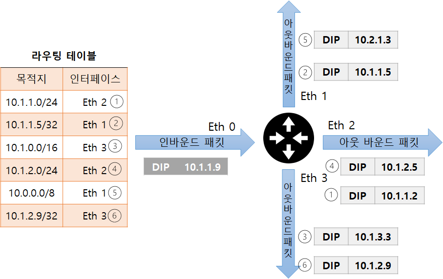
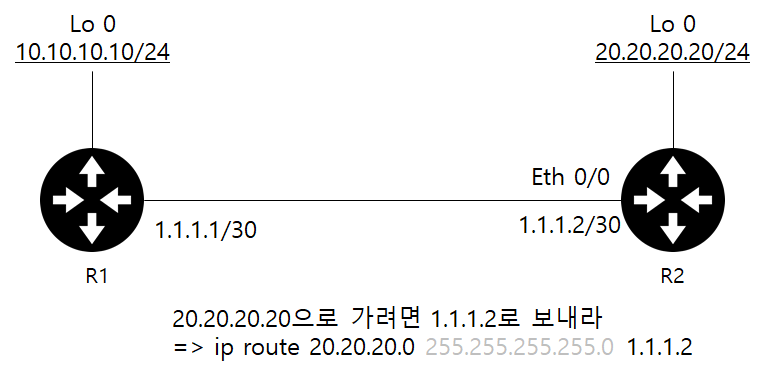

# 5강 라우터/L3 스위치 : 3계층 장비

라우터(Router)는 3계층에서 동작하는 여러 네트워크 장비의 대표격으로 그 이름처럼 경로를 지정해주는 장비입니다. 라우터에 들어오는 패킷의 목적지 IP 주소를 확인하고 자신이 가진 경로(Route)정보를 이용해 패킷을 최적의 경로로 포워딩합니다. 인터넷을 통해 다양한 서비스를 제공받는 현대 네트워크 환경에서는 인터넷을 연결하기 위한 원격지 통신이 매우 중요합니다.

라우터는 원격지 네트워크와 연결할 때 필수 네트워크 장비이며 네트워크를 구성하는 핵심 장비입니다.

```
참고 - 라우터? L3 스위치?

스위치는 대표적인 2계층 장비이지만 라우터처럼 3계층에서 동작하는 L3 스위치라고 부르는 장비도 많이 사용되고 있습니다. 기존에 라우터는 소프트웨어로 구현하고 스위치는 하드웨어로 구현하는 형태로 구분하거나 다양한 기능의 라우터와 패킷을 빨리 보내는 데 최적화된 스위치로 구분했지만 최근 기술 발달로
라우터와 L3 스위치를 구분하기는 어렵습니다.
```

## 라우터의 동작 방식과 역할

라우터는 다양한 경로 정보를 수집해 최적의 경로를 라우팅 테이블에 저장한 후 패킷이 라우터로 들어오면 도착지 IP주소와 라우팅 테이블을 비교해 최선의 경로로 패킷을 내보냅니다.

스위치와 반대로 라우터는 들어온 패킷의 목적지 주소가 라우팅 테이블에 없으면 패킷을 버립니다. 라우터는 패킷 포워딩 과정에서 기존 2계층 헤더 정보를 제거한 후 새로운 2계층 헤더를 만들어 줍니다. 위에서 차례로 설명한 라우터의 동작 방식을 경로 지정, 브로드캐스트 컨트롤, 프로토콜 변환이라고 합니다.

### 1. 경로 지정

라우터의 가장 중요한 역할은 경로 지정입니다. 경로 정보를 모아 라우팅 테이블을 만들고 패킷이 라우터로 들어오면 패킷의 도착지 IP주소를 확인해 경로를 지정하고 패킷을 포워딩합니다. 3장 IP 주소 체계절에서 설명했듯이 IP 주소는 네트워크 주소와 호스트 주소로 나뉜 계층 구조를 기반으로 설계되어 로컬 네트워크와 원격지 네트워크를 구분할 수 있고 네트워크 주소를 기반으로 경로를 찾아갈 수 있습니다. 라우터는 이 IP 주소를 확인해 원격지에 있는 적절한 경로로 패킷을 포워딩 합니다.

라우터는 경로를 지정해 패킷을 포워딩하는 역할을 두가지로 구분해 수행합니다. 경로 정보를 얻는 역할과 얻는 경로 정보를 확인하고 패킷을 포워딩하는 역할을 합니다.

라우터는 자신이 얻은 경로정보에 포함되는 패킷만 포워딩하므로 정확한 목적지 경로를 얻는것이 매우 중요합니다. 다양한 방법으로 경로 정보를 얻을 수 있는데 IP주소를 입력하면서 자연스럽게 인접 네트워크 정보를 얻는 방법과 관리자가 직접 경로 정보를 입력하는 방법, 라우터끼리 서로 경로 정보를 자동으로 교환하는 방법이 있습니다.


```
라우터가 가장 중요한 역할은 1. 경로 정보 얻기 2. 얻은 경로 정보로 패킷을 포워딩 하기다

1. IP 주소를 입력하며 자연스럽게 인접 네트워크 정보를 얻는 방법
2. 관리자가 직접 경로 정보를 입력하는 방법
3. 라우터끼리 서로 경로 정보를 자동으로 교환하는 방법
```

### 2. 브로드캐스트 컨트롤(Broadcast Control)

스위치는 패킷의 도착지 주소를 모르면 어딘가에 존재할지 모를 장비와의 통신을 위해 플러딩해 패킷을 모든 포트에 전송합니다. LAN 어딘가에 도착지가 있을 수 있다고 가정하고 패킷을 전체 네트워크에 플러딩하는 것이 쓸모없는 패킷이 전송되어 전체 네트워크의 성능에 무리가 갈 수 있다고 생각할 수 있지만 LAN은 크기가 작아 플러딩에 대한 영향이 작고 도착지 네트워크 인터페이스 카드(NIC)에서 자신의 주소와 패킷의 도착지 주소가 다르면 패킷을 버리기 때문에 이런 플러딩 작업은 네트워크에 큰 무리를 주지 않습니다.

반면, 라우턴느 패킷을 원격지로 보내는 것을 목표로 개발되어 3계층에서 동작하고 분명한 도착지 정보가 있을때만 통신을 허락합니다.

인터넷 연결은 대부분 지정된 대역폭만 빌려 사용하므로 쓸모없는 통신이 네트워크를 차지하는 것을 최대한 막으려고 노력합니다.

만약 LAN에서 스위치가 동작하는 것처럼 목적지가 없거나 명확하지 않은 패킷이 플러딩된다면 인터넷에 쓸모 없는 패킷으로 가득 차 통신불능 상태가 될 수 있습니다.

라우터는 바로 연결되어 있는 네트워크 정보를 제외하고 경로 습득 설정을 하지 않으면 패킷을 포워딩할 수 없습니다. 라우터의 기본 동작은 멀티캐스트 정보를 습득하지 않고 브로드캐스트 패킷을 전달하지 않습니다.라우터는 이 기능을 이용해 브로드캐스트가 다른 네트워크로 전파되는 것을 막을 수 있습니다.

이 기능을 "브로드캐스트 컨트롤/멀티캐스트 컨트롤"이라고 합니다.

네트워크에 브로드캐스트가 많이 발생하는 경우 라우터로 네트워크를 부닐하면 브로드캐스트 네트워크를 분할해 네트워크 성능을 높일 수 있습니다.

### 3. 프로토콜 변환

라우터의 또 다른 역할은 서로 다른 프로토콜로 구성된 네트워크를 연결하는 것입니다. 현대 네트워크를 이더넷으로 수렴되므로 이 역할이 많이 줄었지만 과거에는 LAN 에서 사용하는 프로토콜과 WAN 에서 사용하는 프로토콜이 전혀다른, 완전히 구분된 공간이었씁니다.

LAN은 다수 컴퓨터가 함께 통신하는 데 초점을 맞추었고 WAN 은 원거리 통신이 목적이었습니다.

LAN 기술이 WAN 기술로 변환되어야만 이터넷과 같이 원격지 네트워크와의 통신이 가능했고 이 역할을 라우터가 담당했습니다.

라우터는 3계층에서 동작하는 장비이므로 3계층 주소 정보를 확인하고 그 정보를 기반으로 동작합니다. 라우터에 패킷이 들어오면 2계층까지의 헤더 정보를 벗겨내고 3계층 주소를 확인한 수 2계층 헤더 정보를 새로 만들어 외부로 내보냅니다.

그래서 라우터에 들어올 때의 패킷 2계층 헤더 정보와 나갈때의 패킷 2계층 헤더 정보가 다른것입니다. 이 기능을 이용하면 전혀 다른 기술간 변환이 가능합니다. 저속 전용회선에서 WAN 구간은 PPP와 같은 WAN 프로토콜이 사용되므로 LAN구간은 이더넷 프로토콜이 사용됩니다.

LAN 구간에서 패킷이 라우터를 지나면서 2계층까지의 헤더가 벗겨지고 WAN 구간으로 패킷이 나올때 PPP 헤더로 변경되어 프로토콜이 변환됩니다.

## 경로 지정 - 라우팅 / 스위칭

라우터가 패킷을 처리할 때는 크게 두 가지 작업을 수행합니다.

```
1. 경로 정보를 얻어 경로 정보를 정리하는 역할
2. 정리된 경로 정보를 기반으로 패킷을 포워딩하는 역할
```

라우턴느 자신이 분명히 알고 있는 주소가 아닌 목적지를 가진 패킷이 들어오면 해당 패킷을 버리므로 패킷이 들어오기 전에 경로 정보를 충분히 수집하고 있어야 라우터가 정상적으로 동작합니다.

인터넷에 존재하는 주소와 경로는 매우 많고 점점 늘고 있습니다. 클래스리스(Classless) 네트워크로 전환된 후에는 같은 클래스에 있는 주소조차 서브네팅된 상태로 분산되어 존재하므로 경로 정보가 기존보다 후러씬 많아졌습니다. 라우터는 이런 복잡하고 많은 경로 정보를 얻어 최적의 경로 정보인 라우팅 테이블을 적절히 유지해야 합니다.

라우터는 다양하고 많은 경로 정보를 얻을 수 있지만 원하는 목적지 정보와 정확히 일치하지 않는 경우가 더 많습니다. 라우터는 서브넷 단위로 라우팅 정보를 습득하고 라우팅 정보를 최적화 하기 위해 서머리(Summary) 작업을 통해 여러 개의 서브넷 정보를 뭉쳐 전달합니다. 그래서 라우터에 들어온 패킷의 목적지 주소와 라우터가 갖고 있는 라우팅 테이블 정보가 정확히 일치하지 않더라도 (Exact Match 가 아니더라도) 수많은 정보 중 목적지에 가장 근접한 정보를 찾아 패킷을 포워딩 해야 합니다.

### 1. 라우팅 동작과 라우팅 테이블

현대 인터넷에서는 단말부터 목적지까지의 경로를 모두 책임지는 것이 아니라 인접한 라우터까지만 경로를 지정하면 인접 라우터에서 최적의 경로를 다시 파악한 후 라우터로 패킷을 포워딩합니다.

네트워크를 한 단계씩 뛰어넘는다는 의미로 이 기법을 홉-바이-홉(Hop by Hop) 라우팅이라고 부르고 인접한 라우터를 넥스트 홉(Next Hop)이라고 부릅니다.

라우터는 패킷이 목적지로 가는 전체 경로를 파악하지 않고 최적의 넥스트 홉을 선택해 보내줍니다.


넥스트 홉을 지정할 때는 일반적으로 세 가지 방법을 사용할 수 있습니다.

```
1. 다음 라우터의  IP를 지정하는 방법( 넥스트 홉 IP 주소)

2. 라우터의 나가는 인터페이스를 지정하는 방법
: 상대방 넥스트 홉 라우터의 IP주소를 몰라도 MAC주소 정보를 알아낼 수 있을 때만 사용.

3. 라우터의 나가는 인터페이스과 다음 라우터의 IP를 동시에 지정하는 방법
: IP주소와 인터페이스를 동시에 사용할 땐 VLAN 인터페이스와 같은 논리적인 인터페이스를 사용할 수 있다.
```

라우터에서 넥스트 홉을 지정할 때는 일반적으로 상대방 라우터의 인터페이스 IP 주소를 지정하는 방법을 사용합니다.

특수한 경우에만 라우터의 나가는 인터페이스를 지정하는 방법을 쓸수 있는데 상대방 넥스트 홉 라우터의 IP를 모르더라도 MAC 주소 정보를 알아낼 수 있을 때만 사용할 수 있습니다.

WAN 구간 전용선에서 PPP(Point to Point)나 HLDC(High Level Datalink Control)와 같은 프로토콜을 사용해 상대방의 MAC 주소를 알 필요가 없거나 상대방 라우터에서 프록시 ARP 가 동작해 정확한 IP 주소를 모르더라고 상대방의 MAC 주소를 알 수 있을 때와 같이 한정적인 조건에서만 사용할 수 있습니다. 이런 경우는 특수한 경우이므로 상대방 IP 주소를 넥스트 홉 으로 지정해야 합니다.

인터페이스를 설정할 때는 라우터의 나가는 물리 인터페이스를 지정하는 것이 일반적이지만 IP 주소와 인터페이스를 동시에 사용할 때는 VLAN 인터페이스와 같은 논리적인 인터페이스를 사용할 수 있습니다.


라우터가 패킷을 어디로 포워딩할지 경로를 선택할 때는 출발지를 고려하지 않습니다. 출발지와 상관없이 목적지 주소와 라우팅 테이블을 비교해 어느 경로로 포워딩할지 결정합니다.

그래서 라우팅 테이블을 만들 때는 목적지 정보만 수집하고 패킷이 들어오면 목적지 주소를 확인해 패킷을 넥스트 홉으로 포워딩합니다.

라우팅 테이블에 저장하는 데이터에는 다음과 같은 정보가 포함됩니다.

```
1. 목적지 주소
2. 넥스트 홉 IP주소, 나가는 로컬 인터페이스(선택 가능)
```

라우터에서 패킷의 출발지 주소를 이용해 라우팅하도록 PBR(Policy Based Routing) 기능을 사용할 수 있지만 목적지 주소만 수집하는 라우팅 테이블로는 이 기능을 활성화할 수 없고 라우터 정채고가 관련된 별도 설정이 필요합니다. 이 경우, 다른 라우터로의 전파가 어렵고 라우터에서 일반적이지 않은 별도 동작이 피룡합니다. 소스 라우팅(Source Routing)이나 줄여서 폴리시 라우팅(Policy Routing) 이라고 불리는 이 기능은 관리가 어려워지고 문제가 발생하면 해결이 어려우므로 특별한 목적으로만 사용합니다.

```
참고 - 소스 라우팅과 PBR , 정책 라우팅

PBR은 출발지 IP 만으로 패킷 경로를 지정하는 것이 아니라 도착지 IP와 포트 번호와 같은 다양한 조건을 합쳐 사용할 수 있습니다. PBR을 출발지 주소를 이용해 경로를 지정한다는 이유로 일부 회사나 실무에서는 소스 라우팅이라고 부르지만 소스 라우팅의 원래 의미는 라우터가 경로를 지정하는 것이 아니라 출발지에서 경로를 지정하는 것이었습니다.
```

```
참고 - 루프가 없는 3계층 TTL(Time To Live)

3계층 IP 헤더에는 TTL이라는 필드가 있습니다 이 필드는 패킷이 네트워크에 살아있을 수 있는 시간(홉)을 제한합니다.

인터넷 환경에서는 운영되던 사이트가 갑자기 없어지거나 루우팅 루프현상이 발생해서 패킷이 사라지지 않고 핑퐁을 치면서 사라지지 않는 유령 패킷이 될 수 있는데,
이 TTL이라는 수명 값을 가지고 있어서 이 값이 0이 되면 네트워크 장비에서 벼려지면서 루프를 막을 수 있습니다.

예를 들어 목적지가 30.30.30.30 인 패킷이 R1 , R2에 들어오면 R1 은 라우팅 테이블을 참조해 (ip route 30.30.30.0/24 1.1.1.2) 1.1.1.2 IP로 내보내고
이 패킷을 받은 R2는 자신의 라우팅 테이블을 참조해 (ip route 30.30.30.0/24 1.1.1.1) 1.1.1.1로 패킷을 포워딩합니다.
R1에서 다시 R2 로 다시 R1으로 패킷을 보내는 이 현상을 라우팅 루프라고 합니다.
```

패킷이 영구적으로 사라지지 않는다면 장비 간에 동일한 패킷이 핑퐁(Ping Pong)을 치거나 인터넷에 사라지지 않는 유령 패킷이 넘쳐날 것이다. 그래서 모든 패킷은 TTL 이라는 수명 값(Lifetime)을 가지고 있고 이 값이 0이 되면 네트워크 장비에서 버려집니다. TTL은 실제 초와 같은 시간이 아니라 홉을 지칭하며 하나의 홉을 지날 때마다 TTL 값은 1씩 줄어듭니다.

### 2. 라우팅

라우터가 경로 정보를 얻는 방법은 매우 다양하지만 다음 3가지 방법으로 크게 구분할 수 있습니다.

```
1. 다이렉트 커넥티드
2. 스태틱 라우팅
3. 다이나믹 라우팅
```

#### 다이렉트 커넥티드

IP 주소를 입력할 때 사용된 IP 주소와 서브넷 마스크로 해당 IP 주소가 속한 네트워크 주소 정보를 알 수 있습니다.

라우터나 PC 에서는 이 정보로 해당 네트워크에 대한 라우팅 테이블을 자동으로 만듭니다. 이 경로 정보를 다이렉트 커넥티드(Direct Connected)라고 부릅니다.

다이렉트 커넥티드로 생성되는 경로 정보는 인터페이스에 IP를 설정하면 자동 생성되는 정보이므로 정보를 강제로 지울 수 없고 해당 네트워크 설정을 삭제하거나 해당 네트워크 인터페이스가 비활성화하여야만 자동으로 사라집니다.


#### 스태틱 라우팅

과닐자가 목적지 네트워크와 넥스트 홉을 라우터에 직접 지정해 경로 정보를 입력하는 것을 스태틱 라우팅(Static Routing)이라고 합니다.

스태틱 라우팅은 관리자가 경로를 직접 지정하므로 라우팅 정보를 매우 직관적으로 설정, 관리할 수 있습니다. 스태틱 라우팅은 다이렉트 커넥티드처럼 연결된 인터페이스 정보가 삭제되거나 비활성화되면 연관된 스태틱 라우팅 정보가 자동 삭제됩니다.

다만 물리 인터페이스가 아닌 논리 인터페이스는 물리 인터페이스가 비활성화되더라도 함께 비활성화되지 않는 경우도 있어 라우팅 테이블에서 사라지지 않을 수 있습니다.


위 그림의 R1은 10.10.10.10/24 와 1.1.1.0/30 네트워크만 다이렉트 커넥티드를 이용해 학습할 수 있으므로 20.20.20.20./24 네트워크 정보가 없습니다.

R1의 10.10.10.0/24 네트워크에서 R2 의 20.20.20.20과 통신하려면 넥스트 홉을 1.1.1.2로 스태틱 라우팅을 설정해야 합니다.

네트워크 통신은 양방향이므로 되돌아오는 패킷을 고려해야 합니다. R2에서는 20.20.20.0/24 네트워크 정보와 1.1.1.0/30 네트워크 정보를 다이렉트 커넥티드 라우팅을 이용해 얻을 수 있지만 원래 출발지였던 10.10.10.10/24 네트워크 정보가 없습니다. R2에서도 스태틱 라우팅을 이용해 10.10.10.10/24 네트워크 정보를 추가합니다. 이때 넥스트 홉은 1.1.1.1 이 되어야 합니다.

#### 다이나믹 라우팅

스태틱 라우팅은 관리자가 변화가 적은 네트워크에서 네트워크를 손쉽게 관리할 수 있는 좋은 방법이지만 큰 네트워크는 스태틱 라우팅만으로는 관리가 어렵습니다. 스태틱 라우팅은 라우터 너머의 다른 라우터의 상태 정보를 파악할 수 없어 라우터 사이의 회선이나 라우터에 장애가 발생하면 장애 상황을 파악하고 대체 경로로 패킷을 보낼 수 없기 때문입니다.

예를 들어 다음 그림처럼 R1에서 40.40.40.0/24 네트워크로 가는 경로가 R2의 1.1.1.2로 보내도록 라우팅 테이블이 설정되어 있습니다. R2와 R4 사이의 링크가 다운되더라도 R1과 R3에서는 이 상황을 파악할 수 없어 R1은 40.40.40.0/24 에 대한 경로를 변경하지 못하고 패킷을 R2로 계속 포워딩하고 40.40.40.0/24 에 대한 경로가 사라진 R2는 이 패킷을 드롭합니다.


또한 관리해야 할 네트워크 수가 많아지거나 연결이 복잡해 지면 관리자가 직접 관리해야 하는 라우팅 개수가 기하급수적으로 늘어나므로 관리자가 라우팅을 직접 추가하거나 삭제하는 데 한계가 있을 수 있습니다.

다이나믹 라우팅(Dynamic Routing)은 스태틱 라우팅의 이런 단점을 보완해줍니다.

라우터끼리 자신이 알고 있는 경로 정보나 링크 상태 정보를 교환해 전체 네트워크 정보를 학습합니다. 주기적으로 또는 상태 정보가 변경될 때 라우터끼리 경로 정보가 교환되므로 라우터를 연결하는 회선이나 라우터 자체에 장애가 발생하면 이 상황을 인지해 대체 경로로 패킷을 포워딩할 수 있습니다.

관리자의 개입없이 라우터끼리의 정보교환만으로 장애를 인지하고 트래픽을 우회할 수 있으므로 대부분의 네트워크에서는 다이나믹 라우팅을 사용합니다.


다이나믹 라우팅에서는 자신이 광고할 네트워크를 선언해주어야 합니다. 각 다이나믹 라우팅 프로토콜에 따라 설정방법만 다를 뿐 광고에 필요한 자신의 네트워크를 선언해야 하는 것은 똑같습니다.

위처럼 라우터가 경로 정보를 얻는 방법을 크게 3가지로 분류했지만 다이나믹 라우팅은 하나가 아니라 다시 세부적으로 여러 종류로 분류할 수 있습니다.

라우터에서 라우팅의 역할은 경로 정보를 얻는 것뿐만아니라 다양한 경로 정보를 체계적으로 데이터베이스화하고 순위를 적절히 부여해 최선의 경로 정보만 수집해두는 것입니다. 패킷을 포워딩할때 최적의 경로를 찾는 작업을 단순화하기 위해 라우팅 정보를 저장할 때 최적의 경로만 추려 별도 테이블에 미리 보관합니다.

라우터가 수집한 경로 정보, 원시 데이터(Raw Data)를 토폴로지 테이블이라고 하고 이 경로 정보 중 최적의 경로를 저장하는 테이블을 라우팅 테이블이라고 합니다.

### 3. 스위칭 (라우터가 경로를 지정하는 방법)

위에서 언급했듯이 다양한 방법으로 경로 정보를 얻고 그 정보 중 최적의 경로 정보를 유지하는 것은 라우터에 패킷이 들어왔을 때 라우터가 최선의 경로로 패킷을 빨리 포워딩하는 것을 도와주기 위해서 입니다.

패킷이 들어와 라우팅 테이블을 참조하고 최적의 경로를 찾아 라우터 외부로 포워딩하는 작업을 스위칭이라고 합니다.

이 스위칭은 2계층의 스위치와 이름은 비슷하지만 다른 용어이며 3계층 장비인 라우터가 패킷 경로를 지정해 보내는 작업을 말합니다.



위처럼 10.1.1.9 IP가 목적지인 패킷이 라우터로 들어온 경우, 라우터는 도착지 IP와 가장 가깝게 매치되는 경로 정보를 찾습니다.

10.1.1.9와 완전히 매치되는 경로 정보가 없기 때문에 롱기스트 프리픽스 매치(Longest Prefix Match) 기법을 이용해 갖고 있는 경로 정보 중 가장 가까운 경로를 선택합니다.

```
1. 10.1.1.9 IP가 목적인 패킷이 라우터로 들어옴

2. 라우터는 도착지 IP와 가장 가깝게 매치되는 경로 정보를 찾는다.

3. 완전히 일치하는 경로 정보는 없기에 롱기스트 프리픽스 매치(Longest Prefix Match) 기법을 이용해 갖고 있는 경로 정보 중 가장 가까운 경로를 선택한다.
라우팅 테이블과 도착지 정보가 매칭되는 정보는 10.0.0.0/8, 10.1.0.0/16, 10.1.1.0/24이다.
⇒ 10.0.0.0/8은 10.0.0.0 ~ 10.255.255.255 범위
⇒ 10.1.0.0/16은 10.1.0.0 ~ 10.1.255.255 범위
⇒ 10.1.1.0/24는 10.1.1.0 ~ 10.1.1.255 범위
10.1.2.0/24, 10.1.2.9/32는 세 번째 자리부터 매치되지 않기에 제외된다.
10.1.1.5/32도 마지막 옥텟 정보가 달라 제외된다.

4. 선택된 3개의 라우팅 정보 중 목적지에 가장 가까운 정보는 10.1.1.0/24이다.

5. 10.1.1.0/24를 가장 매칭되는 정보로 파악해 Eth 2 인터페이스 쪽으로 패킷을 포워딩한다.
```

```
참고 - 롱기스트 프리픽스 매치

라우터가 패킷을 포워딩할 때 자신이 갖고 있는 라우팅 테이블에서 가장 좋은 항목을 찾는 알고리즘을 롱기스트 프리픽스 매치나
맥시멈 프리픽스 렝스 매치(Maximum Prefix Length Match) 라고 합니다.

라우터가 이런 작업을 수행하는 것을 롱기스트 프리픽스 매칭(Longest Prefix Matching) 또는 롱기스트 매치 룰(Longest Match Rule) 이라고 부르기도 합니다.

LPM이라는 용어는 다른데서도 찾아볼 수 있는데 라우터나 스위치에서 관리할 수 있는 라우팅 테이블을 LPM 테이블(Longest Prefix Match Table)
이라고 부르며 도입해야 할 장비가 관리할 수 있는 테이블 양으로 대략적인 성능을 확인할 수 있습니다.
이런 내용은 장비 데이터시트(Datasheet)에서 확인할 수 있습니다.
```

사실 위와 같은 작업은 라우터에서 많은 부하가 걸립니다. 정확한 정보를 매치하는 이그잭트 매치(Exact Match) 는 단순한 서치 작업으로 찾고 패킷을 처리할 수 있지만 롱기스트 매치처럼 부정확한 정보 중 가장 비슷한 경로를 찾는 작업은 더 많은 리소스를 소모합니다.

라우터에서 패킷이 들어올 때마다 이 작업을 수행하면 많은 리소스를 소모하게 되지만 대부분의 라우터는 오래 걸리는 이런 반복작업을 줄여주는 기술을 채용하고 있습니다.

한번 스위칭 작업을 수행한 정보는 캐시에 저장하고 뒤에 들어오는 패킷은 라우팅 테이블을 확인하는 것이 아니라 캐시를 먼저 확인합니다. 이런 기술이 유용한 것은 패킷 네트워크에서 데이터를 보내기 위해 동인한 출발지 IP , 동일한 목적지 IP , 포트 번호로 여러개의 패킷이 연속적으로 보내지기 때문입니다.

이런 캐시 기술도 캐시하는 정보에 따라 다양합니다. 단순히 목적지 IP 만 캐시하는 경우와 출발지와 목적지 IP 모두 캐시하는 경우, 포트 번호 정보까지 포함해 플로를 모두 저장하는 경우로 구분할 수 있습니다. 한 단계 나아가 넥스트 홉 L2 정보까지 캐시해 스위칭 시간을 줄이는 기법도 사용됩니다.

이런 캐시 기법은 레디스(Redis)와 같은 메모리 캐시를 이용해 데이터베이스 부하를 줄이는 기법과 매우 유사합니다.

### 4. 라우팅, 스위칭 우선순위

앞에서 라우팅 테이블에 대해 설명한 것처럼 라우팅 테이블은 가장 좋은 경로 정보만 모아놓은 핵심정보입니다. 일반적으로 경로 정보를 모아놓은 토폴로지 테이블에서 좋은 경로 정보의 우선순위는 경로 정보를 받은 방법과 거리를 기준으로 정합니다.

<!--  -->
<!--  -->


목적지 네트워크 정보가 동일한 서브넷을 사용하는 경우 정보를 얻은 소스에 따라 가중치를 정해게 됩니다. 이 가중치 값은 라우팅 정보의 분류와 마찬가지로 크게 3가지로 나눌 수 있습니다.

```
1. 내가 갖고 있는 네트워크(다이렉트 커넥티드)
2. 내가 경로를 직접 지정한 네트워크(스태틱 라우팅)
3. 경로를 전달받은 네트워크(다이나믹 라우팅)
```

3가지 경로 수집 방법 중 우선순위가 가장 높은 것은 라우터에 바로 연결된 네트워크입니다. 다이렉트 커넥티드라고 불리는 이 네트워크 정보는 라우터에 바로 붙은 대역이어서 경로 선정 시 우선순위가 가장 높습니다.

다음은 관리자가 목적지 네트워크에 대한 경로를 직접 지정하는 스태틱 라우팅입니다.

마지막으로 라우팅 프로토콜로부터 경로를 전달받은 네트워크입니다. 이 경우는 다른 라우터를 통해 경로를 전달받았기 때문에 우선순위가 낮습니다. 라우팅 프로토콜 중에서도 어떤 라우팅 프로토콜을 통해 경로 정보를 얻었는가에 따라 우선순위가 다릅니다.

기본적인 우선순위는 미리 정해져 있지만 필요에 따라 관리자가 우선순위를 조정해 라우팅 경로를 조정할 수 있습니다. 이런 우선순위를 AD(Adiministrative Distance , 관리 거리) 라고 부르며 라우터 생산업체마다 AD 값이 조금씩 다릅니다.

| 우선순위 |              기본 디스턴스              |
| :------: | :-------------------------------------: |
|    0     | Connected interface (다이렉트 커넥티드) |
|    1     |      Static Route (스태틱 라우팅)       |
|    20    |              External BGP               |
|   110    |                  OSPF                   |
|   115    |                  IS-IS                  |
|   120    |                   RIP                   |
|   200    |              Internal BGP               |
|   255    |                 Unknown                 |

```
라우팅별 가중치 값(시스코 장비 기준) - AD
```

경로 정보를 얻은 소스가 같아 가중치 값이 동일한 경우에는 코스트(Cost) 값으로 우선순위를 정합니다. 코스트 값이 동일한 경우 ECMP(Equal Cost Multi Path) 기능으로 동일한 코스트 값을 가진 경로 값 정보를 모두 활용해 트래픽을 분산합니다.

코스트 값은 일종의 거리를 나타내는 값으로 라우팅 프로토콜마다 기준이 다릅니다. RIP 은 흡수, OSPF는 대역폭(Bandwidth) , EIGRP는 다양한 값들을 연산해 나온 값으로 코스트를 지정합니다.

패킷을 스위칭할 때는 롱기스트 프리픽스 매치 기법으로 우선순위를 정합니다. 롱기스트 프리픽스 매치는 가려는 목적지와 가장 유사한 라우팅 경로를 선택하는 알고리즘입니다.

| 목적지 네트워크 |     서브넷      |  넥스트 홉   |
| :-------------: | :-------------: | :----------: |
|   10.10.10.0    |  255.255.255.0  |  10.10.10.1  |
|    10.10.0.0    |   255.255.0.0   | 10.10.10.254 |
|  10.10.10.100   | 255.255.255.255 |  10.10.10.2  |
|    10.0.0.0     |    255.0.0.0    |  10.10.10.1  |

위 표처럼 라우팅 테이블을 예로 들면 통신하려는 목적지가 10.10.10.10이면 목적지 네트워크 중 10.10.10.100 은 3번째 옥텟까지 동일하지만 목적지와 다른 정보이므로 제외되고 목적지와 가장 가까운 첫번째 10.10.10.0/24 정보를 가장 좋은 정보로 선정합니다. 목적지가 10.10.10.100 이면 세번째 10.10.10.100 정보가 정확히 일치하므로 다른 정보보다 우선시 됩니다.

라우터의 라우팅, 스위칭 역할을 하나로 묶어 다시 설명하면 전체적인 우선순위는 다음과 같습니다.

| 우선순위 |      구분       | 적용방법 |
| :------: | :-------------: | :------: |
|    1     |  롱기스트 매치  |  스위칭  |
|    2     |  AD(관리 거리)  |  라우팅  |
|    3     |     코스트      |  라우팅  |
|    4     | 부하 분산(ECMP) |  라우팅  |

<br/>

## 라우팅 설정 방법

### 1. 다이렉트 커넥티드

앞에서 설명했듯이 라우터나 PC에 IP 주소, 서브넷 마스크를 입력하면 다이렉트 커넥티드 라우팅 테이블이 생성됩니다.


라우팅 테이블을 확인해 목적지가 다이렉트 커넥티드라면 라우터는 앞 장에서 배웠던 L2 통신(ARP 요청을 직접 보내는)으로 목적지에 도달합니다.

목적지가 외부 네트워크인데 다이렉트 커넥티드 라우팅 테이블 정보만 있으면 외부 네트워크와 통신이 불가능합니다. 외부 네트워크로 통신하려면 다이렉트 커넥티드 외에 스태틱 라우팅이나 다이나믹 라우팅에서 얻은 원격지 네트워크에 대한 적절한 라우팅 정보가 있어야 합니다.

커넥티드 라우팅 정보만 있는 경우뿐만아니라 외부 네트워크에 대한 라우팅 정보가 있더라도 다이렉트 커넥티드 정보를 잚소 입력하면 외부 네트워크와 통신할 수 없습니다. 외부 네트워크로 나가는 첫번째 길목이 바로 다이렉트 커넥티드이기 때문입니다.

IP 주소를 잘못 설정하거나 서브넷 마스크를 정상 범위보다 크거나 작게 설정하면 다이렉트 커넥티드 라우팅 정보가 잘못 입력되는데 이는 외부 네트워크와 단절된 독립된 네트워크가 되거나 특정 네트워크와 통신할 수 없는 상태를 만듭니다.

### 2. 스태틱 라우팅

원격지 네트워크와 통신하려면 라우터에 직접 연결되지 않은 네트워크 정보를 이력해야 합니다. 네트워크 정보를 쉽게 추가하고 경로를 직접 제어할 수 있는 가장 강력한 방법은 스태틱 라우팅입니다.

앞에서 다룬 것처럼 다이렉트 커넥티드를 제외하고 라우팅 우선순위가 가장 높습니다. 스태틱 라우팅은 네트워크 관리자뿐만 아니라 서버 담당자도 경로 관리에 사용하는 경우가 많으므로 서버 관리자도 스태틱 라우팅을 잘 알아두면 좋습니다. 스태틱 라우팅 정보를 넣을 때 네트워크 장비나 서버의 운영체제에 따라 문법이 일부 다르지만 대부분 다음과 같은 문법 체계를 따릅니다.

문법 체계 구조

```
목적지(네트워크/호스트-서브넷/서브넷 마스크)로 가려면 패킷을 넥스트 홉으로 보내야 한다.
```

네트워크 장비가 시스코인 경우

```
ip route NETWORK NETMAST NEXTHOP
```

서버 운영체제가 리눅스인 경우

```
route add -net NETWORK /Prefix gw NEXTHOP
```

스태틱 라우팅 문법을 우리가 알아들을 수 있는 말로 이해하기 쉽게 표현하면

"목적지 (네트워크/호스트 - 서스넷/서브넷 마스크)로 가려면 패킷을 넥스트 홉으로 보내야 한다." 입니다.

다음은 스태틱 라우팅 문법을 이용해서 스태틱 라우팅을 하는 그림입니다.



위 그림과 같이 R1라우터에 IP를 입력한 후 R1의 라우팅 테이블을 확인하면 10.10.10.0/24와 1.1.1.0/30 네트워크 정보만 존재합니다. R2 라우터에 있는 네트워크인 20.20.20.0/24로 패킷을 보내고 싶어도 라우팅 정보가 없어 패킷이 버려집니다.

이 경우, R1에 20.20.20.0/24 로 가는 정보를 알려주어야 합니다. 위 그림 다이어그램으로 보았을 때, 20.20.20.0/24 네트워크 정보는 R2 라우터에 있고 R1 라우터 입장에서는 R2 라우터로 보내는 방법은 연결된 이터페이스인 1.1.1.2로 보내는 것입니다. 이런 경로 설정작업은 스태틱 라우팅을 통해 할 수 있습니다.

위 그림과 같이 R1 라우터에 스태틱 라우팅을 입력한 후 R1라우터의 라우팅 테이블은 다음과 같습니다.


```
20.20.20.0/24 ubest/mbest: 1/0                (스태틱 라우팅으로 입력한 라우팅 정보)
  *via 1.1.1.2, [1/0], 1y18w, static
1.1.1.0/30, ubest/mbest: 1/0, attached        (다이렉트 커넥티드 라우팅 정보)
  *via 1.1.1.1, Eth0/0, [0/0], 43w2d, direct
1.1.1.1/32, ubest/mbest: 1/0, attached        (로컬 인터페이스 정보)
  *via 1.1.1.1, Eth0/0, [0/0], 43w2d, local
```

#### 디폴트 라우팅

앞에서 설명했듯이 3계층 장비인 라우터는 적절한 경로 정보가 없으면 패킷을 버립니다. 회사 내에 있는 제한된 경로 정보를 스태틱 라우팅으로 처리하는 것은 문제가 없지만 네트워크 규모가 매우 커지거나 인터넷을 연결해야 할 때는 라우팅을 처리하는 데 어려움이 있습니다.

인터넷에서는 현재 라우팅 정보가 840,000개 이상이 있습니다.

이렇게 많은 라우팅 정보를 처리하기 위해서는 일반적인 라우터, 스위치가 아니라 대용량의 인터넷 라우팅 전용 라우터가 필요합니다. 인터넷 정보를 모두 가질 수 있는 전용 라우터는 KT, SK Broadband , LGU+ 같은 인터넷 사업자가 운영합니다. 인터넷 사업자가 모든 인터넷 정보를 보유한 대형 라우터를 운영하고 있어 우리가 인터넷을 사용하는 데 아무 문제가 없는 것입니다.

하지만 일반적인 회사에서 운영하는 라우터는 인터넷의 모든 라우팅 정보를 가질 만큼 크지 않으며 대부분 인터넷 사업자로부터 회선을 임대해 사용하는 만큼 모든 인터넷 경로 정보를 받아 처리하는 것은 부적절합니다. 이런 경우, 스태틱 라우팅을 확장한 디폴트 라우팅을 사용하면 문제를 쉽게 해결할 수 있습니다.

(디폴트 라우팅은 스태틱 라우팅의 일종이지만) 디폴트 라우팅을 설명하기 전에 앞에서 우리가 공부했던 스태틱 라우팅만으로도 모든 패킷을 인터넷 사업자쪽으로 보낼 수 있습니다.

모든 패킷을 인터넷 사업자에게 보내기 위해 A 클래스 단위로 스태틱 라우팅을 만든다면 다음과 같이 200개 이상의 스태틱 라우팅이 필요합니다

```
ip route 0.0.0.0 255.0.0.0 1.1.1.1
ip route 1.0.0.0 255.0.0.0 1.1.1.1
ip route 2.0.0.0 255.0.0.0 1.1.1.1
ip route 3.0.0.0 255.0.0.0 1.1.1.1
...
ip route 255.0.0.0 255.0.0.0 1.1.1.1
```

위 명령어들은 목적지 주소의 첫 옥텟이 0인것부터 255인것까지 모두 1.1.1.1로 보내는 스태틱 라우팅 명령어로 이 명령어들이 모이면 모든 주소를 1.1.1.1 로 보내는 명령어가 됩니다. 첫 옥텟 단위의 명령어를 1비트 단위로 쪼개 명령어를 만든다면 다음과 같이 명령어를 줄일 수 있습니다.

```
ip route 0.0.0.0 128.0.0.0 1.1.1.1
ip route 128.0.0.0 128.0.0.0 1.1.1.1
```

이 두 줄의 스태틱 라우팅을 한 단계 확장해 서브넷 마스크 1을 모두 없애면 다음과 같이 표현할 수 있습니다.

```
ip route 0.0.0.0 0.0.0.0 1.1.1.1
```

위와 같이 목적지 주소의 서브넷 마스크가 모두 0인 스태틱 라우팅을 디폴트 라우팅이라고 합니다. 서브넷 마스크를 이용해 네트워크 주소를 뽑아내는데 2진수 and 연산을 사용합니다.

서브넷 마스크 1은 체크, 0은 IP 주소와 상관없이 연산결과가 모두 0이므로 체크하지 않는다는 의미입니다. 모든 네트워크 정보를 체크하지 않는다는 의미를 확장하면 "모든 네트워크"라는 의미가 됩니다.

이런 디폴트 라우팅은 다양한 곳에서 사용되고 있습니다. 인터넷으로 향하는 경로나 자신에게 경로 정보가 없는 경우, 마지막 대체 경로로 디폴트 라우팅을 사용합니다. 디폴트 라우팅과 디폴트 게이트웨이는 같은 의미입니다. 서버에서 디폴트 게이트웨이를 설정하면 서버의 라우팅 테이블에 디폴트 라우팅이 생성됩니다.

윈도의 라우팅 테이블 보기 명령어

```
C:/# route print
```

네트워크 장비에서는 디폴트 라우팅과 디폴트 게이트웨이를 구분하기도 하는데 디폴트 라우팅은 라우팅 능령이 있는 장비(패킷이 장비로 들어올 경우, 득정 경로로 포워딩하는 능력)에서 사용하고 디폴트 게이트웨이는 이런 능력이 없는 장비에서 사용합니다. 라우터에도 라우팅이 불가능하게 설정하면 일반 PC와 같은 상태가 되어 인터넷에 접속하려면 "default gateway" 명령어를 이용해야 합니다.

### 3. 다이나믹 라우팅

네트워크가 몇 개 없는 간단한 네트워크 구조에서는 스태틱 라우팅으로 망을 유지하는 것이 가능하지만 일반적으로 IT 환경을 구축할 때는 SPpF(Single Point of Failure , 단일 장애점)를 없애기 위해 두 개 이상의 경로를 유지하는데 이 경우, 대체 경로에 대한 고민이 필요합니다. 이런 대체 경로가 필요한 네트워크를 스태틱 라우팅만으로 구성하면 한 홉이 넘어간 네트워크 상태가 변경될 때 신속히 대응할 수 없습니다. 중간 경로에 네트워크 회선이 끊기거나 라우터에 장애가 발생하면 관리자가 이를 파악해 경로 정보를 수동으로 수정해야 하기 때문입니다.

```
R1(10.1.1.0/24) - R2(10.2.2.0/24) - R3(10.3.3.0/24)
      |                 |          /      |
 (링크 다운)            |         /  (SPoF : 단일 장애점)
      |                 |        /        |
R4(10.4.4.0/24) - R5(10.5.5.0/24)   R6(10.6.6.0/24)
```

예를 들어 R3와 R6 네트워크는 연결되는 경로가 핸 개만 있는 SPoF 상태입니다. R3와 R6 사이의 링크가 다운되면 대체할 수 있는 경로가 없는데 반면, R1과 R4의 연결은 그 사이의 네트워크가 다운되더라도 R2-R3-R5를 거쳐 R4로 돌아갈 수 있는 대체 경로를 가지고 있습니다.

R1의 10.1.1.0/24 네트워크에서 R4의 10.4.4.0/24 네트워크로 스태틱 라우팅을 설정하려면 R1,R4에 각각 상대방의 네트워크 정보만 넣어주면 됩니다. 하지만 위의 그림에서 대체 경로를 설정하려면 복잡한 라우팅 정보가 필요합니다.

R2,R3,R5에 10.1.1.0/24 네트워크와 10.4.4.0/24 네트워크에 대한 경로 정보가 필요합니다. 스태틱 라우팅은 최적의 경로만 입력하는 것이 아니라 대체 경로까지 고려해 추가로 설정해야 하므로 네트워크가 커지면 고려해야 할 경로가 만항 집니다. 또한, R1-R4 사이의 네트워크가 다운되더라도 R2,R3,R5는 알 수 없으므로 관리자가 직접 개입해 스태틱 라우팅 정보를 수정해야합니다.

다이나믹 라우팅 프로토콜을 사용하면 관리자의 직접적인 개입 없이 라우터끼리 정보를 교환해 경로 정보를 최신으로 유지할 수 있습니다. 라우터 끼리 경로 정보를 수집하고 전달하므로 관리자가 라우팅 정보를 직접 입력해줄 필요가 없습니다. 그리고 다이나믹 라우팅 프로토콜은 네트워크나 주변 기술의 변화에 맞추어 다양한 라우팅 프로토콜이 사용되어 왔습니다.

RIP , OSPF , IS-IS IGRP , EIGRP , BGP 와 같은 다양한 라우팅 프로토콜이 있지만 최근에는 OSPF와 BGP 프로토콜이 주로 사용됩니다. 다이나믹 라우팅 프로토콜은 다음과 같이 분류할 수 있습니다.


```
다이나믹 라우팅 프로토콜 분류
```

유니캐스트 경로 정보를 교환하는 라우팅 프로토콜과 멀티캐스트 경로 정보를 교환하는 라우팅 프로토콜이 있습니다.

RIP , IGRP , OSPF , IS-IS , EIGRP , BGP는 유니캐스트 라우팅 프로토콜이고 DBMRP , MOSPF , PIM은 멀티캐스팅 라우팅 프로토콜입니다.

#### 유니캐스트 라우팅 프로토콜 역할에 따른 분류

일반적으로 라우팅 프로토콜은 유니캐스트 라우팅 프로토콜을 말합니다. 유니캐스트 라우팅 프로토콜을 분류하는 방법은 여러가지 인데 주로 사용하는 역할과 동작 원리에 따라 구분합니다. 인터넷에는 AS(Autonomous System)라는 자율 시스템이 존재합니다.

SKT , KT , LGU+ 같은 인터넷 사업자가 한 개 이상의 AS를 운영합니다. AS 내부에서 사용하는 라우팅 프로토콜을 IGP(Interior Gateway Protocol)라고 하고 AS 간 통신에 사용하는 라우팅 프로토콜을 EGP(Exterior Gateway Protocol)라고 합니다.

```
IGP : AS내에서 사용하는 라우팅 프로토콜
EGP : AS간 통신에 사용하는 라우팅 프로토콜
```

하나의 AS는 하나의 조직이므로 AS 내부에서는 자체적으로 규칙을 세워 운영할 수 있지만 다른 AS와 연결하기 위해서는 내부와 다른 방법으로 정보를 전달해야 합니다. AS 내부의 연결은 효율성이 중요하지만 다른 AS와의 연결에서는 효율성보다 조직 간 정책이 더 중요합니다.


```
인터넷 자율 시스템인 AS
```

EGP에서 필요한 정책을 예를 들어 설명하면 밑의 그림의 AS 100에서 AS 400 으로 통신하려면 AS 200 이나 AS 300을 거쳐야 합니다. 이때 중간 AS 인 AS 200 과 AS 300 에서 무작정 이런 통신을 허락하면 안됩니다.

인터넷 사업자 간의 통신에도 비용을 지불해야 하므로 AS 200 , AS 300 에서는 이런 통신을 쉽게 파악할 수 있어야 하고 EGP 는 이런 통신을 정책적으로 조정할 수 있는 기능이 있어야 합니다. 이런 정책 때문에 AS를 건너 연결하는 것이 제한되고 AS 간 직접 연결을 주로 사용하게 됩니다. 인터넷이라고 해서 모든 통신이 공통 경로로 이루어지는 것이 아니라 인터넷 사업자 간의 이해관계에 따라 연결 경로가 달라지므로 인터넷의 특정 서버로 통신이 빠르거나 느린 차이가 발생합니다. 특히 회선을 무한정 늘릴 수 없는 해외 사업자와 연결할 때 통신사업자마다 속도차를 느낄 수 있습니다.

#### 동작원리에 따른 분류

IGP 라우팅 프로토콜은 동작 원리에 따라 크게 디스턴스 벡터(Distance Vector)와 링크 스테이트(Link State)로 나뉩니다.

두 동작 원리의 장단점을 적절히 배합해 기능을 향상시킨 어드밴스드 디스턴스 벡터(Advanced Distance Vector)가 있지만 특정 회사가 만든 라우팅 프로토콜로 최근에는 많이 사용되지 않습니다.

```
Distance Vector
: 인접한 라우터에서 경로 정보를 습득하는 라우팅 프로토콜

Link State
: 라우터에 연결된 링크 상태를 서로 교환하고 각 네트워크 맵을 그리는 라우팅 프로토콜
```

##### 디스턴스 벡터 라우팅 프로토콜

디스턴스 벡터 라우팅 프로토콜은 RIP , BGP 가 있고 디스턴스 벡터의 약점을 보완한 어드벤스드 디스턴스 벡터는 시스코사가 개발한 IGRP , EIGRP 가 있습니다.
인접 라우터가 아닌 라우터의 정보는 직접 전달받는 것이 아니라 인접 라우터를 통해 간접적으로 한 단계 건너 받습니다. 인접 라우터가 이미 계싼한 결과물인 라우팅 테이블을 전달받고 계산하므로 라우팅 정보 처리에 많은 리소스가 필요없다는 장점이 있어 간단한 네트워크를 구축하는 데 많이 사용되었습니다.

인접 라우터만 직접 경로 정보를 교환하여 멀리 떨어진 라우터의 경로 정보를 얻는 데 많은 라우터를 거쳐야 하므로 모든 라우터 정보가 동기화되는데 많은 시간이 필요합니다. 이런 동작 방식 때문에 네트워크에 변경이 발생하면 정확한 정보를 파악하는데 오랜 시간이 걸릴 수 있습니다.

##### 링크 스테이트 라우팅 프로토콜

링크 스테이트 라우팅 프로토콜은 용어 그대로 라우터들에 연결된 링크 상태를 교환하는 라우팅 프로토콜입니다. 링크 상태를 교환하므로 이미 최적의 경로를 연산한 결과물인 라우팅 테이블과 달리 직접적인 상태 정보를 받아볼 수 있습니다.

링크 스테이트 라우팅 프로토콜은 이런 링크 상태를 교환해 토폴로지 데이터베이스를 만들고 이 정보를 다시 SPF(Shortest Path First)알고리즘을 이용해 최단 경로 트리를 만듭니다.

최단 경로 트리를 이용해 최적의 경로를 선정한 후 라우팅 테이블에 그 정보를 추가합니다. 링크 스테이트 라우팅 프로토콜은 이미 최적의 경로를 연산한 정보를 받는 것이 아니라 전체 네트워크의 링크 상태 정보를 받아 각자 처리하므로 저네 네트워크 맵을 그리고 경로 변환를 파악하는 데 유리합니다. 하지만 이런 작업이 부하로 작용할 수 있어 네트워크 규모가 커지면 네트워크 경로를 파악하는 데 CPU 와 메모리 자원을 많이 소모합니다. 따라서 네트워크 변화를 더 빨리 감지하고 리소스를 최적화하기 위해 네트워크를 에어리어(AREA) 단위로 분리하고 분리된 에어리어 내에서만 링크 상태 정보를 교환합니다.

에어리어 내부에서 전체 링크 정보가 공유되지만 에어리어 외부의 라우터는 링크 상태가 직접 보내지는 것이 아니라 가공된 라우팅 테이블 형태로 정보를 전달합니다. 이런 방법으로 대형 네트워크에서 링크 스테이트 라우팅 프로토콜을 효율적으로 사용할 수 있습니다.

AREA 단위로 네트워크를 구분하고 확장하는 OSPF는 AREA0 으로 불리는 Backbone AREA를 통해 모든 AREA가 연결됩니다. AREA 간이나 OSPF 외부 네트워크와의 여결을 위해 특별한 라우터를 이용해야 합니다. ABR(Area Bonrder Router)은 Backbone AREA와 다른 AREA를 연결시켜주는 경계 라우터입니다. ASBR(Autonomous System Border Router)은 OSPF 가 아닌 다른 외부의 정보를 OSPF 와 연결시켜주는 외곽 라우터입니다.

앞에서 다루었듯이 다이나믹 라우팅 프로토콜은 여러가지가 있고 역할과 동작원리로 구분할 수 있습니다. AS 내부에서 라우팅 정보를 교환하느냐, 외부와 교환하느냐에 따라 역할을 구분할 수 있고 내부 동작 원리에 따라 디스턴스 벡터와 링크 스테이트로 구분합니다. 대부분 IGP로 OSPF와 BGP가 많이 사용되며 EGP로는 BGP가 사용됩니다.

OSPF는 링크 스테이트 라우팅 프로토콜이고 BGP는 디스턴스 벡터 라우팅 프로토콜입니다.

```
< 디스턴스 벡터 (Distance Vector) >
⇒ 인접한 라우터에서 경로 정보를 습득하는 라우팅 프로토콜
⇒ RIP, BGP가 있다.
⇒ 인접하지 않은 라우터의 정보는 인접 라우터를 통해 간접적으로 한 단계 건너 받는다.
⇒ 이미 계산이 된 라우팅 테이블을 전달받기에 라우팅 정보 처리에 많은 리소스가 필요 없다.
⇒ 간단한 네트워크를 구축하는데 많이 사용되었다.
⇒ 멀리 떨어진 라우터의 경로정보를 얻는데 많은 라우터를 거쳐야 하기에 모든 라우터 정보가 동기화 하는데 오래걸린다.
→ 네트워크 변경이 발생하면 정확한 정보 파악에 오랜 시간이 걸릴 수 있다.

< 링크 스테이트 (Link State) >
⇒ 라우터에 연결된 링크 상태를 서로 교환하고 각 네트워크 맵을 그리는 라우팅 프로토콜
⇒ 직접적인 상태 정보를 받아 볼 수 있다.
⇒ 과정은 다음과 같다.

1. 링크 상태교환으로 정보 수집
2. 토폴로지 데이터베이스를 만들어 링크 상태를 저장
3. SPF(Shortest Path First)알고리즘으로 최단 경로 트리를 만든다.
4. 해당 경로 트리를 작성해 라우팅 테이블을 만든다.
⇒ 전체 네트워크의 링크 상태 정보를 받아 각자 처리하기에 전체 네트워크 맵을 그리고 경로 변화를 파악하는데 유리하다.
⇒ 계산하는 과정에 많은 리소스를 소비한다.
⇒ (Important) 자원을 최적화 하기 위해 네트워크를 에어리어(AREA)단위로 분리하고 분리된 에어리어 내에서만 링크 상태 정보를 교환한다. (OSPF)
⇒ 에어리어 내부에서는 전체 링크 정보를 공유하지만 외부로는 가공된 라우팅 테이블을 전달한다.
⇒ 이러한 OSPF에서 Area0으로 불리는 Backbone AREA를 통해 모든 AREA가 연결된다.
⇒ AREA간이나 OSPF 외부 네트워크와의 연결을 위해서는 특별한 라우터를 이용해야 한다.

1. ABR(Area Border Router)
: Backbone AREA와 다른 AREA를 연결시켜주는 경계 라우터
2. ASBR(Autonomous System Border Router):
:OSPF가 아닌 다른 외부의 정보를 OSPF와 연결시켜주는 외곽 라우터
```

| 분류 방법 |           분류           |                                                                       설명                                                                        |
| :-------: | :----------------------: | :-----------------------------------------------------------------------------------------------------------------------------------------------: |
|   역할    |           EGP            |                                          서로 다른 AS 간 정보 교환용 라우팅 프로토콜, BGP가 여기에 속함                                           |
|           |           IGP            |                                    AS 내부에서 동작하는 라우팅 프로토콜로 RIP , EGRP , OSPF , IS-IS 등이 있다.                                    |
| 동작원리  |      디스턴스 벡터       |                        직접 연결된 장비가 보내준 정보를 기반으로 최적의 경로를 선정하는 라우팅 프로토콜로 RIP , BGP가 있음                        |
|           | 어드밴스드 디스턴스 벡터 |                  디스턴스 벡터보다 다양한 경로 선정을 위한 요소가 있으며 직접 연결된 장비를 지닌 장비까지 고려해 경로를 산정가능                  |
|           |      링크 스테이트       | 네트워크 망에 속한 장비가 보내준 정보를 기반으로 토폴로지 맵을 만들고 SPF 알고리즘을 이용해 최적의 경로를 산정한다. OSPF와 IS-IS가 여기에 속한다. |
