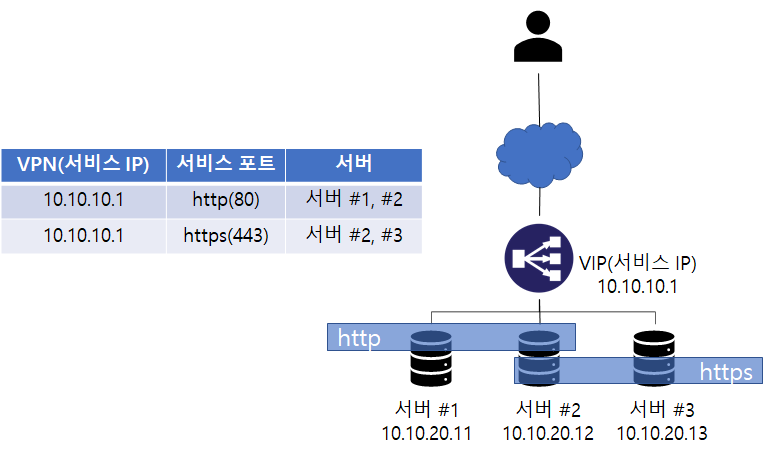
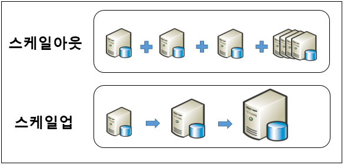
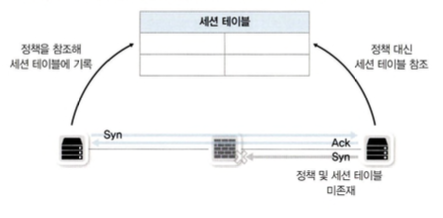
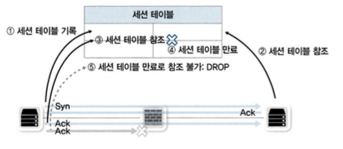
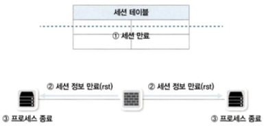
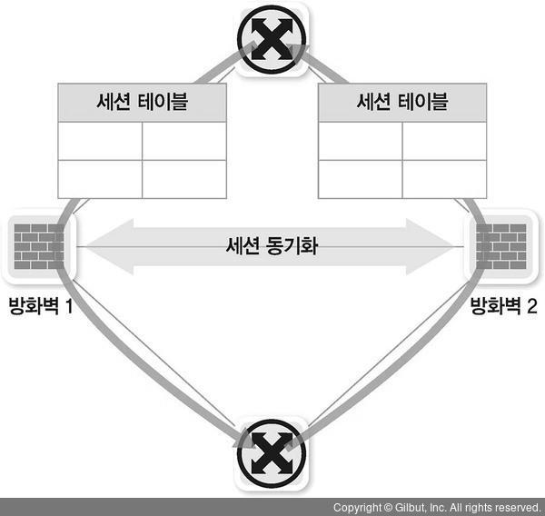
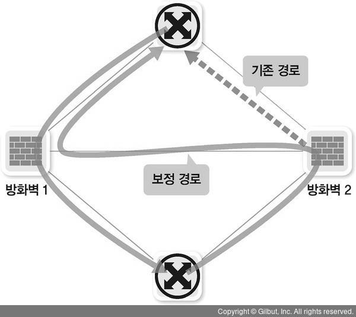
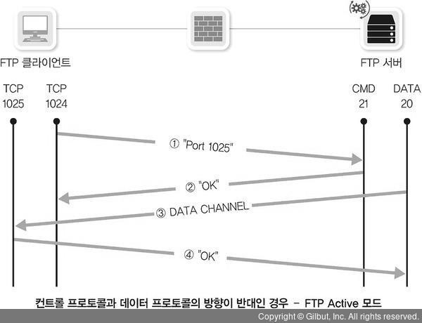
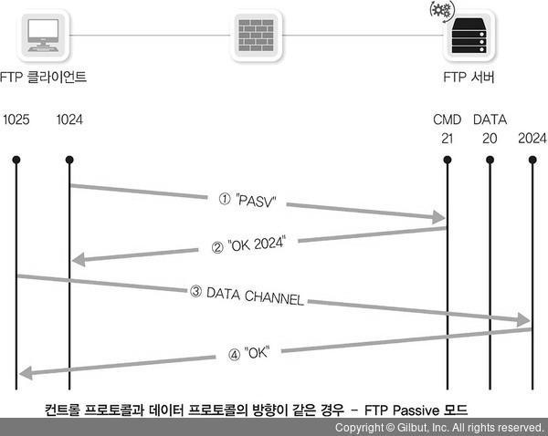

# 로드밸런서 / 방화벽 : 4계층 장비 (세션 장비)

기존 네트워크 장비는 스위치와 라우터처럼 2계층이나 3계층에서 동작하는 장비를 지칭하는 용어였지만 IP 부족으로 NAT 기술이 등장하고 보안용 방화벽, 프록시와 같은 장비들이 등장하면서 4계층 이상에서 동작하는 네트워크 장비가 많아지면서 4계층에서 동작하는 장비도 네트워크 장비에 포함되었습니다. 이런 장비는 4계층의 특징인 포트 번호, 시퀀스 번호, ACK 번호에 대해 이해해야 합니다. 기존 2,3계층 장비에서 고려하지 않았던 통신의 방향성이나 순서와 같은 통신 전반에 대한 관리가 필요하며 이런 정보를 세션 테이블(Session Table)이라는 공간에 담아 관리합니다.

4계층 이상에서 동작하는 네트워크 장비는 이런 세션 테이블을 관리해야 하고 이 정보를 기반으로 동작합니다

## 4계층 장비의 특징

4계층 장비는 TCP와 같은 4계층 헤더에 있는 정보를 이해하고 이 정보들을 기반으로 동작합니다. 4계층 프로토콜 동작에 대한 깊은 이해없이 4계층 장비를 2,3 계층 네트워크 장비처럼 설계,운용하면 여러가지 문제가 발생합니다. 기존 네트워크 장비와 다른 점을 이해해야 하는데 세션 테이블과 그 안에서 관리하는 세션 정보가 가장 중요합니다.

그래서 4계층 이상에서 동작하는 로드 밸런서 , 방화벽과 같은 장비를 "세션 장비"라고 부르기도 합니다.

세션 장비는 추가로 고려해야 할 특징이 많은데 그 중 최우선적으로 고려할 요소는 다음과 같스빈다.

```
1. 세션테이블
⇒ 세션 장비는 세션 테이블 기반으로 운영됩니다.
⇒ 세션 정보를 저장, 확인하는 작업 전반에 대한 이해가 필요합니다.
⇒ 세션 정보는 세션 테이블에 남아 있는 라이프타임이 존재합니다. 이 부분에 대한 고려가 필요합니다.

2. Symmetric(대칭) 경로 요구
⇒ Inbound 와 Outbound 경로가 일치해야 합니다.

3. 정보 변경
⇒ IP 주소가 변경되며 확장된 L7 로드 밸런서(ADC)는 애플리케이션 프로토콜 정보도 변경됩니다.
```

세션 장비의 이런 요소가 서비스에 영향을 미치므로 네트워크 통신 중간 위치에 세션을 기반으로 동작하는 방화벽, NAT , 로드 밸런서와 같은 장비가 있을 경우, 네트워크 인프라뿐만 아니라 시스템 설계와 애플리케이션 개발에도 세션 장비에 대한 고려가 필요합니다.

## 로드 밸런서

서버나 장비의 부하를 분산하기 위해 사용하는 장비를 흔히 로드 밸런서라고 부릅니다. 트래픽을 분배해주는 기능때문인데 4계층 이상에서 동작하면서 IP 주소나 4계층 정보, 애플리케이션 정보를 확인, 수정하는 기능이 있습니다. 가장 많이 쓰이는 분야는 웹 서버의 부하 분산입니다. 사용자 천명의 요청을 동시에 처리해주는 서버보다 사용자 5천명의 요청을 동시에 처리해주는 서버의 가격은 5배가 아니라 이보다 훨씬 비쌉니다.

내부 부품을 이중화하거나 용량이 더 큰 부품을 사용하면 가격이 크게 올라가므로 작은 장비 여러 대를 묶어 사용하는 방법을 선호합니다. 이런 시스템 확장 방법을 스케일 아웃이라고 하고 상세한 서비스 확장 방법은 이번 장 마지막의 '시스템 확장 방법: 스케일 업과 스케일 아웃'에 설명합니다.

작은 시스템 여러 대를 운영하더라도 사용자는 서버 배치와 상관없이 하나의 서비스로 보여야 합니다. 로드 밸런서가 서비스에 사용되는 대표 IP 주소를 서비스 IP로 갖고 그 밑에 시스템이 늘어나면 로드 밸런서가 각 시스템의 실제 IP로 요청을 보냅니다. 이런 로드 밸런서는 웹, 애플리케이션 뿐만 아니라 FWLB(FireWall Load Balancing , 방화벽 로드 밸런싱) , VPNLB(VPN Load Balancing , VPN 로드 밸런싱)와 같이 다양한 서비스를 위해 사용될 수 있습니다.

로드 밸런서는 동작하는 계층에 따라 보통 4계층과 7계층으로 나뉩니다.

1. <b>L4 로드 밸런싱</b>

```
일반적인 로드 밸런서가 동작하는 방식입니다.
TCP, UDP 정보(특히 포트 넘버)를 기반으로 로드 밸런싱을 수행합니다. 최근 로드 밸런서는 L4 , L7의 기능을 모두 지원하므로
L4 로드밸런싱만 제공하는 정용장비는 찾기 힘들지만 장비에서 L7 지원 여부와 상관없이 4계층에 대한 정보로만 분산 처리하는 경우
를 L4 로드밸런싱이라고 합니다.
```

2. <b>L7 로드 밸런싱</b>

```
HTTP , FTP , SMTP와 같은 애플리케이션 프로토콜 정보를 기반으로 로드 밸런싱을 수행합니다
HTTP 헤더 정보나 URI 같은 정보를 기반으로 프로토콜을 이해한 후 부하를 분산할 수 있습니다.
일반적으로 이런 장비를 ADC(Application Delivery Controller) 라고 부르며 프록시(Proxy) 역할을 수행합니다.
스퀴드(Squid)나 Nginx 에서 수행하는 리버스 프록시(Reverse Proxy)와 유사한 기능을 갖고 있습니다.
```

### 1. L4 스위치

L4 스위치는 용어 그대로 4계층에서 동작하면서 로드 밸런서 기능이 있는 스위치 입니다. 동작방식은 4계층 로드 밸런서이지만 외형은 스위치처럼 여러 개의 포트를 가지고 있습니다 서버형 로드 밸런서나 소프트웨어 형태의 로드 밸런서도 있지만 다양한 네트워크 구성이 가능한 스위치형 로드 밸런서가 가장 대중화되어 있습니다.

L4 스위치는 부하 분산, 성능 최적화 , 리다이렉션 기능을 제공합니다.



L4 스위치가 동작하려면 가상 서버(Virtual Server) , 가상 IP(Virtual IP) , 리얼 서버(Real Server) 와 리얼 IP(Real IP)를 설정해야 합니다.

가상 서버는 사용자가 바라보는 실제 서비스이고 가상 IP는 사용자가 접근해야 하는 서비스 IP 주소입니다. 리얼 서버는 실제 서비스를 수행하는 서버이고 리얼 IP는 실제 서버의 IP 입니다. 여기서 L4 스위치는 가상 IP를 리얼 IP로 변경해주는 역할을 합니다.

```
1. 가상 서버(Virtual Server) : 사용자가 바라보는 실제 서비스
2. 가상 IP(Virtual IP) : 사용자가 접근해야 하는 서비스 IP 주소
3. 리얼 서버(Real Server) : 실제 서비스를 수행하는 서버
4. 리얼 IP(Real IP) : 실제 서버의 IP
```

사용자는 L4 스위치의 가상 IP를 목적지로 서비스를 요청하고 L4 스위치가 목적지로 설정된 가상 IP 를 리얼 IP로 다시 변경해 보내줍니다. 이 과정에서 부하를 어떤 방식으로 분산할지 경정할 수 있습니다.

### 2. ADC

ADC(Application Delivery Controller)는 애플리케이션 계층에서 동작하는 로드 밸런서입니다.

4계층에서 동작하는 L4 스위치와 달리 애플리케이션 프로토콜의 헤더와 내용을 이해하고 동작하므로 다양한 부하 분산, 정보 수정, 정보 필터링이 가능합니다. ADC는 이런 상세한 동작을 위해 프락시로 동작합니다. 일부 소프트웨어 ADC를 제외한 대부분의 ADC는 L4 스위치의 기능을 포함하고 있습니다.

대부분의 ADC는 4계층에서 애플리케이션 계층까지 로드 밸런싱 기능을 제공하고 페일 오버(Failover , 장애 극복) , 리다이렉션(Redirection) 기능도 함께 수행합니다. 이 외에도 애플리케이션 프로토콜을 이해하고 최적화하는 다양한 기능을 제공합니다. 캐싱(Caching) , 압축(Compression), 콘텐츠 변환 및 재작성, 인코딩 변환 등이 가능하고 애플리케이션 프로토콜 최적화 기능도 제공합니다.

플러그인 형태로 보안 강화 기능을 추가로 제공해 WAF(Web Application Firewall) 기능이나 HTML , XML 검증과 변환을 수행할 수 있습니다.

### 3. L4 스위치 vs ADC

#### L4 스위치

L4 스위치는 4계층에서 동작하면서 TCP , UDP 정보를 기반으로 부하를 분산합니다. 부하 분산뿐만 아니라 TCP 계층에서의 최적화와 보안 기능도 함께 제공할 수 있습니다. TCP 레벨의 간단한 DoS(Denial of Service) 공격을 방어하거나 서버 부하를 줄이기 위해 TCP 세션 재사용과 같이 보안과 성능을 높여주는 기능도 함께 제공할 수 있습니다.


#### ADC

ADC는 애플리케이션 프로토콜을 이해하고 애플리케이션 내용에 대한 분산, 리다이렉션, 최적화를 제공해 L4 스위치보다 더 다양한 기능을 사용할 수 있습니다.

ADC는 성능 최적화를 위해 서버에서 수행하는 작접 중 부하가 많이 걸리는 작업을 별도로 수행합니다. 그 중 하나가 이미지나 정적 콘텐츠 캐싱(Caching) 기능 입니다.


웹 서버에는 콘텐츠 압축 기능이 있지만 ADC 에서 이 역할을 수행해 웹 서버의 부하를 줄일 수 있습니다. ADC 는 하드웨어 가속이나 소프트웨어 최적화를 통해 이런 부하가 걸리는 작업을 최적화 하는 기능이 있습니다.

최근 SSL 프로토콜을 사용하는 비중이 늘면서 웹 서버에 SSL 암복호화 부하가 늘고 있습니다. 개인정보 보호를 위해 개인정보가 전달되는 일부 페이지에서만 SSL를 사용해왔지만 보안 강화를 위해 웹사이트 전체를 SSL로 처리하는 추세입니다. ADC 에서는 SSL의 엔드 포인트로 동작해 클라이언트에서 ADC까지의 구간을 SSL로 처리해주고 ADC와 웹 서버 사이를 일반 HTTP를 이용해 통신합니다.

대부분 이런 기능을 사용할 때는 웹 서버 여러 대의 SSL 통신을 하나의 ADC 에서 수용하기 위해 ADC에 전용 SSL 가속 카드를 내장합니다.

#### 참고 - 스케일 업과 스케일 아웃

```
스케일 업
: 기존 시스템에 CPU, 메모리, 디스크와 같은 내부 컴포넌트 용량을 키우거나 이것이 불가능 할 경우, 새로 더 큰 용량의
시스템을 구매해 서비스를 옮기는 방법

스케일 아웃
: 같은 용량의 시스템을 여러 대 배치하여 병렬로 운영하는 방법
```



##### 스케일 업

스케일 업은 기존 시스템에 CPU, 메모리, 디스크와 같은 내부 컴포넌트 용량을 키우거나 이것이 불가능 할 경우, 새로 더 큰 용량의 시스템을 구매해 서비스를 옮기는 방법입니다. 하지만 스케일 업이 가능한 요소나 서비스가 있고 그렇지 않은 경우가 있습니다. 파일 저장소인 디스크는 어느정도까지는 쉽게 확장이 가능하지만 CPU, 메모리를 확장하기는 어렵니다.

확장을 미리 고려해 시스템을 구축하면 초기 비용이 커지고 서비스에 적합한 시스템을 구매하면 확장이 필요할 때 기존 시스템을 버리고 더 큰 시스템을 새로 구매하므로 기존 시스템 비용이 낭비되는 문제가 있습니다.

그 외에도 스케일 업은 필요한 용량만큼 시스템을 늘리는 데 비용이 가하급수적으로 증가하는 문제가 있습니다. 저가형 CPU 보다 성능이 2배 우수한 CPU는 저가형 CPU 2개 비용이 아닌 그 이상의 비용이 필요합니다.

##### 스케일 아웃

스케일 업은 시스템 하나의 용량 자체를 키우지만 스케일 아웃은 같은 용량의 시스템을 여러 대 배치합니다.

사용자 천 명의 요청을 처리하는 시스템이 한 대 구동된다면 5천명을 위해서는 5대의 시스템을 병렬로 운영하는 방법입니다. 물론 스케일 아웃을 위해 새로 시스템 설계를 하거나 분산을 위한 별도의 프로세스를 운영하거나 로드 밸런서와 같이 부하를 분산해주는 별도의 외부 시스템이 필요합니다.

##### 스케일 다운

확장과 반대로 잘 운영되던 서비스에 사용자가 줄면 시스템을 축소시키는 방법도 있습니다.

스케일 다운은 기존 시스템보다 작은 용량의 시스템으로 서비스를 옮기는 방법입니다. (스케일 업의 반대)

##### 스케일 인

스케일 아웃의 반대 개념은 스케일 인으로 여러 개의 서비스를 합쳐 하나의 시스템에서 운영하는 방법입니다. 기존 웹 프론트엔드 서버, API 서버 , 백엔드 API 서버, 데이터베이스로 4개 시스템이 운영되던 것은 2대의 시스템으로 축소하는 등을 스케일 인이라고 볼 수 있습니다.

|      |                                  스케일 업(Scale-Up)                                   |                                                                                              스케일 아웃(Scale-Out)                                                                                              |
| :--: | :------------------------------------------------------------------------------------: | :--------------------------------------------------------------------------------------------------------------------------------------------------------------------------------------------------------------: |
| 설명 | 하드웨어 성능 자체를 업그레이드하거나 더 높은 성능의 시스템으로 마이그레이션 하는 방법 |                                                 여러 대의 서버로 로드를 분산하는 방법, 서비스 자체를 구분해 나누거나 같은 서비스를 분산해 처리하는 방법이 있다.                                                  |
| 장점 | 부품을 쉽게 추가할 수 있으면 시스템 설계 변경 없이 서비스 사용량을 쉽게 늘릴 수 있다.  | 스케일 업 방식보다 더 적은 비용으로 시스템 확장이 가능하며 여러 대의 시스템에 로드를 적절히 분산해 하나의 시스템에 장애가 발생하더라도 서비스에 미치는 영향이 없도록 결함허용(Fault Tolerance)을 구현할 수 있다. |
| 단점 |          부품 추가가 어렵고 시스템이 커질수록 비용이 기하급수적으로 증가한다.          |                                           스케일 아웃을 위해 별도의 복잡한 아키텍쳐를 이해하고 운영해야만 할 수있다. 프로세스나 네트워크 장비가 추가로 필요할 수 있다.                                           |

<br/>

## 방화벽

네트워크 중간에 위치해 해당 장비를 통과하는 트래픽을 사전에 주어진 정책 조건에 맞추어 허용(Permit)하거나 차단(Deny)하는 장비를 방화벽이라고 부릅니다.

네트워크에서 보안을 제공하는 장비를 넓은 의미에서 모두 방화벽의 일종으로 불러왔지만 일반적으로 네트워크 3,4 계층에서 동작하고 세션을 인지, 관리하는 SPI(Statefu lPacket Inspection) 엔진을 기반으로 동작하는 장비를 방화벽이라고 부릅니다.


방화벽은 NAT(Network Adress Translation) 동작 방식과 유사하게 세션 정보를 장비 내부에서 저장합니다. 패킷이 외부로 나갈 때 세션 정보를 저장하고 패킷이 들어오거나 나갈 때 저장했던 세션 정보를 먼저 참조해 들어오는 패킷이 외부에서 처음 시작된 것인지, 내부 사용자가 외부로 요청한 응답인지 가려냅니다.



이 세션 테이블을 이용해 패킷의 인관 관계를 파악할 수 있어 정책을 간단히 유지할 수 있습니다. 만약 세션 테이블과 같이 상태 정보를 담아두는 공간이 없어 세션의 방향성을 파악하지 못한다면 많은 정책을 복잡하게 관리해야 합니다.

상태 정보가 없으면 방화벽에서는 하나의 정책을 설정하기 위해 최소한 두 개의 양방향 정책이 함께 설정 되어야 합니다. 인터넷과 같은 불특정 다수와 통신해야 할때는 정책의 복잡도가 많이 증가합니다.

인터넷에 연결되는 정책을 관리하는 인터넷 방화벽에서의 기본 정책은 인터넷으로 나가는 모든 패킷을 허용하고 내부로 들어오는 모든 패킷을 차단하는 것입니다. 상태, 세션 정보가 없을 때 패킷이 내부에서 시작한 것인지, 외부에서 시작한 것인지 인지할 수 없어 엄청나게 복잡한 정책 관리가 필요합니다.

방화벽은 메모리에 남는 이런 상태와 세션 정보를 이용해 패킷을 상세히 로깅하고 관찰할 수 있습니다.

```
참고 - 상태 테이블? 세션 테이블?

패킷의 상태 정보를 인지하는 스테이트풀(Stateful)로 동작하는 장비의 경우, 상태 정보를 갖고 있어 상태 테이블(State Table)이라고도 하고 해당 상태에 대한
세션값을 유지하므로 세션 테이블(Session Table)이라고도 부릅니다. 여기서는 세션 테이블로 용어를 통일해 사용하였습니다.
```

## 4계층 장비를 통과할 때의 유의점 (세션 관리)

세션 장비는 일반적인 2,3 계층 네트워크 장비와 달리 세션을 이해하고 세션 테이블을 유지합니다. 세션 테이블 정보를 이용해 패킷을 변경하거나 애플리케이션 성능을 최적화하고 보안을 강화하기 위해 패킷을 포워드(Forward)하거나 드롭(Drop)할 수 있습니다. 이런 기능을 충분히 활용하려면 애플리케이션과 세션 장비 간 세션 정보를 동일하게 유지해주거나 애플리케이션을 제작할 때 네트워크 중간에 있는 세션 장비를 고려해 여러가지 기능을 추가해주어야 합니다.

특히 애플리케이션의 세션 시간과 서비스 방향성을 고려하고 비대칭 경로를 피하는 것이 매우 중요합니다. 네트워크에서 세션 장비가 중각넹 있을 때 생기는 대부분의 문제는 이런 부분을 고려하지 않아서 발생합니다. 이런 문제는 세션 장비에서 설정을 변경하거나 애플리케이션 로직을 변경해 해결 할 수 있습니다.

### 1. 세션 테이블 유지, 세션 정보 동기화

종단 장비에서 통신을 시작하면 중간에 있는 세션 장비는 해당 세션 상태를 테이블에 기록합니다. 통신이 없더라도 종단 장비 간 통신이 정상적으로 종료되지 않았다면 일정 시간 동안 세션 테이블을 유지합니다.

하지만 이런 세션 테이블은 메모리에 저장되므로 메모리 사용률을 적절히 유지하기 위해 일정 시간만 세션 정보를 저장합니다. 또한, 악이적인 공격자가 과도한 세션을 발생시켜 정상적인 세션 테이블 생성을 방해하는 세션 공격으로부터 시스템을 보호하기 위해 타임아웃값을 더 줄이기도 합니다.

여러가지 이유로 세션 장비는 세션 정보를 무제한으로 저장할 수 없고 여러가지 애플리케이션 통신을 관리하므로 일반적인 애플리케이션에 맞추어 적당한 세션 타임아웃을 유지합니다.

하지만 일부 애플리케이션은 세션을 한 번 연결해놓고 다음 통신이 시도될때까지 세션이 끊기지 않도록 세션 타임아웃값을 길게 설정하기도 합니다.

이런 종류의 애플리케이션이 통신할 때, 세션 장의 세션 타임아웃값이 애플리케이션의 세션 타임아웃값보다 짧으면 통신에 문제가 생깁니다. 중간 세션 장비의 세션이 유지되고 있다면 다시 통신이 시작되어 데이터를 보낼 때 중간 세션 장비에서 막히는 문제가 발생합니다. 세션 장비의 세션 테이블에 세션이 없는 상황에서 SYN 이 아닌 ACK로 표시된 패킷이 들어오면 세션 장비에서는 비정상 통신으로 판단해 패킷을 차단하고 그런 종류의 패킷을 통과시키는 옵션을 설정해 패킷을 강제로 통과시키더라도 반대 방향으로 데이터가 들어오면 정책에 막힐 수 있습니다.



위 그림 동작 순서는 다음과 같습니다.

```
1. 3방향 핸드셰이크를 통해 정상적으로 세션 설정 (방화벽에서 세션 설정 과정을 확인하고 세션 테이블 기록)
2. [2] , [3] 세션 테이블을 참조해 방화벽에서 패킷 통과
3. 일정 시간동안 통신 없음
4. [4] 세션 타임으로 세션 테이블 만료
5. 세션 만료 후 애플리케이션 통신 시작
6. [5] 세션이 만료되어 방화벽에서 패킷 드롭
```

이런 문제를 해결하기 위해 세션 장비와 애플리케이션(또는 시스템) 에서 각각 적용할 수 있는 설정이 있습니다. 다음은 이런 문제의 해결 방법이며 이 중 하나만 적용 되어도 서비스는 정상적으로 동작 가능합니다.

#### 세션 장비 운영자 입장

<h5><b>가. 세션 만료 시간 증가</b></h5>
세션 장비 운영자가 애플리케이션에 맞게 세션 만료 시간을 늘리는 방법이 있습니다. 이 경우, 의 세션 유지 시간보다 방화벽 세션 유지 시간이 길어야 합니다. 대부분의 세션 장비는 포트 번호나 IP 주소마다 별도의 세션 만료 시간을 설정할 수 있어 전체 세션 유지 시간이 길어져 시스템 메모리가 고갈되는 문제를 예방할 수 있습니다. 하지만 세션 장비 운영자가 정확한 정보를 얻어 설정할 수 있도록 애플리케이션측 개발자나 관리자가 애플리케이션 고유의 세션 유지 시간을 미리 알려주어야 합니다.

<h5><b>나. 세션 시간을 둔 채로 중간 패킷을 수용할 수 있도록 방화벽 설정(세션 장비 중 방화벽에 해당)</b></h5>
세션 테이블에 정보가 없는 ACK 패킷이 방화벽에 들어오면 방화벽은 패킷을 차단하지만 방화벽 옵션을 조정해 세션 테이블에 정보가 없는 ACK 패킷이 들어오더라도 세션을 새로 만들어 통과시킬 수 있는 옵션이 있습니다. 하지만 이런 해결책은 전체적인 보안이 취약해지는 기능이므로 여러가지 고려가 필요하고 가능하면 적용하지 않는 것이 좋습니다.

<h5><b>다. 세션 장비에서 세션 타임아웃 시 양 단말에서 세션 종료 통보</b></h5>
이 기능은 양 종단 장비의 세션 정보와 중간 세션 장비의 세션 정보가 일치하지 않아 발생하는 문제를 해결하기 위해 사용하는 기능입니다. 세션 상태 정보를 강제로 공유하기 위해 세션 장비에서는 세션 타임아웃 시 세션 정보를 삭제하는 것이 아니라 세션 정보에 있는 양 종단 장비에 세션 정보 만료(BST)를 통보합니다. TCP의 RST 플래그를 1로 세팅해 양 종단 장비에 전송하면 양 종단 장비에서는 세션이 비정상적으로 종료된 것으로 판단해 해상 세션을 끊습니다. 애플리케이션에서 통신이 필요하면 새로운 세션을 맺어 통신합니다.



세션 만료 시의 동작 과정은 다음과 같습니다.

```
1. 세션 설정
2. 일정 시간 통신 없음
3. [1] 세션 타임아웃값이 넘어 세션 만료
4. [2] 방화벽에서 양 종단 장비에 RST 패킷 전송
  A. A,B 장비 통신일 경우
  B. A 장비에는 출발지 B, 도착지 A인 RST 패킷 전송
  C. B 장비에는 출발지 A, 도착지 B인 RST 패킷 전송
5. [3] RST 패킷을 받은 양 종단 장비는 해당 프로세스 종료
```

#### 개발자 입장

<h5><b>가. 애플리케이션에서 주기적인 패킷 발생 기능 추가</b></h5>
애플리케이션과 세션 장비의 세션 타임아웃 시간을 일치시키는 가장 좋은 방법은 애플리케이션에서 패킷을 주기적으로 발생시키는 것입니다. 애플리케이션 개발 시 중간에 통신이 없더라도 일정시간마다 양 단말 애플리케이션의 세션 상태 정보를 체크하는 더미 패킷(Dummy Packet)을 보내는 기능을 추가하면 패킷이 주기적으로 발생해 중간 바화벽에서 세션타임아웃이 발생하기 전에 세션을 유지할 수 있습니다. 최근 대부분의 플랫폼에서는 이런 기능들을 내장하고 개발하도록 안내하고 있습니다. 중간 세션 장비의 세션 만료 시간으로 인한 문제를 해결하는 가장 바람직한 방법입니다.


이런 세션 유지 기능은 더미 패킷을 주기적으로 보내거나 트래픽이 일정 시간동안 없을 때만 더미 패킷을 보내거나 더 복잡한 로직을 이용해 애플리케이션 상태를 체크하는 기능을 구현할 수도 있습니다. 하지만 패킷을 주기적으로 보내는 기능만 구현되어도 방화벽 세션 만료로 인한 문제는 쉽게 해결됩니다.

### 2. 비대칭 경로 문제

네트워크의 안정성을 높이기 위해 네트워크 회선과 장비를 이중화합니다. 이때 패킷이 지나가는 경로가 2개 이상이므로 인바운드 패킷과 아웃바운드 패킷의 경로가 같거나 다를 수 있습니다.

인바운드 패킷과 아웃바운드 패킷이 같은 장비를 통과하는 것을 대칭 경로(Symmetric Path)라고 하고 다른 장비를 통과하는 것을 비대칭 경로(Asymmetric Path)라고 합니다.


세션 장비는 세션 테이블을 만들어 관리해야 하므로 패킷이 들어오고 나갈 때 동일한 장비를 통과해야 합니다. 네트워크 경로 이중화를 위해 세션 장비를 두 대 이상 설치한 경우 패킷이 들어올 때와 나갈 때 경로가 일정하게 유지되지 않으면 정상적인 서비스가 되지 않습니다.


2,3 계층 네트워크 장비는 세션 고려가 필요없어 네트워크 엔지니어 대다수가 세션 장비의 이런 특징을 파악하지 못하고 네트워크 효율성에만 초점을 맞추어 비대칭 경로를 사용하도록 네트워크를 디자인하는 경우가 많습니다.

이 문제의 가장 좋은 해결 방법은 비대칭 경로가 생기지 않도록 네트워크와 경로를 디자인하는 것입니다. 어쩔수 없이 비대칭 경로가 생기면 세션 장비에 이런 비대칭 경로를 처맇나느 기능을 이용할 수 있지만 이런 비대칭 패킷을 처리하기 위한 노력이 필요하여 세션 장비의 성능이 저하되거나 보안이 약화될 수 있습니다.

#### 해결1. 세션 테이블 동기화

비대칭 경로를 방화벽에서 처리할 수 있는 첫번째 방법은 세션 테이블을 동기화하는 것입니다.



세션 테이블을 동기화하면 두 개 경로상의 두 장비가 하나의 장비처럼 동작하므로 비대칭 경로에서도 정상적으로 동작할 수 있습니다. 이 기능은 패킷 경로를 변경하지 않고 동작한다는 장점이 있지만 세션을 동기화하는 시간보다 패킷 응답이 빠르면 정상적으로 동작하지 않을 수 있다는 단점이 있습니다.

데이터 센터에서 응답시간이 빠른 애플리케이션을 사용할 경우, 세션 동기화 시간보다 응답시간이 더 빠를 수 있으므로 이 기능을 사용하는 것을 추천하지 않습니다. 이 기능은 응답시간이 비교적 긴 인터넷 게이트웨이로 방화벽이 사용될 때 유용하게 사용될 수 있습니다.

#### 해결2. 세션 장비에서 다양한 방법으로 이를 보정

두번째 방법은 비대칭 경로가 생길 경우, 세션 장비에서 다양한 방법으로 이를 보정하는 것입니다.

인바운드 패킷이 통과하지 않았는데 아웃바운드 패킷이 장비로 들어온 경우, 인바운드 패킷이 통과한 다른 세션 장비 쪽으로 패킷을 보내 경로를 보정합니다. 그럼 강제로 대칭 결로를 만들어주므로 비대칭 경로로 인한 문제를 해결할 수 있습니다.



```
경로 보정 기능(MAC 리라이팅 , 터널링)으로 비대칭 경로를 예방할 수 있다.
```

강제로 다른 방화벽으로 패킷을 보내기 위해 방화벽 간 통신용 링크가 필요하고 MAC 주소를 변경하는 MAC 리라이팅(Rewriting)이나 기존 패킷에 MAC 주소를 한 번 더 인캡슐레이션하는 터널링(Tunneling)기법으로 경로를 보정합니다. 세부 기술과 기술용어는 구현하는 회사마다 다르므로 도입한 장비가 지원하는 기능과 구현방법은 별도로 확인해야 합니다.

### 3. 하나의 통신에 두 개 이상의 세션이 사용될 때의 고려사항

현대 프로토콜은 하나의 통신을 위해 한 개의 세션만 사용하는 경우가 대부분이지만 특별한 목적으로 두 개 이상의 세션을 만드는 경우가 있습니다.

이때 서로 다른 두 세션이 하나의 통신을 위해 사용하고 있다는 것을 네트워크 통신 중간에 놓인 세션 장비도 파악해야 합니다. 두 통신 중 한쪽 세션이 끊겨 있거나 세션 장비의 세션 테이블에서 삭제되면 단방향 통신만 가능하거나 통신하지 못할 수 있습니다. 이런 경우 통신에 문제가 있음을 쉽게 파악하지 못하는 경우가 많아 장애가 길어질 수 있으니 주의해야 합니다.

프로토콜은 프로토콜과 컨트롤 프로토콜로 구분할 수 있습니다. 데이터 프로토콜은 데이터를 실어 나르고 컨트롤 프로토콜은 데이터가 잘 전송되도록 세션을 제어합니ㅏㄷ. 현대 프로토콜들은 대부분 컨트롤 프로토콜 기능과 데이터 프로토콜 기능을 하나의 프로토콜에서 헤더나 별도 메시지로 해결하지만 특별한 목적이 있거나 오래된 프로토콜들은 두 개의 프로토콜이 분리된 경우가 있습니다.

가장 대표적인 프로토콜이 FTP(File Transfer Protocol) 입니다. FTP는 컨트롤 프로토콜과 데이터 프로토콜이 완전히 분리ㅗ디어 있고 통신 방법이 다른 두 가지 모드를 가지고 있습니다.


FTP의 기본적인 구동 방식은 Active 모드 입니다. Active 모드는 명령어를 전달하는 컨트롤 프로토콜과 데이터를 전달하는 데이터 프로토콜이 분리되어 있고 방향도 반대로 동작합니다.

일반적인 클라이언트 - 서버 동작 방식과 달리 컨트롤 프로토콜은 클라이언트에서 서버로 통신을 시작하지만 데이터 프로토콜은 서버에서 클라이언트 쪽으로 데이터를 푸시합니다.



위와 같은 다이어그램으로 Active 모드를 간단히 표현할 수 있습니다.

```
1. 클라이언트가 FTP 서버에 접속, 클라이언트는 1023번 이상의 TCP 포트를 사용, 서버는 TCP 21번 포트 사용
2. [1] 클라이언트가 서버에 데이터를 1025번 포트를 사용해 수신하겠다고 알림
3. [2] 서버는 클라이언트에 1025번 포트를 사용해 송신하겠다고 응답
4. [3] 서버에서 데이터를 보냄, 클라이언트에서 응답하고 데이터를 수신
```

Active 모드를 사용할 때 중간에 방화벽이나 세션 장비가 있으면 Active 모드의 동작 방식에 맞추어 방화벽의 반대 방향도 열어주어야 합니다. 특히 NAT 환경인 경우 FTP가 동작하는 프로토콜을 모두 이해할 수 있는 별도 기능을 동작시켜야 합니다.

이 기능을 ALG(Application Layer Gateway) 라고 합니다. ALG가 동작하는 방화벽은 FTP 명령어를 이해하고 반대 방향으로 시작하는 데이터 세션을 인지해 방화벽과 NAT을 자동으로 동작시켜 줍니다.

Passive 모드는 Active 모드의 단점을 보완하기 위해 ㅁ나들어졌습니다. Active 모드의 가장 큰 문제는 컨트롤 프로토콜과 데이터 프로토콜의 방향이 반대라는 것이었습니다.

Passive 모드는 컨트롤, 데이터 프로토콜이 분리되어 있는 것은 같지만 클라이언트에서 서버쪽으로 데이터를 요청해 다운받도록 동작합니다.



위와 같은 다이어그램으로 Passive 모드를 간단히 표현할 수 있습니다.

```
1. 클라이언트가 서버에 접속, 클라이언튼느 1023번 이상의 TCP 포트를 사용, 서버는 TCP 21번 포트를 사용(Active 와 동일)
2. [1] 클라이언트가 Passive 모드를 사용하겠다고 알림
3. [2] 서버는 클라이언트에 데이터 수신에 사용할 포트를 알림 (2024번 포트를 사용해 수신하겠다 응답)
4. [3] 클라이언트에서 서버에 데이터를 요청, [2] 과정에서 서버에서 알려준 2024번 포트에 요청
5. 데이터 전송
```

Passive 모드에서 클라이언트 쪽에 방화벽이나 세션 장비가 있을 경우 특별한 작업 없이 동작할 수 있다는 장점이 있지만 서버쪽에 방화벽이 있으면 데이터 다운로드를 위한 추가 포트를 열어주어야 합니다. FTP 서버에서 Passive 모드에서 사용하는 데이터 포트의 범위를 설정할 수 있습니다.
