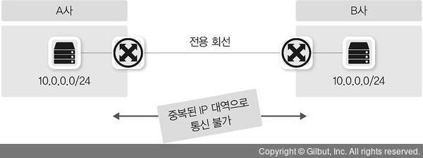
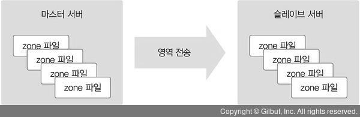

# 7강 통신을 도와주는 네트워크 주요 기술

사용자가 IP 설정을 하지 않더라도 IP 주소를 자동으로 할당해주는 DHCP(Dynamic Host Configuration Protocol) <br/>
사용자가 복잡한 목적지 IP 를 기억하지 않고 쉬운 도메인 이름을 사용하도록 도메인 이름과 IP 주소를 매핑해주는 DNS(Domain Name System) <br/>
사용자가 가장 가까운 지역의 데이터 센터에 접속해 신속한 서비스를 받게 해주는 GSLB(Global Service Load Balancing) <br/>
하나의 IP를 사용해 여러 단말 장비를 포함하는 네트워크를 손쉽게 구축하도록 도와주는 NAT 을 알아보자

## NAT/PAT

NAT(Network Address Translation , 네트워크 주소 변환)는 사용자 모르게 실생활에서 많이 사용하는 기술입니다.

가정에서 사용하는 노트북과 PC 는 공유기를 통해서 통신사에 LTE 나 5G로 연결된 스마트폰은 통신사 장비 어디선가 NAT을 수행해 외부와 통신하게 됩니다.

회사 네트워크에서도 NAT 와 PAT을 매우 많이 사용합니다. 라우터나 L3 스위치와 같은 L3 장비에서도 쓰이고 특히 방화벽과 로드 밸런서와 같이 세션을 다루는 L4 이상의 장비에서는 매우 빈번히 사용되는 기술입니다.

NAT는 이름 그대로 네트워크 주소를 변환하는 기술입니다. NAT은 기본적으로 하나의 네트워크 주소에 다른 하나의 네트워크 주소로 변환하는 1:1 변환이 기본이지만 IP 주소가 고갈되는 문제를 해결하기 위해 1:1 변환이 아닌 여러 개의 IP를 하나의 IP로 변환하기도 합니다. 여러 개의 IP 를 하나의 IP로 변환하는 기술도 NAT 기술 중 하나이고 NAT로 통칭하여 불리기도 하지만 실제 공식 용어는 NAPT(Network Address Port Translation , RFC2663) 입니다.

NAPT의 경우 실무에서는 PAT(Port Address Translation)라는 용어로 더 많이 사용되기 때문에 여기서도 PAT이라는 용어를 사용하겠습니다.

"NAT는 IP 주소를 다른 IP 주소로 변환해 라우팅을 원할히 해주는 기술" 이라고 인터넷 표준 문서에서 정의하고 있습니다. <br/>
사설 IP 에서 공인 IP로 전환하는 것뿐만 아니라 공인 IP에서 사설 IP로 주소를 전환할 수 있고 사설 IP에서 또 다른 사설 IP나 공인 IP에서 또 다른 공인 IP로의 전환도 NAT로 정의될 수 있습니다.

이 개념을 좀 더 확장하면 IPv4 주소를 IPv6로 변환하거나 그 반대로 IP 주소를 변환하는 기술인 AFT(Address Family Translation)도 NAT 기술의 일종입니다. 이렇듯 다양한 NAT 기술과 방법이 존재하지만 NAT가 가장 많이 사용되는 경우는 사설 IP 주소에서 공인 IP 주소로 전환하는 경우입니다.

NAT는 서비스의 전체 흐름을 파악하는 데 매우 중요한 요소입니다.

### 1. NAT/PAT의 용도와 필요성

#### IPv4 주소 고갈 문제의 솔루션으로 NAT가 사용됩니다

인터넷 대중화로 갑자기 폭증한 IP 주소 요구를 극복하기 위해 단기,종기,장기의 3단계 IP 보존과 전환전략을 수립했습니다. 이 전략이 매우 잘 만들어졌고 실제 환경에서도 유용하게 쓰이면서 IPv4 주소 부족 문제가 많이 해소되었습니다.

물론 현재는 IPv4 주소 할당이 끝나면서 신규로 할당 가능한 IPv4 주소가 없는 상태이고 IPv6 주소 체계 전환을 일부 분야에서는 매우 많이 진행하고 있습니다. IPv4 주소 보존전략 중 단기 전략은 서브네팅, 중기 전략은 NAT와 사설 IP 체계, 장기 전략은 IPv6 전환이었습니다.

그중 NAT을 이용한 중기 전략이 IPv4 주소 보존에 큰 기여를 했는데 외부에 공개해야 하는 서비스에 대해서는 공인 IP를 사용하고 외부에 공개할 필요가 없는 일반 사용자의 PC나 기타 종단 장비에 대해서는 사설 IP를 사용해 꼭 필요한 곳에만 효율적으로 IP를 사용할 수 있게 되었습니다.

#### 보안을 강화하는데 NAT 기술을 사용합니다

IP 주소는 네트워크에서 유일해야 하고 이 정보가 식별자로 사용되어 외부와 통신하게 해줍니다. 외부와 통신할 때 내부 IP를 다른 IP로 변환해 통신하면 외부에 사내 IP 주소 체계를 숨길 수 있습니다.


NAT는 주소 변환 후 역변환이 정상적으로 다시 수행되어야만 통신이 가능합니다. 이 성질을 이용해 복잡한 룰 설정 없이 방향성을 통제할 수 있습니다. 내부 네트워크에서 외부 네트워크로 나가는 방향 통신은 허용하지만 외부에서 시작해 내부로 들어오는 통신은 방어할 수 있습니다. NAT/PAT의 이런 성질을 이용해 보안을 쉽게 강화할 수 있습니다.

#### IP 주소 체계가 같은 두 개의 네트워크 간 통신을 가능하게 해줍니다.

IP 네트워크에서 서로 통신하려면 식별 가능한 유일한 IP 주소가 있어야 합니다. 공인 IP는 인터넷에서 유일한 주소로 IP주소가 중복되면 안되지만 사설 IP는 외부와 통신할 때 공인 IP로 변환되어 통신하므로 서로 다른 회사에서 중복해 사용할 수 있습니다.

회사 내부에서 사설 IP를 독립적으로 사용한다면 상관없지만 사설 IP 를 이용해 다른 회사와 직접 연결해야 하거나 회사 간 합병으로 서로 통신해야 한다면 사설 IP 주소가 충돌할 수 있습니다



특히 대외계라고 부르는 회사 간 통신에서 이런 상황이 많이 발생합니다. 카드사나 은행 간 연결이 대표적인 대외계 네트워크입니다. 최근 이런 카드, 금융 대외사와 서비스를 연동할 때 인터넷 구간을 이용해 통신하기도 하지만 개인정보 보호와 각종 법규 준수(Compliance)로 아직도 별도 전용 회선이나 암호화된 별도 네트워크를 이용해 통신합니다.

IP 대역이 같은 네트워크와 통신할 가능성이 높은 대외계 네트워크를 연결하기 위해 출발지와 도착지를 한꺼번에 변환하는 "더블 나트(Double NAT)" 기술을 사용합니다.

#### 불필요한 설정 변경을 줄일 수 있습니다

KISA를 통해 인터넷 독립기관으로 직접 등록하고 소유한 IP 주소를 직접 운영하는 경우가 아니라면 통신사업자나 IDC 쪽에서 IP를 할당받아 사용하게 됩니다. 이 IP들은 자신이 소유한 것이 아닌 임시로 빌려 사용하는 것이므로 회선 사업자를 바꾸거나 IDC를 이전하면 그동안 빌려 써왔던 공인 IP를 더 이상 사용할 수 없고 신규 사업자가 빌려주는 IP로 변경해야 합니다.

만약 사용자가 NAT/PAT을 이용해 내부 네트워크를 구성하고 있었다면 서버와 PC의 IP 주소 변경 없이 회선과 IDC 사업자 이전이 가능합니다. 물론 외부에 서비스하던 공인 IP 주소가 변경되므로 DNS 서비스나 NAT를 수행하는 네트워크 장비의 설정은 변경해야 하지만 내부 서버나 PC 설정 변경을 최소화 할 수 있어 NAT/PAT 기술을 적용하면 복잡한 작업을 많이 줄일 수 있습니다. 이런 설계는 특정 사업자에 종속되지 않는 유연한 인프라스트럭처의 기본 요소로 비즈니스 유연성을 높이는 데 매우 중요한 기술로 활용됩니다.

#### NAT 단점

NAT 기술의 단점은 네트워크 운영가 입장에서 IP가 변환되면 장애가 발생했을 때 문제 해결이 힘듦니다. <br/>
애플리케이션 개발자는 NAT 환경이 대중화되면서 애플리케이션을 개발할 때 더 많은 고려사항이 생겼습니다. <br/>
IPv6 전환은 IPv4 주소 부족 해결이라는 중요한 목표가 있었지만 이런 어려움을 주는 NAT을 인터넷에서 없애는 목표도 있습니다. <br/>
NAT 로 인해 주소가 변환되면서 단말 간 직접적인 연결성이 무너졌고 이로 인해 개발자들이 애플리케이션을 제작할 때 NAT환경을 항상 고려해야 하는 상황이 되었습니다. 또한, NAT의 이런 한계를 극복하기 위해 NAT 밑에 있는 단말도 직접 연결하게 도와주는 홀 펀칭(Hole Punching) 기술이 나오고 이 기술을 이용하기 위해 애플리케이션이 더 복작해지는 악순환이 계속 되었습니다.

### 2. NAT 동작 방식


NAT의 동작 방식을 이해하기 위해 출발지 사용자(10.10.10.10)가 목적지 웹 서버(20.20.20.20)로 통신하는 과정을 살펴보겠습니다.

1. 사용자는 웹 서버에 접근하기 위해 출발지 IP 10.10.10.10으로, 목적지 IP 와 서비스 포트는 20.20.20.20:80 으로 패킷을 전송합니다. 출발지 서비스 포트는 임의의 포트로 할당됩니다. 여기서는 2000번 포트로 가정했습니다.
2. NAT 역할을 수행하는 장비에서는 사용자가 보낸 패킷을 수신한 후 NAT 정책에 따라 외부 네트워크와 통신이 가능한 공인 IP 인 11.11.11.11로 IP 주소를 변경합니다. NAT장비에서 변경 전후의 IP 주소는 NAT 테이블에 저장됩니다.
3. NAT 장비에서는 출발지 주소를 11.11.11.11로 변경해 목적지 웹 서버로 전송합니다.
4. 패킷을 수신한 웹 서버는 사용자에게 응답을 보냅니다. 응답이므로 수신한 애용과 반대로 출발지는 웹서버(20.20.20.20)가 되고 목적지는 NAT장비에 의해 변환된 공인 IP 11.11.11.11 로 사용자에게 전송합니다.
5. 웹 서버로부터 응답 패킷을 수신한 NAT 장비는 자신의 NAT 테이블에서 목적지 IP 에 대한 원래 패킷을 발생시킨 출발지 IP 주소가 10.10.10.10인 것을 확인합니다.
6. NAT 변환 테이블에서 확인된 원래 패킷 출발지 IP(10.10.10.10)로 변경해 사용자에게 전송하면 사용자는 최종적으로 패킷을 수신합니다.

### 3. PAT 동작 방식


1. 사용자가 웹 서버로 접근하기 위해 패킷에 출발지 10.10.10.10, 목적지 20.20.20.20. 목적지 서비스 포트는 웹 서비스 포트인 80 으로 채워 패킷을 전송합니다. 출발지 서비스 포트는 NAT와 마찬가지로 임의의 서비스 포트가 할당되며 이 예제에서는 2000번 포트로 할당되었다고 가정합니다.
2. NAT 장비는 사용자가 보낸 패킷을 받아 외부 네트워크와 통신이 가능한 공인 IP인 11.11.11.11 로 변경합니다. 다만 출발지에 있는 다수의 사용자가 동인한 공인 IP로 변환되어야 하므로 패킷의 주소 변경 시 출발지 IP 뿐만아니라 출발지의 서비스ㅇ 포트도 변경됩니다. 출발지 IP 출발지 서비스 포트는 NAT 장비에 의해 모두 변경되고 NAT 장비가 이 변경 정보를 NAT 테이블에 기록합니다.
3. NAT 장비에서 변경된 출발지 IP 주소인 11.11.11.11과 서비스 포트 3000으로 패킷을 재작성해 웹 서버로 다시 전송합니다.
4. 사용자가 보낸 패킷을 수신한 웹 서버는 사용자에게 패킷을 응답하는데 출발지 IP는 웹 서버의 IP 주소인 20.20.20.20으로 채워지고 목적지 IP는 NAT 장비에 의해 변환된 공인 IP 11.11.11.11 과 서비스 포트로 채워져 전송합니다.
5. 웹 서버로부터 응답 패킷을 수신한 NAT 장비는 NAT 테이블을 확인해 웹 서버로부터 받은 패킷의 목적지 IP 주소인 11.11.11.11 이 원래 10.10.10.10 이며 서비스 포트 3000이 원래 2000인 것을 확인합니다.
6. NAT 장비는 NAT 테이블에서 확인한 목적지 IP 주소와서비스 포트로 패킷을 재작성한 후 사용자에게 전달합니다. 사용자는 NAT장비에서 역변환된 패킷을 받아 웹 페이지를 표시합니다.

만약 다른 IP를 가진 사용자가 동일하게 20.20.20.20 서버로 접속하는 경우, NAT 장비에서는 출발지 IP만 11.11.11.11 로 동일하게 변경하고 서비스 포트는 다른 포트로 변경합니다.

즉, PAT 동작 방식은 NAT와 거의 동일하게 이루어지지만 IP 주소뿐만 아니라 서비스 포트까지 함께 변경해 NAT 테이블을 관리하므로 하나의 IP만으로도 다양한 포트 번호를 사용해 사용자를 구분할 수 있습니다.

하지만 이 서비스 포트의 개수는 제한되어 있어 재사용됩니다. 만약 서비스 포트가 동시에 모두 사용중이거나 재사용이 불가능할 때는 PAT이 정상적으로 동작하지 않습니다. 따라서 동시 사용자가 매우 많을 때는 PAT에서 사용하는 공인 IP 주소를 IP 하나가 아닌 풀(Pool)로 구성해야 합니다.

PAT는 다수의 IP가 있는 출발지에서 목적지로 갈 때 NAT 테이블이 생성되고 응답에 대해 NAT 테이블을 참조할 수 있지만 PAT IP 가 목적지일 때는 해당 IP 가 어느 IP에 바인딩되는지 확인할 수 있는 NAT 테이블이 없으므로 사용할 수 없습니다. 즉, PAT는 뒤에서 다룰 SNAT와 DNAT중 SNAT에 대해서만 적용되고 DNAT에는 적용되지 않습니다.


### 4. SNAT와 DNAT

NAT을 사용해 네트워크 주소를 변환할 때 어떤 IP 주소를 변환하는지에 따라 두가지로 구분합니다

```
SNAT (Source NAT) : 출발지 주소를 변경하는 NAT
DNAT (Destination NAT) : 도착지 주소를 변경하는 NAT
```


SNAT와 DNAT는 트래픽이 출발하는 시작 지점을 기준으로 구분합니다. 어떤 주소를 변경해야 하는지는 서비스 흐름과 목적에 따라 결정됩니다. 앞에서 말했듯이 SNAT와 DNAT의 기준은 NAT가 수행되기 이전의 트래픽이 출발하는 시작 지점입니다. 즉, 요청 시 SNAT를 해 목적지로 전송하면 해당 트래픽에 대한 응답을 받을 때는 출발지와 목적지가 반대가 되므로 DNAT가 되는데 이때 트래픽을 요청하는 시작 지점만 고려해 SNAT 설정을 해야 합니다.

NAT 장비를 처음 통과할 때 NAT 테이블을 사용해 반대로 패킷을 변환해줄 수 있기 때문입니다. 이 과정을 역 NAT라고 하며 NAT가 정상적으로 수행되려면 역 NAT 과정이 함께 수행되어야 합니다.

#### Source NAT (SNAT)

SNAT는 사설에서 공인으로 통신할 때 많이 사용합니다.

공인 IP 주소의 목적지에서 출발지로 다시 응답을 받으려면 출발지 IP 주소 경로가 필요한데 공인 대역에서는 사설 대역으로의 경로를 알 수 없으므로 공인 IP의 목적지로 서비스를 요청할 때 출발지에서는 사설 IP를 별도의 공인 IP로 NAT해 서비스를 요청해야 합니다. 그래야 해당 요청을 받은 목적지에서 출발지 IP를 공인 IP로 확인해 다시 응답할 수 있는 경로를 찾을 수 있습니다. 이것은 공유기처럼 PAT를 사용하는 경우에 해당할 수 있습니다.

다른 경우는 보안상 SNAT을 사용할 때입니다. 회사에서 다른 대외사와 통신 시 내부 IP 주소가 아니라 별도의 다른 IP로 전환해 전송함으로써 대외에 내부의 실제 IP 주소를 숨길 수 있습니다. 보안상의 문제뿐만 아니라 대외사와 통신해야 하는 사내 IP가 대외사의 사내 IP 대역과 중복될 때 SNAT을 통해 중복되지 않는 다른 IP로 변경해 통신하는 데 사용할 수 있습니다. 이 경우는 앞에서 말한 사설에서 공인으로 통신해야 하는 경우와 비슷하지만 이 경우에는 변경되는 IP가 반드시 공인일 필요는 없습니다.

로드 밸런서의 구성에 따라 SNAT을 사용하기도 합니다. 출발지와 목적지 서버가 동일한 대역일 때는 로드 밸런서 구성에 따라 트래픽이 로드 밸런서를 거치지 않고 응답할 수 있어 SNAT을 통해 응답 트래픽이 로드 밸런서를 거치게 할 수 있습니다.


#### Destination NAT (DNAT)

DNAT는 로드 밸런서에서 많이 사용합니다. 사용자는 서비스 요청을 위해 로드 밸런서에 설정된 서비스 VIP(Virtual IP)로 서비스를 요청하고 로드 밸런서에서는 서비스 VIP를 로드 밸런싱될 서버의 실제 IP로 DNAT해 내보냅니다.

사내가 아닌 대외망과 네트워크 구성에도 DNAT을 사용합니다. 사내 IP 주소는 중앙에서 일괄적으로 관리되므로 IP가 중복되는 경우가 없지만 사내가 아닌 대외망과의 연동에서는 IP 중복이 될 수 있습니다.

설사 IP가 중복되지 않더라도 IP 주소가 제각각이므로 신규 대외사와의 연동마다 라우팅을 개별적으로 설정해야 합니다. 이 경우, 대외망에 NAT 장비를 이용해 대외사의 IP를 특정 IP 대역으로 NAT 합니다. 사내에서는 어떤 대외사든 대외망 전용 NAT 대역으로 변경된 네트워크 대역으로 라우팅 처리하면 되므로 대외사 추가에 따라 별도 라우팅을 개별적으로 설정할 필요가 없고 사내 IP 와 중복되는 IP가 있더라도 라우팅 이슈 없이 구성할 수 있습니다.


<br/>

### 5. 동적 NAT와 정적 NAT

```
정적 NAT : 출발지와 목적지의 IP를 미리 매핑해 고정해놓은 NAT
동적 NAT : 출발지나 목적지 어느 경우든 사전에 정해지지 않고 NAT를 수행할 때 IP를 동적으로 변경하는 것
```

#### 동적 NAT

동적 NAT은 출발지와 목적지가 모두 정의된 것이 아니라 다수의 IP 풀에서 정해지므로 최소한 출발지나 목적지 중 한 곳이 다수의 IP 로 구성된 IP 풀이나 레인지(Range)로 설정되어 있습니다. NAT가 필요할 때 IP 풀에서 어떤 IP 로 매핑될 것인지 판단해 NAT을 수행하는 시점에서 NAT 테이블을 만들어 관리합니다.

NAT 테이블은 설정된 시간 동안 유지되고 일정 시간 동안 통신이 없으면 다시 사라지므로 (NAT 테이블 타임아웃) 동적 NAT의 설정은 서비스 흐름을 고려해 적용해야 합니다.

#### 정적 NAT

정적 NAT는 출발지와 목적지 매핑 관계가 특정 IP로 사전에 정의된 것이므로 1:1 NAT라고 부르기도 합니다. 실제 IP 매핑도 A라는 IP와 B라는 IP가 항상 고정되어 매핑된 상태이므로 서비스 방향에 따라 고려할 필요가 없습니다. 즉, 방향성 없이 서비스 흐름을 고려하지않고 NAT을 설정 할 수 있습니다.

|                     |                     동적 NAT                     |             정적 NAT             |
| :-----------------: | :----------------------------------------------: | :------------------------------: |
|      NAT 설정       |                  1:N , N:1, N:M                  |               1:1                |
|     NAT 테이블      |                 NAT 수행시 생성                  |            사전 생성             |
| NAT 테이블 타임아웃 |                       동작                       |               없음               |
|    NAT 수행정보     | 실시간으로만 확인하거나 별도 변경 로그 저장 필요 | 별도 필요 없음 (설정 = NAT 내역) |


<br/>

## DNS

네트워크 프로토콜은 크게 두가지로 나눌 수 있습니다.

```
데이터 프로토콜
: 실제로 데이터를 실어나르는 프로토콜

컨트롤 프로토콜
: 데이터 프로토콜이 잘 동작하도록 도와주는 프로토콜
: 통신에 직접 관여하지 않지만 처음 통신 관계를 맺거나 유지하는 데 큰 역할을 함
: ARP , ICMP , DNS 가 있음
```

### 1. DNS 소개

숫자로 구성된 IP 주소보다 의미있는 문자열로 구성된 도메인 주소가 우리가 인식하고 기억하기 더 쉽니다. 물론 서비스를 도메인 주소를 사용하더라도 실제로 패킷을 만들어 통신하려면 3계층 IP 주소를 알아야 하고 이를 위해 도메인 주소를 IP 주소로 변환하는 DNS(Domain Name Service) 정보를 네트워크 설정 정보에 입력해야 한다.


윈도우 용

리눅스 용

사용자가 도메인 주소를 사용하여 서비스를 요청하면 네트워크 설정에 입력한 DNS로 해당 도메인에 대한 IP 주소 질의를 보내고 해당 요청한 도메인의 서비스 IP 주소를 받게 됩니다.


### 2. DNS 구조와 명명 규칙

도메인은 계층 구조여서 수많은 인터넷 주소 중 원하는 주소를 효율적으로 찾아갈 수 있습니다.

역트리 구조로 최상위 루트부터 Top-Level 도메인 , Second-Level 도메인 , Third-Level 도메인과 같이 하위 레벨로 원하는 주소를 단계적으로 찾아 갑니다. 우리가 도메인 주소를 사용할 때는 각 계층의 경계를 “.”으로 표시하고 뒤에서 앞으로 해석합니다. Third.second.top.과 같은 형태로 표현하고 맨 뒤의 루트는 생략됩니다. www.naver.com의 경우, 맨 뒤에 생략된 루트(.)를 시작으로 Top-Level인 com, Second-Level인 naver, Third-Level인 www와 같이 뒤에서 앞으로 해석됩니다.


도메인 계층은 최대 128계층까지 구성할 수 있습니다. 계층별 길이는 최대 63바이트까지 사용할 수 있고 도메인 계층을 구분하는 구분자 "." 를 포함한 전체 도메인 네임의 길이는 최대 255까지 사용할 수 있습니다.

#### 루트 도메인

루트 도메인은 앞에서 말했듯이 도메인을 구성하는 최상위 영역입니다. DNS 서버는 사용자가 쿼리한 도메인에 대한 값을 직접 갖고 있거나 캐시에 저장된 정보를 이용해 응답합니다. 만약 DNS 서버에 해당 도메인의 정보가 없으면 루트 도메인을 관리하는 루트 DNS에 쿼리하게 됩니다.

루트 DNS는 전 세계에 13개가 있고 DNS 서버를 설치하면 루트 DNS의 IP 주소를 기록한 힌트(Hint) 파일을 가지고 있어 루트 DNS 관련 정보를 별도로 설정할 필요가 없습니다.

|    호스트 이름     |              IP 주소              |               관리 기관                |
| :----------------: | :-------------------------------: | :------------------------------------: |
| a.root-servers.net |  198.41.0.4, 2001:503:ba3e::2:30  |             VeriSign, Inc.             |
| b.root-servers.net |  192.228.79.201, 2001:500:84::b   | University of Southern California(ISI) |
| c.root-servers.net |    192.33.4.12, 2001:500:2::c     |         Cogent Communications          |
| d.root-servers.net |    199.7.91.13, 2001:500:2d::d    |         University of Maryland         |
| e.root-servers.net |  192.203.230.10, 2001:500:a8::e   |       NASA(Ames Research Center)       |
| f.root-servers.net |    192.5.5.241, 2001:500:2f::f    |   Internet Systems Consortium, Inc.    |
| g.root-servers.net |  192.112.36.4, 2001:500:12::d0d   |     US Department of Defense(NIC)      |
| h.root-servers.net |   198.97.190.53, 2001:500:1::53   |         US Army (Research Lab)         |
| i.root-servers.net |    192.36.148.17, 2001:7fe::53    |                 Netnod                 |
| j.root-servers.net | 192.58.128.30, 2001:503:c27::2:30 |             VeriSign, Inc.             |
| k.root-servers.net |     193.0.14.129, 2001:7fd::1     |                RIPE NCC                |
| l.root-servers.net |   199.7.83.42, 2001:500:9f::42    |                 ICANN                  |
| m.root-servers.net |    202.12.27.33, 2001:dc3::35     |              WIDE Project              |

윈도 서버에 DNS 서비스를 활성화 하면 DNS 서비스에 기본으로 저장되어 있는 루트 서버 리스트 정보를 확인할 수 있습니다.


#### Top-Level Domain(TLD)

최상위 도메인인 TLD는 IANA(Internet Assigned Numbers Authority)에서 구분한 6가지 유형으로 구분할 수 있습니다. 각 유형은 다음과 같으며 전체 리스트는 IANA 사이트(https://www.iana.org/domains/root/db)에서 확인할 수 있습니다.

```
• Generic(gTLD)
• country-code(ccTLD)
• sponsored(sTLD)
• infrastructure
• generic-restricted(grTLD)
• test(tTLD)
```

#### Generic TLD(gTLD)

gTLD는 특별한 제한없이 일반적으로 사용되는 최상위 도메인이며 세 글자 이상으로 구성됩니다. 초기 gTLD는 1980년대 7개의 gTLD(.com, .edu, .gov, .int, .mil, .net, .org)로 시작했으며 필요에 의해 새로운 gTLD가 지속적으로 만들어지고 있습니다.


#### Country Code TLD(ccTLD)

ccTLD는 국가 최상위 도메인으로 ISO 3166 표준에 의해 규정된 두 글자의 국가 코드를 사용합니다. 우리나라는 ‘kr’을 사용합니다. 일반적으로 ccTLD를 사용하는 경우, Second Level TLD에는 gTLD에서 구분한 것처럼 사이트 용도에 따른 코드를 사용합니다. 예를 들어 일반 회사는 co.kr을 사용하고 정부기관은 go.kr을 사용하는 방법입니다. 우리나라는 gTLD를 두 글자로 줄여 사용하지만 호주나 대만처럼 gTLD를 그대로 사용하는 나라도 있습니다(com.au, gov.au, com.tw, gov.tw 등). 영국은 ISO 3166 표준이 아닌 uk라는 별도 ccTLD를 사용합니다. 그림 7-15는 ccTLD에 대한 표준 코드표입니다. 이처럼 다양한 국가별 코드가 정의되어 사용된다는 것을 알 수 있습니다. 할당에 대한 세부 구분은 그림에 있는 위키피디아 링크를 참고하면 확인할 수 있습니다.

<br/>
▲ 그림 7-15 대부분의 인터넷 국가 도메인에 적용되는 ISO 3166-1 alpah-2 코드

#### Sponsored(sTLD)

sTLD는 특정 목적을 위한 스폰서를 두고 있는 최상위 도메인입니다. 스폰서는 특정 민족공동체, 전문가 집단, 지리적 위치 등이 속할 수 있습니다. sTL의 종류에는 ‘.aero’, ‘.asia’, ‘.edu’, ‘.museum’ 등이 있습니다.

#### Infrastructure

운용상 중요한 인프라 식별자 공간을 지원하기 위해 전용으로 사용되는 최상위 도메인입니다. Infrastructure에 속하는 TLD는 ‘.arpa’입니다. ‘.arpa’는 인터넷 안정성을 유지하기 위해 새로운 모든 인프라 하위 도메인이 배치될 도메인 공간 역할을 합니다. ‘.IN-ADDR.ARPA’가 이런 .‘arpa’의 하위 도메인 중 하나로 IPv4 주소를 도메인 이름에 매핑하는 역방향 도메인에서 사용합니다.

#### Generic-restricted(grTLD)

grTLD는 특정 기준을 충족하는 사람이나 단체가 사용할 수 있는 최상위 도메인입니다. grTLD의 종류에는 ‘.biz’, ‘.name’, ‘.pro’가 있습니다.

#### Test(tTLD)

tTLD는 IDN(Internationalized Domain Names) 개발 프로세스에서 테스트 목적으로 사용하는 최상위 도메인입니다. tTLD의 종류에는 ‘.test’가 있습니다.

### 3. DNS 동작 방식

도메인을 IP 주소로 변환하려면 DNS 서버에 도메인 쿼리하는 과정을 거쳐야 합니다. 하지만 DNS 서버없이 로컬에 도메인과 IP 주소를 직접 설정해 사용할 수도 있습니다. 로컬에서 도메인과 IP 주소를 관리하는 파일을 hosts 파일이라고 합니다. hosts 파일에 도메인과 IP 주소를 설정해두면 해당 도메인 리스트는 항상 DNS 캐시에 저장됩니다.

도메인을 쿼리하면 DNS 서버에 쿼리를 하기 전 로컬에 있는 DNS 캐시 정보를 먼저 확인합니다. 동일한 도메인을 매번 질의하지 않고 캐시를 통해 성능을 향상시키기 위해서입니다. 이런 DNS 캐시 정보에는 기존 DNS 조회를 통해 확인한 동적 DNS 캐시와 함께 hosts 파일에 저장되어 있는 정적 DNS 캐시가 함께 저장되어 있습니다. DNS 캐시 정보에 필요한 도메인 정보가 없으면 DNS 서버로 쿼리를 수행하고 DNS 서버로부터 응답을 받으면 그 결과를 캐시에 먼저 저장합니다. 전에 쿼리를 한 번 수행한 DNS 정보는 캐시부터 조회하므로 DNS 서버에 별도로 쿼리하지 않고 캐시 정보를 사용합니다.

그림 7-16은 윈도에서 DNS 캐시를 확인한 결과입니다. 윈도에서 DNS 캐시를 확인하려면 명령창에서 ‘ipconfig /displaydns’ 명령을 사용합니다

```
ipconfig /displaydns
```


인터넷이 상용화되기 전에는 인터넷에 연결된 단말이 많지 않았습니다. 스마트폰에 각자의 전화번호부를 저장하듯 각 단말에 hosts 파일을 넣어두고 그 안에 호스트 이름과 IP를 매핑하는 테이블이 있었습니다. hosts 파일이 정적 테이블이어서 단순하게 그 정보를 검색하면 간단히 주소 변환이 가능해 캐시 개념이 필요없었습니다. 인터넷이 상용화된 후 폭증하는 단말들을 중앙화된 체계로 수용하기 위해 DNS 체계가 만들어졌습니다. 기존 hosts 관리가 어려웠던 문제를 해결하기 위해 중앙집중식 시스템을 구성했고 폭증한 단말을 수용하기 위해 hosts처럼 플랫이 아닌 계층 구조를 채택했습니다. 기존 hosts 체계와 새로운 DNS 체계가 결합하면서 복잡해보이는 도메인 이름 쿼리 프로세스가 만들어졌습니다.

그림 7-17은 캐시와 DNS를 이용해 도메인 이름 쿼리를 하는 예제입니다. ‘zigispace.net’이라는 도메인을 쿼리하기 위해 먼저 로컬 캐시를 조회하고 로컬 캐시에 없으면 DNS 서버로 다시 쿼리해 도메인 쿼리를 수행합니다.


지금까지 클라이언트 관점에서 DNS 질의 과정을 설명했다면 지금부터는 반대로 DNS 시스템 관점에서 도메인에 대한 결괏값을 클라이언트에 보내주는 과정을 살펴보겠습니다.

전 세계 도메인 정보를 DNS 서버 하나에 저장할 수는 없습니다. 데이터 자체도 방대하지만 인터넷에 엄청나게 많은 사용자가 등록하고 삭제하는 도메인 리스트를 실시간으로 업데이트할 수 없기 때문입니다. 그래서 DNS는 분산된 데이터베이스로 서로 도와주도록 설계되었는데 자신이 가진 도메인 정보가 아니면 다른 DNS에 질의해 결과를 받을 수 있습니다. DNS 기능을 서버에 올리면 DNS 서버는 기본적으로 루트 DNS 관련 정보를 가지고 있습니다. 클라이언트의 쿼리가 자신에게 없는 정보라면 루트 DNS에 쿼리하고 루트 DNS에서는 쿼리한 도메인의 TLD 값을 확인해 해당 TLD 값을 관리하는 DNS가 어디인지 응답합니다.

예를 들어 zigispace.net이라는 도메인을 클라이언트가 DNS 서버에 쿼리했다면 DNS 서버는 루트 DNS에 다시 쿼리하고 루트 DNS는 .net에 대한 정보를 관리하는 DNS 주소 정보를 DNS 서버에 응답합니다. 이 응답을 받은 DNS 서버는 .net을 관리하는 DNS 서버에 zigispace.net에 대해 쿼리합니다. .net을 관리하는 DNS 서버는 다시 zigispace.net을 관리하는 DNS 관련 정보를 처음 DNS 서버에 응답합니다. DNS 서버는 마지막으로 zigispace.net을 관리하는 DNS에 쿼리하고 zigispace.net에 대한 최종 결괏값을 받게 됩니다. 처음 쿼리를 받은(클라이언트에 DNS 서버로 설정된) DNS 서버는 이 정보를 클라이언트에 응답합니다.

전체 과정을 보면 클라이언트에서 처음 질의를 받은 DNS가 중심이 되어 책임지고 루트 DNS부터 상위 DNS에 차근차근 쿼리를 보내 결괏값을 알아낸 후 최종 결괏값만 클라이언트에 응답합니다. 클라이언트는 한 번의 쿼리를 보내지만 이 요청을 받은 DNS 서버는 여러 단계로 쿼리를 상위 DNS 서버에 보내 정보를 획득합니다. 호스트가 DNS 서버에 질의했던 방식을 재귀적 쿼리(Recursive Query)라고 하고 DNS 서버가 루트 NS와 TLS NS, zigispace NS에 질의한 방식을 반복적 쿼리(Iterative Query)라고 합니다.

```
참고 - 재귀적 쿼리(Recursive Query)와 반복적 쿼리(Iterative Query)

재귀적 쿼리는 쿼리를 보낸 클라이언트에 서버가 최종 결괏값을 반환하는 서버 중심 쿼리이고 반복적 쿼리는 최종값을 받을 때까지 클라이언트에서
쿼리를 계속 진행하는 방식입니다.
일반적으로 재귀적 쿼리는 클라이언트와 로컬 DNS 간에서 사용하고 반복적 쿼리는 로컬 DNS 서버와 상위 DNS 구간에서 사용합니다.
이때 로컬 DNS는 클라이언트로 동작해 상위 DNS에 반복적으로 쿼리합니다.
```


```
1. 사용자 호스트는 ‘zigispace.net’이라는 도메인 주소의 IP 주소가 로컬 캐시에 저장되어 있는지 확인합니다.
2. ‘zigispace.net’이 로컬 캐시에 저장되어 있지 않으면 사용자 호스트에 설정된 DNS에 ‘zigispace.net’에 대해 쿼리합니다.
3. DNS 서버는 ‘zigispace.net’이 로컬 캐시와 자체에 설정되어 있는지 직접 확인하고 없으면 해당 도메인을 찾기 위해 루트 NS에 .net에 대한 TLD 정보를 가진 도메인 주소를 쿼리합니다.
4. 루트 DNS는 ‘zigispace.net’의 TLD인 ‘.net’을 관리하는 TLD 네임 서버 정보를 DNS 서버에 응답합니다.
5. DNS는 TLD 네임 서버에 ‘zigispace.net’에 대한 정보를 다시 쿼리합니다.
6. TLD 네임 서버는 ‘zigispace.net’에 대한 정보를 가진 zigi 네임 서버에 대한 정보를 DNS 서버로 응답합니다.
7. DNS는 zigi 네임 서버에 ‘zigispace.net’에 대한 정보를 쿼리합니다.
8. zigi 네임 서버는 ‘zigispace.net’에 대한 정보를 DNS 응답합니다.
9. DNS는 ‘zigispace.net’에 대한 정보를 로컬 캐시에 저장하고 사용자 호스트에 ‘zigi space.net’에 대한 정보를 응답합니다.
10. 사용자 호스트는 DNS로부터 받은 ‘zigispace.net’에 대한 IP 정보를 이용해 사이트에 접속합니다.
```

### 4. 마스터와 슬레이브

DNS 서버는 마스터(Master, Primary) 서버와 슬레이브(Slave, Secondary) 서버로 나눌 수 있습니다. 마스터 서버가 우선순위가 더 높지 않고 두 서버 모두 도메인 쿼리에 응답합니다. 마스터와 슬레이브는 도메인에 대한 존(Zone) 파일을 직접 관리하는지 여부로 구분합니다. 마스터 서버는 존 파일을 직접 생성해 도메인 관련 정보를 관리하고 슬레이브 서버는 마스터에 만들어진 존 파일을 복제합니다. 이 과정을 ‘영역 전송(Zone Transfer)’이라고 합니다. 마스터 서버는 도메인 영역을 생성하고 레코드를 직접 관리하지만 슬레이브 서버는 마스터 서버에 설정된 도메인이 가진 레코드값을 정기적으로 복제합니다.



도메인 영역 전송을 위해 슬레이브 서버를 만들 때 도메인을 복제해올 마스터 서버 정보를 입력해야 합니다. 마스터 역할을 하는 서버에서는 자신이 가진 도메인 정보를 인가받지 않은 다른 DNS 서버가 복제해가지 못하도록 슬레이브 서버를 지정해 복제를 제한할 수 있습니다.

마스터에서 별 다른 설정을 하지 않으면 무제한 복제가 가능하므로 보안을 위해 복제 가능한 슬레이브 서버 정보를 반드시 입력하는 것이 좋습니다. 윈도 DNS 에서 개별 도메인별로 영역 전송에 대한 옵션을 보면 영역 전소의 허용 여부나 영역 전송을 허용할 대상 서버를 지정할 수 있습니다.


