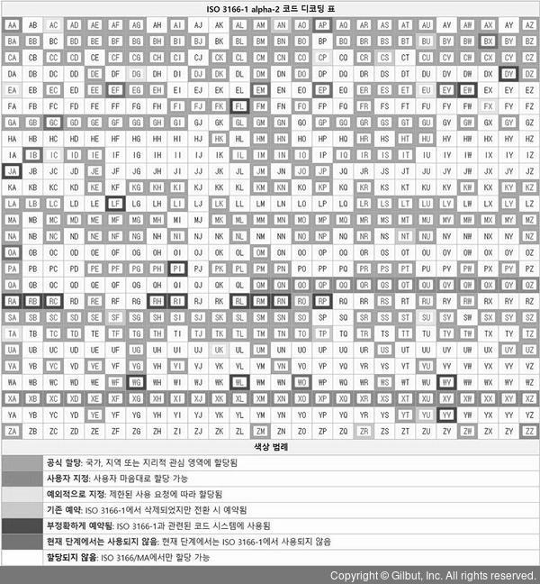
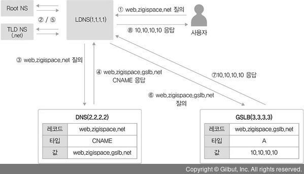
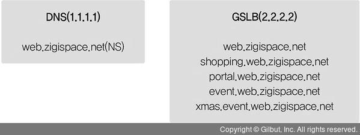

# 7강 통신을 도와주는 네트워크 주요 기술

사용자가 IP 설정을 하지 않더라도 IP 주소를 자동으로 할당해주는 DHCP(Dynamic Host Configuration Protocol) <br/>
사용자가 복잡한 목적지 IP 를 기억하지 않고 쉬운 도메인 이름을 사용하도록 도메인 이름과 IP 주소를 매핑해주는 DNS(Domain Name System) <br/>
사용자가 가장 가까운 지역의 데이터 센터에 접속해 신속한 서비스를 받게 해주는 GSLB(Global Service Load Balancing) <br/>
하나의 IP를 사용해 여러 단말 장비를 포함하는 네트워크를 손쉽게 구축하도록 도와주는 NAT 을 알아보자

## NAT/PAT

NAT(Network Address Translation , 네트워크 주소 변환)는 사용자 모르게 실생활에서 많이 사용하는 기술입니다.

가정에서 사용하는 노트북과 PC 는 공유기를 통해서 통신사에 LTE 나 5G로 연결된 스마트폰은 통신사 장비 어디선가 NAT을 수행해 외부와 통신하게 됩니다.

회사 네트워크에서도 NAT 와 PAT을 매우 많이 사용합니다. 라우터나 L3 스위치와 같은 L3 장비에서도 쓰이고 특히 방화벽과 로드 밸런서와 같이 세션을 다루는 L4 이상의 장비에서는 매우 빈번히 사용되는 기술입니다.

NAT는 이름 그대로 네트워크 주소를 변환하는 기술입니다. NAT은 기본적으로 하나의 네트워크 주소에 다른 하나의 네트워크 주소로 변환하는 1:1 변환이 기본이지만 IP 주소가 고갈되는 문제를 해결하기 위해 1:1 변환이 아닌 여러 개의 IP를 하나의 IP로 변환하기도 합니다. 여러 개의 IP 를 하나의 IP로 변환하는 기술도 NAT 기술 중 하나이고 NAT로 통칭하여 불리기도 하지만 실제 공식 용어는 NAPT(Network Address Port Translation , RFC2663) 입니다.

NAPT의 경우 실무에서는 PAT(Port Address Translation)라는 용어로 더 많이 사용되기 때문에 여기서도 PAT이라는 용어를 사용하겠습니다.

"NAT는 IP 주소를 다른 IP 주소로 변환해 라우팅을 원할히 해주는 기술" 이라고 인터넷 표준 문서에서 정의하고 있습니다. <br/>
사설 IP 에서 공인 IP로 전환하는 것뿐만 아니라 공인 IP에서 사설 IP로 주소를 전환할 수 있고 사설 IP에서 또 다른 사설 IP나 공인 IP에서 또 다른 공인 IP로의 전환도 NAT로 정의될 수 있습니다.

이 개념을 좀 더 확장하면 IPv4 주소를 IPv6로 변환하거나 그 반대로 IP 주소를 변환하는 기술인 AFT(Address Family Translation)도 NAT 기술의 일종입니다. 이렇듯 다양한 NAT 기술과 방법이 존재하지만 NAT가 가장 많이 사용되는 경우는 사설 IP 주소에서 공인 IP 주소로 전환하는 경우입니다.

NAT는 서비스의 전체 흐름을 파악하는 데 매우 중요한 요소입니다.

### 1. NAT/PAT의 용도와 필요성

#### IPv4 주소 고갈 문제의 솔루션으로 NAT가 사용됩니다

인터넷 대중화로 갑자기 폭증한 IP 주소 요구를 극복하기 위해 단기,종기,장기의 3단계 IP 보존과 전환전략을 수립했습니다. 이 전략이 매우 잘 만들어졌고 실제 환경에서도 유용하게 쓰이면서 IPv4 주소 부족 문제가 많이 해소되었습니다.

물론 현재는 IPv4 주소 할당이 끝나면서 신규로 할당 가능한 IPv4 주소가 없는 상태이고 IPv6 주소 체계 전환을 일부 분야에서는 매우 많이 진행하고 있습니다. IPv4 주소 보존전략 중 단기 전략은 서브네팅, 중기 전략은 NAT와 사설 IP 체계, 장기 전략은 IPv6 전환이었습니다.

그중 NAT을 이용한 중기 전략이 IPv4 주소 보존에 큰 기여를 했는데 외부에 공개해야 하는 서비스에 대해서는 공인 IP를 사용하고 외부에 공개할 필요가 없는 일반 사용자의 PC나 기타 종단 장비에 대해서는 사설 IP를 사용해 꼭 필요한 곳에만 효율적으로 IP를 사용할 수 있게 되었습니다.

#### 보안을 강화하는데 NAT 기술을 사용합니다

IP 주소는 네트워크에서 유일해야 하고 이 정보가 식별자로 사용되어 외부와 통신하게 해줍니다. 외부와 통신할 때 내부 IP를 다른 IP로 변환해 통신하면 외부에 사내 IP 주소 체계를 숨길 수 있습니다.


NAT는 주소 변환 후 역변환이 정상적으로 다시 수행되어야만 통신이 가능합니다. 이 성질을 이용해 복잡한 룰 설정 없이 방향성을 통제할 수 있습니다. 내부 네트워크에서 외부 네트워크로 나가는 방향 통신은 허용하지만 외부에서 시작해 내부로 들어오는 통신은 방어할 수 있습니다. NAT/PAT의 이런 성질을 이용해 보안을 쉽게 강화할 수 있습니다.

#### IP 주소 체계가 같은 두 개의 네트워크 간 통신을 가능하게 해줍니다.

IP 네트워크에서 서로 통신하려면 식별 가능한 유일한 IP 주소가 있어야 합니다. 공인 IP는 인터넷에서 유일한 주소로 IP주소가 중복되면 안되지만 사설 IP는 외부와 통신할 때 공인 IP로 변환되어 통신하므로 서로 다른 회사에서 중복해 사용할 수 있습니다.

회사 내부에서 사설 IP를 독립적으로 사용한다면 상관없지만 사설 IP 를 이용해 다른 회사와 직접 연결해야 하거나 회사 간 합병으로 서로 통신해야 한다면 사설 IP 주소가 충돌할 수 있습니다


특히 대외계라고 부르는 회사 간 통신에서 이런 상황이 많이 발생합니다. 카드사나 은행 간 연결이 대표적인 대외계 네트워크입니다. 최근 이런 카드, 금융 대외사와 서비스를 연동할 때 인터넷 구간을 이용해 통신하기도 하지만 개인정보 보호와 각종 법규 준수(Compliance)로 아직도 별도 전용 회선이나 암호화된 별도 네트워크를 이용해 통신합니다.

IP 대역이 같은 네트워크와 통신할 가능성이 높은 대외계 네트워크를 연결하기 위해 출발지와 도착지를 한꺼번에 변환하는 "더블 나트(Double NAT)" 기술을 사용합니다.

#### 불필요한 설정 변경을 줄일 수 있습니다

KISA를 통해 인터넷 독립기관으로 직접 등록하고 소유한 IP 주소를 직접 운영하는 경우가 아니라면 통신사업자나 IDC 쪽에서 IP를 할당받아 사용하게 됩니다. 이 IP들은 자신이 소유한 것이 아닌 임시로 빌려 사용하는 것이므로 회선 사업자를 바꾸거나 IDC를 이전하면 그동안 빌려 써왔던 공인 IP를 더 이상 사용할 수 없고 신규 사업자가 빌려주는 IP로 변경해야 합니다.

만약 사용자가 NAT/PAT을 이용해 내부 네트워크를 구성하고 있었다면 서버와 PC의 IP 주소 변경 없이 회선과 IDC 사업자 이전이 가능합니다. 물론 외부에 서비스하던 공인 IP 주소가 변경되므로 DNS 서비스나 NAT를 수행하는 네트워크 장비의 설정은 변경해야 하지만 내부 서버나 PC 설정 변경을 최소화 할 수 있어 NAT/PAT 기술을 적용하면 복잡한 작업을 많이 줄일 수 있습니다. 이런 설계는 특정 사업자에 종속되지 않는 유연한 인프라스트럭처의 기본 요소로 비즈니스 유연성을 높이는 데 매우 중요한 기술로 활용됩니다.

#### NAT 단점

NAT 기술의 단점은 네트워크 운영가 입장에서 IP가 변환되면 장애가 발생했을 때 문제 해결이 힘듦니다. <br/>
애플리케이션 개발자는 NAT 환경이 대중화되면서 애플리케이션을 개발할 때 더 많은 고려사항이 생겼습니다. <br/>
IPv6 전환은 IPv4 주소 부족 해결이라는 중요한 목표가 있었지만 이런 어려움을 주는 NAT을 인터넷에서 없애는 목표도 있습니다. <br/>
NAT 로 인해 주소가 변환되면서 단말 간 직접적인 연결성이 무너졌고 이로 인해 개발자들이 애플리케이션을 제작할 때 NAT환경을 항상 고려해야 하는 상황이 되었습니다. 또한, NAT의 이런 한계를 극복하기 위해 NAT 밑에 있는 단말도 직접 연결하게 도와주는 홀 펀칭(Hole Punching) 기술이 나오고 이 기술을 이용하기 위해 애플리케이션이 더 복작해지는 악순환이 계속 되었습니다.

### 2. NAT 동작 방식


NAT의 동작 방식을 이해하기 위해 출발지 사용자(10.10.10.10)가 목적지 웹 서버(20.20.20.20)로 통신하는 과정을 살펴보겠습니다.

1. 사용자는 웹 서버에 접근하기 위해 출발지 IP 10.10.10.10으로, 목적지 IP 와 서비스 포트는 20.20.20.20:80 으로 패킷을 전송합니다. 출발지 서비스 포트는 임의의 포트로 할당됩니다. 여기서는 2000번 포트로 가정했습니다.
2. NAT 역할을 수행하는 장비에서는 사용자가 보낸 패킷을 수신한 후 NAT 정책에 따라 외부 네트워크와 통신이 가능한 공인 IP 인 11.11.11.11로 IP 주소를 변경합니다. NAT장비에서 변경 전후의 IP 주소는 NAT 테이블에 저장됩니다.
3. NAT 장비에서는 출발지 주소를 11.11.11.11로 변경해 목적지 웹 서버로 전송합니다.
4. 패킷을 수신한 웹 서버는 사용자에게 응답을 보냅니다. 응답이므로 수신한 애용과 반대로 출발지는 웹서버(20.20.20.20)가 되고 목적지는 NAT장비에 의해 변환된 공인 IP 11.11.11.11 로 사용자에게 전송합니다.
5. 웹 서버로부터 응답 패킷을 수신한 NAT 장비는 자신의 NAT 테이블에서 목적지 IP 에 대한 원래 패킷을 발생시킨 출발지 IP 주소가 10.10.10.10인 것을 확인합니다.
6. NAT 변환 테이블에서 확인된 원래 패킷 출발지 IP(10.10.10.10)로 변경해 사용자에게 전송하면 사용자는 최종적으로 패킷을 수신합니다.

### 3. PAT 동작 방식


1. 사용자가 웹 서버로 접근하기 위해 패킷에 출발지 10.10.10.10, 목적지 20.20.20.20. 목적지 서비스 포트는 웹 서비스 포트인 80 으로 채워 패킷을 전송합니다. 출발지 서비스 포트는 NAT와 마찬가지로 임의의 서비스 포트가 할당되며 이 예제에서는 2000번 포트로 할당되었다고 가정합니다.
2. NAT 장비는 사용자가 보낸 패킷을 받아 외부 네트워크와 통신이 가능한 공인 IP인 11.11.11.11 로 변경합니다. 다만 출발지에 있는 다수의 사용자가 동인한 공인 IP로 변환되어야 하므로 패킷의 주소 변경 시 출발지 IP 뿐만아니라 출발지의 서비스ㅇ 포트도 변경됩니다. 출발지 IP 출발지 서비스 포트는 NAT 장비에 의해 모두 변경되고 NAT 장비가 이 변경 정보를 NAT 테이블에 기록합니다.
3. NAT 장비에서 변경된 출발지 IP 주소인 11.11.11.11과 서비스 포트 3000으로 패킷을 재작성해 웹 서버로 다시 전송합니다.
4. 사용자가 보낸 패킷을 수신한 웹 서버는 사용자에게 패킷을 응답하는데 출발지 IP는 웹 서버의 IP 주소인 20.20.20.20으로 채워지고 목적지 IP는 NAT 장비에 의해 변환된 공인 IP 11.11.11.11 과 서비스 포트로 채워져 전송합니다.
5. 웹 서버로부터 응답 패킷을 수신한 NAT 장비는 NAT 테이블을 확인해 웹 서버로부터 받은 패킷의 목적지 IP 주소인 11.11.11.11 이 원래 10.10.10.10 이며 서비스 포트 3000이 원래 2000인 것을 확인합니다.
6. NAT 장비는 NAT 테이블에서 확인한 목적지 IP 주소와서비스 포트로 패킷을 재작성한 후 사용자에게 전달합니다. 사용자는 NAT장비에서 역변환된 패킷을 받아 웹 페이지를 표시합니다.

만약 다른 IP를 가진 사용자가 동일하게 20.20.20.20 서버로 접속하는 경우, NAT 장비에서는 출발지 IP만 11.11.11.11 로 동일하게 변경하고 서비스 포트는 다른 포트로 변경합니다.

즉, PAT 동작 방식은 NAT와 거의 동일하게 이루어지지만 IP 주소뿐만 아니라 서비스 포트까지 함께 변경해 NAT 테이블을 관리하므로 하나의 IP만으로도 다양한 포트 번호를 사용해 사용자를 구분할 수 있습니다.

하지만 이 서비스 포트의 개수는 제한되어 있어 재사용됩니다. 만약 서비스 포트가 동시에 모두 사용중이거나 재사용이 불가능할 때는 PAT이 정상적으로 동작하지 않습니다. 따라서 동시 사용자가 매우 많을 때는 PAT에서 사용하는 공인 IP 주소를 IP 하나가 아닌 풀(Pool)로 구성해야 합니다.

PAT는 다수의 IP가 있는 출발지에서 목적지로 갈 때 NAT 테이블이 생성되고 응답에 대해 NAT 테이블을 참조할 수 있지만 PAT IP 가 목적지일 때는 해당 IP 가 어느 IP에 바인딩되는지 확인할 수 있는 NAT 테이블이 없으므로 사용할 수 없습니다. 즉, PAT는 뒤에서 다룰 SNAT와 DNAT중 SNAT에 대해서만 적용되고 DNAT에는 적용되지 않습니다.


### 4. SNAT와 DNAT

NAT을 사용해 네트워크 주소를 변환할 때 어떤 IP 주소를 변환하는지에 따라 두가지로 구분합니다

```
SNAT (Source NAT) : 출발지 주소를 변경하는 NAT
DNAT (Destination NAT) : 도착지 주소를 변경하는 NAT
```


SNAT와 DNAT는 트래픽이 출발하는 시작 지점을 기준으로 구분합니다. 어떤 주소를 변경해야 하는지는 서비스 흐름과 목적에 따라 결정됩니다. 앞에서 말했듯이 SNAT와 DNAT의 기준은 NAT가 수행되기 이전의 트래픽이 출발하는 시작 지점입니다. 즉, 요청 시 SNAT를 해 목적지로 전송하면 해당 트래픽에 대한 응답을 받을 때는 출발지와 목적지가 반대가 되므로 DNAT가 되는데 이때 트래픽을 요청하는 시작 지점만 고려해 SNAT 설정을 해야 합니다.

NAT 장비를 처음 통과할 때 NAT 테이블을 사용해 반대로 패킷을 변환해줄 수 있기 때문입니다. 이 과정을 역 NAT라고 하며 NAT가 정상적으로 수행되려면 역 NAT 과정이 함께 수행되어야 합니다.

#### Source NAT (SNAT)

SNAT는 사설에서 공인으로 통신할 때 많이 사용합니다.

공인 IP 주소의 목적지에서 출발지로 다시 응답을 받으려면 출발지 IP 주소 경로가 필요한데 공인 대역에서는 사설 대역으로의 경로를 알 수 없으므로 공인 IP의 목적지로 서비스를 요청할 때 출발지에서는 사설 IP를 별도의 공인 IP로 NAT해 서비스를 요청해야 합니다. 그래야 해당 요청을 받은 목적지에서 출발지 IP를 공인 IP로 확인해 다시 응답할 수 있는 경로를 찾을 수 있습니다. 이것은 공유기처럼 PAT를 사용하는 경우에 해당할 수 있습니다.

다른 경우는 보안상 SNAT을 사용할 때입니다. 회사에서 다른 대외사와 통신 시 내부 IP 주소가 아니라 별도의 다른 IP로 전환해 전송함으로써 대외에 내부의 실제 IP 주소를 숨길 수 있습니다. 보안상의 문제뿐만 아니라 대외사와 통신해야 하는 사내 IP가 대외사의 사내 IP 대역과 중복될 때 SNAT을 통해 중복되지 않는 다른 IP로 변경해 통신하는 데 사용할 수 있습니다. 이 경우는 앞에서 말한 사설에서 공인으로 통신해야 하는 경우와 비슷하지만 이 경우에는 변경되는 IP가 반드시 공인일 필요는 없습니다.

로드 밸런서의 구성에 따라 SNAT을 사용하기도 합니다. 출발지와 목적지 서버가 동일한 대역일 때는 로드 밸런서 구성에 따라 트래픽이 로드 밸런서를 거치지 않고 응답할 수 있어 SNAT을 통해 응답 트래픽이 로드 밸런서를 거치게 할 수 있습니다.


#### Destination NAT (DNAT)

DNAT는 로드 밸런서에서 많이 사용합니다. 사용자는 서비스 요청을 위해 로드 밸런서에 설정된 서비스 VIP(Virtual IP)로 서비스를 요청하고 로드 밸런서에서는 서비스 VIP를 로드 밸런싱될 서버의 실제 IP로 DNAT해 내보냅니다.

사내가 아닌 대외망과 네트워크 구성에도 DNAT을 사용합니다. 사내 IP 주소는 중앙에서 일괄적으로 관리되므로 IP가 중복되는 경우가 없지만 사내가 아닌 대외망과의 연동에서는 IP 중복이 될 수 있습니다.

설사 IP가 중복되지 않더라도 IP 주소가 제각각이므로 신규 대외사와의 연동마다 라우팅을 개별적으로 설정해야 합니다. 이 경우, 대외망에 NAT 장비를 이용해 대외사의 IP를 특정 IP 대역으로 NAT 합니다. 사내에서는 어떤 대외사든 대외망 전용 NAT 대역으로 변경된 네트워크 대역으로 라우팅 처리하면 되므로 대외사 추가에 따라 별도 라우팅을 개별적으로 설정할 필요가 없고 사내 IP 와 중복되는 IP가 있더라도 라우팅 이슈 없이 구성할 수 있습니다.


<br/>

### 5. 동적 NAT와 정적 NAT

```
정적 NAT : 출발지와 목적지의 IP를 미리 매핑해 고정해놓은 NAT
동적 NAT : 출발지나 목적지 어느 경우든 사전에 정해지지 않고 NAT를 수행할 때 IP를 동적으로 변경하는 것
```

#### 동적 NAT

동적 NAT은 출발지와 목적지가 모두 정의된 것이 아니라 다수의 IP 풀에서 정해지므로 최소한 출발지나 목적지 중 한 곳이 다수의 IP 로 구성된 IP 풀이나 레인지(Range)로 설정되어 있습니다. NAT가 필요할 때 IP 풀에서 어떤 IP 로 매핑될 것인지 판단해 NAT을 수행하는 시점에서 NAT 테이블을 만들어 관리합니다.

NAT 테이블은 설정된 시간 동안 유지되고 일정 시간 동안 통신이 없으면 다시 사라지므로 (NAT 테이블 타임아웃) 동적 NAT의 설정은 서비스 흐름을 고려해 적용해야 합니다.

#### 정적 NAT

정적 NAT는 출발지와 목적지 매핑 관계가 특정 IP로 사전에 정의된 것이므로 1:1 NAT라고 부르기도 합니다. 실제 IP 매핑도 A라는 IP와 B라는 IP가 항상 고정되어 매핑된 상태이므로 서비스 방향에 따라 고려할 필요가 없습니다. 즉, 방향성 없이 서비스 흐름을 고려하지않고 NAT을 설정 할 수 있습니다.

|                     |                     동적 NAT                     |             정적 NAT             |
| :-----------------: | :----------------------------------------------: | :------------------------------: |
|      NAT 설정       |                  1:N , N:1, N:M                  |               1:1                |
|     NAT 테이블      |                 NAT 수행시 생성                  |            사전 생성             |
| NAT 테이블 타임아웃 |                       동작                       |               없음               |
|    NAT 수행정보     | 실시간으로만 확인하거나 별도 변경 로그 저장 필요 | 별도 필요 없음 (설정 = NAT 내역) |


<br/>

## DNS

네트워크 프로토콜은 크게 두가지로 나눌 수 있습니다.

```
데이터 프로토콜
: 실제로 데이터를 실어나르는 프로토콜

컨트롤 프로토콜
: 데이터 프로토콜이 잘 동작하도록 도와주는 프로토콜
: 통신에 직접 관여하지 않지만 처음 통신 관계를 맺거나 유지하는 데 큰 역할을 함
: ARP , ICMP , DNS 가 있음
```

### 1. DNS 소개

숫자로 구성된 IP 주소보다 의미있는 문자열로 구성된 도메인 주소가 우리가 인식하고 기억하기 더 쉽니다. 물론 서비스를 도메인 주소를 사용하더라도 실제로 패킷을 만들어 통신하려면 3계층 IP 주소를 알아야 하고 이를 위해 도메인 주소를 IP 주소로 변환하는 DNS(Domain Name Service) 정보를 네트워크 설정 정보에 입력해야 한다.


윈도우 용

리눅스 용

사용자가 도메인 주소를 사용하여 서비스를 요청하면 네트워크 설정에 입력한 DNS로 해당 도메인에 대한 IP 주소 질의를 보내고 해당 요청한 도메인의 서비스 IP 주소를 받게 됩니다.


### 2. DNS 구조와 명명 규칙

도메인은 계층 구조여서 수많은 인터넷 주소 중 원하는 주소를 효율적으로 찾아갈 수 있습니다.

역트리 구조로 최상위 루트부터 Top-Level 도메인 , Second-Level 도메인 , Third-Level 도메인과 같이 하위 레벨로 원하는 주소를 단계적으로 찾아 갑니다. 우리가 도메인 주소를 사용할 때는 각 계층의 경계를 “.”으로 표시하고 뒤에서 앞으로 해석합니다. Third.second.top.과 같은 형태로 표현하고 맨 뒤의 루트는 생략됩니다. www.naver.com의 경우, 맨 뒤에 생략된 루트(.)를 시작으로 Top-Level인 com, Second-Level인 naver, Third-Level인 www와 같이 뒤에서 앞으로 해석됩니다.


도메인 계층은 최대 128계층까지 구성할 수 있습니다. 계층별 길이는 최대 63바이트까지 사용할 수 있고 도메인 계층을 구분하는 구분자 "." 를 포함한 전체 도메인 네임의 길이는 최대 255까지 사용할 수 있습니다.

#### 루트 도메인

루트 도메인은 앞에서 말했듯이 도메인을 구성하는 최상위 영역입니다. DNS 서버는 사용자가 쿼리한 도메인에 대한 값을 직접 갖고 있거나 캐시에 저장된 정보를 이용해 응답합니다. 만약 DNS 서버에 해당 도메인의 정보가 없으면 루트 도메인을 관리하는 루트 DNS에 쿼리하게 됩니다.

루트 DNS는 전 세계에 13개가 있고 DNS 서버를 설치하면 루트 DNS의 IP 주소를 기록한 힌트(Hint) 파일을 가지고 있어 루트 DNS 관련 정보를 별도로 설정할 필요가 없습니다.

|    호스트 이름     |              IP 주소              |               관리 기관                |
| :----------------: | :-------------------------------: | :------------------------------------: |
| a.root-servers.net |  198.41.0.4, 2001:503:ba3e::2:30  |             VeriSign, Inc.             |
| b.root-servers.net |  192.228.79.201, 2001:500:84::b   | University of Southern California(ISI) |
| c.root-servers.net |    192.33.4.12, 2001:500:2::c     |         Cogent Communications          |
| d.root-servers.net |    199.7.91.13, 2001:500:2d::d    |         University of Maryland         |
| e.root-servers.net |  192.203.230.10, 2001:500:a8::e   |       NASA(Ames Research Center)       |
| f.root-servers.net |    192.5.5.241, 2001:500:2f::f    |   Internet Systems Consortium, Inc.    |
| g.root-servers.net |  192.112.36.4, 2001:500:12::d0d   |     US Department of Defense(NIC)      |
| h.root-servers.net |   198.97.190.53, 2001:500:1::53   |         US Army (Research Lab)         |
| i.root-servers.net |    192.36.148.17, 2001:7fe::53    |                 Netnod                 |
| j.root-servers.net | 192.58.128.30, 2001:503:c27::2:30 |             VeriSign, Inc.             |
| k.root-servers.net |     193.0.14.129, 2001:7fd::1     |                RIPE NCC                |
| l.root-servers.net |   199.7.83.42, 2001:500:9f::42    |                 ICANN                  |
| m.root-servers.net |    202.12.27.33, 2001:dc3::35     |              WIDE Project              |

윈도 서버에 DNS 서비스를 활성화 하면 DNS 서비스에 기본으로 저장되어 있는 루트 서버 리스트 정보를 확인할 수 있습니다.


#### Top-Level Domain(TLD)

최상위 도메인인 TLD는 IANA(Internet Assigned Numbers Authority)에서 구분한 6가지 유형으로 구분할 수 있습니다. 각 유형은 다음과 같으며 전체 리스트는 IANA 사이트(https://www.iana.org/domains/root/db)에서 확인할 수 있습니다.

```
• Generic(gTLD)
• country-code(ccTLD)
• sponsored(sTLD)
• infrastructure
• generic-restricted(grTLD)
• test(tTLD)
```

#### Generic TLD(gTLD)

gTLD는 특별한 제한없이 일반적으로 사용되는 최상위 도메인이며 세 글자 이상으로 구성됩니다. 초기 gTLD는 1980년대 7개의 gTLD(.com, .edu, .gov, .int, .mil, .net, .org)로 시작했으며 필요에 의해 새로운 gTLD가 지속적으로 만들어지고 있습니다.


#### Country Code TLD(ccTLD)

ccTLD는 국가 최상위 도메인으로 ISO 3166 표준에 의해 규정된 두 글자의 국가 코드를 사용합니다. 우리나라는 ‘kr’을 사용합니다. 일반적으로 ccTLD를 사용하는 경우, Second Level TLD에는 gTLD에서 구분한 것처럼 사이트 용도에 따른 코드를 사용합니다. 예를 들어 일반 회사는 co.kr을 사용하고 정부기관은 go.kr을 사용하는 방법입니다. 우리나라는 gTLD를 두 글자로 줄여 사용하지만 호주나 대만처럼 gTLD를 그대로 사용하는 나라도 있습니다(com.au, gov.au, com.tw, gov.tw 등). 영국은 ISO 3166 표준이 아닌 uk라는 별도 ccTLD를 사용합니다. 그림 7-15는 ccTLD에 대한 표준 코드표입니다. 이처럼 다양한 국가별 코드가 정의되어 사용된다는 것을 알 수 있습니다. 할당에 대한 세부 구분은 그림에 있는 위키피디아 링크를 참고하면 확인할 수 있습니다.

<br/>
▲ 그림 7-15 대부분의 인터넷 국가 도메인에 적용되는 ISO 3166-1 alpah-2 코드

#### Sponsored(sTLD)

sTLD는 특정 목적을 위한 스폰서를 두고 있는 최상위 도메인입니다. 스폰서는 특정 민족공동체, 전문가 집단, 지리적 위치 등이 속할 수 있습니다. sTL의 종류에는 ‘.aero’, ‘.asia’, ‘.edu’, ‘.museum’ 등이 있습니다.

#### Infrastructure

운용상 중요한 인프라 식별자 공간을 지원하기 위해 전용으로 사용되는 최상위 도메인입니다. Infrastructure에 속하는 TLD는 ‘.arpa’입니다. ‘.arpa’는 인터넷 안정성을 유지하기 위해 새로운 모든 인프라 하위 도메인이 배치될 도메인 공간 역할을 합니다. ‘.IN-ADDR.ARPA’가 이런 .‘arpa’의 하위 도메인 중 하나로 IPv4 주소를 도메인 이름에 매핑하는 역방향 도메인에서 사용합니다.

#### Generic-restricted(grTLD)

grTLD는 특정 기준을 충족하는 사람이나 단체가 사용할 수 있는 최상위 도메인입니다. grTLD의 종류에는 ‘.biz’, ‘.name’, ‘.pro’가 있습니다.

#### Test(tTLD)

tTLD는 IDN(Internationalized Domain Names) 개발 프로세스에서 테스트 목적으로 사용하는 최상위 도메인입니다. tTLD의 종류에는 ‘.test’가 있습니다.

### 3. DNS 동작 방식

도메인을 IP 주소로 변환하려면 DNS 서버에 도메인 쿼리하는 과정을 거쳐야 합니다. 하지만 DNS 서버없이 로컬에 도메인과 IP 주소를 직접 설정해 사용할 수도 있습니다. 로컬에서 도메인과 IP 주소를 관리하는 파일을 hosts 파일이라고 합니다. hosts 파일에 도메인과 IP 주소를 설정해두면 해당 도메인 리스트는 항상 DNS 캐시에 저장됩니다.

도메인을 쿼리하면 DNS 서버에 쿼리를 하기 전 로컬에 있는 DNS 캐시 정보를 먼저 확인합니다. 동일한 도메인을 매번 질의하지 않고 캐시를 통해 성능을 향상시키기 위해서입니다. 이런 DNS 캐시 정보에는 기존 DNS 조회를 통해 확인한 동적 DNS 캐시와 함께 hosts 파일에 저장되어 있는 정적 DNS 캐시가 함께 저장되어 있습니다. DNS 캐시 정보에 필요한 도메인 정보가 없으면 DNS 서버로 쿼리를 수행하고 DNS 서버로부터 응답을 받으면 그 결과를 캐시에 먼저 저장합니다. 전에 쿼리를 한 번 수행한 DNS 정보는 캐시부터 조회하므로 DNS 서버에 별도로 쿼리하지 않고 캐시 정보를 사용합니다.

그림 7-16은 윈도에서 DNS 캐시를 확인한 결과입니다. 윈도에서 DNS 캐시를 확인하려면 명령창에서 ‘ipconfig /displaydns’ 명령을 사용합니다

```
ipconfig /displaydns
```


인터넷이 상용화되기 전에는 인터넷에 연결된 단말이 많지 않았습니다. 스마트폰에 각자의 전화번호부를 저장하듯 각 단말에 hosts 파일을 넣어두고 그 안에 호스트 이름과 IP를 매핑하는 테이블이 있었습니다. hosts 파일이 정적 테이블이어서 단순하게 그 정보를 검색하면 간단히 주소 변환이 가능해 캐시 개념이 필요없었습니다. 인터넷이 상용화된 후 폭증하는 단말들을 중앙화된 체계로 수용하기 위해 DNS 체계가 만들어졌습니다. 기존 hosts 관리가 어려웠던 문제를 해결하기 위해 중앙집중식 시스템을 구성했고 폭증한 단말을 수용하기 위해 hosts처럼 플랫이 아닌 계층 구조를 채택했습니다. 기존 hosts 체계와 새로운 DNS 체계가 결합하면서 복잡해보이는 도메인 이름 쿼리 프로세스가 만들어졌습니다.

그림 7-17은 캐시와 DNS를 이용해 도메인 이름 쿼리를 하는 예제입니다. ‘zigispace.net’이라는 도메인을 쿼리하기 위해 먼저 로컬 캐시를 조회하고 로컬 캐시에 없으면 DNS 서버로 다시 쿼리해 도메인 쿼리를 수행합니다.


지금까지 클라이언트 관점에서 DNS 질의 과정을 설명했다면 지금부터는 반대로 DNS 시스템 관점에서 도메인에 대한 결괏값을 클라이언트에 보내주는 과정을 살펴보겠습니다.

전 세계 도메인 정보를 DNS 서버 하나에 저장할 수는 없습니다. 데이터 자체도 방대하지만 인터넷에 엄청나게 많은 사용자가 등록하고 삭제하는 도메인 리스트를 실시간으로 업데이트할 수 없기 때문입니다. 그래서 DNS는 분산된 데이터베이스로 서로 도와주도록 설계되었는데 자신이 가진 도메인 정보가 아니면 다른 DNS에 질의해 결과를 받을 수 있습니다. DNS 기능을 서버에 올리면 DNS 서버는 기본적으로 루트 DNS 관련 정보를 가지고 있습니다. 클라이언트의 쿼리가 자신에게 없는 정보라면 루트 DNS에 쿼리하고 루트 DNS에서는 쿼리한 도메인의 TLD 값을 확인해 해당 TLD 값을 관리하는 DNS가 어디인지 응답합니다.

예를 들어 zigispace.net이라는 도메인을 클라이언트가 DNS 서버에 쿼리했다면 DNS 서버는 루트 DNS에 다시 쿼리하고 루트 DNS는 .net에 대한 정보를 관리하는 DNS 주소 정보를 DNS 서버에 응답합니다. 이 응답을 받은 DNS 서버는 .net을 관리하는 DNS 서버에 zigispace.net에 대해 쿼리합니다. .net을 관리하는 DNS 서버는 다시 zigispace.net을 관리하는 DNS 관련 정보를 처음 DNS 서버에 응답합니다. DNS 서버는 마지막으로 zigispace.net을 관리하는 DNS에 쿼리하고 zigispace.net에 대한 최종 결괏값을 받게 됩니다. 처음 쿼리를 받은(클라이언트에 DNS 서버로 설정된) DNS 서버는 이 정보를 클라이언트에 응답합니다.

전체 과정을 보면 클라이언트에서 처음 질의를 받은 DNS가 중심이 되어 책임지고 루트 DNS부터 상위 DNS에 차근차근 쿼리를 보내 결괏값을 알아낸 후 최종 결괏값만 클라이언트에 응답합니다. 클라이언트는 한 번의 쿼리를 보내지만 이 요청을 받은 DNS 서버는 여러 단계로 쿼리를 상위 DNS 서버에 보내 정보를 획득합니다. 호스트가 DNS 서버에 질의했던 방식을 재귀적 쿼리(Recursive Query)라고 하고 DNS 서버가 루트 NS와 TLS NS, zigispace NS에 질의한 방식을 반복적 쿼리(Iterative Query)라고 합니다.

```
참고 - 재귀적 쿼리(Recursive Query)와 반복적 쿼리(Iterative Query)

재귀적 쿼리는 쿼리를 보낸 클라이언트에 서버가 최종 결괏값을 반환하는 서버 중심 쿼리이고 반복적 쿼리는 최종값을 받을 때까지 클라이언트에서
쿼리를 계속 진행하는 방식입니다.
일반적으로 재귀적 쿼리는 클라이언트와 로컬 DNS 간에서 사용하고 반복적 쿼리는 로컬 DNS 서버와 상위 DNS 구간에서 사용합니다.
이때 로컬 DNS는 클라이언트로 동작해 상위 DNS에 반복적으로 쿼리합니다.
```


```
1. 사용자 호스트는 ‘zigispace.net’이라는 도메인 주소의 IP 주소가 로컬 캐시에 저장되어 있는지 확인합니다.
2. ‘zigispace.net’이 로컬 캐시에 저장되어 있지 않으면 사용자 호스트에 설정된 DNS에 ‘zigispace.net’에 대해 쿼리합니다.
3. DNS 서버는 ‘zigispace.net’이 로컬 캐시와 자체에 설정되어 있는지 직접 확인하고 없으면 해당 도메인을 찾기 위해 루트 NS에 .net에 대한 TLD 정보를 가진 도메인 주소를 쿼리합니다.
4. 루트 DNS는 ‘zigispace.net’의 TLD인 ‘.net’을 관리하는 TLD 네임 서버 정보를 DNS 서버에 응답합니다.
5. DNS는 TLD 네임 서버에 ‘zigispace.net’에 대한 정보를 다시 쿼리합니다.
6. TLD 네임 서버는 ‘zigispace.net’에 대한 정보를 가진 zigi 네임 서버에 대한 정보를 DNS 서버로 응답합니다.
7. DNS는 zigi 네임 서버에 ‘zigispace.net’에 대한 정보를 쿼리합니다.
8. zigi 네임 서버는 ‘zigispace.net’에 대한 정보를 DNS 응답합니다.
9. DNS는 ‘zigispace.net’에 대한 정보를 로컬 캐시에 저장하고 사용자 호스트에 ‘zigi space.net’에 대한 정보를 응답합니다.
10. 사용자 호스트는 DNS로부터 받은 ‘zigispace.net’에 대한 IP 정보를 이용해 사이트에 접속합니다.
```

### 4. 마스터와 슬레이브

DNS 서버는 마스터(Master, Primary) 서버와 슬레이브(Slave, Secondary) 서버로 나눌 수 있습니다. 마스터 서버가 우선순위가 더 높지 않고 두 서버 모두 도메인 쿼리에 응답합니다. 마스터와 슬레이브는 도메인에 대한 존(Zone) 파일을 직접 관리하는지 여부로 구분합니다. 마스터 서버는 존 파일을 직접 생성해 도메인 관련 정보를 관리하고 슬레이브 서버는 마스터에 만들어진 존 파일을 복제합니다. 이 과정을 ‘영역 전송(Zone Transfer)’이라고 합니다. 마스터 서버는 도메인 영역을 생성하고 레코드를 직접 관리하지만 슬레이브 서버는 마스터 서버에 설정된 도메인이 가진 레코드값을 정기적으로 복제합니다.


도메인 영역 전송을 위해 슬레이브 서버를 만들 때 도메인을 복제해올 마스터 서버 정보를 입력해야 합니다. 마스터 역할을 하는 서버에서는 자신이 가진 도메인 정보를 인가받지 않은 다른 DNS 서버가 복제해가지 못하도록 슬레이브 서버를 지정해 복제를 제한할 수 있습니다.

마스터에서 별 다른 설정을 하지 않으면 무제한 복제가 가능하므로 보안을 위해 복제 가능한 슬레이브 서버 정보를 반드시 입력하는 것이 좋습니다. 윈도 DNS 에서 개별 도메인별로 영역 전송에 대한 옵션을 보면 영역 전소의 허용 여부나 영역 전송을 허용할 대상 서버를 지정할 수 있습니다.


DNS 마스터 서버와 슬레이브 서버는 이중화에서 일반적으로 사용하는 액티브-스탠바이(Active-Stanby) 나 액티브-액티브(Active-Active) 형태로 구성하지 않습니다.
보통 이중화 방식은 액티브 장비의 문제가 발생하더라도 또 다른 액티브나 스탠바이 장비가 그대로 서비스합니다.

반면, DNS 서버는 마스터 서버에 문제가 발생하고 일정 시간이 지나면 슬레이브 서버도 도메인에 대한 질의에 정상적으로 응답할 수 없습니다. 이 시간을 ㅁ나료 시간(Expiry Time)이라고 하고 SOA 레코드에 설정됩니다. 만료 시간안에 슬레이브 서버가 마스터 서버에서 존 정보를 받아오지 못하면 슬레이브 서버를 마스터로 전환해야만 서비스 장애를 막을 수 있습니다. 이런 도메인 타이머 관련 설정은 DNS 주요 레코드 절에서 다룰 SOA 레코드에서 지정할 수 있습니다.


```
윈도 DNS의 개별 도메인 속성 중 도메인 만료 시간 설정
```

```
참고 - 액티브-스탠바이와 액티브-액티브

네트워크 서비스나 시스템 내부의 컴포넌트 일부가 정상적으로 동작하지 않더라도 서비스가 지속될 수 있도록 고가용성(High Availability) 기술을 사용합니다.
고가용성을 위해 일반적으로 사용하는 구조는 액티브-액티브와 액티브 스탠바이입니다.

액티브-액티브는 두 개의 노드가 동시에 서비스를 제공하고 한 노드에 문제가 발생하면 다른 노드에서 서비스를 제공하는 방식입니다.
액티브-스탠바이는 두 개의 노드 중 액티브 노드만 서비스를 제공하고 스탠바이 노드는 대기하고 있다가 액티브 노드에 장애가 발생하면 서비스를 시작하는 방식입니다.

두 가지 모두 한 대의 노드에 장시간 문제가 생기더라도 두 대가 모두 죽지 않으면 정상적으로 서비스가 제공됩니다.
```

### 5. DNS 주요 레코드

도메인에는 다양한 내용을 매핑할 수 있는 레코드가 있습니다. 다양한 DNS 레코듣 중 주로 사용하는 몇 가지 레코드를 알아보겠습니다.

|      레코드 종류       |                     내용                     |
| :--------------------: | :------------------------------------------: |
|     A(IPv4 호스트)     |      도메인 주소를 IP 주소(IPv4)로 매핑      |
|   AAAA(IPv6 호스트)    |      도메인 주소를 IP 주소(IPv6)로 매핑      |
|      CNAME(별칭)       |           도메인 주소에 대한 별칭            |
|     SOA(권한 시작)     |          본 영역 데이터에 대한 권한          |
| NS(도메인의 네임 서버) |           본 영역에 대한 네임 서버           |
|    MX(메일 교환기)     | 도메인에 대한 메일 서버 정보(Mail eXchanger) |
|      PTR(포인터)       |       IP 주소를 도메인에 매핑(역방향)        |

#### A(IPv4) 레코드

A 레코드는 기본 레코드로 도메인 주소를 IP 주소로 변환하는 레코드입니다. 사용자가 DNS에 질의한 도메인 주소를 A 레코드에 설정된 IP 주소로 응답합니다. 하나의 A 레코드에는 한 개의 도메인 주소와 한 개의 IP 주소가 1:1로 매핑되는데 동일한 도메인을 가진 A 레코드를 여러 개 만들어 서로 다른 IP 주소와 매핑할 수 있습니다. 반대로 다수의 도메인에 동일한 IP를 매핑한 A 레코드를 만들 수 있습니다. 서버 한 대에 여러 웹 서비스를 구동해야 한다면 여러 도메인에 동일한 IP를 매핑하고 HTTP 헤더의 HOST 필드에 도메인을 명시에 웹 서버를 구분해 서비스할 수 있습니다.

#### AAAA(IPv6) 레코드

A 레코드가 IPv4 주소 체계에서 사용되는 레코드라면 AAAA 레코드는 IPv6 주소 체계에서 사용되는 레코드입니다. 역할은 A 레코드와 같습니다.

#### CNAME(Canonical Name) 레코드

CNAME 레코드는 별칭 이름을 사용하게 해주는 레코드입니다. 레코드값에 IP 주소를 매핑하는 A 레코드와 달리 CNAME 레코드는 도메인 주소를 매핑합니다. 네임 서버가 CNAME 레코드에 대한 질의를 받으면 CNAME 레코드에 설정된 도메인 정보를 확인하고 그 도메인 정보를 내부적으로 다시 질의한 결과 IP 값을 응답합니다. CNAME 레코드의 대표적인 예로 'www'가 있습니다.

```
참고 - CNAME을 사용하는 예

zigispace.net라는 웹사이트에 접속하려면 보통 'zigispace.net' 이나 'www.zigispace.net'으로 접속합니다.
'zigispace.net' 와 'www.zigispace.net'을 각각 A레코드로 매핑하면 IP 주소가 변경될 때 두 개의 레코드값을 모두 변경해야 하지만
'zigispace.net'만 A 레코드로 IP 주소를 매핑하고 'www.zigispace.net'은 CNAME으로서 'zigispace.net'으로 매핑하면 IP 주소가 변경될 때, 'zigispace.net'만
변경해도 동일한 결과값을 가져올 수 있습니다.
```


#### SOA(Start Of Authority) 레코드

도메인 여영ㄱ에 대한 권한을 나타내는 레코드입니다. 현재 네임 서버가 이 도메인 영역에 대한 관리 주체임을 의미하므로 해당 도메인에 대해서는 다른 네임 서버에 질의하지 않고 직접 응답합니다. 도메인 영역 선언 시 SOA 레코드는 필수 항목이므로 반드시 만들어야 합니다. 도메인 영역에 SOA 레코드를 만들지 않으면 해당 도메인은 네임 서버에서 정상적으로 동작할 수 없습니다.

그밖에 SOA 레코드는 현재 도메인 관리에 필요한 속성값을 설정합니다. 도메인 동기화에 필요한 타이머 값이나 TTL 값과 함께 도메인의 네임 서버나 관리자 정보도 SOA 레코드에서 설정합니다.


#### NS(Name Server) 레코드

도메인에 대한 권한이 있는 네임 서버 정보를 설정하는 레코드입니다. NS 레코드의 경우, 권한이 있는 네임 서버 정보를 해당 도메인에 설정하는 역할 외에 하위 도메인에 대한 권한을 다른 네임 서버로 위임(Delegate)하는 역할로도 사용됩니다. 위임 관련 내용은 뒤에서 더 자세히 다룹니다.

#### MX(Mail eXchange) 레코드

메일 서버를 구성할 때 레코드입니다. 해당 도메인을 메일 주소로 갖는 메일 서버를 MX 레코드를 통해 서넝ㄴ합니다. 메일 서버에서 메일을 보낼 때는 MX 레코드를 참조해 동작하는데 우선순위 값을 이용해 다수의 MX 레코드를 선언할 수 있습니다. 우선순위가 높은(값이 적은) 서버로 메일을 보내고 실패하면 다음 순서의 MX 레코드의 메일 서버에서 처리합니다.

#### PTR(Pointer) 레코드

A 레코드는 도메인 주소에 대한 질의를 IP로 응답하기 위한 레코드이고 PTR 레코드는 그와 반대로 IP 주소에 대한 질의를 도메인 주소로 응답하기 위한 레코드입니다. A 레코드가 정방향 조회용 레코드라면 PTR 레코드는 역방향 조회용 레코드입니다.

A 레코드와 달리 하나의 IP주소에 대해 하나의 도메인 주소만 가질 수 있습니다. 죽, 하나의 IP에 대한 PTR 레코드는 오직 하나만 가집니다. PTR 레코드는 주로 화이트 도메인 구성용으로 사용됩니다. 화이트 도메인은 화이트 도메인 절에서 더 자세히 다룹니다.

#### TXT(TeXT) 레코드

도메인에 대한 설명과 같이 간단한 텍스트를 입력할 수 있는 레코드입니다. 이 레코드를 특정 기능으로 사용할 수도 있는데 주로 사용되는 곳은 화이트 도메인을 위한 SPF 레코드입니다. TXT 레코드에는 공백도 포함할 수 있고 대소문자를 구분합니다. 최대 255자까지 사용할 수 있습니다.

### 6. DNS에서 알아두면 좋은 내용

이번장에서 DNS에서 알아두면 좋은 다음 주제를 다룹니다.

1. 도메인 위임
2. TTL
3. 화이트 도메인
4. 한급 도메인

도메인 위임은 GSLB 절에서 다루는 GSLB 구성 때도 사용되고 TTL은 도메인 변경작업을 위해 알아두면 좋습니다. 메일 서버 운영 시 필요한 화이트 도메인 개념과 기존 영문 도메인이 아니라 도메인을 한글로 운영하기 위한 한글 도메인까지 이번 장에서 다룹니다.

#### 도메인 위임(DNS Delegation)

도메인은 그 도메인에 대한 정보를 관리할 수 있는 네임 서버를 지정하지만 도메인 내의 모든 레코드를 그 네임 서버가 직접 관리하지 않고 일부 영역에 대해서는 다른 곳에서 레코드를 관리하도록 위임하기도 합니다. 이 방식은 도메인 위임이라고 합니다.

즉, 자신이 가진 도메인 관리 권한을 다른 곳으로 일부 위임해 위임한 곳에서 세부 레코드를 관리하도록 하는 것입니다. CDN 을 이용하거나 GSLB를 사용하는 것이 대표적인 경우입니다. 도메인은 계층 구조여서 특정 계층의 레코드를 위임하면 해당 레코드의 하위 계층은 함께 위임 처리됩니다.

zigispace.net을 관리하는 네임 서버는 'A' DNS 서버로 지정되어 있습니다. 'A' DNS 서버에는 home.zigispace.net , a.home.zigispace.net , blog.zigispace.net , b.blog.zigispace.net 에 대한 레코드 정보가 있습니다. 이때 zigispace.net 도메인 하위에 post 영역을 추가하고 이 영역을 'A' DNS 서버가 아닌 'B' GSLB에서 관리하려고 할 때 'A' DNS 서버에서 post 라는 영역의 관리 권한을 'B' GSLB 로 넘겨줄 수 있습니다. 이 방식을 위임이라고 합니다.

post 영역을 'B' GSLB로 위임하려면 해당 영역을 위임하겠다는 레코드 설정이 'A' DNS 서버에 들어가고 post.zigispace.net 을 포함한 하위 영역에 대한 세부 레코드 c.post.zigispace.net은 'B' GSLB에서 관리합니다.


즉, 도메인 위임 기능을 쓰면 특정 영역을 다른 네임 서버에서 관리할 수 있는 권한을 위임하게 됩니다. 특정 영역에 대한 관리 주체를 분리하는 용도로 사용할 수 있어 계열사에서 특정 도메인을 분리하거나 GSLB 등 다양한 용도로 사용할 수 있습니다.

#### TTL

도메인의 TTL(Time to Live) 값은 DNS에 질의해 응답받은 결과값을 캐시에서 유지하는 시간을 뜻합니다. 로컬 캐시에 저장된 도메인 정보를 무작정 계속 갖고 있는 것이 아니라 DNS에 설정된 TTL 값에 따라 그 시간만 로컬 캐시에 저장합니다.

DNS 서버에서 TTL 값을 늘려 캐시를 많이 이용하면 DNS 재귀적 쿼리로 인한 응답 시간을 많이 줄일 수 있고 결과적으로 전체적인 네트워크 응답 시간이 단축됩니다. 하지만 DNS에서 해당 도메인 관련 정보가 변경되었을 때 TTL 값이 크면 새로 변경된 값으로 DNS 정보 갱신이 그만큼 지연되는 단점이 발생합니다. 반대로 TTL 값이 너무 작으면 DNS의 정보 갱신이 빨라지므로 DNS 쿼리량이 늘어나 DNS 서버 부하가 증가할 수 있습니다.

서비스의 성질과 도메인 정보의 갱신 빈도에 따라 TTL 값을 적절히 조절하는 것이 좋습니다. 변경이 빈번하지 않다면 TTL 값을 늘려 DNS 부하를 줄이는 것이 좋고 IDC 이전이나 공인 IP, 서비스 변경이 예정되어 있다면 DNS의 TTL 값을 미리 극도로 줄여 변경을 신속히 적용하는 것이 좋습니다.

윈도 DNS와 리눅스 DNS의 기본 TTL 값은 다음과 같습니다.

| 운영 체제 | 기본 TTL 값(초) |
| :-------: | :-------------: |
|   윈도    |  3,600(1시간)   |
|   윈도    |  10,800(3시간)  |

```
참고 - 기타 도메인 관련 시간

1. refresh (새로 고침 간격) : 보조 네임 서버에서 Zone Transfer를 통해 정보를 주기적으로 받아오는 주기
2. retry (다시 시도 간견) : 보조 네임 서버가 주 네임 서버로 접근이 불가능할 때 재시도하는 주기
3. expire (다음 날짜 이후 만료) : 보조 네임 서버가 주 네임 서버로부터 도메인 정보를 받아오지 못할때 유지되는 시간, 해당 시간동안 도메인 관련 정보를 받아오지 못하면
                                  주 네임 서버에서 삭제된 것으로 간주하고 보조 네임 서버에서도 해당 도메인 정보를 삭제
```

다음은 참조 해당 값을 확인한 내용입니다.

```
> set type=soa
> zigispace.net
서버: [8.8.8.8]
Address: 8.8.8.8
권한 없는 응답:
zigispace.net
        primary name server = ns11.dnstool.net
        responsible mail addr = admin.zigispace.net
        serial = 2015100607
        refresh = 14400 (4 hours)
        retry = 7200 (2 hours)
        expire = 3600000 (41 days 16 hours)
        default TTL = 86400 (1 day)
```

#### 화이트 도메인

한국인터넷진흥원(KISA)에서는 불법적인 방법으로 발송되는 스팸메일 차단활동을 하고 있습니다. 이를 위해 정상적인 도메인을 인증, 관리하는 제도가 '화이트 도메인'입니다. 반대로 불법적인 스팸메일을 발송하는 사이트를 실시간 블랙리스트 정보로 관리해 메일 발송을 제한합니다. 이 실시간 블랙리스트를 RBL(Realtime Blackhole List , Realtime Blocking List)이라고 합니다.

현재 보유 중인 도메인을 화이트 도메인으로 등록하려면 KISA RBL 사이트에서 화이트 도메인으로 등록해야 합니다. 이를 위해 사전에 해당 도메인에 SPF 레코드(Sender Policy Framework)가 설정되어 있어야 합니다. SPF 레코드를 통해 사전에 메일 서버 정보를 공개하면 수신 측 메일 서버에서는 해당 도메인을 통해 발송된 메일이 실제 메일 서버에 등록된 정보와 일치하는지 확인할 수 있습니다. 메일 정보와 도메인의 SPF 정보가 일치하지 않을 때는 비정상적인 이메일 서버에서 전송된것으로 간주해 해당 이메일을 수신하지 않고 스팸 처리할 수 있습니다.

SPF 레코드 길이는 최대 512 바이트이므로 하나의 도메인에 화이트 도메인으로 등록할 수 있는 메일 서버 개수가 제한되는 것에 유의해야 합니다.

```
참고 - SPF 등록시 유의사항

512바이트로 등록할 수 있는 IP는 약 13개입니다. 특히 유의할 점은 윈도에서 SPF레코드 등록 시 해당 길이가 초과되면  등록 과정엣 오류창이 뜬느 것이 아니라 현재 작성된 SPF 레코드값이 모두 지워진다는 것입니다.
길이가 너무 길 때는 레코드값을 추가 등록하기 전, 내용을 메모장 등에 반드시 복사해두고 추가하는 것을 추천합니다.
```


도메인에 SPF 레코드를 작성하려면 TXT 레코드를 사용합니다. TXT 레코드로 화이트 도메인으로 설정하려는 IP 주소를 다음과 같이 작성합니다.

```
참고 - SPF 작성 방법

● Windows(TXT 레코드 사용)
 o 최초 등록 SPF: v=spf1 ip4:x.x.x.x -all
 o 추가 등록 SPF: v=spf1 ip4:x.x.x.x ip4:x.x.x.x -all
● Unix, Linux
 o 최초 등록 SPF: Domain. IN TXT "v=spf1 ip4:x.x.x.x -all"
 o 추가 등록 SPF: Domain. IN TXT "v=spf1 ip4:x.x.x.x ip4:x.x.x.x -all"
```

```
참고 - SPF에서 -all 과 ~all의 차이

• -all: 메일 발송 IP를 위조해 보내온 메일을 수신 메일 서버에서 폐기(Drop)하라.
• ~all: 메일 발송 IP를 위조해 보내온 메일을 수신 메일 서버 정책에 따라 결정하라.

발송 도메인 SPF 값에 따라(~과 -의 차이) 메일 수신 서버에서 처리하는 방법이 달라집니다. 그림 7-27은 윈도 DNS에서 TXT 레코드를 등록하는 화면입니다. 윈도 DNS에서 레코드를 등록하는 방법은 7.2.6 DNS에서 알아두면 좋은 내용 절에서 자세히 다룹니다.
```


#### 한글 도메인

도메인 주소는 여문뿐만 아니라 "http://한국인터넷진흥원.한국" 처럼 한글로 주소를 만들 수 있습니다. 사용자가 도메인을 한글로 등록하고 사용하기 위해 DNS에서는 해당 한글을 "퓨니코드"로 변경하고 이 퓨니코드로 DNS에 도메인을 생성해야 합니다. 한국정보통신기술협회에서 정의한 "퓨니코드"의 정의는 다음과 같습니다.

```
참고 - 퓨니코드 (Punycode)

애플리케이션 국제화 도메인 네임(IDNA)기반 하에서 다국어 도메인이 아스키로 변환(Encoding)된 구문.
다국어 문자 셋으로부터 온 코드 포인트들을 기본적인 문자열(영숫자 , 하이픈)들로 유일하게 표현한 것으로 IDNA는 다국에 도메인 처리 작동 원리에 의해 인터넷 사용자가 입력한 다국어 도메인 질의는 클라이언트 단에서
아스키 기반의 퓨니코드 형태로 변환(xn--로 시작하는 문자열로 변환)되어 네임 서버에 전송되며 네임 서버는 퓨니코드 형태의 영역데이터를 운영한다.
퓨니코드는 RFC 3492에 정의되어 있다.
```

간단히 설명하면 퓨니코드는 한글뿐만 아니라 영어가 아닌 자국어 도메인을 사용할 수 있도록 해주는 표준 코드입니다. 퓨니코드는 유니코드 문자열을 인코딩하는 것이므로 유니코드가 지원하는 모든 언어로 도메인을 사용할 수 있습니다. 이처럼 자국어 도메인을 사용할 수 있는 것을 "다국어 도메인 네임(IDN)" 이라고 합니다.

퓨니코드로 변환된 문자열은 접두어 'xn--'이 붙습니다. 예를 들어 "지기스페이스.net" 퓨니코드로 변환하면 'xn--ok0bx10ba140c67cc6u.net’입니다.

퓨니코드로 도메인을 등록하려면 한글이 어떤 퓨니코드로 전환되는지 알아야 하는데 한국인터넷진흥원을 비롯한 다양한 사이트에서 이 변환기를 온라인으로 지원하고 있습니다. 밑의 그림은 한국인터넷진흐우언이 제공하는 온라인 퓨니코드 변환기입니다.


```
참고 - 퓨니코드 변환기

• 한국인터넷진흥원
https://krnic.or.kr/jsp/resources/domainInfo/punyCode.jsp

• 베리사인(Verisign)
https://www.verisign.com/en_US/channel-resources/domain-registry-products/idn/idn-conversion-tool/index.xhtml
```

### 7. DNS 설정(Windows)

이번 장에서는 윈도 서버와 리눅스 서버에 DNS 서버를 구성하고 DNS 레코드를 어떻게 관리하는지 알아보겠습니다.

먼저 윈도 서버에 DNS 서비스를 구성해보겠습니다.

윈도 서버에 DNS 서비스를 활성화하려면 실행창[Windows키 + R키]에서 "ServerManager"를 입력해 '서버 관리자'를 실행한 후 '서버 관리자'에서 '서버 역할'을 추가합니다. 그럼 밑 그림처럼 서버 역할 중 DNS Server 역할을 선택해 기능을 추가합니다.


기능을 추가하면 다음과 같이 DNS 서버 구성을 위한 설치가 진행됩니다.


DNS 서버 기능을 추가하면 DNS 관리자 항목이 생깁니다. 실행창[Windows키 + R키]에서 dnsmgmt.msc를 입력해 DNS 관리자를 실행합니다. DNS 관리자에는 정방향 조회 영역, 역방향 조회 영역, 신뢰 지점, 조건부 전달자 항목이 있습니다. 실제로 앞에서 알아본 레코드를 포함해 대 부분의 레코드는 정방향 조회 영역에서 설정이 필요합니다.


이제 새로운 도메인 영역을 생성해보겠습니다. 서비스를 운영하기 위해 외부에 광고할 수 있는 도메인을 구입해야 하지만 단순히 테스트용으로 내부에서만 사용한다면 도메인을 구매하지 않고 임의로 도메인을 만들어 테스트할 수 있습니다. 정방향 조회 영역에서 마우스를 우클릭해 팝업 메뉴를 띄웁니다. 팝업 메뉴에서 "새 영역"을 선택하면 밑 그림과 같이 새 영역 마법사가 실행됩니다. "다음" 버튼을 눌러 마법사를 진행합니다.


도메인 영역을 생성할 때는 "주 영역" , "보조영역" , "스텁 영역"을 선택할 수 있습니다. 여기서는 "주 영역"을 선택합니다.


영역을 선택하면 영역 이름을 지정하게 되는데 이 DNS 서버를 통해 관리하려는 도메인을 기입하면 됩니다.


해당 도메인 영역의 내용이 관리될 파일을 지정합니다. 도메인 영역 파일은 "도메인 영역 이름+.dns" 이름으로 관리합니다. 이 파일은 DNS 서버를 다른 서버로 이전할 대도 사용됩니다. 예제에서는 도메인이 'zigispace.net' 이므로 도메인 영역 파일명은 'zigispace.net.dns'로 사용합니다.


다음 버튼을 클릭하면 동적 업데이트 여부를 묻습니다. 동적 업데이트는 변경이 있을 때 DNS 클라이언트 컴퓨터에서 DNS 서버에 리소스 레코드를 등록하고 동적으로 업데이트하도록 하는 기능입니다. 여기서는 [동적 업데이트 허용 안함]을 선택하고 "다음" 버튼을 클릭합니다.


"마침"을 눌러 새로운 도메인 영역을 만듭니다.


다음과 같이 DNS 관리자의 정방향 조회 영역에 조금 전 만든 도메인 영역이 생성된 것을 볼 수 있습니다. 새로 생성된 도메인에는 SOA 레코드와 NS 레코드가 자동으로 들어가 있습니다.


도메인 명에서 마우스를 우클릭한 후 팝업 메뉴에서 "속성"을 선택하면 도메인에 대한 속성창이 뜹니다. 속성창 안의 기본 SOA 탭에서 그림과 같이 TTL 같은 타이머 관련 내용을 확인할 수 있습니다.


새 도메인 영역까지 만들어졌으니 새 레코드를 만들어보겠습니다. 새 레코드는 해당 도메인 영역에서 '우클릭'해 만들 수 있습니다. 우클릭하면 그림과 같이 도메인 영역에서 실행 가능한 다양한 메뉴가 팝업으로 뜹니다. 이 메뉴에서 도메인에 레코드를 추가할 수 있습니다.


기본적으로 많이 사용되는 A 레코드 (IPv4) , AAAA 레코드 (IPv6) , CNAME 레코드 , MX 레코드 는 바로 선택할 수 있습니다. 다른 새 레코드를 선택하면 4가지 주요 레코드 외에 다양한 레코드를 선택할 수 있습니다. 여기서는 가장 많이 사용되는 A 레코드를 만들어보겠습니다. 만들 이름을 입력하면 하단에 "입력한 레코드명+도메인 이름" 으로 FQDN이 자동으로 표기됩니다. 그 아래에는 레코드 질의에 답변할 IP 주소를 설정합니다.

여기서 이름을 아예 입력하지 않으면 도메인 영역, 그 자체를 의미하게 됩니다. 즉, zigispace.net 도메인에 호스트 이름을 입력하지 않으면 zigispace.net 자체를 의미합니다. 여기서는 myhome 이라는 A 레코드를 생성하고 해당 레코드에 응답할 IP 주소로 10.10.10.11 을 입력했습니다. 입력한 후 '호스트 추가' 버튼을 클릭하면 레코드가 생성됩니다.


정상적으로 레코드가 추가되면 다음과 같이 도메인영역에 추가된 것을 볼 수 있습니다.


도메인은 계층 구조로 운영되므로 현재 계층에 하부 도메인 계층을 추가할 수 있습니다. 하부 도메인을 구성하려면 도메인 영역 안에서 새로운 레코드를 만들었던 팝업 창에서 '새 도메인' 을 선택하고 이름을 만들면 추가 계층으로 도메인이 만들어 집니다. zigispace.net 도메인 영역에서 새 도메인을 선택해 blog 라고 추가 구성하면 다음과 같이 계층적인 도메인을 구성할 수 있습니다.

이때 blog.zigispace.net 호스트를 구성한 것이 아니라 m.blog.zigispace.net 과 같이 blog 도 메인이 하부에 생기고 그 도메인에 새로운 호스트들이 구성되는 구조가 만들어 집니다.


### DNS 설정 (LINUX)

이번 절에서는 bind 패키지를 이용해 NDS 서버를 구축하는 과정을 다룹니다. bind는 리눅스에서 DNS 서버를 올리는데 사용되는 패키지 입니다.

먼저 bind 패키지 설치합니다.

```
# dnf install -y bind
# /usr/sbin/named -v // 바인트 버전 확인
```

bind 설치 후 초기 설정은 bind 가 설치된 로컬 서버에서만 도메인 질의를 할 수 있게 되어있습니다. DNS 를 위한 53번 포트에 대한 Listen 과 질의 허용 (Allow-Query)이 로컬 호스트 (localhost/127.0.0.1)로 설정되어 있기 때문입니다. 로컬뿐만 아니라 외부에서도 도메인 질의를 하려면 다음과 같이 네임 서버 설정 파일(named.conf)의 option 안에 "listen-on port 53" , 'listen-on-v6 port 53' , 'allow-query' 항목을 각각 any 로 수정합니다.

```
options {
        listen-on port 53 { 127.0.0.1; }; -->  listen-on port 53 { any; };
        listen-on-v6 port 53 { ::1; }; --> listen-on-v6 port 53 { any; };
        directory       "/var/named";
        dump-file       "/var/named/data/cache_dump.db";
        statistics-file "/var/named/data/named_stats.txt";
        memstatistics-file "/var/named/data/named_mem_stats.txt";
        secroots-file   "/var/named/data/named.secroots";
        recursing-file  "/var/named/data/named.recursing";
        allow-query     { localhost; }; --> allow-query     { any };
};
```

이제 bind 에서 관리할 도메인 영역을 추가하기 위해 도메인 영역을 관리하는 설정파일 (named.rfc1912.zones)에 신규 도메인 영역을 다음과 같이 추가합니다.

```
zone "zigispace.kr" IN {
  type master;
  file "zigispace.kr.zone"
  allow-update { none; }
}
```

예제에서는 도메인에 대한 타입을 앞에서 배운 마스터와 슬레이브 중 마스터로 지정하고 zigispace.kr 도메인에 대한 세부 정보가 들어있는 존(Zone) 파일의 이름을 "zigispace.kr.zone"으로 지정합니다. 도메인영역을 동기화할 슬레이브 서버는 따로 없으니 allow-update 는 'none'으로 설정합니다.

도메인 영역을 지정한 후에는 해당 도메인에 대한 존 (Zone) 파일을 만들어 도메인의 속성과 레코드를 정의합니다. 존 파일 작성을 위해 기본 존 파일을 복사해 사용합니다. 기본 존 파일 이름은 rfc1912.zone 이고 파일을 추가한 도메인의 파일명으로 복사합니다.

```
cp /var/named/named.empty /var/named/zigispace.kr.zone
```

복사한 파일을 다음과 같이 수정합니다.

```
$TTL 3H
@       IN SOA  ns.zigispace.kr. root.zigispace.kr(
                                        0       ; serial
                                        1D      ; refresh
                                        1H      ; retry
                                        1W      ; expire
                                        3H )    ; minimum
        NS      ns.zigispace.kr
        A       10.10.10.20
        AAAA    10.1.1.5
```

zigispace.kr 존 파일에는 도메인에 대한 기본 SOA 레코드 , NS 레코드와 함께 A 레코드를 10.10.10.20으로 작성했습니다.
만들어진 존 파일은 bind 에서 사용할 수 있도록 파일 권한을 다음과 같이 변경합니다.

```
chown root:named /var/named/zigispace.kr.zone
```

이제 bind 서비스 데몬을 실행합니다.

```
systemctl start named.service
```

### 호스트 파일 설정

앞에서 설명한 것 처럼 DNS 를 이용해 도메인 주소를 IP 주소로 변환하는 방법 외에도 도메인과 IP 주소를 매핑해놓은 hosts 파일을 이용해여 도메인-IP 주소 쿼리를 사용할 수 있습니다.
DNS 기능이 개발되기 전부터 사용하던 방식이고 일반적으로 현대 인터넷에서는 사용하지 않고 테스트 목적등으로 특정 도메인에 대해 임의로 설정한 값으로 도메인을 접속할 때 이 hosts파일을 사용할 수 있습니다.

앞에서 말했듯이 hosts 파일에 설정된 도메인 정보는 로컬 호스트의 DNS 캐시 정보로 남기 때문에 DNS의 질의보다 우선순위가 높습니다.
테스트 목적 드응로 일시적으로 hosts 파일을 사용한 후 해당 도메인 정보를 삭제하지 않으면 원하는 접속이 정상적으로 안 될 수 있습니다.

또한, 이 hosts 파일을 임의로 조작해 정상적인 사이트가 아니라 사용자의 정보를 빼내기 위한 유해 사이트로 접근을 유도할 때도 있습니다. 원래 이런 사이트는 사용자가 접속하려는 사이트의 디자인과 동일하게 구성하고 도메인도 원래 도메인 그대로 사용해 접속한 것처럼 보여 매우 위험합니다. 그래서 보안 프로그램에서 "hosts 파일이 변경되었습니다." 라는 경고 팝업창이 가끔 뜨는데 hosts 파일이 임의로 변경될 때 이런 보안 위험을 경고하는 것입니다.

운영체제별로 hosts 파일의 위치와 기본적인 내용은 다음과 같습니다.

```
리눅스 /etc/hosts
윈도우 C:/Windows/System32/drivers/etc/hosts
```

#### DNS 시작

DNS 서버가 없던 초기 ARPANET 시절에는 ARPANET에 있는 컴퓨터의 IP와 호스트를 매핑한 hosts.txt 파일을 사용했습니다. 당시는 네트워크에 호스트가 많지 않아 이런 텍스트 파일로 관리될 수 있었지만 시간이 지나고 인터넷이 빠르게 커지면서 테스트 파일을 통한 관리에 한계가 생겼습니다. 통신해야 할 호스트 수가 증가하면서 등록정보가 너무 커졌기 때문입니다.

## GSLB

DNS 에서 동일한 레코드 이름으로 서로 다른 IP 주소를 동시에 설정할 수 있습니다. 이렇게 설정하면 도메인 질의에 따라 응답받는 IP 주소를 나누어 로드밸런싱을 할 수 있습니다. 이것을 DNS 로드밸런싱이라고 합니다.

하지만 DNS만 이용한 로드밸런시응로는 정상적인 서비스를 할 수 없습니다. DNS 는 설정된 서비스 상태의 정상여부를 확인하지 않고 도메인에 대한 질의에 대한 설정된 값을 무조건 응답합니다. DNS에 저장된 레코드와 매핑된 서비스가 모두 정상일 때는 문제가 없지만 특정 서비스에 문제가 있을때 DNS 서버는 이것을 감지하지 못해 사용자의 도메인 질의 요청에 비정상 상태인 서비스 IP 주소를 응답한 경우, 사용자는 해당 서비스에 접근할 수 없습니다.

즉, DNS 서버에서는 각 레코드에 대한 서비스 체크가 이루어지지 않고 설정된 값에 때라 동작하므로 서비스 가용성 향상 방법으로는 부적합합니다.


GSLB (Global Server/Service LoadBalancing)는 DNS 의 이런 문제점을 해결해 도메인을 이용한 로드밸런싱 구현을 도와줍니다. GSLB는 DNS 와 동일하게 도메인 질의에 응답해주는 역할과 동시에 로드 밸런서처럼 등록된 도메인에 연결된 서비스가 정상적인지 헬스 체크를 수행합니다.

즉, 등록된 도메인에 대한 서비스가 정상인지 상태를 체크해 정상인 레코드에 대해서만 사용합니다. 그림을 보면 앞의 그림과 달리 서버 2가 장애로 서비스가 불가능할 때 GSLB에서는 등록된 두 개의 레코드 중 서버 2의 IP 주소를 가진 레코드를 도메인 질의에 대한 응답으로 사용핮 ㅣ않도록 잠시 내리게 됩니다. 따라서 zigispace.net을 질의한 사용자는 모두 정상적으로 서비스되는 서버 1의 IP주소만 응답받습니다.

이런 이유로 GSLB 를 "인텔리전스 DNS" 라고도 부릅니다.


### GSLB 동작 방식

예젤르 통해 GSLB 동작 방식과 GSLB를 사용한 도메인 질의가 어떻게 이루어 지는지 알아 봅시다.


위 그림은 동작 방식의 이해를 돕기 위해 서울과 부산의 데이터 센터에서 동일한 서비스가 가동중인 상황을 예로 만들었습니다.

1. 사용자가 web.zigispace.net 에 접속하기 위해 DNS에 질의합니다.
2. LDNS 는 web.zigispace.net을 관리하는 NS 서버를 찾기 위해 root 부터 순차 질의합니다.
3. zigispace.net을 관리하는 NS 서버로 web.zigispace.net에 대해 질의합니다.
4. DNS 서버는 GSLB로 web.zigispace.net에 대해 위임했으므로 GSLB 서버가 NS 서버라고 LDNS 에 응답합니다.
5. LDNS는 다시 GSLB로 web.zigispace.net에 대해 질의합니다.
6. GSLB는 web.zigispace.net 에 대한 IP 주솟값 중 현재 설정된 분산 방식에 따라 서울 또는 부산 데이터 센터의 IP 주솟값을 DNS 에 응답합니다. 본 예제에서는 서울 데이터 센터의 서비스 IP인 1.1.1.1 을 응답하는 것을 가정합니다.
   GSLB 가 응답하는 값은 GSLB에서 설정한 주기에 따라 서울과 부산 데이터 센터로 헬스 체크해 정상적인 값만 응답합니다.
7. GSLB에서 결괏값을 응답받은 LDNS는 사용자에게 web.zigispace.net이 1.1.1.1로 서비스하고 있다고 최종 응답합니다.

GSLB는 zigispace.net 이라는 FQDN 에 대한 IP 주소 정보를 단순히 갖고 있다가 응답해주는 것이 아니라 헬스 체크를 통해 해당 IP가 정상적인 서비스가 가능한 상태인지 확인합니다. 이 예제에서는 서울과 부산에 나누어진 서비스를 체크하고 사용자의 DNS 쿼리 요청이 들어오면 서비스가 가능한 지역의 서버 IP 로 응답합니다.

만약 서울 데이터 센터의 서버에 문제가 발생하면 부산 데이터 센터의 IP 주소만 응답하게 됩니다.

정리하면 GSLB는 앞의 예제처럼 일반 DNS를 이용하는 것과 거의 동일하게 동작하지만 GSLB에서 서비스 IP 정보에 대한 헬스 체크와 사전에 지정한 다양한 분산 방법을 이용한 부하 분산이 일반 DNS와 큰 차이점이라고 볼 수 있습니다.

### GSLB 구성 방식

GSLB를 사용한 도메인 설정 방법은 두가지가 있습니다.

1. 도메인 자체를 GSLB로 사용
2. 도메인내의 특정 레코드만 GSLB를 사용

#### 1. 도메인 자체를 GSLB로 사용

도메인 자체를 GSLB로 사용하면 해당 도메인에 속하는 모든 레코드 설정을 GSLB 장비에서 관리합니다. 즉, 도메인에 대한 모든 레코드를 GSLB에서 설정합니다. 도메인 구입 시 도메인에 대한 권한을 갖는 네임 서버를 지정하는데 이 네임 서버가 도메인을 관리합니다. 도메인 자체를 GSLB로 사용하는 것은 도메인에 대한 네임서버를 GSLB로 지정하고 GSLB에서 도메인에 대한 모든 레코드를 등록해 처리하는 방식입니다.

즉, GSLB 자체가 도메인의 네임 서버 역할을 하는 경우입니다.

이 겨우에는 도메인의 레코드 중 헬스 체크 기능이 불필요한 경우 뿐만아니라 모든 레코드에 대한 질의가 GSLB를 통해 이루어지므로 GSLB에 부하를 주게 됩니다. 밑 그림은 도메인 구입시 설정한 네임 서버 정보를 조회한 예시입니다. GSLB를 도메인의 네임서버로 지정하면 네임서버 정보가 GSLB로 조회됩니다.


#### 2. 도메인내의 톡정 레코드만 GSLB를 사용

다음은 도메인 내의 특정 레코드에 대해서만 GSLB를 사용하는 경우입니다. DNS에서 도메인 설정 시 GSLB를 사용하려는 레코드에 대해서만 GSLB로 처리하도록 설정합니다. 회사 대표 도메인에 속한 레코드 중 GSLB 적용이 불필요한 경우가 많아 도메인 내의 톡정 레코드에 대해서만 GSLB로 처리를 이관하는 방식을 사용합니다.

특정 레코드에 대해서만 GSLB로 처리를 이관하는 방법은 두 가지입니다.

1. 별칭(Alias) 사용 (CNAME 레코드 사용)
2. 위임(Delegation) 사용 (NS 레코드 사용)

별칭(CNAME)을 이용해 GSLB를 사용하는 방법은 실제 도메인과 다른 별도의 도메인 레코드로 GSLB에 등록됩니다. 일반적으로 외부 CDN을 사용하거나 회사 내부에 GSLB를 사용해야 할 도메인이 많은 경우 한꺼번에 관리하기 위해 사용합니다. 위임(NS)를 이용해 GSLB를 사용하는 경우, 실제 도메인과 동일한 도메인 레코드를 사용하여 도메인전체를 위임하는 것이 대표적인 예입니다.

DNS 서버에 CNAME 레코드로 CDN과 같은 외부 GSLB를 지정하면 CNAME 레코드의 값으로 등록된 FQDN을 GSLB로 재질의해 서버를 찾아가게 됩니다. 즉, CNAME 갑승로 등록되는 FQDN이 GSLB가 네임 서버로 등록된 도메인을 사용해 GSLB로 재질의하게 만드는 것입니다.

밑의 그림은 별칭을 이용해 GSLB를 사용하기 위한 동작 예입니다. 사용자가 web.zigispace.net의 IP 주소를 DNS로 질의합니다. 이 질의를 받은 LDNS(Local DNS)는 root 부터 DNS서버를 순차적으로 찾아 web.zigispace.net 을 관리하는 NS 서버에 web.zigispace.net의 IP 주소가 무엇인지 질의합니다.

DNS(2.2.2.2) 서버에는 web.zigispace.net 이 CNAME 레코드로 등록되어 있어 이 결과값을 LDNS서버로 응답합니다. 이 응답의 내용은 web.zigispace.gslb.net이어서 LDNS는 이에 대해 다시 도메인 질의를 합니다. 이후 다시 root부터 DNS를 순차적으로 찾아 gslb.net을 관리하는 GSLB(3.3.3.3)에 web.zigispace.gslb.net에 대한 질의를 하고 그에 대한 결과값을 받아 LDNS가 사용자에게 최종 응답합니다.



1. 사용자가 web.zigispace.net 을 LDNS(1.1.1.1)로 질의
2. LDNS는 web.zigispace.net을 관리하는 NS 서버를 찾기 위해 root 부터 순차적으로 질의
3. zigispace.net 을 관리하는 DNS(2.2.2.2)에 web.zigispace.net 의 주소 질의
4. DNS 서버는 LDNS에게 별칭으로 web.zigispace.net은 web.zigispace.gslb.net이 관리하고 있다는 응답수신
5. 다시 LDNS(1.1.1.1)는 gslb.net을 관리하는 NS 서버를 root 부터 순차 질의
6. LDNS(1.1.1.1)는 zigispace.gslb.net 을 관리하는 NS 서버인 GSLB(3.3.3.3)에 web.zigispace.gslb.net에 대해 질의
7. GSLB(3.3.3.3)는 LDNS(1.1.1.1)에 web.zigispace.gslb.net의 IP(10.10.10.10)을 응답
8. LDNS(1.1.1.1)는 해당 결괏값 (10.10.10.10)을 사용자에게 최종 응답

다음은 NS 레코드를 이용해 위임하여 GSLB를 사용하는 방법입니다. DNS에서 특정 FQDN 에 대한 설정을 NS 레코드로 설정하면 해당 FQDN에 대한 값을 NS 레코드의 값으로 설정된 네임 서버로 재질의합니다. 이때 NS 레코드에 지정된 네임 서버가 GSLB입니다.

이렇게 NS 레코드를 이용한 위임으로 재질의하는 경우, 최초 요청한 FQDN을 그대로 재질의하므로 GSLB에서 관리되는 도메인은 사용자가 최초 호출하는 동일한 FQDN이 됩니다. 밑 그림은 NS 레코드를 이용하여 위임을 통해 GSLB를 사용한 예입니다. 사용자가 web.zigispace.net 의 IP 주소를 DNS로 질의합니다.

이 질의를 받은 LDNS(Local DNS)는 root 부터 DNS 서버를 순차적으로 찾아 web.zigispace.net을 관리하는 NS 서버에 web.zigispace.net의 IP 주소가 무엇인지 질의합니다. DNS(2.2.2.2)서버에는 web.zigispace.net이 NS 레코드로 등록되어 있어 이 결괏값을 LDNS 서버로 응답합니다. LDNS(1.1.1.1)는 NS 레코드로 응답받은 GSLB주소 (3.3.3.3)에 web.zigispace.net에 대해 질의합니다.

GSLB(3.3.3.3)는 web.zigispace.net에 대한 A 레코드를 확인하여 이 값을 LDNS에 응답합니다. LDNS는 최종적으로 사용자에게 이 결괏값을 전달합니다.


1. 사용자가 web.zigispace.net을 LDNS(1.1.1.1)로 질의
2. LDNS는 web.zigispace.net을 관리하는 NS 서버를 찾기 위해 root 부터 순차적으로 질의
3. zigispace.net을 관리하는 DNS(2.2.2.2)에 web.zigispace.net의 주소 질의
4. DNS(2.2.2.2)는 GSLB(3.3.3.3)가 web.zigispace.net을 관리한다고 응답
5. 다시 LDNS(1.1.1.1)는 web.zigispace.net을 관리하는 NS 서버인 GSLB(3.3.3.3)에게 web.zigispace.net을 질의
6. GSLB(3.3.3.3)는 LDNS(1.1.1.1) web.zigispace.net의 IP를 응답
7. LDNS(1.1.1.1)는 해당 결괏값을 사용자에게 최종 응답

하나의 FQDN을 위임처리하면 해당 FQDN의 하위 도메인은 별되의 위임 처리없이 이미 상위 계층에서 위임 처리되므로 특정 도메인내에서 GSLB를 사용한 하부 도메인을 계층화해 사용하면 DNS 서버 설정을 최소화해 GSLB로 다수의 FQDN을 위임 처리할 수 있습니다.

밑의 그림을 보면 web.zigispace.net에 대해 GSLB로 위임하면 web.zigispace.net 의 하위 도메인인 shopping.web.zigispace.net , portal.web.zigispace.net은 DNS 서버에서 추가 위임 처리를 하지 않더라도 GSLB에서 위임 처리가 됩니다.



정리하면 별칭을 이용해 GSLB를 사용하는 경우, CDN 처럼 GSLB 를 운영해주는 외부 사업자가 있거나 GSLB를 사용해야 하는 도메인이 매우 많은 경우 별도의 GSLB를 운영하기 위해 사용합니다.

위임의 경우에는 DNS와 같은 도메인으로 GSLB를 운영하면서 계층적으로 GSLB를 이용한 FQDN을 관리할 때 사용될 수 있습니다. ㅁ낳은 환경에서 다양한 서비스가 혼재되어 있으므로 NS와 CNAME 방식을 혼용하여 사용하기도 합니다.

### GSLB 분산 방식

GSLB를 이용해 서비스를 분산하면 다음과 같은 주요 목적을 달성할 수 있습니다.

1. 서비스 제공의 가능 여부를 체크해 트래픽 분산
2. 지리적으로 멀리 떨어진 다른 데이터 센터에 트래픽 분산
3. 지역적으로 가까운 서비스에 접속해 더 빠른 서비스 제공이 가능하도록 분산

서비스 헬스 체크를 통해 서비스를 안정적으로 제공하는 것 외에 서로 다른 사이트로 서비스를 분산시키는 것이 GSLB의 중요한 역할입니다. 이를 위해 GSLB는 12장에서 다룰 예정인 로드 밸런서의 분산 방식과 동일하게 라운드 로빈(Round Robin) 이나 최소 접속(Least Connection) , 해싱 (Hashing) 방식 외에 추가적인 분산 방식을 제공하고 있습니다. 밑 그림은 상용 GSLB 장비(시트릭스)가 제공하는 다양한 분산 방식(Method)를 보여주는 화면입니다.


각 GSLB에서 지원되는 분산방식은 GSLB 장비를 생산하는 벤더와 모델에 따라 조금씩 다를 수 있지만 대부분 다음 두 가지 헬스 체크 모니터링 요소를 지원하고 있습니다.

1. 서비스 응답 시간/지연(RTT/Latency)
2. IP에 대한 지리(Geography)정보

서비스 응답/지연 시간 항목은 서비스 요청에 대한 응답이 얼마나 빠른지 또는 지연이 얼마나 없는지를 확인하고 이것을 이용해 서비스를 분산 처리합니다. IP에 대한 지리 정보는 서비스 제공이 가능한 각 사이트의 IP 주소에 대한 Geo 값은 확인해 가까운 사이트로 서비스 분산을 처리합니다.

위의 두 가지 요소에 따른 분산 방법은 다르겠지만 기본적으로 추구하는 목표는 같습니다. 서비스가 가능한 사이트로 트래픽을 분산하는 것은 물론 더 신속히 서비스를 제공할 수 있는 사이트로 접속할 수 있도록 유도하는 것인 궁극적인 목표입니다. 서비스 응답 시간과 사이트의 Geo 값 모두 사용자가 서비스를 요청했을 때 더 신속한 서비스 응답과 직접적인 연관이 있는 요소이기 때문입니다.

특히 이런 설정은 지리적으로 멀리 떨어진 국내와 해외 사이트로 구성된 경우, 더 큰 효과를 발휘할 수 있습니다.

## DHCP

호스트가 네트워크와 통신하려면 물리적 네트워크 구성은 물론 IP 주소, 서브넷 마스크 , 게이트웨이와 같은 네트워크 정보와 앞 장에서 다룬 DNS 주소도 설정이 필요합니다. 이런 네트워크 정보를 호스트에 적용하려면 사용자가 IP 정보를 직접설정하거나 IP 정보를 할당해주는 서버를 이용해 자동으로 설정해야 합니다.

수동으로 IP 와 네트워크 정보를 직접 설정하는 것을 "정적 할당" 이라고 하고 자동으로 설정하는 것을 "동적 할당" 이라고 합니다.

일반적으로 데이터 센터의 서버 팜과 같은 운영 망에서 사용되는 IP 는 주로 정적 할당을 사용하지만 PC 사용자를 위해 운영되는 사무실 네트워크에서는 IP를 자동으로 할당받는 동적 할당 방식을 많이 사용합니다.

이렇게 IP를 동적으로 할당하는 데 사용되는 프로토콜이 바로 DHCP(Dynamic Host Configuration Protocol) 입니다.

### DHCP 프로토콜

DHCP는 BOOTP(Bootstrap Protocol)라는 프로토콜을 기반으로 합니다. DHCP는 BOOTP와 유사하게 동작하지만 BOOTP에서 지원되지 않는 몇 가지 기능이 추가된 확장 프로토콜입니다. DHCP와 BOOTP프로토콜 사이에는 호환성이 있어 BOOTP와 DHCP에서 사용되는 서비스 포트가 같고 BOOTP클라이언트가 DHCP 서버를 사용하거나 DHCP 클라이언트가 BOOTP 서버를 사용해 정보를 수신할 수 있습니다.

DHCP는 서버와 클라이언트로 동작하면 클라이언트의 서비스 포트는 68(bootpc) , 서버의 서비스 포트는 67(bootps) 입니다.

DHCP 프로토콜에 대한 자세한 내용은 RFC 2131(https://tools.ietf.org/html/rfc2131) 에 기술되 있고 추가적인 상위 기능은 RFC 3046 , 3942에서 찾아 볼 수 있습니다.

### DHCP 동작 방식

호스트가 IP 를 자동으로 할당받는 과정을 통해 DHCP 프로토콜의 동작 방식을 상세히 알아보겠습니다.
호스트가 DHCP 서버로 IP 를 할당받는 과정은 밑의 그림과 같이 4단계로 진행됩니다.


#### 1. DHCP Discover

DHCP 클라이언트는 dhcp 서버를 찾기 위해 DHCP Discover 메시지를 브로드캐스트로 전송합니다.

#### 2. DHCP Offer

DHCP Discover를 수신한 DHCP 서버는 클라이언트에 할당할 IP 주소와 서브넷, 게이트웨이, DNS 정보, Lease Time 등의 정보를 포함한 DHCP 메시지를 클라이언트로 전송합니다.

#### 3. DHCP Request

DHCP 서버로부터 제안받은 IP 주소(Requested IP)와 DHCP 서버 정보 (DHCP Server Identifier)를 포함한 DHCP 요청 메시지를 브로드캐스트로 전송합니다.

#### 4. DHCP Acknowledgement

DHCP 클라이언트로부터 IP 주소를 사용하겠다는 요청을 받으면 DHCP 서버에 해당 IP를 어떤 클라이언트가 언제부터 사용하기 시작했는지 정보를 기록하고 DHCP Request 메시지를 정상적으로 수신했다는 응답을 전송합니다.

DHCP 를 이용해 IP 를 자동으로 할당받기 위해 DHCP 클라이언트는 DHCP 서버를 찾기위한 메시지를 전송하는데 이 메시지를 DHCP Discover 메시지라고 합니다. DHCP Discover 메시지에는 DHCP 클라이언트의 IP가 아직 없으므로 출발지는 Zero IP 주소 (0.0.0.0), 목적지는 브로드 캐스트 주소 (255.255.255.255)로 설정됩니다. 그리고 이때 사용되는 서비스 포트는 출발지가 UDP 68qjs(bootpc) , 목적지는 UDP 67번(bootps)를 사용합니다. IP를 할당받는 과정이므로 패킷을 정상적으로 주고받을 수 없어 TCP가 아닌 UDP 사용합니다.

클라이언트로부터 DHCP Discover 메시지를 받은 DHCP 서버는 클라이언트에 할당할 수 있는 IP 리스트인 DHCP IP Pool 중에서 할당할 IP를 선택합니다. 별도의 설정이 없으면 IP Pool 에서 임의로 할당하지만 특정 클라이언트 MAC 주소와 IP 주소를 사전에 정의해두면 설정된 IP를 할당하므로 DHCP를 사용하면서도 고정된 IP를 할당할 수 있습니다.

클라이언트에 IP를 할당할 때는 단순히 IP 주소뿐만 아니라 서브넷, 게이트웨이 , DNS 정보와 IP 주소 임대 시간(Lease Time) , DHCP 서버 자신의 IP 정보를 포함한 메시지를 DHCP 클라이언트에 전송합니다. 이 메시지를 DHCP Offer 메시지라고 하며 DHCP 서버가 클라이언트에 IP 주소 사용을 제안하는 단계입니다.


DHCP 클라이언트는 DHCP 서버로부터 제안받은 IP 정보를 사용하기 위해 DHCP Request 메시지를 DHCP 서버에 전송합니다. DHCP 서버를 찾기 위한 Discover 메시지를 보낼 때는 현재 DHCP 서버가 어느 서버인지 알 수 없으므로 브로드캐스트로 전송하고 DHCP Request 메시지를 보낼 때도 유니캐스트가 아닌 브로드캐스트로 전송합니다. 서버에서 받은 DHCP Offer 메시지 안에 IP 설정 정보가 모두 포함되어 있어 IP 를 설정하고 유니캐스트로 패킷을 전달해도 되지만 DHCP 서버 여러대가 동작하는 환경을 위해 브로드캐스트를 사용합니다.

DHCP 서버 여러대가 운용중인 환경에서 클라이언트는 DHCP 서버로부터 DHCP Offer 메시지 여러 개를 동시에 수신받고 그 중 한 Offer 메시지에 대해 Request 메시지를 전송합니다.

클라이언트가 Request 메시지를 브로드캐스트로 전송해 Discover 메시지를 보내온 클라이언트가 자신이 제안한 IP 주소를 사용하는지 여부를 명시적으로 알 수 있어 자신이 보낸 DHCP Offer 메시지에 대한 DHCP Request인지 확인하고 그 패킷에 대해서만 응답합니다.

마지막으로 DHCP 서버는 DHCP Request 를 보낸 클라이언트에 최종 확인을 위한 응답 메시지 패킷을 보내는데 이것을 DHCP Acknowledgement 메시지라고 하며 내용은 DHCP Offer 의 내용과 동일합니다. 이 패킷도 마찬가지로 브로드캐스트로 해당 네트워크내에서 전체 전송됩니다. 이 패킷을 전송하면서 클라이언트는 DHCP 서버에서 할당받은 IP를 로컬에 설정하고 사용하기 시작합니다.

지금까지 알아본 DHCP 동작은 DHCP 서버를 통해 신규 IP 를 할당받는 과정이었습니다. DHCP 에서 IP 할당은 DHCP IP Pool 에서 클라이언트에 정해진 시간 동안 IP 를 사용할 수 있도록 할당하는 것이므로 이 과정은 '임대(Lease) 과정' 이라고 합니다.

즉, 클라이언트는 IP 주소를 DHCP 서버가 가진 자원 (IP Pool) 에서 잠시 빌려쓰는 것입니다. 그럼 그 잠시라는 기간은 어떻게 정해질까요?

DHCP를 통해 IP를 할당할 때는 IP 임대 시간이 있습니다. DHCP 서버는 클라이언트에 할당할 IP 정보와 함께 임대 시간을 지정해 전달합니다. 임대시간이 만료되면 클라이언트에 할당된 IP를 다시 IP Pool 로 회수합니다.

만약 클라이언트가 IP를 사용하는 도중에 이렇게 임대 시간이 모두 지나면 어떻게 될까요? 클라이언트가 사용하던 IP 는 다시 수거되고 클라이언트는 다시 처음부터 DHCP Discover 부터 시작해 IP를 재할당받아야 합니다. 사용하던 IP주소가 다른 클라이언트에 할당되면서 다른 IP가 할당될 수도 있습니다.

물론 실제 동작 방식은 이처럼 매번 할당받은 IP 주소를 반환하고 다시 새로운 할당을 요청하는 과정을 반복하지는 않습니다. 현재 클라이언트가 IPㄹ르 사용중인 경우, 갱신(Renewal) 과정을 거쳐 사용중인 동안 IP주소가 IP 풀에 다시 반환되지 않고 계속 사용할 수 있습니ㅏㄷ.

다음은 DHCP 갱신 절차입니다.


DHCP 에서 IP를 할당받은 후 임대 시간의 50%가 지나면 DHCP 갱신 과정을 수행합니다.
DHCP 클라이언트는 처음 수행한 임대 과정과 달리 DHCP 서버 정보와 이미 사용중인 IP 정보가 있어 DHCP Discover 와 DHCP Offer 과정을 생략하고 DHCP Request 를 DHCP로 곧바로 전송하고 DHCP 서버에서는 DHCP ACK 를 보내면서 갱신과정을 진행합니다. 이처럼 갱신과정은 초기 임대 과정과 비교하면 절차가 짧을 뿐만 아니라 브로드캐스트가 아닌 유니캐스트로 진행되므로 불필요한 브로드캐스트가 발생하지 않게됩니다.

만약 임대 시간이 50% 지난 시점에서 갱신이 실패하면 남은 시간의 50%가 지난 시점 즉, 초기 임대 시가느이 75%가 지난 시점에서 갱신을 다시 시도하게 됩니다. 만약 이때도 갱신을 실패하면 추가 갱신없이 임대 시간이 모두 지난 후에 IP를 반납하고 다시 처음부터 IP를 할당받게 됩니다.

IP 임대 시간은 특별히 권고하는 시간이 있는 것은 아니며 DHCP를 사용하는 환경에 맞추어 알맞게 설정할 수 있습니다.클라이언트가 어느정도 고정되어 있고 IP 풀 범위가 넓다면 임대 시간을 길게 잡을 수 있습니다.

#### DHCP 메시지 타입

주요 DHCP 관련 메시지는 다음과 같습니다.

|  메시지 타입  |                             내용                              |
| :-----------: | :-----------------------------------------------------------: |
| DHCP Discover |          클라이언트가 사용한 DHCP 서버를 찾는 메시지          |
|  DHCP Offer   |  DHCP 서버가 IP 설정값에 대해 클라이언트에게 제안하는 메시지  |
| DHCP Request  |        DHCP 서버에서 제안받은 설정값을 요청하는 메시지        |
| DHCP Decline  |   현재 IP가 사용중임을 클아이언트가 서버에 알려주는 메시지    |
|   DHCP ACK    |     DHCP 서버가 클라이언트에 받은 요청을 수락하는 메시지      |
|   DHCP Nak    | DHCP 서버가 클라이언트에 받은 오청을 수락하지 않는다는 메시지 |
| DHCP Release  |       클라이언트가 현재 IP를 반납할 때 사용하는 메시지        |
|  DHCP Inform  |        클라이언트가 서버에 IP 설정값을 요청하는 메시지        |

### DHCP 서버 구성

DHCP 서버는 위녿 서버의 DHCP 서비스를 사용하거나 리눅스의 DHCP 데몬을 사용해 구성할 수 있습니다. 또한 스위치 , 라우터 , 방화벽, VPN 과 같은 네트워크 보안 장비에서도 DHCP 서비스가 가능합니다.

DHCP 서버를 구성할 때는 클라이언트에 할당하게 될 IP 주소 풀을 포함해 다양한 속성과 정보를 설정할 수 있습니다.

#### 1. IP 주소 풀(IP 범위)

클라이언트에 할당할 IP 주소 범위

#### 2. 예외 IP 주소 풀(예외 IP 범위)

클라이언트에 할당할 IP 주소로 선언된 범위 중 예외적으로 할당하지 않을 대역

#### 3. 임대 시간

클라이언트에 할당할 IP 주소의 기본 임대 시간

#### 4. 서브넷 마스크(Subnet mask)

클라이언트에 할당할 IP 주소에 대한 서브넷 마스크 정보

#### 5. 게이트웨이(Router)

클라이언트에 할당할 게이트웨이 정보

#### 6. DNS(Domain Name Server)

클라이언트에 할당할 DNS 주소

여기서는 윈도 서버와 리눅스에서 위의 DHCP 설정값들을 이용해 DHCP 서버 기능을 각각 어떻게 구성하는지 알아보겠습니다.

#### (윈도 건너뜀) 리눅스 에서 DHCP 서버 구성


```
# dnf install dhcp
```

dhcp 패키지를 설치한 후 DHCP 서버를 구성하기 위해 DHCP 설정파일을 확인합니다. 밑은 설정예제이고, 파일은 /etc/dhcp/dhcpd.conf 입니다.

```
default-lease-time 600;             #기본 임대 시간을 600초로 설정합니다.
max-lease-time 7200;                #최대 임대 시간을 7200초로 설정합니다.
#일반적으로 600초 동안만 IP를 임대합니다.
#클라이언트에서 특정 시간 임대를 요청하더라도 최대 7200초를 넘지 않습니다.
subnet 10.10.10.0 netmask 255.255.255.0 {
range 10.10.10.10 10.10.10.250;     #10.10.10.0 네트워크에 10.10.10.10부터
#10.10.10.250까지 클라이언트에 IP가 할당됩니다.

option routers 10.10.10.254;        #디폴트 게이트웨이를 10.10.10.254로 설정합니다.
option domain-name-servers 8.8.8.8; #DNS 서버를 8.8.8.8로 설정합니다.
}
```

설정파일을 작성한 후 DHCP 서비스 데몬을 실행합니다.

```
# systemctl start dhcpd.service
```

### DHCP 릴레이

DHCP 서버에서 IP 주소를 할당받기 위해 DHCP 클라이언트와 DHCP 서버 간에 전송되는 패킷은 모두 브로드캐스트입니다. 브로드캐스트는 동일 네트워크에서만 전송되므로 DHCP를 사용하려면 각 네트워크마다 DHCP 서버가 있어야합니다.

네트워크 대역이 하난로 운영되는 소규모 사업장에서 공유기와 같은 간단한 장비로 DHCP를 운영할때는 고려할 사항이 많지 않지만 네트워크 영역이 여러개인 환경에서 DHCP를 이요한다면 DHCP서버 배치, 이중화과 관련된 다양한 사항을 고려해야 합니다. 밑의 그림과 같이 네트워크가 여러개로 나뉜 환경에서는 DHCP의 브로드캐스트가 전달되지 않으므로 각 네트워크 환경에서 DHCP 서버를 개별적으로 구축해야 할 수 있습니다.


