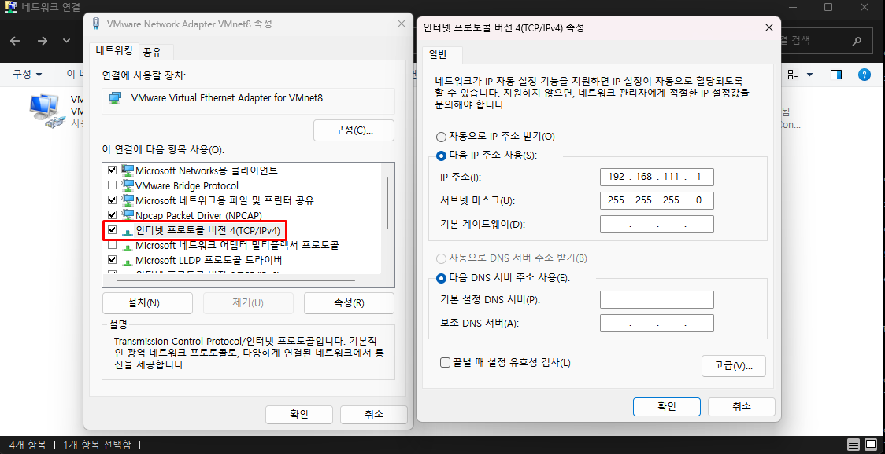
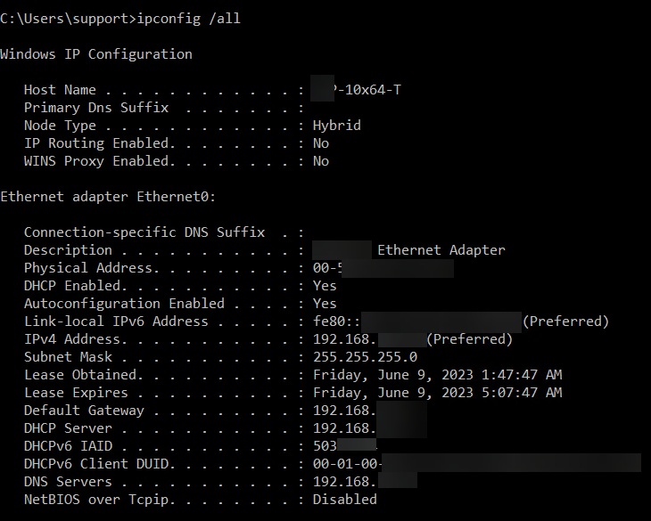
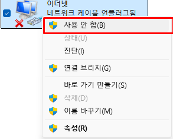
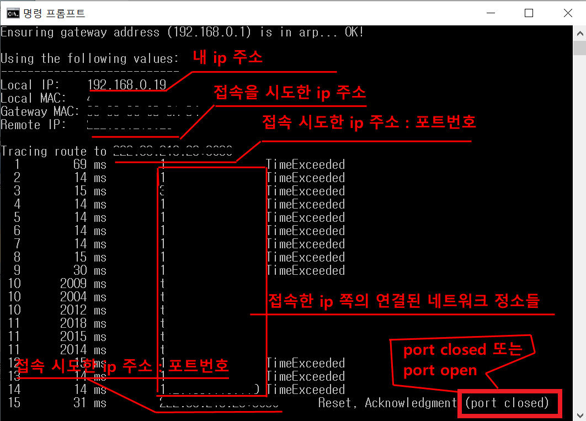

# 8강 서버 네트워크 기본

## 서버의 네트워크 설정 및 확인

서버를 네트워크에 연결해 정상적으로 동작시키려면 먼저 서버에서 환경에 맞는 적절한 네트워크 설정이 필요합니다. 가장 기본적은 네트워크 설정은 3장에서 다룬 IP 주소 , 서브넷 , 게이트웨이와 7강에서 다룬 DNS IP 주소 입니다.

서버뿐만 아니라 네트워크에 연결하는 모든 장비는 이런 네트워크 정보가 필요합니다. 이번장에서는 윈도 서버와 리눅스 서버에서 IP 주소, 서브넷 , 게이트웨이, DNS 서버와 같은 네트워크 필수 정보를 어떻게 설정하고 현재 설정된 정보를 어떻게 확인하는 지 알아보겠습니다.

### 1. 리눅스 서버 네트워크

일반적으로 리눅스에서는 설정 파일이 텍스트 형태이고 텍스트를 직접수정해 시스템 구성을 변경합니다. 네트워크 설정도 마찬가지로 각 인터페이스에 설정되는 필수 네트워크 정보를 네트워크 설정 파일에 추가, 변경해 네트워크 구성을 변경할 수 있습니다.

#### CentOS의 네트워크 설정

CentOS 의 네트워크 설정 파일은 다음 경로에 존재합니다.

```
CentOS 네트워크 설정 파일 경로
/etc/sysconfig/network-scripts
```

이 디렉터리에는 인터페이스에 대한 설정이 있는 ifcfg-eth0 , eth1 과 같은 설정 파일과 인터페이스 up/down 과 같은 다양한 인터페이스 제어용 스크립트가 있습니다. 각 인터페이스 설정은 하나의 파일에 모든 인터페이스 설정 정보를 쓰지 않고 인터페이스별 설정 파일로 관리합니다.

```
/etc/sysconfig/network-scripts/
합계 8.0K
-rw-r--r--. 1 root root  49 11월 23 14:12 ifcfg-br0
-rw-r--r--. 1 root root 437 11월 23 14:24 ifcfg-ens160
```

다음은 인터페이스 파일의 설정 예입니다.

```
인터페이스 파일 (ex: ifcfg-eth0) 설정 예

TYPE=Ethernet
ONBOOT=yes
BOOTPROTO=static
NAME=eth0
DEVICE=eth0
IPAADR=10.1.1.5
PREFIX=24
GATEWAY=10.1.1.1
DNS1=219.250.36.130
```

인터페이스 설정파일에서 사용되는 주요 항목은 다음과 같습니다.

|   설정    |                         설명                         |
| :-------: | :--------------------------------------------------: |
|  ONBOOT   | 부팅 시 인터페이스를 활성화 시킬것인지 결정 (yes/no) |
| BOOTPROTO |    부팅 시 사용할 프로토콜 (none, dhcp , static)     |
|  IPADDR   |                       IP 주소                        |
|  NETMASK  |           서브넷 마시크 (예 255.255.255.0)           |
|  PREFIX   |        서브넷 마스크(비트 값으로 표기) 예: 24        |
|  GATEWAY  |                   게이트웨이 주소                    |
|   DNS1    |                   주 DNS 정보 입력                   |
|   DNS2    |                       보조 DNS                       |

1. ONBOOT
   ONBOOT 는 부팅 시 해당 인터페이스를 활성화 상태로 사용할 것인지, 비활성화 상태로 사용할 것인지 결정합니다. ONBOOT 속성이 no로 되어있는 경우, 리부팅 시 인터페이스는 비활성화 상태가 되므로 네트워크에 연결되지 않습니다. 따라서 리부팅 후에도 네트워크를 자동으로 사용하려면 ONBOOT 속성을 yes 로 변경해주어야 합니다.

2. BOOTPROTO
   BOOTPROTO는 부팅 시 사용할 프로토콜을 지정하는 설정으로 none,static , dhcp 로 설정할 수 있습니다. </br>
   none 으로 설정된 경우 BOOTP(BOOTstrap Protocol)을 사용하며 관리자가 고정 IP 를 사용하고 싶을 때는 static으로, DHCP 를 이용한 자동 IP 환경이라면 dhcp 로 설정할 수 있습니다.

3. DEFROUTE
   DEFROUTE는 default route 라는 명칭을 줄인 설정값으로 디폴트 라우팅을 설정할 것인지를 결정하는 값입니다. 속성값은 yes 나 no 중에서 선택할 수 있고 별도로 이 속성을 사용하지 않을때는 기본적으로 yes 로 인지해 디폴트 라우팅이 생성됩니다.

4. IP ADDRESS
   IP ADDRESS는 서버에서 사용할 IP 주소를 입력합니다.

5. PREFIX
   PREFIX는 서브넷 마스크를 비트로 기입합니다.

6. GATEWAY , DNS
   각각 게이트웨이 주소와 DNS 서버 주소를 입력합니다.

그 외에도 MACADDR , NAME , UUID 등 많은 설정값이 있지만 설정하지 않아도 상관없습니다. 다만 해당 값을 하드웨어에 종속적인 값이므로 네트워크 어댑터 변경과 같이 하드웨어가 변경될 때는 수정되어야 합니다.

리눅스에서는 인터페이스의 설정파일을 수정하더라도 변경한 값이 즉시 적용되지 않습니다. 변경된 설정값을 적용하려면 두 가지 방법을 사용할 수 있습니다.

- 네트워크 서비스 재시작
- 인터페이스 재시작

다음 명령어를 사용해 네트워크 서비스를 재시작할 수 있습니다.

```
네트워크 서비스 재시작
# systemctl restart network.service # CentOS
# systemctl status NetworkManager.service # Fedora
```

네트워크 서비스를 재시작하면 수정한 인터페이스뿐만 아니라 다른 인터페이스를 포함한 전체 네트워크 서비스를 재시작하게 됩니다. 전체 네트워크 서비스를 재시작하는 방법 외에 ifup/ifdown 명령어를 이용해 특정 인터페이스에 대해서만 재시작할 수도 있습니다.

한 가지 유의할 점은 ifdown 으로 인터페이스를 재시작하는 경우, 해당 인터페이스로는 네트워크가 끊기므로 다른 인터페이스로 접속하거나 콘솔 상태에서 작업해야 한다는 것입니다.

반면 네트워크 서비스의 경우 원격사엥서 수행할때 보통 잠시 지연만 발생하고 원격이 끊기지는 않지만 재시작이 오래 걸리는 경우, 원격에서 끊길 수 있습니다.

```
특정 인터페이스 다운/업 (재시작)
# ifdown ifcfg-eth0
# ifup ifcfg-eth0
```

다음은 현재 네트워크 인터페이스의 설정값가 상태를 확인하는 방법입니다.

```
# ifconfig
```

ifconfig 를 통해 직접 설정한 IP 주소, 서브넷 , 게이트웨이와 같은 정보는 물론 MTU 크기 , 송수신되는 패킷 수 ,에러 패킷 등의 다양한 정보를 간단히 확인할 수 있습니다.

CentOS 7버전 이후 같은 버전은 ifconfig 에러가 나는데 해당 버전에서는 네트워크 관련 net-tools 패키지가 기본 패키지에서 제외되었기 때문입니다. 따라서 CentOS 7.0 이후의 버전에서는 ifconfig 를 사용하려면 net-tools 패키지를 추가로 설치해야 합니다.

```
# net-tools 패키지

net-tools 는 리눅스 네트워크 관련 시스템 도구들을 모아놓은 패키지 입니다. 대부분의 리눅스에서 사용됩니다.
net-tools 패키지로 사용 가능한 명령어는 ifconfig 를 비롯해
arp , hostname , netstat, rarp , route , plipconfig , slattach , mii-tool , iptunnel , ipmaddr 입니다.

관련 링크 : https://sourceforge.net/projects/net-tools/
```

net-tools 패키지가 설치되어 있지 않은 상태에서 별도 패키지를 추가로 설치 하지 않더라도 다른 명령어를 통해 네트워크 정보를 확인할 수 있습니다. ip 명령어에 address 오브젝트를 사용하면 다음과 같이 ifconfig 로 확인했던 것과 같은 유사한 네트워크 정보를 확인할 수 있습니다.

```
# ip address
```

```
# 참고 : ip 명령어로 사용할 수 있는 다양한 옵션

ip 명령어는 라우팅, 네트워크 장치 , 정책 라우팅, 터널과 같은 네트워크 요소 관리 및 상태 확인을 위해 사용하는 명령어로 매우 다양한 옵션을 제공합니다.
이는 Linux 배포판에서도 사용할 수 있는 기본 명령어 입니다.

# ip help
```

#### 우분투 네트워크 설정

이번에는 우분투 리눅스에서 네트워크를 설정하고 설정값을 확인하는 방법을 알아보겠습니다.

```
우분투 네트워크 설정파일

# ls /etc/network/interfaces
```

interfaces 파일이 있는 디렉터리에는 인터페이스 관련 파일과 디렉터리가 있습니다. 이 디렉터리에는 인터페이스가 다운되거나 업될 때 실행되는 스크립트 파일이 모여 있습니다.

CentOS 는 네트워크 인터페이스별로 설정 파일이 있었지만 우분투는 interfaces 설정 파일에 네트워크의 모든 인터페이스 설정이 들어갑니다. 우분투에서는 다음과 같이 네트워크를 설정할 수 있습니다.

```
우분투 네트워크 설정 예제

auto eth0
iface eth0 inet static
      address 10.1.1.6
      netmask 255.255.255.0
      gateway 10.10.10.1
      dns-nameserver 10.100.100.2

auto eth1 inet static
      address 20.1.1.6
      netmask 255.255.255.0
      gateway 20.10.10.1
      dns-nameserver 219.250.36.130

auto eth2
iface eth2 inet dhcp
```

위 예제에서 볼 수 있듯이 세 개의 인터페이스를 interfaces 파일 한 개에서 모두 정의하고 있습니다. 설정에 필요한 속성값을 CentOS와 거의 비슷하고 속성 이름만 조금 다르므로 설정 파일의 내용만으로도 우분투 네트워크 설정을 쉽게 이해할 수 있습니다.

다음은 우분투에서 네트워크 서비스를 시작/정지/재시작하기 위해서는 다음 명령어를 사용합니다.

```
# /etc/init.d/networking start
# /etc/init.d/networking stop
# /etc/init.d/networking reload
# /etc/init.d/networking restart
# /etc/init.d/networking force-reload
```

기타 네트워크 설정 확인을 위한 ifconfig 나 ip 명령어는 CentOS 와 공통으로 사용되므로 위의 CentOS 부분에서 설명한 부분을 참조하시면 됩니다.

### 2. 윈도 서버 네트워크

윈도 서버의 네트워크 설정은 노트북이나 데스크톱에서 사용하는 윈도 HOME, PRO 버전 설정과 동일하므로 리눅스보다 접근하기 쉽습니다. 하지만 윈도에서 설정에 접근하는 방법은 여러가지이고 추가로 netsh 과 같은 명령어 깁나 설정방버도 있어 다양한 방법을 하나씩 봅시다

먼저 [제어판 -> 네트워크 및 인터넷 -> 네트워크 연결]로 이동합니다. 또는 밑의 그림과 같이 [윈도우키 + 'R'] 에서 ncpa.cpl 을 실행해 바로 [네트워크 연결] 로 이동하는 방법도 있습니다.

1. [네트워크 연결]
   [네트워크 연결] 에서는 그림과 같이 현재 윈도 서버에 구성된 네트워크 어댑터가 보일겁니다. 특정 네트워크 어댑터를 설정하려면 네트워크 어댑터에서 마우스를 우클릭한 후 팝업 메뉴에서 [속성]을 선택합니다.
   

2. Internet Protocol Version 4
   여러가지 서비스 중 Internet Protocol Version 4(TCP/IPv4) 속성을 선택하면 그림처럼 해당 어댑터에서 사용할 IP 주소 , 서브넷, 게이트웨이 , DNS 정보를 설정할 수 있습니다.
   

3. 고급
   기본 네트워크 설정 외에 하단의 [고급] 버튼을 클릭하면 그림처럼 추가적인 네트워크 고급 설정이 가능합니다. 고급 설정을 변경해 사용하는 경우는 많지 않지만 네트워크 어댑터가 두 개 이상이면 네트워크 우선순위를 조절해야하는 경우가 발생합니다. 기본 설정은 메트릭을 이용한 우선순위 설정이 자동이지만 이런 경우, 메트릭을 자동으로 두지 않고 수동으로 변경해 사용하기도 합니다.

4. 네트워크 속성값 입력을 마친 후 [확인]

5. 명령 프롬프트
   현재 설정한 정보나 기존에 설정된 정보를 확인하기 위해 [명령 프롬프트]에서 ipconfig 명령으로 설정값을 확인할 수 있습니다. 하지만 ipconfig 는 기본명령어만으로는 IP 주소 , 서브넷 마스크 , 게이트웨이 정보와 같은 간단한 정보만 확인할 수 있습니다. </br>
   추가적인 상세 정보 (MAC 정보 , DNS 서버 정보 , DHCP 사용 여부 등)은 /all 옵션을 사용해 확인할 수 있습니다. </br>
   ipconfig /all 옵션을 사용하면 네트워크 어댑터에서 상세 정보를 확인할 수 있습니다.

```
# ipconfig /all
```



윈도에서는 리눅스와 반대로 GUI 환경에서 다양한 설정을 할 수 있지만 리눅스와 같이 명령어를 이용한 다양한 네트워크 설정 방법도 제공하고 있습니다. GUI 환경은 접근하기 쉽지만 원격관리나 자동화에 여러가지 제약사항이 있으므로 앞으로 소개할 CLI 기반의 설정을 숙지하는 것이 좋습니다.

```
네트워크 어댑터 설정을 위한 netsh 명령

# netsh interface ipv4 set address name="인터페이스명" static IP주소 서브넷 게이트웨이
```

netsh 명령은 윈도 서버 Core 버전과 같이 GUI 환경이 제공되지 않는 환경이나 노트북을 이용할때 고정 IP를 사용하는 장소를 자주 옮겨 다닐때 스크립트를 만들어 네트워크 설정을 손쉽게 바꾸는 데 유용하게 사용할 수 있습니다.

스크립트는 관리자 권한으로 실행합니다.

DHCP 환경이라면 source=dhcp 로 입력하면 됩니다.

```
DHCP 환경 설정

# netsh interface ip4 set address name="인터페이스명" source=dhcp
```

DNS 서버 주소 정보도 IP 주소 설정 방법과 동일하게 CLI 로 설정할 수 있습니다. set address 부분 대신 set dns 로 바꾸어 입력하면 됩니다.

```
DNS 설정

# netsh interface ipv4 set dns name="인터페이스명" static DNS_서버주소 index=2
```

DHCP 환경에서 DNS 를 서정할 때는 IP 주소 설정과 마찬가지로 source=dhcp로 입력하면 DHCP 서버로부터 DNS 주소를 자동으로 할당받습니다.

```
DNS를 DHCP 서버에서 자동 할당

# netsh interface ipv4 set dns name="인터페이스명" source=dhcp
```

리눅스와 달리 윈도는 설정 완료 후 "확인"버튼만 클릭하면 변경한 설정이 적용됩니다. 만약 네트워크가 정상적으로 동작하지 않아 네트워크 어댑터를 재시작해야하는 경우 밑과 같이 '사용안함' 을 클릭해 비활성화 후 '사용'을 선택해 네트워크 어댑터를 재시작할수 있습니다.



netsh 명령으로도 다음과 같이 어댑터를 리셋할 수 있습니다.

```
윈도 어댑터 비활성화

# netsh interface set interface name="인터페이스명" admin=disabled
# netsh interface set interface name="인터페이스명" admin=enabled
```

## 서버의 라우팅 테이블

네트워크 장비와 같이 서버에서도 외부 네트워크와 통신하기 위해 라우팅 테이블을 가지고 있습니다. 라우팅 정보를 별도로 설정하지 않더라도 네트워크 정보를 설정할 때 ,IP , 서브넷 마스크 , 기본 게이트웨이의 IP주소를 입력하게 되는데 이때 디폴트 라우팅이 라우팅 테이블에 자동으로 등록됩니다.

이 디폴트 라우팅을 이용해 네트워크 기본 설정만 마치면 내부 네트워크뿐만 아니라 외부 네트워크까지도 원할한 통신을 할 수 있습니다.

하지만 밑의 그림처럼 네트워크 어댑터를 두 개 이상 사용할 때는 여러가지 고려사항이 생길 수 있습니다. 웹용 프런트엔드 , 데이터 저장 및 처리용 백엔드 네트워크를 별도로 디자인하는 경우, 이런 형태의 네트워크가 사용될 수 있습니다.

웹 서버에 웹 서비스 제공용 프런트엔드 네트워크 어댑터와 데이터베이스 접근용 백엔드 네트워크 어댑터를 설치하면 각 네트워크 통신을 위해 라우팅 테이블을 조정해야 합니다. 아무 설정 없이 정상적으로 통신이 되는 경우도 있지만 구성과 동작 방식을 정확히 이해하고 확인할 수 있어야 합니다.

[그림 312쪽]

두 네트워크 어댑터에 모두 디폴트 게이트웨어 설정을 하면 정상적으로 통신이 되지 않습니다. 외부 공인망 네트워크와 통신해야 하는 프론트엔드 네트워크 쪽 어댑터에만 디폴트 게이트웨이를 설정하고 백엔드를 연결하는 어댑터에는 별도로 적절한 라우팅 정보를 반드시 설정해주어야 합니다.

위 경우와 달리 밑의 그림철머 HyperVizer (hyper-v) 가 설치된 가상화 서버에서는 하나의 물리 서버 안에서 공인망 가상 머신과 사설망 가상머신을 모두 운용하고 있더라도 가상 머신 내에서는 복잡한 라우팅 테이블 설정을 고민할 필요가 없습니다. 논리적으로 완전히 구분된 가상 서버안에서는 별도의 분리된 장비와 마찬가지로 동작하기 때문입니다.

물론 하나의 가상머신에 공인망 논리 네트워크 카드와 사설망 공인 네트워크 카드를 모두 할당한 경우에는 일반 물리 서버와 마찬가지로 라우팅 테이블 조정이 필요합니다.

[그림 313쪽]

이번절에서는 서버의 라우팅 테이블을 어떻게 확인하고 관리하는지 알아보겠습니다.

### 1. 서버의 라우팅 테이블

먼저 서버의 라우팅 동작을 이해하기 위해 라우팅 테이블 확인 방법을 알아보겠습니다. 서버의 OS 종류별로 또는 같은 OS 이라더라도 라우팅 테이블을 어떤 명령어로 확인하는 가에 따라 라우팅 테이블의 실제 모습은 조금 다를 수 있지만 앞으로 설명할 서버 라우팅 테이블 개념을 이해하면 어떤 상황에서도 서버 라우팅을 쉽게 확인하고 구성할 수 있습니다.

여기서 살펴볼 항목을 다음과 같습니다.

1. 목적지(Destination)
2. 서브넷 (Genmask)
3. 게이트웨이 (Gateway)
4. 인터페이스 (IFace)
5. 우선순위 (Metric)

서버에서 라우팅 테이블을 확인하면 운영체제의 종류에 따라 순서가 다르지만 보통 밑 그림과 같은 항목으로 출력됩니다. 각 항목을 네트워크 장비에서 보는 라웉이 테이블과 크게 다르지 않습니다.

```
# 서버 라우팅 테이블 항목
10.10.20.0 24 10.10.10.1 eth1 10

10.10.20.0 : 목적지
24 : 서브넷
10.10.10.1 : 게이트 웨이 (넥스트 홉)
eth1 : 인터페이스
10 : 우선순위
```

목적지 네트워크와 서브넷은 서버가 통신하려는 목적지 IP 주소에 맞는 라우팅을 선택하는 기준이 됩니다. 라우팅할 때 목적지 네트워크 주소와 서브넷으로 표현되는 목적지 네트워크 범위 내에 서버가 통신하려는 IP 주소가 속한 라우팅 테이블을 선택하게 됩니다.

예를 들어 서버가 통신하려는 목적지가 10.10.20.10 일때, 라우팅 테이블에 목적지 네트워크와 서브넷이 각각 10.10.20.0 , 24 비트이면 해당 라우팅 테이블이 표현하는 목적지 네트워크 범위가 10.10.20.0 ~ 255 이므로 통신하려는 목적지인 10.10.20.10 이 포함되어 해당 라우팅을 적용합니다.

라우팅 테이블의 게이트웨이는 선택된 목적지로 가기 위해 서버에서 선택하는 넥스트 홉입니다.

목적지가 로컬 네트워크이면 "연결됨(connected)" 라고 표기되고 remote 네트워크 이면 해당 네트워크의 게이트웨이로 설정됩니다. 만약 서버에 두 개 이상의 네트워크 카드가 있다면 원하는 네트워크 카드의 게이트웨이로 지정해주어야 합니다.

라우팅 테이블에서 인터페이스는 서버의 네트워크 카드를 말하고 라우팅에서 어떤 무릴적 경로로 패킷을 보낼지 설정합니다. 인터페이스는 게이트웨이의 IP 주소 대역에 속하므로 게이트웨이 IP 주소 대역이 포함된 인터페이스를 지정합니다.

마지막으로 우선순위 (매트릭)은 동일한 라우팅 테이블이 두 개 이상 존재시 어떤 라우팅 테이블을 선택할 지 정하는 값입니다. 이 값이 낮을수록 우선순위가 높아집니ㅏㄷ.

### 2. 리눅스 서버의 라우팅 확인 및 관리

리눅스 서버에서 라우팅 테이블을 확인하기 위해 ip route 명령어를 사용할 수 있습니다.

```
리눅스 서버 라우팅 테이블 확인

# ip route
default via 192.168.0.1 dev eth0 proto dhcp metric 100
192.168.0.0/24 dev eth0 proto kernel scope link src 192.168.0.100 metric 100
```

- default via 192.168.0.1 dev eth0: 기본 게이트웨이는 192.168.0.1이고, eth0 인터페이스를 통해 나간다는 의미입니다.
- 192.168.0.0/24 dev eth0: 192.168.0.0/24 네트워크는 eth0을 통해 직접 연결되어 있습니다.
- proto, scope, metric 등은 각각 라우팅 프로토콜, 경로의 범위, 우선순위 등을 나타냅니다.

ip 명령어 외에도 리눅스 서버의 네트워크 상태를 확인할 수 있는 명령어인 netstat 에 r 옵션을 추가하면 라우팅 테이블을 편하게 확인할 수 있습니다.

```
리눅스 서버 라우팅 테이블 확인

# netstat -r
Kernel IP routing table
Destination     Gateway         Genmask         Flags   MSS Window  irtt Iface
default         192.168.0.1     0.0.0.0         UG        0 0          0 eth0
192.168.0.0     0.0.0.0         255.255.255.0   U         0 0          0 eth0
```

|    항목     |                                                                                  의미                                                                                  |
| :---------: | :--------------------------------------------------------------------------------------------------------------------------------------------------------------------: |
| Destination |                                                                    목적지 네트워크 또는 호스트 주소                                                                    |
|   Gateway   |                                                                 목적지에 도달하기 위한 게이트웨이 주소                                                                 |
|   Genmask   |                                                                             서브넷 마스크                                                                              |
|    Flags    | 라우트의 상태. 예: U(사용 중), G(게이트웨이 경유), H: (해당 경로가 Host route, 즉 특정 단일 호스트를 향한 경로임), D (동적으로 생성된 경로), M (수정된(modified) 경로) |
|    Iface    |                                                                이 경로에 사용되는 인터페이스 (예: eth0)                                                                |

여기에 n 옵션을 추가로 사용하면 화면에 표기될때, 실제 IP 주소가 표기되어 좀 더 직관적인 라우팅 테이블을 확인할 수 있습니다.

```
리눅스 서버 라우팅 테이블 확인

# netstat -rn
Kernel IP routing table
Destination     Gateway         Genmask         Flags   MSS Window  irtt Iface
0.0.0.0         192.168.0.1     0.0.0.0         UG        0 0          0 eth0
192.168.0.0     0.0.0.0         255.255.255.0   U         0 0          0 eth0
10.10.0.0       0.0.0.0         255.255.0.0     U         0 0          0 tun0
```

netstat 가 대부분의 서버 엔지니어에게 익숙한 명령어이지만 메트릭 값과 같은 특정 값은 ip route 명령어에서만 확인할 수 있으므로 필요에 따라 적절히 선택해 사용해야 합니다.

먼저 리눅스 서버에서 라우팅 테이블을 확인하는 방법을 알아보았습니다. 이어서 라우팅 테이블을 추가하거나 삭제하는 방법도 알아보겠습니다.

서버의 네트워크 인터페이스가 한 개 뿐이라면 서버에 라웉이 테이블을 추가하거나 삭제할 필요가 거의 없습니다. 서버가 연결된 동일한 네트워크는 로컬 통신을 하고 다른 원격지 네트워크에 대해서는 디폴트 라우팅을 통해 게이트웨이로 지정된 인터페이스로 전송하면 되기 때문입니다.

하지만 서버의 네트워크 인터페이스가 두 개 이상으로 구성되었다면 어떤 네트워크 인터페이스를 사용해 패킷을 전송할 것인지 명시해주어야 하는 경우가 있는데 이때 라우팅 테이블을 추가하거나 삭제해 라웉이 테이블을 조정해야 하므로 라우팅 테이블 관리법을 반드시 알아야 합니다.

리눅스 서버에서 라우팅 테이블을 추가하는 설정은 다음과 같습니다.

```
리눅스 서버 라우팅 테이블을 추가하는 설정

# route add { -host | -net } Target[/prefix] [gw Gw] [metric M] [dev  If]
```

라우팅 테이블에 추가하려는 목적지 IP나 네트워크 대역을 입력하고 보낼 게이트웨이를 지정해주면 라우팅 정보가 입력됩니다. 라우팅 테이블에 우선수누이를 부여해 목적지에 대한 게이트웨이를 액티브-스탠바이(active-standby) 형태로 구성할 수도 있습니다.

이때 메트릭 (Metric) 값을 활용해 우선 라우팅 테이브르이 우선순위를 조정해줄 수 있는데 앞에서 설명했듯이 더 작은 메트릭 값을 가진 라우팅 테이블이 더 높은 우선순위를 가지게 되어 액티브 상태가 되고, 높은 메트릭 값을 가진 라우팅 테이블이 스탠바이 상태가 됩니다.

액티브 경로에 문제가 발생하면 라우팅 테이블에서 해당 경로가 삭제되어 스탠바이로 통신이 페일오버(Fail-Over) 가 됩니다.

```
라우팅 추가 설정 예제

# route add -host 10.10.10.10 gw 10.1.1.1
 -> 특정 10.10.10.10 서버가 목적지 인 경우 , 10.1.1.1 로 라우팅

# route add -net 10.10.10.0/24 dev eth0
 -> 10.10.10.0/24 네트워크 대역이 목적지인 경우, eth0 인터페이스로 라우팅

# route add -net 10.10.10.0/24 gw 10.1.1.6 metric 20
 -> 10.10.10.0/24 네트워크 대역이 목적지 인 경우, 10.1.1.6 으로 라우팅 , 이 라우팅 경로의 metric 값을 20 으로 설정
```

위에 소개합 옵션 외에도 다양한 옵션이 있습니다. 라우팅 테이블을 추가하기 위한 여러가지 옵션 중 자주 사용되는 옵션만 소개했습니다. 라우팅 테이블을 추가하기 위한 명령어는 route add 로도 가능하지만 앞에서 다루었던 ip 명령어를 이용할 수도 있습니다. ip route 옵션 뒤에 add 옵션을 사용해 라우팅 테이블을 추가할 수 있습니다.

라우팅 추가에 이어 이번에는 라우팅 테이블을 삭제하는 명령어를 알아보겠습니다.

```
라우팅 삭제 설정

# route del { -host | -net } Target[/prefix] [gw Gw] [metric M] [[dev] If]
```

라우팅 삭제는 라우팅 추가와 거의 비슷한 명령어를 사용합니다. 기존에 설정된 라우팅 정보를 삭제하는것이므로 del 명령어를 이용해 라우팅 테이블 정보를 지웁니다. 별도로 입력한 라우팅 테이블이 모두 삭제되는 경우에도 디폴트 라우팅이 남아있다면 그 경로를 사용해 외부 네트워크와 통신할 수 있습니다 (디폴트 라우팅은 롱기스트 매치 알고리즘에서 가장 안 좋은 경로이므로).

디폴트 라우팅마저 삭제되거나 설정되지 않았다면 원격지 네트워크 통신은 불가능하고 네트워크 카드가 속한 로컬 네트워크 통신만 가능합니다.

```
라우팅 삭제 설정 예제

# route del -host 10.10.10.10 gw 10.1.1.1
# route del -net 10.10.10.0/24 dev eth0
# route del -net 10.10.10.0/24 gw 10.1.1.6 metric 20
```

앞에서 추가했던 라우팅 설정을 위와 같이 삭제하면 라우팅 추가 이전의 테이블과 동일한 설정이 됩니다.

```
참고 : 디폴트 라우팅 설정
디폴트 라우팅을 일반 라우팅 설정과 동일하지만 목적지 네트워크를 default 로 표기해 설정할 수 있습니다.

# route add default gw 10.1.1.1 dev eth0 # 디폴트 라우팅 추가
# route del default gw 10.1.1.1 dev eth0 # 디폴트 라우팅 삭제
```

하지만 이렇게 명령어를 입력해 설정된 라우팅 정보는 서버가 재부팅되면 사라집니다. 문제 해결을 위해 명령어로 서버의 라우팅 설정을 변경한 후, 서버가 재부팅되면 초기 라우팅 설정만 남고 문제 해결 이전상태가 되어 해결 이전과 동일한 문제가 발생할 수 있습니다.

따라서 영구적인 라우팅 설정을 위해 별도 파일에 라우팅 설정을 입력해야 합니다. 영구적인 라우팅 설정은 리눅스의 종류에 따라 다르므로 CentOs와 우분투에 대해 각각 살펴보겠습니다.

#### CentOS 의 영구적 라우팅 설정

CentOS 에서는 다음과 같이 별도 파일을 만들어 라우팅을 설정합니다.

```
CentOS 리눅스 라우팅 설정 파일

/etc/sysconfig/network-scripts/route-장치명
```

eth0 인터페이스에 대한 영구적인 라우팅 설정 파일명은 route-et0 입니다.

라우팅 설정파일에는 ADDRESS 와 NETMASK , GATEWAY 항목을 사용합니다. 라우팅 테이블을 여러개 설정할 때는 각 항목의 뒤에 숫자를 순서대로 붙입니다. 다음은 라우팅 설정 파일의 예제입니다.

```
/etc/sysconfig/network-scripts/route-장치명

ADDRESS=10.10.10.0
NETMASK0=255.255.255.0
GATEWAY0=10.1.1.1
ADDRESS1=10.10.20.0
NETMASK1=255.255.255.128
GATEWAY1=10.1.1.1
```

또는 라우팅 테이블 형식과 유사하게 다음과 같이 설정할 수도 있습니다.

```
10.10.10.0/24 via 192.168.0.1 dev eth1
```

route , add , del 명령어로 설정된 라우팅은 곧바로 적용되지만 이렇게 설정된 라우팅은 서버를 재부팅하거나 네트워크 서비스를 재시작해야 라우팅 테이블에 적용됩니다.

```
네트워크 서비스 재시작
# systemctl restart network.service # CentOS
# systemctl status NetworkManager.service # Fedora
```

#### 우분투의 영구적 라우팅 설정

CentOS 에서는 라우팅을 위해 라우팅 설정 파일을 별도로 만들어 사용하지만 우분투에서는 네트워크 설정에서 사용했던 intefaces 파일에 라우팅 설정을 합니다. 우분투의 영구적 라우팅 설정은 일반 라우팅 테이블 설정과 동일한 양식으로 합니다.

```
우분투 라우팅 설정

up route add [ -net | -host ] <host/net><mask> gw <host/IP> dev <Interface>
```

맨 앞의 up 은 인터페이스가 시작될 때 실행되는 것으로 CentOS와 마찬가지로 네트워크를 다시 시작하거나 서버를 재부팅하는 경우, 신규 라우팅 정보가 라우팅 테이블에 등록됩니다. 다음은 우분투에서 라우팅 설정을 추가한 interfaces 파일의 예제입니다.

```
# eth0 네트워크 설정
auto eth9

# eth0 정적 네트워크 설정
iface eth0 inet static
      address 10.1.1.6
      netmask 255.255.255.0
      gateway 10.10.10.1
      dns-nameserver 219.250.36.130

# 영구적 라우팅 등록
up route add -net 10.10.10.0 netmask 255.255.255.0 gw 10.1.1.1
```

이렇게 설정된 라우팅은 서버를 재부팅하거나 네트워크 서비스를 다시 시작해야 라우팅 테이블에 적용됩니다.

### 3. 윈도 서버의 라우팅 확인 및 관리

윈도 서버(일반 개인용 윈도도 동일) 에서 라우팅 테이블을 확인하고 관리하기 위해서는 route 명령을 사용합니다. 윈도에서 route 명령은 4가지 옵션을 사용할 수 있습니다.

- PRINT
- ADD
- DELETE
- CHANGE

윈도 서버에서 라우팅 테이블을 확인하는 방법을 알아보겠습니다.

```
윈도 라우팅 테이블

C:\> route print
===========================================================================
인터페이스 목록
 11...00 1a 2b 3c 4d 5e ......Intel(R) Ethernet Connection
  1...........................Software Loopback Interface 1
===========================================================================

IPv4 경로 테이블
===========================================================================
활성 경로:
네트워크 대상        넷마스크          게이트웨이       인터페이스  메트릭
          0.0.0.0          0.0.0.0     192.168.0.1     192.168.0.100     25
        127.0.0.0        255.0.0.0       On-link         127.0.0.1    331
        127.0.0.1  255.255.255.255       On-link         127.0.0.1    331
  192.168.0.0    255.255.255.0       On-link     192.168.0.100    281
192.168.0.100  255.255.255.255       On-link     192.168.0.100    281
192.168.0.255  255.255.255.255       On-link     192.168.0.100    281
        224.0.0.0        240.0.0.0       On-link     192.168.0.100    281
  255.255.255.255  255.255.255.255       On-link     192.168.0.100    281
===========================================================================
영구 경로:
  없음
```

라우팅 테이블을 출력해보면 맨 먼저 윈도 서버의 인터페이스 목록을 확인할 수 있습니다. 각 인터페이스 목록 앞에는 인터페이스에 대한 숫자가 있습니다. 각 인터페이스 숫자는 라우팅 테이블을 설정할 때 인터페이스 옵션 (IF)에서 사용됩니다.

인터페이스 목록에 이어 목적지 네트워크, 서브넷 마스크 , 게이트웨이 정보 등이 표기됩니다. 동일한 목적지와 서브넷인 경우, 어떤 게이트웨이를 통해 라우팅할 것인지 결정하기 위한 메트릭 값도 확인할 수 있습니다.

그리고 현재 활성화된 라우팅 테이블 외에 하단에 영구 경로 (Persistent Routes) 란느 항목이 있는데 이것은 현재 구동 중인 윈도 서버가 재부팅되더라도 지속적으로 유지되는 라우팅 테이블을 뜻합니다.

일반적으로 서버에는 라우팅 테이블이 많지 않으므로 서버의 전체 라우팅 테이블을 route print 로 확인해도 되지만 라우팅 테이블이 많은 경우에는 필요한 라우팅 테이블만 필터해 보고 싶은 때가 있습니다. 특히 최근 노트북들은 네트워크 어댑터가 여러 개 (유선 , 무선 , 블루투스 , PAN 등)인 데다 IPv6 정보가 추가되어 라우팅 테이블은 점점 복잡해지고 있습니다.

필요한 라우팅 정보만 확인하기 위해 특정 목적지 네트워크를 인자값으로 지정하거나 "\*" 와 "?" 를 이용해 특정 패턴에 맞는 네트워크 대역을 확인할 수 있습니다.

- - : 전체 문자열을 대체
- ? : 특정 문자 하나를 대체

* 를 이용해 10.10.0.0/16 에 대한 전체 라우팅 테이블을 확인하고 싶을때는 다음과 같이 확인할 수 있습니다.

```
C:\> route print 10.10.*
```

또한 "?" 를 이용해 10.10.10.0/24 ~ 10.10.10.19.0/24 에 대한 라우팅 테이블을 확인하고 싶다면 다음과 같이 명령을 입력할 수 있습니다.

```
C:\> route print 10.10.1?.0
```

10.10.10.0 ~ 10.10.19.0 에 대한 라우팅을 확인하거나 목적지 네트워크가 24 비트 이하로 나누어진 세부 라우팅 테이블을 확인할 때는 다음과 같이 '\*' 와 '?' 모두 사용합니다.

```
C:\> route print 10.10.1?.*
```

이어서 윈도 서버의 라우팅 테이블 관리를 위해 라우팅 테이블을 어떻게 추가하고 삭제하는지 알아보겠습니다. 먼저 라우팅 테이블을 추가하는 명령입니다.

```
ROUTE [ -p | ADD | dest ] [ MASK netmask ] [ gateway ] [ MERIC metric] [ IF interface ]
```

라우팅 테이블을 추가하려면 테이블을 확인할 때 사용하던 ROUTE 명령 뒤에 실행할 명령어로 ADD 를 사용해 라우팅 테이블을 추가합니다. 라우팅 테이블을 추가할 때는 목적지 네트워크 주소(dest) 와 해당 네트워크의 서브넷 마스크 , 게이트웨이 주소를 지정합니다. 라우팅 우선순위를 위한 메트릭값과 트래픽이 전송될 물리 인터페이스도 추가로 명시할 수 있습니다. 물리 인터페이스를 별도로 선언하지 않더라도 게이트웨이 주소로 지정한 IP 주소를 찾아가기 위한 인터페이스로 자동 설정됩니다.

라우팅 테이블을 생성할 때, 한 가지 유의할 점이 있습니다. 윈도도 리눅스처럼 명령을 입력해 생성된 라우팅 테이블은 활성 경로 (Active Routes) 에만 등록되므로 서버가 재부팅된 후에는 라우팅 테이블에서 사라집니다.

하지만 리눅스와 달리 설정 파일을 별도로 만들거나 입력하지 않고 기존 명령에 -p 옵션만 추가해 영구 경로 (Persistent Routes) 에 등록할 수 있습니다. 영구 경로에 등록되면 서버가 재부팅된 후에도 추가한 라우팅 테이블이 계속 유지됩니다.

```
윈도우 영구 라우팅 경로 추가

C:\> route add 192.168.1.0 mask 255.255.255.0 10.0.0.1
# 목적지 192.168.1.0/24 에 대해 10.10.0.1 을 게이트웨이로 라우팅 추가

C:\> route add 192.168.1.0 mask 255.255.255.0 10.0.1.1 metric 100
# 목적지 192.168.1.0/24 에 대해 10.0.1.1 게이트웨이로 하고 메트릭을 100으로 설정한 라우팅 추가

C:\> route add -p 172.16.0.0 mask .255.255.240.0 10.0.0.1
# 목적지 172.16.0.0/12 에 대해 10.0.0.1 을 게이트웨이로 하는 라우팅을 영구 경로에 등록
```

다음은 라우팅 테이블을 삭제하는 명령입니다.

```
윈도우 라우팅 테이블 삭제

C:\> ROUTE DELETE [ dest ] [ MASK netmask ] [ ateway ] [ METRIC metric ] [ IF inteface ]
```

라우팅 테이블을 삭제하는 방법은 라우팅을 추가하는 방법과 동일합니다. ROUTE 명령 뒤에 실행할 명령어로 ADD 대신 DELETE 를 사용하면 됩니다.

라우팅 테이블 삭제는 라우팅 추가와 달리 MASK 나 gateway정보를 입력하지 않아도 됩니다. 다만 세부 정보를 입력하지 않고 라우팅을 삭제할 때는 유의할 점이 있습니다. 라우팅을 삭제할 때 입력한 정보만으로 라우팅 테이블 정보가 두 개 이상 있다면 해당하는 모든 라우팅 테이블이 삭제됩니다. 예를 들어 라우팅 테이블에 192.168.1.0/24 와 192.168.1.0/25를 목적지로 한 라우팅 테이블이 있다고 가정해봅시다.

이때 "ROUTE DELETE 192.168.1.0" 과 같이 MASK 정보 없이 네트워크 주소만으로 삭제하면 라우팅 테이블에 있는 192.168.1.0/24 와 192.168.1.0/25 모두 매치되므로 두 개의 라우팅 테이블이 모두 삭제됩니다.

따라서 라우팅을 삭제할 때도 가능하면 삭제하려는 라우팅 테이블 정보를 모두 입력해 의도하지 않은 라우팅이 삭제되지 않도록 유의합시다.

```
C:\> route delete 192.168.1.0 mask 255.255.255.0 10.0.0.1
# 목적지 192.168.1.0/24 에 대해 10.0.0.1을 게이트웨이로 하는 라우팅 삭제

C:\> route delete 192.168.1.0 mask 255.255.255.0
# 목적지 192.168.1.0/24 에 대한 모든 라우팅 삭제 (서로 다른 게이트웨이를 바라보는 라우팅이 있는 경우 , 모두 삭제)

C:\> route delete 192.168.1.0
# 목적지 네트워크가 192.168.1.0인 모든 라우팅 삭제 (서브넷 마스크의 크기가 다르더라도 네트워크 주소가 192.168.1.0 인 라우팅이 있는경우 , 모두 삭제)
```

마지막으로 현재의 라우팅 테이블을 변경하는 명령입니다.

```
ROUTE CHANGE [ dest ] [ MASK netmask ] [ ateway ] [ METRIC metric ] [ IF inteface ]
```

라우팅 테이블 변경은 ROUTE 명령 뒤에 실행할 명령어로 CHANGE 를 사용합니다. 라우팅 테이블 변경도 라우팅 추가/삭제에 사용하는 옵션을 동일하게 사용합니다. 다만 라우팅을 변경할 때, 일부 옵션을 입력하지 않아도 매칭되는 라우팅 정보가 있다면 빼고 명령어를 실행할 수 있지만 이런 실행은 사용자의 의도와 달리 라우팅이 변경될 수 있습니다.

예를 들어 라우팅 테이블에 192.168.1.0/24가 목적지이고 게이트웨이가 1.1.1.1 인 라우팅 테이블에서 게이트웨이를 1.1.2.1 로 변경하려고 할 때 , MASK 정보를 입력하지 않고 'ROUTE CHANGE 192.168.1.0 1.1.2.1' 로 만 라우팅을 변경하면 서브넷이 24비트 (255.255.255.0)에서 32 비트 (255.255.255.255) 로 잘못 변경됩니다.

따라서 라우팅을 변경할 때는 필요한 정보를 반드시 모두 입력해야 합니다.

```
C:\> route change 102.168.1.0 mask 255.255.255.0 10.0.10.1
# 목적지 192.168.1.0/24 에 대한 라우팅에 대해 게이트웨이를 10.0.10.1 로 변경

C:\> route change 102.168.1.0 mask 255.255.255.0 10.10.10.1 metric 10
# 목적지 102.168.1.0/24 에 대한 라우팅에 대해 게이트웨이를 10.10.10.1, 메트릭을 10으로 변경
```

## 네트워크 확인을 위한 명령어

### ping (Packet InterNet Groper) (리눅스)

네트워크 상태를 확인할 때 가장 많이 사용하는 명령어는 ping 입니다. ping 은 IP 네트워크를 통해 특정 목적지 까지 네트워크가 잘 동작하고 있는지 확인하는 네트워크 명령어입니다. 상대방 호스트가 살아있는지 확인하는 것이 이 명령어의 최대 목표 이지만 두 호스트 간의 통신을 위한 경로, 즉 라우팅 경로가 정상적으로 구서오디어 있는지도 함께 체크할 수 있습니다.

ICMP (Internet Control Message Protocol) 이라는 인터넷 프로토콜을 사용하고 ICMP의 제어 메시지를 통해 여러가지 네트워크 상태를 파악할 수 있습니다.

ping 명령의 수행은 아래와 같이 ping 명령어와 목적지 IP 만으로 간단히 수행할 수 있습니다.

```
# ping [옵션] 목적지_IP주소
```

더 상세한 정보를 파악하기 위해 여러 옵션을 사용해 ping 을 체크하는 횟수, 데이터 크기 등을 지정할 수 있습니다.

별도의 옵션 없이 ping 을 체크하는 방법을 보통 '기본 ping' 이라고 하며 옵션을 사용해 ping 을 체크하는 방법을 '확장 ping' 이라고 합니다.

'확장 ping' 중 특정 옵션을 사용 할 때, ping 을 체크하는 출발지 IP를 지정할 수도 있습니다. ping 명령어는 기본적으로 나가는 인터페이스에 설정된 IP 가 출발지 IP 로 지정되지만 출발지 옵션을 사용해 루프백 인터페이스 IP나 다른 인터페이스의 IP를 출발지 IP 로 지정해 ping 을 체크할 수 있습니다. 이 '확장 ping' 을 '소스 (source) ping' 이라고 합니다.

|   주요 옵션   |                                                                                                              리눅스                                                                                                               |
| :-----------: | :-------------------------------------------------------------------------------------------------------------------------------------------------------------------------------------------------------------------------------: |
|   -c count    |                                               ping을 보내는 패킷(ECHO_REQUEST)을 몇 번 보내고 종료할 것인지 지정 , 기본 설정은 강제로 정지(CTRL+C) 할때까지 패킷을 지속적으로 보냄                                                |
|  -i interval  |                                                                          패킷을 보내는 시간 간격, 기본 설정값은 1초. 슈퍼 유저의 경우 0.2이하로 설정가능                                                                          |
| -l interface  | 패킷을 보낼 때, 출발지 주소를 지정, 실제 IP 값을 지정하거나 인터페이스 이름을 지정하면 출발지 주소가 변경됩. 이 옵션을 사용하지 않는 경우 라우팅 테이블에 의해 나가는 인터페이스(Outgoing-interface)의 IP 주소가 출발지 주소가 됨 |
| -s packetsize |                                                                    패킷 크기를 지정, 기본 설정값은 56바이트(8바이트의 ICMP 헤더가 추가로 붙어 64바이트를 송신)                                                                    |

다음은 리눅스에서 ping 을 사용해 목적지 8.8.8.8(google dns)로 100바이트 크기의 ping 패킷을 2회 보내는 예제입니다.

```
# ping -c 2 -s 100 8.8.8.8
PING 8.8.8.8 (8.8.8.8) 100(128) bytes of data.
108 bytes from 8.8.8.8: icmp_seq=1 ttl=117 time=33.7 ms
108 bytes from 8.8.8.8: icmp_seq=2 ttl=117 time=36.5 ms

--- 8.8.8.8 ping statistics ---
2 packets transmitted, 2 received, 0% packet loss, time 1002ms
rtt min/avg/max/mdev = 33.726/35.124/36.522/1.398 ms
```

### tcping (윈도우) (리눅스)

처음에도 언급했듯이 ping 은 목적지 단말이 살아있는지 확인하고 출발지와 목적지까지의 네트워크가 잘 연결되어 있는지 확인하는 명령입니다. 목적지 단말까지의 중간 경로에 문제가 발생한 경우 icmp error 메시지를 활용해 라우팅 문제가 발생한 경우, 일부 파악이 가능합니다.

하지만 목적지 단말이 잘 살아있고 중간 경로에 문제가 없더라도 실제 서비스를 위해 사용되는 서비스 포트가 정상 상태인지 ping 만으로는 확인할 수 없습니다. 출발지와 목적지 사이에 방화벽과 같은 보안 장비에서 막히지 않는지, 목적지 운영체제에서 운영체제 방화벽이 동작해 차단하는 것은 아닌지, 목적지에서 서비스하기 위해 정상적으로 서비스 포트가 오픈되지 않았는지 추가로 확인해야 하는 경우가 많습니다.

또한, 네트워크 경로 체크에서도 ping 에서 사용하는 icmp메시지가 내부 네트워크의 상태 정보를 외부에 유출할 수있어 정책적으로 icmp 와 traceroute 를 차단하는 경우도 많습니다.

예를 들어 naver.com 은 ping 이 막혀있어 확인이 불가능합니다.

```
C:\> ping naver.com -n 1

Ping naver.com [223.130.192.248] 32바이트 데이터 사용:
요청 시간이 만료되었습니다.

223.130.192.248에 대한 Ping 통계:
    패킷: 보냄 = 1, 받음 = 0, 손실 = 1 (100% 손실),
```

따라서 목적지의 실제 서비스 포트로 정상적인 통신이 가능한지 확인하는 작업이 매우 중요합니다. 곧 다룰 telnet 명령으로도 확인할 수 있지만 tcping 프로그램을 통해 ping 을 확인하듯이 서비스 포트가 정삭적으로 열려있는지 확인할 수 있습니다.

운영체제에 포함된 기본 명령은 아니지만 설치해두면 유용하게 사용할 수 있습니다.

tcping 의 사용법은 다음과 같습니다.

```
C:\> tcping [옵션] 목적지_ip주소
```

|  주요 옵션  |                             리눅스                              |
| :---------: | :-------------------------------------------------------------: |
|  -n count   |                tcping을 전송하는 횟수 (기본 5회)                |
|     -t      |      중지될 때까지 지정한 호스트로 ping 을 지속적으로 전송      |
| -i interval |                  tcping 을 전송하는 시간 간격                   |
| serverport  | tcping 으로 확인하려는 서비스 포트이며 미 설정 때는 80이 기본값 |

다음은 tcping 을 사용해 naver.com 으로 서비스 포트 80 이 열려있는지 확인하는 예입니다.

```
C:\> tcping naver.com

Probing 223.130.200.219:80/tcp - Port is open - time=15.420ms
Probing 223.130.200.219:80/tcp - Port is open - time=8.700ms
Probing 223.130.200.219:80/tcp - Port is open - time=5.229ms
Probing 223.130.200.219:80/tcp - Port is open - time=5.533ms

Ping statistics for 223.130.200.219:80
     4 probes sent.
     4 successful, 0 failed.  (0.00% fail)
Approximate trip times in milli-seconds:
     Minimum = 5.229ms, Maximum = 15.420ms, Average = 8.720ms
```

tcping 의 응답값으로 "Port is open" 과 함께 실제 응답시간을 확인할 수 있습니다.

### traceroute (리눅스) / tracert (윈도)

traceroute 는 출발지부터 통신하거나 목적지까지의 네트워크 경로를 확인할 때 사용하는 네트워크 명령어입니다.

ping 은 목적지 단말이 잘 동작하는지 확인하는 데 사용되고 icmp 메시지를 이용해 중간 경로에 문제가 있을때 이것을 확인할 수 있었지만 traceroute 는 중간 경로의 더 상세한 정보를 얻는데 사용됩니다.

중간 네트워크 장비가 아닌 출발지 pc 에서 목적지까지의 라우팅 경로를 확인할 수 있고 목적지까지의 통신에 문제가 있을 때 어느 구간부터 문제가 발생했는지 찾아낼 수 있습니다.
추가로 목적지까지의 네트워크 응답 시간이 느린경우, 어느 구간에서 응답 시간이 느려지는지도 알아낼 수 있습니다.

traceroute 는 IP 헤더의 TTL(Time To Live) 필드를 이용합니다. TTL을 1부터 1씩 증가시키면서 목적지에 도달할 때까지 패킷을 반복적으로 전송하면서 경로를 추적합니다. 인터넷 구간에서 경로를 찾지 못하거나 잘못 전송된 패킷이 무제한적으로 계속 돌아다니지 않도록 IP 헤더에 패킷이 살아 있을 수 있는 한계를 명시하는데 이 정보를 TTL 이라고 합니다.

인터넷 구간에서 라우터 장비를 하나 지날 때 마다 패킷의 TTL 값이 1씩 줄고 TTL 이 0이 되는 순간, 해당 라우터에서 이 패킷을 드롭시키고 icmp 메시지를 이용해 출발지 단말에 패킷을 드롭한 이유를 알려줍니다.

TTL 이 1일때는 1홉까지의 장비로 전달되고 TTL 이 0으로 만료되면서 해당 장비는 "ICMP time exceed" 메시지를 출발지로 전달합니다.

traceroute는 이 메시지를 전달한 장비의 IP를 출력하는 과정을 반복하면서 경로를 추적합니다. 즉, traceroute 경로 추적은 IP 헤더인 3계층 정보에 의한 경로 추적이므로 2계층 이하의 스위치 장비 추적은 불가능합니다. 라우팅이 동작하는 라우터나 L3 스위치같은 3계층 장비의 경로만 확인할 수 잇습니다.

traceroute 로 두 호스트 간 경로가 의도대로 정상적인 경로인지 확인하려면 각 호스트에서 traceroute를 모두 수행해야 합니다.

예를 들어 다음 그림처럼 서버#1 과 서버#2 가 있고 두 호스트로 가는 경로가 두 개인 경우 서버#1 에서 서버#2 로 가는 경로와 서버#2 에서 서버#1 로 가는 경로 설정이 다를 수 있습니다. 즉, 비대칭 경로 인 경우 입니다.

라우터와 같이 L3 장비로만 구성되어 라우팅만 이루어지는 상황에서는 비대칭 경로여도 서비스에 문제가 없지만 라우팅 외에 세션을 확인하는 보안 장비가 중간에 섞여 있다면 비대칭 경로에 의해 통신이 차단될 수 있습니다.

이렇게 패킷이 비대칭 경로임을 ㅊ자아내려면 서버#1 과 서버#2 에서 traceroute를 각각 수행한 결과값으로 경로를 검증해야 합니다.

[그림 329 쪽]

단말의 인터페이스가 두 개 이상인 겨우에도 라우팅에 따라 들어오는 인터페이스와 나가는 인터페이스가 다르면 통신 자체가 불가능할 수 있습니다. 밑의 그림에서는 서버#1 은 Frontend와 Backend로 인터페이스가 각각 연결되어있습니다.

이때 서버#2 에서 서버#1 로 서비스 호출을 했을때 서버#1 에서는 서버#2로 응답해야 하지만 서버#1에서 라우팅이 잘못된 경우 요청을 받은 Frontend 쪽이 아닌 Backend 쪽에서 응답하고 이후 목적지 경로가 없어서 Backend 에서 패킷이 폐기될 수 있습니다. 이 경우도 서버#1 에서 서버#2 로 traceroute 명령어를 통해 의도대로 Frontend 경로의 라우팅을 타는지 확인할 수 있습니다.

[그림 329 쪽]

지금부터 traceroute 명령어에 대해 알아보겠습니다. 리눅스 계열과 윈도 계열에서의 traceroute 명령어는 다음과 같습니다.

- 리눅스 : traceroute [옵션] 목적지IP주소
- 윈도 : tracert [옵션] 목적지IP주소

|            주요 옵션            |                              리눅스                               |
| :-----------------------------: | :---------------------------------------------------------------: |
|           -I, --icmp            |                   ICMP 기반으로 traceroute 수행                   |
|           -T , --tcp            |      TCP SYN으로 traceroute를 수행하면 기본 서비스 포트는 80      |
|               -n                | IP 주소를 도메인이 아닌 수자 형식으로 표시(도메인 리졸브 미 수행) |
|      -p port , --port=port      |                특정 포트를 지정해 traceroute 수행                 |
| -s src_addr , --source=src_addr |     패킷이 나가는 인터페이스가 아닌 별도 IP 로 출발지 IP 지정     |

|    주요 옵션    |                              윈도우                               |
| :-------------: | :---------------------------------------------------------------: |
|       -d        | 도메인이 아닌 숫자 형식으로 IP 주소를 표시(도메인 리졸브 미 수행) |
| -h maximum_hops |                    대상 검색을 위한 최대 홉 수                    |

앞에서도 알아보았듯이 리눅스의 -n 옵션은 도메인 주소로 표시하지 않고 IP 주소로 직접 표기합니다. 즉, 도메인에 대한 리졸브를 수행하지 않게 됩니다. -n 옵션이 없는 경우, DNS 에 표기되는 IP 를 DNS 이름으로 역 쿼리를 시도하고 이 작업으로 인한 시간 지연이 있습니다.

-n 옵션을 사용하면 DNS 쿼리 없이 직접 IP 주소로 결과가 출력되므로 결과가 신속히 출력된다는 장점이 있어 이 옵션을 많이 사용합니다.

윈도의 경우 -d 옵션이 리눅스의 -n 옵션과 같은 역할을 합니다.

```
참고 : traceroute 를 수행하는 프로토콜

traceroute 는 운영체제에 따라 기본적으로 사용되는 프로토콜이 다릅니다. 윈도우 계열에서는 ICMP 를 기반으로 동작하며 리눅스/유닉스 계열에서는 UDP 를 기반으로 동작합니다.
```

### tcptraceroute (리눅스) , tcproute (윈도우)

앞에서 다루었던 ping 과 tcping 의 관계처럼 traceroute 도 경로 정보 뿐만아니라 서비스 포트를 추가로 확인할 수 있는 traceroute 명령어가 있습니다. traceroute 는 경로 추적만 가능하며 서비스를 위한 서비스 포트가 정상적으로 열리는지 확인할 수 없습니다. 서비스에 문제가 생겼을 때는 중간 경로에서 차단되었는지, 최종목적지에서 차단되었는지 , 목적지 단말에서 서비스를 제대로 오픈하지 못했는지 확인해야 합니다.

이런 여러가지 사항을 한꺼번에 확인할 수 있는 명령어가 tcptraceroute (tcptrace) 입니다.

tcptraceroute 는 traceroute 와 유사하게 출발지와 목적지까지의 경로를 확인하지만 실제 서비스 포트를 이용해 경로를 추적하므로 최종 목적지까지 서비스 포트가 정상적으로 열리는지 확인할 수 잇고 만약 열리지 않는다면 어느 구간부터 서비스가 막히는지 확인할 수 있스비낟.

리눅스에서는 traceroute 명령어에 서비스 포트를 지정해 tcptraceroute 와 같이 확인할 수 있지만 윈도의 경우에는 tracert 에서 서비스 포트를 지정할 수 있는 옵션이 없습니다.

윈도에서도 tcptraceroute 를 이용하면 서비스 포트 차단 문제를 해결하는 데 큰 도움이 됩니다. 물론 윈도 뿐만 아니라 리눅스에서도 tcptraceroute 를 추가로 설치해 사용할 수 있습니다.

리눅스와 윈도에서 다음과 같이 tcptraceroute 를 설치할 수 있습니다. traceroute 패키지를 설치하면 tcptraceroute 도 함께 설치됩니다.

```
# dnf install traceroute
```

윈도우에서는 다음 웹 사이트에서 tcproute.zip 파일을 받은 후 압축을 해제해야합니다.

```
tcproute 홈페이지 : https://www.elifulkerson.com/projects/tcproute.php
```

리눅스 계열과 윈도 계엘에서의 tcptraceroute 명령어는 다음과 같습니다.

- tcptraceroute [옵션] 목적지IP주소 [서비스포트] # 리눅스
- tcproute [옵션] 목적지IP주소 # 윈도우

사용법은 traceroute 와 같아 쉽게 사용할 수 있습니다. 서비스 포트를 추가로 설정할 수 있고 추가적인 다른 옵션들도 사용할 수 있지만 서비스 포트 지정만으로도 문제 해결에 충분히 유용하게 사용될 수 있습니다.

리눅스와 윈도에서 사용할 수 있는 주요 옵션을 알아보겠습니다.

|     주요옵션     |                          리눅스                           |
| :--------------: | :-------------------------------------------------------: |
|        -n        |               ICMP 기반으로 traceroute 수행               |
|   -s src_addr    | 패킷이 나가는 인터페이스가 아닌 별도 IP 로 출발지 IP 지정 |
| destination port |  도메인이 아닌 숫자 형식으로 표시(도메인 리졸브 미 수행)  |

| 주요 옵션 |                                                윈도우                                                 |
| :-------: | :---------------------------------------------------------------------------------------------------: |
|    -d     |                   도메인이 아닌 숫자 형식으로 IP 주소를 표시(도메인 리졸브 미 수행)                   |
|  -p PORT  |                                        목적지 서비스 포트 지정                                        |
|  -i INT#  | 특정 인터페이스로 출발지 인터페이스를 지정, 해당 옵션을 사용하지 않을 시 명령 실행 시 인터페이스 선택 |
|  --http   |                                    HTTP Request 를 보내 접속 확인                                     |

기존에 설명했던 리눅스의 -n 이나 윈도의 -d 옵션은 tcptraceroute 도 동일하게 사용됩니다.
도메인 리졸브 없이 IP 주소값으로 출력해 신속히 결과의 응답을 할 수 있습니다.

리눅스와 윈도에서 tcptraceroute 를 사용할 때는 목적지 서비스 퐅느의 위치 때문에 혼동될 수 있습니다. 리눅스에서는 서비스 포트를 다른 옵션과 달리 목적지 IP 주소 뒤에 설정해야 하지만 윈도우에서는 서비스 포트도 옵션 항목으로 취급해 목적지 IP 앞의 옵션 위치에 명시해주어야 합니다.

다음은 윈도에서 tcproute 를 사용한 예입니다. tcproute 를 실행하면 tcproute 를 수행할 인터페이스를 선택하게 되는데 명령을 실행할 때 -i 옵션을 사용해 인터페이스 번호를 지정하면 이 과정을 생략하고 바로 경로 추적을 수행합니다.



다음은 리눅스에서 tcptraceroute 명령어를 수행해 naver.com 으로 80 포트에 대해 경로를 체크하는 예시입니다. 리눅스 -n 옵션은 도메인 주소로 표기하지 않고 직접 IP 주소로 표기합니다. 즉, 도메인에 대한 리졸브를 수행하지 않습니다.

-n 옵션이 없는 경우, DNS 에 표기되는 IP 를 DNS 이름으로 역 쿼리를 시도하게 되고 이 작업으로 인한 시간 지연이 있습니다.

```
# tcptraceroute -n naver.com 80

... 생략
```

### netstat (network statistics)

netstat 은 서버의 다양한 네트워크 상태를 확인하는 데 사용되는 명령어입니다. 여러 가지 네트워크 관련 정보를 확인할 수 있어 사용 범위가 매우 넓지만 서비스 포트 상태를 확인하는 용도로 가장 많이 사용됩니다.

현재 서버에서 특정 서비스가 정상적으로 열려 있는지 (LISTENING) , 또는 외부 서비스와 TCP 세션이 정상적으로 맺어져 있는지 (ESTABLISHED) , 서비스가 정상적으로 종료되고 있는지 (TIME_WATI , FIN_WAIT , CLOSE_WAIT) 여부 등을 netstat 명령어로 확인할 수 있습니다. 이런 정보는 서버의 네트워크 상태를 확인시켜 주므로서비스에 문제가 발생했을 때 문제 해결을 위한 기본 정보로 활용할 수 있습니다.

하지만 이런 정보를 이용해 현재 서비스 상태를 명확히 이해하고 문제를 분석하려면 앞에서 다루었던 TCP 통신에 대한 상태 변화와 동작 방식을 정확히 이해하고 있어야 합니다.

netstat 명령언느 서비스의 포트 상태 정보뿐만아니라 라우팅 테이블이나 인터페이스 패킷 통계정보 확인에도 사용할 수 있습니다.

지금부터 netstat 명령어에 대해 알아보겠습니다. 리눅스 계열과 윈도 계열에서의 netstat 명령어의 기본적인 사용법은 같습니다.

```
# netstat [옵션]
```

|     주요 옵션     |             리눅스             |
| :---------------: | :----------------------------: |
|   -r , --route    |       라우팅 테이블 표시       |
| -i , --interfaces | 인터페이스 별 입출력 패킷 통계 |
| -s , --statistics |   네트워크 통계 데이터 출력    |
|  -p , --programs  |   PID 와 프로그램 이름 출력    |
|    -t , --tcp     |   TCP 만 출력 (TCP , TCPv6)    |
|       -4/-6       |    IPv4 나 IPv6에 대해 출력    |

| 주요 옵션 |                                                                                                          윈도우                                                                                                          |
| :-------: | :----------------------------------------------------------------------------------------------------------------------------------------------------------------------------------------------------------------------: |
|    -a     |                                                                                             모든 연결과 수신 대기 포트 표시                                                                                              |
|    -n     |                                                                                          주소와 포트 번호를 숫자 형식으로 표시                                                                                           |
|    -r     |                                                                                                    라우팅 테이블 표시                                                                                                    |
|    -e     |                                                                               이더넷 통계를 표시합니다. 이 옵션은 -s 옵션과 함께 사용 가능                                                                               |
|    -s     |                        프로토콜별 통계를 표시합니다. 기본적으로 IP, IPv6 , ICMP , ICMPv6 , TCP , TCPv6 , UDP 및 UPDv6에 대한 통계를 표시 , -p 옵션을 사용해 기본값의 일부 집합에 대한 통계만 표시                        |
| -p proto  | proto로 지정한 프로토콜의 연결을 표시 , proto는 TCP , UDP , TCPv6 , UDPv6 중 하나로, -s 옵션과 함께 사용해 프로토콜별 통계를 표시 할 경우, proto 는 IP , IPv6 , ICMP , ICMPv6 , TCP , TCPv6 , UDP , UDPv6 중 하나를 사용 |

다음은 netstat 에 대한 사용 예입니다. -ant 옵션으로 TCP에 대한 모든 연결과 수신 대기 정보를 숫자로 표기해 출력하도록 했습니다.

```
리눅스 netstat 사용 예제

#  netstat -ant6
Active Internet connections (servers and established)
Proto Recv-Q Send-Q Local Address           Foreign Address         State
tcp6       0      0 :::33321                :::*                    LISTEN
...
```

다음은 TCP 프로토콜 (-p TCP) 에 대한 통계 값(-s) 을 확인하는 예제입니다.

```
윈도 netstat 사용 예제

C:\> netstat -s -p TCP

TCP Statistics for IPv4

  Active Opens                        = 1234
  Passive Opens                       = 567
  Failed Connection Attempts          = 89
  Reset Connections                   = 34
  Current Connections                 = 12
  Segments Received                   = 456789
  Segments Sent                       = 456123
  Segments Retransmitted              = 1234

TCP Statistics for IPv6

  Active Opens                        = 98
  Passive Opens                       = 45
  Failed Connection Attempts          = 3
  Reset Connections                   = 4
  Current Connections                 = 2
  Segments Received                   = 12345
  Segments Sent                       = 12300
  Segments Retransmitted              = 45

활성 연결

  프로토콜  로컬 주소           외부 주소              상태
  TCP    127.0.0.1:80        ksa:80              ESTABLISHED
```

netstat 명령은 리눅스 와 윈도 서버 모두 사용할 수 있고 다양한 네트워크 정보를 확인할 수 있는 매우 유용한 명령어입니다. 워낙 광범위하게 사용되다보니 여기서 다루는 옵션 외에 추가로 다른 옵션을 직접 실행해 결괏값을 확인하는 것이 네트워크 문제를 이해하고 해결하는 데 효과적인 학습법이 될 것입니다.

### ss (socket statistics)

ss 는 소켓 정보를 확인할 수 있는 네트워크 명령어입니다. 기존 netstat 명령어를 대체하는 것뿐만 아니라 다양한 옵션을 제공해 더 많은 정보를 추가로 확인할 수 있습니다. ss 는 화면에 표기할 정보를 커널 스페이스를 통해 직접 가져오므로 netstat 보다 결과를 빨리 확인할 수 있습니다.

ss 명령어는 다음과 같이 사용합니다.

```
# ss [옵션] [필터]
```

ss 명령어에서 유용하게 사용할 수 있는 몇가지 옵션만 살펴보겠습니다.

|         주요 옵션         |                         설명                         |
| :-----------------------: | :--------------------------------------------------: |
|            -a             |               화면에 전체 소켓을 표시                |
|            -l             |         화면에 LISTENING 상태의 소켓만 표시          |
|            -i             |               소켓에 대한 자세한 정보                |
|            -p             |        현재 소켓에서 사용 중인 프로세스 표시         |
|            -n             | 서비스 명이 아닌 실제 포트 번호롤 서비스 포트를 표기 |
| -4 , -6 , --ipv4 , --ipv6 |      IPv4 , IPv6에 대한 소켓만 각각 화면에 표시      |
|            -s             |                 프로토콜별 통계 표시                 |
|          -t, -u           |       TCP/DUP 에 대한 소켓만 각각 화면에 표시        |

ss 명령어는 grep 없이 결괏값을 필터링할 수 있는 기능을 기본적으로 제공합니다.

다음은 ss 에 대한 사용 예입니다. ss 의 -l과 -p 옵션을 사용해 LISTENING 상태이면서 현재 소켓에서 사용중인 목록을 필터링 하고 HTTP 서비스에 대해서만 GREP 으로 필터링 했습니다.

```
리눅스 LISTENING 상태의 현재 소켓에서 사용중인 프로세스 표시

# ss -lp | grep http

LISTEN  0      128       *:80                    *:*      users:(("nginx",pid=1234,fd=6))
LISTEN  0      128       *:8080                  *:*      users:(("httpd",pid=2345,fd=4))
```

이 결과로 현재 http 서비스를 제고앟는 프로세스 이름 nginx 와 해당 프로세스 ID(pid) 값도 합께 알 수 있습니다. 이 옵션을 통해 특정 서비스가 어떤 프로세스에 의해 점유되고 있는지 쉽게 찾아 낼 수 있습니다.

다음은 IPv4 연결 정보 중 TCP 상태가 커넥티드인 연결에 대한 세부적인 정보 값을 확인하는 예제입니다.

```
ss 명령어 TCP 상태가 커넥티트인 연결
# ss -it4 state connected
State      Recv-Q Send-Q      Local Address:Port     Peer Address:Port    BBR RTT rttvar  rto   retrans
ESTAB      0      0           192.168.1.10:54432      172.217.161.78:443   cubic 10ms  2ms     40ms  0
ESTAB      0      0           192.168.1.10:54434      93.184.216.34:80     cubic 5ms   1ms     20ms  0
```

- State: 연결 상태 (ESTAB = Established).
- Recv-Q / Send-Q: 수신 대기/송신 대기 큐의 길이 (0이면 전송 지연 없음).
- Local Address:Port: 로컬 시스템의 IP와 포트.
- Peer Address:Port: 원격 시스템의 IP와 포트.
- BBR / RTT / rto / retrans: TCP 내부 알고리즘 관련 정보
- cubic: TCP congestion control 알고리즘
- RTT: 왕복 시간 (Round Trip Time)
- rttvar: RTT 변동폭
- rto: 재전송 타이머 (Retransmission timeout)
- retrans: 재전송된 패킷 수

-i 옵션은 현재 소켓에 대한 세부적인 정보 값을 볼 수 있도록 하고 -t 는 TCP에 대한 정보 , -4는 IPv4 에 대한 정보를 화면에 출력시킵니다. 이 정보 중 connected 상태인 연결 정보들만 필터링 하면 최종 결과값이 보입니다.

ss 에서 state(연결 상태)로 필터링할 수 있는 상태 값은 established , syn-sent , syn-recv , fin-wait-{1,2} , time-wait , closed , close-wait , last-ack , listen , closing 등입니다.

이 상태값을 적절히 사용하려면 언급했듯이 각 상태 값의 의미를 이해해야 합니다.

### nslookup (name server lookup)

nslookup은 DNS(Domain Name Server) 에 다양한 도메인 관련 내용을 질의해 결괏값을 전송받을 수 있는 네트워크 명령입니다. 가장 자주 사용되는 질의는 특정 도메인에 매핑된 IP 주소를 확인하기 위해 사용하는 것입니다.

nslookup 명령어를 사용하면 운영체제에 설정했던 네트워크 설정 정보를 이용해 DNS 서버 주소로 질의를 보내지만 필요한 경우, 옵션값으로 질의하려는 DNS 서버를 변경할 수 있습니다. DNS 서버 변경은 보통 특정 도메인의 변경된 설정값이 외부 DNS 로 잘 전파되었는지 확인할 때 사용됩니다.

대부분의 인터넷 사용자들이 주요 통신사의 DNS 서버를 참조하고 있으므로 외부 DNS 서버에 변경정보가 전파되었는지 확인하려면 통신사 DNS 서버에 질의해 확인하는 것이 좋습니다. 이때 사용되는 DNS 서버 정보는 다음과 같습니다.

|  DNS   |        IP         |
| :----: | :---------------: |
|   SK   |  219.250.36.130   |
|   KT   |   168.126.63.1    |
|   LG   |   164.124.101.2   |
| GOOGLE | 8.8.8.8 , 4.4.4.4 |

nslookup 은 직접 질의해 결괏값을 확인하는 방법과 대화명 모드를 실행해 확인하는 방법 모두 지원합니다. 단순히 하나의 도메인에 대해 가단히 질의할 때는 직접 질의해 결과를 신속히 확인할 수 있지만 여러 도메인이나 DNS 에서 다수의 질의를 해야 할 때는 대화형모드로 nslookup을 사용하는 것이 더 편리합니다.

nslookup을 직접 실행하는 방법과 대화형 모드로 실행할 때의 사용 방법은 다음과 같습니다.

```
# nslookup [옵션]             # 기본 네임 서버를 사용한 대화형 모드
# nslookup [옵션] -server     # 기본 네임 서버를 server로 지정한 대화명 모드
# nslookup [옵션] host        # 기본 네임 서버를 사용한 host 질의
# nslookup [옵션] host server # 기본 네임 서버를 server로 지정한 host 질의
```

nslookup 명령을 이용해 도메인 질의를 하면 DNS 레코드 타입 중 A 레코드에 대한 값을 질의하고 결과를 받게 됩니다. A 레코드는 흔히 우리가 알고 있는 도메인과 IP 주소를 매핑한 레코드라고 보면 됩니다.
DNS 레코드 타입 부분은 7절에서 자세히 다루었습니다.

nslookup 을 통해 A 레코드가 아닌 다양한 다른 레코드 정보를 확인할 때는 set type (또는 set querytype) 옵션을 사용해 설정값을 확인할 수 있습니다. 다음은 set type 에서 적용할 수 있는 주요 옵션값입니다.

set type 옵션값은 윈도, 리눅스 모두 동일하게 사용할 수 있습니다.

| 설정값 |                  내용                  |
| :----: | :------------------------------------: |
|   A    |      도메인에 대한 IPv4 정보 확인      |
|  AAAA  |      도메인에 대한 IPv6정보 확인       |
|  ANY   |   도메인에 대한 모든 설정 정보 확인    |
|   MX   | 현재 도메인에 대한 메일 서버 설정 확인 |
|   NS   | 현재 도메인에 대한 네임서버 설정 확인  |
|  PTR   |        역방향 도메인 정보 확인         |

nslookup 대화형 방식에 대한 사용 예입니다.

```
도메인 IPv4 주소 정보 확인
C:\> nslookup
기본 서버:  UnKnown
Address:  111.118.0.1

> google.com
서버:    UnKnown
Address:  111.118.0.1

권한 없는 응답:
이름:    google.com
Addresses:  2404:6800:4004:818::200e
          142.250.207.14

윈도우 도메인 네임 서버(NS) 정보 확인
> set type=NS
> google.com
서버:    UnKnown
Address:  111.118.0.1

권한 없는 응답:
google.com      nameserver = ns4.google.com
google.com      nameserver = ns2.google.com
google.com      nameserver = ns3.google.com
google.com      nameserver = ns1.google.com

ns3.google.com  internet address = 216.239.36.10
ns2.google.com  internet address = 216.239.34.10
ns4.google.com  internet address = 216.239.38.10
ns1.google.com  internet address = 216.239.32.10
ns3.google.com  AAAA IPv6 address = 2001:4860:4802:36::a
ns2.google.com  AAAA IPv6 address = 2001:4860:4802:34::a
ns4.google.com  AAAA IPv6 address = 2001:4860:4802:38::a
ns1.google.com  AAAA IPv6 address = 2001:4860:4802:32::a
```

### telnet (tele network)

텔넷은 원격지 호스트에 터미널 연결을 위해 사용되는 매우 오래된 표준 프로토콜입니다.

다양한 텔넷 프로그램을 이용해 서버에 접근해 관리하는 용도로 사용되지만 네트워크 문제 해결을 위해 특정 서버의 서비스에 대한 접근 가능성을 테스트하는 데도 사용할 수 있습니다. telnet은 평문을 사용하므로 네트워크에 접근 가능한 해커에 의해 통신 내용을 감청당할 수 있어 보안을 중시하는 최근 요구사항을 충족시키지 못합니다.

서버 접근 관리 용도로는 암호화되어 통신 내용을 감청할 수 없는 SSH 사용이 권고되고 있습니다. 이 책에서는 telnet 명령어를 네트워크 문제 해결 용도로 특정 서비스가 열려 있는지 확인하는 용도로만 다루겠습니다.

서비스 확인을 위한 텔넷 사용법은 다음과 같습니다.

```
# telnet 목적지IP 서비스포트
```

서버의 서비스에 정상적인 접근이 가능한 경우, 다음과 같이 명령 프롬프트가 떨어지거나 화면 상태가 바뀝니다.

```
서비스 포트 오픈시

# telnet naver.com 80
Trying 125.209.222.141
Connected to 125.209.222.141.
Excape caracter is '^]'
```

하지만 서비스에 대한 접근이 불가능할 때는 서비스가 열리기를 기다리면서 프롬프트가 그대로 대기하고 있다가 일정 시간이 지나면 연결에 실패했다는 메시지와 함께 종료됩니다.

```
서비스 포트 오픈 불가능시
# telnet naver.com 81
Trying 125.209.222.141
```

텔넷으로 서비스를 테스트할때 접근이 불가능한 이유는 여러 가지가 있지만 보통은 다음과 같은 몇가지 경우가 대부분입니다.

출발지 네트워크 설정이나 연결이 올바르다고 가정하겠습니다.

- 도착지 단말이 꺼져있거나 네트워크에 정상적으로 연결되어 있지 않은 경우
- 도착지 단말의 네트워크 설정에 문제가 있는 경우

1. 출발지로부터 해당 서비스가 동작 중인 서버까지 경로가 정상적으로 잡혀 있지 않음
2. 출발지로부터 해당 서비스가 동작 중인 서버까지이ㅢ 경로상 보안 장비등에 의해 차단된경우
3. 도착지 단말의 방화벽이나 iptables 와 같은 보안 기능에서 차단된 경우
4. 도착지 단말이 정상적으로 서비스가 열려 있지 않은 경우 (서비스 포트가 Listening 상태가 아니거나 서버 서비스가 구동되 지 않았거나 다른 포트로 매핑되어 서비스가 올라온 경우)

뒤에서 다시 다루겠지만 위의 경우처럼 다양한 원인때문에 서비스가 정상적으로 구동되지 않을 수 있으므로 추가적인 테스트를 통해 서비스가 열리지 않는 원인을 파악하고 그에 따른 조치를 취해야 합니다.

첫째, 네트워크 경로의 문제라면 네트워크 장비 접근 없이 출발지 , 도착지 단말에서도 ping 테스트와 traceroute 명령어를 이용해 대략적인 문제를 파악할 수 있습니다.

둘째, 보안장비에 의해 차단된경우, 다른 포트나 ICMP 프로토콜을 이용하는 ping, traceroute 를 사용해 일부 파악이 가능합니다. 보안 장비의 위치를 알고 있다면 보안 장비를 지나는 경우와 지나지 않는 경우로 나누어 테스트 해보고 문제를 파악할 수 있습니다.

셋째, 단말의 방화벽 기능을 일시적으로 내리고 테스트를 수행하여 문제를 파악할 수 있습니다.

넷째, netstat 와 ss 명령어를 이용해 서비스가 정상적으로 동작하고 있는지, 어떤 프로세스와 포트가 연동되는지 파악해 문제를 해결할 수 있습니다.

### ipconfig

ipconfig 는 네트워크 설정을 확인하는 윈도 명령으로 앞에서 기본 명령에 대해 간단히 다루었습니다. 자주 사용하는 두가지 옵션을 추가적으로 알아보겠습니다.

먼저 DHCP 환경에서 할당받은 현재 IP 주소를 해제 (release) 하고 갱싱 (renew) 하는 옵션입니다.

```
C:\> ipconfig /release # 네트워크 주소 해제
C:\> ipconfig /renew   # 네트워크 주소 갱신
C:\> ipconfig /flushdns   # 현재 로컬에 도메인에 대한 로컬 캐시 정보 비우기
C:\> ipconfig /displaydns # 현재 로컬에 저장된 도메인 캐시 정보를 확인
```

IP 주소를 정상적으로 할당받지 못한 경우 , 이 release , renew 작업이 필요합니다. DHCP 사용이 설정된 상황에서 IP 할당이 정상적으로 안되는 경우, IP 주소가 없으면 어떤 통신도 불가능하므로 단말에서 자체적으로 169.254.0.0/16 대역의 IP 를 할당합니다. 물론 DHCP를 통해 할당받은 IP의 재갱신이 필요할 때도 해당 명령어를 사용할 수 있습니다.

다음은 현재 서버에서 도메인에 대한 로컬 캐시 정보를 지우기 위해 사용하는 옵션입니다.

```
C:\> ipconfig /flushdns

Windows IP 구성
DNS 확인자 캐시를 플러시했습니다.
```

/flushdns 옵션은 명령을 수행하는 단말 자체에 저장된 도메인 캐시 정보를 모두 삭제합니다. 단말에서 통신을 시도할 때마다 DNS 쿼리를 날리는 것은 너무 불합리한 작업입니다.

현대 네트워크는 대부분 패킷 네트워크이므로 작은 패킷 단위로 정보를 분할해 통신합니다. 각 패킷마다 DNS 쿼리가 발생하지 않도록 단말에 DNS 정보 저장소를 만들어놓고 DNS 쿼리에 대한 응답정보를 저장해 재사용합니다.

위의 명령이 실행될 경우, 이런 DNS 정보 저장소 정보는 리셋됩니다. 동적 쿼리인 DNS 쿼리 정보는 모두 삭제되고 로컬 hosts 정보만 남게됩니다.

로컬에 저장된 도메인 캐시 때문에 DNS에서 특정 도메인 호스트의 IP 정보를 수정하고 NSLOOKUP 으로 변경된 부분까지 확인한 상태에서도 통신 문제가 발생할 수 있습니다. 도메인 질의를 할 때 로컬 캐시에서 정보를 먼저 확인하고 만족하는 정보가 없을 때만 외부 도메인 서버에 질의하므로 새로 변경된 DNS 정보는 해당 단말에 적용되지 못합니다.

nslookup은 도메인 서버를 직접 지정해 질의하므로 로컬에 저장된 캐시와 상관없이 동작합니다. 도메인 로컬 캐시의 존재와 nslookup 명령과 일반 통신의 동작 방식의 차이점때문에 nslookup 으로는 변경된 도메인의 IP 주소가 확인되더라도 실제 서비스 테스트는 정상적으로 안될 수 있습니다.

이런 DNS 변경이 발생하면 /flushdns 옵션을 사용해 기존 도메인 쿼리에 대한 캐시 정보를 삭제해야합니다.

현대 로컬에 저장된 도메인 캐시 정보를 확인할 때는 다음과 같이 /displaydns 옵션을 사용합니다.

### tcpdump

tcpdump 는 네트워크 인터페이스로 오가는 패킷을 캡처해보는 기능의 명령어입니다. 평소에는 사용하지 않지만 장애 처리나 패킷 분석이 필요할 때 자주 사용하는 명령어입니다. 평소에는 사용하지 않지만 장애 처리나 패킷 분석이 필요할 때 자주 사용하는 명령어입니다.

tcpdump는 주로 리눅스 서버에서 사용하지만 리눅스 커널 기반의 네트워크 장비에서도 많이 사용됩니다. tcpdump 명령어를 사용하면 네트워크 인터페이스로 오가는 모든 패킷을 캡처할 수 있습니다.

전체 패킷을 캡처하면 분석이 어려우므로 보통 옵션을 이용해 분석에 필요한 패킷만 필터링해 캡처합니다. 여기서는 tcpdump에서 주로 사용하는 옵션만 알아보겠습니다.

|     주요 옵션      |                                     설명                                     |
| :----------------: | :--------------------------------------------------------------------------: |
|   -i 인터페이스    |                           패킷을 캡처할 인터페이스                           |
|    src IP 주소     |                        출발지 IP 주소를 지정해 필터링                        |
|    dst IP 주소     |                        목적지 IP 주소를 지정해 필터링                        |
|    host IP 주소    |               출발지/목적지와 상관없이 IP 주소를 지정해 필터링               |
|         -n         | 이름으로 표기되는 호스트 네임을 실제 IP 주소로 표기 (Localhost -> 127.0.0.1) |
|        -nn         |      이름으로 표기되는 서비스 포트를 실제 포트 번호로 표기 (http -> 80)      |
| src port 포트 번호 |                         출발지 포트를 지정해 필터링                          |
| dst port 포트 번호 |                         목적지 포트를 지정해 필터링                          |
|   port 포트 번호   |              출발지/목적지와 상관없이 tcp 포트를 지정해 필터링               |
|    tcp 또는 udp    |                            tcp 또는 udp 만 필터링                            |
|     -c 출력 수     |                         tcpdump로 출력할 결과의 개수                         |
|     -w 파일명      |            tcpdump의 결과를 화면에 출력하지 않고 파일명으로 저장             |
|     -r 파일명      |                   파일로 저장한 tcpdump 파일을 화면에 출력                   |

필터링 옵션은 and 나 or 를 이용해 필터 조건을 조합할 수 있습니다. and 를 이요해 두 개 이상의 조건을 만족하는 경우만 필터링하거나 or 를 이용해 두 개 이상의 조건에서 한 개 이상이 만족하는 경우만 필터링하도록 조합할 수 있습니다.

특정 조건을 제외하는 필터링은 조건 앞에 간단히 not 키워드를 입력하면 해당 조건이 만족하는 경우를 제외하고 패킷을 필터링해 볼 수 있습니다.

다음은 tcpdump 사용에 대한 몇가지 예제입니다. 모든 예제는 eth0 인터페이스가 기준입니다. 웹서비스에 대한 패킷만 캡처하고 싶을 때는 tcp 와 port 옵션을 사용할 수 있습니다.

```
HTTP 서비스 패킷 캡처

# tcpdump -i eth0 tcp port 80
```

특정 웹 사이트의 웹 서비스에 대한 패킷ㅁ나 캡처하고 싶은때는 tcp , port 옵션과 함께 host 옵션을 사용합니다. 출발지나 목적지를 지정한 src 나 dst 를 사용할 수도 있지만 서비스에 대한 요청과 응답을 모두 보려면 host 옵션을 사용해 필터링해야 합니다.

```
172.16.10.10 이 출발지 또는 목적지이면서 HTTP 서비스 패킷 캡처

# tcpdump -i eth0 tcp port 80 and host 172.16.10.10
```

이번에는 특정 조건을 제외한 필터링입니다. 특히 클라우드에서 기본적으로 통신하는 서비스들이 있어 이런 기본 서비스 패킷을 제외한 나머지 패킷 덤프를 뜰 때 사용할 수 있습니다. 물론 클라우드가 아닌 경우라도 특정 패킷 조건을 제외하는 경우에 사용할 수 있습니다.

```
ssh (22번 포트)를 제외한 전체 패킷 캡처

# tcpdump -i eth0 not tcp port 22
```

tcpdump 로 캡처해야 하는 패킷이 많을 때는 tcpdump 화면에서 보기 어렵습니다. 이때 tcpdump 를 파일로 뜨고 이 파일을 와이어샤크와 같은 애플리케이션에서 불러오면 더 쉽게 분석할 수 있습니다.

```
tcpdump 결과를 dumpfile.pcap 파일로 출력

# tcpdump -i eth0 -w dumpfile.pcap
```
