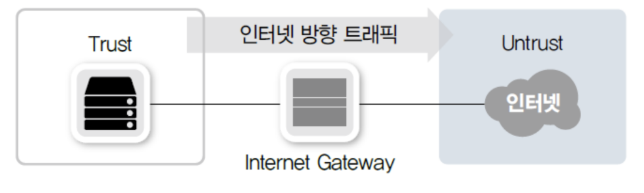

## 보안의 개념과 정의

### 1. 정보 보안의 정의

IT 에서 다루는 정보 보안은 "다양한 위협으로부터 보안을 보호하는 것"을 뜻합니다. 보안의 정의에 맞추어 확장하면 "우리가 생산하거나 유지해야 할 정보에 위험이 발생하거나 사고가 날 염려 없이 편안하고 온전한 상태를 유지하는 일련의 활동"을 정보 보안이라고 합니다.

다음의 3대 보안 정의를 보안의 필수 요소로 볼 수 있습니다.

- 기밀성 (Confidentiality)
- 무결성 (Integrity)
- 가용성 (Availability)

기밀성이란 인가되지 않은 사용자가 정보를 보지 못하게 하는 모든 작업입니다. 가장 대표적인 기밀성은 암호화 작업입니다.

무결성은 정확하고 완전한 정보 유지에 필요한 모든 작업을 뜻합니다. 누군가 정보를 고의로 훼손하거나 중간에 특정 이유로 변경이 가해졌을 때, 그것을 파악해 잘못된 정보가 전달되거나 유지되지 못하게 하는 것이 무결성입니다. IT 의 대표적인 무결성 기술은 MD5 , SHA와 같은 해시 (Hash) 함수를 이용해 변경 여부를 파악하는 것입니다.

가용성은 정보가 필요할 때, 접근을 허락하는 일련의 작업입니다. 보안에 대해 잘 모르는 분들은 가용성이 보안에 포함된 것이 의아할 수 있습니다. 보통 많은 IT 실무자들이 보안을 "막거나 통제만 하는 것"으로 생각하다보니 보안에서 가용성 유지가 중요한 이유를 모르는 것 같습니다. 우리가 유지하는 정보에 대해 사고날 염려 없이 온전한 상태를 유지하는 것이 정보 보안이므로 어떤 이유에서라도 그 정보를 사용할 수 없는 상황이라면 정보 보방넹 실패한 것입니다.

보안의 이 3대 요소 외에 추가로 진정성(Authenticity) , 책임성 (Accountability) , 부인 방지 (Repudiation) , 신뢰성 (Reliability) 유지를 정보 보안 활동 중 하나로 정의하기도 합니다.

여러 기관의 정의를 좀 더 이용해 정보 보안을 간단히 정의하면 '조직의 지적 자산을 보호하는 절차' , '인가된 사용자만(기밀성) 정확하고 완전한 정보로 (무결로) 필요할 때 접근할 수 있도록 (가용성) 하는 일련의 작업' (ISACA , 2008) 입니다.

### 2. 네트워크의 정보 보안

정보 보안을 it 정사자의 행동에 맞추어 더 상세히 표현하면 정보를 수집 , 가공 , 저장 , 검색 , 송수신하는 도중의 정보의 훼손 , 변조 , 유출을 막기 위한 관리적, 기술적 방법을 의미합니다.

네트워크 입장에서의 정보 보안은 수집된 정보를 침해하는 행동을 기술적으로 방어하거나 정보의 송수신 과정에 생기는 사고를 막기 위한 작업입니다. 정보를 가진 시스템을 공격해 유출하거나 사용하지 못하게 하거나 시스템이 동작하지 못하게 해 정보 서비스를 정상적으로 구동할 수 없게 만드는 행위를 네트워크에서 적절히 막는 것이 네트워크 보안의 1차 목표입니다. 또한, 정보는 여러가지 서비스를 제공하기위해 한 자리에만 있는 것이 아니라 네트워크를 통해 복제, 이동되므로 그 유출을 막는 것이 2차 목표입니다.

네트워크 보안을 이해하려면 네트워크를 통한 다양한 공격 방식과 그 공격을 네트워크에서 방어하는 장비와 그 구동방식을 이해해야 합니다. 앞에서 네트워크에 대해 배워왔듯이 (TOP-DOWN 접근 방법이 아닌) BOTTOM-UP 형식으로 네트워크 보안이 발전하고 있습니다.

### 3. 네트워크 보안의 주요 개념

네트워크 보안의 목표는 외부 네트워크로부터 내부 네트워크를 보호한느 것입니다. 이때 외부로부터 보호받아야 할 네트워크를 트러스트 (Trust) 네트워크, 신뢰할 수 없는 외부 네트워크를 언트러스트 (Untrust) 네트워크로 구분합니다.

한단계 나아가 우리가 운영한느 내부 네트워크이지만 신뢰할 수 없는 외부 사용자에게 개방하는 서비스 네트워크인 경우 DMZ(DeMilitarized Zone) 네트워크라고 부르며, 일반적으로 인터넷에 공개되는 서비스를 이 네트워크에 배치합니다.

네트워크 보안 분야는 트래픽의 방향과 용도에 따라 두 가지로 나눌 수 있습니다.

- 인터넷 시큐어 게이트웨이 (Internet Secure Gateway) <br/>
  트러스트(또는 DMZ) 네트워크에서 언트러스트 네트워크로의 통신을 통제

- 데이터 센터 시큐어 게이트웨이 (Data Center Secure Gateway) <br/>
  언트러스트 네트워크에서 트러스트 (또는 DMZ)로의 통신을 통제

이 구분은 보안 장비 시장을 구분할 때도 사용되는데 상황에 따라 요구되는 성능과 기능이 다르기 때문입니다. 인터넷으로 나갈 때는 인터넷에 수많은 서비스가 있으므로 그에 대한 정보와 요청 패킷을 적절히 인식하고 필터링하는 기능이 필요합니다.

반면, 데이터 센터 게이트웨이는 상대적으로 고성능이 필요하고 외부의 직접적인 공격을 막아야하므로 인터넷 관련 정보보다 공격 관련 정보가 더 중요합니다.

전자의 경우를 인터넷 시큐어 게이트웨이라고 하며 방화벽 , SWG (Secure Web Gateway) , 웹 필터 (Web Filter) , 애플리케이션 컨트롤 (Application Control) , 샌드박스 (Sanbox) 와 같은 다양한 서비스나 네트워크 장비가 포합됩니다. 이런 서비스와 보안 장비들은 내부 사용자가 인터넷으로 통신할 때 보안을 제공, 통제하기 위해 사용됩니다.

```
Internet Gateway : 내부 네트워크에서 인터넷으로 향하는 트래픽을 제어하는 장비를 Internet Gateway 라고 한다.
```



후자의 경우를 데이터 센터 시큐어 게이트웨이라고 하며 방화벽 , IPS , DCSG (DataCenter Secure Gateway) , WAF (WebApplication Firewall) , Anti-DDoS(Distribute Denial of Service) 등의 장비가 이런 용도로 사용됩니다.

```
데이터 센터 시큐어 게이트웨이 : 외부 사용자용 서비스를 만들어 외부에 공개할 때 필요한 보안 장비
```


#### 네트워크 보안 정책 수립에 따른 분류

네트워크 보안 정책 수립에 따라 네트워크 보안은 두 가지로 나눌 수 있습니다.

- 화이트리스트 (White List)
- 블랙리스트 (Black List)

화이트리스트는 방어에 문제가 없다고 명확히 판단되는 통신만 허용하는 방식입니다. 인터넷 전체에 대한 화이트리스트를 만들기 어려우므로 일반적으로 IP와 통신정보에 대해 명확히 아는 경우에 많이 사용합니다. 일반적으로 회사 내부에서 사용하는 방화벽이 명확한 정책에 의해 필요한 서비스만 허용하는 화이트리스트방식을 주로 사용합니다.

블랙리스트 방어는 공격이라고 명확히 판단되거나 문제가 있었던 IP 리스트나 패킷 리스트를 기반으로 데이터베이스를 만들고 그 정보를 이용해 방어하는 형태입니다. 각종 패턴으로 공격을 방어하는 네트워크 장비 (IPS , 안티바이러스 , WAF) 들은 일반적으로 블랙리스트 기반의 방어 기법을 제공합니다.

인터넷 어디선가 공격을 당할 때 이것을 분석해 공격 기법을 판단해 탐지하도록 간단히 적어 데이터베이스로 만듭니다. 이런 데이터베이스를 공격 패턴(시그니처 : Signature) 이라고 합니다.

#### 정탐 , 오탐 , 미탐 (탐지 에러 타입)

IPS나 안티바이러스와 같은 네트워크 장비에서는 공격 데이터베이스에 따라 공격과 악성 코드를 구분해 방어합니다. 공격 데이터베이스를 아무리 정교하게 만들더라도 공격으로 탐지하지 못하거나 공격이 아닌데도 공격으로 감지해 패킷을 드롭시킬 때가 있습니다. 블랙리스트 기반 데이터베이스를 이용한 방어는 이런 문제점이 있으므로 장비 도입 시 정교한 튜닝이 필요합니다.

공격을 탐지할 때 원래 예상한 내용과 다른 결과가 나올 수 있습니다. 이런 경우를 오탐지 , 미탐지 (오탐 , 미탐)로 구분하고 정상적으로 탐지한 경우를 정상 탐지(정탐)으로 표한합니다. 이런 용언느 네트워크 보안뿐만 아니라 타 IT 분야나 과학실험을 할 때도 사용합니다.

|                            |         공격상황         |         정상상황          |
| :------------------------: | :----------------------: | :-----------------------: |
|   공격 인지 (공격 알림)    | True Positive (정상탐지) | False Positive (오 탐지)  |
| 정상 인지 (공격 알람 없음) | False Negative (미 탐지) | True Negative (정상 탐지) |

1. 공격이라고 추론했는데 실제로 공격인경우 : True Positive
2. 공격이 아니라고 추론했는데 실제로 공격이 아닌경우 : True Negative
3. 공격이라고 추론해 드롭했는데 공격이 아닌 경우 : False Positive
4. 공격이 아니라고 패킷을 허용했는데 실제로 공격인 경우 : False Negative

1번과 2번은 실제 공격과 공격이 아닌 패킷을 잘 분류했으므로 정상적인 동작입니다. 이런 경우를 정탐(정상 탐지) 라고 하며 ,

3번과 같은 경우 오탐(오 탐지) 라고 부릅니다. 공격으로 오인한 탐지이므로 이런 경우가 발생하면 예외로 처리해 오탐을 줄이는 튜닝작업이 필요합니다.

4번은 공격이 아니라고 판단했지만 실제로는 공격이었으므로 공격 패턴에 대한 업데이트가 되지 않았거나 과도한 예외 처리로 공격 패킷 탐지가 정상적으로 되지 않았을때 발생합니다. 또한, 공격 데이터베이스가 업데이트되기 전에 발생하는 '제로 데이 공격 (Zero-Day Attack)'이 발생했을 대도 False Positive 오류가 생길 수 있습니다.

최근 보안 벤더들은 화이트리스트 기반의 공격 방어 기법과 블랙리스트 기반의 공격 방어 기법을 적절히 섞어 사용할 것을 권고하고 있습니다. 나날이 복잡해지고 악랄해지는 사이버 공격을 쉽게 방어하기는 어려우므로 항상 관심을 가지고 보안을 위해 노력해야 합니다.

## 보안 솔루션의 종류

일반 기업이나 정부/공공기관 등에서 보안을 강화하기 위해 실제 사용하는 상용 소프트웨어 혹은 하드웨어 제품이며 DDOS - 방화벽 - IPS - WAF 형태와 같이 여러 단계로 공격을 막도록 장비를 배치합니다.


### 1. DDoS 방어 장비

Dos 공격은 'Denial of Service' 공격의 약자로 다양한 방법으로 공격 목표에 서비스 부하를 가해 정상적인 서비스를 방해하는 공격 기법입니다. DoS 공격은 적이 공격 출발지에서 공격하는 것이 일반적이었으므로 비교적 탐지가 쉽게 짧은 시간 안에 탐지만 할 수 있다면 IP 주소 기반으로 충분히 방어 가능합니다.

이런 탐지를 회피하고 더 짧은 시간안에 공격 성과를 내기 위해 다수의 봇(bot)을 이용해 분산 공격을 수행하는 DDoS 공격 기법이 등장했습니다.

DDoS 장비는 DDoS 공격을 방어하는 보안 장비이빈다. DDoS 장비는 데이터 센터 내트워크 내부와 외부의 경계에서 공격을 방어하는데 이것은 볼류메트릭 공격 (Volumetric Attack) 을 우선 막기 위해서입니다. 볼류메트릭 공격을 회선 사용량이나 그 이상의 트래픽을 과도하게 발생시켜 회선 사용을 방해하는 공격이므로 회선을 공급해주는 ISP나 네트워크 ISP와 연결되는 데이터 센터 네트워크의 가장 바깥쪽에 위치시켜 이 공격을 완화 (Mitigation) 해야 합니다.

DDoS에 대한 공격 방식과 그에 따른 DDoS 장비의 동작 방식의 자세한 내요응ㄴ 뒤에서 다루겠습니다.

### 2. 방화벽

방화벽은 4계층에서 동작하는 패킷 필터링 장비입니다. 3,4 계층 정보를 기반으로 정책을 세울 수 있고 해당 정책과 매치되는 패킷이 방화벽을 통과하면 그 패킷을 허용(Allow , Permit) 하거나 거부 (Deny) 할 수 있습니다.

일반적으로 방화벽은 DDoS 방어 장비 바로 뒤에 놓는 네트워크 보안 장비입니다. 3,4 계층에서 동작하므로 다른 보안 장비보다 비교적 간단히 동작하고 성능도 우수합니다.

최근 출시되는 고성능 방화벽은 ASIC 나 FPGA 와 같은 전용 칩을 이용해 가속하므로 대용량을 요구하는 데이터 센터에서도 문제없이 사용할 수 있습니다.

### 3. IDS , IPS

IDS (Intrusion Detection System : 침입 탐지 시스템) 와 IPS (Intrusion Prevention System : 침입 방지 시스템)는 방화벽에서 방어할 수 없는 다양한 애플리케이션 공격을 방어하는 장비입니다. 기존에는 IDS와 IPS 장비를 구분했지만 최근에는 애플리케이션 공격을 방어하는 장비를 IPS로 통칭합니다.

IDS와 IPS 는 사전에 공격 데이터베이스 (Signature) 를 제조사나 위협 인텔리전스(Threat Intelligence) 서비스 업체로부터 받습니다. 이후 IDS 와 IPS 장비에 인입된 패킷이 보유한 공격 데이터베이스에 해당하는 공격이라면 차단하거나 모니터링한 후 관리자에게 알람을 보내 공격 시도를 알립니다.

기존에는 공격인 것만 골라 방어하는 블랙리스트 기반의 방어 방식만 제공했지만 프로파일링 기반의 방어 기법이 IPS 장비에 적용되고 애플리케이션을 골라 방어할 수 있는 애플리케이션 컨트롤(Application Control) 기능이 추가되면서 화이트리스트 기반의 방어 기법도 IPS 장비에 적용할 수 있게 되었습니다.

최근에는 데이터 센터 영역의 보안을 위해 방화벽과 IPS 장비를 통합한 DCSG 장비시장이 커지고 있습니다.

### 4. WAF

WAF(Web Application Firewall)는 웹 서버를 보호하는 전용 보안 장비로 HTTP , HTTPS 처럼 웹 서버에서 동작하는 웹 프로토콜의 공격을 방어합니다. IDS/IPS 장비보다 범용성이 떨어지지만 웹 프로토콜에 대해서는 더 세밀히 방어할 수 있습니다.

WAF는 다음과 같이 다양한 형태의 장비나 소프트웨어로 제공됩니다.

- 전용 네트워크 장비
- 웹 서버의 플러그인
- ADC 플러그인
- 프록시 장비 플러그인

WAF는 IPS에서 방어할 수 없는 IPS 회피 공격 (Evasion Attack)을 방어할 수 있습니다. IPS는 데이터를 조합하지 않고 처리하지만 WAF는 프록시 서버와 같이 패킷을 데이터 형태로 조합해 처리합니다.

그래서 회피 공격을 쉽게 만들기 어렵고 데이터의 일부를 수정, 추가하는 기능을 수행할 수 있습니다. 예를 들어 공격 트래픽을 방어만 하지 않고 공격자에게 통보하거나 민감한 데이터가 유출될 때, 그 정보만 제거해 보내줄 수 있습니다. 반면, IPS는 공격을 차단한 후 그에 대한 통보가 어렵고 전체 공격 내요엥 대한 차단만 가능합니다.

### 5. 샌드박스

기존에는 해커가 원하는 목적지에 직접 공격을 수행했습니다. 자신을 숨기기위해 경유지를 통한 공격 외에는 직접적인 공격이 가장 쉬운 방법이었습니다.

이런 공격을 방어할 수단도 많지 않았고 전문적인 보안 장비도 많이 사용되지 않았기 때문입니다.

하지만 보안 장비들이 발전하면서 해커들이 방화벽을 직접 뚫고 원하는 목적지로 공격하는 것이 점점 어려워졌습니다. 해커들은 보안 장비를 우회하기 위해 기존과 다른 방향의 공격을 개발하게 되었습니다.

직접적인 공격 기법 중 기존 보안 장비들을 우회하는 기법들이 많아졌지만 근본적으로 공격 방법이 변했습니다. 직접적인 공격을 원하는 서버에 접근하지 않고 악성 코드를 관리자 PC에 우회적으로 심고 이 악성 코드를 이용해 관리자 PC를 컨트롤하는 방시긍로 공격 목표가 변했습니다. 악성 코드가 든 이메일을 관리자에게 직접 보내거나 관리자가 악성 코드를 내려받도록 다양한 방법으로 유도합니다.

유명한 웹 사이트에 악성 코드가 포함된 낚시성 파일을 올려놓습니다. 영화 파일이나 유틸리티 프로그램을 실행하면 악성 코드가 동작하도록 파일을 변경한 후 사용자가 직접 내려받도록 유도해 PC를 악성코드에 감염시킵니다. 이후 이 PC 들은 외부에서 컨트롤하도록 C&C(Command & Control) 서버를 만들어놓고 감염 pc들이 이 C&C 서버로 연결하도록 조작합니다.

이때 기존 방화벽에서는 내부 사용자가 외부 서버로 통신을 정상적으로 시도한것으로 보이므로 이 공격을 검출하거나 방어할 수 없습니다. 이 공격들이 발전해 현재 APT(Advanced Persistent Threat : 지능형 지속 공격) 와 ATA(Advanced Target Attack : 지능형 표적 공격)가 되었습니다. APT와 ATA의 공격을 막기위해 IPS 장비와 C&C서버와의 통신을 탐지할 수 있는 다양한 형태의 Anti-APT 솔루션들이 개발되었습니다.

샌드박스는 APT 의 공격을 방어하는 대표적인 장비로 악성 코드를 샌드박스 시스템 아넹서 직접 실행시킵니다. 가상 운영체제 안에서 각종 파일을 직접 실행시키고 그 행동을 모니터링해 그 파일들의 악성 코드 여부를 판별하는 방법을 이용합니다. 이 방법은 기존 보안 장비와 보안 솔루션들을 피하는 회피 공격을 탐지하고 기존 보안 솔루션들을 보안합니다.

### 6. NAC

NAC(Network Access Control)은 네트워크에 접속하는 장치들을 제어하기 위해 개발되었습니다. 네트워크에 접속할때 인가된 사용자만 내부망에 접속할 수 있고 인가받기 전이나 승인에 실패한 사용자는 접속 할 수 없도록 제어하는 기술입니다.

내부 PC를 아무리 잘 관리하고 보안 패치를 신속히 수행하더라도 외부 PC가 내부망에 접속해 보안사고를 일으키거나 악성 코드를 전파하는 문제점들이 ㅁ낳이 발생하자 이것을 해결하기 위해 개발되었습니다.

### 7. IP 제어

IP 제어솔루션은 겉으로 보면 NAC 솔루션과 공통적인 기술을 이요하거나 기능이 비슷한 경우도 많습니다. 하지만 IP 제어 솔루션은 국내에서 많이 사용하는 기술로 NAC과 다르 목적을 개발되었습니다.

보안사고 추적이 쉽도록 고정 IP 사용 권고 지침이 금융권에 내려오면서 IP를 할당하고 추적하는 솔루션이 필요해졌고 할당된 IP를 관리하고 나아가 정확히 의도된 IP 할당이 아니면 정상적으로 네트워크를 사용하지 못하게 하는 기능이 필요했습니다. 이 요구사항들을 구현하기 시작한 것이 IP 제어 솔루션입니다.

### 8. 접근 통제

운영자가 서버, 데이터베이스, 네트워크 장비에 직접 접근해 관리하면 각 시스템에서 사용자에 대한 권한을 관리해야 하는데 문제가 발생했을 때, 관리자가 작업 내용을 추적하고 감사하기 어렵습니다.

이런 문제를 해결하기 위해 서버나 데이터베이스에 대한 직접적인 접근을 막고 작업 추적 및 감사를 할 수 있는 접근 통제 솔루션이 개발되었습니다. 접근 통제 솔루션도 에이전트 기반(Agent Based) , 에이전트리스 (Agentless) , 구현 방법에 따라 다양하게 분류할 수 있지만 대부분 배스천 호스트(Bastion Host) 기반으로 구현됩니다.


서버 접근을 위한 모든 통신은 배스천 호스트를 통해서만 가능합니다. 서버 호스트의 방화벽에 배스천 호스트에서 출발한 통신만 허용하고 다른 통신은 모두 방어하도록 설정하고 배스천 호스트의 보안, 감사를 높이면 보안을 강화할 수 있습니다. 이 기법을 발전시킨 것이 현재의 접근 통제/ 감사 솔루션입니다.

최근의 접근 통제 솔루션들은 단순한 접근 제어뿐만 아니라 감사, 보안 이슈 대응 등을 위해 사용자가 작업한 모든 이력을 저장합니다. 윈도의 경우, 화면을 레코딩하고 CLI 기반의 솔루션들은 전체 키보드 타이핑을 저장합니다.

사용자가 접근 제어 솔루션을 통과해 서버에 접근하면 그에 대한 감사 로그도 모두 저장합니다. 또한 권한을 제어해 사용 가능한 명령어 수준도 제한할 수 있습니다.

### 9. VPN

사용자 기반의 VPN 서비스를 제공해 주는 장비를 VPN 장비라고 합니다. 기존에는 별도의 VPN 서비스를 제공하는 하드웨어가 있었지만 현재는 대부분 방화벽이나 라우터 장비에 VPN기능이 포함되어 있습니다.

가장 만힝 사용하는 VPN 은 IPSEC 과 SSL 입니다. IPSEC 은 주로 네트워크 연결용으로 쓰이고 SSLVPN은 사용자가 내부 네트워크에 연결할 때 주로 쓰입니다. VPN에 대해서는 나중에 더 알아보겠습니다.

## 방화벽

### 1. 방화벽의 정의

네트워크 중간에 위치해 해당 장비를 통과하는 트래픽을 사전에 주어진 정책 조건에 맞추어 허용하거나 차단하는 장비가 방화벽입니다.

네트워크에서 보안을 제공하는 장비를 넓은 의미에서 모두 방화벽으로 볼 수 있지만 앞에서 다루었듯이 많은 네트워크보안 장비들이 있고 각 장비마다 목적과 동작방식이 다릅니다. 일반적으로 방화벽은 네트워크 3,4계층에서 동작하며 세션을 인지하는 상태 기반 엔진(Stateful Packet Inspection , SPI) 으로 동작합니다.

### 2. 초기 방화벽

방화벽의 정의에서 언급했듯이 방화벽은 상태 기반 엔진 (SPI) 을 가지고 있어야 합니다. 하지만 SPI엔진이 처음부터 있었던것은 아닙니다. 초기 방화벽에서는 패킷의 인과 관계를 확인하지 못하고 장비에 등록된 정책만으로 단순히 패킷을 필터링했습니다.

패킷의 세션정보나 방향성과 상관없이 순수하게 방화벽에 설정된 정책에 따라 동작하므로 이런 초기 방화벽을 스테이트리스(Stateless) 또는 패킷 필터(Packet Filter) 방화벽이라고 합니다.

패킷이 장비에 인입되면 해당 패킷이 방화벽에 설정된 정책에 일치되는 것이 있는지 확인합니다. 이때 참조하는 조건을 5-튜플(5-Tuple) 이라고 합니다. 5-튜플은 패킷의 3,4계층 헤더 중 Source IP , Destination IP , Protocol No , Source Port , Destination Port 5가지 주요 필드를 뜻합니다. 방화벽에 일치된 정책이 있으면 해당 정책에 따라 그 패킷을 허용하거나 차단합니다.

이와 같은 패킷 필터링 방화벽은 지정된 구간에서 간단한 정책을 정의할 때는 큰 문제가 없지만 인터넷 통신과 같이 불특정 다수 기반의 정책을 정의할 때는 룰셋(Ruleset)이 복잡해지고 보안이 약화된는 문제가 있습니다. 또한, 패킷 단위의 필터링이므로 5-튜플 외의 3,4 계층 헤더를 변조해 공격하면 적절한 방어가 불가능합니다.

하지만 패킷 필터링 자체는 다른 세대의 방화벽 엔진들보다 부하가 적고 간단히 동작하므로 완전히 없어지지 않고 네트워크 장비에서 사용되거나 현대적인 일부 방화벽에서도 특수한 기능을 위해 남겨놓습니다.

지정된 IP들을 방어하는 데는 간단한 패킷 필터링이 부하가 적어 블랙리스트 처리를 위해 방화벽 내부에 패킷 필터링 엔진과 뒤에서 다룰 상태 기반의 SPI 엔진을 함께 동작시키기도 합니다.

### 3. 현대적 방화벽 등장 (SPI 엔진)

기존 패킷 필터 방화벽이 패킷의 상태값 없이 순수하게 정책만으로 제어하던 한계를 극복하기 위해 개발된것이 상태 기반 방화벽 (Stateful Inspection Firewall) 입니다. 현재 우리가 '방화벽' 이라고 부르는 모든 장비는 세션 기반으로 동작하는 상태 기반(SPI) 엔진을 탑재하고 있습니다.

패킷 필터는 가볍고 빠르지만 인터넷과 같이 불특정 다수와 통신할 때는 정책 관리가 매우 힘들었습니다. 통신은 대부분 양방향으로 이루어지는데 패킷 필터 엔진은 통신의 이런 양방향성을 인지하지 못하고 단순히 패킷이 조건과 일치하는지만 검사합니다.

내부 사용자가 외부의 특정 웹페이지에 접속할 때 3 웨이 핸드셰이크(3 Way Handshake)를 거친 후 HTTP 요청과 응답 과정을 거칩니다. 패킷 필터 방화벽에서 이런 트래픽을 처리하기 위해 정책을 선언하려면 목적지가 불특정 다수의 웹이 될 수 있으므로 외부로 나가는 목적지에 대해서는 모든 패킷을 허용해야 합니다. 이렇게 정책을 설정하면 내부에서 외부 웹사이트로 나갈수는 있지만 외부에서 내부로 들어오는 응답에 대한 정책이 없으므로 정상적인 통신이 되지 않습니다. 응답에 대한 정책을 설정해야 한다면 외부의 웹사이트는 불특정이므로 출발지가 모든 IP이여야 하고 목적지 서비스 포트는 내부에서 외부 호출 시 랜던 포트를 지정하므로 마찬가지로 모든 포트가 되어야 합니다. 하지만 이런 정책 설정은 보안상 매우 취약하므로 설정하면 안됩니다.

이런 문제때문에 패킷 상태를 인지해 패킷의 인과관계를 파악할 수 있는 상태 기반 SPI 엔진이 나오게 되었습니다.

SPI 엔진은 패킷의 인과 관계와 방향성을 인지해 정책을 적용할 수 있어 내부 네트워크에서 인터넷으로 통신할때 유용하게 사용됩니다. 내부에서 외부 인터넷으로 통신을 시도해 받은 응답과 외부에서 내부로 직접 들어오려는 패킷을 구분할 수 있습니다.

### 4. 방화벽 동작 방식

최근 방화벽들은 보안을 강화하고 성능을 높이기 위해 여러 개의 엔진과 다양한 기능을 가지고 있고 이를 위해 동작 방식이나 패킷 처리 순서가 다를 수 있습니다. 이번 절에서 다루는 방화벽 동작 방식이 모든 방화벽의 동작 방식과 일치하지는 않겠지만 여기서 다루는 방화벽 동작 방식을 이해하는 것만으로도 방화벽을 이해하는데 충분히 도움이 될 것입니다.

방화벽이 패킷을 처리하는 순서를 간단히 나열하면 다음과 같습니다.


1. 장비에 패킷이 들어오면 우선 세션 상태 테이블을 확인합니다.
2. 조건에 맞는 세션 정보가 세션 테이블에 있을때, 포워딩 테이블을 확인합니다. (라우팅 , ARP 포함)
3. 조건에 맞는 세션 정보가 세션 테이블에 없을때, 방화벽 정책을 확인합니다.
4. 방화벽 정책은 맨 위의 정책부터 확인해 최종 정책까지 확인한 후 없을때 암시적인 거부(Implicit Denial) 규칙을 참고해 차단됩니다.
5. 허용 규칙이 있으면 내용을 세션 테이블에 적어 넣습니다.
6. 포워딩 테이블을 확인합니다.(라우팅 ARP 포함)
7. 조건에 맞는 정보가 포워딩 테이블에 있을 때, 적절한 인터페이스로 패킷을 포워딩합니다.
8. 조건에 맞는 정보가 포워딩 테이블에 없을때, 패킷을 폐기합니다.

SPI 엔진을 가진 방화벽은 세션 인지 기능이 있어 단순히 5-튜플 조건만 확인하는 것이 아니라 OSI 3,4계층의 세부적인 필드도 함께 확인합니다. TCP 컨트롤 플래그에 따라 동작방식이 변하거나 시퀀스와 ACK 번호가 갑자기 변경되는 것을 인지해 세션 탈취 공격을 일부 방어할 수 있습니다. 이것을 TCP Anti-Replay 기능이라고 합니다. 세션을 추가로 인지하고 세션 테이블에 저장하므로 세션을 로깅하기 쉽습니다.

대부분의 방화벽은 통신 전체의 세션을 로그로 저장할 수 있습니다. 보안사고 시 이런 세션 로그를 기반으로 어떤 통신에 문제가 있었는지 판단할 수 있습니다.

```
참고 : 5-튜플 데이터

5-튜플은 TCP/IP 를 연결을 구성하는 5개의 서로 다른 값의 집합입니다. 출발지, 도착지 , IP , 포트 , 프롵토콜 5가지 데이터 입니다.

1. source ip : 데이터를 전달하는 출발지 ip
2. source port : 데이터를 전달하는 출발지의 포트 번호
3. destination ip : 데이터를 전달받는 목적지 ip
4. destination port : 데이터를 전달받는 목적지의 포트 번호
5. protocol : 프로토콜 번호 (3계층의 프로토콜 지시자로 TCP , UDP 지정시 사용)
```

### 5. ALG

방화벽은 패킷 필터 엔진보다 헤더 정보를 상세히 확인하고 세션을 인지할 수 있지만 애플리케이션 헤더 정보를 인지할 수 없습니다. 세션 방화벽 등장 이전에 개발된 고대 프로토콜은 방화벽과 같은 세션 장비를 고려하지 못해 통신 중간에 방화벽이 있으면 정상적인 통신이 불가능한 경우가 발생합니다.

가장 대표적인 프로토콜이 FTP 입니다. FTP는 컨트롤 프로토콜과 데이터를 보내는 데이터 프로토콜이 분리되어 동작합니다. FTP는 컨트롤 프로토콜과 데이터 프로토콜이 반대로 세션을 맺으므로 방화벽이 FTP 프로토콜을 이해해 동작하지 않으면 정상적인 서비스가 불가능합니다.

FTP의 기본동작은 다음과 같습니다.


1. 클라이언트는 랜던 포트 2000을 통해 서버 커맨드 (Command) 포트 21에 접속하고 데이터 포트로 사용할 2001(n+1) 포트 정보를 서버에 전송한다.
2. 서버에서 클라이언트의 커맨드 포트(21)에 응답합니다.
3. 서버는 서버의 데이터 포트(20)를 클라이언트의 데이터포트 (2001)에 접속한다.
4. 클라이언트에서 서버의 데이터 포트에 응답한다.

세션 기반으로 동작하는 방화벽은 세션의 방향성이 매우 중요한데 FTP 액티브 모드(Active Mode)에서는 초기 접속 방향과 반대로 데이터 프로토콜이 동작하므로 방화벽을 정상적으로 통과할 수 없습니다.

이 문제를 해결하기 위해 FTP 통신 방식을 패시브 모드로 변경하면 되지만 패시브 모드 자체를 제공하지 못하는 컴포넌트가 있을 수 있고 이미 개발된 애플리케이션 변경이 불가능한 경우도 있습니다. 그래서 방화벽에서 FTP 액티브 모드를 통과시키기 위해 애플리케이션 프로토콜을 확인하고 필요에 따라 세션을 인지해 포트를 자동으로 열어줍니다. 이것을 ALG(Application Layer Gateway) 기능이라고 합니다.

일반적으로 ALG 기능은 PAT(Port Address Translation) 기능이 동작하는 방화벽에서 PAT를 정상적으로 통과하지 못하는 프로토콜들을 자동으로 인지해 애플리케이션 정보를 변경해주거나 세션 테이블을 만들어주는 작업을 수행합니다. FTP ALG 기능이 동작하려면 패킷이 방화벽을 지나갈 때, 방화벽이나 해당 패킷이 참조되는 정책에 ALG 기능이 활성화되어 있어야 합니다.

다음은 FTP 프로토콜이 방화벽을 지나갈 때의 방화벽 동작 순서입니다.

1. FTP ALG 기능은 초기 FTP 요청 커맨드를 모니터링합니다.
2. 서버 쪽에서 사용할 데이터 세션에서 사용할 포트를 클라이언트로 알려줄 때, 이 정보를 확인하고 적절한 세션 정보를 만듭니다. 서버의 출발지 IP 와 포트는 TCP 20번으로, 클라이언트의 IP 와 서버에서 알려준 포트를 도착지로 하는 세션을 만들어 세션 테이블에 올립니다.
3. 서버에서 클라이언트로 데이터 세션을 열 때, 세션 테이블에 이미 정보가 들어가 있어 정책을 확인하지 않고 패킷을 포워딩합니다.

방화벽에서는 FTP 액티브 모드와 같이 방화벽을 이해하지 못하는 프로토콜을 위해 다양한 ALG기능이 제공됩니다. ALG 가 편리한 기능이고 중요한 프로토콜을 지원하지만 모든 프로토콜에 맞추어 개발될 수는 없으므로 ALG가 프로토콜이 방화벽을 통과하지 못하는 문제의 완벽한 해결책은 아닙니다. 최근 대부부느이 애플리케이션이 이런 방화벽이나 NAT(Network Address Translation)를 고려해 개발되고 있고 STUN(Session Traversal Utilities for NAT) 과 같은 홀 펀칭(Hole Punching) 기술들도 많이 발전해 오래된 프로토콜을 제외하면 ALG 기능을 사용하지 않는 추세입니다.

### 6. 방화벽의 한계

상태 기반 방화벽 개발로 인해 많은 공격을 쉽게 방어할 수 있게 되었습니다. 전문적인 지식으로 한정된 네트워크에서만 힘들게 유지해온 패킷 기반 방화벽과 달리 매우 간단한 정책만으로 방화벽을 유지할 수 있게 되었습니다.

방화벽이 많은 곳에서 사용되자 기존 공격 방식으로는 해킹이 어려워져 다양한 방법의 새로운 공격 방식이 생겨났습니다. 공격 목표가 시스템이나 계정 탈취에서 서비스 중단 쪽으로 바뀌고 DDoS 공격이 새로운 트렌드가 되었습니다. 방화벽을 우회하는 다양한 공격이 개발되고 특히 대규모 웜 공격으로 인터넷 서비스가 마비되면서 방화벽의 한계가 명확히 드러났습니다. SPI 엔진을 사용하는 방화벽은 적은 리소스로도 다양한 공격을 쉽게 방어할 수 있었기 때문에 네트워크 보안에서 필수 요소가 되었지만 OSI 3,4계층에서만 동작하므로 많은 한계가 있습니다.

방화벽과 같은 보안 장비를 인지하지 못하고 개발된 여러 가지 프로토콜을 방화벽에서 처리하기 위해 ALG 기능이 일부 애플리케이션을 인지할 수 있엇지만 근복적으로 바이러스를 감지하거나 백도어나 인터넷 웜을 방허라 수는 없었습니다. 또한, 알려진 취약점을 악용한 다양한 공격도 방어할 수 없었습니다. 취약점은 대부분 애플리케이션이나 애플리케이션 프로토콜에서 보유하고 있어 애플리케이션 영역을 검사하지 못하는 방화벽으로서는 대응이 불가능했습니다.

이런 웜 공격을 막기 위해 등장한 보안 장비가 IPS입니다. 방화벽과 IPS외에도 계속 진화하는 공격을 막기 위한 다양한 네트워크 장비가 개발되어 왔습니다.

```
참조 : 현대 방화벽 NGFW , UTM

상태 기반 방화벽은 레거시 방화벽 (Legacy Firewall) 이라고 합니다.
사이버 공격이 점점 복잡해지고 악랄해지면서 그에 대응하는 방화벽도 많이 발전해야 했습니다. 기존 방화벽과 달리 네트워크 보안 장비의
기능을 대부분 흡수해 통합했고 APT 공격에 대응하는 샌드박스 기능이 연계되어 제공되는 경우도 있습니다.

NGFW (Next Generation Firewall)와 UTM(Unified Threat Management Firewall) 은 방화벽을 애플리케이션 영역까지 확장한 보안 장비입니다.
하지만 내부적으로 구현하는 방법은 다릅니다.
NGFW는 다양한 보안 장비의 기능이 논리적으로 통합되어 있고
UTM은 물리적인 여러 가지 엔진을 통합해 함께 동작하는 방식입니다.
두 장비 모두 다양한 보안 기능이 통합되어 있고 애플리케이션 계층을 포함해 보안을 제공한다는 공통점이 있습니다.
```

```
참조 : NFV

최근 네트워크 컴포넌트를 가상화해 범용 하드웨어에 적용하려는 노력이 진행되고 있습니다. 이 기술은 NFT(Network Function Virtualization)
이라고 부르고 범용 x86기반의 하드웨어에 가상화 서버 형태로 라우터, 방화벽 , L4 스위치와 같은 장비를 탑재합니다.

ASIC와 같은 전용 칩세트를 이용할 수 없어 성능에 한계가 있지만 서비스 체이닝 기술을 이용해 새로운 서비스를 손쉽게 추가,
삭제, 적용할 수 있다는 장점이 있고 최근 DPDK , SP-IOV 와 같은 I/O 가속 기술들이 적용되면서 대형 사업자를 중심으로 실제 환경에
속속 적용되고 있지만 전용 어플라이언스 (Appliance) 장비와 비교해 성능이나 기능면에서 아직 분명한 한계가 있습니다.

충분한 네트워크 보안 처리 속도를 유지하면서 다양한 공격을 효과적으로 방어하기 위해 전문화 된 다양한 네트워크 보안 제품이 있어왔고
이 장비들을 효율적으로 운영하기 위해 복잡한 네트워크 구조를 가질 수 밖에 없었습니다.
이런 복잡성을 없애기 위해 네트워크 보안기술들이 발전하면서 이 다양한 장비들을 묶어 하나의 장비로 제공하거나
여러 장비가 유기적으로 동작하는 방향으로 기술이 발전하고 있습니다.
```

## IPS , IDS

웹 서비스를 제공하려면 TCP 80 포트를 외부 사용자에게 공개해야 하는데 Apache 나 IIS 서버의 취약점을 악용한 공격은 방화벽에서 구분해 필터링 하고 모니터링 할 수 없습니다. 애플리케이션 계층에서 이루어지는 이런 다양한 공격을 탐지, 방어하기 위해 IDS 와 IPS가 개발되었습니다.

### 1. IPS , IDS의 정의

IDS란 Instruction Detection System(침입 탐지 시스템)의 약자입니다. 공격자가 시스템을 해킹할 때 탐지를 목적으로 개발된 시스템입니다. '방버'보다 '탐지'에 초첨을 맞추어 개발되어 공격에 직접 개입하거나 방어하는 것이 아니라 트래픽을 복제해 검토하고 침임 여불르 판별합니다.

```
IDS는 복제된 트래픽을 감시하고 공격을 타밎하면 알림을 보낸다. 자체 방어 기능은 업석나 세션을 리셋하는 일부 기능이 있을 수 있다.
```


IPS는 Intrusion Prevention System(침임 방지 시스템)의 약자입니다. 탐지에 초점을 맞춘 IDS와 달리 공격이 발견되면 직접 차단하는 능력을 갖춘 장비입니다. 트래픽을 복제해 검토만 하는 것이 아니라 트래픽이 지나가는 인라인(Inline)상에 장비를 배치합니다. IDS와 IPS는 적극적으로 통신에 개입해 유해 트래픽을 차단, 방어하는 것외에도 회피 공격을 차단하기 위한 세션 이해 가능 여부 , 능동적 방어를 위한 어노말리(Anomaly) 등 다양한 기능으로 구분합니다. 최근 도입된 솔루션은 대부분 IPS이므로 이후 용어를 IPS로 통일하고 기능들도 IPS를 기준으로 설명하겠습니다.


IPS는 호스트 기반 IPS와 네트워크 기반 IPS가 있습니다. 보안 트랜드나 시대적 요구사항에 따라 유행하는 방어 방식이 바뀌지만(예를 들어 엔드포인트 보안이 강조될 때는 호스트 기반 IPS 솔루션들이 많이 소개되고 네트워크 보안이 강조될 때는 네트워크 IPS 장비들이 더 많아집니다.) 일반적으로 IPS라고 부르는 시스템은 네트워크 기반 NIPS(Network based IPS) 입니다.

쿨라우드 네트워크의 여러가지 제약사항 때문에 클라우드 내부 네트워크에서 NIPS 배포가 어려워 HIPS(Host based IPS) 사용 빈도가 늘었지만 여러가지 불편한 점(서비스와 로슷 공유, 장애 발생 시 장애 주체 파악의 어려움) 때문에 클라우드 내부에서도 네트워크 기반 NIPS 로 바뀌는 추세입니다.

### 2. IPS , IDS의 동작 방식

기본적으로 IPS는 공격 데이터베이스(Signature)를 사용한 패턴 매칭 방식으로 운영되지만 프로토콜 어노말리 (Protocol Anomaly) , 프로파일 어노말리 (Profile Anomaly) 등의 다른 기법으로 공격을 방어합니다.

#### 패턴 매칭 방식

IPS에는 공격을 탐지, 방어하는 다양한 기술이 있습니다. 기존 공격이나 취약점을 통해 공격 방식에 대한 데이터베이스를 습득하고 그 최신 애용을 유지하다가 공격을 파악하는 기술을 패턴 방식, 시그니처 방식, 데이터베이스 방식 방어라고 합니다.

이런 패턴 기반 방어가 IPS 기능의 상당 부분을 차지하므로 IPS는 많은 공격 데이터베이스를 보유 (최근 대부분의 IPS 생산업체는 10000 개 이상의 공격 데이터베이스를 보유하거나 적용하고 있다) 해야 하고 최신 공격 방식을 공격 데이터베이스에 최대한 신속히 반영하는 것이 매우 중요합니다.


코드 레드 웜은 웹 서버에 간단한 공격 스트링을 가진 요청이 도달하기만 해도 IIS의 추약점에 의해 웹 서버에 감염됩니다. 감염된 웹 서버는 다시 다른 서버로 공격을 수행하는 공격자로 바뀌어 공격 패킷을 다수의 다른 서버로 전송하게 됩니다.

위에서 설명했들이 IPS에는 코드 레드 웜의 공격 패턴 데이터가 이미 있습니다. 위와 같은 코드 레드 공격은 default.ida?NNNNNN 과 같은 특별한 문자열을 모니터링하고 있다가 자신이 보유한 데이터베이스에 매칭되는 패킷이 들어오면 이 공격을 방어합니다.

#### 어노말리 공격 방어

패턴 매칭 기반의 방어가 유효하려면 실제로 공격이 들어오기 전에 해당 공격에 대한 패턴 데이터베이스가 확보되어 있어야 합니다. 이 패턴 기반의 방어는 극미한 변화만 생겨도 적절한 대응이 어려웠고 인터넷상으로 빠르게 전파되는 웜 공격 변종을 적절한 타이밍에 막아내기 어려웠습니다.

초기 웜은 인터넷 전체에 퍼지는 속도가 한 달이었다가 알고리즘이 점점 진화해 단 4시간 만에 인터넷 전체에 퍼집니다. 일반적인 정기 업데이트가 하루부터 수일 사이인 패턴 데이터베이스 업데이트로는 이렇게 급속히 전파되고 진화하는 공격을 효과적을 방어할 수 없었습니다. 기존 블랙리스트 기반의 방어 방식인 패턴 기반 방어의 한계때문에 IPS 에서도 화이트리스트 기반의 방어 기법이 개발되었는데 바로 어노말리입니다.

기존 패턴 기반의 공격 방어는 분명히 공격인 것만 찾아내 방어했다면 어노말리 기법은 분명한 공격으로 파악되지 않더라도 특정 기준 이상의 행위를 이상하다고 판단하고 방어하게 됩니다.

이런 어노말리 기법은 프로파일 어노말리(Profile Anomaly)와 프로토콜 어노말리 (Protocol Anomaly)로 나뉩니다.

##### 프로파일 어노말리

프로파일 어노말리는 평소 관리자가 정해놓은 기준이나 IPS 장비가 모니터링해 정해진 기준과 다른 행위가 일어나면 공격으로 판단합니다. 프린트 서버에 FTP 패킷이 전송되는 경우, 평소 1MB 이하의 트래픽이 발생하던 시스템에서 갑자기 수십 MB 이사으이 트래픽이 발생한 경우처럼 평소와 다른 행위에 초점을 맞춥니다.

웜이 감염되면 다른 타깃으로 다량의 트래픽을 발생시켜 감염시키는 행위를 반복하므로 이런 형태의 공격을 방어하는 데 효과가 있었습니다.

이 기능은 동적 프로파일 기능이 강화되면서 향후 DDoS 방어 장비로 진화했습니다.

##### 프로토콜 어노말리

SPI 방화벽과 NAT 기능이 대중화되면서 해커가 직접 일반 사용자의 PC를 쉽게 공격할 수 없게 되었습니다. 상태 기반 SPI 방화벽에서 인터넷으로 나가는 방향의 통신은 모두 허용하고 인터넷에서 내부로 들어오는 방향의 통신은 모두 거부하는 것만으로도 외부에서 내부로 직접 공격할 수 없게 되었습니다.

방화벽을 우회해 내부 사용자의 PC를 공격하기 위해 해커는 사용자가 웹 서버나 이메일에 악성 코드를 올려놓고 내부 사용자가 악성코드를 내려받아 직접 실행하도록 유도합니다.

사용자의 PC에서 실행된 악성코드가 외부 C&C 서버와 연결되고 이 연결을 사용해 사용자 정보를 전달하고 해커의 지시에 따라 동작합니다. 흔히 이런 악성 코드에 감염된 PC 를 좀비PC라고 합니다.

이때 좀비 PC가 정상적으로 서비스를 요청하는 것처럼 동작하므로 일반 방화벽에서는 이런 공격에 대한 탐지와 방어가 불가능합니다.

이런 공격을 방어하기위해 IPS 가 필요하면 IPS 기능 중 프로토콜 어노말리 기법이 사용됩니다. 감염된 내부 PC가 외부와 공격을 위한 통신을 할때는 잘 알려진 서비스 포트를 사용하지만 실제 해당 서비스 포트에서 동작하는 프로토콜이 아닌 다른 프로토콜을 사용하는 경우가 흔하며 이 경우, 공격을 의심해볼 수 있습니다.

잘 알려진 포트와 실제로 통신하는 프로토콜이 다를 때, 이것을 파악해 적절히 제어하는 기법은 프로토콜 어노말리라고 합니다.

### 3. IPS, IDS의 한계와 극복 (NGIPS)

IPS와 IDS도 방화벽과 같이 네트워크 보안의 필수 장비가 되었지만 IPS는 근본적인 문제가 있습니다. 네트워크상에서 빠른 속도로 애플리케이션 레벨까지 확인하기 위해 플로(Flow) 엔진을 사용합니다.

플로 엔진은 패킷을 모아 데이터 형태로 변환해 검사하는 것이 아닌 패킷이 흘러가는 상황을 모니터링해 공격을 탐지하므로 IPS 장비를 비교적 쉽게 우회할 수 있습니다.

IPS 는 오탐이 많이 발생하므로 초기에 설치된 환경에 맞는 튜닝작업을 오래 해주어야 하며 별도의 관제 인력이 장비를 모니터링하고 환경에 맞는 최적화 작업을 지속적으로 수행해주어야 합니다. 너무 많은 오탐과 알람 때문에 장비가 공격을 정상적으로 방어하지 못하거나 정상적인 서비스가 차단될 수도 있습니다.

이 문제를 해결하기 위해 예외 처리되는 경우도 많으며 IPS를 설치만 하고 제대로 사용하지 못하는 경우도 많습니다.

최근 기존 IPS의 기능을 향상시켜 문제점을 해결한 NGIPS(Next Generation IPS) 개념의 장비가 출시되었습니다. 애플리케이션을 인지하거나 다양한 시스템과 연동할 수 있고 특히 APT 공격을 방어하기 위한 일부 기능ㅇ ㅣ탑재되어 있거나 다양한 외부 시스템과 연동할 수 있는 NGIPS 장비들이 많이 소개되고 있습니다.

방화벽이 NGFW , UTM으로 발전했듯이 IPS 도 다양한 장비가 통합되는 추세이고 IPS 단독시장은 축소되고 있습니다.

```
참조 : IPS 가 공격 데이터베이스를 얻는 방법

IPS 가 공격을 제대로 방어하려면 최신으로 업데이트된 공격 데이터베이스가 필요합니다. 이 공격 데이터베이스는 실제로 해킹에 사용된 흔적을 이용해 작성하는 경우가 많습니다.
이런 새로운 공격을 탐지하기 위해 인터넷에 허니팟(Honeypot) 시스템을 구축합니다.

공격에 대한 방어가 없고 취약점이 많은 허니팟을 공격 대상으로 생각하고 공격하게 됩니다.
허니팟 시스템은 이런 공격을 모두 로깅하고 해킹 이후 이 공격 기법을 분석해 공격 데이터베이스로 바꾸는 작업을 도와줍니다.
```

## DDoS 방어 장비

방화벽의 중요 엔진인 SPI 엔진 개발 이후 네트워크 보안 담당자의 운영 부하가 대폭 줄고 많은 기관에서 방화벽을 도입하면서 해커들의 공격이 점점 어려워졌습니다. 간단한 정책으로 다양한 공격을 원천차단하므로 매우 효과적인 장비였고 네트워크 보안의 기본은 방화벽이라는 인식이 널리 퍼졌습니다.

이런 상황에서 새로운 형태의 공격이 나타났습니다. 기존 공격은 직접 공격해 관리자 권한을 탈취하는 데 초점이 맞추어져있었다면 방화벽 대중화 이후의 공격은 정상적인 서비스가 불가능하도록 방해하는 데 초점이 맞추어져 있스비다. 이 공격 방식을 DoS(Denial of Service) 공격이라고 합니다. 하지만 해커 단독으로 하나의 서비스를 불가능하게 만드는 데는 제한이 많습니다.

그래서 다수의 공격자를 만들어 동시에 DoS 공격을 하는 분산형 DoS인 DDoS 공격 방식으로 발전했고 이런 공격을 방어하기 위해 DDoS 전용 장비가 등장했습니다.


### 1. DDoS 방어 장비의 정의

초기 DDoS 공격은 시스템이나 네트워크 장비의 취약점이 타깃인 경우가 많았습니다. 단순한 서버 공격에서 네트워크 장비나 DNS 서비스와 같인 인프라 기반 서비스 제공 영역까지 DDoS 공격이 확대되었습니다.

단순한 DDoS 형태의 공격들도 다양한 기존 장비를 보완하는 기능이 나오고 취약점을 노린 DDoS 공경도 제조업체드르이 보안 패치 대응으로 큰 효과를 발휘하지 못하자 다양한 DDoS 공격 형태가 등장했습니다. 이렇게 다양한 DDoS 공격을 방어하기 ㅜ이한 전문적인 장비의 필요성이 대두되었고 DDoS 전용 방어 장비가 나타났습니다.

DDoS 방버 장비는 볼류메트릭 공격을 방어하기 위해 트래픽 프로파일링 기법을 주로 사용하고 인터넷의 다양한 공격 정보를 수집한 데이터베이스를 활용하기도 합니다.

### 2. DDoS 방어 장비 동작 방식

DDoS 방어 서비스로는 클라우드 서비스 , 회선 사업자의 방어 서비스 , DDoS 방어 장비를 사내에 설치하는 방법이 있습니다. 회선 사업자와 DDoS 방어 장비를 이원화해 협조하는 서비스도 많이 등장하고 있습니다. DDoS 는 워낙 대규모 공격이므로 DDoS 탐지 장비와 방어 장비를 구분하는 경우가 많았습니다.

DDoS 공격을 탐지해 공격을 수행하는 IP 리스트를 넘겨주면 방어 장비나 ISP 내부에서 이 IP를 버리는 것이 가장 흔한 DDoS 방어 기법입니다.

DDoS 장비가 DDoS 여부를 판별하는 방식은 다양합니다. 우선 ddOs 방어 장비의 주요 차단 방법인 프로파일링 기법입니다. 평소 데이터 흐름을 습득해 일반적인 대역폭, 세션량 , 초기 접속량 , 프로토콜별 사용량 등을 저장합니다. 이렇게 습득한 데이터와 일치하지 않는 과도한 트래픽이 인입되면 알려주고 차단합니다. 습득한 데이터는 다양한 날짜 범위와 다양한 요소를 모니터링합니다.

또 하나의 방법은 일반적인 보안 장비처럼 보안 데이터베이스 기반으로 방어하는 것입니다. ip 평판 데이터베이스를 공유해 DDoS 공격으로 사용된 IP 기반으로 방어 여부를 결정하거나 특정 공격 패턴을 방어하는 방법이 있습니다.

### 3. DDoS 공격 타입

DDoS 공격은 다양한 기법이 있지만 일반적으로 회선 사용량을 가득 채우는 볼류메트릭 (Volumetric Attack)과 3,4계층의 취약점과 리소스 고갈을 노리는 프로토콜 공격 (Protocol Attack) , 애플리케이션의 취약점을 주로 노리는 애플리케이션 공격 (Application Attack) 3가지가 있습니다. 다음은 DDoS 의 주요 공격 타입을 정리한 표입니다.

|                          |                                                                                  볼류메트릭 공격                                                                                   |                                                                                                           프로토콜 공격                                                                                                            |                                                                               애플리케이션 공격                                                                               |
| :----------------------: | :--------------------------------------------------------------------------------------------------------------------------------------------------------------------------------: | :--------------------------------------------------------------------------------------------------------------------------------------------------------------------------------------------------------------------------------: | :---------------------------------------------------------------------------------------------------------------------------------------------------------------------------: |
|         무엇인가         |                                        대용량의 트래픽을 사용해 공격 대상의 대역폭을 포화시키는 공격 간단한 증폭기술을 사용해 생성하기 쉬움                                        |                                                                            3,4계층 프로토콜 스택의 취약점을 악용해 대상을 액세스 할 수 있게 만드는 공격                                                                            |                                        7계층 프로토콜 스택의 약점을 악용하는 공격. 가장 정교한 공격 및 식별, 완화에 가장 까다로운 공격                                        |
| 장애를 어떻게 일으키는가 | 공격에 의해 생성된 트래픽 양은 최종 자원 (웹 사이트 또는 서비스)에 대한 액세스를 완전히 차단할 수 있음. 쓸모없는 패킷이 회선을 모두 차지해 정상적인 서비스 트래픽이 통과할 수 없음 | 공격 대상이나 중간 위험 리소스의 처리 용량을 모두 사용해 서비스 중단을 유발함. 일반적인 네트워크 장비나 네트워크 보안 장비를 대상으로 하는 경우가 많음 공격 대상 장의 CPU , 메모리 자원을 고갈시켜 정상적인 서비스를 불가능하게 함 | 대상과의 연결을 설정한 후 프로세스와 트랜잭션을 독점해 서버 자원을 소모시킴. 애플리케이션 프로토콜 자체의 취약점이나 서비스를 제공하는 플랫폼의 취약점을 악용하는 경우가 많음 |
|           예제           |                                                              NTP 증폭 , DNS 증폭, UDP 플러드(UDP Flood) , TCP 플러드                                                               |                                                                                                     Syn 플러드 , Ping of Death                                                                                                     |                                                                  Http 플러드 , DNS 서비스 공격 , Sloworis 등                                                                  |

DDoS 방어 장비는 자동 프로파일링 기법을 지원하고 사전에 정의된 공격 데이터베이스를 이용해 애플리케이션 공격 방어도 가능하지만 DDoS 장비의 주요 방어 목표는 볼류메트릭, 프로토콜 공격입니다.

### 4. 볼류메트릭 공격

볼류메트릭 공격은 회선 사용량이나 그 이상의 트래픽을 과도하게 발생시켜 회선을 사용하지 못하게 하도록 방해하는 공격이므로 회선을 공급해주는 ISP 내부나 사용자 네트워크 최상단에 위치시켜 이 공격을 완화(Mitigation) 해야합니다. DDoS 장비는 주로 볼류메트릭 공격이나 프로토콜 공격을 방어하는데 사용됩니다. 혼자 방어할 수 없는 공격도 많으므로 회선을 공급하는 ISP 와 공조해 방어할 필요가 있습니다.

#### 좀비 pc를 이용한 볼류메트릭 공격

볼류메트릭 공격은 특정 시간에 특정 타깃을 공격하는 형태로 발생합니다. 이런 공격을 하려면 미리 악성 코드에 감염되어 해커가 컨트롤할 수 있는 좀비 PC를 많이 확보해두어야 합니다.

좀비 PC를 미리 충분히 확보하지 못하거나 더 강력한 DDoS 공격을 위한 증폭 공격(Amplification Attack) 이 증가하고 있습니다. 최근 수백 Gbps부터 1Tbps 이상에 이르는 엄청나게 높은 대역폭의 공격은 대부분 증폭 공격으로 수행됩니다.

공격자가 상대적으로 적은 대역폭으로 중간 리플렉터 패킷을 보내면 이 트래픽이 증폭되어 피해자 네트워크에 수십~수백배의 공격 트래픽이 발생하는 공격법을 증폭 공격이라고 합니다.

[그림 385쪽]

이런 볼류메트릭 공격을 방어할 수 있는 DDoS 장비를 보유하는 것도 중요하지만 혼자서는 대부분 방어가 불가능하므로 ISP를 통한 방어나 Colud DDoS 솔루션을 통해 서비스 네트워크로 트래픽이 직접 도달하지 못하도록 조치해야 합니다.

볼류메트릭 공격 방어를 위해 클라우드 기반의 DDoS 방어 서비스도 고려해볼 수 있습니다. 클라우드 기반 서비스는 DDoS, WAF(Web Application Firewall)과 같은 별도의 보안 장비 없이도 다양한 DDoS 공격을 방어할 수 있다는 장점이 있습니다. 실제 서비스 서버 앞에서 미리 클라이언트의 오청을 받아 처리한 후 문제가 없는 요청만 서버 쪽으로 전달합니다. 클라우드 기반 서비스의 최대 장점은 실제 서비스 네트워크가 가려지므로 네트워크 차원이나 대규모 볼류메트릭 공격도 큰 투자 없이 방어할 수 있다는 것입니다.

```
클라우드 기반의 DDoS 방어 서비스는 실제 데이터 센터의 서버 주소는 감추어져있고 클라우드에서 미리 요청 받아 처리한다.
```

## VPN

VPN 은 Virtual Private Network 의 약자입니다. 2절에서 보았듯이 물리적인 전용선이 아닌 공중망을 이용해 논리적으로 직접 연결한 것처럼 망을 구성하는 기술입니다. 이렇게 논리적으로 직접 연결된 것처럼 만들어주는 통로를 터널(Tunnel) 이라고 하며 VPN 을 이용하면 터널을 이용해 직접 연결한 것처럼 동작합니다.

터널링 기법만 제공할 수 있다면 VPN 이라고 할 수 있지만 터널링만 제공하는 기법은 자주 사용되지 않습니다. VPN은 주로 인터넷과 같은 공중망을 전용선과 같은 사설망처럼 사용하기 위해 도입하므로 강력한 보안을 제공해야 합니다. 그래서 IPSEC, SSL 과 같은 암호화 기법을 제공하는 프로토콜이 VPN에 주로 사용됩니다.

```
참조 : 전용 회선과 VPN

인터넷 망이 아닌 전용 회선으로 직접 연결할 때도 전용 회선을 통해 VPN을 추가로 구성하는 경우가 있습니다.
전용회선은 종단 간에 직접 연결하지만 회선 자체에는 데이터가 그대로 흐르므로 암호화가 되지 않습니다.
그래서 보안을 더 강화하기 위해 전용 회선에 VPN을 추가로 구성해 데이터를 암호화하기도 합니다.
물론 이런 데이터 암호화는 VPN 장비가 아닌 애플리케이션 단에서도 가능합니다.
```


기업자 입장의 VPN 기술에서는 인터넷이라는 공용 망을 이용하므로 안전하게 통신할 수 있도록 암호화와 인증과 같은 보안 강화 기술을 적용해야 합니다.

과거에는 PPTP , L2TP , GRE와 같이 암호화를 지원하지 않거나 매우 간단한 암호화만 지원하는 기술들이 주로 쓰였지만 최근에는 이런 기술을 사용하더라도 IPSEC 의 보안 기술이 추가적으로 함께 사용됩니다.

일반적으로 본사-지사처럼 네트워크 대 네트워크 연결에는 IPSEC VPN 기술이 사용되고 개인 사용자가 본사 네트워크로 접속하는 경우에는 SSLVPN 기술이 사용됩니다.

밑의 그림[그림 388쪽]는 본사-지사 간 네트워크 대 네트워크 연결 구성도입니다. 네트워크 간 연결은 보안이 강력한 IPSEC 기반의 VPN 기술을 사용합니다. 이 경우, VPN 이 연결되는 본사와 지사에 모두 IPSEC VPN기능을 지원하는 네트워크 장비가 필요합니다.


밑의 그림은 개인 사용자가 본사 네트워크로 접속하는 SSLVPN 기술 구성도 입니다. SSLVPN 기술은 네트워크 대 네트워크 연결이 아닌 PC 대 네트워크 , 모바일 단말 대 네트워크 접속에 사용됩니다. 이 경우, PC나 모바일 단말과 같은 원격지는 별도의 네트워크 장비 없이 VPN 연결을 사용할 수 있습니다.


### 1. VPN 동작 방식

VPN은 가상 네트워크를 만들어주는 장비로 터널링 기법을 사용합니다. 패킷을 터널링 프로토콜로 감싸 통신하는 기법이 터널링 기법입니다.

일반적으로 VPN이라고 부르는 프로토콜은 터널링에 보안을 위한 다양한 기술이 포함되어 있습니다. 패킷을 암호화하거나 인증하거나 무결성을 체크하는 보안 기능을 이용해 인터넷에 패킷이 노출되더라도 해커나 기관들이 감청하지 못하도록 보호할 수 있습니다. 현재 가장 많이 사용되는 보안 VPN 프로토콜은 IPSEC 과 SSL 입니다.


일반적으로 VPN 은 3가지 형태로 구현됩니다

1. Host to Host 통신 보호
2. Network to Network 통신 보호
3. Host 가 Network 로 접근할 때 보호

Host to Host 통신은 두 호스트 간에 직접 VPN 터널을 연동하는 기법입니다. Host to Host VPN 은 VPN 구성으로 잘 사용하지 않습니다. 일반적인 VPN 장비에서 제공하는 기능은 Network to Network 와 Host to Network 통신 보호 기능입니다.

Network to Network 통신은 본사-지사 같은 특정 네트워크를 가진 두 종단을 연결하는 경우 미며 IPSEC 프로토콜 스택이 가장 많이 사용됩니다.

Host to Network 통신은 모바일 사용자가 일반 인터넷망을 통해 사내망으로 연결하는 경우이며 IPSEC 과 SSL 프로토콜이 범용적으로 사용됩니다.


warning.or.kr 사이트를 우회하는 방법이나 특정 국가에서 결제해야 하는 직구 상품 덕분에 다양한 VPN 서비스가 사용되고 있습니다. 클라우드 방식으로 브라우저 익스텐션과 같은 편리한 방법으로 VPN 서비스를 제공하므로 IP 주소를 매우 쉽게 속이거나 해킹이 쉽지 않도록 패킷을 보호할 수 있습니다.

이런 서비스는 단순히 사이트를 우회하는 기법으로 많이 사용되지만 카페와 같은 공중 무선망을 사용할 때, 해커의 공격을 암호화 기법으로 원천방어할 수 있어 공중 네트워크를 사용하는 경우 이런 VPN를 보안에 활용하는 것이 좋습니다.

이런 클라우드 기반의 VPN은 언급했던 데이터가 암호화되고 보호되므로 외부에서 그 패킷을 확인할 수 없다는 점을 이용한 것입니다.

```
참조 : 회피 공격

회피 공격은 하나의 공격만 지칭하는 것이 아니라 모든 보안 장비나 보안 프로그램을 우회해 공격하는 방법을 말합니다.
우회 기법은 보안 장비의 종류에 따라 달라지고 특정 회사의 특정 보안체계를 회피하기 위한 특별한 공격일 수 있습니다.

공격자가 시도한 공격이 보안 장비에서는 공격으로 판단되지 않고 정상적인 통신으로 확인되지만 실제로 그 공격이 공격 타깃인
피해자(Victim)에게 도착하는 경우 , 공격으로 동작하는 모든 공격을 회피 공격이라고 합니다.

회피 공격은 피해자가 패킷과 데이터를 처리하는 방법과 보안 장비의 다른 부분을 집중 공격합니다.
대부분의 보안 장비가 네트워크 중간에서 공격 여부를 판단하므로 피해자의 입장과 동일한 환경과 상태에서 패킷을 점검하는 것은 불가능합니다.
보안 장비를 무력화시키는 회피 공격은 다양한 방법과 타깃이 있지만 우회 공격이 가장 흔하며 집중적인 타깃이
되어온 장비는 IPS 입니다.

ATTACK 이라는 단어가 들어간 공격이 있다고 가정하면 IPS에서는 이 공격을 방어하기 위해 공격 데이터베이스(Signature)
중에 ATTACK 이라는 단어를 탐지하거나 차단하도록 되어 있습니다. 공격자는 이 IPS 를 우회하기 위해 ATTACK 이라는 단어가 한꺼번에
들어가지 않도록 최대한 조절합니다.

단어 상태로 패킷을 보내는 것이 아니라 알파벳 하나하나를 쪼개 보냅니다. 쪼개 보낼 때 순서를 바꾸거나 겹쳐 보내면 네트워크 중간에 있는
IPS에서는 ATTACK 이라는 단어를 만들어 판단하기 어려워 집니다.

최근 IPS 들은이런 형태의 공격을 방어하는 장치들을 충분히 마련해두고 있지만 복잡한 여러가지 우회 공격을 섞어 공격하거나
새로운 기법들도 계속 개발 중인 상황이어서 보안 장비 하나만으로는 이런 공격을 더 이상 방어할 수 없습니다.
```
